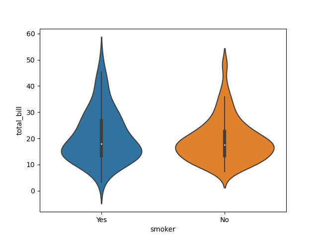

# 数据可视化与matplotlib


## 数据可视化概述

### 什么是数据可视化

> 数据可视化有着非常久远的历史，最早可以追溯至10世纪，至今已经**应用和发展了数百年**
> 
> 数据可视化旨在借助图形化的手段，将**一组数据以图形的形式表示**，并利用数据分析和开发工具发现其中未知信息的处理过程。
> 
> 可视化其实是一个**抽象**的过程，它可以简单地理解为将一个不易描述的事物形成一个可感知画面的过程，也就是从数据空间到图形空间的**映射**。
> 
> *无论原始数据被映射为哪种图形数据，最终要达到的目的只有一个，便是准确地、高效地、全面地传递信息，进而建立起数据间的关系，使人们发现数据间的**规律**和**特征**，并挖掘出**有价值的信息**，提高**数据沟通的效率**。*
> 
> <u>
> 总结：用图表让数据说话
> </u>

综上所述，数据可视化是数据分析工作中重要的一环，对数据潜在价值的挖掘有着深远的影响。随着数据可视化**平台的拓展**、**表现形式的变化**，以及实时**动态效果**、**用户交互**使用等功能的增加，数据可视化的内涵正在不断扩大，相信数据可视化的应用领域会越来越广泛。

### 常见的数据可视化方式

- **折线图**
  
  能够清晰地展示数据增减的趋势、速率、规律及峰值等特征

- **柱形图**

- **条形图**

- **堆积图**
  
  堆积图可分为堆积面积图、堆积柱形图和堆积条形图
  
  

- **直方图**
  
  > 柱形图与直方图的区别包括以下两点：
  > 
  > - 柱形图用于展示离散型数据的分布，而直方图用于展示连续性数据的分布；
  > 
  > - 柱形图的各矩形条之间具有固定的间隙，而直方图的各矩形条之间没有任何间隙。

- **箱形图**
  
  箱形图又称盒须图、箱线图，是一种利用数据中的**5个统计量——最小值、下四分位数、中位数、上四分位数和最大值**，描述数据的图表，主要用于反映一组或多组数据的对称性、分布程度等信息，因形状如箱子而得名。
  
  


- **饼图**

- **散点图**
  
  > 散点图中数据点的分布情况可以体现**变量之间的相关性**。
  > 
  > - 若所有的数据点在一条直线附近呈波动趋势，说明变量之间是线性相关的；
  > 
  > - 若数据点在曲线附近呈波动趋势，说明变量之间是非线性相关的；
  > 
  > - 若数据点没有显示任何关系，说明变量之间是不相关的。

- **气泡图**
  
  气泡图是散点图的变形，它是一种能够展示多变量关系的图表。

- **误差棒图**

- **雷达图**
  
  雷达图又称蜘蛛网图、星状图、极区图，由一组坐标轴和多个等距同心圆或多边形组成，是一种表现多维(4维以上)数据的图表。

- **统计地图**

- **3D图表**

### 常见的数据可视化库

> Python数据分析的三剑客 Numpy,pandas,Matplotlib

常见的数据可视化库包括matplotlib seaborn ggplot bokeh pygal pyrcharts

1. **matplotlib**
   
   是众多Python数据可视化库的鼻祖，其设计风格与20世纪80年代设计的商业化程序语言MATLAB十分接近，具有很多强大且复杂的可视化功能。matplotlib包含多种类型的API，可以采用**多种方式绘制图表并对图表进行定制**。

2. **seaborn**
   
   是基于matplotlib进行高级封装的可视化库，它支持**交互式界面**，使得绘制图表的功能变得愈加容易，且图表的色彩更具有吸引力，可以画出丰富多样的统计图表。

3. **ggplot**
   
   是基于matplotlib并旨在以简单方式提高matplotlib可视化感染力的库，它**采用叠加图层的形式绘制图形**，<u>例如先绘制坐标轴所在的图层，再绘制点所在的图层，最后绘制线所在的图层，但其并不适合于个性化定制图形。</u>

4. **bokeh**
   
   是一个交互式的可视化库，它支持**使用Web浏览器**展示，可使用快速简单的方式将大型数据集转换成高性能的、可交互的、结构简单的图表。

5. **pygal**
   
   是一个可缩放矢量图表库，用于生成可在浏览器中打开的SVG格式的图表，这种图表可以在不同比例的屏幕上自动缩放，方便用户交互

6. **pyecharts**
   
   是一个生成**Echarts**(Enterprise Charts,商业产品图表)图表的库，太生成的Echarts图表凭借良好的交互性、精巧的设计得到了众多开发者的认可。

### 初识matplolib

matplotlib是一个由John D.Hunter等人员开发的，主要用于**绘制2D图表**的Python库；支持**numpy pandas的数据结构**，具有绘制丰富的图表、定制图标元素或样式的功能。还可用于绘制一些3D图表。

matplotlib官网提供了三种API：pyplot API object-oriented API pylab API

- **pyplot API**
  
  使用pyplot模块开发的接口，该接口封装了一系列与MATLAB命令同名的函数，使用这些函数可以像使用MATLAB命令一样地快速地绘制图表

- **object-oriented API**
  
  是面向对象的接口，该接口封装了一系列对应图表元素的类，只有创建这些类的对象并按照隶属关系组合到一起才能完成一次完整的绘图

- **pylab API**
  
  是使用pylab模块开发的接口，它最初是为了模仿MATLAB的工作方式而设计的，包括pyplot numpy模块及一些其他附加功能，适用于Python交互环境中
  
  > matplotlib官方不建议使用pylab API进行开发，并在最新的版本中弃用了pylab API。用户在使用时可以根据自身的实际情况进行选择，若只是需要快速地绘制图表，可以选择pyplot API进行开发；若需要自定义图表，可以选择object-oriented API进行开发。

### 使用matplolib绘制图表

结合面向对象的方式绘制

```python
import numpy as np
import matplotlib.pyplot as plt
data = np.array([1, 2, 3, 4, 5]) # 准备数据
fig = plt.figure()               # 创建画布
ax = fig.add_subplot(111)        # 添加绘图区域
ax.plot(data)                    # 绘制图表
plt.show()                       # 展示图表
```


使用pyplot的绘图函数快速地绘制同一个图表

```python
import numpy as np
import matplotlib.pyplot as plt
data = np.array([1, 2, 3, 4, 5])  # 准备数据
# 在当前画布的绘图区域中绘制图表
plt.plot(data)
plt.show()                        # 展示图表
```

> 使用matplolib绘制的图形主要由三层组成：*容器层、图像层和辅助显示层*
> 
> - 容器层
>   
>   主要由**Canbas**对象、**Figure**对象、**Axes**对象组成
> 
> - 图像层
>   
>   指绘图区域内绘制的图形
> 
> - 辅助显示层
>   
>   指绘图区域内除所绘图形之外的**辅助元素**，包括坐标轴、标题、图例、注释文本等
>   
>   > 关于**Canbas**对象、**Figure**对象、**Axes**对象的结构如图所示
>   > 
>   > 
>   > 

>   > 
>   > Axes对象拥有属于自己的坐标系，它可以是直角坐标系，即包含x轴和y轴的坐标系，也可以是三维坐标系(Axes的子类Axes3D对象)，即包含x轴、y轴、z轴的坐标系。
>   
>   *图像层和辅助显示层所包含的内容都位于Axes类对象之上，都属于图表的元素*

# axes 相关属性设置

## 基本

```python
Axes.plot    将y对x绘制为线条或标记。
Axes.errorbar    将y与x绘制为带有错误栏的线和/或标记。
Axes.scatter    y与y的散点图
Axes.plot_date    绘制强制轴以将浮点数视为日期的图。
Axes.step    绘制一个阶梯图。
Axes.loglog    在x轴和y轴上使用对数缩放绘制图。
Axes.semilogx    在x轴上绘制具有对数比例的图。
Axes.semilogy    用y轴上的对数比例绘制图。
Axes.fill_between    填充两条水平曲线之间的区域。
Axes.fill_betweenx    填充两条垂直曲线之间的区域。
Axes.bar    绘制条形图。
Axes.barh    绘制水平条形图。
Axes.bar_label    标记条形图。
Axes.stem    创建一个茎图。
Axes.eventplot    在给定位置绘制相同的平行线。
Axes.pie    绘制饼图。
Axes.stackplot    绘制堆积面积图。
Axes.broken_barh    绘制矩形的水平序列。
Axes.vlines    在每个x上绘制从ymin到ymax的垂直线。
Axes.hlines    在从xmin到xmax的每个y上绘制水平线。
Axes.fill    绘制填充的多边形。
```

## 跨度 / 光谱 / 填充 / 2D数组

```python
Axes.axhline    在轴上添加一条水平线。
Axes.axhspan    在轴上添加水平跨度（矩形）。
Axes.axvline    在轴上添加一条垂直线。
Axes.axvspan    在轴上添加垂直跨度（矩形）。
Axes.axline    添加无限长的直线。

Axes.acorr    绘制x的自相关。
Axes.angle_spectrum    绘制角度光谱。
Axes.cohere    绘制x和y之间的相干性。
Axes.csd    绘制交叉光谱密度。
Axes.magnitude_spectrum    绘制幅度谱。
Axes.phase_spectrum    绘制相位谱。
Axes.psd    绘制功率谱密度。
Axes.specgram    绘制频谱图。
Axes.xcorr    绘制x和y之间的互相关。

Axes.clabel    标注等高线图。
Axes.contour    绘制轮廓线。
Axes.contourf    绘制填充轮廓。

Axes.imshow    将数据显示为图像，即在2D常规栅格上。
Axes.matshow    将2D矩阵或数组的值绘制为颜色编码的图像。
Axes.pcolor    创建具有非规则矩形网格的伪彩色图。
Axes.pcolorfast    创建具有非规则矩形网格的伪彩色图。
Axes.pcolormesh    创建具有非规则矩形网格的伪彩色图。
Axes.spy    绘制2D阵列的稀疏模式。
```

## 坐标轴外部

```python
Axes.axis    获取或设置某些轴属性的便捷方法。
Axes.set_axis_off    关闭x和y轴。
Axes.set_axis_on    开启x和y轴。
Axes.set_frame_on    设置是否绘制轴矩形补丁。
Axes.get_frame_on    获取是否绘制了轴矩形补丁。
Axes.set_axisbelow    设置轴刻度线和网格线是在图上方还是下方。
Axes.get_axisbelow    获取轴刻度和网格线是在图上方还是下方。
Axes.grid    增加网格线。
Axes.get_facecolor    获取轴的表面色。
Axes.set_facecolor    设置轴的表面色。
```

## 轴的范围 / 方向 / 标签 / 标题 / 图例

```python
Axes.invert_xaxis    反转x轴。
Axes.xaxis_inverted    返回x轴是否沿“反”方向定向。
Axes.invert_yaxis    反转y轴。
Axes.yaxis_inverted    返回y轴是否沿“反”方向定向。
Axes.set_xlim    设置x轴范围。
Axes.get_xlim    返回x轴范围。
Axes.set_ylim    设置y轴范围。
Axes.get_ylim    返回y轴范围。
Axes.set_xbound    设置x轴的上下边界。
Axes.get_xbound    以递增顺序返回x轴的上下边界。
Axes.set_ybound    设置y轴的上下边界。
Axes.get_ybound    以递增顺序返回y轴的上下边界。

Axes.set_xlabel    设置x轴的标签。
Axes.get_xlabel    获取xlabel文本字符串。
Axes.set_ylabel    设置y轴的标签。
Axes.get_ylabel    获取ylabel文本字符串。
Axes.set_title    为轴设置标题。
Axes.get_title    获取轴标题。
Axes.legend    在轴上放置一个图例。
Axes.get_legend    返回Legend实例，如果未定义图例，则返回None。
Axes.get_legend_handles_labels    返回图例的句柄和标签


Axes.set_xscale    设置x轴比例。
Axes.get_xscale    返回xaxis的比例尺（以str表示）。
Axes.set_yscale    设置y轴比例。
Axes.get_yscale    返回yaxis的比例尺（以str表示）。


Axes.set_xticks    设置xaxis的刻度位置。
Axes.get_xticks    返回数据坐标中xaxis的刻度位置。
Axes.set_xticklabels    使用字符串标签列表设置xaxis的标签。
Axes.get_xticklabels    获取xaxis的刻度标签。
Axes.get_xmajorticklabels    返回xaxis的主要刻度标签，作为的列表Text。
Axes.get_xminorticklabels    返回xaxis的次刻度标签，作为的列表Text。
Axes.get_xgridlines    返回xaxis的网格线作为Line2Ds的列表。
Axes.get_xticklines    以x的列表形式返回xaxis的刻度线Line2D。
Axes.xaxis_date    设置轴刻度和标签，以将沿x轴的数据视为日期。
Axes.set_yticks    设置yaxis的刻度位置。
Axes.get_yticks    返回数据坐标中yaxis的刻度位置。
Axes.set_yticklabels    使用字符串标签列表设置yaxis标签。
Axes.get_yticklabels    获取yaxis的刻度标签。
Axes.get_ymajorticklabels    返回yaxis的主要刻度标签，作为的列表Text。
Axes.get_yminorticklabels    返回yaxis的次要刻度标签，作为的列表Text。
Axes.get_ygridlines    返回yaxis的网格线作为Line2Ds的列表。
Axes.get_yticklines    返回yaxis的刻度线作为Line2Ds的列表。
Axes.yaxis_date    设置轴刻度和标签，以将沿y轴的数据视为日期。
Axes.minorticks_off    去除轴上的细小滴答声。
Axes.minorticks_on    在轴上显示较小的刻度。
Axes.ticklabel_format    配置ScalarFormatter默认情况下用于线性轴。
Axes.tick_params    更改刻度线，刻度线标签和网格线的外观。
```

## 投影

```python
Axes.get_xaxis_transform    获取用于绘制x轴标签，刻度线和网格线的转换。
Axes.get_yaxis_transform    获取用于绘制y轴标签，刻度线和网格线的转换。
Axes.get_data_ratio    返回缩放数据的纵横比。
```

# 使用matplotlib绘制简单图表

认识图表常用的辅助元素


```python
# 显示中文
plt.rcParams['font.sans-serif']=['SimHei']
plt.rcParams['axes.unicode_minus']=False
```

## 1. 绘制折线图

使用pyplot的plot()函数可以快速地绘制折线图

```python
plot(x,y,fmt,scalex = True,scaley = True,data = None,label = None,
*args,**kwargs)
```

- x：表示x轴的数据，默认值为range(len(y))

- y：表示y轴的数据

- fmt：表示快速设置线条样式的格式字符串 如：fmt = 'bo-'

- label：表示应用于图例的标签文本

tips: 使用help(plt.plot)参考plot()函数的用法(其他函数用法相同)

*plot()函数会返回一个包含Line2D类对象(代表线条)的列表*

使用该函数还可以绘制具有**多条线条的折线图**，通过以下任意一种方式均可以完成

```python
plt.plot(x1,y1)
plt.plot(x2,y2)
```

```python
plt.plot(x1,y1,x2,y2)
```

```python
arr = np.array([[1, 2, 3],
                [4, 5, 6],
                [7, 8, 9],
                [10, 11, 12]])
plt.plot(arr[0],arr[1:])
```

## 2. 绘制柱形图或堆积柱形图

使用pyplot的bar()函数可以快速地绘制柱形图或堆积柱形图

```python
bar(x,height,width = 0.8,bottom = None,align = 'center',tick_label 
    = None,xerr = None, yerr = None,**kwargs)
```

- x: 表示柱形的x坐标值

- height: 表示柱形的高度

- width: 表示柱形的宽度 默认为0.8

- bottom: 表示柱形底部的y值 默认为0

- align: 决定x值位于柱状图的位置 有两个可选项{"center", "edge"} 默认认为'center'

- tick_label: 表示柱形对应的刻度标签

- xerr, yerr: 若未设为None 则需要为柱形图添加水平\垂直误差棒
  
  > **绘制有一组柱形的柱形图**
  > 
  > ```python
  > x = np.arange(5)
  > y1 = np.array([10, 8, 7, 11, 13])
  > # 柱形的宽度
  > bar_width = 0.3
  > # 绘制柱形图
  > plt.bar(x,y1,tick_label = ['a','b','c','d','e'],width = bar_width)
  > ```
  >   
  > 
  > 
  > **绘制有两组柱形的柱形图**
  > 
  > ```python
  > x = np.arange(5)
  > y1 = np.array([10, 8, 7, 11, 13])
  > y2 = np.array([9, 6, 5, 10, 12])
  > # 柱形的宽度
  > bar_width = 0.3
  > # 根据多组数据绘制柱形图
  > plt.bar(x,y1,tick_label = ['a','b','c','d','e'],width = bar_width)
  > plt.bar(x+bar_width,y2,width = bar_width)
  > ```
  > 
  > 
  > 
  > **绘制堆积柱形图**
  > 
  > 在使用bar()函数绘制图表时，可以通过给该函数的bottom参数传值的方式控制柱形的y值，使后绘制的柱形位于先绘制的柱形的上方
  > 
  > ```python
  > plt.bar(x,y1,tick_label = ['a','b','c','d','e'],width = bar_width)
  > plt.bar(x,y2,bottom = y1,width = bar_width)
  > ```
  > 
  > 
  > 
  > 有误差棒的堆积柱形图
  > 
  > ```python
  > error = [2, 1, 2.5, 2, 1.5]
  > plt.bar(x,y1,tick_label = ['a','b','c','d','e'],width = bar_width)
  > plt.bar(x,y1,bottom = y1,width = bar_width,yerr = error)
  > ```

## 3. 绘制条形图或堆积条形图

使用 pyplot 的 **barh 函数**可以快速地绘制条形图或堆积条形图

```python
barh(y, width, height = 0.8, left = None, align = 'center', *, **kwargs    )
```

- y: 表示条形的 y 值

- width: 表示条形的宽度

- height: 表示条形的高度，默认值为 0.8

- left: 条形左侧的 x 坐标值，默认值为 0

- align: 表示条形的对齐方式，默认值为 "center", 即条形与刻度线居中对齐

- tick_label: 表示条形对应的刻度标签

- xerr, yerr: 若未设为 None, 则需要为条形图添加水平/垂直误差棒

> **绘制有一组条形的条形图**
> 
> ```python
> y = np.arange(5)
> x1 = np.array([10, 8, 7, 11, 13])
> # 条形的高度
> bar_height = 0.3
> # 绘制条形图
> plt.barh(y, x1, tick_label = ['a', 'b', 'c', 'd', 'e'], height = bar_height)
> ```
> 
> 
> 
> **绘制有两组条形的条形图**
> 
> ```python
> y = np.arange(5)
> x1 = np.array([10, 8, 7, 11, 13])
> x2 = np.array([9, 6, 5, 10, 12])
> bar_height = 0.3
> plt.barh(y, x1, tick_label = ['a', 'b', 'c', 'd', 'e'], height = bar_height)
> plt.barh(y + bar_height, x2, height = bar_height)
> ```
> 
> 
> 
> **绘制堆积条形图**
> 
> 在使用 barh() 函数绘制图表时，可以通过给 **left 参数**传值的方式控制条形的 x 值，使后绘制的条形位于先绘制的条形右方
> 
> ```python
> plt.barh(y, x1, tick_label = ['a', 'b', 'c', 'd', 'e'], height = bar_height)
> plt,barh(y, x2, left = x1, height = bar_height)
> ```
> 
> 
> **绘制有误差棒的条形图**
> 
> 在使用 barh() 函数绘制图表时，可以通过给 **xerr()、yerr 参数**传值的方式为条形添加误差棒
> 
> ```python
> # 偏差数据
> error  = [2, 1, 2.5, 2, 1.5]
> plt.barh(y, x1, tick_label = ['a', 'b', 'c', 'd', 'e'], height = bar_height)
> plt,barh(y, x2, left = x1, height = bar_height)
> ```

## 4. 绘制堆积面积图

使用 pyplot 的 **stackplot() 函数**可以快速地绘制堆积面积图

`staclplot(x, y, labels = (), baseline = 'zero', data = None, *args, **kwargs)`

- x: 表示 x 轴的数据，可以是一维数组

- y: 表示 y 轴的数据，可以是二维数组或一维数组序列

- labels: 表示每个填充区域的标签

- baseline: 表示计算基线的方法，包括 zero、sym、wiggle 和 weighted_wiggle。其中 zero 表示恒定零基线，即简单的叠加图；sym 表示对称零基线；wiggle 表示最小化平方斜率之和；weighted_wiggle 表示执行相同的操作，但权重用于说明每层的大小

> **绘制有三个填充区域堆叠的堆积面积图**
> 
> ```python
> x = np.arange(6)
> y1 = np.array([1, 4, 3, 5, 6, 7])
> y2 = np.array([1, 3, 4, 2, 7, 6])
> y3 = np.array([3, 4, 3, 6, 5, 5])
> plt.stackplot(x, y1, y2, y3)
> ```
> 
> 

**注意：堆积面积图必须确保数据分类可叠加，如下图为错误示例，图中类别之间存在相互包含关系**


## 5. 绘制直方图

使用 pyplot 的 **hist() 函数**可以快速地绘制直方图

`hist(x, bins = None, range = None, density = None, weight = None, bottom = None, **kwargs)`

- x: 表示 x 轴的数据

- bins: 表示矩形条的个数，默认为10

- range: 表示数据的范围，若未设置范围，默认数据范围为 (x.min(), x.max())

- cumulative: 表示是否计算累计频数或频率

- histtype: 表示直方图的类型，支持 'bar'、'barstacked'、'step'、'stepfilled' 四种取值，其中 'bar' 为默认值，代表传统的直方图；'barstacked' 代表堆积直方图；'step' 代表未填充的线条直方图；'stepfilled' 代表填充的线条直方图

- align: 表示矩形条边界的对齐方式，可设置为 'left'、'mid' 或 'right'，默认为 'mid'

- orientation: 表示矩形条的摆放方式，默认为 'vertical'，即垂直方向

- rwidth; 表示矩形条宽度的百分比，默认为 0；若 histtype 的值为 'step' 或 'stepfilled'，则直接忽略 rwidth 参数的值

- stacked: 表示是否将多个矩形条以堆叠形式摆放

> **绘制填充的线条直方图**
> 
> ```python
> # 准备50个随机测试数据
> scores = np.random.randint(0, 100, 50)
> plt.hist(scores, bins = 8, histtype = 'stepfilled')
> ```
> 
> 
> 
> ***实例：人脸识别的灰度直方图***
> 
> > **灰度直方图**是实现人脸识别的方法之一，它将数字图像的所有像素按照灰度值的大小统计其出现的频率
> 
> 本实例要求使用一组10000个随机数作为人脸图像的灰度值，使用 hist()函数绘制下图所示的灰度直方图
> 
> ```python
> # 10000个随机数
> random_state = np.random.RandonState(19680801)
> radom_x = random_state.randn(10000)
> plt.hist(radom_x, bins = 25)
> ```
> 
> 

## 6. 绘制饼图或圆环图

使用 pyplot 的 **pie() 函数**可以快速地绘制饼图或圆环图

`pie(x, explode = None, labels = None, autopct = None, pctdistance = 0.6, startangle = None, *, data = None)`

- x: 表示扇形或楔形的数据

- explode: 表示扇形或楔形离开圆心的距离

- labels: 表示扇形或楔形对应的标签文本

- autopct: 表示控制扇形或楔形的数值显示的字符串，可通过格式字符串指定小数点后的位数

- pctdistance: 表示扇形或楔形对应的数值标签距离圆心的比例，默认为 0.6

- shadow: 表示是否显示阴影

- labeldistance: 表示标签文本的绘制位置（相对于半径的比例），默认为 1.1

- startangle: 表示起始绘制角度，默认从 x 轴的正方向逆时针绘制

- radius: 表示扇形或楔形围成的圆形半径

- wedgeprops: 表示控制扇形或楔形属性的字典

- textprops: 表示控制图表中文本属性的字典

- center: 表示图表的中心点位置，默认为 (0, 0)

- frame: 表示是否显示图框

> **绘制饼图**
> 
> ```python
> data = np.array([20, 50, 10, 15, 30, 55])
> pie_labels = np.array(['A', 'B', 'C', 'D', 'E', 'F'])
> # 绘制：半径为0.5；数值保留1位小数
> plt.pie(data, radius = 1.5, labels = pie_labels, autopct = '%3.1f%%')
> ```
> 
> 
> 
> **绘制圆环图**
> 
> ```python
> data = np.array([20, 50, 10, 15, 30, 55])
> pie_labels = np.array(['A', 'B', 'C', 'D', 'E', 'F'])
> plt.pie(data, radius = 1.5, wedgeprops = {'width': 0.7}, labels = pie_labels, autopct = '%3.1f%%', pctdistance = 0.75)
> ```
> 
> 

## 7. 绘制散点图或气泡图

使用 pyplot 的 **scatter() 函数**可以快速绘制散点图或气泡图

`scatter(x, y, s = None, c = None, marker = None, cmap = None, linewidths = None, edgecoloes = None, *, **kwargs)`

- x, y: 表示数据点的位置

- s: 表示数据点的大小

- c: 表示数据点的颜色

- marker: 表示数据点的样式，默认为圆形

- alpha: 表示透明度，可以取值为 0-1

- linewidths: 表示数据点的描边宽度

- edgecolors: 表示数据点的描边颜色

> **绘制散点图**
> 
> ```python
> num = 50
> x = np.random.rand(num)
> y = np.random.rand(num)
> plt.scatter(x, y)
> ```
> 
> 
> 
> **绘制气泡图**
> 
> ```python
> num = 50
> x = np.random.rand(num)
> y = np.random.rand(num)
> area = (30 * np.random.rand(num)) ** 2
> plt.scatter(x, y, s = area)
> ```
> 
> 

## 8. 绘制箱形图

使用 pyplot 的 **boxplot() 函数**绘制箱形图

`boxplot(x, notch = None, sym = None, vert = None, whis = None, position = None, widths = None, *, data = None)`

- x: 绘制箱形图的数据

- sym: 表示异常值对应的符号，默认为空心圆圈

- vert: 表示是否将箱形图垂直摆放，默认为垂直摆放

- whis: 表示箱形图上下须与上下四分位的距离，默认为 1.5 倍的四分位差

- positions: 表示箱体的位置

- widths: 表示箱体的宽度，默认为 0.5

- patch_artist: 表示是否填充箱体的颜色，默认不填充

- meanline: 是否用横跨箱体的线条标出平均线，默认不使用

- showeaps: 表示是否显示箱体顶部和底部的横线，默认显示

- showbox: 表示是否显示箱形图的箱体，默认显示

- labels: 表示箱形图的标签

- boxprops: 表示控制箱体属性的字典

> **绘制不显示异常值的箱形图**
> 
> ```python
> data = np.random.randn(100)
> plt.boxplot(data, meanline = True, widths = 0.3, patch_artist = True, showfliers = False)
> ```
> 
> 

## 9. 绘制雷达图

使用 pyplot 的 **polar() 函数**绘制雷达图

`polar(thera, r, **kwargs)`

- theta: 表示每个数据点所在射线与极径的夹角

- r: 表示每个数据点到原点的距离

## 10. 绘制误差棒图

使用 pyplot 的 **errorbar 函数**绘制

`errorbar(x, y, yerr = None, xerr = None, fmt = '', ecolor = None, *, data = None, **kwargs)`

- x, y: 表示数据点的位置

- xerr, yerr: 表示数据的误差范围

- fmt: 表示数据点的标记样式和数据点之间连接线的样式

- elinewidth: 表示误差棒的线条宽度

- capsize: 表示误差棒边界横杆的大小

- capthick: 表示误差棒边界横杆的厚度

> **绘制误差棒图**
> 
> ```python
> x = np.arange(5)
> y = (25, 32, 34, 20, 25)
> y_offset = (3, 5, 2, 3, 3)
> plt.errorbar(x, y, yerr = y_offset, capsize = 3, capthick = 2)
> ```
> 
> 

## 11. 双轴图

```python
import matplotlib.mlab as mlab
fig = plt.figure(figsize = (16, 9))
ax1 = fig.add_subplot(111)
n, bins, patches = ax1.hist(df['评分'], bins = 100, color = 'm)

ax1.set_ylabel('电影数量', fontsize = 15)
ax1.set_xlabel('评分', fontsize = 15)
ax1.set_title('频率分布图', fontsize = 20)

y = mlab.normdf(bins, df['评分'].mean(), df['评分'].std())
ax2 = ax1.twinx()
ax2.plot(bins, y, 'b--')
ax2.set_ylabel('概率分布', fontsize = 15)
plt.show()
```


## 12. 热力图

`plt.imshow(X, cmap=None, norm=None, aspect=None, interpolation=None, alpha=None, vmin=None, vmax=None, origin=None, extent=None, shape=None, filternorm=1, filterrad=4.0, imlim=None, resample=None, url=None, hold=None, data=None, **kwargs)plt.colorbar(cax=None,ax=None,shrink=0.5)`

可设置Bar为一半长度。  

- Colormap：参数cmap用于设置热图的Colormap。（参考百度百科） 
  Colormap是MATLAB里面用来设定和获取当前色图的函数，可以设置如下色图： 
  
  - hot 从黑平滑过度到红、橙色和黄色的背景色，然后到白色。 
  
  - cool 包含青绿色和品红色的阴影色。从青绿色平滑变化到品红色。  gray 返回线性灰度色图。 
  
  - bone 具有较高的蓝色成分的灰度色图。该色图用于对灰度图添加电子的视图。 
  
  - white 全白的单色色图。 
  
  - spring 包含品红和黄的阴影颜色。
  
  - summer 包含绿和黄的阴影颜色。 
  
  - autumn 从红色平滑变化到橙色，然后到黄色。 
  
  - winter 包含蓝和绿的阴影色。

- interpolation=’nearest’是把相邻的相同的颜色连成片

## 选择正确的可视化图表


- **基于比较关系**
  
  

- **基于分布关系**
  
  

- **基于构成关系**
  
  

- **基于联系关系**
  
  

# 图表辅助元素的定制

## 认识图表常用的辅助元素

图表的**辅助元素**是指除了根据数据绘制的图形之外的元素，常用的辅助元素包括坐标轴、标题、图例、网格、参考线、参考区域、注释文本和表格，它们都可以**对图形进行补充说明**


坐标轴是由**刻度标签、刻度线** (主刻度线和次刻度线)、**轴脊**和**坐标轴标签**组成


- "x轴" 为**坐标轴的标签**

- "0" - "7" 均为**刻度标签**

- "0" - "7"  对应的**短竖线**为**刻度线**，且为**主刻度线**

- 刻度线上方的**横线**为**轴脊**
  
  > matplotlib 中的次刻度线默认是隐藏的

> **不同的图表具有不同的辅助元素**，比如饼图是没有坐标轴的，而折线图是由坐标轴的

## 设置坐标轴的标签、刻度范围和刻度标签

### 1. 设置坐标轴的标签

- 使用 pyplot 模块的 **xlabel()** 函数设置 x 轴的标签
  
  `xlabel(xlabel, fontdict = None, labelpad = None, **kwargs)`
  
  - xlabel: 表示 x 轴标签的文本
  
  - fontdict: 表示控制标签文本样式的字典；如: `fontdict = dict(fontsize = 16, color = 'r', weight = 'light', style = 'italic', rotation = 60)`
  
  - labelpad: 表示标签与 x 轴轴脊间的距离

- 使用 pyplot 模块的 **ylabel()** 函数设置 y 轴的标签
  
  `ylabel(ylabel, fontdict = None, labelpad = None, **kwargs)`
  
  - ylabel: 表示 y 轴标签的文本
  
  - fontdict: 表示控制标签文本样式的字典
  
  - labelpad: 表示标签与 y 轴轴脊的距离

- > **Axes** 对象使用 **set_xlabel() 方法**可以设置 x 轴的标签，使用 **set_ylabel() 方法**可以设置 y 轴的标签

### 2. 设置刻度范围和刻度标签

当绘制图表时，坐标轴的刻度范围和刻度标签都与数据的分布有着直接的联系，即**坐标轴的刻度范围**取决于数据中的**最大值和最小值**

> 若没有指定任何数据，x 轴和 y 轴的刻度范围为 0.05-1.05，刻度标签为 [-0.2, 0, 0.2, 0.4, 0.6, 0.8, 1.0, 1.2]
> 
> 若指定了数据，刻度范围和刻度标签会随着数据的变化而变化

- 使用 pyplot 模块的 **xlim()** 和 **ylim()** 函数分别设置或获取 x 轴和 y 轴的刻度范围
  
  `xlim(left = None, right = None, emit = True, auto = False, *, xmin = None, xmax = None)`
  
  - left: 表示 x 轴刻度取值区间的左位数
  
  - right: 表示 x 轴刻度取值区间的右位数
  
  - emit: 表示是否通知限制变化的观察者，默认为 True
  
  - auto: 表示是否允许自动缩放 x 轴，默认为 True

- 使用 pyplot 模块的 **xticks()** 或 **yticks()** 函数设置 x 轴或 y 轴的刻度线位置和刻度标签
  
  `xticks(ticks = None, labels = None, **kwargs)`
  
  - ticks: 表示刻度显示的位置列表，该参数可以设置为空列表，以此禁用 x 轴的刻度
  
  - labels: 表示指定位置刻度的标签列表
  
  > 此外，Axes 对象可以使用 **set_xticks()** 或 **set_yticks()** 方法设置 x 轴或 y 轴的刻度线位置，使用 **set_xticklabels()** 或 **set_yticklabels()** 方法设置 x 轴或 y 轴的刻度标签

### 3. 添加标题和图例

- 使用 pyplot 模块的 **title()** 函数添加图表标题
  
  `title(label, fontdict = None, loc = 'center', pad = None, **kwargs)`
  
  - label: 表示标题的文本
  
  - fontdict: 表示控制标题文本样式的字典
  
  - loc: 表示标题的对齐样式；包括 'left'、'center' (默认)、'right' 三种取值
  
  - pad: 表示标题与图表顶部的距离，默认为 None
    
    > Axes 对象还可以使用 **set_title()** 方法为图表添加标题

- 使用 pyplot 模块的 **legend()** 函数添加图例
  
  > **什么是图例**
  > 
  > 图例是<u>一个列举的各组图形数据标识方式的方框图</u>，它由<u>图例标识</u>和<u>图例项</u>两部分构成，其中图例标识是代表各组图形的图案；图例项是与图例标识对应的名称
  
  `legend(handles, labels, loc, bbox_to_anchor, ncol, title, shadow, fancybox, *args, **kwargs)`
  
  - handles: 表示由图形标识构成的列表
  
  - labels: 表示由图例项构成的列表
  
  - loc: 用于控制图例在图表中的位置
  
  - ncol: 表示图例的列数， 默认值为1
  
  - title: 表示图例的标题，默认为 None
  
  - shadow: 表示是否在图例后面显示阴影，默认值为 None
  
  - fancybox: 表示是否为图例设置圆角边框，默认值为 None
  
  表    loc 参数的取值及其对应的图例位置
  
  | 位置编码 | 位置字符串          | 说明   |
  | ---- | -------------- | ---- |
  | 0    | 'best'         | 自适应  |
  | 1    | 'upper right'  | 右上方  |
  | 2    | 'upper left'   | 左上方  |
  | 3    | 'lower left'   | 左下方  |
  | 4    | 'lower right'  | 右下方  |
  | 5    | 'right'        | 右方   |
  | 6    | 'center left'  | 中心偏左 |
  | 7    | 'center right' | 中心偏右 |
  | 8    | 'lower center' | 中心偏下 |
  | 9    | 'upper center' | 中心偏上 |
  | 10   | 'center'       | 居中   |

### 4. 显示网格

网格是从刻度线开始延伸，贯穿至整个绘图区域的辅助线条，它能帮助人们轻松查看图形的数值；网格可以分为**垂直网格**和**水平网格**，这两种网格既可以单独使用，也可以同时使用

使用 pyplot 模块的 **grid()** 函数显示图表中的网格

`grid(b = None, which = 'major', axis = 'both', **kwargs)`

- b: 表示是否显示网格

- which: 表示显示网格的类型，默认为 major

- axis: 表示显示哪个方向的网格，默认为 both

- linewidth 或 lw: 网格线的宽度
  
  > 还可以使用 Axes 对象的 grid() 方法显示网格
  > 
  > 若坐标轴没有刻度，则将无法显示网格

### 5. 添加参考线和参考区域

参考线是一条或多条贯穿绘图区域的线条，用于为绘图区域中图形数据之间的比较提供参考依据，比如目标线、平均线、预算线等；参考线按方向的不同可分为**水平参考线**和**垂直参考线**

- 使用 pyplot 模块的 **axhline()** 函数为图表添加水平参考线
  
  `axhline(y = 0, xmin = 0, xmax = 1, linestyle = '-', **kwargs)`
  
  - y: 表示水平参考线的纵坐标
  
  - xmin: 表示水平参考线的起始位置，默认为 0
  
  - xmax: 表示水平参考线的终止位置，默认为 1
  
  - linestyle: 表示水平参考线的类型，默认为实线

- 使用 pyplot 模块的 **axvline()** 函数为图表添加垂直参考线
  
  `axvline(x = 0, ymin = 0, ymax = 1, linestyle = '-', **kwargs)`
  
  - x: 表示垂直参考线的横坐标
  
  - ymin: 表示垂直参考线的起始位置，默认为 0
  
  - ymax: 表示垂直参考线的终止位置，默认为 1
  
  - linestyle: 表示垂直参考线的类型，默认为实线

- 使用 pyplot 模块的 **axhspan()** 函数为图表添加水平参考区域
  
  `axhspan(ymin, ymax, xmin = 0, xmax = 1, **kwargs)`
  
  - ymin: 表示水平跨度的下限，以数据为单位
  
  - ymax: 表示水平跨度的上限，以数据为单位
  
  - xmin: 表示垂直跨度的下限，以轴为单位，默认为 0
  
  - xmax: 表示垂直跨度的上限，以轴为单位，默认为 1

- 使用 pyplot 模块的 **axvspan()** 函数为图表添加垂直参考区域
  
  `axvspan(xmin, xmax, ymin = 0, ymax = 1, **kwatgs)`
  
  - xmin: 表示垂直跨度的下限
  
  - xmax: 表示垂直跨度的上限

### 6. 添加注释文本

注释文本是图表的重要组成部分，它能够对图形进行简短地描述，有助于用户理解图表；注释文本按注释对象的不同主要分为**指向型注释文本**和**无指向型注释文本**，其中指向型注释文本一般是针对图表某一部分的特定说明，无指向型注释文本一般是针对图表整体的特定说明

- 指向型注释文本
  
  指向型注释文本是指通过指示箭头的注释方式对绘图区域的图形进行解释的文本，它一般使用线条连接说明点和箭头指向的注释文字
  
  使用 pyplot 模块的 **annotate()** 函数为图表添加指向型注释文本
  
  `annotate(s, xy, *args, **kwatgs)`
  
  - s: 表示注释文本的内容
  
  - xy: 表示被注释的点的坐标位置，接收元组 (x, y)
  
  - xytext: 表示注释文本所在的坐标位置，接收元组 (x, y)
  
  - arrowprops: 表示指示箭头的属性字典
  
  - bbox: 表示注释文本的边框属性字典
    
    > - **arrowprops** 参数接收一个包含若干键的字典，通过向字典中添加键值对以控制箭头的显示；常见的控制箭头的键包括 width、headwidth、headlength、shrink、arrowstyle 等
    > 
    > - 键 **arrowstyle** 代表箭头的类型，该键对应的值及其类型如图
    >   
    >   

- 无指向型注释文本
  
  无指向型注释文本是指仅使用文字的注释方式对绘图区域的图形进行说明的文本
  
  使用 pyplot 模块的 **text()** 函数为图表添加无指向型注释文本
  
  `text(x, y, s, fontdict = None, withdash =< deprecatedparameter>, **kwargs)`
  
  - x, y: 表示注释文本的位置
  
  - s: 表示注释文本的内容
  
  - horizontalalignment 或 ha: 表示水平对齐的方式，可以取值为 'center'、'right' 或 'left'
  
  - verticalalignment 或 va: 表示垂直对齐的方式，可以取值为 'center'、'top'、'bottom'、'baseline' 或 'center_baseline'

### 7. 添加表格

使用 pyplot 模块的 **table()** 函数为图表添加表格

`table(cellText = None, cellColours = None, cellLoc = 'right', colWidths = None, ..., **kwargs)`

- cellText: 表示表格单元格中的数据，可以是一个二维列表

- cellColours: 表示单元格的背景颜色

- cellLoc: 表示单元格文本的对齐方式，支持 'left'、'center'、'right' 三种取值，默认为 'right'

- colWidths: 表示每列的宽度

- rowLabels: 表示行标题的文本

- rowLoc: 表示行标题的对齐方式

- colLabels: 表示列标题的文本

- colColours: 表示列标题所在单元格的背景颜色

- colLoc: 表示列标题的对齐方式

- loc: 表示表格对于绘图区域的对齐方式

### 8. 设置图片大小

figure 图形图标的意思，在这里指的就是我们画的图

`plt.figure(figsize = (20, 8), dpi = 80)`

- figsize: 图片大小 （宽，高）

- dpi: 分辨率；每英寸点的个数

### 9. 图片的保存

`plt.savefig()`

- 传保存位置即可

- 保存 .svg (矢量图格式)

### 10. 图表距画布边缘间距

`plt.subplots_adjust(left, right, top, bottom)`

left, bottom 值越大，间距越大

right, top 值越小，间距越大

# 图表样式的美化

## 图表样式概述

1. 默认图表样式
   
   - matplotlib 在绘图的过程中会读取存储在本地的**配置文件 matplotlibrc**，通过 matplotlibrc 文件中的缺省配置信息指定**图表元素的默认样式**，完成图表元素样式的初始设置
   
   - 通过 **rc_params()** 函数可以查看 matplotlibrc 文件中全部的配置项
     
     > rc_params() 函数返回一个 RcParams 对象，其中字典的键为由配置要素 (如 ytick) 及其属性 (如right) 组成的**配置项**，值为配置项的默认值
   
   配置项按照作用对象的不同主要分为 10 种
   
   > 配置要素：
   > 
   > lines（线条）；xtick, ytick（刻度）
   > 
   > patch（图形）；grid（网格）
   > 
   > font（字体）；legend（图例）
   > 
   > text（文本）；figure（画布）
   > 
   > axes（坐标系）；savefig（保存图像）
   
   matplotlic 库载入时会主动调用 rc_params() 函数获取包含全部配置项的字典，并将该字典赋值给变量 rcParams，以便**用户采用访问字典 rcParams 的方式设置或获取配置项**
   
   如：`plt.rcParams['font.sans-serif'] = 'SimHei'`
   
   常用配置项
   
   | 配置项                           | 说明               | 默认值                                                                                                                                                                  |
   | ----------------------------- | ---------------- | -------------------------------------------------------------------------------------------------------------------------------------------------------------------- |
   | lines.color                   | 线条颜色             | 'C0'                                                                                                                                                                 |
   | lines.linestyle               | 线条类型             | '-'                                                                                                                                                                  |
   | lines.linewidth               | 线条宽度             | 1.5                                                                                                                                                                  |
   | lines.marker                  | 线条标记             | 'None'                                                                                                                                                               |
   | lines.markeredgecolor         | 标记边框颜色           | 'auto'                                                                                                                                                               |
   | lines.markeredgewidth         | 标记边框宽度           | 1.0                                                                                                                                                                  |
   | lines.markerfacecolor         | 标记颜色             | auto                                                                                                                                                                 |
   | lines.markersize              | 标记大小             | 6.0                                                                                                                                                                  |
   | font.family                   | 系统字体             | ['sans-serif']                                                                                                                                                       |
   | font.sans-serif               | 无衬线字体            | ['DejaVu Sans', 'Bitstream Vera Sans', 'Computer Modern Sans Serif', 'LucidaGrande', Verdana', 'Geneva', 'Lucid', 'Arial', 'Helvetica', 'Avant Garde', 'sans-serif'] |
   | font.size                     | 字体大小             | 10.0                                                                                                                                                                 |
   | font.style                    | 字体风格             | 'normal'                                                                                                                                                             |
   | axes.unicode_minus            | 采用 Unicode 编码的减号 | True                                                                                                                                                                 |
   | axes.prop_cycle               | 属性循环器            | cycler('color', ['#1f77b4'])                                                                                                                                         |
   | figure.constrained_layout.use | 使用约束布局           | False                                                                                                                                                                |

2. 图表样式修改
   
   matplotlib 通过灵活地修改配置项以改变图表的样式，而不必拘泥于系统默认的配置；图表的样式可以通过两种方式进行修改：**局部修改**和**全局修改**
   
   - 局部修改
     
     该方式是值**通过代码动态地修改 matplotlib 配置项**，此方式用于程序局部定制的需求；若希望局部修改图表的样式，可以通过以下任一种方式实现
     
     - 通过给绘图函数或设置图标元素函数的关键字参数传值来修改图表的样式
       
       如：`plt.plot([1, 2, 3], [3, 4, 5], linewidth = 3)` 将线条的宽度设为3
     
     - 通过 'rcParams[配置项]' 重新为配置项赋值来修改图表的样式
       
       如：`plt.rcParams['lines.linewidth'] = 3`
     
     - 通过给 rc() 函数的关键字参数传值来修改图表的样式
       
       如：`rc('lines', linewidth = 3)`
       
       > 方式一只能对某一图表中**指定元素的样式进行修改**，而方式二和方式三可以对**整个 py 文件中指定元素的样式进行修改**
   
   - 全局修改
     
     该方式是指**直接修改 matplotlibrc 文件的配置项**，此方式用于满足程序全局定制的需求，可以将指定的图表样式进行统一修改，无需每次在具体的程序中进行单独修改；matplotlib 使用 matplotlibrc 文件的路径搜索顺序：
     
     1）<u>当前工作路径</u>：程序运行的目录
     
     2）<u>用户配置路径</u>：通常位于 HOME/.matplotlib/ 目录中，可以通过环境变量 MATPLOTLIBRC 进行修改
     
     3）<u>系统配置路径</u>：位于 matplotlib 安装路径的 mpl-data 目录中
     
     使用 **matplotlib_fname()** 函数查看当前使用的 matplotlibrc 文件所在的路径

## 使用颜色

**图表在使用颜色时应遵循一定的基本规则**，既要避免使用过多的颜色，又要避免随意使用颜色，否则会直接影响可视化的效果且不易让人理解

> 合理使用颜色的基本规则
> 
> - 广泛的色调和亮度范围
> 
> - 遵循自然的颜色模式
> 
> - 尽量使用渐变色

matplotlib 的基础颜色主要有3种表示方式：**单词缩写或单词、十六进制或 HTML 模式、RGB 模式**

1. 单词缩写或单词表示的颜色
   
   matplotlib 中支持使用单词缩写或单词表示的8种颜色：**青色、洋红色、黄色、黑色、红色、绿色、蓝色、白色**
   
   | 单词缩写 | 单词      | 说明  |
   | ---- | ------- | --- |
   | c    | cyan    | 青色  |
   | m    | magenta | 洋红色 |
   | y    | yellow  | 黄色  |
   | k    | black   | 黑色  |
   | r    | red     | 红色  |
   | g    | green   | 绿色  |
   | b    | blue    | 蓝色  |
   | w    | white   | 白色  |

   

2. 十六进制/ HTML 模式表示的颜色
   
   该方式将这些颜色存储在 **colors.cnames 字典**中，可通过访问 colors.cnames 字典查看全部的颜色
   
   ```python
   for name, hex in matplotlib.colors.cnames.items()：
       print(name, hex)
   ```

3. RGB 模式表示的颜色
   
   **RGB 模式的三元组**表示颜色，其中元组的第1个元素代表红色值，第2个元素代表绿色值，第3个元素代表蓝色值，且每个元素的取值范围均是 [0, 1]

**使用颜色映射表**

- matplotlib 中内置了众多预定义的颜色映射表，使用这些颜色表可以为用户提供更多的颜色建议，节省大量的开发时间

- 通过 **colormaps()** 函数查看所有可用的颜色映射表

> 颜色映射表的名称分为**有 '_r' 后缀**和**无 '_r' 后缀**两种
> 
> 有后缀的颜色表相当于与同名
> 
> 无后缀的是**反转后的颜色表**

颜色映射表一般可以划分为以下3类：

1. **Sequential**: 表示同一颜色从低饱和度到高饱和度的单色颜色映射表

2. **Diverging**: 表示颜色从中间的明亮色过渡到两个不同颜色范围方向的颜色映射表

3. **Qualitative**: 表示可以轻易区分不同种类数据的颜色映射表

> 开发人员可以自定义新的颜色映射表，再通过 **matplotlib.cm.register_cmap()** 函数将自定义的颜色映射表添加到 matplotlib 中

matplotlib 主要有两种使用颜色映射表的方式

- 在调用函数或方法绘制图表或添加辅助元素时将颜色映射表传递给**关键字参数 cmap**
  
  `plt.scatter(x, y, c = np.random.rand(10), cmap = matplotlib.cm.jet)`

- 直接调用 **set_cmap()** 函数
  
  `plt.set_cmap(matplotlib.cm.jet)`


## 选择线型

- 图表中每个线条均具有不同的含义，一般可以通过颜色、宽度、类型来区分线条，其中类型是区分线条的常见方式之一

- matplotlib 中内置了4种线条的类型：**短虚线、点划线、长虚线**和**实线**


默认是**实线**

在使用函数方法绘制图形、显示网格或添加参考线时，将线型取值传递给 **linestyle / ls 参数**

## 添加数据标记

数据标记一般指代表**单个数据的圆点或其它符号**等，用于强数据点的位置，常见于折线图和散点图中

matplotlib 中内置了许多数据标记，使用这些数据标记可以便捷地为折线图或散点图标注数据点；数据标记可以分为**填充型数据标记**和**非填充型数据标记**


   

将标记取值传值给 **marker 参数**

还可以使用以下参数传值来**设置数据标记的属性**

- markerdgecolor 或 mec: 数据标记的边框颜色

- markerdgewidth 或 mew: 数据标记的边框宽度

- markerfacecolor 或 mfc: 数据标记的填充颜色

- markerfacecoloralt 或 mfcalt: 数据标记备用的填充颜色

- markersize 或 ms: 数据标记的大小

> matplotlib 在绘制折线图时，可以使用字符串分别为线条指定颜色、线型和数据标记这三种样式，但每次都需要分别给参数 color, linestyle, marker 传值进行一一设置，使得编写的代码过于繁琐；为此，matplotlib 提供了**由颜色、标记、线型构成的格式字符串**
> 
> **格式字符串**是快速设置线条基本样式的缩写形式的字符串
> 
> `'[颜色][标记][线型]'`
> 
> - 以上格式的每个选项都是可选的，选项之间组合的顺序也是可变的
> 
> - 颜色只能是字母缩写方式表示的颜色
> 
> - 若格式字符串中只有颜色一个选项，可以使用十六进制、单词拼写等其它形式表示的颜色

## 设置字体

不同的字体给人的直观感受不同，例如，宋体给人雅观、大气的感觉；黑体给人厚重、抢眼的感觉；由于每种字体具有不同的特点、使用场景，因此**合适的字体可以对图表起到很好的修饰作用**

> 合理使用字体的基本规则
> 
> - 英文注释文本均使用 **Arial, Helvetica, Times New Roman** 字体
> 
> - 中文注释文本均使用**宋体**或**黑体**，其中正文使用宋体，标题使用黑体
> 
> - 图表注释文本的最佳字体大小为 **8磅**
> 
> - 字体的颜色与背景**具有强对比度**

matplotlib **中文本是 text 模块的 Text 类对象**，通过 text(), annotate(), title() 等函数进行创建；Text 类中提供了一系列设置字体样式的属性，包括字体类别、字体大小、字体风格、字体角度等

表 Text 类的常用属性

| 属性                    | 说明                                                                                                                                                                      |
| --------------------- | ----------------------------------------------------------------------------------------------------------------------------------------------------------------------- |
| fontfamily 或 family   | 字体类别，支持具有的字体名称，也支持 'serif', 'sans-serif', 'cursive', 'fantasy', 'monospace' 中任一取值                                                                                       |
| fontsize 或 size       | 字体大小，可以是以点为单位，也可以是 'xx-small', 'x-small', 'small', 'medium', 'large', 'x-large', 'xx-large' 中任一取值                                                                       |
| fontstretch 或 stretch | 字体拉伸，取值范围 0-100，或是 'ultra-condensed', 'extra-condensed', 'condensed', 'semi-condensed', 'normal', 'semi-expanded', 'expanded', 'extra-expanded', 'ultra-expanded' 中任一取值 |
| fontstyle 或 style     | 字体风格，取值为 'normal', 'italic' (斜体), 'oblique' (倾斜)                                                                                                                        |
| fontvariant 或 variant | 字体变体，取值为 'normal', 'small-caps'                                                                                                                                         |
| fontweight 或 weight   | 字体粗细，取值范围 0-100，或是 'ultralight', 'light', 'normal', 'regular', 'book', 'medium', 'roman', 'semibold', 'demibold', 'demi', 'bold', 'heavy', 'extra bold', 'black' 中任一取值  |
| rotation              | 文字角度，支持角度值，也可以 'vertical', 'horizontal' 中任一取值                                                                                                                           |

> 上表中的属性也可以作为 **text(), annotate(), title() 函数的同名关键字参数**，以便用户在创建文本的同时设置字体的样式

中文字体


字体类别 (family)

默认 sans-serif (无衬线体)

serif (衬线体)

cursive (手写体)

fantasy (符号字体)

monospace (等宽字体)

matplotlib 中的 **rc** 函数

## 切换主题风格

matplotlib.style 模块中内置了一些图表的主题风格，通过切换不同的主题风格以满足用户的不同需求；所有的**主题风格都存储于 matplotlib 配置文件夹的 stylelib 目录中**，通过**访问 available 变量查看所有可用的主题风格**

使用 matplotlib 库中的 **use()** 函数切换主题风格

`use(style)`

以上函数的**参数 style 表示图表的主题风格**，它可以接收 matplotlib 中所有可用的主题风格的字符串，也可用**接收 'default' 来恢复默认的主题风格**

## 填充区域

matplotlib 中提供了多个函数用于填充多边形或区域，分别为 **fill(), fill_between(), fill_betweenx()**，其中 fill() 函数用于填充多边形，fill_between() 或 fill_betweenx() 函数分别用于填充两条水平曲线或垂直曲线之间的区域

- fill()
  
  `fill(*args, data = None, facecolor, edgecolor, linewidth, **kwargs)`
  
  - *args: x 坐标、y 坐标或颜色的序列
  
  - facecolor: 填充的背景颜色
  
  - edgecolor: 边框的颜色
  
  - linewidth: 边框的宽度

- fill_between()
  
  `fill_between(x, y1, y2 = 0, where = None, interpolate = False, step = None, data = None, **kwargs)`
  
  - x: x 轴坐标的序列
  
  - y1: 第一条曲线的 y 轴坐标
  
  - y2: 第二条曲线的 y 轴坐标
  
  - where: 布尔值，表示要填充区域的条件；y1 > y2 说明第一条曲线位于第二条曲线上方时填充；y1 < y2 说明第二条曲线位于第一条曲线上方时填充

- fill_betweenx()
  
  `fill_between(y, x1, x2 = 0, where = None, interpolate = False, step = None, data = None, **kwargs)`
  
  - y: y 轴坐标的序列
  
  - x1: 第一条曲线的 x 轴坐标
  
  - x2: 第二条曲线的 x 轴坐标
  
  - where: 布尔值，表示要填充区域的条件；x1 > x2 说明第一条曲线位于第二条曲线左方时填充；x1 < x2 说明第二条曲线位于第一条曲线右方时填充

# 子图的绘制及坐标轴共享

## 绘制固定区域的子图

### Jupyter Notebook 的绘图模式

当 Jupyter Notebook 工具运行 matplotlib 程序时，默认会以静态图片的形式显示运行结果，此时的图片不支持放大或缩小等交互操作；Jupyter notebook 支持两种绘图模式，分别为**控制台绘图**和**弹出窗绘图**

- 控制台绘图
  
  默认模式，该模式是将绘制的图表以静态图片的形式显示，具有便于存储图片、不支持用户交互的特点；开发者可以在 matplotlib 程序中添加 **`%matplotlib inline`语句**，通过控制台来显示图片

- 弹出窗绘图
  
  该模式是将绘制的图表以弹出窗口的形式显示，具有支持用户交互、支持多种图片存储格式的特点；开发者可以在 matplotllib 程序中添加 **`%matplotlib auto`或`%matplotlib notebook`语句**，通过弹出窗口来显示图片
  
  > matplotlib 程序添加完设置绘图模式的语句后，很有可能出现延迟设置绘图模式的现象；因此这里建议大家**重启服务**，即在 Jupyter Notebook 工具的菜单栏中**选择 【Kernel】- 【Restart】**，之后**在弹出的“重启服务？”窗口中选择【重启】即可**

### 绘制单子图

用户为了能深入理解数据的含义，通常会将数据以一组相关图表的形式并排地显示到同一平面上，以便于从多个角度比较和分析数据；基于上述需求，matplotlib 提供了一些**将整个画布规划成若干区域**，以及**在指定区域上绘制子图** (指每个区域上的图表) 的功能

matplotlib 可以将整个画布规划成等分布局的 **m\*n (行*列) 的矩阵区域**，并按照先行后列的方式**对每个区域进行编号** (编号从1开始)，之后在选中的某个或某些区域中绘制单个或多个子图


使用 pyplot 模块的 **subplot()** 函数绘制单子图

`subplot(nrows, ncols, index, projection, polar, sharex, sharey, **kwargs)`

- nrows: 表示规划区域的行数

- ncols: 表示规划区域的行数

- index: 表示选择区域的索引，默认从1开始编号

- projection: 表示子图的投影类型

- polar: 表示是否使用极坐标，默认值为 False; 若参数 polar 设为 True，则作用等同于 projection = 'polar'

> 1. 参数 nrows、ncols、index 既支持**单独传参**，也支持**以一个3位整数** (每位整数必须小于10) **的形式传参**
> 
> 2. sunplot() 函数会返回一个 **Axes 类的子类 SubplotBase** 的对象
> 
> 3. Figure 类对象可以使用 **add_subplot() 方式**绘制单子图，此方式与 subplot() 函数的作用是等价的

### 绘制多子图

使用 pyplot 模块的 **subplots()** 函数绘制多子图

`subplots(nrows = 1, ncols = 1, sharex = False, sharey = False, squeeze = True, **fig_kw)`

- nrows: 表示规划区域的行数，默认为1

- ncols: 表示规划区域的列数，默认为1

- sharex, sharey: 表示是否共享子图的 x 轴或 y 轴

> subplots() 函数会返回包含两个元素的元组，其中该元组的第一个元素为 Figure 对象，第二个元素为 Axes 对象或 Axes 对象数组

## 绘制自定义区域的子图

### 绘制自定义区域单子图

使用 pyplot 模块的 **subplot2grid()** 函数

可以将整个画布规划成非等分布局的区域，并可在选中的某个区域中绘制单个子图

`subplot2grid(shape, loc, rowspan = 1, colspan = 1, fig = None, **kwargs)`

- shape: 表示规划的区域结构，该参数接收一个包含两个整型数据的元组，元组中第1个元素表示规划区域的行数，第2个元素代表规划区域的列数

- loc: 表示选择区域的位置，该参数接收一个包含两个整型数据的元组，元组中第1个元素表示子图所在的行数 (行数从0开始)，第2个元素表示子图所在的列数 (列数从0开始)

- rowspan: 表示向下跨越的行数，默认为1

- colspan: 表示向右跨越的列数，默认为1

### 共享子图的坐标轴

1. **共享相邻子图的坐标轴**
   
   当使用 **subplots()** 函数绘制子图时，通过该函数的 **sharex** 或 **sharey** 参数控制是否共享 **x 轴** 或 **y 轴**；sharex 或 sharey 参数支持 **False 或 'none'、True 或 'all'、'row'、'col'** 中任一取值
   
   - True 或 'all': 表示所有子图之间共享 x 轴或 y 轴
   
   - False 或 'none': 表示所有子图之间不共享 x 轴 或 y 轴
   
   - 'row': 表示每一行的子图之间共享 x 轴或 y 轴
   
   - 'col': 表示每一列的子图之间共享 x 轴或 y 轴

2. **共享非相邻子图的坐标轴**
   
   当使用 **subplot()** 函数绘制子图时，也可以将**代表其它子图的变量赋值给该函数的 sharex 或 sharey 参数**，此时可以共享非相邻子图之间的坐标轴

3. **共享同一子图的坐标轴**
   
   单个子图可以**共享坐标轴**，它通常会将 y 轴作为一组图形参考的坐标轴，将**右侧的垂直坐标轴作为另一组图形参考的坐标轴**
   
   `twinx(ax = None)`  【ax 函数表示要共享坐标轴的子图】
   
   > 该函数用于共享同一子图的坐标轴
   > 
   > 该函数会返回共享 x 轴的新绘图区域 (Axes 类的对象)，新创建的绘图区域具有不可见的 x 轴和独立的、位于右侧的 y 轴

### 子图的布局

当带有标题的多个子图并排显示时，多个子图会因区域过于紧凑而出现标题和坐标轴之间相互重叠的问题，而且子图元素的摆放过于紧凑，影响用户的正常查看；matplotlib 中提供了一些调整子图布局的方法，包括**约束布局、紧密布局**和**自定义布局**

- 约束布局
  
  通过一系列限制来确定画布中元素的位置的方式，它预先会确定**一个元素的绝对定位**，之后以该元素的为基点将其它元素进行绝对定位，从而灵活地定位和调整元素的位置
  
  matplotlib 在绘制多子图时默认并启用约束布局，它提供了两种方式启用约束布局：第一种方式是**使用 subplots() 或 figure() 函数的 constrained_layout 参数**；第二种方式是**修改 figure.constrained_layout.use 配置项**
  
  - **I**
    
    `plt.subplots(constrained_layout = True)`
    
    使用该参数以启用约束布局来调整图表元素的位置
  
  - **II**
    
    `plt.rcParams['figure.constrained_layout.use'] = True`
    
    修改配置项以启用约束布局来调整图表元素的位置
  
  除此之外，通过以下**配置项**或者是 **Figure 类对象的方法**可以使用约束布局或者手动调整子图的内边距
  
  - figure.constrained_layout.w_pad/h_pad: 表示绘图区域的内边距
  
  - figure.constrained_layout.wspace/hspace: 表示子图之间的间隙，默认为0.02
  
  - set_constrained_layout(): 设置是否使用约束布局；若该方法传入参数 None，则说明使用配置文件中 rcParams['figure.constrained_layout.use'] 指定的值
  
  - set_constrained_layout_pads(): 设置子图的内边距
  
  > 约束布局仅使用于**调整刻度标签、轴标签、标题和图例的位置**，而不会调整子图其他元素的位置；因此，使用约束布局后的子图之间仍然会出现图表元素被裁剪或重叠的问题

- 紧密布局
  
  采用**紧凑的形式**将子图排列到画布中，仅使用于**刻度标签、坐标轴标签和标题位置**的调整
  
  pyplot 中提供了两种实现紧密布局的方法
  
  1. 使用 tight_layout() 函数
     
     matplotlib 在1.1版本中引入 **tight_layout()** 函数
     
     通过该函数可以调整子图的内边距及子图的间隙，使子图能适应画布的绘图区域
     
     `tight_layout(pad = 1.08, h_pad = None, w_pad = None, rect = None)`
     
     - pad: 表示画布边缘与子图边缘之间的空白区域的大小，默认为1.08
     
     - h_pad, w_pad: 表示相邻子图之间的空白区域的大小
     
     - rect: 表示调整所有子图位置的矩形区域的四元组 (left, bottom, right, top)，默认为 (0, 0, 1, 1)
     
     > 当 pad 参数设为0时，空白区域的文本会出现被裁剪的现象，之所以产生文本部分缺失的情况，可能是因为算法错误或受到算法的限制；因此官方建议 **pad 参数的取值应至少大于0.3**
  
  2. 修改 figure.autolayoutrcParam 配置项
     
     pyplot 通过 **rcParams 字典或 rc() 函数**修改 figure.autolayoutrcParam 配置项的值为 True，使子图元素能适应画布的绘图区域
     
     `plt.rcParams['figure.autolayoutrcParam'] = True`

- 自定义布局
  
  matplotlib 的 gridspec 模块是专门指定画布中子图位置的模块，该模块中包含一个 GridSpec 类，通过**显式地创建 GridSpec 类对象来自定义画布中子图的布局结构**，使得子图能更好地适应画布
  
  `GridSpec(nrows, ncols, figure = None, left = None, bottom = None, tight = None, top = None, wspace  = None, hspace = None, width_ratios = None, height_ratios = None)`
  
  - nrows: 表示行数
  
  - ncols: 表示列数
  
  - figure: 表示布局的画布
  
  - left, bottom, right, top: 表示子图的范围
  
  - wspace: 表示子图之间预留的宽度量
  
  - hspace: 表示子图之间预留的高度量
  
  > GridSpec 类对象的使用方式与数组的使用方式类似，它**采用索引或切片的形式访问每个布局元素**
  > 
  > matplotlib 中还为 Figure 对象提供了快速添加布局结构的方法 **add_gridspec()**
  
  使用 subplot2grid() 函数创建的子图**默认已经拥有了自定义的布局结构**
  
  `ax = plt.subplot2grid((2, 2), (0, 0))`
  
  =
  
  ```python
  import matplotlib.grispec as gridspec
  gs = gridspec.GridSpec(2, 2)
  ax = plt.subplot(gs[0, 0])
  ```

# 坐标轴的定制

## 坐标轴概述

matplotlib 中提供了定制坐标轴的高级知识，包括**添加坐标轴、定制坐标轴的刻度、隐藏坐标轴的轴脊、修改轴脊的位置**等，便于用户灵活地操作坐标轴，使坐标轴能很好地配合图标

在绘制图表的过程中，matplotlib 会根据所会图标的种类决定是否使用坐标系，或者显示哪种类型的坐标系，比如**饼图无坐标系、雷达图使用极坐标系、折线图使用直角坐标系**等

## 向任意位置添加坐标轴

matplotlib 支持向画布的任意位置添加自定义大小的坐标系统，同时显示坐标轴，而不再受规划区域的限制

pyplot 模块的 **axes()** 函数创建一个 Axes 类的对象，并将 Axes 类的对象添加到当前画布中

`axes(arg = None, projection = None, polar = False, aspect, frame_on, **kwargs)`

- arg: 支持 None, 4-tuple 中任一取值，其中 None 表示使用 subplot(111) 添加的与画布同等大小的 Axes 对象，4-tuple 表示由4个浮点型元素 (取值范围为0~1) 组成的元组 (left, bottom, width, height)

- projection: 表示坐标轴的类型，可以是 None, 'aitoff', 'hammer', 'lambert', 'mollweide', 'polar' 或 'rectilinear' 中的任一取值，也可以是自定义的类型

- polar: 表示是否使用极坐标，若设为 True, 则其作用等价于 projection = 'polar'

> 还可以使用 Figure 类对象的 **add_axes()** 方法向当前画布的任意位置上添加 Axes 类对象

## 定制刻度

### 定制刻度的位置和格式

matplotlib.ticker 模块中提供了两个类：**Locator** 和 **Formatter**，分别代表**刻度定位器**和**刻度格式器**，用于指定刻度线的位置和刻度标签的格式

1. 刻度定位器
   
   **Locator** 是刻度定位器的基类，它**派生了很多子类**，通过这些子类构建的刻度定位器可以调整刻度的间隔、选择刻度的位置
   
   | 类               | 说明                     |
   | --------------- | ---------------------- |
   | AutoLocator     | 自动定位器，由系统自动选择合适的刻度位置   |
   | MaxNLocator     | 最大值定位器，根据指定的间隔数量选择刻度位置 |
   | LinearLocator   | 线性定位器，根据指定的刻度数量选择刻度位置  |
   | LogLocator      | 对数定位器，根据指定的底数和指数选择刻度位置 |
   | MultipleLocator | 多点定位器，根据指定的距离选择刻度位置    |
   | FixedLocator    | 定点定位器，根据参数选择刻度位置       |
   | IndexLocator    | 索引定位器，根据偏移和增量选择刻度位置    |
   | NullLocator     | 空定位器，没有任何刻度            |
   
   部分刻度定位器效果
   
   
   
   matplotlib.dates 模块中还提供了很多**与日期相关的定位器**
   
   | 类                  | 说明              |
   | ------------------ | --------------- |
   | MicrosecondLocator | 以微秒为单位定位刻度      |
   | SecondLocator      | 以秒为单位定位刻度       |
   | MinuteLocator      | 以分钟为单位定位刻度      |
   | HourLocator        | 以小时为单位定位刻度      |
   | DayLocator         | 以每月的指定日期为单位定位刻度 |
   | WeekdayLocator     | 以周日期为单位定位刻度     |
   | MonthLocator       | 以月为单位定位刻度       |
   | YearLocator        | 以年为单位定位刻度       |
   
   > matplotlib 也支持**自定义刻度定位器**，我们只需要定义一个 Locator 的子类，并在该子类中重写 \_\_call\_\_() 方法即可
   
   matplotlib 的 **set_major_locator()** 或 **set_minor_locator()** 方法设置坐标轴的主刻度或次刻度的定位器
   
   ```python
   # 创建一个 HourLocator 定位器，间隔为2小时
   hour_loc = HourLocator(interval = 2)
   # 将 hour_loc 设为 x 轴的主刻度定位器
   ax.xaxis.set_major_locator(hour_loc)
   ```

2. 刻度格式器
   
   **Formatter** 是刻度格式器的基类，它**派生了很多子类**，通过这些子类构建的刻度格式器可以调整刻度标签的格式
   
   | 类                       | 说明        |
   | ----------------------- | --------- |
   | NullFormatter           | 空格式器      |
   | IndexFormatter          | 索引格式器     |
   | FixedFormatter          | 定点格式器     |
   | FuncFormatter           | 函数格式器     |
   | StrMethodFormatter      | 字符串方法格式器  |
   | FormatStrFormatter      | 格式字符串格式器  |
   | ScalarFormatter         | 标量格式器     |
   | LogFormatter            | 日志格式器     |
   | LogFormatterExponent    | 日志指数格式器   |
   | LogFormatterMathtext    | 日志数学公式格式器 |
   | LogFormatterSciNotation | 日志科学符号格式器 |
   | LogitFormatter          | 概率格式器     |
   | EngFormatter            | 工程符号格式器   |
   | PercentFormatter        | 百分比格式器    |
   
   FuncFormatter 格式器效果
   
   
   
   matplotlib.dates 模块中还提供了很多**与日期时间相关的格式器**
   
   | 类                    | 说明                       |
   | -------------------- | ------------------------ |
   | AutoDateFormatter    | 自动日期格式器，默认格式为 '%Y-%m-%d' |
   | ConciseDateFormatter | 简明日期格式器                  |
   | DateFormatter        | 日期格式器                    |
   | IndexDateFormatter   | 索引日期格式器                  |
   
   > matplotlib 也支持**自定义刻度定位器**，我们只需要定义一个 Locator 的子类，并在该子类中重写 \_\_call\_\_() 方法即可
   
   matplotlib 的 **set_major_formatter()** 或 **set_minor_formatter()** 方法设置坐标轴的主刻度或次刻度的格式器
   
   ```python
   # 创建一个 DateFormatter 格式器，格式为 x/x/x
   date_fmt = DateFormatter('%Y-%m-%d')
   # 将 date_fmt 设为 x 轴的主刻度格式器
   ax.xaxis.set_major = formatter(date_fmt)
   ```
   
   

### 定制刻度的样式

matplotlib 中，坐标轴的刻度有着固定的样式，例如，刻度线的方向是朝外的，刻度线的颜色是黑色的等

**tick_params()** 函数定制刻度的样式

`tick_params(axis = 'both', **kwargs)`

- axis: 表示选择操作的轴，可以取值为 'x', 'y' 或 'both'，默认为 'both'

- which: 表示刻度的类型，可以取值为 'major', 'minor' 或 'both'，默认为 'major'

- direction: 表示刻度线的方向，可以取值为 'in', 'out' 或 'inout'

- length: 表示刻度线的长度

- width: 表示刻度线的宽度

- color: 表示刻度线的颜色

- pad: 表示刻度线与刻度标签的距离

- labelsize: 表示刻度标签的字体大小

- labelcolor: 表示刻度标签的颜色

- bottom, top, left, right: 表示是否显示下方、上方、左方、右方的刻度线

- labelrotation: 表示刻度标签旋转的角度

## 隐藏轴脊

坐标轴一般将轴脊作为刻度的载体，在轴脊上显示刻度标签和刻度线；matplotlib 中的坐标系默认有4个轴脊，分别是**上轴脊、下轴脊、左轴脊**和**右轴脊**，其中上轴脊和右轴脊并不经常使用，大多数情况下可以将上轴脊和右轴脊隐藏

1. 隐藏全部轴脊
   
   pyplot 的 **axis()** 函数设置或获取一些坐标轴的属性，包括显示或隐藏坐标轴的轴脊
   
   `axis(option, *args, **kwargs)`
   
   以上函数的参数 option 可以接收 bool 或 str，其中bool = True 或 False 表示显示或隐藏轴脊及刻度；str 通常是以下任意取值：
   
   - 'on': 显示轴脊和刻度，效果等同于 True
   
   - 'off': 隐藏轴脊和刻度，效果等同于 False
   
   - 'equal': 通过更改轴限设置等比例
   
   - 'scaled': 通过更改绘图框的尺寸设置等比例
   
   - 'tight': 设置足够大的限制以显示所有的数据
   
   - 'auto': 自动缩放
   
   > Axes 类的对象也可以使用 axis() 方法隐藏坐标轴的轴脊

2. 隐藏部分轴脊
   
   matplotlib 可以只隐藏坐标轴的部分轴脊，只需访问 spines 属性先获取相应的轴脊，再调用 **set_color()** 方法**将轴脊的颜色设为 none** 即可
   
   ```python
   # 依次隐藏上轴脊、左轴脊和右轴脊
   ax.spines['top'].set_color('none')
   ax.spines['left'].set_color('none')
   ax.spines['right'].set_color('none')
   ```
   
   
   
   matplotlib 通过 **set_ticks_position()** 方法设置刻度线的颜色为 'none'，通过 **set_yticklabels()** 方法设置刻度标签为空列表
   
   ```python
   ax.yaxis.set_ticks_position('none')
   ax.set_yticklabels([])
   ```
   
   

## 移动轴脊

matplotlib 的 Spine 类中提供了一个可以设置轴脊位置的 **set_position()** 方法

通过这个方法可以将轴脊放置到指定的位置

`set_position(self, position)`

以上方法的 position 表示轴脊的位置，该参数可以接收包含**两元素的元素 (position_type, amount)**，其中元素 position_type 代表位置类型，元素 amount 代表位置

position 参数还可以接收以下**两个特殊的轴脊位置**

- 'center': 值为 ('axes', 0.5)

- 'zero': 值为 ('data', 0.0)

**position_type** 支持以下任一取值

- 'outward': 表示将轴脊置于移出数据区域指定点数的位置

- 'axes': 表示将轴脊置于指定的坐标系中 (0.0~1.0)

- 'data': 表示将轴脊置于指定的数据坐标的位置

# 绘制 3D 图表和统计地图

## 使用 mplot3d 绘制 3D 图表

### mplot3d 概述

matplotlib 不仅专注于二维图表的绘制，也具有绘制 3D 图表、统计地图的功能，并将这些功能分别封装到工具包 **mpl_toolkits.mplot3d, mpl_toolkits.basemap** 中，另外可以结合 **animation 模块**给图表添加动画效果

mplot3d 是 matplotlib 中专门绘制 3D 图表的工具包，它主要包含一个继承自 Axes 的子类 Axes3D，**使用 Axes3D 类可以构建一个三维坐标系的绘图区域**

> 通过以下两种方式可以创建 Axes3D 类的对象
> 
> - Axes3D() 方法
> 
> - add_subplot() 方法

1. Axes3D() 方法
   
   Axes3D() 是构造方法，它直接用于**构建一个 Axes3D 类的对象**
   
   `Axes3D(fig, rect = None, *args, azim = -60, elev = 30, zscale = None, sharez = None, proj_type = 'persp', **kwargs)`
   
   - fig: 绘图区域所属的画布
   
   - rect: 确定三维坐标系位置的元组

2. add_subplot() 方法
   
   在调用 add_subplot() 方法添加绘图区域时为该方法传入 projection = '3d'，即指定坐标系的类型为三维坐标系，并返回一个 Axes3D 类的对象
   
   ```python
   import matplotlib.pyplot as plt
   from mpl_toolkits.mplot3d import Axes3D
   fig = plt.figure()
   ax = fig.add_subplot(111, projection = '3d')
   ```
   
   Out:
   
   
   
   > 官方**推荐使用 add_subplot() 方法**创建 Axes3D 类的对象

Axes3D 类中提供了一些用于**设置标题和坐标轴的方法**，关于这些方法及说明如下表

| 方法                | 说明          |
| ----------------- | ----------- |
| set_title()       | 设置标题        |
| set_xlim()        | 设置 x 轴的刻度范围 |
| set_ylim()        | 设置 y 轴的刻度范围 |
| set_zlim()        | 设置 z 轴的刻度范围 |
| set_zlabel()      | 设置 z 轴的标签   |
| set_zticklabels() | 设置 z 轴的刻度标签 |

### 绘制常见的 3D 图表

常见的 3D 图表包括 **3D 线框图、3D 曲面图、3D 柱形图、3D 散点图**等；Axes3D 类中提供了一些绘制 3D 图表的方法，关于这些方法及其说明如下表

| 方法               | 说明           |
| ---------------- | ------------ |
| plot()           | 绘制 3D 线图     |
| plot_wireframe() | 绘制 3D 线框图    |
| plot_surface()   | 绘制 3D 曲面图    |
| bar()            | 绘制 2D 柱形图    |
| bar3d()          | 绘制 3D 柱形图    |
| scatter()        | 绘制 2D 散点图    |
| scatter3D()      | 绘制 3D 散点图    |
| plot_trisurf()   | 绘制三面图        |
| contour3D()      | 绘制 3D 等高线图   |
| contourf3D()     | 绘制 3D 填充等高线图 |

- 绘制 3D 线框图
  
  Axes3D 类的对象使用 **plot_wireframe()** 方法绘制线框图
  
  `plot_wireframe(self, X, Y, Z, *args, **kwargs)`
  
  - X, Y, Z: x, y, z 轴的数据
  
  - rcount, ccount: 每个轴方向上使用的最大样本量，默认为50；若输入的样本量更大，则会采用降采样的方式减少样本的数量；若输入的样本量为0，则不会对相应轴方向的数据进行采样
  
  - rstride, cstride: 采样的密度；若仅使用参数 rstride 或 cstride 中任意一个，则另一个参数默认为0

- 绘制 3D 曲面图
  
  Axes3D 类的对象使用 **plot_surface()** 方法绘制 3D 曲面图
  
  `plot_surface(self, X, Y, Z, *args, norm = None, vmin = None, vmax = None, lightsource = None, **kwargs)`
  
  - X, Y, Z: x, y, z 轴数据
  
  - rcount, ccount: 每个坐标轴方向上使用的最大样本量，默认为50
  
  - rstride, cstride: 采样的密度
  
  - color: 曲面的颜色
  
  - cmap: 曲面的颜色映射表
  
  - shade: 是否对曲面进行着色

```python
# 曲面图
import matplotplib.pyplot as plt
import numpy as np
from mal_toolkits.mplot3d import Axes3D
fig = plt.figure()
ax = Axes3D(fig)

x = np.arange(-4, 4, 0.25)
y = np.arange(-4, 4, 0.25)

X, Y = np.meshgrid(x, y)

Z = np.sin(np.sqrt(x**2 + y**2))
ax.plot_surface(X, Y, Z, rstride = 1, cstride = 1, cmap = 'rainbow')
```

Our:


```python
# 散点图
np.random.seed(1)
def randrange(n, vmin, vmax):
    return (vmax - vmin)*np.random.rand(n) + vmin

fig = plt.figure()
ax = fig.add_subplot(111, projection = '3d')
n = 100
for c, m, zlow, zhigh in [('r', 'o', -50, -25), ('b', 'x', -30, -5)]:
    xs = randrange(n, 23, 32)
    ys = randrange(n, 0, 100)
    zs = randrange(n, int(zlow), int(zhigh))
    ax.scatter(xs, ys, zs, c = c, marker = m)
plt.show()
```

Out:


## 使用 animation 制作动图

与静态图表相比，添加了动画效果的**动态图表**更加生动形象，更能激发用户继续探索数据的热情

Animation 类是一个动画基类，它针对不同的行为分别派生了不同的子类，主要包括 **FuncAnimation** 和 **ArtistAnimation** 类

- FuncAnimation 类表示基于重复调用一个函数的动画
  
  `FuncAnimation(fig, func, frames = None, init_func = None, fargs = None, save_count = None, *, cache_frame_data = True, **kwargs)`
  
  - fig: 动画所在的画布
  
  - func: 每帧动画调用的函数
  
  - frames: 动画的长度（一次动画包含的帧数）
  
  - init_func: 用于开始绘制帧的函数，它会在第一帧动画之前调用一次；若未设置该参数，则程序将使用 frames 序列中第一项的绘图结果
  
  - fargs: 传递给 func 函数的其它参数
  
  - interval: 更新动画的频率，以毫秒为单位，默认为200

- ArtistAnimation 类表示基于一组固定 Artist (标准的绘图元素，比如文本、线条、矩形等) 对象的动画，它通过**一帧一帧的数据**制作动画
  
  `ArtistAnimation(fig, artists, interval, repeat_delay, repeat, blit, *args, **kwargs)`
  
  - fig: 动画所在的画布
  
  - artists: 一组 Artist 对象的列表
  
  - interval: 更新动画的频率，以毫秒为单位，默认为200
  
  - repeat_delay: 再次播放动画之前延迟的时长
  
  - repeat: 是否重复播放动画

> 若不希望使用 Pycharm 工具运行程序，可以先安装 ffmpeg 或 mencoder, 之后使用 **Animation 类的 save()** 方法将每一帧动画存储为视频文件

## 使用 basemap 绘制统计地图

在数据可视化中，人们有时需将采集的数据按照其地理位置显示到地图上，常见于城市人口、飞机航线、矿藏分布等场景，有助于用户理解与空间有关的信息；**basemap 是 matplotlib 中的地图工具包**，它本身不会参与任何绘图操作，而是会将给定的地理坐标转换到地图投影上，之后将数据交给 matplotlib 进行绘图

- 安装 basemap
  
  在 Anaconda 中安装的方式比较简单，直接在 Prompt 工具中输入
  
  `conda install basemap`
  
  安装完成后，在 Anaconda Prompt 的命令提示符后面输入 python，之后输入如下语句
  
  `from mpl_toolkits.basemap import Basemap`
  
  若无错误信息，则安装成功
  
  > 在 jupyter notebook 工具中导入 basemap 工具包时，运行会出现 "KeyError:'PROJ_LIB'" 错误；程序之所以产生这个错误，是因为 basemap 依赖的 proj4 模块未设置环境变量；可以参考 <https://blog.csdn.net/weixin_39278263/article/details/84019778> 中的推荐解决方式
  
  包下载网址：<https://www.lfd.uci.edu/~gohlke/pythonlibs/>

- 使用 basemap
  
  basemap 工具包中主要包含一个表示基础地图背景的 **Basemap 类**，通过创建 Basemap 类的对象可以**指定地图投影的类型**和**要处理的地球区域**
  
  `Basemap(llcrnrlon = None, llcrnrlat = None, urcrnrlon = None, urcrnrlat = None, llcrnrx = None, ..., ax = None)`
  
  - lon_0, lat_0: 所需地图投影区域中心的经度或纬度
  
  - llcrnrlon, llcrnrlat: 地图投影区域左下角的经度或纬度
  
  - urcrnrlon, urcrnrlat: 地图投影区域右上角的经度或纬度
  
  - width, height: 所需地图投影区域的宽度和高度
  
  - rsphere: 投影中使用的球体的半径
  
  - resolution: 包括海岸线、湖泊等的分辨率，可以取值为 'c'(粗略，默认值), 'l'(低), 'i'(中级), 'h'(高), 'f'(完整) 或 None
  
  - area_thresh: 不会绘制海岸线或湖泊的阈值
  
  - anchor: 地图置于绘图区域的方式，默认为 C，表示地图居中
  
  - projection: 地图投影的类型，默认值为 cyl
  
  **Projection 参数的常用取值**
  
  | 参数     | 说明                                      |
  | ------ | --------------------------------------- |
  | mill   | Miller Cylindrical（米勒圆柱投影）              |
  | stere  | Stereographic（立体影像投影）                   |
  | eqdc   | Equidistant Conic（等距圆锥投影）               |
  | cyl    | Cylindrical Equidistant（等距圆柱投影）         |
  | hammer | Hammer（哈默投影）                            |
  | aea    | Albers Equal Area（阿伯斯投影）                |
  | ortho  | Orthographic（正投影）                       |
  | cass   | Cassini-Soldner（卡西尼-斯罗德投影）              |
  | vandg  | van der Grinten（范德格林氏投影）                |
  | laea   | Lambert Azimuthal Equal Area（兰伯特方位等积投影） |
  | robin  | Robinson（罗宾森投影）                         |
  
  确定地图背景的区域之后，用户还需要对待处理的区域进行完善，为该区域绘制河岸线、河流和地区或国家边界等；**绘制地图背景的方法如下**
  
  | 方法                | 说明           |
  | ----------------- | ------------ |
  | drawcoastlines()  | 绘制海岸线        |
  | drawcountries()   | 绘制国家边界       |
  | drawstates()      | 绘制北美的州界      |
  | drawmapboundary() | 绘制地图投影区域周围边界 |
  | drawrivers()      | 绘制河流         |
  | drawparallels()   | 绘制纬度线        |
  | drawmeridians()   | 绘制经度线        |
  
  **绘制数据的方法**
  
  | 方法                | 说明      |
  | ----------------- | ------- |
  | contour()         | 绘制轮廓线   |
  | contourf()        | 绘制填充轮廓  |
  | plot()            | 绘制线或标记  |
  | scatter()         | 绘制散点或气泡 |
  | quiver()          | 绘制向量    |
  | barbs()           | 绘制风钩    |
  | drawgreatcircle() | 绘制大圆圈   |

# 使用 matplotlib 绘制高级图表

## 绘制等高线图

等高线图 是地形图上高程相等的相邻各点所连成的闭合曲线，它会**将地面上海拔高度相同的点练成环线**，之后将环线垂直投影到某一水平面上，并按照一定的比例缩绘到图纸上，常见于山谷、山峰或梯度下降算法的场景

等高线图包含三个主要的信息，分别为坐标点的 x 值、坐标点 y 值以及坐标点的高度；假设坐标点的高度为 h，则 h、x、y 之间的关系如下

$$
h = (\frac{1-x}{2+x^5+y^3})e^{(-x^2-y^2)}
$$

pyplot 的 **contour(), contourf()** 函数绘制和填充等高线图

`contour([X,Y]Z, [levels,]**kwargs)`

- X, Y: 坐标点的网格数据

- Z: 坐标点对应的高度数据

- levels: 等高线的数量；若 levels 为 n，则说明绘制 n+1 条等高线

- colors: 不同高度的等高线颜色

- cmap: 颜色映射表

- linewidths: 等高线的宽度

- linestyles: 等高线的线型

> 需注意，参数 X, Y 需要接收网格数据，即以坐标矩阵批量地描述点的位置；**numpy 模块的 meshgrid() 函数可以生成网格数据**；除此之外，contourf() 与 contour() 函数的参数相似

## 绘制矢量场流线图

矢量场流线图可以表现矢量场的流态，常见于科学和自然学科中的磁场、万有引力和流体运动等场景

矢量场流线图包含多条带有箭头的线条，其中**线条的长度表示矢量场的强度，箭头的方向表示矢量场的方向**；此外，矢量场的强度也可以使用线条的密度来表示


pyplot 的 **streamplot()** 函数绘制

`streamplot(x, y, u, v, density = 1 , linewidth = None, col = None, cmap = None, norm = None, arrowsize = 1, arrowstyle = '-|>', minlength = 0.1, transform = None, zorder = None, start_points = None, maxlength = 4.0, integration_direction = 'both', *, data = None)`

- x, y: 间距均匀的网格数据

- u, v: (x, y) 速率的二维数组

- density: 流线的密度

- linewidth: 流线的宽度

- arrowsize: 箭头的大小

- arrowstyle: 箭头的类型

- minlength: 流线的最小长度

- maxlength: 流线的最大长度

## 绘制棉棒图

亦称火柴杆图、大头针图或棒棒糖图，**由线段（茎）与标记符号（茎头，默认为圆点）连接而成**，其中线段表示数据点到基线的距离，标记符号表示数据点的数值；棉棒图是柱形图或条形图的变形，主要用于比较标记符号的相对位置，而非比较线段的长度


pyplot 的 **stem()** 函数绘制

`stem([x,], y, linefmt = None, markerfmt = None, basefmt = None, bottom = 0, label = None, use_line_collection = False, data = None)`

- x, y: 茎的 x 值和茎头的 y 值

- linefmt: 茎属性的字符串

- markerfmt: 茎头属性的字符串

- basefmt: 基线属性的字符串

- bottom: 基线的 y 值

- label: 应用于图例的标签

- use_line_collection: 若为 True，则将棉棒图的所有线段存储到一个 LineCollection 类对象中；False, 则将棉棒图的所有线段存储到列表中

> stem() 函数会返回一个形如 **(markerline, stemlines, baseline) 的元组**，其中元组的第1个元素 markerline 为代表棉棒图标记的 Line2D 对象，第2个元素 stemlines 为代表棉棒图线段的 Line2D 对象，第3个元素 baseline 为代表基线的 Line2D 对象

## 绘制哑铃图

亦称为 DNA 图（图表横着看想哑铃，竖着看像 DNA）, 主要**用于展示两个数据点之间的变化**；哑铃图可以看作散点图与线型图的组合，适用于比较各种项目 ”前“ 与 ”后“ 的位置及项目的等级排序的场景


## 绘制甘特图

亦称为横道图、条状图，它通过活动列表和时间刻度表示特定项目的顺序与持续时间；甘特图一般以时间为横轴，项目为纵轴，可以**直观地展示每个项目的进展情况**，便于管理者了解项目的剩余任务及评估工作进度


- 甘特图类似于条形图，这两种图表的图形都是横向矩形条，但甘特图中每个**矩形条的起始位置是不同的**

- pyplot 的 barh() 函数绘制一个甘特图只需要**给该函数的 left 参数传值**，指定每个矩形条的 x 坐标即可

## 绘制人口金字塔图

指用类似古埃及金字塔的形象**描述人口年龄与性别分布状况的图形**，用于表现人口的现状及其发展类型；人口金字塔图一般以年龄为纵轴、以人口数为横轴，按年龄自然顺序自下而上在纵轴左侧和右侧绘制并列的横向矩形条，**纵轴左侧为难，右侧为女**


## 绘制漏斗图

亦称为倒三角图，它将数据呈现为几个阶段，**每个阶段的占比总计为100%**，从一个阶段到另一个阶段的数据自上而下逐渐降低；漏斗图通过展示业务各阶段数据的变化，可以帮助运营人员快速发现问题，适用于业务流程较为规范、周期长、环节多的流程分析的场景


## 绘制桑基图

亦称为桑基能量分流图、桑基能量平衡图，是一种特定类型的流程图，**用于展示数据的 ”流动“ 变化**；桑基图中包含若干条从左到右延展的分支，每条分支的宽度代表着数据流量的大小，且所有主支宽度的总和等于所有分支宽度的总和，常见于能源、材料成分等场景或金融领域


matplotlib.sankey 模块中专门提供了表示桑基图的类 Sankey，通过创建 **Sankey 类**的对象可以创建桑基图，之后调用 **add() 方法**为桑基图添加一些配置选项，最后调用 **finish() 方法**完成桑基图的绘制

`Sankey(ax = None, scale = 1.0, unit = '', format = '%G', gap = 0.25, radius = 0.1, shoulder = 0.03, offset = 0.15, head_angle = 100, margin = 0.4, tolerance = le-06, **kwargs)`

- ax: 若不提供该参数，会创建一个新的坐标轴

- scale: 流量比例因子比例调整分支的宽度

- unit: 与流量相关的物理单位的字符串；若设为 None，则不会做数量标记

- gap: 进入或离开顶部或底部的分支之间的间距，默认为0.25

Sankey 类对象调用 **add()** 方法为桑基图添加诸如数据流量、标签等选项

`add(self, patchlabel = '', flows = None, orientations = None, labels = '', trunklength = 1.0, pathlengths = 0.25, prior = None, connect = (0, 0), rotation = 0, **kwargs)`

- patchlabel: 位于图表中心的标签

- flow: 流量数据的数组，其中投入数据为正值，产生数据为负值

- orientations: 流的方向列表或用于所有流的单个方向，可以取值为0（从左侧输入、右侧输出）、1（从顶部到顶部）、-1（从底部到底部）

- labels: 流的标签列表或用于所有流的单个标签

- trunklength: 输入组和输出组的基之间的长度

调用 **finish() 方法**完成绘制，并返回包含多个桑基子图的列表；**桑基子图包含以下字段**

- patch: 桑基子图的轮廓

- flows: 流量值（输入为正，输出为负）

- angles: 箭头角度的列表

- tips: 流路径的尖端或凹陷位置的数组，其中每一行是一个 (x, y)

- text: 中心标签的 Text 实例

- texts: 流分支标签的 Text 实例

## 绘制树状图

亦称为树枝状图，是一种通过树状结构描述父子成员层次结构的图形；树形图的**形状一般是一个上下颠倒的树**，其根部是一个没有父成员的根节点，之后从根节点开始是用线连接子成员，使子成员变为子节点，直至线的末端为没有子成员的树叶节点为止；树状图用于说明成员之间的关系和连接，常见于分类学、进化科学、企业组织管理等领域


树状图的绘制需要准备聚类数据；若单独使用 matplotlib 较为繁琐，因此这里可以结合 **scipy** 包的功能完成；scipy 是一款基于 numpy 的、专为科学和工程设计的、易于使用的 Python 包，它提供了**线性代数、傅里叶变换、信号处理**等丰富的功能

scipy.cluster 模块中包含众多聚类算法，主要包括矢量量化和层次聚类两种，并分别封装到 vq 或 hierarchy 模块中

**hierarchy 模块**中提供了一系列聚类的功能，可以轻松地**生成聚类数据**并绘制树状图

dendrogram() 函数用于**将层次聚类数据绘制为树状图**

`dendrogram(Z, p = 30, truncate_mode = None, color_threshold = None, get_leaves = True, orientation = 'top', labels = None, count_sort = False, distance_sort = False, show_leaf_counts = True, **kwargs)`

- Z: 编码层次聚类的链接矩阵

- truncate_mode: 截断的模式，用于压缩因观测矩阵过大而难以阅读的树状图，可以取值为 None（不执行截断，默认）、'lastp'、'level'

- color_threshold: 颜色阈值

- labels: 节点对应的文本标签

linkage() 函数用于将一组压缩距离矩阵或二维观测向量阵列进行**层次聚类**或**凝聚聚类**

`linkage(y, method = 'single', metric = 'euclidean', optimal_ordering = False)`

- y: 可以是一维距离向量或二维的坐标矩阵

- method: 计算类簇之间距离的方法，常用的取值可以为 'single', 'complete', 'average', 'ward'，其中 'single' 表示将类簇与类簇之间最近的距离作为类簇间距；'complete' 表示将类簇与类簇之间最远的距离作为类簇间距；'average' 表示将类簇与类簇之间的平均距离作为类簇间距；'ward' 表示将每个类簇的方差最小化作为类簇间距

## 绘制华夫饼图

亦称为直角饼图，它是饼图的变体，**可以直观地展示部分与整体的比例**；华夫饼图一般由100个放个组成，其中每个放个代表1%，不同颜色的放个代表不同的分类，常见于比较同类型指标完成比例的场景，比如电影上座率、公司业务实际完成率等


matplotlib 中并未提供华夫饼图的绘制函数，但可以结合 **pywaffle** 包一起使用来绘制华夫饼图

pywaffle 是 Python 中专门绘制华夫饼图的包，它提供了一个继承自 Figure 的子类 Waffle，通过 **Waffle 类**传递给 figure() 函数的 **FigureClass 参数**，即可创建一个华夫饼图；关于 figure() 函数中创建华夫饼图的常用参数的含义如下

- FigureClass: 可以是 Figure 类或 Figure 子类

- rows: 华夫饼图的行数

- columns: 华夫饼图的列数

- values: 数据，可以接收数组或字典；若 values 参数接收一个字典，则将字典的键作为华夫饼图的图例项

- colors: 每个分类数据的颜色列表

- vertical: 是否按垂直方向绘制华夫饼图，默认为 False

- title: 标题，可以接收一个字典，其中字典的键为 title() 函数的关键字参数

- legend: 图例，可以接收一个字典，其中字典的键为 legend() 函数的关键字参数

# Seaboen 绘图

Seaborn 作为一个带着定制主题和高级界面控制的 Matplotlib 扩展包，能让绘图变得更轻松

```python
import seaborn as seab
```

## 样式控制

```
使用 seab.set() 来设置 seaborn 默认的画布风格
seab.set() 是全局设置  主要设置 context style pell

axes_style: 获取设置背景样式的属性字典
set_style(style, rc): 设置背景样式

style 可选5个 seaborn 默认主题
darkgrid  黑色网格 默认
whitegrid 白色网格
dark      黑色背景
white     白色背景
ticks     有刻度线的白色背景
rc        背景样式的属性字典设置接口
```

```python
# -*- coding: utf-8 -*-
# @time    : 2023/4/8 14:36
# @author  : w-xin
# @file    : seabornLearn.py
# @software: PyCharm
import numpy as np
import seaborn as seab
import matplotlib as mpl
from matplotlib import pyplot as plt

if __name__ == '__main__':

    mpl.use('TKAgg')
    seab.set()
    x = np.linspace(0, 2*np.pi, 100)
    plt.plot(x, np.sin(x))
    plt.show()
```


```python
# -*- coding: utf-8 -*-
# @time    : 2023/4/8 14:36
# @author  : w-xin
# @file    : seabornLearn.py
# @software: PyCharm

import numpy as np
import seaborn as seab
import matplotlib as mpl
from matplotlib import pyplot as plt


def show_lines():


    x = np.linspace(0, 2 * np.pi, 100)
    for i in range(6):
        plt.plot(x, np.sin(x + i))
    plt.show()


if __name__ == '__main__':

    mpl.use('TKAgg')
    seab.set()

    # show_lines()

    # 临时设置  使用 axes_style  只对 with 以内语句有效
    with seab.axes_style('dark'):
        show_lines()
```


## 边框设置

```
despine() 函数
默认删除上方和右方的边框
offset 两坐标轴分开的距离
trim True False 限制留存的边框范围，没有图像的地方会舍弃
top right bottom left (True / False) 指定是否删除对应的边框

注意边框控制的代码应放在绘图之后
```

```python
# -*- coding: utf-8 -*-
# @time    : 2023/4/8 14:36
# @author  : w-xin
# @file    : seabornLearn.py
# @software: PyCharm

import numpy as np
import seaborn as seab
import matplotlib as mpl
from matplotlib import pyplot as plt


def show_lines():


    x = np.linspace(0, 2 * np.pi, 100)
    for i in range(6):
        plt.plot(x, np.sin(x + i))
        seab.despine()
    plt.show()


if __name__ == '__main__':

    mpl.use('TKAgg')
    seab.set_style(style = 'ticks')


    show_lines()
```


## 线条设置

```
set 中的 context 主要处理线条

set_context()
全局设置
四种预设 按照相对尺寸的顺序 线条越来越粗
分别是; 默认 notebook
paper, notebook, talk, poster, 

plotting_context() 可以获取所有默认设置的属性字典
```

```python
# -*- coding: utf-8 -*-
# @time    : 2023/4/8 14:36
# @author  : w-xin
# @file    : seabornLearn.py
# @software: PyCharm

import numpy as np
import seaborn as seab
import matplotlib as mpl
from matplotlib import pyplot as plt


def show_lines():


    x = np.linspace(0, 2 * np.pi, 100)
    for i in range(6):
        plt.plot(x, np.sin(x + i))
    plt.show()


if __name__ == '__main__':

    mpl.use('TKAgg')
    seab.set_style(style = 'dark')
    seab.set_context(context = 'poster')

    # 使用 rc 参数自定义设置
    seab.set_context(context = 'paper', rc = {
        'lines.linewidth': 3.0
    })

    x = np.linspace(0, 2*np.pi, 100)


    with seab.plotting_context(context = 'paper'):  # 临时修改
        plt.plot(x, np.sin(x))
        plt.show()

    show_lines()
```


## 调色设置

```
color_palette() 创建调色板
直接设置调色板的函数
这个函数提供了许多（并非所有）在 seaborn 内生成颜色的方式；并且它可以用于任何函数内部的 palette 参数设置

默认调色风格
deep, muted, bright, pastel, dark, colorblind
```

```python
# -*- coding: utf-8 -*-
# @time    : 2023/4/8 14:36
# @author  : w-xin
# @file    : seabornLearn.py
# @software: PyCharm

import numpy as np
import seaborn as seab
import matplotlib as mpl
from matplotlib import pyplot as plt


if __name__ == '__main__':

    mpl.use('TKAgg')
    seab.set_style(style = 'dark')
    seab.set_context(context = 'poster')


    print(seab.color_palette())

    # 展示颜色列表函数 seab.palplot()  形如 [(rgb), (rgb), ...] 可以使用
    seab.palplot(seab.color_palette(palette = 'pastel'))
    plt.show()
```


```
color_palette() 允许任意的 seaborn 调色板或 matplotlib 的颜色映射；
它还可以使用任何有效的 matplotlib 格式指定的颜色列表 (RGB 元组, 十六进制颜色代码或 HTML 颜色名称)
返回值总是一个 RGB 元组的列表
```

**分类调色板**

分类色板（定性）是在区分没有固定顺序的数据时最好的选择，类似 matplotlib  的标准颜色循环

**hls 颜色空间**

是 RGB 值的一个简单转换

```
seab.color_palette(palette = 'hls')
```

```python
# -*- coding: utf-8 -*-
# @time    : 2023/4/8 14:36
# @author  : w-xin
# @file    : seabornLearn.py
# @software: PyCharm

import numpy as np
import seaborn as seab
import matplotlib as mpl
from matplotlib import pyplot as plt


if __name__ == '__main__':

    mpl.use('TKAgg')


    # n_colors 可以修改颜色
    print(seab.color_palette(palette = 'hls', n_colors = 10))

    # 展示颜色列表函数 seab.palplot()  形如 [(rgb), (rgb), ...] 可以使用
    seab.palplot(seab.color_palette(palette = 'hls', n_colors = 10))
    plt.show()
```

```
还可以使用 hls_palette() 函数单独来控制颜色的亮度和饱和度
l: 亮度
s: 饱和度
h: 控制起始颜色的值
```

**husl 颜色**

由于人类视觉系统的工作方式，会导致在 RGB 度量上强度一致的颜色在视觉中并不平衡；
比如黄色和绿色是相对较亮的颜色，而蓝色则相对较暗，使得这可能会成为与 hls 系统一致的一个问题

为了解决这一问题，seaborn 为 husl 系统提供了一个接口，这也使得选择均匀间隔的色彩变得更加容易，同时保持亮度和饱和度更加一致

```
seab.color_palette('husl')

自定义函数
husl_palette()
```

```python
# -*- coding: utf-8 -*-
# @time    : 2023/4/8 14:36
# @author  : w-xin
# @file    : seabornLearn.py
# @software: PyCharm

import numpy as np
import seaborn as seab
import matplotlib as mpl
from matplotlib import pyplot as plt


if __name__ == '__main__':

    mpl.use('TKAgg')

    
    # n_colors 可以修改颜色
    print(seab.color_palette(palette = 'husl', n_colors = 10))

    # 展示颜色列表函数 seab.palplot()  形如 [(rgb), (rgb), ...] 可以使用
    seab.palplot(seab.color_palette(palette = 'husl', n_colors = 10))


    print(seab.husl_palette(n_colors = 7, l = 0.8, h = 0.3))

    # 展示颜色列表函数 seab.palplot()  形如 [(rgb), (rgb), ...] 可以使用
    seab.palplot(seab.husl_palette(n_colors = 7, l = 0.8, h = 0.3))
    plt.show()
```

**<u>常用</u>**  choose_colorbrewer_palette() 函数启动调色板小工具 Color Brewer 来挑选喜欢的颜色参数

```
sequential	连续的	渐变色
diverging	发散的	两级分化（表示两端的数据都需要被重视）
qualitative	定性的	分类表示

as_cmap		设置颜色范围是离散的还是连续的
```

```
通过代码打开工具
seab.choose_colorbrewer_palette()
data_type 必须添加即上面的三个类型 (连续的...)
```

**连续调色板**

```
Color Brewer 字典中提供了一些连续调色板  如 Blues, BuGn_r, GnBu_d, PuBuGn_d

颜色中带 _r 后缀的，表示颜色翻转渐变
颜色中带 _d 后缀的，表示对原颜色进行变暗处理
```

## 普通 2D 图像

**加载数据集**

```
sns.load_dataset()
加载数据集
seaborn 提供了很多实验数据集
```

**通用参数**

```
x, y: 要展示的数据，如果是 DataFrame，可以设置列标签
data: 数据来源，通常是一个 DataFrame
hue: 分组因子，用于颜色映射的列，分组的基础上再分组
palette: 用于颜色映射的调色板
order: 排序的序列，例如 order = ['Dinner', 'Lunch']
hue_order: 颜色映射的序列，例如 hue_order = ['setosa', 'virginica']
```

**条形图**

```python
# -*- coding: utf-8 -*-
# @time    : 2023/4/8 14:36
# @author  : w-xin
# @file    : seabornLearn.py
# @software: PyCharm

import numpy as np
import seaborn as sns
import matplotlib as mpl
from matplotlib import pyplot as plt


if __name__ == '__main__':

    mpl.use('TKAgg')

    tips = sns.load_dataset('tips')
    print(tips)
    sns.barplot(x = 'time', y = 'total_bill', data = tips, ci = None, hue = 'day')  # ci 表示是否需要显示置信区间
    plt.show()
```


**计数条形图**

```
统计数据出现次数
sns.countplot()
```

```python
# -*- coding: utf-8 -*-
# @time    : 2023/4/8 14:36
# @author  : w-xin
# @file    : seabornLearn.py
# @software: PyCharm

import numpy as np
import seaborn as sns
import matplotlib as mpl
from matplotlib import pyplot as plt


if __name__ == '__main__':

    mpl.use('TKAgg')

    tips = sns.load_dataset('tips')
    print(tips)
    # 统计男性消费者和女性消费者的比例  也可以 hue 分组
    sns.countplot(x = 'sex', data = tips, hue = 'smoker')
    plt.show()
```


```python
# -*- coding: utf-8 -*-
# @time    : 2023/4/8 14:36
# @author  : w-xin
# @file    : seabornLearn.py
# @software: PyCharm

import numpy as np
import seaborn as sns
import matplotlib as mpl
from matplotlib import pyplot as plt


if __name__ == '__main__':

    mpl.use('TKAgg')

    # 按性别统计 titanic 号中幸存者数量
    titanic = sns.load_dataset('titanic')
    print(titanic)

    sns.countplot(x = 'alive', data = titanic)
    plt.show()
```


**散点图**

```
查看两组数据对应关系
sns.stripplot()
sns.scatterplot()

分簇散点图  与 stripplot() 的区别就是点不重叠
sns.swarmplot()
sns.violinplot()
可以以上俩个结合一起画
```

```python
# -*- coding: utf-8 -*-
# @time    : 2023/4/8 14:36
# @author  : w-xin
# @file    : seabornLearn.py
# @software: PyCharm

import numpy as np
import seaborn as sns
import matplotlib as mpl
from matplotlib import pyplot as plt


if __name__ == '__main__':

    mpl.use('TKAgg')

	# stripplot
    tips = sns.load_dataset('tips')
    print(tips.head())

    sns.stripplot(x = 'total_bill', y = 'tip', data = tips)
    # stripplot 会把 x 轴的数据当成离散值（字符串型）来处理 没办法修改
    # 主要解决离散值和连续值的对应关系
    plt.show()
```


```python
# -*- coding: utf-8 -*-
# @time    : 2023/4/8 14:36
# @author  : w-xin
# @file    : seabornLearn.py
# @software: PyCharm

import numpy as np
import seaborn as sns
import matplotlib as mpl
from matplotlib import pyplot as plt


if __name__ == '__main__':

    mpl.use('TKAgg')

    # 离散值和连续值的对应关系
    # 但是离散值和连续值之间的关系是不合适使用散点图的
    tips = sns.load_dataset('tips')
    print(tips.head())

    sns.stripplot(x = 'smoker', y = 'total_bill', data = tips)
    plt.show()
```


```python
# -*- coding: utf-8 -*-
# @time    : 2023/4/8 14:36
# @author  : w-xin
# @file    : seabornLearn.py
# @software: PyCharm

import numpy as np
import seaborn as sns
import matplotlib as mpl
from matplotlib import pyplot as plt


if __name__ == '__main__':

    mpl.use('TKAgg')

    tips = sns.load_dataset('tips')
    print(tips.head())
    # 离散值和连续值的对应关系
    sns.swarmplot(x = 'smoker', y = 'total_bill', data = tips)
    plt.show()
```


```python
# -*- coding: utf-8 -*-
# @time    : 2023/4/8 14:36
# @author  : w-xin
# @file    : seabornLearn.py
# @software: PyCharm

import numpy as np
import seaborn as sns
import matplotlib as mpl
from matplotlib import pyplot as plt


if __name__ == '__main__':

    mpl.use('TKAgg')

    # 小提琴图用于查看数据分布情况
    # 离散值和连续值的对应关系
    tips = sns.load_dataset('tips')
    print(tips.head())

    sns.violinplot(x = 'smoker', y = 'total_bill', data = tips)
    plt.show()

```



```python
# -*- coding: utf-8 -*-
# @time    : 2023/4/8 14:36
# @author  : w-xin
# @file    : seabornLearn.py
# @software: PyCharm

import numpy as np
import seaborn as sns
import matplotlib as mpl
from matplotlib import pyplot as plt


if __name__ == '__main__':

    mpl.use('TKAgg')

    # 小提琴图用于查看数据分布情况
    # 离散值和连续值的对应关系
    # 小提琴与分簇结合
    tips = sns.load_dataset('tips')
    print(tips.head())

    sns.violinplot(x = 'smoker', y = 'total_bill', data = tips)
    sns.swarmplot(x = 'smoker', y = 'total_bill', data = tips, palette = 'hls', hue = 'sex')
    plt.show()
```


```python
# -*- coding: utf-8 -*-
# @time    : 2023/4/8 14:36
# @author  : w-xin
# @file    : seabornLearn.py
# @software: PyCharm

import numpy as np
import seaborn as sns
import matplotlib as mpl
from matplotlib import pyplot as plt


if __name__ == '__main__':

    mpl.use('TKAgg')

    # scatter
    tips = sns.load_dataset('tips')
    print(tips.head())

    sns.scatterplot(x = 'total_bill', y = 'tip', data = tips)
    plt.show()
```


**箱线图**

```
检验连续数据是否存在离群点，以及数据分布的范围（4分位数）
sns.boxplot()
可以配合结合 sns.swarmplot() 使用
```

```
参数
x: 离散型数据，分类的标签数据
y: 连续型数据，需要判断的数据序列
palette: 调色板
linewidth: 线宽  2.5 相当于加粗的线
orient = 'h': 方向
whis: 设定是否显示箱线图的离群点，whis = np.inf 表示不显示
```

```python
# -*- coding: utf-8 -*-
# @time    : 2023/4/8 14:36
# @author  : w-xin
# @file    : seabornLearn.py
# @software: PyCharm

import numpy as np
import seaborn as sns
import matplotlib as mpl
from matplotlib import pyplot as plt


if __name__ == '__main__':

    mpl.use('TKAgg')

    tips = sns.load_dataset('tips')
    print(tips.head())

    # 竖着显示
    sns.boxplot(x = 'time', y = 'total_bill', data = tips, hue = 'day')
    # 横着显示
    sns.boxplot(x = 'tip', y = 'day', data = tips)
    plt.show()
```


**热图**

```
一般表达数据之间的相关度
sns.heatmap(data = data, annot = True)
vmin: 颜色值映射的最小值
vmax: 颜色值映射的最大值
cbar: 每个变量的颜色棒是否显示
annot = True: 将数值显示到图上
```

```python
# -*- coding: utf-8 -*-
# @time    : 2023/4/8 14:36
# @author  : w-xin
# @file    : seabornLearn.py
# @software: PyCharm

import numpy as np
import seaborn as sns
import matplotlib as mpl
from matplotlib import pyplot as plt


if __name__ == '__main__':

    mpl.use('TKAgg')

    iris = sns.load_dataset('iris')
    iris = iris.drop('species', axis = 1)
    print(iris.head())
    # 计算相关度
    corr = iris.corr()
    print(corr)

    sns.heatmap(corr, cmap = 'Reds', annot = True)

    plt.show()
```


## 高级图像

seaborn 与 pandas 的 DataFrame 结合非常好，因此传参是可以直接传入列名，返回的是 FacetGrid(平面网格图) 对象

```
主要参数
x, y: 输入变量
data: 输入数据 df
hue: 分组变量
style: 如传入，则 hue 分组后每组数据作图风格可不一致
col, row: 决定平面网格图布局的变量
kind: 底层作图类型名称，如 'line', 'bar', 'box' 等
```

**数据集分布图  distribution**

特征工程前，需要对数据集的有一个整体的了解，seaborn 提供的高级函数 displot() 可以作各种分布图

```
单变量分布
distplot()
kdeplot()
rugplot()

参数说明
bins: 数据分布区间个数
axlabel: 横轴标签
label: 图例标签
kde: 是否显示核密度估计，如开启，则数据以归一化方式显示，关闭会变更为数量统计直方图
rug: 是否显示地毯图
(kde, hist, sug) kws: 外观属性设置
norm_hist: 是否归一化处理，需要关闭 kde 显示
```

```python
# -*- coding: utf-8 -*-
# @time    : 2023/4/8 14:36
# @author  : w-xin
# @file    : seabornLearn.py
# @software: PyCharm

import numpy as np
import seaborn as sns
import matplotlib as mpl
from matplotlib import pyplot as plt


if __name__ == '__main__':

    mpl.use('TKAgg')


    tips = sns.load_dataset('tips')
    print(tips.head())

    # total_bill 分布
    # norm_hist: 转成概率估计显示
    sns.distplot(a = tips.total_bill, kde = False, norm_hist = True, rug = True, )

    plt.show()
```


```python
# -*- coding: utf-8 -*-
# @time    : 2023/4/8 14:36
# @author  : w-xin
# @file    : seabornLearn.py
# @software: PyCharm

import numpy as np
import seaborn as sns
import matplotlib as mpl
from matplotlib import pyplot as plt


if __name__ == '__main__':

    mpl.use('TKAgg')


    tips = sns.load_dataset('tips')
    print(tips.head())

	# 可以查看两组数据的 kde 分布，也可以查看一组数据
    sns.kdeplot(x = tips.total_bill, y = tips.tip)

    plt.show()
```


**双变量分布**

```
jointplot()

参数说明
xlim, ylim: 横、纵轴界限
space: 主画布和分支画布之间的距离  0-1 浮点
marginal_kws: 分支画布外观属性
joint_kws: 主画布外观属性，散点图具备的属性都可以通过字典方式进行设置
kind: 底层作图类型名称，如 'line', 'bar', 'box' 等
```

```python
# -*- coding: utf-8 -*-
# @time    : 2023/4/8 14:36
# @author  : w-xin
# @file    : seabornLearn.py
# @software: PyCharm

import numpy as np
import seaborn as sns
import matplotlib as mpl
from matplotlib import pyplot as plt


if __name__ == '__main__':

    mpl.use('TKAgg')

    
    tips = sns.load_dataset('tips')
    print(tips.head())

    sns.jointplot(x = tips.total_bill, y = tips.tip)

    plt.show()
```


**成对变量分布**

```
pairplot()

参数说明
vars, x_vars, y_vars: 要进行显示的列
markers: 分组数据的点型，列表
```

```python
# -*- coding: utf-8 -*-
# @time    : 2023/4/8 14:36
# @author  : w-xin
# @file    : seabornLearn.py
# @software: PyCharm

import numpy as np
import seaborn as sns
import matplotlib as mpl
from matplotlib import pyplot as plt


if __name__ == '__main__':

    mpl.use('TKAgg')
    

    iris = sns.load_dataset('iris')
    iris = iris.drop('species', axis = 1)
    print(iris.head())

    sns.pairplot(data = iris)

    plt.show()
```


## 绘制多层面分类图

```
factorplot()
可以以更多的子视图展示更多的数据关系
也可以使用 FacetGrid() 对象

参数说明
x, y, hue: 数据集变量 变量名
data: 数据集 数据集名
row, col: 更多分类变量进行平铺显示 变量名
col_wrap: 每行的最高平铺数 整数
estimator: 在每个分类中进行矢量到标量的映射 矢量
ci: 置信区间 浮点数或 None
n_boot: 计算置信区间时使用的引导迭代次数 整数
units: 采样单元的标识符，用于执行多级引导和重复测量设计 数据变量或向量数据
order, hue_order: 对应排序列表 字符串列表
row_order, col_order: 对应排序列表 字符串列表
kind: 可选 point 默认  bar 柱形图  count 频次等等
size: 每个面的高度（英寸）标量
aspect: 纵横比 标量
orient: 方向 v, h
color: 颜色 matplotlib 颜色
palette: 调色板 seaborn 颜色色板或字典
legend: hue 的信息面板  True/False
legend_out: 是否扩展图形，并将信息框绘制在中心右边 True/False
share{x, y}: 共享轴线  True/False
facet_kws: FacetGrid 的其他参数 字典
```

