# 数据管理与数据库

## 数据库系统概述

<mark>数据库（database，DB）</mark>

通俗地讲，数据库就是存放数据的 ”仓库“，是长期存储在计算机内的，有组织的，可共享的数据集合，现实世界的东西以数据的方式将它存储在计算机中

<mark>数据库管理系统（database management system，DBMS）</mark>

是位于用户与操作系统（OS）之间的一层数据管理软件


## 数据管理的三个阶段

### 人工管理

20世纪50年代以前

<mark>特点</mark>

- 数据面向应用

- 数据不保存

- 数据不能共享

- 不具有数据独立性
  
  > 数据独立性
  > 
  > 指用户的应用程序与数据的逻辑结构和物理结构是相互独立的

### 文件系统管理

20世纪50年代末 - 60年代中期

<mark>特点</mark>

- 由文件系统管理数据

- 数据可以长期保存

- 数据是面向应用的

- 数据共享性
  
  - 具有了一定的共享性
  
  - 存在冗余存储

- 数据独立性
  
  - 具有设备独立性
  
  - 不具有数据独立性

### 数据库系统管理

> 标志性事件
> 
> 

<mark>特点</mark>

- 数据的整体结构化

- <font color = Red>数据独立性高</font>
  
  指用户的**应用程序与其所处理的数据**是相互独立的，当数据的逻辑结构或物理结构发生变化时，应用程序保持不变的特性
  
  > <font color = cornflowerblue>信息 (information)</font>
  > 
  > 现实世界各种客观事物之间相互联系、相互作用的运动状态和特征的抽象描述，是数据处理的结果；**数据是信息的载体**
  > 
  > <font color = cornflowerblue>数据结构</font>
  > 
  > 是数据对象在计算机中的组织方式；包括数据的逻辑结构和物理结构两个方面
  > 
  > - 逻辑结构
  >   
  >   是用户可见的数据组织方式：有表结构，树结构和图结构
  > 
  > - 物理结构
  >   
  >   是数据在物理存储空间中的存储方式和存放方法：包括学生的学号，姓名，所在系，性别等信息的学生信息，可用线性表这种逻辑结构组织；
  >   
  >   表中的数据元素对应一个存储记录单元，而在物理存储空间可用一组地址连续的存储单元依次存储线性表的元素，称为顺序结构；也可用一组地址不连续的，任意存储单元存储线性表的数据元素，称为链式存储
  
  - 物理独立性
    
    指用户的应用程序与存储在磁盘上的数据库中的数据是相互独立的；当数据的物理存储改变时，应用程序不用改变
  
  - 逻辑独立性
    
    指用户的应用程序与数据库的逻辑结构是相互独立的，即数据的逻辑结构改变了，应用程序也可以不变
    
    【在关系数据库系统中，当关系的模式改变时，用户程序也可以不变】

- 数据的共享性高，冗余度低，易扩充

- 提供了完整的控制功能

## 数据库系统

### 数据库 Database; DB

通俗地讲，数据库就是存放数据的 ”仓库“，是长期存储在计算机内的，有组织的，可共享的数据集合，现实世界的东西以数据的方式将它存储在计算机中

严格地讲，数据库是长期存储在<font color = Red>计算机</font>内，<font color = Red>有组织的，统一管理的</font>，<font color = Red>可共享的相关数据</font>的集合

<mark>数据管理的特点</mark>

- 采用数据模型组织数据
  
  数据模型不仅描述数据本身的特征，还要描述数据之间的联系

- 数据面向整个应用领域
  
  数据库采用数据模型将整个组织所涉及的相关数据集成在一个全局数据库中，被全组织不同的应用共享

- 数据由数据库管理系统 (DBMS) 统一管理和控制

- <font color = Red>数据具有独立性</font>

### 数据库管理系统 Database Management System; DBMS

类似于图书管理员要负责把图书进行分类，编码，上架；<font color = Red>这就是数据的组织，描述和存储</font>

为用户或应用程序提供访问数据库的方法，包括 DB 的建立、查询、更新及各种数据控制

是位于用户于操作系统 (OS) 之间的一层数据管理软件，要在操作系统的支持下才能工作

<mark>主要功能</mark>

- 数据库的定义
  
  DBMS 提供数据定义语言 (Data Definition Language; DDL) 来对数据库中的数据对象进行定义，指定其结构和约束等

- 数据操纵
  
  DBMS 提供数据操纵语言 (Data manipulation Language; DML) 来实现对数据库的基本操作，包括查询数据库以获得所需数据、更新数据库以反映现实世界的变化等

- 数据的组织存储和管理
  
  - 分类组织、存储和管理各种数据，包括数据字典（存放数据库的定义、数据库运行时的统计信息等）、用户数据、数据的存取路径等
  
  - 确定以何种文件结构和存取方式在磁盘上组织这些数据
  
  - 实现数据之间的联系

- 数据库的事务管理和运行管理（控制功能）
  
  对数据库的建立、运用和维护等进行统一管理、统一控制，保证数据的安全性、完整性、多用户的并发操作和发生故障后的系统恢复

- 数据库的维护
  
  - 数据库数据的载入、转换
  
  - 数据库的转储、恢复
  
  - 数据库的重组和性能监视、分析

### 数据库系统 Database System; DBS

计算机系统、DB、DBMS、应用软件、数据库管理员和用户的集合

<mark>构成</mark>


<mark>数据库管理员 (DataBase Administrator; DBA)</mark>

负责全面管理和控制数据库的人员

- 确定数据库中的信息内容和逻辑结构

- 确定数据库的存储结构和存取策略

- 定义数据的安全性和完整性约束条件

- 监控数据库的使用和运行

- 数据库的改进和重组重构

## 数据库系统体系结构

<mark>三级模式结构</mark>

1978年美国国家标准机构 ANSI(American National Standards Institu) 的 DBMS 研究组发表了 SPARC(Standards planning And Requirements Committee) 报告，提出了一个标准化的数据库管理系统模型

从逻辑上划分为

- 外模式

- 概念模式

- 内模式


<mark>模式 schema</mark>

- 数据库的描述称为数据库模式 database schema

- 模式反映的是数据库中数据的结构及其联系，是相对稳定的


<mark>实例 instance</mark>

数据本身我们称之为实例，是一个特定时刻数据库中的即时数据，也称为数据库状态 database state、当前出现 occurrence、快照 snapshot


<mark>概念模式 conceptual schema</mark>

一个数据库只有一个概念模式，是对概念级数据视图的描述

以某一种数据模式为基础，综合考虑所有用户的需求，并将这些需求有机地结合成一个逻辑整体，因此也称逻辑模式，或简称模式

是数据库中全体数据的逻辑结构和特征的描述

> e.g.
> 
> 
> 
> 定义概念模式时不仅要定义数据的逻辑结构，例如数据记录由哪些数据项构成，数据项的名字、类型、取值范围等，而且要定义数据之间的联系，定义与数据有关的安全性、完整性要求
> 
> 比如，可以用 SQL 语言对学生选课关系数据库的概念模式进行模式定义

<mark>外模式 external schema</mark>

对概念模式所描述的全局数据，数据库用户在应用需求、看待数据的方式，存取数据的权限等方面存在差异，能够看见和使用的局部数据是不同的，<font color = Red>所以一个数据库可以对应多个外模式</font>，来描述外部级不同用户的数据视图

每个外模式描述的就是一个特定用户所感兴趣的那部分数据库的逻辑结构和特征

外模式通常是概念模式的子集，与应用有关，也称子模式 Subschema 或用户模式

> 说明
> 
> 同一外模式，可以为某一用户的多个应用程序所使用，但每一个应用程序只能使用一个外模式

<mark>内模式</mark>

一个数据库只有一个，内模式是数据库的物理存储结构和存储方式的描述，是数据在数据库内部的表示方式

是内部级数据视图的描述，也称存储模式 storage schema

内模式独立于具体的存储设备，不考虑具体存储设备的物理特性

> 

<mark>模式定义语言</mark>

- DBMS 提供数据定义语言 (DDL) 来定义各级模式，对模式中的数据库对象进行定义和说明，指定其数据类型、结构和约束等

- 当前的 DBMS 并不把各级模式定义语言独立开来，而使用一种综合集成语言，<font color = cornflowerblue>如 SQL 语言，SQL 语言不仅可对各级模式中的数据库对象进行定义和说明，还具备数据操纵语言的功能，以及一些其他特性</font>

- 模式定义存储在 DBMS 的数据字典中，是 DBMS 对数据库进行操纵的基本依据

<mark>DBMS 的工作模式</mark>

在遵循 ANSI/SPARC 体系结构的数据库系统中，用户对数据库进行的访问操作，是由 DBMS 将对外模式的请求转为一个面向概念模式的请求，然后再转化为一个面向内模式的请求，进而通过操作系统操纵存储器中的数据

若有一请求要检索数据库，那么从物理数据库中提取出来的数据必须进行转化，以便与用户外模式相匹配

在各层间和结果转换的过程称为<font color = Red>映射</font>

<mark>二级映射</mark>

定义不同层次模式的对应关系


数据库管理系统 DBMS 的三级模式和两级映射机制，实现数据独立性

# 数据独立性

1. **<font color = cornflowerblue>数据</font>**
   
   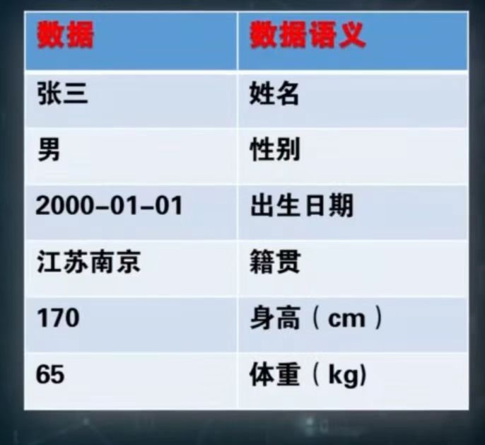
   
   <u>**信息**</u>是现实世界事物存在方式或运动状态的反映，是数据所表达的语义
   
   <u>***数据***</u>是信息的符号表示，或称为载体

2. **<font color = cornflowerblue>数据结构</font>**
   
   <u>**数据结构**</u>是数据对象在计算机中的组织方式，包括物理结构和逻辑结构
   
   - *逻辑结构*
     
     是用户可见的组织方式
     
     - 表结构
     
     - 树结构
     
     - 图结构
     
     - ...
   
   - *物理结构*
     
     是数据在物理存储空间中的存储方式和存放方法
     
     - e.g. 学生的姓名学号性别所在系等信息，可用线性逻辑表结构表示
     
     - 表中的数据元素对应一个存储单元
     
     - 可用连续的的存储单元，称为顺序存储
     
     - 也可用不连续的存储单元，称为链式存储

3. **<font color = cornflowerblue>数据独立性</font>**
   
   指用户的应用程序与其所处理的数据是相互独立的，当数据的逻辑结构或物理结构发生变化时，应用程序保持不变的特性
   
   数据独立性是在数据库系统中的某个层次修改模式而无需修改上一层模式的<u>**能力**</u>
   
   - 数据的<u>物理独立性</u>就是指修改<u>**内模式**</u>而无需修改概念模式的能力
   
   - 数据的<u>逻辑独立性</u>就是指修改<u>**概念模式**</u>而无需修改外模式或应用程序的能力

## 物理独立性

指用户的**应用程序与存储在磁盘上的数据库中数据是相互独立的**，当数据的**物理存储**改变时，**应用程序**不用改变

- <u>**概念模式 / 内模式**</u>间的映射保证了数据的物理独立性

## 逻辑独立性

指用户的**应用程序与数据库的逻辑结构是相互独立的**，当数据的**逻辑存储**改变时，**应用程序**不用改变

- <u>**外模式 / 概念模式**</u>间的映射保证了数据的逻辑独立性

# 数据模型

## 概述

1. **<mark><font color = red>抽象与模型</font></mark>**
   
   
   
   对事物不同抽象层次中的对象采用不同的模型进行描述

2. **<mark><font color = red>概念模型 Conceptual Model</font></mark>**
   
   是按用户的观点来对信息建模，是数据库设计人员与用户之间进行交流的语言
   
   是从现实世界中抽取出对于一个目标应用系统来说最有用的事物、事物的特征以及事物之间的联系，通过各种概念精确地加以描述
   
   概念模型可采用<font color = Red>实体联系模型</font>用 <font color = Red>E-R 图</font>来描述

3. **<mark><font color = red>逻辑数据模型 Logical Data Model</font></mark>**
   
   - 数据模型实现了信息世界向计算机世界的过渡
   
   - 数据模型按计算机的观点对数据建模，是概念模型的数据化
   
   - 数据模型提供了表示和组织数据的方法，描述的是数据的逻辑结构
   
   - DBMS 都是基于某种数据模型或是支持某种数据模型的

4. **<mark><font color = red>物理模型 Physical Model</font></mark>**
   
   是对最底层数据的抽象，描述数据在系统内部的表示方法和存取方法
   
   是面向计算机系统的，由 DBMS 具体实现

5. **<mark><font color = red>模型转换</font></mark>**
   
   
   
   > e.g.
   > 
   > 

## 概念模型 Conceptual Model

是从现实世界中抽取出对于一个目标应用系统来说最有用的事物、事物的特征以及事物之间的联系，通过各种概念精确地加以描述

1. **<font color = cornflowerblue>实体  Entity</font>**
   
   - 现实世界中客观存在并能**相互区分**的事物经过**加工，抽象**称为信息世界的实体
   
   - 实体是信息世界的**基本单位**
   
   - 可以是具体的，例如学生，教材等；也可以是抽象的，如课程，比赛等

2. **<font color = cornflowerblue>属性  Attribute</font>**
   
   现实世界的事物所具有的特征反映在其对应的实体上，称之为属性
   
   一个实体可以由若干属性来刻画，用属性名表示

3. **<font color = cornflowerblue>实体型  Entity Type</font>**
   
   用属性名集合来抽象和刻画同类实体
   
   e.g.    学生（学号，姓名，性别，出生日期，所在院系等属性来描述）

4. **<font color = cornflowerblue>实体集  Entity Set</font>**
   
   同一类型实体的集合
   
   e.g.    {2017307201，郑伟，男，1998-04-01，数据工程}

### 实体联系模型 / E-R模型

Entity Relationship Model，实体联系模型

该方法用 E-R 图来**描述概念模型**

在模型中

- 实体用**矩形**表示，在实体框内标注实体名

- 属性用**椭圆**表示，在椭圆内标注属性名

- 并用**无向边**将其与相应的实体连接起来


1. <mark>**<font color = red>实体</font>**</mark>
   
   - <u>**属性值 value**</u>
     
     每个属性都有值
     
     - 单值属性
       
       实体在某个属性上可能只有一个值 <u>e.g. 学号</u>
     
     - 多值属性
       
       也可能有多个值 <u>e.g. 联系方式</u>
     
     - 简单属性/原子属性
       
       值可能是原子的，不可再分的 <u>e.g. 学号，性别</u>
     
     - 复合属性
       
       值也可以划分为更小的子部分，每一子部分表示更具体的实体特征 <u>e.g. 出生日期，家庭住址；出生日期可以进一步分为年月日，家庭住址可以进一步分为省市区县等</u>
     
     - 存储属性 / 基本属性；派生属性 / 导出属性
       
       <u>e.g. 年龄属性，其值会不断变化的，且可由出生日期推到出来的，应存储出生日期这种基本属性</u>；不要存储年龄这种派生属性
   
   - <u>**属性域 Domain**</u>
     
     属性值的取值范围称为属性域
   
   - <u>**关键字 key**</u>
     
     能<font color = red>唯一</font>标识实体的<font color = red>最小</font>属性集
     
     每一个实体一定有关键字
     
     > e.g.
     > 
     > 

2. **<mark><font color = red>联系 Relationship</font></mark>**
   
   - 现实世界中事物彼此的联系反映为实体间的联系
   
   - <u>**联系的形式**</u>
     
     - 实体集内的联系
     
     - 实体集间的联系
   
   - <u>**联系的元数**</u>
     
     与一个联系有关的实体的个数
     
     - <u>一元联系</u>
     
     - <u>二元联系</u>
       
       两个实体集间的联系有三种类型
       
       1. *1 >> 1*
          
          对于两个实体集 A 和 B；若 A 中每个实体成员在 B 中**至多有一个实体成员与之对应**，反之亦然，则称实体集 A 和 B 具有**一对一**的联系，记为1: 1
          
          > e.g. 学校：校长，表示一个学校只有一个校长，而一个校长只能在一个学校任职
          
          
       
       2. *1 >> n*
          
          若 A 中每一个实体成员在 B 中可有**多个实体成员与之对应**，反之 B 中每一个实体成员在 A 中至多有一个实体成员与之对应，则称实体集 A 和 B 具有**一对多**的联系，记为1: n
          
          > e.g. 班级：学生，表示一个班级可有多个学生，而一个学生只能归属于一个班级
          
          
       
       3. *m >> n*
          
          若 A 中**每一个实体成员**，在 B 中有**多个实体成员与之对应**，反之亦然，则称实体集 A 和 B 具有**多对多**的联系，记为 m: n
          
          > e.g. 教师：学生
          
          
     
     - <u>多元联系</u>

在 E-R 模型中

- 实体间的联系用**菱形**表示，在菱形框内写明联系名

- 同时用**无向边**分别与有关实体连接起来

- 在无向边上还要**标注联系的类型**，是1: 1，1: n，还是 m: n

> <u>**注意**</u>
> 
> 不仅实体具有属性，联系也具有属性，用于对发生的联系进行描述，这些属性也要用无向边与该联系连接起来


---

3. <mark>**<font color = red>IS-A 联系</font>**</mark>
   
   - 对实体集 A 的一个子集，可构造一个新的实体 B，实体类型 A 称为**超类**，实体类型 B 称为**子类**
   
   - 在实体 A 与实体 B 之间存在着一种 <font color = Red>ISA 联系</font>，实体 B 通过 ISA 联系继承实体 A 中所有属性和 A 相关的联系，同时拥有自己特有的属性
   
   > e.g.
   > 
   > <u>研究生是学生的一个子集</u>，若单独表示时，学生与研究生两个实体间就存在着 ISA 联系，在 E-R 图中，用指向超类的<u>三角形</u>表示 ISA 联系，研究生除了拥有学生的属性外，还可有研究方向和导师姓名等属性
   > 
   > 

4. <mark>**<font color = red>弱实体及依赖联系</font>**</mark>
   
   弱某实体的存在，依赖 于一些<u>其他实体（常规实体或强实体）</u>，被称为弱实体；<u>**若常规实体不存在，则该弱实体也不存在**</u>，因此弱实体与常规实体之间存在着依赖联系
   
   > e.g.
   > 
   > 学生的家庭成员可单独构成一个弱实体，在 E-R 图中用**双线矩形框**表示，则弱实体家庭成员与学生实体间存在着依赖联系，在 E-R 图中用双线菱形框表示
   > 
   > 

## 数据模型的组成要素

数据模型是严格定义的一组概念的集合，这些概念精确地描述了系统的<u>**静态特性、动态特性和完整性约束条件**</u>【这里的系统指的是用<u>数据库技术进行数据管理的应用系统</u>】

因此数据模型通常由 <font color = Red>数据结构、数据操作、完整性约束</font> 三部分组成，也称数据模型的<u>**三要素**</u>

1. **<font color = cornflowerblue>数据结构</font>**
   
   用来描述数据库模式的
   
   描述数据库的组成对象以及对象之间的联系，是所描述的对象类型的集合，反映的是系统的数据<u>**静态特性**</u>
   
   数据结构是刻画一个数据模型的最重要的方面，因此在数据库技术中，通常<u>数据结构的类型来命名数据模型</u>
   
   

2. **<font color = cornflowerblue>数据操作</font>**
   
   是对数据库中各种对象类型的实例值允许执行的操作及操作规则的集合，反映的是系统数据的<u>**动态变化**</u>，数据库主要有<u>查询和更新（插入、删除和修改）</u>两大类操作
   
   数据模型必须定义实现这些操作的操作符号、确切含义、操作规则以及实现操作的语言
   
   > e.g.    如采用关系数据结构的关系模型定义了关系代数操作，以及实现这些操作的 SQL 语言

3. **<font color = cornflowerblue>数据的完整性约束</font>**
   
   是一组完整性约束规则，用来制约数据模型中的数据及有联系的数据的依存关系，限定符合数据模型的数据库状态以及状态的变化，<u>防止不合语义的不正确的数据进入数据库，以保证数据的正确、有效和相容</u>
   
   数据模型应该规定数据库必须遵守的基本通用的完整性约束条件，并反映在 DBMS 上
   
   > e.g.    在关系数据模型中，任何数据库要满足实体完整性和参照完整性
   
   支持数据模型的 DBMS 还应该提供定义完整性约束条件的机制，以反映具体应用所涉及的数据，必须遵守的特定的语义约束条件
   
   > e.g.    在关系型数据库管理系统中，可自定义完整性约束

# 数据模型的演变

数据模型应该满足三方面的要求

1）比较真实地模拟现实世界

2）容易为人所理解

3）便于在计算机上实现

数据模型的演变是数据库技术发展的一条主线

1. **<mark><font color = red>层次模型  Hierarchical Model</font></mark>**
   
   - 最早采用，基于树结构的模型
   
   - 只能表示 1: N 的联系

2. **<mark><font color = red>网状模型  Network Model</font></mark>**
   
   - 其典型代表是 DBTG 系统

3. **<mark><font color = red>关系模型  Relational Model</font></mark>**
   
   - 目前使用**最广泛**的一种数据模型
   
   - IBM 的 E.F.Codd 于20世纪70年代初提出
   
   - 数据结构建立在 <u>**集合论中 "关系"**</u> 概念的基础之上，有着严格的数学基础

4. **<mark><font color = red>半结构化数据模型  Semistructured-data Model</font></mark>**
   
   - 是 “无模式” 的，自描述  self describing  的
   
   - 数据携带了关于其模式的信息，模式可以随着时间在数据库内任意改变，易于修改和变化
   
   - 适合信息内容日新月异的 Web 环境
   
   - 该模型类似树或图，它是节点  node  的集合
   
   - 节点包括叶子节点  leaf  和内部节点  interior
   
   - XML Extensible Markup Language

5. **<mark><font color = red>面向对象模型  Object Oriented Model</font></mark>**
   
   - 吸收了概念数据模型和知识表示模型的一些基本概念
   
   - 借鉴了面向对象程序设计语言和抽象数据类型的一些思想，是一种可扩充的数据模型
   
   - 基本概念是对象和类
   
   - 现实世界的任意实体都是对象
     
     - 一个对象可以包含多个属性
     
     - 对象还包括若干方法
     
     - 对象是封装的
     
     - 对象之间的通信通过消息传递来实现

# 关系数据模型

## 关系及关系模式

1. **<font color = cornflowerblue>关系模型的数据结构即关系的概念</font>**
   
   - <u>数学中的关系</u>
     
     - 在集合论中，关系不是通过描述其内涵来刻划事物间联系的，而是通过列举外延（具有这种联系的对象组合全体）来描述这种联系
     
     - 集合论中的关系本身也是一个集合，是具有某种联系的对象（称为 “序组”）组合
   
   - <u>笛卡尔积</u>
     
     关系的概念建立在**笛卡尔积概念基础上**
     
     笛卡尔积是定义在**一组域上的有序对**的集合
     
     > 域是一组具有相同数据类型的值的集合，例如自然数，整数，实数，长度小于若干字节的字符串集合等都可以是域；这组域中可以有相同的域，从这 n 个域里的每个域中任取一个值，构成一个元素的集合
     
     

2. **<font color = cornflowerblue>关系定义</font>**
   
   > e.g.
   > 
   > 三个域
   > 
   > 
   > 
   > <u>*则 D1, D2, D3 上的笛卡尔积是所有可能的元组集合*</u>
   > 
   > 
   > 
   > <u>*该笛卡尔积的基数为三个集合的基数乘积*</u>
   
   *从笛卡尔积中取出那些有一定语义的元组，构成这 N 个域上的一个关系或者说关系是笛卡尔积的某个有意义的子集 $R(D1, D2, \dots, Dn)$*
   
   - R: 关系的名字
   
   - n: 域的个数；关系的目或度
   
   > 此时该学生关系对应的二维表最多含有3个元组
   > 
   > 
   
   ***在关系模型只包含单一的数据结构—— 关系***
   
   ***关系既可以表示概念模型中的实体也可以用来描述实体间的各种联系***

3. **<font color = cornflowerblue>关系相关概念</font>**
   
   
   
   - <u>*关系模式*</u>
     
     对关系的**整体描述**即关系模式，可以形式化地表示为一个五元组 $R(U, D, Dom, F)$
     
     - R: 关系名
       
       通常与实体的名称，或实体间联系的名称相一致
     
     - U: 组成该关系的属性集合
       
       1. 关系的属性是对关系中元组**分量的描述**，与定义关系的一组域对应
       
       2. 其语义就是关系所描述的**实体的属性**，或实体间**联系的属性**
       
       3. 在同一关系中，**属性名不能相同**
     
     - D: 属性组 U 中属性所来自的域
       
       1. 属性的取值范围；**不同的属性<u>可以有相同的域</u>**
       
       2. 一般要求**所有的域都是原子数据的集合**，则对应关系的属性只能是**简单属性**，也就是原子数性，不能是复合属性
       
       3. 属性值不能在系统里被划分为若干子部分，属性也不能是多值属性，不能在同一元组的同一属性上有多个值，这种限制被称为<u>**第一范式条件**</u>
          
          
     
     - Dom: 属性向域的映像的集合
       
       属性的**类型和长度**
       
       > e.g.
       > 
       > 可定义学生的姓名属性为字符串类型
       > 
       > 
     
     - F: 属性间数据的**依赖关系集合**
       
       1. 是关系的**属性与属性**之间的一种**约束关系**
       
       2. 反映的是现实世界**事物特征间的一种依赖关系**
       
       3. 是数据内在的性质是语义的体现
       
       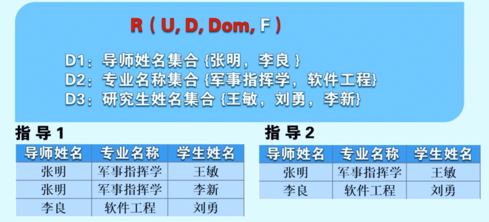
   
   - <u>*关系模式表示*</u>
     
     ***将关系模式简化表示为关系名和属性名的集合***
     
     $R(A1, A2, \dots, An)$
     
     
     
     **关系模式是关系的型的描述，是静态的稳定的**

4. **<font color = cornflowerblue>关系实例  Relation Instance</font>**
   
   - 一个给定关系的**某一时刻的元组的集合**，即当前关系的值称为**关系 $R$ 的实例 $r(R)$**
   
   - *关系实例是动态的，随时间不断变化的*

5. **<font color = cornflowerblue>关系数据库</font>**
   
   - 在某一应用领域中，描述**所有实体及实体之间联系**所形成的关系的集合，就构成了一个<u>**关系数据库**</u>
   
   - 数据库中关系模式集合叫作 **关系数据库模式**，是以关系数据模型为基础的数据库的概念模式，是对关系数据库的<u>型的描述</u>
   
   - **关系数据库实例** 是关系模式在<u>某一时刻对应实例</u>的集合
   
   > ***集合的关系与关系模型中的关系***
   > 
   > 1. <u>集合的关系</u>
   >    
   >    - 关系可以是一个无限集合
   >    
   >    - 关系中每个元组是 ”序组“
   > 
   > 2. <u>关系模型中的关系</u>
   >    
   >    - 关系必须是有限集合
   >    
   >    - 为关系的每个属性附加一个属性名取消分量的有序性
   > 
   > 
   
   
   
   > ***关系和表的区别***
   > 
   > 1. <u>关系</u> 【抽象的概念】
   >    
   >    - 关系是 n 个域上的一个 n 元组的**集合**
   >    
   >    - 关系中属性的**次序和元组的次序都是任意的**
   >    
   >    - 关系中**不能**有相同的元组
   > 
   > 2. <u>表</u>
   >    
   >    - 表是关系的 ”二维“ 呈现
   >    
   >    - 在表中各列从左到右是**有序的**，各行从上到下也是**有序的**
   >    
   >    - 在表中，**可能包含重复**的行

6. **<font color = cornflowerblue>候选键，外键</font>**
   
   - <u>**候选键  Candidate Key**</u>
     
     - 可标识<u>每一个</u>元组
     
     - 在关系的所有属性中，若关系中的某一属性或属性集能**惟一标识**一个元组，而其任意一个真子集**无此特性**，则称**该属性或属性集**为关系的<u>**候选键**</u>
       
       也就是说
       
       <mark>**候选键是唯一标识一个元组的最小属性集**</mark>，它可以保证关系实例上任何两个元组的值在候选键的属性（集）上取值不同
     
     - **注意**
       
       构成候选键的属性的值对于关系的所有实例**都具有**惟一性，而不是只针对某一个特定实例
     
     - <u>表示方式</u>
       
       通常在关系模式中，构成候选键的属性（集）下面**画上下划线**，来表明它是键的组成部分
       
       
     
     - *每个关系都**至少**存在一个候选键*，若一个关系有<u>多个</u>候选键，可选择其中的一个作为主键  Primary Key
       
       > <u>**主键**</u>   是数据库设计者选中用来在 DBMS 中区分一个关系中不同元组的候选键，主键的选择会影响某些实现问题
       > 
       > e.g. 索引文件的建立
     
     - 包含候选键的属性集称为 ***超键  Superkey***【能惟一标识元组，但不具有最小化性质】
     
     - 若关系只有一个候选键，且这个候选键包含了关系的所有属性，称该候选键为  ***全键  All-key***
     
     - 构成候选键的**每个属性称为主属性**
       
       不包含在任何候选键中的属性称为**非主属性**
   
   - <u>**外键  Foreign Key**</u>
     
     若关系 R 的一个属性（集）F 与关系 S 的主键 Ks 对应，即关系 R 中的元组在 F 上的取值与关系 S 中元组的 Ks 上的值对应，则称该属性（集）F 为关系 R 的外键
     
     <u>可用来描述关系之间的参照，体现实体间的联系</u>
     
     <u>在关系模式中可用波浪线来标注外键</u>
     
     
     
     > ***注意***
     > 
     > 参照关系 R 和被参照关系 S **可以是同一关系**，即关系 R 的属性 F 与关系 R 的主键 Kr 对应，表明同一关系中不同元组之间的参照关系
     > 
     > ---
     > 
     > 在实际应用中，外键的定义有**两点**需要注意
     > 
     > - 外键并**不一定**要与相应的主键同名，当外键与相应的主键**属于不同关系**时，往往给它们**取相同的名字**
     >   
     >   e.g.  选课关系中的学号，课程编号
     >   
     >   
     > 
     > - 外键与对应的主键必须定义在相同的值域上，即属性值的数据类型要完全一致

## 关系模型的完整性约束

1. <mark>**<font color = red>概念</font>**</mark>
   
   关系模型对于**存储在数据库中的数据**具有的约束能力，也就是关系的实例值随着时间变化应该满足的一些约束条件，这些约束条件实际上是现实世界对关系数据的语义要求

2. <mark>**<font color = red>实体完整性【关系的不变性】</font>**</mark>
   
   - 若属性 A 是关系 R 的主属性，则属性 A 的值不能为 ***空值 Null***
   
   - 体现了关系模型的**键约束特性**
   
   - 该规则针对**基本关系即存储的关系表**，并不对查询的结果关系、视图等进行约束

3. **<mark><font color = red>参照完整性【关系的不变性】</font></mark>**
   
   
   
   - 选课关系与学生实体和课程实体之间的参照
   
   - 关系之间的参照一般采用**外键**进行描述
     
     【<u>参照完整性规则</u>】若属性或属性集 F 是关系 R 的外键，它与关系 S 的主键 Ks 对应，则 R 中元组在 F 上的取值只能有两种 ***可能 1）取空值；2）等于 S 中某个元组的 Ks 值***
     
     
     
     

4. **<mark><font color = red>用户定义的完整性</font></mark>**
   
   关系模型要求关系数据库除满足实体完整性和参照完整性之外，根据其应用环境的不同，还需要满足一些**特殊的约束条件**，反映某一具体应用所涉及的数据必须满足的语义要求
   
   - <u>对属性的类型约束</u>
     
     e.g.    年龄只能取整数；姓名的字符串长度最大为20
   
   - <u>对属性值的取值范围进行约束</u>
     
     e.g.    学生考试成绩在0-100之间；在职职工的年龄不能大于60岁
   
   - <u>对同一关系的不同元组进行约束</u>
     
     e.g.    不允许出现两个不同的学生拥有相同的姓名
   
   - <u>对同一关系的各属性进行约束</u>
     
     e.g.    要求职工工资与职工的工龄和职务满足一定的算术关系
   
   - <u>对同一数据库中各关系进行约束</u>
     
     e.g.    在供应商零件工程数据库中要求不允许状态值小于20的供应商供应任何数量多于500的零件等等
     
     

---

**<font color = Red>实质</font>**

是在关系中不允许引用不存在的实体，在某个关系中出现的值也必须在另外一个相关的关系中出现

# SQL Server

## 创建与删除表

1. **<font color = cornflowerblue>创建表</font>**
   
   ```sql
   CREATE TABLE name
   ```

2. **<font color = cornflowerblue>删除表</font>**
   
   ```sql
   DROP TABLE name
   ```

## 约束

对一个表中的属性操作的限制叫作约束

1. <mark>**<font color = red>主键约束</font>**</mark>
   
   不允许重复元素，避免了数据的冗余

2. <mark>**<font color = red>外键约束</font>**</mark>
   
   通过外键约束从语法上保证了本事物所关联的其他事物一定是存在的
   
   事物和事物之间的关系是通过外键来体现的

3. <mark>**<font color = red>check 约束</font>**</mark>
   
   ```sql
   Grade INT CHECK(Grade >= 0 AND Grade <= 100),
   ```
   
   保证事物属性的取值在**合法范围内**

4. <mark>**<font color = red>default 约束</font>**</mark>
   
   ```sql
   stu_sex CHAR(1) DEFAULT ('男')
   ```
   
   ```sql
   CONSTRAINT stu_sex DEFAULT('男')
   ```
   
   字段默认值
   
   保证事物的属性一定会有一个值

5. <mark>**<font color = red>unique 约束</font>**</mark>
   
   ```sql
   stu_name CHAR(200) UNIQUE
   ```
   
   ```sql
   CONSTRAINT un_Sname1 UNIQUE(Sname1))
   ```
   
   ​	

6. <mark>**<font color = red>unique 约束与主键的区别</font>**</mark>

## 选择表内容

```sql
-- 选择表 emp 的所有内容
SELECT * FROM emp

-- 选择表 emp 的部分字段
SELECT empno, ename FROM emp
```

## 查询

1. **<font color = cornflowerblue>计算列</font>**
   
   ```sql
   -- 计算年薪
   SELECT ename, sal*12 as '年薪' FROM emp
   ```

2. **<font color = cornflowerblue>DISTINCT</font>**
   
   > ***不允许重复的，相当于去重***
   
   也可以过滤掉重复的 null
   
   ```sql
   SELECT DISTINCT Sno FROM Reports
   ```
   
   ```sql
   -- 把一个组合进行过滤，即 (Sno, Sname) 当作一个整体
   SELECT DISTINCT Sno, Sname FROM Reports
   ```
   
   ```sql
   -- 以下语句报错，逻辑有冲突
   SELECT deptno DISTINCT comm FROM emp
   ```

3. **<font color = cornflowerblue>WHERE and BETWEEN</font>**
   
   查找数据在在...到...之间的数据
   
   ```sql
   -- AND
   SELECT Sno, Sname FROM Students
   WHERE Sno >= 10 AND Sno <=20
   ```
   
   ```sql
   -- AND
   SELECT Sno, Sname FROM Students
   WHERE Sno BETWEEN 10 AND 20
   ```
   
   ```sql
   -- OR
   SELECT Sno, Sname FROM Students
   WHERE Sno <= 10 OR Sno >=20
   ```
   
   ```sql
   -- OR
   SELECT Sno, Sname FROM Students
   WHERE Sno NOT BETWEEN 10 AND 20
   ```

4. **<font color = cornflowerblue>IN</font>**
   
   ```sql
   -- 系统编号为 D01, D02, D03 学生的学号 (Sno), 姓名 (Sname), 性别 (Ssex)
   SELECT Sno, Sname, Ssex
   FROM Students_H
   WHERE Dno IN ('D01', 'D02', 'D03')
   ```
   
   ```sql
   -- 系别编号既不是 D01, D02，也不是 D03 的学生姓名 (Sname) 和性别 (Ssex)
   SELECT Sname, Ssex
   FROM Students_H
   WHERE Dno NOT IN ('D01', 'D02', 'D03')
   ```

5. **<font color = cornflowerblue>TOP</font>**
   
   查看数据前 n 行 / %
   
   ```sql
   SELECT TOP 2 * FROM emp
   ```
   
   ```sql
   SELECT TOP 15 PERCENT * FROM emp
   ```

6. **<font color = cornflowerblue>ORDER BY  排序</font>**
   
   ```sql
   -- 选修了 C03 号课程的学生学号 Sno 和成绩 Grade, 并按成绩降序排列
   SELECT Sno, Grade
   FROM Reports
   WHERE Cno = 'C03'
   ORDER BY Grade DESC
   ```
   
   ```sql
   -- emp 前两行数据中工资 sal 在1500-3000之间的降序排序
   SELECT TOP 2 *
   FROM emp
   WHERE sal BETWEEN 1500 AND 3000
   ORDER BY sal DESC
   ```
   
   ```sql
   -- 先按照 deptno 排序，deptno 相同时，按照 sal 排序
   -- desc 放在哪就对哪产生影响
   SELECT *
   FROM emp
   ORDER BY deptno, sal
   ```

7. **<font color = cornflowerblue>NULL</font>**
   
   ```sql
    -- 假设某些学生选修课程后没有参加考试，所以有选课记录，但没有考试成绩
    -- 试查询缺少成绩的学生的学号 Sno 和相应课程号 Cno
   SELECT Sno, Cno
   FROM Reports
   WHERE Grade IS NULL
   ```
   
   ```sql
   -- 所有有成绩的学生学号 Sno 和课程号 Cno
   SELECT Sno, Cno
   FROM Reports
   WHERE Grade IS NOT NULL
   ```
   
   > 任何数据类型都允许为空

8. **<font color = cornflowerblue>ISNULL</font>**
   
   ```sql
   -- ISNULL(comm, 0) 表示如果 comm 为 NULL，返回0，否则返回 comm
   SELECT ename, sal*12+ISNULL(comm, 0) FROM emp
   ```

9. **<font color = cornflowerblue>模糊查询</font>**
   
   ```sql
   -- 所有姓刘的学生姓名 Sname, 学号 Sno, 性别 Ssex
   SELECT Sname, Sno, Ssex
   FROM Students_H
   WHERE Sname LIKE '刘%'
   ```
   
   ```sql
   -- 姓“刘”且全名不多于3个汉字的学生的姓名 Sname 和出生日期 Birthday
   SELECT Sname, Birthday
   FROM Students_H
   WHERE Sname LIKE '刘__'
   ```
   
   ```sql
   -- 所有不姓刘的学生姓名 Sname 和出生日期 Birthday
   SELECT Sname, Birthday
   FROM Students_H
   WHERE Sname NOT LIKE '刘%'
   ```
   
   ```sql
   -- 课程名为“DB_设计”的课程号 Cno 和学分 Credits
   SELECT Cno, Credits
   FROM Courses
   WHERE Cname LIKE 'DB\_设计' ESCAPE '\'
   ```
   
   ***通配符***
   
   - `%`
     
     表示包含某字符的任意长度数据
   
   - `_`
     
     表示任意单个字符
   
   - `[a-f]`
     
     a 到 f 中的任意单个字符
     
     ```sql
     SELECT *
     FROM emp
     WHERE ename LIKE '_[A-F]%'
     ```
   
   - `[a, f]`
     
     a 或 f
   
   - `[^a-c]`
     
     表示不是 a - c 任意单个字符

10. **<font color = cornflowerblue>聚合函数</font>**
    
    - `LOWER()`
      
      字母转变小写
      
      ```sql
      SELECT LOWER(ename) FROM emp
      ```
    
    - `MAX()`
      
      ```sql
      -- 选修 C01 号课程的学生最高分数
      SELECT MAX(Grade)
      FROM Reports
      WHERE Cno = 'C01'
      ```
    
    - `MIN()`
    
    - `AVG()`
      
      ```sql
      -- 选修 C01 号课程的学生平均成绩
      SELECT AVG(Grade)
      FROM Reports
      WHERE Cno = 'C01'
      ```
    
    - `COUNT()`
      
      ```sql
      -- 学生总人数
      SELECT COUNT(*)
      FROM Students_H
      ```
      
      ```sql
      -- 选修了课程的学生人数
      SELECT COUNT(DISTINCT Sno)
      FROM Reports
      ```
      
      > 只记录有效数据，NULL 不会被计入

11. **<font color = cornflowerblue>GROUP BY</font>**
    
    ```sql
    -- 输出每个部门的编号和该部门的平均工资
    SELECT deptno, AVG(sal) as '部门平均工资'
    FROM emp
    GROUP BY deptno
    ```

12. **<font color = cornflowerblue>HAVING</font>**
    
    对分组之后的信息进行过滤
    
    ```sql
    -- 判断部门平均工资大于2000的部门编号，部门平均工资
    SELECT deptno, AVG(sal) as '平均工资'
    FROM emp
    GROUP BY deptno
    HAVING AVG(sal) > 2000
    ```

13. **<font color = cornflowerblue></font>**

14. **<font color = cornflowerblue></font>**

15. <font color = cornflowerblue></font>

# 关系代数

## 概述

关系代数是一种**抽象的**查询语言，它用**对关系的代数运算**来表达关系操作

- **代数**
  
  操作运算符和原子操作数组成
  
  - 操作运算符
    
    加减乘除
  
  - 原子操作数
    
    常量和 x 

- **关系代数**
  
  基于**一组以关系为操作对象**的运算符
  
  - <u>*原子操作数*</u>
    
    关系实例变量；元组集合常量
    
    
  
  - *<u>操作运算符</u>*
    
    - *传统的集合运算*
      
      将关系作为元组的集合，从元组角度进行运算
    
    - *专门的关系运算*
      
      不仅涉及元组而且涉及属性列；
      
      需要比较运算符和逻辑运算符来辅助完成
    
    

## 并、差、交运算【传统集合运算】

1. **<font color = cornflowerblue>相容关系</font>**
   
   定义在一组相同域上的不同关系；
   
   也就是说，两个关系是相容的，它们的关系名**可不同**，属性名**也可不同**，<u>但具有相同个数的属性</u>，即两个关系具有相同的目，且相应的属性取值来自**同一个域**
   
   > 对于并、差、交三种集合运算，要求参与运算的两个关系**必须是相容的**
   
   e.g.
   
   
   
   这里的关系 S1 与 S2 就是相容的

2. **<font color = cornflowerblue>并运算  Union</font>**
   
   关系 R 与关系 S 的**并**是一个与关系 R 和 S **相容的关系**，且其元组由属于 R 或 S 的元组组成
   
   表示为
   
   $$
   R \cup S = \{ t | t \in R \lor t \in S \}
   $$
   
   > e.g.
   > 
   > 
   > 
   > 相同的元组将被舍弃，并运算的结果包含了所有元组

3. **<font color = cornflowerblue>差运算  Difference</font>**
   
   关系 R 与 S 的**差**是一个与关系 R 和 S **相容的关系**，且其元组由**属于 R 但不属于 S** 的元组组成
   
   $$
   R - S = \{ t | t \in R \land t \notin S \}
   $$
   
   > e.g.
   > 
   > 对于给出的关系 R 和关系 S，关系 R 与 S 的差包含那些只在关系 R 中出现，而不在 S 中出现的元组
   > 
   > 
   > 
   > **差运算是不满足交换律的**

4. **<font color = cornflowerblue>交运算  Intersection</font>**
   
   关系 R 和 S 的**交**是一个与关系 R 和 S **相容的关系**，其元组由**既属于 R 又属于 S** 的所有元组组成
   
   表示为
   
   $$
   R \cap S = \{ t | t \in R \land t \in S \}
   $$
   
   > e.g.
   > 
   > 

5. **<font color = cornflowerblue>实现关系操作</font>**
   
   e.g.
   
   假设关系 S1 中的学生参加了程序设计俱乐部，关系 S2 中的学生参加了机器人俱乐部
   
   
   
   下面做如下查询操作
   
   - <u>查询参加了俱乐部活动的学生</u>
     
     $S1 \cup S2$
   
   - <u>查询参加了两个俱乐部活动的学生</u>
     
     $S1 \cap S2$
   
   - <u>查询只参加了一个俱乐部活动的学生</u>
     
     $(S1 \cup S2) - (S1 \cap S2)$
   
   ---
   
   现在假设计算机系的王玲同学从程序设计俱乐部退出，转去参加机器人俱乐部，请实现对关系 S1 和 S2 的更新操作
   
   - $S1 - \{ ('S01', '王玲', '计算机', '女')\}$ 从程序设计俱乐部退出，就要从关系 S1 中将其所在元组删除
   
   - $S2 \cup \{'S01', '王玲', '计算机', '女')\}$ 加入机器人俱乐部，将其所在元组插入到关系 S2
   
   - $S1 - \{ ('S01', '王玲', '计算机', '女')\} \cup \{('S01', '王玲', '数学', '女') \}$ 把王玲同学的所在系改成数学

6. **<font color = cornflowerblue>小结</font>**
   
   - 对于相容的两个关系，可进行关系的并、差、交运算
   
   - 利用关系的并、差、交运算可实现对关系的插入、删除、修改等更新操作

## 投影、选择

专门为关系操作定义了两个**一元的基本运算**，即<u>**投影和选择**</u>

1. <mark>**<font color = red>投影运算  Projection</font>**</mark>
   
   - 是<u>一元的</u>、<font color = cornflowerblue>对属性进行操作</font>的运算
   
   - 关系 R 上的投影运算，是从 R 中选择**若干属性列**组成一个新的关系
     假设关系 R 是 $n$ 目关系，$A_{i1}A_{i2} \dots A_{im}$ 是关系 R 的属性 $A_1, A_2, \dots, A_n$ 中的部分属性，则关系 R 在 $A_{i1}A_{i2} \dots A_{im}$ 上的投影是一个 $m$ 目关系，其属性是 $A_{i1}A_{i2} \dots A_{im}$
     
     
- 投影运算符用小写希腊字母 $\pi$ 表示，在**结果中出现的属性名**作为 $\pi$ 的下标
  
  e.g.    $\pi_{A_{i1}, A_{i2}, \dots, A_{im}}(R)$，参与运算的关系名作为 $\pi$ 后括号内的参数
  
  运用投影运算<u>**可获得一个关系的若干属性的信息**</u>
  
  > e.g.
  > 
  > 
  > 
  > 查询所有学生的学号、姓名
  > 
  > $$
  > \pi_{学号, 姓名}(学生)
  > $$

- 投影运算后，新关系的属性列会**比原关系的属性列数目<u>减少</u>**，若新关系中的属性选择的是所在系，则会删除重复元组，元组数目就会减少
2. <mark>**<font color = red>选择运算  Selection</font>**</mark>
   
   是**一元的**、<font color = cornflowerblue>对元组进行操作</font>的运算
   
   关系 R 上的选择运算，是从 R 中选择满足给定条件的元组，组成一个新关系，这个新关系与 R 具有相同的模式，**是 R 的一个子集**
   
   
   
   用小写希腊字母 $\sigma$ 来表示选择运算符，将**选择条件写作 $\sigma$ 的下标**，e.g.    $\sigma_F(R)$，参与运算的关系作为 $\sigma$ 后括号内的参数
   
   选择条件用一个逻辑表达式 $F$ 表示
   
   假设 $t$ 是 R 中任意一个元组，那么对关系 R 进行选择运算的结果，就是把 $t$ 代入到逻辑表达式 $F$ 中，若代入后逻辑表达式 $F$ 的结果为真，那么元组 $t$ 就是在 R 中选择满足条件 $F$ 的所有元组中的一个元组，否则该元组 $t$ 不在结果中出现
   
   $$
   \sigma_F(R) = \{ t | t \in R \land F(t) = true \}
   $$
   
   - <u>**逻辑表达式 $F$ 的组成规则**</u>
     
     由基本逻辑表达式 $a \theta b$ 组成
     
     - $a, b$ 可为**属性名或常量**，但不能同时为常量
     
     - $\theta$ 为**比较运算符**：大于小于等于不等于等
     
     > ***注意***
     > 
     > 参与比较的每个属性必须是选择运算符的关系操作数里的一个属性，否则就是语法上的错误
     
     选择条件 $F$ 还可由基本逻辑表达式经逻辑运算 $\land$ (与)，$\lor$ (或) 和 $\lnot$ (非) 构成复合逻辑表达式
   
   > e.g.
   > 
   > 
   > 
   > - 选择所在系属性值为 “计算机” 的元组，其表达式就是属性名 = 常量的形式
   >   
   >   $$
   >   \sigma_{所在系='计算机'}(学生)
   >   $$
   > 
   > - 查询计算机系学生的姓名
   >   
   >   $$
   >   \pi_{姓名}(\sigma_{ 所在系='计算机'} (学生))
   >   $$

> e.g.    实现对给出学生选课数据库进行关系操作
> 
> 
> 
> - 查询2000-01-01以后出生的学生姓名
>   
>   $$
>   \pi_{姓名}(\sigma_{出生时间 > '2000-01-01'}(学生))
>   $$
> 
> - 查询选修了课程编号为 "C02" 的学生学号和成绩
>   
>   $$
>   \pi_{学号, 成绩}(\sigma_{课程编号 = 'C02'}(选课))
>   $$
> 
> - 查询没有选修课程编号为 "C02" 的学生学号
>   
>   
>   
>   $$
>   \pi_{学号}(\sigma_{课程编号 \neq 'C02'}(选课)) \qquad ×!
>   $$
>   
>   根据上表实例，应该只有学号为 S01 的学生在查询结果中，但其中 S02 也满足课程编号不等于 C02 条件，可见这个查询操作无法满足查询语义
>   
>   因此，需要在所有学生中把选修了课程编号为 C02 的学生删除
>   
>   $$
>   \pi_{学号}(学生) - \pi_{学号}(\sigma_{课程编号 = 'C02'}(选课))
>   $$
> 
> - 查询既选修了 "C01" 又选修了 "C02" 课程的学生学号
>   
>   $$
>   \pi_{学号}(\sigma_{课程编号 = 'C01' \land 课程编号 = 'C02'}(选课)) \qquad ×!
>   $$
>   
>   对于上述表达式，在选课关系上选择课程编号等于 C01，同时还等于 C02 的元组是否可实现查询；每个元组的课程编号只能为一个值，不可能存在某个元组的课程编号既等于 C01 同时还等于 C02，故此查询错误
>   
>   $$
>   \pi_{学号}(\sigma_{课程编号 = 'C01' \lor 课程编号 = 'C02'}(选课)) \qquad ×!
>   $$
>   
>   此时，像只选修了课程编号等于 C01 的学生的学号 S01 也会在查询结果中，故此查询也错误
>   
>   **使用交运算**
>   
>   $$
>   \pi_{学号}(\sigma_{课程编号 = 'C01'}(选课)) \cap \\ \pi_{学号}(\sigma_{课程编号 = 'C02'}(选课))
>   $$

## 乘积、连接运算

1. **<font color = cornflowerblue>广义笛卡尔积</font>** —— 关系的乘积运算
   
   
   
   > e.g.
   > 
   > 对于给出的关系 R 和关系 S，关系 R 与 S 的笛卡尔积中的每一个元组应包含两个分量，第一个分量是关系 R 中的任意一个元组，第二个分量是关系 S 中的任何一个元组
   > 
   > **若把这两个元组拼接在一起，构成一个新元组，则由这些元组组成一个新关系，称为关系 R 与 S 的广义笛卡尔积**
   > 
   > 
   > 
   > 若关系 R 和 S 有同名属性，就需要把**至少**一个关系中相应的属性名改成不同的名称
   > 
   > e.g.  为了使含义清楚，若属性 A 在关系 R 和 S 中均出现，则我们在结果关系模式中分别用 R.A, S.A 表示来自 R 和 S 的属性 A
   
   ---
   
   > e.g.  基于学生关系和学生选课关系
   > 
   > 
   > 
   > <u>查询学生及其选修课程的信息</u>
   > 
   > 对这样两个关系模式不同的关系进行查询，要首先对这两个关系进行广义笛卡尔积基本操作，得到一个具有7个属性9行元组的新关系
   > 
   > 
   > 
   > 这个新关系中的许多元组也是没有实际意义的，我们需要从两个关系的笛卡尔积中，取那些学号属性值相同的元组
   > 
   > $$
   > \sigma_{学生.学号 = 选课.学号}(学生 X 选课)
   > $$
   > 
   > 

2. **<font color = cornflowerblue>连接运算  Join</font>**
   
   通常情况下，涉及笛卡尔积的查询中，会包含一个对笛卡尔积结果进行选择的运算，该选择运算大多数情况下，会**要求进行笛卡尔积的两个关系在某些属性上可进行比较**，这就是连接运算
   
   - ***$\theta$ - 连接***
     
     从两个关系的笛卡尔积中选取属性间满足一定条件的元组，记为
     
     
     
     - A 和 B 分别是 R 和 S 上属性个数相等且可比的属性组
     
     - $\theta$ 是比较运算符，大于小于等于
     
     
   
   - ***等值连接***
     
     当 $\theta$ 为 "=" 时，即为等值连接
     
     
     
     
     
     若 A B 属性组中有多个属性，则属性组中的对应属性值应都相等
     
     > e.g.  与上一个相同的例子
     > 
     > 选择出了相同学号属性值的操作可以用一个等值连接来表示
     > 
     > 
     > 
     > 重复的学号是<u>没有意义的</u>，因此需要在此基础上进行投影运算，即**对学生和选课关系进行自然连接**
     > 
     > 
   
   - ***自然连接***
     
     是一种**特殊的等值连接**
   
   - ***外连接***
     
     但是，在学生关系和选课关系的自然连接结果中，并没有包含学号为 S08 的王明同学的信息，而查询语义是应该包含该学生的信息的，虽然该同学并没有选修课程
     
     像学号为 S08 的王明同学所在的元组，在自然连接时，不能和另外关系中的任何一个元组在相同属性上值相等，这样的元组称为<u>**悬浮元组**</u>
     
     如果在连接结果中把<u>舍弃的这些悬浮元组保留下来</u>，并且在这些元组新增加的属性上赋空值 (NULL)，这种连接称为**外连接**
     
     - 在结果中只保留运算符左边关系中的悬浮元组，称为左外连接，符号是
       
       
     
     - 在结果中只保留运算符右边关系中的悬浮元组，称为右外连接，符号是
       
       
     
     - 在结果中保留两个关系中的悬浮元组，称为完全外连接，符号是
       
       
     
     > e.g.
     > 
     > 在查询学生及其选修课程的信息时，应是对学生关系和选课关系进行左外连接
     > 
     > 

3. **<font color = cornflowerblue>重命名</font>**
   
   为了标识课程元组，和它的先修课程元组所在的关系，则需要将两个课程关系中至少一个关系改名
   
   重命名运算符用小写希腊字母 $\rho$ 表示
   
   $$
   \rho_S(R) / \rho_{S(A_1, A_2, \dots, A_n)}(R)
   $$
   
   - 重命名后的关系 S 与关系 R 完全相同
   
   - R 中属性在关系 S 中可重新命名为 $A_1, A_2, \dots, A_n$ 等新属性
   
   <u>*重命名运算不仅用来*</u>
   
   *<u>1）实现关系的自身连接操作；</u>*
   
   *<u>2）还可解决具有相同属性的两个关系的笛卡尔积或连接操作的属性命名；</u>*
   
   <u>*3）也可用来给一个代数表达式的结果命名为一个新关系；*</u>
   
   > e.g.
   > 
   > 
   > 
   > 因此，现在就可以将连接中的两个课程关系，分别改名为 C1 和 C2，依据 C1 的先修课程号和 C2 的课程编号进行等值连接，最后将 C1 中的课程编号和 C2 中的先修课程号投影出来
   > 
   > 即
   > 
   > 

## 除运算  Division

1. **<mark><font color = red>定义</font></mark>**
   
   设有关系 $R(X, Y)$ 和 $S(Y), S(Y) \neq \empty$，则 $R$ 除以 $S$ 也是一个关系，称之为 $R$ 除以 $S$ 的商
   
   记为
   
   $$
   R \div S
   $$
   
   - $R$ 中的属性包含 $S$ 中的**所有属性**
   
   - $R \div S$ 的属性由 $R$ 中那些**不出现在 $S$ 中的属性组** $X$ 所组成
   
   ---
   
   给定关系 $R(X, Y)$ 和 $S(Y)$，令 $T(X) = R \div S$，<u>若 $x \in \pi_X(R)$，$R$ 中所有在属性组 $X$ 商的分量等于 $x$ 的元组在属性组 $Y$ 上的分量的集合，称为 $x$ 在 $R$ 中的像集，</u>用 $Y_x$ 表示
   
   $$
   Y_x = \{t[Y] | t \in R \land t[X] = x \}
   $$
   
   若 $x \in \pi_X(R)$，且 $S \subseteq Y_x$，则 $x \in T(X)$
   
   $$
   R \div S = \{x | x \in \pi_X(R) \land S \subseteq Y_x \}
   $$

2. **<mark><font color = red>除运算步骤</font></mark>**
   
   - <u>对关系 $R$ 在属性组 $X$ 上进行投影 $\pi_X(R)$</u>
     
     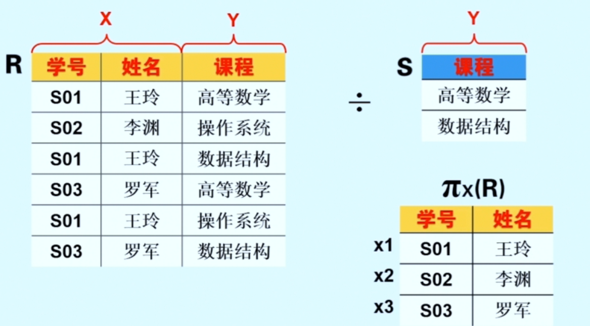
   
   - <u>获取各 $x$ 的像集</u>
     
     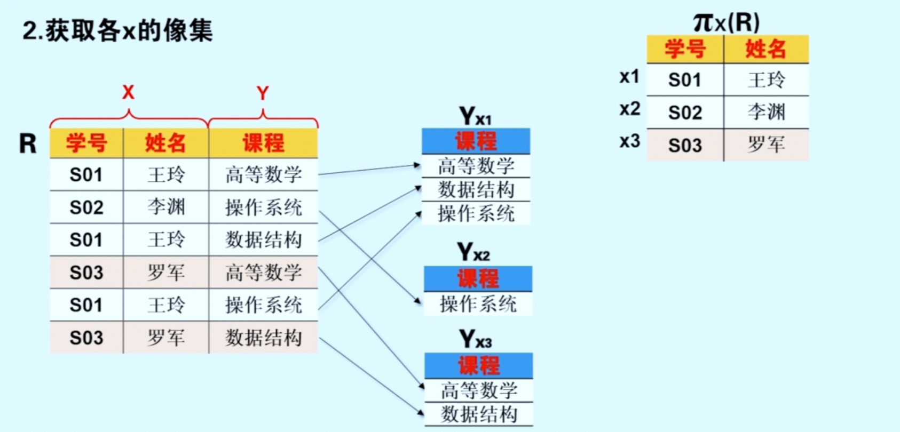
   
   - <u>检查各个 $x$ 在 $Y$ 上的像集是否包含 $S$</u>
     
     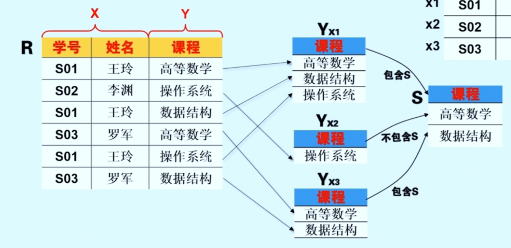
   
   - <u>将满足条件的 $x$ 放入结果集合</u>
     
     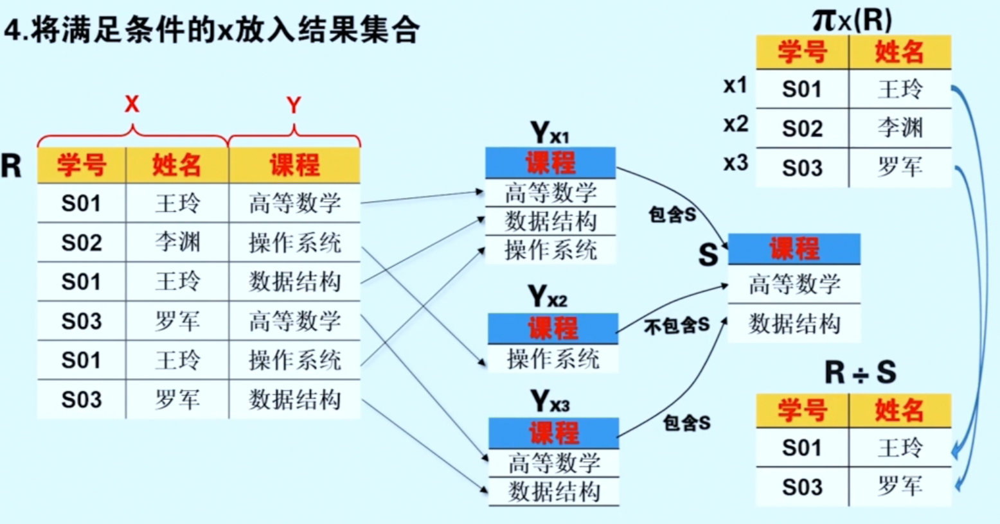

3. **<mark><font color = red>案例</font></mark>**
   
   
   
   <u>**查询选修了全部课程的学生学号**</u>
   
   - 全部课程信息在课程信息中，学生选课信息在选课信息中；
   
   - 在进行除运算前，应对除数关系**课程编号**进行投影操作，去掉不包含在被除数关系**选课**关系中的属性 “课程名” 和 “先修课程号”
   
   - 课程只有课程编号属性，可以与选课关系进行除运算
     
     $$
     选课 \div \pi_{课程编号} (课程) \qquad \quad  ×
     $$
     
     经过以下验证，以上除运算不能得出结果！
     
     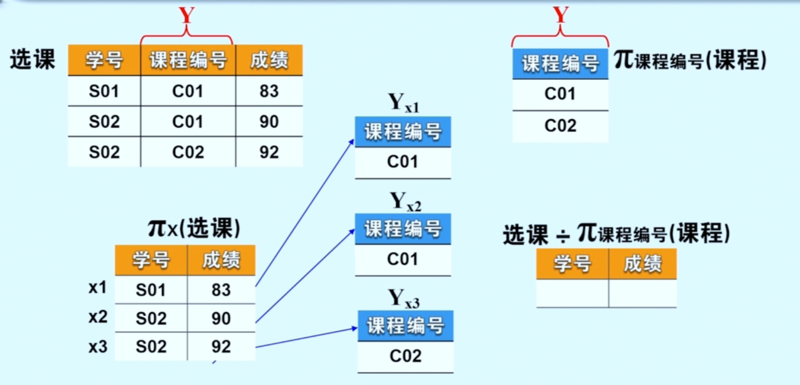
     
     因此也应该对**选课**关系进行投影 $\pi_{学号，课程编号}(选课)$
     
     则
     
     $$
     \pi_{学号，课程编号}(选课) \div \pi_{课程编号}(课程)
     $$
     
     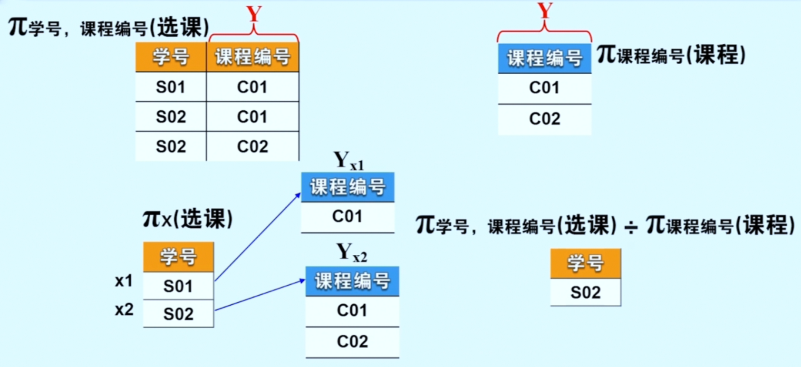

# 关系演算

> ***集合的表示***
> 
> - 列举法
>   
>   自然数    $\{1, 2, 3, ...\}$
> 
> - 描述法
>   
>   大于3的整数    $\{x | x > 3, x \in N \}$

## 概述

1. **<font color = cornflowerblue>关系的谓词表示  Predicate</font>**
   
   关系 $R$ 是满足一定条件的元组或属性域的集合
   
   $$
   \{ u | R(u) \}
   $$
   
   - $u$: 元组变量或域变量
   
   - $R(u)$: 谓词

2. **<font color = cornflowerblue>关系演算  Relational Calculus</font>**
   
   用谓词演算来表达关系的操作
   
   $$
   \{ u | R(u) \}
   $$
   
   - $u$: 演算变量
     
     - $u$ 为元组时，称为元组关系演算
     
     - $u$ 为域变量时，称为域关系演算
   
   - $R(u)$: 演算公式
   
   - $\{ u | R(u) \}$: 关系演算表达式

3. **<font color = cornflowerblue>元组关系演算</font>**
   
   用元组关系演算表达查询
   
   $$
   \{ t | \phi (t) \}
   $$
   
   - $t$: 元组变量，查询目标
   
   - $\phi (t)$: 结果元组应满足的<u>**元组关系演算公式 —— 查询条件**</u>
   
   - $\{ t | \phi (t) \}$: 表示<u>**使 $\phi (t)$ 为真的元组 $t$ 的集合 —— 查询结果**</u>

4. **<font color = cornflowerblue>元组关系演算 >> 归纳定义</font>**
   
   - ***原子公式***
     
     - $R(t)$: 元组变量 $t$ 是关系 $R$ 中的元组
     
     - $t[i] \ \theta \ u[j]$: 元组 $t$ 的第 $i$ 个分量与元组 $u$ 的第 $j$ 个分量满足比较关系 $\theta$
     
     - $t[i] \ \theta\ C$: 元组 $t$ 的第 $i$ 个分量与常量 $C$ 满足比较关系 $\theta$
     
     - $\theta$: $<, >, \le, \ge, \neq, =$
   
   - ***归纳定义***
     
     在原子公式的基础上，得出
     
     - 原子公式是元组关系演算公式
     
     - 设 $\phi_1 (t1)$ 和 $\phi_2 (t2)$ 是元组关系演算公式，则 $\lnot \phi_1 (t1), \phi_1(t1) \land \phi_2 (t2), \phi_1(t1) \lor \phi_2 (t2), \phi_1(t1) \to \phi_2(t2)$ <u>**也是元组关系演算公式**</u>
     
     - 设 $\phi (t)$ 是元组关系演算公式，则 $(\exist t) \phi (t), (\forall t) \phi (t)$ <u>**也是元组关系演算公式**</u>
     
     - **有限次使用上述规则得到的公式都是元组关系演算公式**
   
   - ***公式运算符***
     
     - 比较运算符: $<, >, \le, \ge, \neq, =$
     
     - 存在量词 $\exist$ 与全称量词 $\forall$
     
     - 逻辑运算符: $\lnot, \land, \lor, \to$
     
     > <u>以上运算符优先级由上到下为由高到低</u>
     > 
     > 其中 $\to$ 为逻辑隐含符，若 A 成立，则 B 成立
     > 
     > 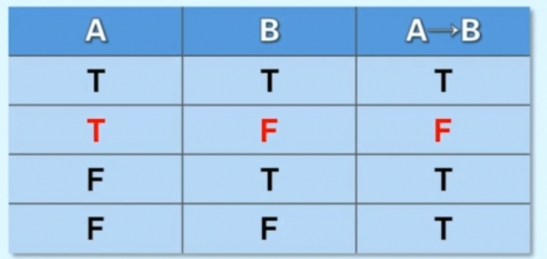
   
   - ***公式等价性***
     
     $$
     (\forall t) \phi (t) \equiv \lnot (\exist t) (\lnot \phi(t)) \\
\quad \\
\phi_1(t1) \to \phi_2(t2) \equiv \lnot \phi_1(t1) \lor \phi_2 (t2) \\
\quad \\
\phi_1(t1) \land \phi_2 (t2) \equiv \lnot (\lnot \phi_1(t1) \lor \lnot \phi_2 (t2))
     $$

5. **<font color = cornflowerblue>元组关系演算 >> 元组变量分类</font>**
   
   - <u>**约束元组变量**</u>
     
     一个元组变量前有 “全称两次 $\forall$“ 或 ”存在量词 $\exist$”，则称改变量为**约束元组变量**
   
   - <u>**自由元组变量**</u>
     
     一个元组变量前有 “全称两次 $\forall$“ 或 ”存在量词 $\exist$”，则称改变量为**自由元组变量**
   
   > \>\>\>  在公式 $(\exist t) \phi (t)$ 和 $(\forall t) \phi (t)$，$\phi (t)$ 是量词的<u>辖域</u>；$t$ 出现在 $(\exist t)$ 或 $(\forall t)$ 的辖域内，**$t$ 为约束元组变量**，被量词所限定；
   > 
   > \>\>\>  在查询 $\{ t | \phi (t) \}$ 中，**查询目标 $t$** 通常是 $\phi (t)$ 中不被约束的**自由元组变量**;

## 与关系代数的等价性

> ***关系代数五种基本操作***

1. **<mark><font color = red>并</font></mark>**
   
   $$
   R \cup S \equiv \{ t | R(t) \lor S(t) \}
   $$
   
   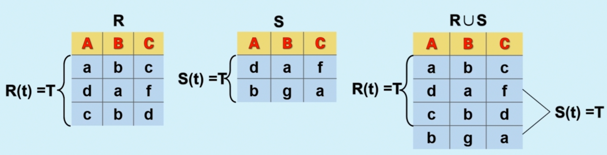

2. **<mark><font color = red>差</font></mark>**
   
   $$
   R - S \equiv \{ t | R(t) \land \lnot S(t) \}
   $$
   
   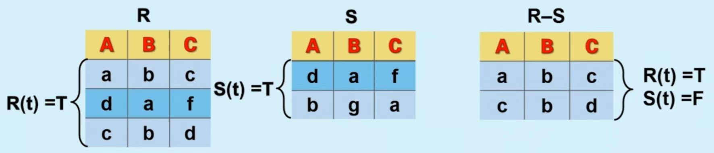

3. **<mark><font color = red>广义笛卡尔积</font></mark>**
   
   $$
   R \times S \equiv \\
\{ t^{(m + n)} | (\exist u^{(m)})(\exist v^{(n)})(R(u) \land S(v) \land t[1] = u[1] \land \dots \\
\land t[m] = u[m] \land t[m + 1] = v[1] \land \dots \land t[m + n] = v[n] \}
   $$
   
   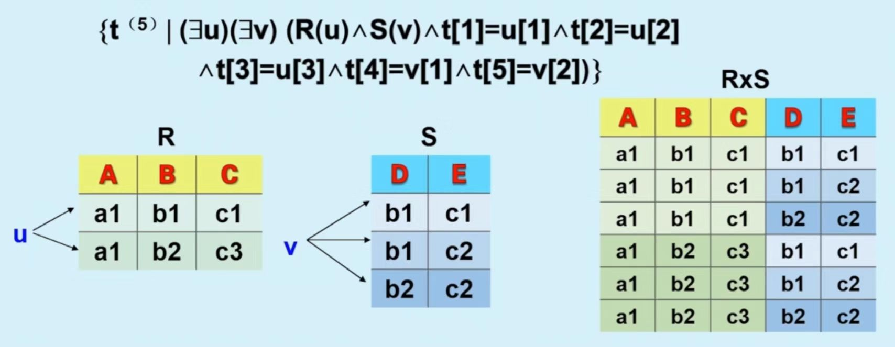

4. **<mark><font color = red>投影</font></mark>**
   
   $$
   \pi_{i_1, i_2, \dots, i_k} (R) \equiv \{ t^{(k)} | (\exist u) (R(u) \land t[1] = u[i_1] \land \dots \land t[k] = u[i_k]) \}
   $$
   
   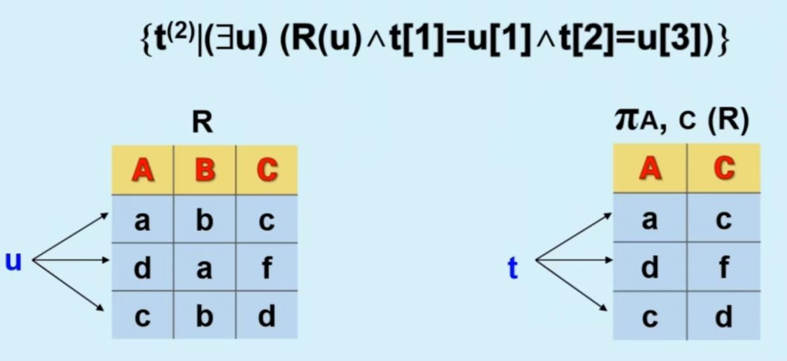

5. **<mark><font color = red>选择</font></mark>**
   
   $$
   \sigma_F(R) \equiv \{ t | R(t) \land F' \}
   $$
   
   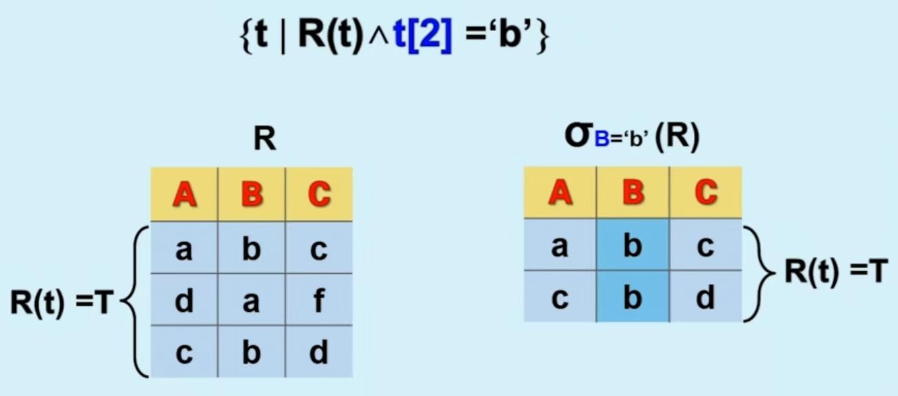

# 关系模式的规范化设计

## 函数依赖

1. **<font color = cornflowerblue>数据依赖  Data Dependency</font>**
   
   $$
   R(U, D, Dom, F)
   $$
   
   <u>F: 属性间数据的依赖关系集合</u>
   
   数据依赖是关系模式的要素，是一个关系的属性与属性之间的一种**约束关系**，反映的是现实世界事物特征间的一种依赖关系，是数据内在的特性，是语义的体现；
   
   > 数据依赖分为
   > 
   > - **函数依赖  Functional Dependency, FD**
   > 
   > - 多值依赖  Multivalurf Dependency, MVD
   > 
   > - 连接依赖  Join Dependency, JD

2. **<font color = cornflowerblue>函数依赖 Functional Dependency, FD</font>**
   
   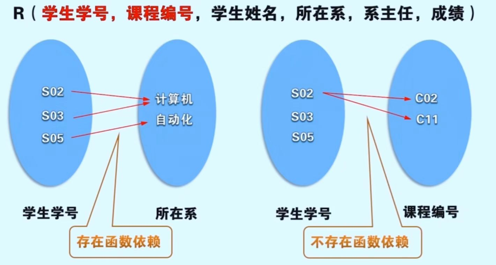
   
   由于一个学生只属于一个专业系，因此在元组中学生学号的值确定了，其所在系的值也被唯一确定了，所以学生所在系的值依赖于学生学号属性的值，<u>我们称学生学号属性和所在系属性之间存在着函数依赖</u>；
   
   由于一个学生可以选修多门课程，因此当元组中学生学号的值确定了，并不能确定其对于的课程编号，<u>所以学生学号属性和课程编号属性之间不存在函数依赖</u>
   
   ---
   
   ***函数依赖***    设有关系模式 $R$，其属性集为 $U, X \subseteq U, Y \subseteq U$；对于 $R$ 的任意一个可能的关系实例 $r(R)$ 及其中任意两个元组 $t_1 \in r, t_2 \in r$，若 $t_1 [X] = t_2 [X]$，则 $t_1 [Y] = t_2 [ Y]$，称 $Y$ 函数依赖于 $X$，或 $X$ 函数决定 $Y$，记为 $X \to Y$，$X$ 为决定因素；
   
   1> 若 $X \to Y, Y \to X$，记为 $X \longleftrightarrow  Y$，$X, Y$ 互相函数依赖
   
   2> 若 $Y$ 不函数依赖于 $X$，记为 $X \nrightarrow Y$
   
   > 对于上图关系模式
   > $R(学生学号，课程编号，学生姓名，所在系，系主任，成绩)$
   > 
   > 其中含有的语义有
   > 
   > \>\> 每名学生有一个学号，并属于一个系
   > 
   > \>\> 每个系有多名学生，只有一名系主任
   > 
   > \>\>一个学生可以选修多门课程，每门课程可以由多名学生选修
   > 
   > \>\> 每名学生选修每一门课程有一个成绩
   > 
   > *可以画出以下函数依赖图*
   > 
   > 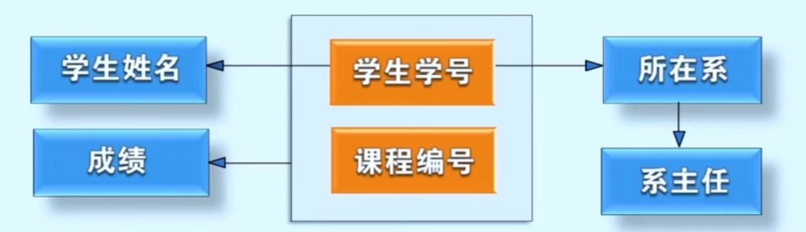
   > 
   > $$
   > F = \{ (学生学号，课程编号) \to 成绩, \\
学生学号 \to 学生姓名,\\
学生学号 \to 所在系, \\
所在系 \to 系主任, \dots \}
   > $$
   > 
   > ---
   > 
   > **以下函数依赖也成立**
   > 
   > $$
   > (学生学号，学生姓名) \to 学生姓名 \\
(学生学号，所在系) \to 学生学号 \\
(学生学号，所在系) \to 所在系
   > $$
   > 
   > 【<u>**平凡函数依赖 \ 非平凡函数依赖**</u>】
   > 
   > 在 $R(U)$ 中，$X \subseteq U, Y \subseteq U$，若 $Y \subseteq X, X \to Y$ 成立，称为 ***平凡函数依赖***，否则称为 ***非平凡函数依赖***
   > 
   > 1> 平凡函数依赖  $X \to Y, Y \subseteq X$
   > 
   > 2> 非平凡函数依赖  $X \to Y, Y \not\subset X$
   
   - <u>**完全函数依赖 \ 部分函数依赖**</u>
     
     在 $R(U)$ 中，$X \subseteq U, Y \subseteq U$，且 $X \neq Y$，若 $X \to Y$，且不存在 $X' \subset X$，使 $X' \to Y$，则称 $Y$ ***完全函数依赖*** 于 $X$，记为 $X \stackrel{f}{\to} Y$；否则称 $Y$ ***部分函数依赖*** 于 $X$，记为 $X \stackrel{p}{\to} Y$
     
     也就是说，完全函数依赖是指 $Y$ 不依赖于 $X$ 的**任何子集**；而部分函数依赖则指 $Y$ 依赖于 $X$ 的**部分属性集**；
     
     当 $X$ 为单属性时，$X \to Y$ 则必为完全函数依赖；
     
     > 接上述实例
     > 
     > $$
     > (学生学号，课程编号) \to 成绩 \\
(学生学号，课程编号) \to 所在系
     > $$
     > 
     > 根据完全函数依赖与部分函数依赖
     > 
     > $$
     > (学生学号，课程编号) \stackrel{f}{\to} 成绩 \\
(学生学，课程编号) \stackrel{p}{\to} 所在系 \\
学生学号 \stackrel{f}{\to} 所在系 \\
所在系 \stackrel{f}{\to} 系主任
     > $$
   
   - <u>**传递函数依赖**</u>
     
     在 $R(U)$ 中，$X \subseteq U, Z \subseteq U$，若存在 $Y \subseteq U, Y \not\subset X, Z \not\subset Y$，使得 $X \to Y, Y \to Z$，且 $Y \nrightarrow X$，则称 $Z$ ***传递函数依赖*** 于 $X$，记为 $X \stackrel{t}{\to} Z$
     
     > $$
     > 学生学号 \stackrel{f}{\to} 所在系 \\
所在系 \stackrel{f}{\to} 系主任 \\
学生学号 \stackrel{t}{\to} 系主任
     > $$
   
   - <u>**函数依赖定义候选键**</u>
     
     - *之前候选键定义*
       
       若关系 $R$ 中某一属性或属性集 $K$ 的值可以唯一标识一个元组，而其任意一个真子集无此特性，则 $K$ 为候选键【候选码】
     
     - 函数依赖定义候选键
       
       若 $K$ 是关系 $R$ 中的属性或属性集，且 $K$ 完全函数决定关系的所有属性，则 $K$ 为 $R$  的候选键
     
     $$
     (学生学号，课程编号) \stackrel{f}{\to} \\
(学生学号，课程编号，学生姓名，所在系，系主任，成绩) \\
\quad \\
(学生学号，课程编号) \stackrel{f}{\to} 成绩 \\
(学生学号，课程编号) \stackrel{p}{\to} 学生姓名 \\
(学生学号，课程编号) \stackrel{p}{\to} 所在系 \\
(学生学号，课程编号) \stackrel{t}{\to} 系主任
     $$
   
   - <u>**函数依赖与数据冗余 \ 更新异常等问题的关系**</u>
     
     - *数据冗余*
       
       存在学生姓名，所在系，系主任信息的冗余
     
     - *更新异常*
       
       1> 无法插入一个学生的信息、一个系的信息
       
       2> 无法删除学生的选课信息，或同时把该学生的信息也删除掉
     
     - *数据不一致*
       
       修改学生所在系或系主任的信息，出现系相同主任不同，或不同的系有相同的主任
     
     > 关系模式的部份依赖与传递依赖才是导致关系模式存在数据冗余等问题的根源

## 范式

1. <mark>**<font color = red>范式发展</font>**</mark>
   
   - 1971-1972，E.F.Codd 提出了 1NF, 2NF, 3NF
   
   - 1974，Codd, Boyce 共同提出了 BCNF
   
   - 1976，Fagin 提出了 4NF
   
   - 提出了 5NF

2. **<mark><font color = red>概念 Normal Forms</font></mark>**
   
   - 数据依赖满足**一定约束**的关系模式，称为范式
   
   - 满足最低要求的称为第一范式，简称 1NF；在 1NF 的基础上满足进一步要求的为 2NF，其余范式以此类推
   
   - 范式表示符合**某一级别的关系模式的集合**，则 $R$ 为第几范式可写成 $R \in xNF$
