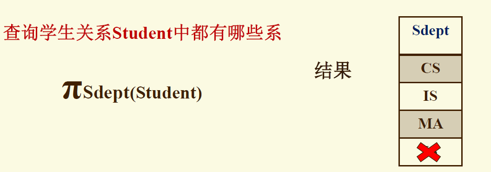

# 数据库基本概念

## 数据和信息

1. **<mark>信息</mark>**
   
   **信息**是客观存在的，是关于现实世界事物的存在方式或运动状态反映的综合
   
   > e.g.  某学校的学生

2. **<mark>数据</mark>**
   
   **数据**是用来记录信息的可识别的符号，是信息的具体表现形式
   
   > e.g.  计算机中的一张二维表，该数据学生的基本信息

3. **<mark>数据与信息的联系</mark>**
   
   - 数据是信息的符号表示或载体
   
   - 信息则是数据的内涵，是对数据的语义解释

## 数据库

1. **数据库**
   
   **数据库  Database DB** 是长期储存在计算机内、有组织的、可共享的数据集合

2. **特点**
   
   - 数据量大  Massive
   
   - 持久  Persistent
   
   - 安全  Safe
   
   - 多用户  Multi-user
   
   - 方便  Convenient
   
   - 高效  Efficient
   
   - 可靠  Reliable
   
   ---
   
   - <u>数据按一定的数据模型组织、描述和储存</u>
   
   - <u>可为各种用户共享</u>
   
   - <u>冗余度较小</u>
   
   - <u>数据独立性较高</u>
   
   - <u>易扩展</u>

## 数据库管理系统

1. **<mark>数据库管理系统</mark>**
   
   - **数据库管理系统 Database Management System  DBMS** 是位于用户与操作系统之间的一层数据管理软件
   
   - 科学地组织和存储数据、高效地获取和维护数据

## 数据库系统

1. **数据库系统**
   
   **数据库系统  Database System  DBS** 是指计算机系统中引入数据库后的系统构成

2. **数据库系统的构成**
   
   - <u>数据库</u>
   
   - <u>数据库管理系统</u>
   
   - <u>应用系统及其开发工具</u>
   
   - <u>相关人员</u>
     
     - 数据库管理员
     
     - 应用系统开发人员、用户

## 数据库管理员

1. **<mark>数据库管理员</mark>**
   
   - **数据库管理员  Database Administrator  DBA**
   
   - 负责全面<u>管理</u>和<u>控制</u>数据库系统，是数据库系统中最重要的人员

2. <mark>**主要职责**</mark>
   
   - 设计和定义数据可靠系统
   
   - 帮助最终用户使用数据库系统
   
   - 监督与控制数据库系统的使用和运行
   
   - 改进和重组数据库系统
   
   - 调优数据库系统的性能
   
   - 转储和恢复数据库
   
   - 重构数据库

## 数据库系统的体系结构

1. **三级模式**
   
   在用户（或应用程序）到数据库之间，DB 的数据结构有3个层次：**外部模型，逻辑模型和内部模型**
   
   这三个层次要用 DB 的数据定义语言 DDL 定义，定义以后的内容，称为 ”模式“
   
   - <mark>***逻辑模式 / 模式  Schema***</mark>
     
     - 数据库中<u>全体数据</u>的逻辑结构和特征的描述
     
     - 是综合了<u>所有用户</u>的需求的<u>公共</u>数据视图
     
     - *<u>一个数据库只有一个逻辑模式</u>*
     
     - <u>逻辑模式的地位</u>
       
       是数据库系统模式结构的中间层
       
       > 与数据的物理存储细节和硬件环境无关
       > 
       > 与具体的应用程序、开发工具及高级程序设计语言无关
     
     - <u>逻辑模式定义的内容</u>
       
       1\> 数据的逻辑结构【数据项的名字、类型、取值范围等】
       
       2\> 数据之间的联系
       
       3\> 数据有关的安全性、完整性要求
   
   - ***<mark>外模式 / 子模式 / 用户模式  External Schema</mark>***
     
     - 数据库用户（包括应用程序员和最终用户）使用的<u>局部数据</u>的逻辑结构和特征的描述
     
     - 数据库用户的数据视图，是与<u>某一应用</u>有关的数据的逻辑表示
     
     - <u>外模式的地位</u>
       
       介于模式与应用之间
       
       > 外模式通常是逻辑模式的子集
     
     - <u>*外模式与应用的关系*</u>
       
       一对多
     
     - <u>外模式的用途</u>
       
       1\> 保证数据库安全性的一个有力措施；每个用户只能看见和访问所对应的外模式中的数据
       
       2\> 保证数据独立性的一个有力措施
   
   - ***<mark>内模式 / 存储模式   Internal Schema</mark>***
     
     - 是数据物理结构和存储方式的描述
     
     - 是数据在数据库内部的表示方式
     
     - <u>*一个数据库只有一个内模式*</u>

2. **两级映射**
   
   - ***<mark>外模式 / 模式 映射</mark>***
     
     - 定义外模式与逻辑模式之间的对应关系
     
     - <u>*每一个外模式都对应一个外模式 / 模式 映射*</u>
     
     - 映射定义通常包含在各自外模式的描述中
   
   - ***<mark>模式 / 内模式 映射</mark>***
     
     - 定义逻辑结构与存储结构之间的对应关系
       
       > e.g.  说明逻辑记录和字段在内部是如何表示的
     
     - <u>*数据库中模式 / 内模式映射是**唯一**的*</u>
     
     - 该映射定义通常包含在逻辑模式描述中

## 数据独立性

应用程序和数据之间相互独立

1. **<mark>逻辑独立性</mark>**
   
   - 用户的<u>应用程序</u>与<u>数据库</u>的逻辑结构相互独立；数据的逻辑结构改变了，应用程序也可以不变
   
   - ***外模式 / 模式 映射保证了数据的逻辑独立性***
     
     - 当模式改变时，数据库管理员修改有关的外模式 / 模式 映射，使外模式保持不变
     
     - 应用程序是一句数据的外模式编写的，从而应用程序不必修改，保证了数据与程序的逻辑独立性

2. **<mark>物理独立性</mark>**
   
   - 用户的<u>应用程序</u>与存储在磁盘上的数据库中<u>数据</u>是相互独立的；当数据的物理存储改变了，应用程序不用改变
   
   - ***模式 / 内模式 映射的用途是保证数据的物理独立性***
     
     - 当数据库的存储结构改变了（例如选用了另一种存储结构），数据库管理员修改模式 / 内模式映射，使模式保持不变
     
     - 应用程序不受影响，保证了数据与程序的物理独立性

## 数据模型

1. **数据模型**
   
   - 在数据库中用**数据模型**这个工具来抽象、表示和处理现实世界中的数据和信息
   
   - <u>*数据模型就是现实世界的模拟*</u>
   
   - ***数据模型应满足三方面要求***
     
     1\> 能比较真实地模拟现实世界
     
     2\> 容易为人所理解
     
     3\> 便于在计算机上实现

2. **数据模型的三要素**
   
   - ***数据结构***
     
     用于描述静态特性
   
   - ***数据操作***
     
     用于描述动态特性
   
   - ***数据的约束条件***
     
     是一组完整性规则的集合

3. **数据模型的分类**
   
   - ***关系模型***
   
   - ***半结构化数据模型***
     
     1\> 网状模型
     
     2\> 层次模型
     
     3\> XML
     
     4\> JSON

# 关系数据模型

## 关系数据库系统

1. **<mark>关系数据库系统</mark>**
   
   - 关系数据库系统是支持关系模型的数据库系统
   
   - **1970年** IBM 公司的 E.F.Codd 提出关系数据模型
   
   - 之后提出了**关系代数**和**关系演算**的概念
   
   - **1972年**提出了关系的**第一、第二、第三范式**
   
   - **1974年**提出了关系的 **BC 范式**

## 关系模型

1. **关系数据结构**
   
   - 单一的数据结构——***关系***
     
     现实世界的实体以及实体间的各种联系均用关系来表示
   
   - 数据的逻辑结构——***二维表***
     
     从用户角度，关系模型中数据的逻辑结构是一张二维表
   
   - 关系模型建立在<u>**集合代数**</u>的基础上
     
     
     
     - <mark>**域**</mark>
       
       一组具有相同类型的值的集合
       
       > e.g.
       > 
       > 1\> 整数
       > 
       > 2\> 实数
       > 
       > 3\> 指定长度的字符串集合
       > 
       > 4\> 介于某个取值范围的整数
       > 
       > 5\> \{'男', '女'\}
       > 
       > 6\> 介于某个取值范围的日期
       > 
       > 7\> 以上二维表的列
     
     - <mark>**笛卡尔积**</mark>
       
       集合的乘积
       
       给定一组域 $D_1, D_2, \dots, D_n$，<u>这些域可以完全不同，也可以部分或全部相同</u>
       
       该域的笛卡尔积为：
       
       $$
       D_1 \times D_2 \times \dots \times D_n = \{(d_1, d_2, \dots, d_n) | d_i \in D_i, i = 1, 2, \dots, n \}
       $$
       
       1\> 所有域的所有取值的一个组合
       
       2\> 不能重复
       
       > e.g.
       > 
       > 集合方式表示
       > 
       > 
       > 
       > 二维表表示
       > 
       > 
     
     - <mark>**关系**</mark>
       
       从笛卡尔积中筛选出有意义的元组称为**关系**
       
       表示为 $R(D_1, D_2, \dots, D_n)$
       
       $R$: 关系名
       
       $n$: 关系的目或度 Degree
       
       
     
     - <mark>**候选键 / 主属性 / 主键**</mark>
       
       ***候选键  Candidate Key*** 在关系中能**唯一**标识元组的属性或属性集
       
       ***主属性  Prime Attribute*** 候选键的各个属性
       
       ***主键  Primary Key*** 用户选作元组标识的候选键
     
     - <mark>**关系模式**</mark>
       
       **关系模式  Relation Schema** 是对关系的描述
       
       
       
       学生(学号,姓名,年龄,性别,籍贯)
     
     - <mark>**关系数据库**</mark>
       
       在一个给定的应用领域中，所有实体及实体之间联系的关系的集合构成一个**关系数据库**
       
       > e.g.
       > 
       > 教学管理数据库中有四个关系：教师关系 T，课程关系 C，学生关系 S，选课关系 SC
     
     **关系数据库模式**是关系数据库的型，是对关系数据库的描述
     
     > e.g.
     > 
     > 教学管理数据库中有四个关系模式：
     > 
     > T(TID, TNAME, TITLE)
     > 
     > C(CID, CNAME, TID)
     > 
     > S(SID, SNAME, AGE, SEX)
     > 
     > SC(SID, CID, SCORE)

2. **关系操作**
   
   ***查询、插入、删除、修改***
   
   - <u>**特点**</u>
     
     集合操作方式
   
   - <u>**关系数据语言的种类**</u>
     
     - 关系代数语言
     
     - 关系演算语言
     
     - 同时具有以上两种特点的语言，如 SQL
   
   - <u>**关系数据语言的特点**</u>
     
     - 是一种高度飞过成化的语言
     
     - 能够嵌入高级语言中使用

3. **完整性约束**
   
   - <u>**关系的完整性约束**</u>
     
     - 关系模型的完整性规则指对关系的某种约束条件
     
     - 关系模型中三类完整性约束：
       
       1\> <u>实体完整性</u>
       
       2\> <u>参照完整性</u>
       
       3\> <u>用户自定义的完整性</u>
     
     - <u>实体完整性</u>和<u>参照完整性</u>是关系模型必须满足的完整性约束条件被称作是关系的两个**不变性**，应该由关系系统自动支持
   
   - <u>**实体完整性  Entity Intergrity**</u>
     
     - 主键唯一且不能为空
     
     - 主属性不能取空值
     
     - ***关系模型必须遵守实体完整性规则***
       
       1. 实体完整性规则是针对<mark>基本关系</mark>而言的
       
       2. 现实世界中的实体和实体间的联系都是可区别的，即它们具有某种<mark>唯一性标识</mark>
       
       3. 关系模型中以<mark>候选键</mark>作为惟一性标识
       
       4. 所谓<mark>空值</mark>就是 “不知道” 或 “无意义” 的值
   
   - **<u>参照完整性</u>**
     
     - ***关系间的引用***
       
       
       
       > e.g.
       > 
       > 学生实体  专业实体  专业与学生间的联系
       > 
       > 专业(<u><mark>专业号</mark></u>, 专业名)
       > 
       > 学生(<u>学号</u>, 姓名, 性别, <mark>专业号</mark>, 出生日期)
     
     - ***外键  Foreign Key***
       
       如果一个关系 $R$ 中的一个属性 $F$ 对应着另一关系 $S$ 的主键 $K$，那么 $F$ 在关系 $R$ 中称为**外键**
       
       
     
     - ***参照完整性规则***
       
       1. 参照完整性规则就是定义外键与主键之间的引用规则
       
       2. 外键的取值必须为
          
          1\> 或空值
          
          2\> 或等于被参照表中某个元组的主键值
   
   - **<u>用户自定义完整性</u>**
     
     - 用户自定义完整性是针对某一具体关系数据库的约束条件，反映某一具体应用所涉及的数据必须满足的语义要求
     
     - 关系模型应提供定义和检验这类完整性的机制，以便用统一的系统的方法处理它们，而不要由应用程序承担这一功能
     
     > e.g.
     > 
     > 课程(<u>课程号</u>, 课程名, 学分)
     > 
     > “课程名” 属性必须取唯一值
     > 
     > 非主属性 “课程名” 也不能取空值
     > 
     > “学分” 属性只能取值 \{1, 2, 3, 4\}

# 关系数据语言

## 关系代数

1. **<mark>关系代数</mark>**
   
   - 是一种抽象的**数据查询语言**
   
   - 用对**关系**的运算来表达**查询**

2. **<mark>关系运算符分类</mark>**
   
   

3. **<mark>并、差、交 【传统集合运算符】</mark>**
   
   - $R \cup S$
     
     并 union，结果由属于 $R$ 或属于 $S$ 的所有元组组成
     
     > e.g.
     > 
     > 
   
   - $R \cap S$
     
     交 intersection，结果既属于 $R$ 又属于 $S$ 的元组组成
     
     > e.g.
     > 
     > 
   
   - $R - S$
     
     差 difference，结果由属于 $R$ 而不属于 $S$ 的所有元组组成
     
     
     
     > e.g.
     > 
     > 
   
   - ***先决条件***
     
     - $R$ 和 $S$ 的属性个数必须相同
     
     - 对应属性必须取自同一个域

4. **<mark>投影、选择</mark>**
   
   - ***投影  Projection***
     
     - 从 $R$ 中选择出若干属性列组成新的关系
     
     - 表示为 $\pi_L(R)$ : $\pi$ <u>与</u> $R$ <u>一样大</u>
     
     - $L$ 为 $R$ 中的属性列表
     
     - 结果为只包含 $R$ 中某些列的新的关系
     
     - 结果要去掉重复元组
     
     > e.g.
     > 
     > 
     > 
     > 
   
   - ***选择  Selection***
     
     - 在关系 $R$ 中选择满足给定条件的各个元组
     
     - 表示为 $\sigma_C(R)$
     
     - $C$ 为选择条件，是一个逻辑表达式
     
     - 结果为只包含 $R$ 中某些元组的新的关系
     
     > e.g.
     > 
     > 
     > 
     > 
     > 
     > 
   
   ---
   
   

5. **<mark>笛卡尔积、连接</mark>**
   
   - ***笛卡尔积  Product***
     
     > e.g.
     > 
     > 
   
   - ***连接  Join***
     
     - $\theta$ <u>连接</u>
       
       也称为连接
       
       
       
       $A, B$: 分别为 $R, S$ 上度数相等且可比的属性组
       
       $\theta$： 比较运算符
       
       连接运算 从 $R$ 和 $S$ 的 笛卡尔积 $R \times S$ 中选取（$R$ 关系）在 $A$ 属性组上的
       值与（$S$ 关系）在 $B$ 属性组上值满足比较条件的元组
       
       等价于 $\sigma_{A \theta B}(R \times S)$
       
       > e.g.
       > 
       > 
     
     - <u>等值连接</u>
       
       $\theta$ 为 "=" 的连接运算称为**等值连接**
       
       
       
       从关系 $R$ 与 $S$ 的笛卡尔积中选取 $A, B$ 属性值相等的那些元组
       
       > e.g.
       > 
       > 
     
     - <u>自然连接</u>
       
       自然连接是在公共属性(组)上进行的等值连接
       
       1\> 两个关系中必须具有公共属性(组) 即相同的列名和域
       
       2\> 在结果中把重复的属性列去掉
       
       
       
       > e.g.
       > 
       > 

6. **<mark>重命名</mark>**
   
   记为 $\rho$
   
   $\rho_{S(A1, \dots, A_n)}(R)$
   
   - 将关系 $R$ 重命名为 $S$
   
   - 将关系 $S$ 中的各属性命名为 $A1, A2, \dots, A_n$

7. **<mark>e.g.</mark>**
   
   
   
   

8. **<mark>等价运算</mark>**
   
   

# 数据库设计

## 数据库设计及其步骤

1. **数据库设计**
   
   **数据库设计  Database Design  DBD**
   
   - 构造最优的数据模型，建立数据库及其应用系统的过程
   
   - 目前数据库已用于各类应用系统，MIS, DSS, OAS 等
   
   - **数据库设计的优劣**将直接影响应用系统的质量和运行效果

2. **数据库设计全过程**
   
   
   
   - ***规划阶段***
     
     - <u>系统调查</u>
       
       1\> 对应用单位作全面的调查，发现其存在的主要问题
       
       2\> 画出**组织层次图**，以了解企业的组织机构
     
     - <u>可行性分析</u>
       
       1\> 从技术、经济、效益、法律等方面对建立数据库系统的可行性进行分析
       
       2\> 写出**可行性分析报告**
       
       3\> 组织专家进行讨论其可行性
     
     - <u>确定数据库系统的总目标</u>
       
       1\> 对应用单位的工作流程进行优化和制定项目开发计划
       
       2\> 在得到决策部门批准后，就正式进入数据库系统的开发工作
   
   - ***需求分析阶段***
     
     - 计算机人员 / 系统分析员和用户双方共同收集数据库所需要的信息内容和用户对处理的需求
     
     - 以**需求说明书**的形式确定下来，作为以后系统开发的指南和系统验证的依据
   
   - ***概念设计阶段***
     
     概念设计的目标是产生反映用户需求的数据库概念结构，即概念模型
     
     概念模型具有**硬件独立，软件独立**的特点
     
     【主要步骤】
     
     - <u>进行数据抽象，设计局部概念模型</u>
     
     - <u>将局部概念模型综合成全局概念模型</u>
     
     - <u>评审</u>
     
     【方法】
     
     - <u>概念设计中最著名的方法就是**实体联系方法  ER 方法**</u>
     
     - <u>概念设计的结果是得到一个**与 DBMS 无关**的概念模型</u>
   
   - ***逻辑设计阶段***
     
     逻辑设计的目的是把概念设计阶段设计好的 概念模型转换成与选用的具体机器上的 DBMS 所支持的数据模型相符合的逻辑结构（包括数据库逻辑模型和外模型）
     
     对于逻辑设计而言，应首先选择 DBMS ，但往往数据库设计人员没有挑选的余地，都是在指定的 DBMS 上进行逻辑结构的设计
     
     【主要步骤】
     
     - <u>把概念模型转换成逻辑模型</u>
     
     - <u>设计外模型</u>
     
     - <u>设计应用程序与数据库的接口</u>
     
     - <u>评价模型</u>
     
     - <u>修正模型</u>
   
   - ***物理设计阶段***
     
     对于给定的基础数据模型选取一个最适合应用环境的物理结构的过程
     
     【主要步骤】
     
     - <u>存储记录结构设计</u>
     
     - <u>确定数据存放位置</u>
     
     - <u>存取方法的设计</u>
     
     - <u>完整性和安全性考虑</u>
     
     - <u>程序设计</u>
   
   - ***数据库的实现***
     
     - <u>用 DDL 定义数据库结构</u>
     
     - <u>组织数据入库</u>
     
     - <u>编制与调试应用程序</u>
   
   - ***数据库的运行与维护***
     
     对数据库经常性的维护工作主要是由 DBA 完成的
     
     - <u>数据库的转储和恢复</u>
     
     - <u>数据库安全性 完整性控制</u>
     
     - <u>数据库性能的监督，分析和改进</u>
     
     - <u>数据库的重组织和重构造</u>
     
     若应用变化太大，已无法通过重构数据库来满足新的需求，或重构数据库的代价太大，则表明现有数据库应用系统的生命周期已经结束，应该重新设计新的数据库系统，开始 新数据库应用系统的生命周期

## ER 模型

1. **<mark>ER 模型</mark>**
   
   Entity Relationship Model 实体联系模型由 Proferssor Peter Chen 于1976年提出

2. **<mark>ER 模型的基本元素</mark>**
   
   - ***实体  Entity***
     
     - **实体**指数据对象，指应用中可以区别的客观存在的事物
     
     - **实体集  Entity Set** 是指同一类实体构成的集合
   
   - ***属性  Attribute***
     
     - 实体的某一特征称为**属性**
     
     - 在一个实体中，能够惟一标识实体的属性或属性集称为**实体标识符**
     
     - 一个实体只有一个标识符，实体标识符有时也称为**实体的主键**
   
   - ***联系  Relationship***
     
     - 表示一个或多个实体之间的关联关系
     
     - **联系集  Relationship Set** 指同一类联系构成的集合，与联系统称为联系
     
     - <u>联系的元数</u>
       
       一个联系涉及到的实体集个数，称为该联系的**元数**或**度数  Degree**S

3. **<mark>联系的设计</mark>**

4. **<mark>采用 ER 模型的概念设计步骤</mark>**
   
   - ***首先设计局部 ER 模型***
     
     - <u>确定局部结构范围</u>
     
     - <u>确定实体</u>
     
     - <u>确定属性</u>
     
     - <u>确定实体间联系</u>
   
   - ***然后把各局部 ER 模型综合成一个全局 ER 模型***
     
     - <u>确定公共实体类型</u>
       
       根据实体类型名和键来认定公共实体类型
     
     - <u>合并局部 ER 模型</u>
       
       首相进行两两合并，先合并那些现实世界中有联系的局部结构
       
       合并从公共类型开始，最后再加入独立的局部结构
     
     - <u>消除冲突</u>
       
       属性冲突（属性域冲突）
       
       结构冲突
       
       命名冲突
   
   - ***最后对全局 ER 模型进行优化，得到最终的 ER 模型即概念模型***
     
     - <u>合并实体类型</u>
     
     - <u>消除冗余属性</u>
     
     - <u>消除冗余联系</u>

5. **<mark>ER 模型转换为关系模式</mark>**
   
   - ***ER 图转换成关系模式集的规则***
     
     - <u>实体类型的转换</u>
       
       将每个实体类型转换成一个关系模式；实体的属性即为关系模式的属性，实体标识符即为关系模式的键
     
     - <u>联系类型的转换</u>
       
       不同情况做不同处理
       
       【二元联系类型的转换】
       
       1. 若实体间联系是1:1，可以在两个实体类型转换成的两个关系模式中任意一个关系模式的属性中加入另一个关系模式的键和联系类型的属性
       
       2. 若实体间联系是1:n，则在 n 端实体类型转换成的关系模式中加入1端实体类型的键和联系类型的属性
       
       3. 若实体间联系是 m:n，则将联系类型也转换成关系模式，其属性为两端实体类型的键加上联系类型的属性，而键为两端实体键的组合
   
   - ***采用 ER 模型的逻辑设计步骤***
     
     - <u>导出初始关系模式集</u>
     
     - <u>规范化处理</u>
       
       逐一考察关系模式
       
       判断它们是否满足规范要求
     
     - <u>模式评价</u>
     
     - <u>模式修正</u>
     
     - <u>设计子模式</u>

## UML 模型

# 关系数据库设计理论

## 数据依赖

1. **关系模式中的数据依赖**
   
   - ***概念回顾***
     
     - <u>**关系**</u>
       
       描述实体及其属性、实体间的联系
     
     - <u>**关系模式**</u>
       
       用来定义关系
     
     - <u>**关系数据库**</u>
       
       基于关系模型的数据库，利用关系来描述现实世界
     
     - <u>**关系数据库的模式**</u>
       
       定义这组关系的关系模式的全体
   
   - ***关系模式的形式化定义***
     
     关系模式由五部分组成，即它是一个五元组
     
     $$
     R(U, D, DOM, F)
     $$
     
     $R$: 关系名
     
     $U$: 组成该关系的属性名集合
     
     $D$: 属性组 $U$ 中属性所来自的域
     
     $DOM$: 属性向域的映象集合
     
     $F$: 属性间数据的依赖关系集合
     
     <u>常用的有</u>
     
     $$
     R(U) \\
R(U, F)
     $$
   
   - ***数据依赖***
     
     > 完整性约束的表现形式
     > 
     > - 限定属性的取值范围：例如学生成绩必须在0-100之间
     > 
     > - 定义属性值间的相互关注（主要体现于值的相等与否），这就是数据依赖，它是数据库模式设计的关键
     
     1\> 是通过一个关系中**属性间值的相等与否**体现出来的数据间的相互关系
     
     2\> 是现实世界**属性间相互联系**的抽象
     
     3\> 是数据内在的性质
     
     4\> 是语义的体现

2. **函数依赖  Functional Dependency  FD**
   
   设 $R(U)$ 是一个属性集 $U$ 上的关系模式，$X, Y$ 是 $U$ 的子集；若对于 $R(U)$ 的任意一个可能的关系 $r$
   
   $r$ 中不可能存在两个元组在 $X$ 上的属性值相等，而在 $Y$ 上的属性值不等，则称 “$X$ **函数确定** $Y$” 或 “$Y$ **函数依赖于** $X$”，记作 $X \to Y$
   
   $X$ 称为这个函数依赖的<u>决定属性集  Determinant</u>
   
   > e.g.
   > 
   > 写出所有函数依赖
   > 
   > $$
   > Student(Sno, Sname, Ssex, Sage, Sdept)
   > $$
   > 
   > 假设不允许重名
   > 
   > $Sno \to Ssex; Sno \to Sage; Sno \to Sdept; Sno \leftrightarrow Sname;$
   > 
   > $Sname \to Ssex; Sname \to Sage; Sname \to Sdept$

3. **平方函数依赖与非平凡函数依赖**
   
   如果 $X \to Y$，但 $Y \subsetneq X$，则称 $X \to Y$ 是**非平凡的函数依赖**
   
   若 $X \to Y$，但 $Y \subseteq X$ 则称 $X \to Y$ 是**平凡的函数依赖**
   
   > e.g.
   > 
   > 在关系模式 $SC(Sno, Cno, Grade)$ 中
   > 
   > **非平凡函数依赖**: $(Sno, Cno) \to Grade$
   > 
   > **平凡函数依赖**:
   > 
   > $(Sno, Cno) \to Sno$; $(Sno, Cno) \to Cno$
   
   <u>对于任一关系模式，平凡函数依赖都是必然成立的，它不反映新的语义，因此若不特别声明，我们总是讨论非平凡函数依赖</u>

4. **完全函数依赖与部分函数依赖**
   
   在关系模式 $R(U)$ 中
   
   如果 $X \to Y$，并且对于 $X$ 的任何一个真子集 $X'$，都有 $X' \to Y$，则称**完全函数依赖于** $X$，记作 $X \stackrel{f}{\rightarrow} Y$
   
   若 $X \to Y$，但 $Y$ 不完全函数依赖于 $X$，则称 $Y$ **部分函数依赖于** $X$，记作 $X \stackrel{p}{\rightarrow} Y$
   
   > e.g.
   > 
   > $$
   > SC(Sno, Cno, Grade)
   > $$
   > 
   > $Sno \nrightarrow Grade; Cno \nrightarrow Grade; (Sno, Cno) \stackrel{f}{\rightarrow} Grade; (Sno, Cno) \stackrel{p}{\rightarrow} Sno$
   > 
   > $(Sno, Cno) \stackrel{p} {\rightarrow} Cno$
   > 
   > $$
   > Student(Sno, Sname, Ssex, Sage, Sdept)
   > $$
   > 
   > $Sno \stackrel{f} {\rightarrow} Sname; Sno \stackrel{f} {\rightarrow} Ssex; Sno \stackrel{f} {\rightarrow} Sage; Sno \stackrel{f} {\rightarrow} Sdept$
   > 
   > $(Sno, Sname) \stackrel{p} {\rightarrow} Sdept; (Sno, Ssex) \stackrel{p} {\rightarrow} Sdept$

5. **传递函数依赖**
   
   在关系模式 $R(U)$ 中
   
   如果 $X \to Y, Y \to Z$，且 $Y \subsetneq X, Y \nrightarrow X$，则称 $Z$ **传递函数依赖于** $X$
   
   如果 $Y \to X$，即 $X \leftrightarrow Y$，则 $Z$ **直接依赖于** $X$
   
   > e.g.
   > 
   > 在关系 $Std(Sno, Sdept, Mname)$ 中
   > 
   > 有 $Sno \to Sdept, Sdept \to Mname$
   > 
   > 则 $Mname$ 传递函数依赖于 $Sno$

6. **码**

7. **多值依赖  Multivalued Dependency  MVD**

8. **连接依赖**

9. **数据依赖对关系模式的影响**

10. **有关概念**

## 范式

1. **<mark>范式</mark>**
   
   关系数据库中的关系必须满足一定的要求，满足不同程度要求的为不同范式
   
   范式是符合某一种级别的关系模式的集合

2. **<mark>第一范式  1NF</mark>**
   
    如果一个关系模式 $R$ 的所有属性都是不可分的基本数据项，则 $R \in 1NF$
   
   - 第一范式是对关系模式的**最基本**的要求
   
   - 不满足第一范式的数据库模式不能称为关系数据库
   
   - 但是满足第一范式的关系模式并**不一定是一个好的关系模式**

3. **<mark>第二范式  2NF</mark>**
   
   若关系模式 $R \in 1NF$，并且每一个**非主属性**都完全**函数依赖**于 $R$ 的码，则 $R \in 2NF$

4. **<mark>第三范式  3NF</mark>**
   
   关系模式 $R \in 1NF$，且不存在非主属性对码的传递函数依赖，则称 $R \in 3NF$

5. **<mark>BC 范式  BCNF</mark>**
   
   $BCNF \ \ Boyce \ Codd \ Normal \ Form$ 是由 Boyce 和 Codd 提出的，比 $3NF$ 更进一步，通常认为 **BCNF 是修正的第三范式**
   
   设关系模式 $R \in 1NF$，如果对于 $R$ 的每个函数依赖 $X \to Y$，若 $Y$ 不属于 $X$，则 $X$ 必含有候选码，那么 $R \in BCNF$
   
   换句话说，在关系模式 $R$ 中，如果每一个**决定属性集**都包含候选码，则 $R \in BCNF$
   
   > - 采用投影分解法将一个 $3NF$ 的关系分解为多个 $BCNF$ 的关系，可以进一步解决原 $3NF$ 关系中可能存在的插入异常、删除异常、数据冗余度大、修改复杂等问题
   > 
   > - <u>**BCNF 的关系模式所具有的性质**</u>
   >   
   >   - 所有**非主属性**都完全函数依赖于每个候选码
   >   
   >   - 所有**主属性**都完全函数依赖于每个不包含它的候选码
   >   
   >   - **没有任何属性**完全函数依赖于非码的任何一组属性
   > 
   > - $3NF$ 与 $BCNF$ 的关系
   >   
   >   - 如果关系模式 $R \in BCNF$，必定有 $R \in 3NF$
   >   
   >   - 如果 $R \in 3NF$，且 $R$ 只有一个候选码，则 $R$ 必属于 $BCNF$
   > 
   > - 如果一个关系数据库中的所有关系模式都属于 $BCNF$，那么在函数依赖范畴内，它已实现了模式的彻底分解，达到了最高的规范化程度，消除了插入异常和删除异常

6. **<mark>第四范式  4NF</mark>**

7. **<mark>第五范式  5NF</mark>**

8. **<mark>各范式之间关系</mark>**
   
   $$
   1NF \supset 2NF \supset 3NF \supset BCNF \supset 4NF \supset 5NF
   $$
   
   某一关系模式 $R$ 为第 $n$ 范式，可简记为 $R \in nNF$

## 关系模式的规范化

1. **关系模式的规范化理论**
   
   - 关系数据库的规范化理论是数据库**逻辑设计**的工具
   
   - 一个关系只要其分量都是不可分的数据项，它就是规范化的关系，但这只是**最基本的规范化**
   
   - 规范化程度可以有6个不同的级别，即6个范式
   
   - 一个低一级范式的关系模式，通过**模式分解**可以转换成若干个高一级范式的关系模式集合，这种过程就叫**关系模式的规范化**
   
   

2. **关系模式的规范化的步骤**
   
   - 规范化的**基本思想**是逐步消除数据依赖中不合适的部分，使模式中的各关系模式达到某种程度的 “分离”
   
   - 即采用 “一事一地” 的模式设计原则，让一个关系描述一个概念、一个实体或者实体间的一种联系
   
   - 若多于一个概念就把它 “分离” 出去；因此所谓**规范化实质上是概念的单一化**
   
   - 不能说规范化程度越高的关系模式就越好
   
   - 在设计数据库模式结构时，必须对现实世界的实际情况和用户应用需求作进一步分析，确定一个合适的、能够反映现实世界的模式
   
   - 上面的规范化步骤可以在其中任何一步终止

3. **关系模式的分解**
