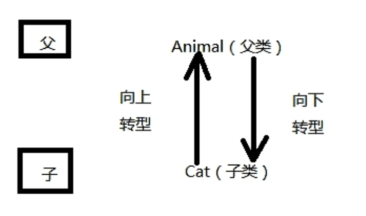
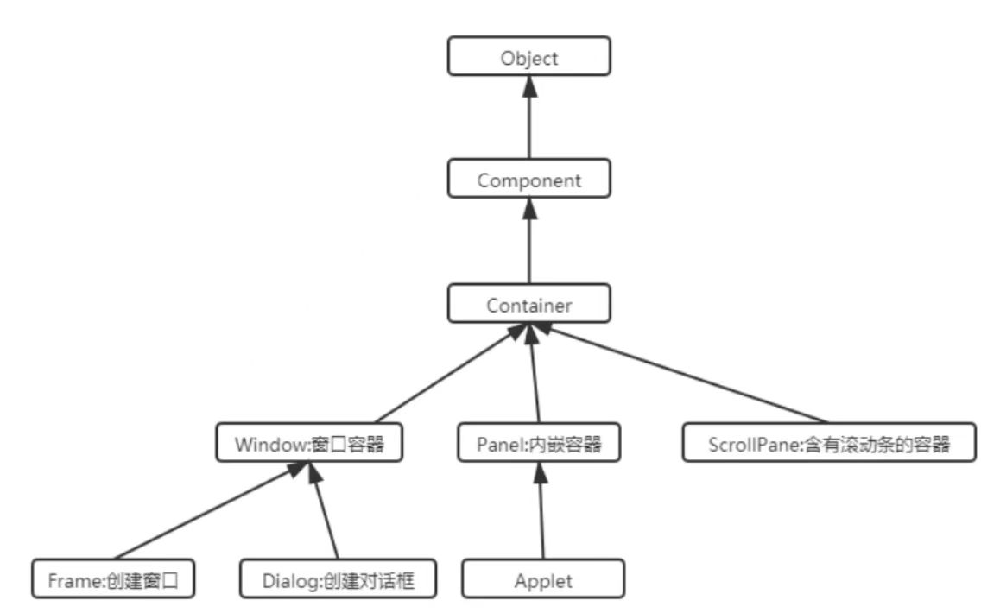
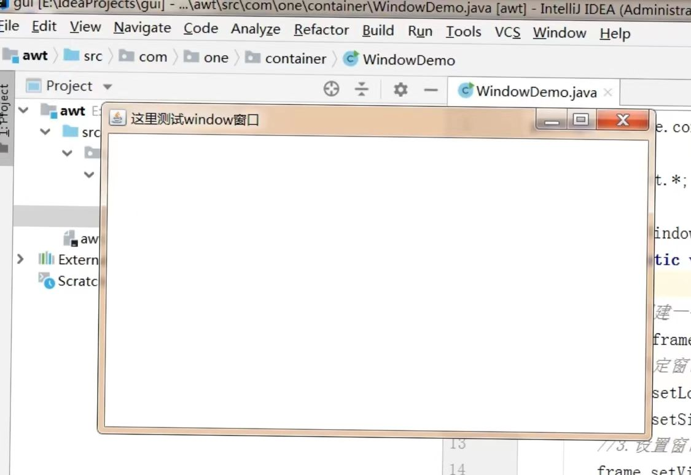
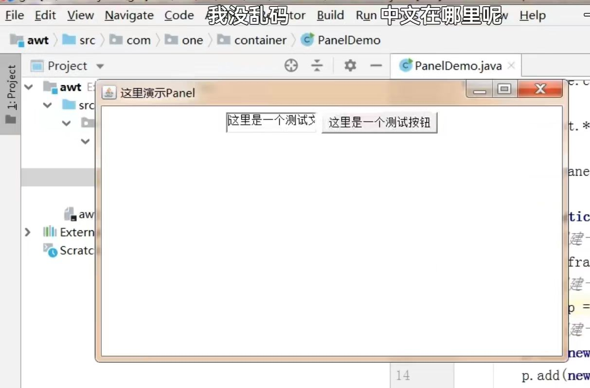

# 掌握常用 DOS 命令

1. 退出窗口  `exit`

2. 清屏  `cls`

3. 列出当前目录下所有的子文件  `dir`

4. 改变目录路径  `cd 路径`
   
   路径包括<font color = Red>绝对路径</font>和<font color = Red>相对路径</font>
   
   - 绝对路径
     
     表示该路径从某个磁盘的盘符下作为出发点的路径
   
   - 相对路径
     
     表示该路径从当前所在的路径下作为出发点的路径

5. 返回上一级目录  `cd ..`

6. 直接回到根路径  `cd \`

7. 切换盘符
   
   `c: 回车`
   
   `d: 回车`
   
   ...

# Java 语言发展史

Java 语言诞生于1995年，James Gosling领导团队开发

1996年，JDK1.0 诞生

> <mark>JDK</mark>
> 
> Java 开发工具包；做 Java 开发必须安装的一个工具包，该工具包需要从官网下载
> 
> <http://www.oracle.com>

# Java 语言特性

1. **简单性**
   
   C++ 中有指针，Java 中屏蔽了指针的概念
   
   Java 语言底层是 C++ 实现的，不是 C 语言

2. **面向对象**
   
   Java 是纯面向对象的

3. **可移植性**
   
   Java 程序可以做到一次编译，到处运行；也就是说 Java 程序可以在 Windows 操作系统上运行，不做任何修改，同样的 Java 程序可以直接放到 Linux 操作系统上运行

4. **多线程**

5. **健壮性**
   
   与自动垃圾回收机制有关，自动垃圾回收机制简称 GC 机制

6. **安全性**

7. ...

# Java 加载与执行

Java 程序的运行包括两个非常重要的阶段


- **<font color = Red>编译阶段</font>**
  
  主要的任务是检查 Java 源程序是否符合 Java 语法；符合 Java 语法则能够生成正常的字节码文件，不符合 Java 语法规则则无法生成字节码文件
  
  > 字节码文件 (.class) 中不是纯粹的二进制，这种文件无法在操作系统当中直接执行
  
  <mark>过程</mark>
  
  程序员需要在硬盘的某个位置 <位置随意> 新建一个 .java 扩展名的文件，该文件被称为 Java 源文件，源文件当中编写的是 Java 源代码/源程序；而这个源程序是不能随意编写，必须符合 Java 语法规则<Java 语法规则是需要记忆的>
  
  Java 程序需要使用 JDK 当中自带的 javac.exe 命令进行 Java 程序的编译
  
  <mark>步骤方法</mark>
  
  - 在 DOS 命令窗口中使用
  
  - javac 的使用规则
    
    javac Java 源文件路径
  
  一个 Java 源文件可以编译生成多个 .class 文件
  
  字节码文件/class 文件是最终要执行的文件，所以说 class 文件生成之后，Java 源文件删除并不会影响 Java 程序的执行

- **<font color = Red>运行阶段</font>**
  
  JDK 还有 java.exe 命令主要负责运行阶段
  
  <mark>java.exe 步骤方法</mark>
  
  - 在 DOS 窗口中使用
  
  - java 的使用规则
    
    java 类名
  
  <mark>运行过程</mark>
  
  java.exe 命令会启动 Java 虚拟机 (JVM)，JVM 会启动类加载器 classLoader，classLoader 会去硬盘上搜索字节码文件，找到该文件则将该字节码文件装载到 JVM 当中，JVM 将字节码文件解释成二进制10101010，然后操作系统执行二进制和低层硬件平台进行交互
  
  在 DOS 窗口中必须切换到类的当前目录执行

# JDK 安装

JDK 目录下

bin 目录下存放了很多命令，录入 javac.exe; java.exe

# Java 编程基础

## 注释

对 Java 程序的解释

<font color = cornflowerblue>注释不会被编译到 .class 字节码文件中</font>

- 单行注释
  
  ```java
  // 单行注释，只注释当前行
  ```

- 多行注释
  
  ```java
  /*
      多行注释
      多行注释
  */
  ```

- javadoc 注释
  
  通过 javadoc.exe 可以形成帮助文档，比较专业
  
  ```java
  /**
  *    javadoc 注释
  *    javadoc 注释
  *    javadoc 注释
  *    javadoc 注释
  *    javadoc 注释
  */
  ```

```java
// public 表示公开的
// class 表示定义一个类
// HelloWorld 表示一个类名
public class HelloWorld{  // 表示定义一个公开的类，起名 HelloWorld
    // 类体
    // 类体中不允许直接编写 java 语句【除声明变量之外】
    /*
        public 表示公开的
        static 表示静态的
        void 表示空
        main 表示方法名是 main
        (String[] args) 是一个 main 方法的形式参数列表
    */
    public static void main(String[] args){ // 表示定义一个公开的静态的主方法
        // 方法体，主方法
        System.out.println("Hello World!");  // java 语句，以;结尾
    }
}
```

## 一些 class 的区别

1. **<font color = cornflowerblue>public class</font>**
   
    一个 Java 源文件当中不一定有 public 的 class，它不是必须的
   
   一个 Java 源文件中只能有一个 public 的 class，并且该类名称必须与 Java 源文件名称一致

2. **<font color = cornflowerblue>class</font>**
   
   一个 Java 源文件中可以定义多个 class
   
   一个 class 会定义生成一个 xxx.class 字节码文件
   
   > e.g.
   > 
   > 一个 .java 中有4个 class 类，则编译之后会生成相对应4个字节码文件
   
   每一个 class 当中都可以编写 main 方法，都可以设定程序的入口，想执行哪个 class 中的 main 方法，调用运行命令 java * 即可
   
   > 注意
   > 
   > class当中必须有主方法，没有主方法会出现运行阶段的错误

# Java 语言基础

## 标识符

1. **标识符定义**
   
   - 在 Java 程序当中凡是程序员有权利自己命名的单词都是标识符
   
   - 标识符在编辑器中以黑色字体高亮显示
   
   - 标识符可以标识的元素
     
     - 类名
     
     - 方法名
     
     - 变量名
     
     - 接口名
     
     - 常量名
     
     - ...

2. **标识符的命名规则**
   
   - 一个合法的标识符只能由<u>数字，字母，下划线，美元符号</u>组成，不能含有其他符号
   
   - 不能以数字开头
   
   - 严格区分大小写
   
   - 关键字不能作为标识符
   
   - 理论上无长度限制

3. **标识符的命名规范**【只是规范，不属于语法，不遵守规范编译器不会报错】
   
   - 最好见名知意
   
   - 遵守驼峰命名方式
     
     大小写合理
   
   - 类名，接口名
     
     首字母大写，后面每个单词首字母大写
   
   - 变量名，方法名
     
     首字母小写，后面每个单词首字母大写
   
   - 常量名：全部大写

```java
public class IdentifierTest01{  // IdentifierTest01 是类名
    // main 是方法名
    public static void main(String[] args){  // args 是变量名

    }
}
```

## 关键字


## 字面值

> e.g.
> 
> - 10, 100
> 
> - "abc": 字符串字面值
> 
> - 'a': 字符型字面值，只能存放单个字符
> 
> - true
> 
> - false

字面值就是数据

## 变量

变量包含三部分：数据类型、名称、字面值；变量是内存中存储数据的最基本的单位

变量要求：变量中存储的具体的 ”数据“ 必须和变量的 ”数据类型“ 一致，当不一致的时候编译报错

声明/定义变量的语法格式

数据类型 变量名

变量在一行上可以声明多个  e.g. int a, b, c

```java
public class VarTest02
{
    public static void main(String[] args){
        int i = 100;
        System.out.println(i);
        i = 200;
        System.out.println(i);
    }
}
```

<font color = cornflowerblue>在方法体当中的 Java 代码，是遵守自上而下的顺序依次执行的，逐行执行；且第二行代码必须完整结束之后，第三行代码才能执行</font>

**<mark>变量的作用域</mark>**

作用域    变量的作用域，描述的就是变量的有效范围【出了大括号就不认识了】

**<mark>变量的分类</mark>**

根据变量声明的位置分类，并且遵循就近原则

- 局部变量
  
  在方法体当中声明的变量叫作局部变量

- 成员变量
  
  在方法体外【类体之内】声明的变量叫作成员变量

```java
public class VarTest04{
    // 成员变量
    int k = 200;
    public static void main(String[] args){
        // i 为局部变量
        int i = 10;
    }
    // 成员变量
    int i = 100;
    public static void doSome(){
        // 局部变量
        int i = 90;
    }
}
```

## 数据类型

不同数据类型的数据占用空间大小不同

包括两种

- **基本数据类型**
  
  包括四大类八小种
  
  - 整数型
    
    byte, short, int, long
  
  - 浮点型
    
    float, double
  
  - 布尔型
    
    boolean
  
  - 字符型
    
    char
  
  <u>八种数据类型占用空间大小</u>
  
  | 数据类型    | 占用空间大小/字节      | 取值范围                                                          | 默认值                      |
  | ------- | -------------- | ------------------------------------------------------------- | ------------------------ |
  | byte    | 1 = 8bite【比特位】 | -128~127                                                      | 0                        |
  | short   | 2              | -32768 ~ 32767                                                | 0                        |
  | int     | 4              | -2147483648 ~ 2147483647                                      | 0                        |
  | long    | 8              | -9223372036854775808 ~ 9223372036854775807                    | 0                        |
  | float   | 4              | -3.40282347E+38F ~ 3.40282347E+38F【有效位数6~7位】                  | 0.0                      |
  | double  | 8              | -1.79769313486231570E+308 ~ 1.79769313486231570E+308【有效位数15位】 | 0.0                      |
  | boolean | 1              | true/false                                                    | false【true 是 1，false 是0】 |
  | char    | 2              | 0 ~ 65535                                                     | \u0000                   |
  
  ```java
  public class DataTypeTest02{
      // static 必须加
      static int f;  // 成员变量
      public static void main(Strin[] args){
          System.out.println(f);
      }
  }
  /*
      成员变量定义，若未赋值则系统默认为默认值，局部变量不会
  */
  ```
  
  在数字的二进制当中有一个二进制位被称为 ”符号位“，并且这个 ”符号位”，在所有二进制位的最左边，0表示正数，1表示负数
  
  byte 类型的最大值    01111111
  
  **<font color = Red>二进制与十进制的转换</font>**
  
  **<font color = cornflowerblue>字符型</font>**
  
  一个中文占用2个字节，char 类型可以存储一个中文字符
  
  **<font color = cornflowerblue>转义字符</font>**
  
  '\n', '\t', '\'', '\u'
  
  \u 后面一串数字的是某一个文字的 unicode 编码
  
  **<font color = cornflowerblue>整数型</font>**
  
  Java 语言当中的 “整数型字面值” 被默认当作 int 类型处理，要让这个 “整数型字面值” 被当作 long 类型处理的话，需要在 “整数型字面值” 后面添加 l/L，建议使用大写 L
  
  <u>三种字面值表示方式</u>

- 十进制
  
  缺省默认的方式

- 八进制
  
  需要以0开头

- 十六进制
  
  需要以 0x 开头
  
  ```java
  public class DataTypeTest04{
    public static void main(String[] args){
        int a = 10;
        int b = 010;
        int c = 0x10;
  
        System.out.println(a);  // 10
        System.out.println(b);  // 8
        System.out.println(c);  // 16
  ```
  
          // 编译错误：过大的整数：2147483648
          // 此数被当作 int 类型处理，超出范围
          long z = 2147483648;
          System.out.println(z);
          // 解决
          long z = 2147483648L;
          System.out.println(z);
      }
  
  }

```
<u>强制类型转换</u>

需要添加 “强制类型转换符”，运行阶段可能损失精度

```java
public class DataTypeTest04{
    public static void main(String[] args){
        int y = (int)x;
        System.out.println(y);
    }
}
```

  **<font color = cornflowerblue>浮点型</font>**

> Java SE 的类库源码
> 
> - 字节码：C:\Program Files (x86)\Java|jdk1.7.0_75\jre\lib\rt.jar
> 
> - 库源码：C:\Program Files (x86)\Java\jdk1.7.0_75\src.zip

  Java 语言中，所有的浮点型字面值，默认被当作 double 类型处理

  要想被当作 float 类型处理，需要在字面值后面添加 F/f

  **<font color = cornflowerblue>布尔型</font>**

```java
public class DataTypeTest07{
    public static void main(String[] args){
        boolean loginSuccess = false;
        if(longinSuccess){
            System.out.println("恭喜你，登录成功");
        else{
            System.out.println("对不起，用户名不存在或者密码错误");
        }
        }
    }
}
```

  **<font color  = green>类型转换规则</font>**

- 8种基本数据类型当中除布尔类型之外剩下的7种类型之间都可以互相转换

- 小容量向大容量转换，成为自动类型转换，容量从小到大排序
  
  byte < short < int < long < float < double
  
  ________char <
  
  > 注意
  > 
  > 任何浮点类型不管占用多少字节，都比整数型容量大
  > 
  > char 和 short 可表示的种类数量相同，但是 char 可以取更大的正整数

- 当整数字面值没有超出 byte, short, char 的取值范围，可以直接赋值给 byte, short, char 类型的变量

- byte, short, char 混合运算的时候，各自先转换成 int 类型再做运算

- 多种数据类型混合运算，先转换成容量最大的那种类型再做运算

- **引用数据类型**
  
  String

## 字符编码

Java 语言采用 unicode 编码方式，标识符可以用中文

JDK 中自带的 native2ascii.exe 命令，可以将文字转换成 unicode 编码形式


## 运算符

### 算数运算符

+, -, *, /, %

++, --

- ++ 出现在变量后
  
  先做赋值运算，再对变量种保存的值进行自加1

- ++ 出现在变量前
  
  先进行自加1运算，然后再进行赋值操作

```java
public class OperatorTest01{
    public static void main(String[] args){
        int a = 100;
        int b = a ++;
        System.out.println(a);  // 101
        System.out.println(b);  // 100

        int m = 20;
        int n = ++ m;
        System.out.println(m);  // 21
        System.out.println(n);  // 21

        int s = 100;
        System.out.println(-- s);  //100
        System.out.println(s ++);  // 100
        System.out.println(s --);  // 101
        System.out.println(s --);  // 100
        System.out.println(s --);  // 99
        System.out.println(s);  // 98
    }
}
```

### 关系运算符

\>, >=, <, <=, ==, !=

关系运算符的运算结果一定是布尔类型

### 逻辑运算符

&    逻辑与

|    逻辑或

!    逻辑非

^    逻辑异或，两边的算子只要不一样，结果就是 true

&&    短路与

||    短路或，第一个表达式执行结果是 true，会发生短路或

- 逻辑运算符要求两边的算子都是布尔类型，并且逻辑运算符最终的运算结果也是一个布尔类型

- 短路与和逻辑与最终的运算结果是相同的，只不过短路与存在短路现象

- 短路或和逻辑或最终的运算结果是相同的，只不过短路或存在短路现象

```java
public class OperatorTest03{
    public static void main(String[] args){

        System.out.println(5 > 3 & 5 > 2);  // true
        System.out.println(5 > 3 & 5 > 6);  // false
        System.out.println(5 > 3 | 5 > 6);  // true

        // 逻辑与，短路与
        int x = 10;
        int y = 8;
        System.out.println(x < y & ++ x < y);
        System.out.println(x);  // 11
        System.out.println(x < y && ++ x < y);
        System.out.println(x);  // 10, 短路
    }
}
```

### 字符串连接运算符

> '+' 运算符在 Java 语言当中有两个作用
> 
> - 加法运算，求和
> 
> - 字符串的连接运算

当 '+' 运算符两边的数据都是数字的话，一定是进行加法运算；两边的数据只要有一个数据是字符串，一定会进行字符串连接运算，并且，连接运算之后的结果还是一个字符串类型

### 三元运算符/条件运算符

- 语法规则
  
  布尔表达式 ? 表达式1 : 表达式2

- 执行原理
  
  当布尔表达式结果为 true 时，选择表达式1作为整个表达式的执行结果
  
  当布尔表达式结果为 false 时，选择表达式2作为整个表达式的执行结果

### 赋值类运算符

+=, -=, *=, /=, %=

先执行等号右边的表达式，将执行结果赋值给左边的变量

以上赋值运算符不改变结果数据类型

```java
public class OperatorTest01{
    public static void main(String[] args){

        byte b = 10;
        b = 15;  // 编译通过
        b = b + 5;
        // 编译错误，b + 5 类型是 int 类型，因此需要强制转换
        b = (byte)(b + 5);

        byte = x = 10;
        x += 5;  // 编译通过，等同于 x = (byte)(x + 5)
        System.out.println(x);  // 15
    }
}
```

## 控制语句

### 选择结构语句

- `if, if...else`
  
  分支语句/条件控制语句
  
  <mark>if 语句的语法结构【四种编写方式】</mark>
  
  - first
    
    ```java
    if(布尔表达式){
        java 语句
        java 语句;
        java 语句;
        java 语句;
        ...
    }
    ```
  
  - second
    
    ```java
    if(布尔表达式){
        java 语句;
        java 语句;
        ...
    }
    else{
        java 语句;
        java 语句;
        ...
    }
    ```
  
  - third
    
    ```java
    if(布尔表达式){
        java 语句;
        java 语句;
        ...
    }
    else if(布尔表达式){
        java 语句;
        java 语句;
        ...
    }
    else if(布尔表达式){
        java 语句;
        java 语句;
        ...
    }
    else if(布尔表达式){
        java 语句;
        java 语句;
        ...
    }
    ```
  
  - forth
    
    ```java
    if(布尔表达式){
        java 语句;
        java 语句;
        ...
    }
    else if(布尔表达式){
        java 语句;
        java 语句;
        ...
    }
    else if(布尔表达式){
        java 语句;
        java 语句;
        ...
    }
    else if(布尔表达式){
        java 语句;
        java 语句;
        ...
    }
    else{
        java 语句;
        java 语句;
        ...
    }
    ```
    
    > **注意**
    > 
    > 对于 Java 中的 if 语句来说，只要有一个分支执行，整个 if 语句全部结束
  
  所有的控制语句都可以嵌套使用
  
  if 语句的分支中只有一条 Java 语句的话，大括号可以省略不写【不建议】
  
  ```java
  public class IfTest01{
  
      public static void main(String[] args){
  
          // 需求：所在位置的五公里范围之内有 KFC 的话去 KFC 吃饭
          // 公里数
          double distance = 6.0;
          // 选择语句
          if(distance < 5){
              System.out.println("去 KFC 吃开封菜！");
          }
  
        /* 需求
        假设系统给定一个考生的成绩，成绩可能带有小数点
        根据学生的成绩判断该学生的成绩等级
            [90-100]  A
            [80-90)   B
            [70-80)   C
            [60-70)   D
            [0-60)    E
        */
  
        // first code
        double a = 59.5;
        if(a >= 90 & a <= 100){
            System.out.println("该学生成绩等级为 A!");
        }
        else if(a >= 80 & a < 90){
            System.out.println("该学生成绩等级为 B!");
        }
        else if(a >= 70 & a < 80){
            System.out.println("该学生成绩等级为 C!");
        }
        else if(a >= 60 & a < 70){
            System.out.println("该学生成绩等级为 D!");
        }
        else if(a >= 0 & a < 60){
            System.out.println("该学生成绩等级为 E!");
        }
  
        // second code
        double score = 59.5;
        if(score < 0 || score > 100){
            System.out.println("对不起，您提供的考生成绩不合法");
        }else if(score >= 90){
            System.out.println("该考生的考试成绩等级为 A");
        }else if(score >= 80){
            System.out.println("该考生的考试成绩等级为 B");
        }else if(score >= 70){
            System.out.println("该考生的考试成绩等级为 C");
        }else if(score >= 60){
            System.out.println("该考生的考试成绩等级为 D");
        }else{
            System.out.println("该考生的考试成绩等级为 E")
        }
  
        // third code
        String grade = "该考生的考试成绩等级为 E";
        double score = 59.5;
        if(score < 0 || score > 100){
            grade = "对不起，您提供的考生成绩不合法";
        }else if(score >= 90){
            grade = "该考生的考试成绩等级为 A";
        }else if(score >= 80){
            grade = "该考生的考试成绩等级为 B";
        }else if(score >= 70){
            grade = "该考生的考试成绩等级为 C";
        }else if(score >= 60){
            grade = "该考生的考试成绩等级为 D";
        }
        System.out.println(grade);
  
    }
  }
  ```

### 控制用户键盘输入

```java
public class KeyInputTest{

    public static void main(String[] args){

        // 第一步，创建键盘扫描对象
        java.util.Scanner s = new java.util.Scanner(System.in);
        // 第二步，调用 Scanner 对象的 next() 方法开始接受用户键盘输入
        String userInputContent = s.next();
        int userInputContent = s.nextInt();
        // 将内存中的数据输出到控制台
        System.out.println("您输入了:" + userInputContent);

   }
}
```

- `switch`
  
  <mark>switch 语句的语法结构</mark>
  
  ```java
  switch(值){
  case 值1:
      java 语句;
      java 语句;
      ...
      break;
  case 值2:
      java 语句;
      java 语句;
      ...
      break;
  case 值3:
      java 语句;
      java 语句;
      ...
      break;
  default:
      java 语句;
  }
  ```
  
  以上是一个完整的 switch 语句；其中，break 语句不是必须的，default 也不是必须的
  
  <mark>switch 语句支持的值有</mark>
  
  int 类型以及 String 类型
  
  JDK8 之后的版本才开始支持 String 类型
  
  本质上是只支持 int, String，但是 byte, short, char 也可以使用，在 switch 语句当中，byte, short, char 可以进行自动类型转换
  
  switch 语句当中 “值” 与 “值1”，“值2” 比较的时候会使用 “==” 进行比较
  
  <mark>switch 语句的执行原理</mark>
  
  拿 “值” 与 ”值1“ 进行比较，如果相同，则执行该分支中的 Java 语句，然后遇到 break 语句，switch 语句结束
  
  如果不相等，继续与 ”值2“ 进行比较，以此类推
  
  > **注意**
  > 
  > 若分支执行了，但是分支最后没有 "break"，此时会发生 case 穿透现象，即不与 case 里面的值进行比较就执行 case 里面的内容；
  > 
  > 若所有的 case 都没有匹配成功，那么最后 default 分支会执行
  
  ```java
  public class SwitchTest01{
  
      public static void main(String[] args){
  
          /*
          接受键盘输入，根据输入的数字来判断星期几
          0  星期日
          1  星期一
          ...
          */
  
          java.util.Scanner s = new java.util.Scanner(System.in);
          System.out.print("请输入[0-6]的整数:");
          int num = s.nextint();
          switch(num){
          case 0:
              System.out.println("星期日");
              break;
          case 1:
              System.out.println("星期一");
              break;
          case 2:
              System.out.println("星期二");
              break;
          case 3:
              System.out.println("星期三");
              break;
          case 4:
              System.out.println("星期四");
              break;
          case 5:
              System.out.println("星期无");
              break;
          case 6:
              System.out.println("星期六");
          }
  
          // default
          switch(num){
          case 1:
              System.out.println("星期一");
              break;
          case 2:
              System.out.println("星期二");
              break;
          case 3:
              System.out.println("星期三");
              break;
          case 4:
              System.out.println("星期四");
              break;
          case 5:
              System.out.println("星期无");
              break;
          case 6:
              System.out.println("星期六");
              break;
          default:
              System.out.println("星期日");
          // 输入0或者除1-6之外的任何数，default 语句都会执行
          }
  
          // case 合并
          switch(num){
          case 1: case 2: case 3:
              // 输入1，2，3都会输出 ”星期一“
              System.out.println("星期一");
              break;
          case 4:
              System.out.println("星期四");
              break;
          case 5:
              System.out.println("星期无");
              break;
          case 6:
              System.out.println("星期六");
              break;
          default:
              System.out.println("星期日");
          // 输入0或者除1-6之外的任何数，default 语句都会执行
          }
  
      }
  }
  ```

### 循环结构语句

- `for`
  
  <mark>for 循环语法机制</mark>
  
  ```java
  for(初始表达式; 条件表达式; 更新表达式){
      java 语句;
      java 语句;
      ...
  }
  ```
  
  > **注意**
  > 
  > 1. 初始化表达式最先执行，并且在整个循环中只执行一次
  > 
  > 2. 条件表达式结果必须是一个布尔类型，也就是 true, false
  
  <mark>执行原理</mark>
  
  
  
  ```java
  public class ForTest02{
      public static void main(String[] args){
  
          for(; ;){
              System.out.println("死循环");
          }
  
          for(int i = 0; i < 10; i ++){  // i 变量属于 for 循环的局部变量, for 循环结束后 i 的内存就释放了
              System.out.println("i = " + i);
          }
  
          // 变形
          for(int i = 0; i < 10; ){
              System.out.println("i = " + i);
              i ++;
          }
  
          // 变形
          for(int i = 0; i < 10; ){
              i ++;
              System.out.println("i = " + i);
          }
  
      }
  }
  ```
  
  ---
  
  ```java
  /*  e.g.
      使用 for 循环，实现1-100所有奇数求和
  */
  
  public class ForTest04{
      public static void main(String[] args){
  
          // first method
          // 先从1取到100，一个数字一个数字取出来
          // 进一步判断这个数字是否为奇数
          int sum = 0;
          for(int i = 1; i <= 100; i ++){
              if(i % 2 == 1){
                  // System.out.println("i = " + i);
                  sum += i;
              }
          }
          System.out.println("1-100所有奇数求和结果是 " + sum);
  
          // second method
          sum = 0;
          for(int i = 1; i < 100; i += 2){
              // 这样写可以保证每一次取出的值都是奇数，不需要判断
              sum += i;
          }
          System.out.println("1-100所有奇数求和结果是 " + sum);
  
      }
  }
  ```
  
  > e.g.  实现九九乘法表
  > 
  > 
  > 
  > ```java
  > public class ForTest06{
  >     public static void main(String[] args){
  > 
  >         // 9行，循环9次
  >         for(int i = 1; i <= 9; i ++){
  >             // 内层循环负责输出本行内容
  >             for(int j = 1, j <= i, j ++){
  >                 System.out.print(i + '×' + j + '=' + i * j + " ");
  >             }
  >             System.out.println();
  >         }
  > 
  >     }
  > }
  > ```

- `while`
  
  <mark>语法机制</mark>
  
  ```java
  while(条件表达式){
      java 语句;
      ...
  }
  ```
  
  <mark>执行原理</mark>
  
  判断布尔表达式的结果，若为 true 就执行循环体，循环体结束之后，再次判断布尔表达式的结果，以此类推
  
  与 for 循环可以完全互换

- `do ... while`
  
  <mark>语法结构</mark>
  
  ```java
  do {
      循环体;
      ...
  }while(条件表达式);
  ```
  
  <mark>执行原理</mark>
  
  先执行循环体中的语句，执行一次循环体之后，判断布尔表达式的结构，如果为 true，则继续执行循环体，如果为 false 循环结束；
  
  ```java
  public class DoWhileTest01{
      public static void main(String[] args){
  
          int i = 0;
          do{
              System.out.println(i);  // 0 1 2 3 ... 8 9
              i ++;
          }while(i < 10);
  
          int i = 0;
          do{
              System.out.println(i ++);  // 0 1 2 3 ... 8 9
          }while(i < 10);
  
      }
  }
  ```

### 控制语句顺序

- `break`
  
  一般用在两个位置
  
  - switch 语句，用来终止 switch 语句的执行
  
  - 循环语句中，终止循环语句的执行
  
  跳出离它最近的整个循环

- `continue`
  
  跳出本次循环，进入下一次循环

# 方法

若两个需求本质上相同，只不过参与运算 的数值不同，代码编写了两份，显然代码没有得到重复利用，即复用性差

若想达到代码复用，那么需要学习 Java 语言中的方法机制，类似于 Python 的函数

## 方法如何定义

<mark>语法机制</mark>

**<font color = Red>[修饰符列表] 返回值类型 方法名（形式参数列表）{}</font>**

1. **[修饰符列表]**
   
   [] 符号叫作中括号，以上中括号 [] 里面的内容表示不是必须的，是可选的
   
   统一写成：`public static`

2. **返回值类型**
   
   可以是任何类型，只要是 Java 中合法的数据类型就行，包括基本数据类型和引用数据类型
   
   byte, short, int, long, float, double, boolean, char, String ...
   
   <font color = cornflowerblue>当一个方法执行结束不返回任何值的时候，返回值类型也不能空白，必须写上 void 关键字，所以 void 表示该方法执行结束后不返回任何结果</font>
   
   若返回值类型不是 void，则在方法体执行结束的时候必须使用 return 返回值；void 可以加 `reture;` 语句，即终止当前方法

3. **方法名**
   
   见名知意 首字母小写，后面每个单词首字母大写
   
   **<font color = cornflowerblue>形式参数列表</font>**
   
   简称 形参
   
   > 注意
   > 
   > 形式参数列表中的每一个参数都是 <font color = Red>”局部变量“</font>，方法结束之后内存释放
   
   形参的个数是 0~N 个，多个的话需要用 `,`（逗号）隔开

## 方法调用

**<font color = Red>类名.方法名</font>**

```java
public class MethodTest03{
    public static void main(String[] args){

        MethodTest03.divide(10, 2);

    }

    // 需求 计算两个 int 类型数据的商，执行结束返回执行结果
    public static int divide (int x, int y) {
        int z = x / y;
        return z;
    }
}
```

<mark>类名在只有一个类名时可以省略，跨类调用不能省略</mark>

## return; & break; 区别

```java
public class MethodTest06 {
    public static void main(String[] args) {

        for (int i = o; i < 10; i ++) {
            if (i == 5) {
                break;  // 终止 for 循环
                return;  // 终止当前的方法，不输出 Hello World!
            }
            System.out.println("i = " + i);
        }
        System.out.println("Hello World!");

    }
}
```

`break;`  用来终止 switch 和离它最近的循环

`return;`  用来终止离它最近的一个方法

**<font color = cornflowerblue>缺少返回语句</font>**

```java
public class MethodTest07 {
    public static void main(String[] args) {

        m();

    }
        // error: 缺少返回语句
        pucblic static int m() {
            boolean flag = true;
            if (flag) {
                return 1;
                // 编译器认为以上代码可能会执行，也可能不会执行
                // 编译器为了确保程序不出现任何异常，所以编译器说 缺少返回语句
            }
        }

        // 修改程序
        // first method
        public static int m() {
            boolean flag = true;
            if (flag) {
                return 1;
            }else {
                return 0;
            }
        }

        // second method
        public static int m() {
            boolean flag = true;
            if (flag) {
                return 1;
            }
            return 0;
        }

        // third method
        public static int m() {
            boolean flag = true;
            return flag? 1: 0;
        }

}
```

## Homework_1

```java
// 计算5的阶乘
public class Homework_1 {
    public static void main(String[] args) {

        /*
        int n = 5;
        int result = 1;
        for (int i = n; i > 0; i--) {
            result *= i;
        }
        System.out.println(result);
        */

        // 调用方法
        int retValue_1 = jieCheng(5);
        System.out.println(retValue_1)

    }

    // 提取方法
    public static int jieCheng(int n) {
        int result = 1;
        for (int i = n; i > 0; i--) {
            result *= i;
        }
        return result;
    }
}
```

## Homework_2

```java
// 输出大于某个正整数 n 最小的质数
/* 题意即，例如 n = 2，
   则需要输出 大于2的最小的质数：3 */
public class Homework_2 {
    public static void main(String[] args) {

        printMinPrime (5);

    }

    /*  定义一个专门的方法，来判断某个数字是否为质数
        这个方法的形参是被判断的数字 num
        这个方法的返回值类型是 true 表示是质数，false 表示非质数  */
    public static boolean isPrimeNum(int num) {
        // 质数只能被1和自身整除
        for (int i = 2; i < num; i++) {
            if (num % u == 0) {
                return false;
            }
        }
        return true;
    }

    public static void printMinPrimeNum(int n) {
        // 找出大于5的最小的质数
        while (true) {
            n++;
            // 判断此时的 n 是否为质数
            // 调用方法
            boolean flag = isPrimeNum(n);
            if (flag) {
                System.out.println(n);
                break;
            }
        }
    }
}
```

```java
// 以上代码改进
public class Homework2_2 {
    public static void main(String[] args) {

    }

    public static void printMinPrimeNum(int n) {
        while (! isPrimeNum(++n)) {

        }
        System.out.println(n);
    }

    public static boolean isPrimeNum(int num) {
        for (int i = 2; i < num; i++) {
            if (num % u == 0) {
                return false;
            }
        }
        return true;
    }
}
```

## 方法重载

```java
// 分析以下程序的缺点【未使用方法重载机制】
public class OverloadTest01 {
    public static void main(String[] args) {

        System.out.println(sumInt(10, 20));
        System.out.println(sumLong(10,L 20L));
        System.out.println(sumDouble(10.0, 20.0));

    }

    // 定义计算 int 类型数据的求和
    public static int sumInt(int a, int b) {
        return a + b;
    }

    // 定义计算 long 类型数据的求和
    public static long sumLong(long a, long b) {
        return a + b;
    }

    // 定义计算 double 类型数据的求和
    public static double sumDouble(double a, double b) {
        return a + b;
    }
}
```

【<mark>缺点</mark>】

- 代码不美观

- 程序员需要记忆更多的方法名称

```java
// 使用方法重载机制，解决两个缺点
public class OverloadTest01 {
    public static void main(String[] args) {

        System.out.println(sum(10, 20));
        System.out.prinln(sum(10,L 20L));
        System.out.println(sum(10.0, 20.0));

    }

    // 定义计算 int 类型数据的求和
    public static int sum(int a, int b) {
        System.out.println("int 求和");
        return a + b;
    }

    // 定义计算 long 类型数据的求和
    public static long sum(long a, long b) {
        System.out.println("Long 求和");
        return a + b;
    }

    // 定义计算 double 类型数据的求和
    public static double sum(double a, double b) {
        System.out.println("double 求和");
        return a + b;
    }
}
```

【<mark>优点</mark>】

- 代码整齐美观

- ”功能相似“ 的，可以让 “方法名相同”，更易于以后的代码编写

> **<font color = cornflowerblue>注意</font>**
> 
> 1. 在同一个类当中，如果 “功能1” 和 “功能2” 它们的功能是相似的，那么可以考虑将它们的方法名一致，这样代码既美观，又便于后期的代码编写
> 
> 2. 方法重载不能随便使用，如果两个功能压根不相干，不相似，根本没关系，此时两个方法使用重载机制的话，会导致编码更麻烦；无法进行方法功能的区分

【<mark>使用条件</mark>】

- 在同一个类当中

- 方法名相同

- 参数列表不同

**<font color = Red>方法重载与方法返回值类型无关！！</font>**

## 代码封装

```java
public class S {
    // 换行
    public static void p() {
        System.out.println();
    }
    // 输出 byte
    public static void p(byte s) {
        System.out.println(s);
    }
    // 输出 short
    public static void p(short s) {
        System.out.println(s);
    }
    // 输出 int
    public static void p(int s) {
        System.out.println(s);
    }
    // 输出 long
    public static void p(long s) {
        System.out.println(s);
    }
    // 输出 float
    public static void p(float s) {
        System.out.println(s);
    }
    // 输出 double
    public static void p(double s) {
        System.out.println(s);
    }
    // 输出 boolean
    public static void p(boolean s) {
        System.out.println(s);
    }
    // 输出 char
    public static void p(char s) {
        System.out.println(s);
    }
    // 输出 String
    public static void p(String s) {
        System.out.println(s);
    }
}
```

封装之后的 print 编译运行之后的 .class 文件需要一起放置在代码路径文件中

```java
// 使用方法
public class HelloWorld {
    public static void main(String[] args) {
        S.p("Hello World!");
    }
}
```

## 方法递归

```java
public class RecursionTest01 {
    public static void main(String[] args) {
        doSome();
    }

    public static void doSome() {
        System.out.println("doSome begin");
        // 调用自身 doSome()
        doSome();
        System.out.println("doSome over");
    }
}
```

若递归程序没有结束条件，一定会发生 栈内存溢出错误 StackOverflowError

如何解决此错误

- 先检查递归的结束条件对不对，如果递归结束条件不对，必须对条件进一步修改，直到正确为止

- 假设递归条件没问题，这个时候需要手动调整 JVM 的栈内存初始化大小，将空间调大点

- 若调整了大小，运行时还出现了这个错误，只能继续扩大栈内存大小

> 通过 DOS 命令 `java -X` 查看
> 
> 

```java
// 递归计算1到 n 的和
public class RecursionTest03 {
    public static void main(String[] args) {
        // 1-3 的和
        int retValue2 = sum(3);
        System.out.println(retValue2);
    }

    public static int sum(int n) {
        if (n == 1) {
            return 1;
        }
        return n + sum(n- 1);
    }
}
```

# 栈 -- 数据结构

> **数据结构**
> 
> 存储数据的容器，而该容器可能存在不同的结构
> 
> 常见的有数组、链表、图、二叉树、栈、队列...


<mark>特点</mark>

先进后出，后进先出

# 面向对象

**<mark>面向对象与面向过程的区别</mark>**

- 从语言方面出发
  
  对于 C 语言来说，是完全面向过程
  
  对于 C++ 语言来说，是一半面向过程，一半面向对象【半面向对象】
  
  对于 Java 语言来说，是完全面向对象

- 面向过程的开发方式
  
  <font color = cornflowerblue>特点</font>
  
  注重步骤，注重的是实现这个功能的步骤
  
  > 第一步干什么
  > 
  > 第二步干什么
  > 
  > ...
  
  也注重实现功能的因果关系
  
  > 因为 A 所以 B
  > 
  > 因为 B 所以 C
  > 
  > 因为 C 所以 D
  > 
  > ...
  
  面向过程中没有对象的概念；只是实现这个功能的步骤以及因果关系
  
  <font color = cornflowerblue>缺点</font>
  
  因果关系中，A 和 B 联合起来形成一个子模块，子模块和子模块之间又因为因果关系结合在一起，假设其中任何一个因果关系出现错误，此时整个系统的运转都是出现错误，即代码和代码之间的耦合度太高，扩展力太差
  
  <font color = cornflowerblue>优点</font>
  
  对于小型项目【功能】，采用面向过程的方式开发，效率较高；不需要前期进行对象的提取，模型的建立，采用面向过程方式可以直接开始干活；一上来直接写代码，编写因果关系；从而实现功能

- 面向对象的开发方式
  
  更符合人类的思维方式
  
  面向对象指将现实世界分割成不同的单元，然后每一个单元都实现成对象，然后驱动一下，让各个对象之间协作起来形成一个系统
  
  耦合度低，扩展力强
  
  当我们采用面向对象的方式贯穿整个系统的话，涉及到三个术语
  
  - OOA
    
    面向对象分析
  
  - OOD
    
    面向对象设计
  
  - OOP
    
    面向对象编程
  
  <font color = cornflowerblue>三大特征</font>
  
  封装；继承；多态

# 类和对象

**<mark>类</mark>**

类实际上在现实世界当中是不存在的，是一个抽象的概念；是一个模板，是我们人类大脑进行思考、总结、抽象的一个结果

e.g. 明星是一个类

**<mark>对象</mark>**

对象是实际存在的个体

> 在 Java 语言中，要想得到 “对象”，必须先定义 “类”，“对象” 是通过 “类” 这个模板创造出来的
> 
> 类中描述的是所有对象的 “共同特征信息”，对象就是通过类创建出的个体

- **类**
  
  不存在的，人类大脑思考总结一个模板【这个模板当中描述了共同特征】

- **对象**
  
  实际存在的个体

- **实例**
  
  对象的另一个名称叫实例

- **实例化**
  
  通过类这个模板创建对象的过程

- **抽象**
  
  多个对象具有共同特征，进行思考总结抽取共同特征的过程

## 类的定义

**<mark>语法格式</mark>**

```java
[修饰符列表] class 类名 {
    类体 = 属性 + 方法
    属性在代码上以 “变量” 的形式存在，描述状态
    方法描述动作行为
}
```

```java
// 定义类
public class Student {
    // 以下都是成员变量
    // number
    int number;
    // name
    String name;
    // age
    int age;
    // gender
    boolean gender;
    // address
    String address;
}
```

## 对象的创建与使用

```java
// 创建对象
public class StudentTest {
    public static void main(String[] args) {
        // 创建对象
        // new 类名();  new 是一个运算符
        // 类型 变量名 = new Student();
        // 实例化一个 Student 对象
        Student s_1 = new Student();
        // Student 既是一个类名，同时又是一个 “类型名”，属于引用数据类型
    }
}
```

**Java 中所有的 “类” 都属于引用数据类型**

在编译过程中，编译 StudentTest.java 文件时，会自动找 Student.class，如果没有，会自动编译 Student.java 文件，生成 Student.class 文件

也可直接输入 `javac *.java` 进行编译

> **<font color = cornflowerblue>对象与引用的区别</font>**
> 
> 对象是通过 new 出来的，在堆内存中存储
> 
> 引用，但凡是变量，并且该变量中保存了内存地址指向了堆内存当中的对象

```java
// 使用对象
public class StudentTest {
    public static void main(String[] args) {
        // 访问对象
        // 语法  引用.实例变量名
        System.out.println(s_1.number);
        System.out.println(s_1.name);
        System.out.println(s_1.age);
        System.out.println(s_1.gender);
        System.out.println(s_1.address);

        // 修改对象内容
        s_1.number = 110;
        s_1.name = "张三";
        s_1.age = 20;
        s_1.sex = true;
        s_1.address = "深圳光明区";

    }
}
```


> e.g.
> 
> ```java
> /*
>     User class
> */
> public class User {
>     int id;
>     String userName;
>     String password;
> }
> ```
> 
> ```java
> public class UserTest {
>     public static void main(String[] args) {
> 
>         User u_1 = new User();
>         u_1.iD = 11111;
>         u_1.userName = "connor";
>         u_1.passWord = "123";
> 
>         System.out.println(u_1.iD);
>         System.out.println(u_1.userName);
>         System.out.println(u_1.passWord);
> 
>     }
> }
> ```
> 
> <mark>难度更大一点</mark>
> 
> ```java
> // address class
> public clss Address {
>     String city;
>     String street;
>     String zipcode;  // 邮编
> }
> ```
> 
> ```java
> // user class
> public class User {
>     int iD;
>     String userName;
>     Address addr;
> }
> ```
> 
> ```java
> // Test
> public class Test {
>     public static void main(String[] args) {
> 
>         Address address = new Address();
>         address.city = "北京";
>         address.street = "大兴区";
>         address.zipcode = "121221";
> 
>         User u = new User();
>         System.out.println(u.iD);  // 0
>         System.out.println(u.userName);  // null
>         System.out.println(u.addr);  // null
> 
>         u.iD = 1111;
>         u.userName = "connor";
>         u.addr = address;
> 
>         // 想知道 connor 是哪个城市的该如何解决
>         System.out.println(u.addr.city);
> 
>     }
> }
> ```
> 
> 

```java
public class T {
    A o1;

    public static void main(String[] args) {

        D d = new D();
        C c = new C();
        B b = new B();
        A a = new A();
        T t = new T();

        // 此处缺省该段代码会出现 NullPointerException 异常
        // 【空指针异常】
        c.o4 = d;
        b.o3 = c;
        a.o2 = b;
        t.o1 = a;

        System.out.ptintln(t.o1.o2.o3.o4.i);

    }
}

class A {
    B o2;
}

class B {
    C o3;
}

class C {
    D o4;
}

class D {
    int i;
}
```

# 空指针异常

```java
public class NullPointerTest {
    public static void main(String[] args) {
        // 创建对象
        Customer c = new Customer();
        // 访问 iD
        System.out.println(c.iD);

        // 重新赋值
        c.iD = 0420;
        System.out.println(c.iD);

        c = null;  // 即 NullpointerException
        // 编译没问题，运行出问题
        System.out.println(c.iD);
    }
}

class Customer {
    // iD
    int iD;
}
```

# 构造方法

构造方法是一个比较特殊的方法，通过构造方法可以完成对象的创建，以及实例变量的初始化；换句话说，构造方法是用来创建对象，并且同时给对象的属性赋值

<font color = cornflowerblue>使用 new 运算符来调用构造方法</font>

`new 构造方法名(实际参数列表)`

```java
/*
    当前类并没有定义任何构造方法
    但是系统实际上会自动给 Student 类提供一个无参数的构造方法
    【缺省构造器】
*/
public class Student {
    int no;
    String name;
    int age;
}
```

构造方法的语法结构

```java
[修饰符列表] 构造方法名(形式参数列表) {
    构造方法体;
}
```

> **<mark>注意</mark>**
> 
> - 修饰符列表目前统一写 `public`；千万不要写 `public static`
> 
> - 构造方法名和类名必须一致
> 
> - 构造方法不需要指定返回值类型，也不能写 void

```java
// 构造方法
public class Student {
    int no;
    String name;
    int age;

    // 无参数
    public Student() {
        System.put.println("无参数的构造方法执行了");
    }

    // 有参数
    public Student(int i) {
        // 若把上方无参数方法注释掉程序会报错，不注释掉则不会
    }
}
```

```java
public class ConstructorTest01 {
    public static void main(String[] args) {

        // 调用 Student 类的无参数构造方法
        Student s_1 = new Student();  // 无参数的构造方法执行了

    }
}
```

<mark>综上</mark>

1. 当一个类中手动提供了构造方法，那么系统将不再提供无参数构造方法

2. 无参数构造方法，有参数构造方法都可以调用

3. 构造方法支持方法重载

```java
public class Vip {
    long no;
    String name;
    String birth;
    boolean sex;

    public Vip() {

    }

    public Vip(long vipNum, String vipName) {
        no = vipNum;
        name = vipName;
    }

    public Vip(long vipNum, String vipName, String vipBirth) {
        no = vipNum;
        name = vipName;
        birth = vipBirth;
    }

    public Vip(long vipNum, String vipName, String vipBirth, boolean vipSex) {
        no = vipNum;
        name = vipName;
        birth = vipBirth;
        sex = vipSex;
    }
}
```

```java
public class ConstructorTest03 {
    public static void main(String[] args) {
        Vip v1 = new Vip();
        Vip v2 = new Vip(1111L, "大灰狼");
        Vip v3 = new Vip(2222L, "小绵羊", "2000-10-10");
        Vip v4 = new Vip(3333L, "钢铁侠", "1980-10-11", true);
    }
}
```

# 案例

1. 定义丈夫类 Husband；妻子类 Wife;

2. 丈夫类的属性包括身份证号，姓名，出生日期，妻子；

3. 妻子类的属性包括身份证号，姓名，出生日期，丈夫；

4. 分别给两个类提供构造方法（无参&有参）；

5. 编写测试程序，创建丈夫对象，然后再创建妻子对象

6. 丈夫对象关联妻子对象；妻子对象关联丈夫对象，要求**能够输出这个 ”丈夫对象“ 的妻子的名字**，或者反过来；

7. 能够画出程序执行过程的内存图，以及在程序中演示出空指针异常的效果

```java
public class Last {
    public static void main (String[] args) {
        // 创建丈夫对象
        Husband h = new Husband("33333", "张三", "1999-10-11");

        // 创建妻子对象
        Wife w = new Husband("3333333", "李四", "1999-10-11");

        // 两个对象产生关系【类似结婚】
        h.wife = w;
        w.husband = h;

        // 输出
        System.out.println(h.name + "的妻子是" + h.wife.name);
        // 错误写法
        /* System.out.println(h.name + "的妻子是" + w.name);
           当两个对象没有产生关系时，会出现 java.lang.NullPointerException
           即空指针异常
        */
    }
}

// 丈夫类
class Husband {
    // 身份证号
    String idCard;
    // 姓名
    String name;
    // 生日
    String birth;
    // 妻子
    Wife wife;

    // 无参构造
    public Husband () {

    }

    // 有参构造
    // public Husband (String s1, String s2, String, s3, Wife w) {
    // 第二种
    public Husband (String s1, String s2, String s3) {
        idCard = s1;
        name = s2;
        birth = s3;
        wife = w;
    }
}

// 妻子类
class Wife {
    // 身份证号
    String idCard;
    // 姓名
    String name;
    // 生日
    String birth;
    // 丈夫
    Husband husband;

    // 无参构造
    public Wife() {

    }

    // 有参构造
    // public Wife(String s1, String s2, String, s3, Husband h) {
    public Wife(String s1, String s2, String s3) {
        idCard = s1;
        name = s2;
        birth = s3;
        husband = h;
    }
}
```

# 封装

面向对象的三大特征：封装；继承；多态

**封装**，对于我们使用者来说，我们是看不见内部的复杂结构的，我们也不需要关心内部有多么复杂，我们只需要操作外部壳儿上的几个按钮就可以完成操作

<mark>封装作用</mark>

- 保证内部结构的安全

- 屏蔽复杂，暴露简单

- 在代码级别上，一个类体当中的数据，假设封装之后，对于代码的调用人员来说，不需要关心代码的复杂实现，只需要通过一个简单的入口就可以访问了，另外类体中的安全级别较高的数据封装起来，外部人员不能随意访问，来保证数据的安全性

```java
// 未封装
public class Person {
    int age;
}
```

```java
public class PersonTest {
    public static void main(String[] args) {
        // 未封装的 Person 调用
        Person p1 = new Person();
        System.out.println(p1.age);
        p1.age = 50;
        System.out.println(p1.age);
        /*
            一个年龄不应该为负数
            但是程序还是让他通过了
            其实这就是一个程序的 bug
            且 Person 类的 age 属性对外暴露，
            可以在外部程序中随意访问，导致了不安全
        */
        p1.age = -100;
        System.out.println("您的年龄值是:" + p1.age)
    }
}
```

<mark>如何进行封装</mark>

1. 属性私有化【使用 `private` 关键字进行修饰】

2. 对外提供简单的操作入口

```java
// 封装
/*
    不再对外暴露复杂的数据
    对外只提供简单的操作入口
    优点：第一数据安全了；第二调用者也方便了
*/

public class Person {
    // 被 private 关键字修饰之后，该数据只能在本类中访问；
    // 出了这个类，age 属性就无法访问
    private int age;

    // 对外提供公开的 set 方法和 get 方法作为操作入口
    public int getAge() {
        return age;
    }
    public void setAge(int age) {
        // 设置关卡
        if (age < 0 || age > 150) {
            return;
        }
        age = age;
    }
}
```

**<font color = Red>注意</font>**

Java 开发规范中有要求，set 方法，get 方法要满足以下格式

- get 方法要求
  
  ```java
  public 返回值类型 get + 属性名首字母大写(无参) {
      return ...;
  }
  ```

- set 方法要求
  
  ```java
  public void set + 属性名首字母大写(1个参数) {
      XXX = ...;
  }
  ```

```java
public class PersonTest {
    public static void main(String[] args) {
        // 已封装的 Person 调用
        Person p1 = new Person();
        System.out.println(p1.age);
        p1.age = 50;
        System.out.println(p1.age);
        /*
            若在 Person 类中没有设置特定访问入口
            则以上代码会编译报错，不能访问
            Person 彻底在外部不能访问了，有点太安全了
        */

        System.out.println(p1.getAge());  // 0

        p1.setAge(20);
        System.out.println(p1.getAge());
        p1.setAge(-10);
        System.out.println(p1.getAge());  // 
    }
}
```

## 引出: static 的方法与无 static 的方法

```java
public class MethodTest {
    public static void main(String[] args) {
        // 访问有 static
        MethodTest.doSome();
        // 访问无 static
        MethodTest mt = new MethodTest();
        mt.doOther();
    }

    // 有 static
    public static void doSome() {
        System.out.println("do some!");
    }

    // 无 static
    /*
        这样的方法被称为 实例方法/对象方法
        实例相关的都需要先 new 对象，通过 "引用." 的方式访问
    */
    public void doOther() {
        System.out.println("do some....");
    }
}
```

# 关键字 this & static

## static

static: 静态的

- 所有 static 关键字修饰的都是类相关的，类级别的

- 所有 static 修饰的，都是采用 "类名." 方式访问

- static 修饰的变量称为静态变量

- static 修饰的方法称为静态方法

> **变量的分类**
> 
> 1. 在方法体当中声明的变量叫作局部变量
> 
> 2. 在方法体外声明的变量叫作成员变量
> 
> 3. 成员变量又可以分为实例变量与静态变量

```java
class VarTest {
    // 成员变量中的实例变量
    int i;
    // 成员变量中的静态变量
    static int k;
    // 静态方法
    public static void m1() {

    }
    // 实例方法
    public void m2() {

    }
}
```

---

<mark>何时变量声明为实例的，何时声明为静态的</mark>

```java
public class StaticTest02 {
    public static void main(String[] args) {

        Chinese c_1 = new Chinese("12324252", "张三");
        System.out.println(c_1.idCard);
        System.out.println(c_1.name);

        Chinese c_2 = new Chinese("3538947593", "李四");
        System.out.println(c_2.idCard);
        System.out.println(c_2.name);
        System.out.println(Chinese.country);

    }
}

// 定义中国人的类
class Chinese {
    // 身份证号
    // 每个人身份证号不同，一个对象一个，为实例变量
    String idCard;
    // 姓名
    // 姓名也是一个人一个姓名，也为实例变量
    String name;
    // 国籍
    /*
        对于 Chinese 这个类来说，国籍都是 ”中国“，
        不会随着对象的改变而改变，显然国籍并不是对象级别的特征
        国籍属于整个类的特征
    */
    static String country = "中国";
    // 默认值为 null，在类加载时初始化

    public Chinese () {

    }

    public Chinese (String s1, String s2) {
        idCard = s1;
        name = s2;
    }
}
```

若这个类型的所有对象的某个属性值都是一样的，不建议定义为实例变量，浪费内存空间，建议定义为类级别特征，定义为静态变量，在方法去中只保留一份，节省内存开销

即一个对象一份是实例变量，所有对象一份是静态变量

---

<mark>空指针异常</mark>

> 实例的一定要使用 ”引用.“ 来访问
> 
> 静态的建议使用 ”类名.“ 来访问，但使用 ”引用.” 也行【不建议】，会使程序员以为是实例的

*与上述代码一致*

若 `c_1 = null`, `System.out.println(c_1.country);` 是可以正常运行，不会有空指针异常

---

<mark>实例方法的调用</mark>

```java
public class MethodTest {
    public static void main(String[] args) {
        // 访问有 static
        MethodTest.doSome();
        // 访问无 static
        MethodTest mt = new MethodTest();
        mt.doOther();
    }

    // 有 static
    public static void doSome() {
        System.out.println("do some!");
    }

    // 无 static
    /*
        这样的方法被称为 实例方法/对象方法
        实例相关的都需要先 new 对象，通过 "引用." 的方式访问
    */
    public void doOther() {
        System.out.println("do some....");
    }
}
```

---

<mark>何时声明静态方法？何时声明实例方法？</mark>

方法一般都是描述一个行为，如果说该行为必须由对象去触发；那么该对象定义为实例方法

## static 静态代码块

使用 static 关键字可以定义：静态代码块

存储在方法区中

1. **<font color = cornflowerblue>语法</font>**
   
   ```java
   static {
       java 语句;
       java 语句;
       ...
   }
   ```

2. **<font color = cornflowerblue>执行时机</font>**
   
   static 静态代码块在类加载时执行，并且只执行一次

3. **<font color = cornflowerblue>特征 / 特点</font>**
   
   - 在类加载时执行，并且在 main 方法执行**之前**执行
   
   - 自上而下的顺序执行

4. **<font color = cornflowerblue>作用</font>**
   
   - 静态代码块不那么常用
   
   - 静态代码块这种语法机制实际上是 sun 公司给 java 程序员的一个特殊的时刻 / 时机，这个时机叫做**类加载时机**

<u>**具体的业务**</u>

> 项目经理说，大家注意了，所有我们编写的程序中，只要是类加载了，请记录一下类加载的日志信息（哪年哪月哪日几时几分几秒，哪个类加载到 JVM 当中了）
> 
> ***这些记录日志的代码就是写到静态代码块中***

```java
public class StaticTest07 {
    static int i = 100; 

    static {
        // 此刻可以访问 i
        System.out.println("i = " + i);
    }

    // 实例变量
    int k = 111;

    static {
        // 此刻 k 不能访问
        System.out.println("k = " + k);
    }

    public static void main (String[] args) {
        System.out.println("main begin");
    }
}
```

## this

1. **<mark><font color = red>this 是什么</font></mark>**
   
   `this` 是一个变量，是一个引用，一个对象一个 `this`；
   
   `this` 保存当前对象的内存地址，指向自身；
   
   所以，严格意义上来说，`this` 代表的就是 “当前对象”
   
   `this` 存储在堆内存当中对象的内部

2. **<mark><font color = red>应用场景</font></mark>**
   
   <u>**只能使用在实例方法中；谁调用这个实例方法，this 就是谁，所以 this 代表的是当前对象**</u>
   
   ```java
   public class ThisTest01 {
       public static void main (String[] args) {
           Customer c1 = new Customer("张三");
            c1.shopping();
   
           Customer c2 = new Customer("李四");
           c2.shopping();
       }
   }
   
   class Customer {
       // 实例变量，必须采用 ‘引用.’ 方式访问
       String name;
   
       // 构造方法
       public Customer () {
   
       }
   
       public Customer (String s) {
           name = s;
       }
   
       // 实例方法
       public void shopping () {
           // 这里的 this 是当前对象，即 c1 或 c2
   
           // this. 可以省略，即默认访问当前对象的 name
           System.out.println(this.name + "正在购物！");
       }
   }
   ```

3. **<mark><font color = red>this 大部分可以省略，在什么情况下可以省略</font></mark>**
   
   ```java
   public class ThisTest03 {
       public static void main (String[] args) {
           Student s = new Student();
           s.setNo(111);
           s.setName("张三");
   
           System.out.println("学号:" + s.getNo());
           System.out.println("姓名:" + s.getName());
   
           Student s2 = new Student(3333, "李四");
           System.out.println("学号:" + s2.getNo());
           System.out.println("姓名:" + s2.getName());
       }
   }
   ```
   
   ```java
   // 学生类
   class Student {
       // 学号
       private int no;
   
       // 姓名
       private String name;
   
       // 无参构造方法
       public Student () {
   
       }
   
       // 有参构造方法
       // public Student (int i, String s) {  // 变量名可读性差
       public Student (int no, String name) {
           this.no = no;
           this.name = name;
       }
   
       // set get 方法
       // public void setNo (int i) {
       public void setNo (int no) {  // 变量就近原则
           // 加 this. 区分实例变量和局部变量
           this.no = no;  // 运行结果为 null; 两个 no 都是局部变量 no, 和实例变量 no 没关系
       }
   
       public int getNo () {
           return no;
       }
   
       public void setName (String name) {  // 变量就近原则
           this.name = name;
       }
   
       public String getName () {
           return name;
       }
   }
   ```

4. **<mark><font color = red>this 用在构造方法中</font></mark>**
   
   **通过当前构造方法去调用另一个本类的构造方法，可以使用以下语法格式**
   
   `this(实际参数列表)`
   
   <u>*注意：*</u>只能出现在构造方法的第一行
   
   > <u><strong>需求</strong></u>
   > 
   > - 定义一个日期类，可以表示年月日信息；
   > - 若调用无参数构造方法，默认创建的日期为1970年1月1日
   > - 也可以调用有参数构造方法
   > 
   > ```java
   > public classs ThisTest04 {
   >     public static void main (String[] args) {
   >         Date d1 = new Date();
   >         d1.detail();
   > 
   >         Date d2 = new Date(2022, 12, 22);
   >         d2.detail();
   >     }
   > }
   > ```
   > 
   > ```java
   > class Date {
   >     // year
   >     private int year; 
   >     // month
   >     private int month; 
   >     // day
   >     private int day; 
   > 
   >     // 无参构造
   >     public Date () {
   >         // this.year = 1970;
   >         // this.month = 1;
   >         // this.day = 1;
   >         // 与有参构造代码相同，可以使用 this()
   >         this(1970, 1, 1);
   >     } 
   >     // 有参构造
   >     public Date (int year, int month, int day) {
   >         this.year = year;
   >         this.month = month;
   >         this.day = day;
   >     }
   > 
   >     // 打印日期的方法
   >     public void detail () {
   >         System.out.println(this.year + "年" + this.month + "月" + this.day + "日");
   >     }
   > 
   >     // set get
   >     public void setYear (int year) {
   >         this.year = year;
   >     }
   >     public int getYear () {
   >         return year;
   >     }
   >     public void setMonth (int month) {
   >         this.month = month;
   >     }
   >     public int getMonth () {
   >         return month;
   >     }
   >     public void setDay (int day) {
   >         this.day = day;
   >     }
   >     public inte getDay () {
   >         return day;
   >     }
   > }
   > ```

# 继承

1. **<font color = cornflowerblue>概念及其作用</font>**
   
   子类拥有父类所有属性和方法
   
   ```java
   class SonClassName extends FatherClassName {
       ...
   }
   ```
   
   ***作用***
   
   - 子类继承父类，代码可以得到复用
   
   - **<font color = red>因为有了继承关系，才有了后期的方法覆盖和多态机制</font>**
   
   ***注意***
   
   - Java 只支持单继承，不支持多继承，但是可以间接继承多方特征
   
   - Java 中规定，子类继承父类，**除构造方法不能继承之外**，剩下都可以继承；
   
   - 私有属性无法在子类中直接访问
   
   - 类没有显示继承任何类，则默认继承 `Object` 类，Object 类是 Java 语言提供的根类，也就是说，一个对象与生俱来就有 `Object` 类中的所有特征

2. **<font color = cornflowerblue>代码演示</font>**
   
   ```java
   /*
   主方法
   */
   public class ExtendsTest 01 {
       public static void main (String[] args) {
           Account act = rew Account();
           act.setActno("33333");
           act.setBalance(19999);
           System.out.println(act.getActno() + ",余额" + act.getBalance());    
   
           CreditAccount ca = new CreditAccount();
           ca.setActno("3333");
           ca.setBalance(-10000);
           ca.setCredit(0.99);
           System.out.println(ca.getActno() + ",余额" + ca.getBalance() + ",信誉度" + ca.getCredit());
       }
   }
   ```
   
   ```java
   /*
   银行账户类
   账户属性：账号，余额
   */
   
   class Account {  // 父类
       private String actno;
       private double balance;
   
       // 构造方法
       public Account () {
   
       }
   
       public void setActno (String actno) {
           this actno = actno;
       }
       public String getActno () {
           return actno;
       }
       public void setBalance (double balance) {
           this.balance = balance;
       }
       public double getBalance () {
           return balance;
       }
   }
   ```
   
   ```java
   /*
   其他类型账户：信用卡账户
   账号，余额，信誉度
   代码没有得到复用，使用继承解决代码复用问题
   */
   
   class CreditAccount extends Account {  // 子类
       // private String actno;
       // private double balance;
       private double credit;
   
       // 构造方法
       public CreditAccount () {
   
       }
   
       // set get
       /*
       public void setActno (String actno) {
           this actno = actno;
       }
       public String getActno () {
           return actno;
       }
       public void setBalance (double balance) {
           this.balance = balance;
       }
       public double getBalance () {
           return balance;
       }
       */
       public void setCredit (double credit) {
           this.credit = credit;
       }
       public double getCredit () {
           return credit;
       }
   }
   ```

3. **<font color = cornflowerblue>基类 / 超类 中提供了哪些方法</font>**
   
   > JDK 源代码在 Java\jdk-13.0.2\lib\src.zip
   
   ```java
   System.out.println()
   // 类似以下过程
   public class Test {
       // 静态变量
       static Student stu = new Student();
   
       public static void main(String[] args) {
           Test.stu.exam();
       }
   }
   
   class Student {
       // 实例方法
       public void exam () {
           System.out.println("考试....");
       }
   }
   ```

4. **<font color = cornflowerblue>Object 类中提供的方法</font>**
   
   ```java
   /*
       toString() 方  是实例方法
       public String toString () {
           return getClass().getName() + "@" + Integer.toHexString(hashCode());
       }
   */
   public class ExtendsTest05 {
       public static void main (String[] args) {
           ExtendsTest05 et = new ExtendsTest05();
           String retValue = et.toString();
   
           System.out.println(retValue);  // result: ExtendsTest05@2f92eOf4
           // 2f92eOf4 可以等同看作对象在堆内存中的内存地址
   
           System.out.println(et)
           // 发现直接输出引用 et 结果与使用了 toString 方法一样
       }
   }
   ```
   
   > 当输出对象引用时，`println`方法会自动调用`toString()` 方法，然后再输出结果

# 方法覆盖

1. **<mark><font color = red>概念</font></mark>**
   
   ```java
   // main code
   public class OverrideTest01 {
       public static void main (String[] args) {
           Bird b = new Bird();
           b.move();  // 发现鸟儿最好的输出结果是 鸟儿在飞翔
           // 发现父类一些 “行为” 无法满足子类的需求
       }
   }
   ```
   
   ```java
   // father class
   class Animal {
       publlic void move () {
           System.out.println("动物在移动!");
       }
   }
   
   // son class
   class Bird extends Animal {
       // 将需要重写的方法复制下来进行修改
       publlic void move () {
           System.out.println("鸟儿在飞翔!");
       }
   }
   ```
   
   在子类继承父类之后，当继承过来的方法无法满足当前子类的业务需求时，子类有权利对这个方法进行重新编写，即有必要进行 ”方法覆盖“，也称 ”方法重写“，Override / Overwrite

2. **<mark><font color = red>方法覆盖条件</font></mark>**
   
   - <u>两个类必须有继承关系</u>
   
   - <u>重写之后的方法的**返回值类型、方法名、形式参数列表**必须与父类中的方法一致</u>
   
   - <u>访问权限不能更低，可以更高</u>
   
   - <u>重写之后的方法不能比之前的方法抛出更多的异常，可以更少</u>

3. **<mark><font color = red>注意事项</font></mark>**
   
   - ***方法覆盖只是针对于方法，和属性无关***
   
   - ***私有方法无法覆盖***
   
   - ***构造方法不能被继承，所以构造方法也不能被覆盖***
   
   - ***方法覆盖只是针对于实例方法，静态方法覆盖没有意义***

4. **<mark><font color = red>经典案例</font></mark>**
   
   ```java
   public class OverrideTest03 {
       public static void main (String[] args) {
   
           Chinese cn = new Chinese();
           cn.setName("张三");
           cn.speak();
   
           American us = new American();
           us.setName("connor");
           us.speak();
   
       }
   }
   ```
   
   ```java
   // father class
   class Person {
       private String name;
   
       public Person () {}
   
       public Person (String name) {
           this.name = name;
       }
   
       public void setName (String name) {
           this.name = name;
       }
   
       public String getName () {
           return name;
       }
   
       public void speak () {
           System.out.println(name + "...");
       }
   }
   
   // son class
   class Chinese extends Person {
       // 中国人说汉语
       // 因此子类需要方法重写
       // 构造方法不能继承!!需要重新编写或者在主程序中调用无参构造再调用 set 方法
   
       public void speak () {
           System.out.println(this.getName() + "正在说汉语");
       }
   }
   
   class American extends Person {
       public void speak () {
           System.out.println(this.getName() + "speak English");
       }
   }
   ```

5. **<mark><font color = red>覆盖 toString 方法</font></mark>**
   
   `toString` 方法的作用是**将 Java 对象转换为字符串的形式**
   
   ```java
   // toString 方法源码
   public String toString () {
       return getClass().getName() + "@" + Integer.toHexString(hashCode);
   }
   ```
   
   但是对于该方法输出结果并不满意，即不满足业务需求时，需要对 `toString` 方法进行方法重写
   
   ```java
   public class OverrideTest04 {
       public static void main (String[] args) {
   
           MyDate d = new MyDate();
   
           System.out.println(d.toString());
           // 也可省略 toString
           System.out.println(d);
   
       }
   }
   ```
   
   ```java
   class MyDate {
       private int year;
       private int month;
       private int day;
   
       public Mydate () {
           this(1970, 1, 1);
       }
   
       public Mydate (int year, int month, int day) {
           this.year = year;
           this.month = month;
           this.day = day;
       }
   
       public void setYear (int year) {
           this.year = year;
       }
   
       public int getYear () {
           return year;
       }
   
       public void setMonth (int month) {
           this.month = month;
       }
   
       public int getMonth () {
           return month;
       }
   
       public void setDay (int day) {
           this.day = day;
       }
   
       public int getDay () {
           return day;
       }
   
       // 方法重写
       // 转换的字符串结果希望为：xxxx 年 xx 月 xx 日 形式
       public String toString () {
           return year + "年" + month + "月" + day + "日";
       }
   }
   ```

# 多态

## 基础语法

1. **<font color = cornflowerblue>引入多态概念前普及两个概念</font>**
   
   ```java
   public class Tesr01 {
       public static void main (String[] args) {
   
           Animal a = new Animal();
           a.move();
   
           Cat c = new Cat();
           c.move();
   
           Bird b = new Bird();
           b.move();
           /*
                Animal 与 Cat, Bird 之间有继承关系
                Cat is a Animal 能够说通
                以下代码可以运行
                父类型的引用允许指向子类型的对象
                a_ 是父类型的引用
                new Cat() 是一个子类型的对象
                允许 a_ 这个父类型引用子类型的对象
           */
           Animal c_ = new Cat();
           c_.move();  // result: 猫在走猫步!
   
           Animal b_ = new Bird();
           b_.move();  // result: 鸟儿在飞翔!
   
           /*
               Java 程序分为编译阶段和运行阶段；
               - 分析编译阶段
                 对于编译器来说，编译器只知道 c_ 的类型是 Animal
                 所以编译器在检查语法的时候，会去 Animal.class 字节码文件中
                 找 move() 方法，找到后，绑定上 move() 方法
                 编译通过，静态绑定成功
               - 分析运行阶段
                 运行阶段的时候，实际上在堆内存中创建的 Java 对象是 Cat 对象
                 所以 move 的时候，真正参与 move 的对象是一只猫
                 所以运行阶段会动态执行 Cat 对象的 move() 方法
                 这个过程属于运行阶段绑定，属于动态绑定
           */
   
      }
   }
   ```
   
   ```java
   // father class
   public class Animal {
       public void move () {
           System.out.println("动物在移动!");
       }
   }
   
   // son class
   public class Cat extends Animal {
       public void move () {
           System.out.println("猫在走猫步!");
       }
   }
   
   public class Bird extends Animal {
       public void move () {
           System.out.println("鸟儿在飞翔!");
       }
   }
   ```
   
   - **向上转型**
     
     子类 >> 父类
   
   - **向下转型**
     
     父类 >> 子类
   
   > 两个类型之间必须有继承关系，没有继承关系编译器会报错
   
   

2. **<font color =cornflowerblue>向上转型</font>**
   
   - 父类型引用指向子类型对象；
   
   - 包括编译阶段和运行阶段两种形态【多态】；
     
     - 编译阶段
       
       绑定父类的方法
     
     - 运行阶段
       
       动态绑定子类型对象的方法
   
   【上述例子即为一个向上转型】

3. **<font color = cornflowerblue>向下转型</font>**
   
   - ***应用范围***
     
     此类型可以看作是**强制类型转换**
     
     当需要访问的是子类对象中 ”特有“ 的方法，此时必须使用向下转型
     
     ```java
     public class Tesr01 {
         public static void main (String[] args) {
     
             Animal cc = new Cat();
             cc.catchMouse();
             /*
                 分析以上程序编译阶段的静态绑定和运行阶段的动态绑定；
                 --只有编译通过才能运行--
                 以上程序在编译时，只知道 cc 的类型的 Animal
                 因此去 Animal.class 中找 catchMouse() 方法
                 结果没找到，静态绑定失败，编译报错，无法运行
             */
             
             // 向下转型
             Cat c = (Cat)cc;
             c.catchMouse();
     
         }
     }
     ```
     
     ```java
     // father class
     public class Animal {
         public void move () {
             System.out.println("动物在移动!");
         }
     }
     
     // son class
     public class Cat extends Animal {
         public void move () {
             System.out.println("猫在走猫步!");
         }
     
         public void catchMouse () {
             System.out.println("猫正在抓老鼠!");
         }
     }
     
     ```
   
   - ***向上转型不存在风险 / instanceof 运算符来避免类型转换异常***
     
     ```java
     public class Tesr01 {
         public static void main (String[] args) {
     
             Animal cc = new Bird();        
             // 向下转型
             // Cat c = (Cat)cc;
             // c.catchMouse();
             /*
                 分析以上程序是否会报错；
                 --只有编译通过才能运行--
                 - 编译时，只知道 cc 的类型的 Animal
                   而 Animal 和 Cat 之间存在继承关系，能够进行向下转型，编译不报错
                 - 运行时，堆内存实际创建的对象是 Bird 对象
                   实际运行过程中，Bird 对象无法转换成 Cat 对象
                   Bird, Cat 对象之间没有继承关系，出现类型转换异常
                   java.lang.ClassCastException 与空指针异常同等重要
             */
     
             // 使用 instanceof
             if (cc instanceof Cat) {
                 Cat c = (Cat)cc;
                 c.catchMouse();
             }
     
         }
     }
     ```
     
     ```java
     // father class
     public class Animal {
         public void move () {
             System.out.println("动物在移动!");
         }
     }
     
     // son class
     public class Cat extends Animal {
         public void move () {
             System.out.println("猫在走猫步!");
         }
     
         public void catchMouse () {
             System.out.println("猫正在抓老鼠!");
         }
     }
     
     public class Bird extends Animal {
         public void move () {
             System.out.println("鸟儿在飞翔!");
         }
     }
     ```
     
     使用 `instanceof` 运算符来避免类型转换异常
     
     \>\>\> `instanceof` 可以在运行阶段动态判断引用指向的对象的类型
     
     \>\>\> 语法     `(引用 instance 类型)`
     
     \>\>\> 运算结果是 boolean 类型
     
     \>\>\> 假设 `c` 是一个引用，`c` 中保存了内存地址指向了堆中的对象
     
     - `(c instance Cat)` 为 `True` 时
       
       `c` 引用指向的堆内存中的 Java 对象是一个 `Cat`
     
     - 否则不是

## 在开发中的作用

模拟 ”主人“ 喂养 ”宠物“ 的场景

主人类：Master

宠物类：Pet

宠物子类：Dog, Cat, YingWu

主人有喂养的方法：feed()

宠物有吃的方法：eat()

要求：主人类中只提供一个喂养方法 feed()，达到可以喂养各种类型的宠物

1. <mark>**<font color = red>未使用多态，不使用继承</font>**</mark>
   
   喂养多个宠物，在不使用多态机制的前提下，只能在 Master 类中添加一个新的方法
   
   ```java
   public class Test {
       public satic void main (String[] args) {
       
           Master zs = new Master();
           Dog zangAo = new Dog();
           Cat xiaoHua = new Cat();
   
           zs.feed(zangAo);
           zs.feed(xiaoHua);
   
       }
   }
   ```
   
   ```java
   
   public class Master {
       public void feed (Dog d) {
           d.eat();
       }
       public void feed (Cat c) {
           c.ear();
       }
   }
   
   public class Dog {
       public void eat() {
           System.out.println("狗狗喜欢啃骨头，吃的很香!");
       }
   }
   
   public class Cat {
       public void eat () {
           System.out.println("猫猫喜欢吃鱼，吃的很香!");
       }
   }
   ```
   
   > 注意：
   > 
   > 在开发扩展中，修改的代码越少越好，修改的越多，系统当前稳定性越差，未知的风险就越多

2. <mark>**<font color = red>使用多态机制</font>**</mark>
   
   要想只提供一个喂养方法 feed()，达到可以喂养各种类型的宠物，且 Master 类不需要修改，需要使用**多态机制**
   
   ```java
   public class Test {
       public satic void main (String[] args) {
       
           Master zs = new Master();
           Dog zangAo = new Dog();
           Cat xiaoHua = new Cat();
   
           zs.feed(zangAo);
           zs.feed(xiaoHua);
   
       }
   }
   ```
   
   ```java
   public class Master {
       public void feed (Pet pet) {
       // 编译时，发现 pet 是 Pet 类，会去 Pet 类中找 eat 方法，找到则编译通过
       // 运行时，底层实际对象是什么，就自动调用到该实际对象对应的 eat 方法上
           pet.eat();
       }
   }
   
   public class Pet {  // father class
       public void eat () {}
   }
   
   public class Dog extends Pet {  // son class
       public void eat() {
           System.out.println("狗狗喜欢啃骨头，吃的很香!");
       }
   }
   
   public class Cat extends Pet {  // son class
       public void eat () {
           System.out.println("猫猫喜欢吃鱼，吃的很香!");
       }
   }
   ```

3. **<mark><font color = red>作用</font></mark>**
   
   **降低程序的耦合度，提高程序的扩展力**
   
   **方法覆盖需要和多态机制联合使用才有意义**

# super

1. **<font color = cornflowerblue>概述</font>**
   
   `super` 是个关键字，可以与 `this` 对比着学习
   
   此关键字为了**创建子类对象时，先初始化父类型特征**

2. **<font color = cornflowerblue>应用场景</font>**
   
   <u><strong>只能使用在实例方法中；谁调用这个实例方法，this 就是谁，所以 this 代表的是当前对象</strong></u>

3. **<font color = cornflowerblue>super 大部分可以省略，在什么情况下可以省略</font>**

4. **<font color = cornflowerblue>super 用在构造方法中</font>**
   
   **使用以下语法格式**
   
   `super()`
   
   <u><em>注意：</em></u>只能出现在构造方法的第一行，与 `this` 不能共存，子类执行构造方法时，父类构造方法必定执行，`super` 有参即执行有参构造
   
   ```java
   public class SuperTest01 {
       public static void main (String[] args) {
       
           new B();
       }
   }
   ```
   
   ```java
   class A {
       public A () {
           System.out.println("A 的无参构造方法!");
       }
   }
   
   class B extend A {
       public B () {
           /*
               当一个构造方法第一行，
               既没有 this() 又没有 super() 的话，默认有一个 super()
               表示通过当前子类构造方法调用父类的无参构造
               所以必须保证父类的无参构造存在
           */
           // super();
           System.out.println("B 的无参构造方法!");
       }
   }
   ```

# 桌面程序

## AWT

1. **<mark><font color = red>介绍</font></mark>**
   
   Java 早期 GUI 库，是抽象窗口工具集，窗口框架
   
   使用该类创建的图形界面应用和所在的运行平台有相同的界面风格；
   即在 Windows 操作系统上，它就表现出 Windows 风格，在 UNIX 操作系统上，就表现出 UNIX 操作系统。

2. **<mark><font color = red>继承体系</font></mark>**
   
   所有 AWT 相关类在 java.awt 包以及它的子包中，AWT 中有两个基类 Component, MenuComponent
   
   - ***Component***
     
     代表一个能以图形化方式显示出来，并可与用户交互的对象
     
     - **Container**
       
       一种<u>特殊</u>的 Component，代表着一种容器
   
   - ***MenuComponent***
     
     代表图形界面的菜单组件，包括 MenuBar(菜单条)，Menuitem(菜单项) 等子类
   
   - ***LayoutManager***
     
     一个非常重要的接口，一个容器中有多个组件，需要使用该接口来管理这些组件的**布局方式**

## Component

1. **<font color = cornflowerblue>常用 API</font>**
   
   Component 作为 Container 的基类，提供一些常用的方法来设置组件的大小，位置，可见性等
   
   | method                                         | function     |
   | ---------------------------------------------- | ------------ |
   | setLocation(int x, int y)                      | 设置组件的位置      |
   | setSize(int width, int height)                 | 设置组件的大小      |
   | setBounds(int x, int y, int width, int height) | 同时设置组件的位置，大小 |
   | setVisible(boolean b)                          | 设置该组件的可见性    |
   
   

## Container

1. <mark>**<font color = red>继承体系</font>**</mark>
   
   
   
   - ***Windows***
     
     可以独立存在的顶级窗口，默认使用 **BorderLayout** 管理其内部组件布局
   
   - ***Panel***
     
     可以容纳其他组件，但不能独立存在，它必须内嵌其他容器中使用，默认使用 **FlowLayout** 管理其内部组件布局
   
   - ***ScrollPane***
     
     是一个带滚动条的容器，它也不能独立存在，默认使用 **BorderLayout** 管理其内部组件布局

2. <mark>**<font color = red>常见 API</font>**</mark>
   
   | method                                 | function                                      |
   | -------------------------------------- | --------------------------------------------- |
   | Component add(Component comp)          | 向容器中添加其他组件 comp（该组件既可以是普通组件，也可以是容器），并返回被添加的组件 |
   | Component getComponentAt(int x, int y) | 返回指定点的组件                                      |
   | int getComponentCount()                | 返回该容器内组件的数量                                   |
   | Component[] getComponents()            | 返回该容器内所有组件                                    |

3. **<mark><font color = red>代码演示</font></mark>**
   
   - ***Windows***
     
     ```java
     package com.one.container;
     
     public class WindowDemo {
         public static void main (String[] args) {
     
             // 创建一个窗口对象
             Frame frame = new Frame("这里测试 window 窗口")
     
             // 指定窗口的位置，大小
             frame.setLocation(100, 100);  // 参数为 x, y
             frame.setSize(500, 300);
     
             // 设置窗口对象可见
             frame.setVisible(true);
             
         }
     }
     ```
     
     
   
   - ***Panel***
     
     ```java
     package com.one.container;
     
     public class PanelDemo {
         public static void main (String[] args) {
             
             /*
                 在创建 Panel 对象前需要先创建一个 Windows 对象
                 因为 Panel 和其他容器都不能独立存在，必须依附于 Windows 存在
            */
             Frame win = new Frame("这里是 Panel");
     
             // 创建一个 Panel 对象
             Panel pan = new Panel();
     
             // 创建一个文本框和一个按钮，并且把他们放入到 Panel 容器中
             pan.add(new TextField("这是测试文本"));
             pan.add(new Button("这是测试按钮"));
     
             // 把 Panel 放入到 Windows 中
             win.add(pan);
     
             // 设置 Windows 位置以及大小
             win.setBounds(100, 100, 500, 300);
     
             // 设置 Windows 可见
             win.setVisible(true);
     
         }
     }
     ```
     
     
   
   - ***ScrollPane***
     
     ```java
     package com.one.container;
     
     public class ScrollPaneDemo {
         public static void main (String[] args) {
         
             Frame win = new Frame("这里是 ScrollPane");
     
             // 创建一个 ScrollPane 对象
             ScrollPane scrollpane = new ScrollPane();
     
             // 往 scrollpane 中添加
             scrollpane.add(new TextField("这是测试文本"));
             scrollpane.add(new Button("这是测试按钮"));
     
             // 把 Pascrollpane到 Windows 中
             win.add(pan);
     
             // 设置 Windows 位置以及大小
             win.setBounds(100, 100, 500, 300);
     
             // 设置 Windows 可见
             win.setVisible(true);
         }
     }
     ```
     
     
