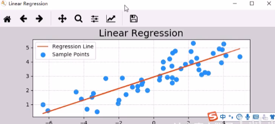
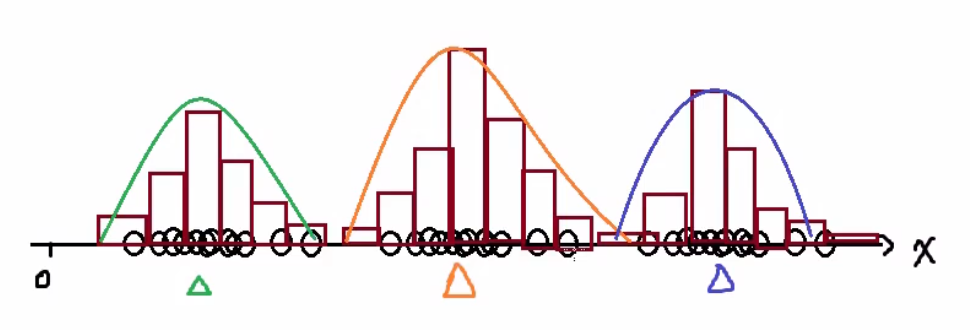
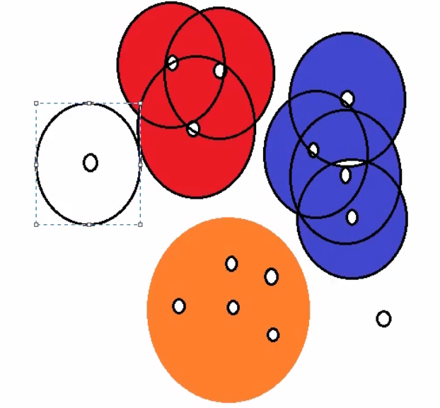

# 机器学习

## 机器学习的问题

1. **建模问题**
   
   所谓机器学习，在形式上可这样理解：在数据对象中通过统计或推理的方法，寻找一个接受特定输入 $X$，并给出预期输出 $Y$ 的功能函数 $f$，即 $Y = f(x)$

2. **评估问题**
   
   针对已知的输入，函数给出的输出（预测值）与实际输出（目标值）之间存在一定的误差，因此需要构建一个评估体系，根据误差的大小判定函数的优劣

3. **优化问题**
   
   学习的核心在于改善性能，通过数据对算法的锤炼，不断提升函数预测的准确性，直至获得能够满足实际需求的最优解

## 机器学习的种类

1. **监督学习**
   
   用已知输出评估模型的性能

2. **无监督学习**
   
   在没有已知输出的情况下，仅仅根据输入信息的相关性，进行类别的划分

3. **半监督学习**
   
   先通过无监督学习划分类别，再根据人工标记通过监督学习预测输出

4. **强化学习**
   
   通过对不同决策结果的奖励和惩罚，使机器学习系统在经过足够长时间的训练以后，越来越倾向于给出接近期望结果的输出

5. **批量学习和增量学习**
   
   - 批量学习
     
     将学习的过程和应用过程截然分开，用全部的训练数据训练模型，然后再在应用场景中实现预测，当预测结果不够理想时，重新回到学习过程，如此循环
   
   - 增量学习
     
     将学习过程和应用过程统一起来，在应用的同时以增量的方式，不断学习新的内容，边训练边预测

6. **基于实例的学习和基于模型的学习**
   
   - 基于实例的学习
     
     根据以往的经验，寻找与待预测输入最接近的样本，以其输出作为预测结果
     
     
   
   - 基于模型的学习
     
     根据以往的经验，建立用于联系输出和输入的某种数学模型，将待预测输入代入该模型，预测其结果
     
     
   

## 机器学习的一般过程

**数据处理**

1. 数据收集（数据检索、数据挖掘、爬虫）
2. 数据清洗
3. 特征工程

**机器学习**

1. 选择模型 / 算法
2. 训练模型 / 算法
3. 评估模型（工具、框架、算法知识）
4. 测试模型

**业务运维**

1. 应用模型
2. 维护模型

## 机器学习的典型应用

股价预测、推荐引擎、自然语言识别、语音识别、图像识别、人脸识别

## 机器学习的基本问题

1. 回归问题

   根据已知的输入和输出寻找某种性能最佳的模型，将未知输出的输入代入模型，得到连续的输出

2. 分类问题

   根据已知的输入和输出寻找某种性能最佳的模型，将未知输出的输入代入模型，得到离散的输出

3. 聚类问题

   根据已知输入的相似程度，将其划分为不同的群落

4. 降维问题

   在性能损失尽可能小的前提下，降低数据的复杂度

# 数据预处理

**数据预处理的过程**

输入数据 -- 模型 -- 输出数据

一行一样本，一列一特征

**数据预处理相关库**

```python
# 解决机器学习问题的科学计算工具包
import sklearn.preprocessing as sp
```

**为什么要进行归一化\标准化**

特征的单位或者大小相差较大，或者某特征的方差相比其它的特征要大出几个数量级，容易影响（支配）目标结果，使得一些算法无法学习到其它的特征

我们需要用到一些方法进行无量钢化，使不同规格的数据转换到统一规格

## 均值移除 ( 标准化 )

由于一个样本的不同特征值差异较大，不利于使用现有机器学习算法进行样本处理，**均值移除**可以让样本矩阵中的每一列的平均值为0，标准差为1
$$
X' = \frac{x -mean}{\sigma}
$$
作用于每一列，$mean$ 为平均值，$\sigma$ 为标准差

```python
import sklearn.preprocessing as sp
A = sp.scale(array)

# 案例
import numpy as np
from sklearn.preprocessing import *
raw_samples = np.array([
    [17., 100., 4000],
    [20., 80., 5000],
    [23., 75., 5500]
])
std_samples = scale(raw_samples)
print(std_samples)
print(std_samples.mean(axis = 0))
print(std_samples.std(axis = 0))
```

`sklearn.preprocessing.StandardScaler()`

```python
from sklearn.preprocessing import StandardScaler

StandardScaler(X)
- StandardScaler.fit_transform(X)
```

```python
from sklearn.preprocessing import StandardScaler
def stand_demo():
    # 1.获取数据
    pd.read_csv('dating.txt')
    data.iloc[:, :3]
    # 2.实例化一个转换器类
    transfer = StandardScaler()
    # 3.调用 fit_transform 
    data_new = transfer.fit_transform(data)
    print('data_new:\n', data_new)
```

在已有样本足够多的情况下比较稳定，适合现代嘈杂大数据场景

## 范围缩放 ( 离差标准化 )

将样本矩阵中的每一列的最小值和最大值设定为相同的区间，统一各列特征值的范围；一般情况下把特征值缩放至 [0, 1] 之间
$$
X' = \frac{x - \min}{\max - \min} \\
X'' = X' \times (mx - mi) + mi
$$
作用于每一列，$\max$ 为一列的最大值，$\min$ 为一列的最小值，那么 $x$ 为最终结果，$mx, mi$ 分别为指定区域值默认 $mx$ 为 1，$mi$ 为 0

`sklearn.preprocessing.MinMaxScaler(fearure_range = (0, 1)...)`

```python
from sklearn.preprocessing import MinMaxScaler

MinMaxScaler(X)
- MinMaxScaler.fit_transform(X)
```

```python
from sklearn.preprocessing import MinMaxScaler

import pandas as pd
def minmax_demo():
    # 1.获取数据
    pd.read_csv('dating.txt')
    data.iloc[:, :3]
    # 2.实例化一个转换器类
    transfer = MinMaxScaler()
    # 3.调用 fit_transform
    data_new = transfer.fit_transform(data)
    print('data_new:\n', data_new)
```

## 归一化

有些情况每个样本的每个特征的值并不重要，但是每个样本特征值的占比更加重要

**归一化**即是用每个样本的每个特征值除以该样本各个特征值绝对值的总和；变换后的样本矩阵，每个样本的特征值绝对值之和为1
$$
x' = \frac{x}{\sum{|X|}}
$$

```python
from sklearn.preprocessing import normalize

x = normalize(array, norm = 'l1')
'''
l1: L1 范数
l2: L2 范数
'''
```

```python
import numpy as np
from sklearn.preprocessing import normalize

arr = np.array([[10, 21, 5],
               [2, 4, 1],
               [11, 18, 18]])
result = normalize(arr, norm = 'l1')
print(result)
```

## 二值化

有些业务并不需要分析矩阵的详细完整数据，比如图像边缘识别只需要分析出图像边缘即可

可以根据一个事先给定的阈值，用0和1表示特征值不高于或高于阈值；二值化后的数组中每个元素非0即1，达到简化数学模型的目的

```python
# 给出阈值，获取二值化器
bin_ = preprocessing.Binarizer(threshold = none)

# 调用 transform 方法对原始样本矩阵进行二值化
result = bin_.transform(array)
```

```python
import numpy as np
from sklearn.preprocessing import Binarizer

arr = np.array([[10, 21, 5],
               [2, 4, 1],
               [11, 18, 18]])
bin_ = Binarizer(threshold = 10)
result = bin_.transform(arr)
print(result)
```

```python
'''
二值化图像
'''
import scipy.misc as sm
import numpy as np
import matplotlib.pyplot as plt
from sklearn.preprocessing import Binarizer

# 读取灰度图像
original = sm.imread('../da_data/lily.jpg', True)

# 使用二值化器
bin_ = Binarizer(threshold = 127)
result = bin_.transform(original)
print(result)

# 画出图像
plt.imshow(result, cmap = 'gray')  # gray 是黑和白
plt.show()
```

## 独热编码  One-Hot Encoding

为样本特征的每个值建立一个由一个1和若干个0组成的序列，用该序列对所有的特征值进行编码

```python
'''
接标签编码代码
'''
from sklearn.preprocessing import OneHotEncoder

# binary encode
onehot_encoder = OneHotEncoder(sparse=False)
# sparse 是否使用紧缩格式；dtype 数据类型
integer_encoded = integer_encoded.reshape(len(integer_encoded), 1)
onehot_encoded = onehot_encoder.fit_transform(integer_encoded)
print(onehot_encoded)
```

```python
from sklearn.preprocessing import LabelBinarizer

# 单个特征
nominal = np.array([["A"],
                   ["B"],
                   ["C"],
                   ["D"]])
# 导入LabelBinarizer

one_hot = LabelBinarizer()  # 创建one-hot编码器
one_hot.fit_transform(nominal)  # 对特征进行one-hot编码


'''
# 转换前nominal
array([['A'],
       ['B'],
       ['C'],
       ['D']], dtype='<U1')
# 转换后结果
array([[1, 0, 0, 0],
       [0, 1, 0, 0],
       [0, 0, 1, 0],
       [0, 0, 0, 1]])
'''
```

```python
from sklearn.preprocessing import MultiLabelBinarizer

# 多个特征
multi_nominal = np.array([["A","Black"],
                         ["B","White"],
                         ["C","Green"],
                         ["D","Red"]])

multi_one_hot = MultiLabelBinarizer()
multi_one_hot.fit_transform(multi_nominal)


'''
# 转换前结果
array([['A', 'Black'],
       ['B', 'White'],
       ['C', 'Green'],
       ['D', 'Red']], dtype='<U5')
# 转换后结果
array([[1, 0, 1, 0, 0, 0, 0, 0],
       [0, 1, 0, 0, 0, 0, 0, 1],
       [0, 0, 0, 1, 0, 1, 0, 0],
       [0, 0, 0, 0, 1, 0, 1, 0]])
'''
```

## 标签编码

一个特征一个标签编码器

```python
from sklearn.preprocessing import LabelEncoder

# define example
data = ['cold', 'cold', 'warm', 'cold', 'hot', 'hot', 'warm', 'cold', 'warm', 'hot']
values = array(data)
print(values)
# integer encode
label_encoder = LabelEncoder()
integer_encoded = label_encoder.fit_transform(values)
print(integer_encoded)
```

## 编码倒置

```python
'''
接标签编码代码
'''
# invert first example
inverted = label_encoder.inverse_transform([argmax(onehot_encoded[0, :])])
print(inverted)
```

# 数据集

## 数据集 API

```
sklearn.datasets

加载获取流行数据集

datasets.load_*()
  - 获取小规模数据集，数据包含在 datasets 里

datasets.fetch_*(data_home = None)
  - 获取大规模数据集，需要从网络上下载，函数的第一个参数是 data_home, 表示数据集下载的目录，默认是 ~/scikit-learn_data/
```

**sklearn 数据集返回值的介绍**

`load` 和 `fetch` 返回的数据类型 `datasets.base.Bunch` (继承自字典)

- data: 特征数据数组，是 `[n_samples * n_features]` 的二维 numpy.ndarray 数组
- target: 目标值 / 标签数组，是 `n_samples` 的一维 numpy.ndarray 数组
- DESCR: 数据描述
- feature_names: 特征名
- target_names: 目标值的名字 / 标签名

```python
datasets.base.Bunch
dict['key'] = values
bunch.key = values
```

```python
from sklearn.datasets import load_iris
# 获取鸢尾花数据集
iris = load_iris()
print('鸢尾花数据集的返回值:\n', iris)
# 返回值是一个继承自字典的 Bench
print('鸢尾花的特征值:\n', iris['data'])
print('鸢尾花的目标值:\n', iris.target)
print('鸢尾花特征的名字:\n', iris.feature_names)
print('鸢尾花目标值的名字:\n', iris.target_names)
print('鸢尾花的描述:\n', iris.DESCR)
```

**sklearn 小数据集**

- `sklearn.datasets.load_iris()`

  加载并返回鸢尾花数据集

- `sklearn.datasets.load_boston()`

  加载并返回波士顿房价数据集

**sklearn 大数据集**

- `sklearn.datasets.fetch_20newsgroups(data_home = None, subset = 'train')`
  - subset: 'train' 或者 'test', 'all' 可选，选择要加载的数据集

  - 训练集的 ’训练‘，测试集的 ’测试‘ ，两者的 ’全部‘

## 数据集划分 API

- 训练数据：用于训练，构建模型

- 测试数据：在模型检验时使用，用于评估模型是否有效，比例 20%-30%

**数据集划分 API**

```
sklearn.model_selection.train_test_split(arrays, *options)

x: 数据集的特征值
y: 数据集的标签值
test_size: 测试集的大小，一般为 float
random_state: 随机数种子，不同的种子会造成不同的随机采样结果；相同的种子采样结果相同
return: 训练集特征值，测试集特征值，训练集目标值，测试集目标值 (x_train, x_test, y_train, y_test)
```

```python
from sklearn.model_selection import train_test_split
x_train, x_test, y_train, y_test = train_test_split(iris.data, iris.target, test_size = 0.2, random_state = 22)
# test_size 默认为 0.25
print('训练集的特征值:\n', x_train, x_train.shape)
```

# 线性回归

预测函数 : $y = wx + b$

输入 : $x$

输出 : $y$

模型参数 : $w, b$

所谓模型训练，就是根据已知的 $x, y$ 找到最佳的模型参数，尽可能精确地描述出输入和输出的关系

## 样本误差

1. **单样本误差**

   根据输入求得预测值为 $y' = w x + b$

   单样本误差为 $\frac{1}{2} (y' - y)^2$

2. **总样本误差**

   把所有单样本误差相加即为总样本误差
   $$
   E = \frac{1}{2} \sum(y' - y)^2
   $$

## 损失函数

$$
LOSS = \frac{1}{2} \sum(w x + b - y)^2
$$

LOSS Function 就算总样本误差关于模型参数的函数，需要找到一组 $w, b$ 使得 LOSS 取得极小值

## 梯度下降

$$
w_1 ： w_1 - \alpha \frac{\partial LOSS(w_0+w_1x_1)}{\partial w_1} \\
w_0 ： w_0 - \alpha \frac{\partial LOSS(w_0+w_1x_1)}{\partial w_0}
$$

```python
import numpy as np
import matplotlib.pyplot as plt
from mpl_toolkits.mplot3d import axes3d

train_x = np.array([0.5, 0.6, 0.8, 1.1, 1.4])
train_y = np.array([5.0, 5.5, 6.0, 6.8, 7.0])

w0, w1, losses, epoches = [1], [1], [], []  # 初始值
item_step = 1000
lrate = 0.01

for i in range(1, item_step + 1):
    epoches.append(i)  # 迭代次数
    # 求 LOSS
    loss = ((w0[-1] + w1[-1] * train_x - train_y) ** 2).sum() / 2
    losses.append(loss)
    # 打印模型参数
    print(f'{i:4} > w0 = {w0:.8f}, w1 = {w1:.8f}, loss = {loss:.8f}')
    # 求损失函数关于 w0, w1 的偏导数，从而更新模型参数
    d0 = (w0[-1] + w1[-1] * train_x - train_y).sum()
    d1 = (train_x[-1] * (w0[-1] + w1[-1] * train_x - train_y)).sum()
    
    # 根据梯度下降更新参数
    w0.append(w0[-1] - lrate * d0)
    w1.append(w1[-1] - lrate * d1)  
    
    
# 预测值
linex = np.linspace(train_x.min(), train_x.max(), 100)
liney = w1[-1] * linex + w0[-1]
   
# 绘制预测结果图
plt.figure('Linear Regression', facecolor = 'lightgray')
plt.title('Linear Regression', fontsize = 18)
plt.grid(linestyle = ':')
plt.scatter(train_x, train_y, s = 80, marker = 'o', color = 'dodgerblue', label = 'Samples')
plt.plot(linex, liney, color = 'orangered', linewidth = 2, label = 'Regression Line')
plt.legend()

# 绘制训练过程图
plt.figure('Training Progress', facecolor = 'lightgray')
plt.title('Training Progress', fontsize = 18)
plt.subplot(311)
plt.grid(linestyle = ':')
plt.ylabel(r'$w_0$', fontsize = 14)
plt.plot(epoches, w0[: -1], color = 'dodgerblue', label = r'$w_0$')
plt.legend()
plt.tight_layout()  # 紧凑布局

plt.subplot(312)
plt.grid(linestyle = ':')
plt.ylabel(r'$w_1$', fontsize = 14)
plt.plot(epoches, w1[: -1], color = 'dodgerblue', label = r'$w_1$')
plt.legend()
plt.tight_layout()  # 紧凑布局

plt.subplot(313)
plt.grid(linestyle = ':')
plt.ylabel(r'$loss$', fontsize = 14)
plt.plot(epoches, losses, color = 'orangered', label = r'$loss$')
plt.legend()
plt.tight_layout()  # 紧凑布局

# 3D 图像
n = 500
w0_grid, w1_grid = np.meshgrid(np.linspace(0, 9, n),
                               np.linspace(0, 3.5, n))
loss_grid = 0
for x, y in zip(train_x, train_y):
    loss_grid += (w0_grid + w1_grid * x - y) ** 2 / 2

plt.figure('Loss Function', facecolor = 'lightgray')
ax3d = plt.gca(projection = '3d')
ax3d.set_xlabel('w0')
ax3d.set_ylabel('w1')
ax3d.set_zlabel('loss')
ax3d.plot_surface(w0_grid, w1_grid, loss_grid, cstride = 30,
                 rstride = 30, cmap = 'jet')
# 梯度下降过程
ax3d.plot(w0[: -1], w1[: -1], losses, 'o-', color = 'red')
plt.tight_layout()

plt.show()
```

## 相关 API

```
sklearn.linear_model.LinearRegression(fit_intercept = True)

- fit_intercept: 是否计算偏置
- LinearRegression.coef_: 回归系数
- LinearRegression.intercept_: 偏置
```

```python
import numpy as np
import matplotlib.pyplot as plt
from sklearn.linear_model import LinearRegression

# 读入数据
x, y = np.loadtxt('../m1_data/single.txt', delimiter = ',', unpack = True)  # delimiter 使用 , 进行分隔，unpack 进行拆包得到 x, y

# 整理输入输出
x = x.reshape(-1, 1)  # 变维度，n 行 1 列；1 列 前面的行自适应

# 数据集可视化
plt.figure('Linear Regression', facecolor = 'lightgray')
plt.title('Linear Regression', fontsize = 18)
plt.grid(linestyle = ':')
plt.scatter(x, y, s = 70, color = 'dodgerblue', label = 'Sample Points')

# 构建模型
estimator = LinearRegression()
estimator.fit(x, y)
pred_y = estimator.predict(x)

# 针对训练数据，得到预测结果进行画图
plt.plot(x, pred_y, color = 'orangered', label = 'Regression Line')

plt.legend()
plt.show()
```



## 评估训练结果误差 metrics

评估结果误差，利用 `sklearn.metrics` 模块；提供了一些常用算法

```python
from sklearn.metrics import mean_absolute_error, mean_squared_error, median_absolute_error, r2_score

'''
y: 实际输出
y': 预测输出
'''

# 平均绝对值误差  1 / m \sum{ |y - y'| }
mean_absolute_error(y, pred_y)
best result: 0.0

# 均方误差  sqrt(1 / m \sum{ (y - y')^2 })
mean_squared_error(y, pred_y)
best result: 0.0

# 中位绝对值误差  median(|y - y'|)
median_absolute_error(y, pred_y)
best result: 0.0

# R2 得分  (0, 1] 区间的分值 分数越高 误差越小
r2_score(y, pred_y)
best result: 1.0
    
# 可解释方差值
explained_variance_score(y, pred_y)
best result: 1.0
```

## 模型保存与加载

模型训练是一个耗时的过程，一个优秀的机器学习是非常宝贵的，可以模型保存到磁盘中，也可以在需要使用的时候从磁盘中重新加载模型即可；不需要重新训练

1. **模型保存**

   ```python
   import pickle
   pickle.dump(内存对象, 磁盘文件)
   ```

   ```python
   '''案例'''
   import numpy as np
   import pickle
   from sklearn.linear_model import LinearRegression
   
   # 读入数据
   x, y = np.loadtxt('../m1_data/single.txt', delimiter = ',', unpack = True)  # delimiter 使用 , 进行分隔，unpack 进行拆包得到 x, y
   
   # 整理输入输出
   x = x.reshape(-1, 1)  # 变维度，n 行 1 列；1 列 前面的行自适应
   
   # 构建模型
   model = LinearRegression()
   model.fit(x, y)
   
   # 存储模型
   with open('./linear.pkl', 'wb') as f:
   	pickle.dump(model, f)
       print('dump success!')
   ```

   

2. **模型加载**

   ```python
   import pickle
   model = pickle.load(磁盘文件)
   ```

   ```python
   import pickle
   import numpy as np
   import matplotlib.pyplot as plt
   from sklearn.linear_model import LinearRegression
   
   # 读入数据
   x, y = np.loadtxt('../m1_data/single.txt', delimiter = ',', unpack = True)  # delimiter 使用 , 进行分隔，unpack 进行拆包得到 x, y
   
   # 整理输入输出
   x = x.reshape(-1, 1)  # 变维度，n 行 1 列；1 列 前面的行自适应
   
   # 数据集可视化
   plt.figure('Linear Regression', facecolor = 'lightgray')
   plt.title('Linear Regression', fontsize = 18)
   plt.grid(linestyle = ':')
   plt.scatter(x, y, s = 70, color = 'dodgerblue', label = 'Sample Points')
   
   # 加载模型
   with open('linear.pkl', 'rb') as f:
       model = pickle.load(f)
   pred_y = model.predict(x)
   
   # 针对训练数据，得到预测结果进行画图
   plt.plot(x, pred_y, color = 'orangered', label = 'Regression Line')
   
   plt.legend()
   plt.show()
   ```

3. **使用场景**

   需要持久化使用模型时；

# 岭回归

普通的线性回归模型使用基于梯度下降的最小二乘法，在最小化损失函数的前提下，寻找最优模型参数，于此过程中，包括少数异常样本在内的全部训练数据都会对最终模型参数造成程度相等的影响，异常值对模型所带来的影响无法在训练过程中被识别出来；

为此，岭回归在模型迭代过程所依据的损失函数中增加了正则项，以限制模型参数对异常样本的匹配程度，进而提高模型面对多数正常样本的拟合精度

## L2 正则化

- 作用：可以使得其中一些 $w$ 很小，都接近于0，削弱某个特征的影响

- 优点：越小的参数说明模型越简单，越简单的模型则越不容易产生过拟合现象

- 加入 L2 正则化后的损失函数

  $$
  J(w) = \frac{1}{2m}\sum_{i=1}^m (h_w(x_i)-y_i)^2+\lambda \sum_{j=1}^n w_j^2
  $$

  损失函数 + 惩罚系数 * 惩罚项

  > m 为样本数，n 为特征数

## API

```
sklearn.linear_model.Ridge(alpha = 1.0, fit_intercept = True, max_iter = None, solver = 'auto', normalize = False)

alpha: 正则化力度，也叫 $\lambda$，取值 0-1，1-10
fit_intercept: 是否训练截距
max_iter: 最大迭代次数
solver: 会根据数据自动选择优化方法
  - sag: 如果数据集、特征都比较大，选择该随机梯度下降优化
normalize: 数据是否进行标准化
  - normalize = False: 可以在 fit 之前调用 
    preprocessing.StandardScaler 标准化数据
Ridge.coef_: 回归权重
Ridge.intercept_: 回归偏置
```

> Ridge 方法相当于 `SGDRegressor(penalty = '12', loss = 'squared_loss')`, 只不过 SGDRegressor 实现了一个普通的随机梯度下降学习，推荐使用 Ridge (实现了 SAG)

## 波士顿房价预测

```python
from sklearn.datasets import load_boston
from sklearn.model_selection import train_test_split
from sklearn.preprocessing import StandardScaler
from sklearn.linear_model import Ridge
from sklearn.metrics import r2_score
import matplotlib.pyplot as plt

# 1.获取数据
boston = load_boston()

# 2.划分数据集
x_train, x_test, y_train, y_test = train_test_split(boston.data, boston.target, random_state = 22)

# 3.标准化
transfer = StandardScaler()
x_train = transfer.fit_transform(x_train)
x_test = transfer.transform(x_test)

# 4.预估器
estimator = Ridge(alpha = 9, fit_intercept = True, max_iter = 1000)  # 实例化
estimator.fit(x_train, y_train)  # 训练

# 5.得出模型
print('岭回归权重系数为\n', estimator.coef_)
print('岭回归偏置为\n', estimator.intercept_)

# 6.模型预测
y_predict = estimator.predict(x_test)
print('预测房价:\n', y_predict)

# 7.模型评估
error = mean_squared_error(y_test, y_predict)
print('岭回归-均方误差为:\n', error)

# 8.预测可视化
plt.scatter(x_test, y_test, s = 70, color = 'dodgerblue', label = 'Test Points')
plt.plot(x_test, y_predict, color = 'orangered', label = 'Ridge')

plt.legend()
plt.show()
```

# 多项式回归

若希望回归模型更好的拟合训练样本数据，可以使用多项式回归器

## 一元多项式回归

一般形式：
$$
y = w_0 + w_1 x + w_2 x^2 + w_3 x^3 + \dots + w_d x^d
$$
将高次项看作对一次项特征的扩展得到
$$
y = w_0 + w_1 x_1 + w_2 x_2 + w_3 x_3 + \dots + w_d x_d
$$
一元多项式回归即可以看作为多元线性回归，可以使用 `LinearRegression` 模型对样本数据进行模型训练

## 实现的两个步骤

- 将一元多项式回归问题转换成多元线性回归问题

  只需给出多项式最高次数的项即可

- 将步骤一得到多项式的结果中 $w_1, w_2, \dots$ 当作样本特征，交给线性回归器训练多元线性模型

## API 实现

**sklearn 提供有 API 实现以上两个步骤**

```python
'''sklearn 的数据管线实现'''
from sklearn.pipeline import make_pipeline
# 多项式特征扩展器
from sklearn.preprocessing import PolynomialFeatures
from sklearn.linear_model import LinearRegression

estimator = make_pipeline(PolynomialFeatures(10),
                         LinearRegression())
```

## 案例

```python
import numpy as np
from sklearn.pipeline import make_pipeline
from sklearn.preprocessing import PolynomialFeatures
from sklearn.linear_model import LinearRegression
from sklearn.metrics import r2_score
import matplotlib.pyplot as plt

# 获取数据
x, y = np.loadtxt('../data/single.txt', delimiter = ',', usecols = (0, 1), unpack = True)
x = x.reshape(-1, 1)

# 数据集可视化
plt.figure('Linear Regression', facecolor = 'lightgray')
plt.title('Linear Regression', fontsize = 18)
plt.grid(linestyle = ':')
plt.scatter(x, y, s = 70, color = 'dodgerblue', label = 'Sample Points')

# 创建多项式回归模型，管线
estimator = make_pipeline(PolynomialFeatures(10),
                         LinearRegression())

# 训练模型
estimator.fit(x, y)

# 预测输出
pred_y = estimator.predict(x)

# 模型评估
print(r2_score(y, pred_y))

# 针对训练数据，得到预测结果进行画图
# 绘制多项式函数图像，从 min 到 max 拆 500 个点
# 预测 500 个函数值，按顺序绘制
x = np.linspace(x.min(), x.max(), 500)
x = x.reshape(-1, 1)
pred_y = estimator.predict(x)
plt.plot(x, pred_y, color = 'orangered', label = 'Regression Line')

plt.legend()
plt.show()
```

# 决策树回归

相似的输入产生相似的输出

决策树思想的来源非常朴素，程序设计中的条件分支结构就是 if-else 结构，最早的决策树就是利用这类结构分割数据的一种分类学习方法


如何高效的进行决策？
决定一下特征的先后顺序

## 信息熵

信息的衡量 (信息量；信息的混乱程度)

信息熵越小，信息越来越纯，数据越来越有序

> 信息：香农提出，为消除随机不定性的东西
>
> 小明  年龄    “我今年18岁”  --  信息
>
> 小华  “小明明年19岁”  --  不是信息

**H 的专业术语称之为信息熵，单位为比特**
$$
H(X) = -(\sum_{i = 1}^n P(x_i) \log_bP(x_i))
$$

## 回归器 API

```python
from sklearn.tree import DecisionTreeRegressor
estimator = DecisionTreeRegressor(max_depth = 4)

max_depth: 最大深度
    
estimator.fit(train_x, train_y)
pred = estimator.predict(test_x)
```

## 波士顿房价预测

```python
from sklearn.datasets import load_boston
from sklearn.utils import shuffle  # 打乱数据集的 API
from sklearn.model_selection import train_test_split
from sklearn.preprocessing import StandardScaler
from sklearn.tree import DecisionTreeRegressor
from sklearn.metrics import mean_squared_error

# 1.获取数据
boston = load_boston()

# 2.划分数据集
x_train, x_test, y_train, y_test = train_test_split(boston.data, boston.target, random_state = 22)
''' 使用 sklearn.utils 中的 shuffle 划分数据集
# shuffle 打乱数据集，拆分数据集
x, y = shuffle(boston.data, boston.target, random_state = 7)
train_size = int(len(x) * 0.8)  # 数据下标索引
x_train, x_test, y_train, y_test = x[: train_size], x[train_size: ], y[: train_size], y[train_size: ]
'''

# 3.标准化
transfer = StandardScaler()
x_train = transfer.fit_transform(x_train)
x_test = transfer.transform(x_test)

# 4.预估器
estimator = DesicionTreeRegressor(max_depth = 4)  # 实例化
estimator.fit(x_train, y_train)  # 训练

# 5.模型预测
y_predict = estimator.predict(x_test)
print('预测房价:\n', y_predict)

# 6.模型评估
error = mean_squared_error(y_test, y_predict)
print('决策树回归-均方误差为:\n', error)
```

# 集合算法

根据多个不同模型给出的预测结果，利用平均（回归）或者投票（分类）的方法，得出最终预测结果

基于决策树的集合算法，就是按照某种规则，构建多颗彼此不同的决策树模型，分别给出针对未知样本的预测结果，最后通过平均或投票得到相对综合的结论

## 正向激励

首先为样本矩阵中的样本随机分配初始权值，由此构建一棵带有权重的决策树，再由该决策树提供预测输出时，通过加权平均或者加权投票的方式产生预测值；将训练样本代入模型，预测其输出，对那些预测值与实际值不同的样本，提高其权重，由此形成第二棵决策树；<u>重复以上过程，构建出不同权重的若干棵决策树</u>

```python
from sklearn.tree import DecisionTreeRegressor
from sklearn.ensemble import AdaBoostRegressor

# 一棵决策树
estimator = DecisionTreeRegressor(max_depth = 4)
# 自适应增强决策树回归模型
# n_estimators: 构建400棵不同权重的决策树，训练模型
estimator = AdaBoostRegressor(estimator, n_estimators = 400, random_state = 7)  # 正向激励

# 训练模型 测试模型
estimator.fit(train_x, train_y)
pred_test_y = estimator.predict(test_x)
```

## 正向激励的波士顿房价预测

```python
from sklearn.datasets import load_boston
from sklearn.utils import shuffle  # 打乱数据集的 API
from sklearn.model_selection import train_test_split
from sklearn.preprocessing import StandardScaler
from sklearn.tree import DecisionTreeRegressor
from sklearn.ensemble import AdaBoostRegressor
from sklearn.metrics import mean_squared_error

# 1.获取数据
boston = load_boston()

# 2.划分数据集
x_train, x_test, y_train, y_test = train_test_split(boston.data, boston.target, random_state = 22)
''' 使用 sklearn.utils 中的 shuffle 划分数据集
# shuffle 打乱数据集，拆分数据集
x, y = shuffle(boston.data, boston.target, random_state = 7)
train_size = int(len(x) * 0.8)  # 数据下标索引
x_train, x_test, y_train, y_test = x[: train_size], x[train_size: ], y[: train_size], y[train_size: ]
'''

# 3.标准化
transfer = StandardScaler()
x_train = transfer.fit_transform(x_train)
x_test = transfer.transform(x_test)

# 4.预估器
estimator = DesicionTreeRegressor(max_depth = 4)  # 实例化
estimator.fit(x_train, y_train)  # 训练

# 5.模型预测
y_predict = estimator.predict(x_test)
print('预测房价:\n', y_predict)

# 6.模型评估
error = mean_squared_error(y_test, y_predict)
print('决策树回归-均方误差为:\n', error)

# 7.正向激励
estimator = AdaBoostRegressor(estimator, n_estimators = 400, random_state = 7)  # 正向激励
estimator.fit(x_train, y_train)  # 训练
y_predict = estimator.predict(x_test)
error = mean_squared_error(y_test, y_predict)
print('决策树正向激励-均方误差为:\n', error)
```

## 特征重要性

作为决策树模型训练过程的副产品，根据每个特征划分子表前后的信息熵减少量就标志了该特征的重要程度，此即为该特征重要性指标；
训练得到的模型对象提供了属性: `feature_importances_` 来存储每个特征的重要性

```python
estimator.fit(train_x, train_y)
fi = estimator.feature_importances_
```

```python
from sklearn.datasets import load_boston
from sklearn.utils import shuffle  # 打乱数据集的 API
from sklearn.model_selection import train_test_split
from sklearn.preprocessing import StandardScaler
from sklearn.tree import DecisionTreeRegressor
from sklearn.ensemble import AdaBoostRegressor
from sklearn.metrics import mean_squared_error
import matplotlib.pyplot as plt

# 1.获取数据
boston = load_boston()

# 2.划分数据集
x_train, x_test, y_train, y_test = train_test_split(boston.data, boston.target, random_state = 22)
''' 使用 sklearn.utils 中的 shuffle 划分数据集
# shuffle 打乱数据集，拆分数据集
x, y = shuffle(boston.data, boston.target, random_state = 7)
train_size = int(len(x) * 0.8)  # 数据下标索引
x_train, x_test, y_train, y_test = x[: train_size], x[train_size: ], y[: train_size], y[train_size: ]
'''

# 3.标准化
transfer = StandardScaler()
x_train = transfer.fit_transform(x_train)
x_test = transfer.transform(x_test)

# 4.预估器
estimator = DesicionTreeRegressor(max_depth = 4)  # 实例化
estimator.fit(x_train, y_train)  # 训练

# 5.模型预测
y_predict = estimator.predict(x_test)
print('预测房价:\n', y_predict)

# 6.模型评估
error = mean_squared_error(y_test, y_predict)
print('决策树回归-均方误差为:\n', error)

dt_fi = estimator.feature_importances_  # 特征重要性
print('DT FI:', dt_fi)

# 7.正向激励
estimator = AdaBoostRegressor(estimator, n_estimators = 400, random_state = 7)  # 正向激励
estimator.fit(x_train, y_train)  # 训练
y_predict = estimator.predict(x_test)
error = mean_squared_error(y_test, y_predict)
print('决策树正向激励-均方误差为:\n', error)

ada_fi = estimator.feature_importances_  # 特征重要性
print('AbaBoost FI:', ada_fi)

# 8.特征重要性绘图
plt.figure('Feature Importances', facecolor = 'loghtgray')
plt.subplot(211)
plt.title('DT Featrue Importances', fontsize = 16)
plt.ylabel('Feature Importance', fontsize = 14)
plt.grid(linestyle = ':', axis = 1)
x = np.arange(dt_fi.size)
# 对 fi 进行排序 的带有序索引
sorted_indices = df_fi.argsort()[:: -1]
df_fi = dt_fi[sorted_indices]

plt.bar(x, dt_fi, width = 0.8, color = 'dodgerblue', label = 'DT Feature Importances')
plt.xticks(x, names[sorted_indices])  # 控制刻度

plt.subplot(212)
plt.title('AbaBoost Featrue Importances', fontsize = 16)
plt.ylabel('Feature Importance', fontsize = 14)
plt.grid(linestyle = ':', axis = 1)
x = np.arange(ada_fi.size)
# 对 fi 进行排序 的带有序索引
sorted_indices = df_fi.argsort()[:: -1]
df_fi = ada_fi[sorted_indices]

plt.bar(x, ada_fi, width = 0.8, color = 'orangered', label = 'AbaBoost Feature Importances')
plt.xticks(x, names[sorted_indices])  # 控制刻度

plt.legend()
plt.tight_layout()
plt.show()
```

## 自助聚合

每次从总样本矩阵中以有放回抽样的方式随机抽取部分样本构建决策树，这样形成多棵包含不同训练样本的决策树，以削弱某些强势样本对模型预测结果的影响，提高模型的泛化特性

## 随机森林

在自助聚合的基础上，每次构建决策树模型时，不仅随机选择部分样本，而且还随机选择部分特征

这样的集合算法，不仅规避了强势样本对预测结果的影响，而且也削弱了强势特征的影响，使模型的预测能力更加泛化

> 两个随机：
>
> - 训练集随机
>   bootstrap  随机有放回抽样
>
> - 特征随机
>   从 M 个特征中随机抽取 m 个特征

```
sklearn.ensemble.RandomForestRegressor(max_depth = 10, n_estimators = 1000, min_samples_split = 2)

1. n_estimators: integer, optional (default = 10) 森林里的树木数量 120, 200, 300, 500, 800, 1200

2. max_depth: integer 或 None，可选 (默认 = 无) 树的最大深度 5, 8, 15, 25, 30

3. bootstrap: boolean, optional (default = True) 是否在构建树时使用放回抽样

4. min_samples_split: 节点划分最少样本数, 若小于这个数则不再继续向下拆分

5. min_samples_leaf: 叶子结点的最小样本数

超参数: n_estimator, max_depth, min_samples_split, min_sample_leaf
```

**案例**

分析共享单车的需求，从而判断如何进行共享单车的投放

```python
import pandas as pd
from sklearn.utils import shuffle  # 打乱数据集的 API
from sklearn.model_selection import train_test_split
from sklearn.preprocessing import StandardScaler
from sklearn.ensemble import RandomForestRegressor
from sklearn.metrics import mean_squared_error
import matplotlib.pyplot as plt

# 1.获取数据&特征选择
data = pd.read_csv('../ml_data/bike_day.csv')
x = data.iloc[:, 2: 13]
y = data['cnt']

# 2.划分数据集
x_train, x_test, y_train, y_test = train_test_split(x, y, random_state = 22)

# 3.标准化  若数据未标准化需要标准化  此数据已标准化
# transfer = StandardScaler()
# x_train = transfer.fit_transform(x_train)
# x_test = transfer.transform(x_test)

# 4.预估器
estimator = RandomForestRegressor(max_depth = 10, n_estimators = 1000, min_samples_split = 2)
estimator.fit(x_train, y_train)  # 训练

# 5.模型预测
y_predict = estimator.predict(x_test)
print('预测投放量:\n', y_predict)

# 6.模型评估
error = mean_squared_error(y_test, y_predict)
print('随机森林-均方误差为:\n', error)

'''
也可以绘制特征重要性图像
'''
# 7.特征重要性
ranf_fi = estimator.feature_importances_
print('RandomForest FI:', ranf_fi)
```

# 逻辑回归分类

逻辑回归 (Logistic Regression) 是机器学习中的一种分类模型，逻辑回归是一种分类算法，虽然名字中带有回归，但是它与回归之间有一定的联系；由于算法的简单和高效，在实际中应用非常广泛

## 逻辑回归原理

**输入**

线性回归的输出 就是 逻辑回归的输入

$$
h(w) = w_1x_1 + w_2x_2 + w_3x_3 \cdots + b
$$
**激活函数**

sigmoid 函数

$$
g(\theta^T x) = \frac{1}{1+e^{-\theta^T x}}
$$

- 回归的结果输入到 sigmoid 函数当中
- 输出结果：[0, 1] 区间中的一个概率值，默认为 0.5 为阈值

> 上一步输出的结果映射到 sigmoid 函数中，出现的结果如果大于 0.5 就认为属于该类别，小于 0.5 则不属于该类别

## API

```
sklearn.linear_model.LogisticRegression(solver = 'liblinear', penalty = '12', C = 1.0)

solver: 优化求解方式（默认开源的 liblinear 库实现，内部使用了坐标轴下降法来迭代优化损失函数）
	sag: 根据数据集自动选择，随机平均梯度下降
	
penalty: 正则化的种类

C: 正则化力度

默认将类别数量少的当作正则


estimator = LogisticRegression(solver = 'liblinear', C = 1.0)
estimator.fit(train_x, train_y)
estimator.predict(test_x)
```

## 二分类案例

癌症分类预测-良 / 恶性乳腺癌肿瘤预测

**数据描述**

- 699条样本，共11列数据，第一列用于检索的 id，后9列分别是与肿瘤相关的医学特征，最后一列表示肿瘤类型的数值

- 包含16个缺失值，用 “?” 标出

**流程分析**

1. 获取数据

   读取的时候加上 names

2. 数据处理

   缺失值处理

3. 数据集划分

4. 特征工程

   无量纲化 - 标准化

5. 逻辑回归预估器

6. 模型评估

```python
import pandas as pd
import numpy as np
from sklearn.model_selection import train_test_split
from sklearn.preprocessing import StandardScaler
from sklearn.linear_model import LogisticRegression

# 1.读取数据
path = 'http:'
column_name = ['Sample code number', 'Clump Thickness', 'Uniformity of Ce...']
data = pd.read_csv(path, names = column_name)

# 2.缺失值处理
# 2.1替换 np.nan
data = data.replace(to_replace = '?', value = np.nan)
# 2.2删除缺失样本
data.dropna(inplace = True)

# 3.数据集划分
# 筛选特征值和目标值
x = data.iloc[:, 1:-1]
y = data['Class']
x_train, x_test, y_train, y_test = train_test_split(x, y)

# 4.标准化
transfer = StandardScaler()
x_train = transfer.fit_transform(x_train)
x_test = transfer.transform(x_test)

# 5.逻辑回归预估器
estimator = LogisticRegression()
estimator.fit(x_train, y_train)

# 6.模型评估
# 逻辑回归的模型参数 回归系数和偏置
print(estimator.coef_)
# 方法1：直接比对真实值和预测
y_predict = estimator.predict(x_test)
print('y_predict:\n', y_predict)
print('直接比对真实值和预测值:\n', y_test == y_predict)
# 方法2：计算准确率
score = estimator.score(x_test, y_test)
print('准确率为:\n', score)
```

```python
# 绘制分类边界线
l, r = x_test[:, 0].min() - 1, x_test[:, 0].max() + 1
b, t = x_test[:, 1].min() - 1, x_test[:, 1].max() + 1
# 把可视区间划分为 500 * 500
n = 500
grid_x, grid_y = np.meshgrid(np.linspace(l, r, n),
                            np.linspace(b, t, n))
# 使用模型 得到点阵中每个坐标的类别
mesh_x = np.column_stack((grid_x.ravel(), grid_y.ravel()))
mesh_z = model.predict(mesh_x)
grid_z = mesh_z.reshape(grid_x.shape)

# 绘制
plt.figure('LR Classification', facecolor = 'lightgray')
plt.title('LR Classification', fontsize = 16)
plt.scatter(x_test[:, 0], x_test[:, 1], c = y_predict, cmap = 'jet', label = 'Sample Points', s = 70, zorder = 3)

# plt.pcolormesh() 绘制分类边界线
'''
根据参数 把可视区间拆分成坐标网格 由于每个网格都有相应类别
使用 cmap 为每个网格填充颜色
'''
plt.pcolormesh(grid_x, grid_y, grid_z, cmap = 'gray')

plt.legend()
mp.show()
```

## 多元分类

通过多个二元分类解决多元分类问题

若拿到一组新的样本，可以基于二元逻辑分类训练出一个模型判断属于 A 类别的概率，再使用同样的方法训练出两个模型分别判断属于 B, C 类别的概率，最终选择概率最高的类别作为新样本的分类结果

| 特征1 | 特征2 | ==>  | 所属类别 | 属于 A | 属于 B | 属于 C |
| ----- | ----- | ---- | -------- | ------ | ------ | ------ |
| 4     | 7     | ==>  | A        | 0.7    | 0.1    | 0.2    |
| 3.5   | 8     | ==>  | A        | 0.6    | 0.2    | 0.2    |
| 1.2   | 1.9   | ==>  | B        | 0.1    | 0.8    | 0.1    |
| 5.4   | 2.2   | ==>  | C        | 0.2    | 0.1    | 0.7    |

## 多分类案例

```python
import pandas as pd
import numpy as np
from sklearn.model_selection import train_test_split
from sklearn.preprocessing import StandardScaler
from sklearn.linear_model import LogisticRegression

# 1.读取数据
x = np.array([[4, 7],
             [3.5, 8],
             [3.1, 6.2],
             [0.5, 1],
             [1, 2],
             [1.2, 1.9],
             [6, 2],
             [5.7, 1.5],
             [5.4, 2.2]])
y = np.array([0, 0, 0, 1, 1, 1, 2, 2, 2])

# 2.数据集划分
x_train, x_test, y_train, y_test = train_test_split(x, y)

# 3.标准化
transfer = StandardScaler()
x_train = transfer.fit_transform(x_train)
x_test = transfer.transform(x_test)

# 4.逻辑回归预估器
estimator = LogisticRegression()
estimator.fit(x_train, y_train)

# 5.模型评估
# 逻辑回归的模型参数 回归系数和偏置
print(estimator.coef_)
# 方法1：直接比对真实值和预测
y_predict = estimator.predict(x_test)
print('y_predict:\n', y_predict)
print('直接比对真实值和预测值:\n', y_test == y_predict)
# 方法2：计算准确率
score = estimator.score(x_test, y_test)
print('准确率为:\n', score)
```

## 应用场景

- 广告点击率

- 是否为垃圾邮件

- 是否患病

- 金融诈骗

- 虚假账号

根据以上例子，发现其中特点是都属于两个类别之间的判断；逻辑回归就是解决二分类问题的利器

# 模型选择与调优

## 交叉验证

**只能用于分类业务**

交叉验证 (cross validation)
将拿到的训练数据，分为训练和验证集；以下图为例：**为了让被评估的模型更加准确可信**，将数据分成4份，其中一份作为验证集；然后经过4次的测试，每次都更换不同的验证集；即得到4组模型的结果，取平均值作为最终结果；又称4折交叉验证


## 交叉验证 API

```
sklearn.model_selection.cross_val_score

cross_val_score(model, input_dataset, output_dataset, cv = 折叠数, scoring = 指标名)
```

```python
from sklearn.model_selection import cross_val_score

cvs = cross_val_score(estimator, train_x, train_y, cv = 5, scoring = 'accuracy')

cvs.mean()
```

**交叉验证指标**

1. 精确度  accuracy

   分类正确的样本数 / 总样本数

2. 查准率  precision_weighted

   针对每一个类别，预测正确的样本数 / 预测出来的样本数

3. 召回率  recall_weighted

   针对每一个类别，预测正确的样本数 / 实际存在的样本数

4. f1 得分    f1_weighted

   2 * 查准率 * 召回率 / (查准率 + 召回率)

在交叉验证过程中，针对每一次交叉验证，计算所有类别的查准率、召回率或者 f1 得分，然后取各类相应指标值的平均数，作为这一次交叉验证的评估指标，然后再将所有交叉验证的评估指标以数组的形式返回调用者

# 朴素贝叶斯算法

## 朴素贝叶斯原理

分类算法之后会出现概率值，取概率比较大的为最终结果

**概率基础**

概率 (Probability) 定义

- 一件事情发生的可能性

  - 认出质地均匀的硬币，结果头像朝上

- $P(X)$ : 取值在 $[0, 1]$

**联合概率、条件概率与相互独立**

1. 联合概率：包含多个条件，且所有条件同时成立的概率

   记作：$P(A, B)$

   例如：$P(程序员, 匀称)$；$P(程序员, 超重|喜欢)$

2. 条件概率：事件 $A$ 在另外一个事件 $B$ 已经发生的条件下发生的概率

   记作：$P(A|B)$

   例如：$P(程序员|喜欢)$；$P(程序员, 超重|喜欢)$

3. 相互独立：如果 $P(A, B) = P(A)P(B)$，则称事件 $A$ 与事件 $B$  相互独立

## 贝叶斯公式

$$
P(C|W) = \frac{P(W|C)P(C)}{P(W)}
$$

**注：$W$ 为给定文档的特征值 (频数统计, 预测文档提供)，$C$ 为文档类别**

朴素贝叶斯，简单理解，就是假定了特征与特征之间相互独立的贝叶斯公式
也就是说，朴素贝叶斯、之所以朴素，就在于假定了特征与特征相互独立

> 朴素？
> 即为假设：特征与特征之间是相互独立的

朴素贝叶斯算法：朴素 + 贝叶斯

## API

```python
from sklearn.naive_bayes import GaussianNB

# 分类器
estimator = GaussianNB()
estimator.fit(x, y)
pred = estimator.predict(samples)
```

## 案例

```python
import numpy as np
from sklearn.select_model import train_test_split, cross_val_score
from sklearn.naive_bayes import GaussianNB
import matplotlib.pyplot as plt

# 数据集划分
data = np.loadtxt('../ml_data/multiple1.txt', delimiter = ',')
x = data[: , : 2].astype('f8')
y = data[: , -1].astype('f8')
train_x, test_x, train_y, test_y = train_test_split(x, y, random_state = 7)

# 交叉验证
estimator = GaussionNB()
ac_score = cross_val_score(estimator, train_x, train_y, cv = 5, scoring = 'accuracy')
print(ac_score.mean())  # 0.9966；

pr_score = cross_val_score(estimator, train_x, train_y, cv = 5, scoring = 'precision_weighted')
print(pr_score.mean())  # 

rc_score = cross_val_score(estimator, train_x, train_y, cv = 5, scoring = 'recall_weighted')
print(rc_score.mean())  # 

f1_score = cross_val_score(estimator, train_x, train_y, cv = 5, scoring = 'f1_weighted')
print(f1_score.mean())  # 

# 原始样本点
plt.figure('Naive Bayes Classification', facecolor = 'lightgray')
plt.title('Naive Bayes Classification', fontsize = 20)
plt.xlabel('x', fontsize = 14)
plt.ylabel('y', fontsize = 14)
plt.scatter(x[: , 0], x[: , 1], c = y, cmap = 'brg', s = 80)
plt.show()

# 模型建立

estimator.fit(x, y)


# 绘制分类边界线
l, r = x[:, 0].min() - 1, [:, 0].max() + 1
b, t = x[:, 1].min() - 1, x[:, 1].max() + 1
# 把可视区间划分为 500 * 500
n = 500
grid_x, grid_y = np.meshgrid(np.linspace(l, r, n),
                            np.linspace(b, t, n))
# 使用模型 得到点阵中每个坐标的类别
mesh_x = np.column_stack((grid_x.ravel(), grid_y.ravel()))
mesh_z = model.predict(mesh_x)
grid_z = mesh_z.reshape(grid_x.shape)

# 绘制
plt.figure('Bayes Classification', facecolor = 'lightgray')
plt.title('Bayes Classification', fontsize = 16)
plt.scatter(test_x[:, 0], test_x[:, 1], c = test_y, cmap = 'jet', label = 'Sample Points', s = 70, zorder = 3)

# plt.pcolormesh() 绘制分类边界线
'''
根据参数 把可视区间拆分成坐标网格 由于每个网格都有相应类别
使用 cmap 为每个网格填充颜色
'''
plt.pcolormesh(grid_x, grid_y, grid_z, cmap = 'gray')

plt.legend()
mp.show()

# 评估模型
pred = estimator.predict(test_x)
acc = (test_y == pred).sum() / test_y.size
```

# 分类评估算法

## 混淆矩阵

在分类任务下，预测结果 (Predicted Condition) 与正确标记 (True Condition) 之间存在四种不同的组合，构成混淆矩阵（适用于多分类）


TP = True Possitive
FN = False Negative

## 精确率  Precision

预测结果为正例样本中真实为正例的比例


## 召回率 Recall

真实为正例的样本中预测结果为正例的比例（查的全，对正样本的区分能力）


应用场景：

1）肿瘤预测

2）工厂质量检测

## F1-score

反映了模型的稳健性
$$
F1 = \frac{2TP}{2TP+FN+FP} = \frac{2 \cdot Precision \cdot Recall}{Precision + Recall}
$$

## 相关 API

- <u>**混淆矩阵**</u>

  `sklearn.metrics.confusion_matrix(test_y, pred_y)`

- <u>**精确率**</u>

  `sklearn.metrics.precision_score`

- <u>**召回率**</u>

  `sklearn.metrics.recall_score`

- <u>**精确率与召回率**</u> 【分类模型评价报告】

  `sklearn.metrics.classification_report(y_true, y_pred, labels = [], target_names = None)`

  - y_true: 真实目标值

  - y_pred: 估计器预测目标值

  - labels: 指定类别对应的数字

  - target_names: 目标类别名称

  - return: 每个类别**精确率与召回率**

- <u>**F1 值  F1-score**</u>

  `sklearn.metrics.cohen_kappa_score`

以上案例进行评估

```python
from sklearn.metrics import classification_report
report = classification_report(y_test, y_predict, labels = [2, 4], target_names = ['良性', '恶性'])
```


# 决策树分类


已知 四个特征，需预测 是否贷款给某个人
先看房子 再看工作 即可决定是否贷款

## 信息熵

信息的衡量 (信息量)

信息：香农提出，为消除随机不定性的东西
小明  年龄    “我今年18岁”  --  信息
小华  “小明明年19岁”  --  不是信息

**H 的专业术语称之为信息熵，单位为比特**
$$
H(X) = -(\sum_{i = 1}^n P(x_i) \log_bP(x_i))
$$

## 信息增益 决策树划分依据之一

**特征 $A$ 对训练数据集 $D$ 的信息增益 $g(D, A)$, 定义为集合 $D$ 的信息熵 $H(D)$ 与特征 $A$ 给定条件下 $D$ 的信息条件熵 $H(D|A)$ 之差**
$$
g(D,A) = H(D)-H(D|A)
$$

条件熵的计算

$$
H(D|A) = \sum_{i=1}^n \frac {\vert D_{ik}\vert}{\vert D\vert}H(D_i) \\
= -\sum_{i=1}^n \frac {\vert D_i\vert}{\vert D\vert}\sum_{k=1}^K \frac{\vert D_{ik}\vert}{\vert D_i\vert} \log \frac{\vert D_{ik}\vert}{\vert D_i \vert}
$$

*注：信息增益表示得知特征 X 的信息而息的不确定性减少的程度使得类 Y 的信息熵减少的程度*；**信息增益越大则该项作为划分的第一个特征**

> 例: 某人 已知年龄 工作 房子 信贷情况 问是否贷款
>
> $$
> H(D) = -(\frac{6}{15} \times \log_2 \frac{6}{15} + \frac{9}{15} \times \log_2 \frac{9}{15}) \approx 0.971 \\
> -\\
> H(D|年龄) = \frac{1}{3} H(青年) + \frac{1}{3} H(中年)+\frac{1}{3} H(老年) \\
> -\\
> H(青年) = -(\frac{2}{5} \times \log \frac{2}{5} + \frac{3}{5} \times \log \frac{3}{5}) \\
> -\\
> H(中年) = -(\frac{2}{5} \times \log \frac{2}{5} + \frac{3}{5} \times \log \frac{3}{5}) \\
> -\\
> H(老年) = -(\frac{1}{5} \times \log \frac{1}{5} + \frac{4}{5} \times \log \frac{4}{5})
> $$

## API & 可视化决策树

```
class sklearn.tree.DecisionTreeClassifier(criterion = 'gini', max_depth = None, random_state = None)

- 决策树分类器

- criterion: 默认是 'gini' 系数，也可以选择信息增益的熵 'entropy'

- max_depth: 树的深度大小

- random_state: 随机数种子
```

```
存树的结构到 dot 文件
sklearn.tree.export_graphviz()
该函数能够导出 DOT 格式

tree.export_graphviz(estimator, out_file = 'tree.dot', feature_names = ['',''])
```

网站显示结构

<http://webgraphviz.com/>

## 简单案例

```python
from sklearn.datasets import load_iris
from sklearn.model_selection import train_test_split
from sklearn.tree import DecisionTreeClassifier, export_graphviz


def decision_iris():
    # 1.获取数据
    iris = load_iris()
    
    # 2.划分数据集
    x_train, x_test, y_train, y_test = train_test_split(iris.data, iris.target, random_state = 22)
    
    # 3.决策树预估器
    estimator = DecisionTreeClassifier(criterion = 'entropy')
    estimator.fit(x_train, y_train)
    
    # 4.模型评估
    # 方法1：直接比对真实值和预测
    y_predict = estimator.predict(x_test)
    print('y_predict:\n', y_predict)
    print('直接比对真实值和预测值:\n', y_test == y_predict)
    # 方法2：计算准确率
    score = estimator.score(x_test, y_test)
    print('准确率为:\n', score)
    
    # 5.可视化决策树
    export_graphviz(estimator, out_file = 'iris_tree.dot', feature_names = iris.feature_names)
```

## 决策树分类优缺点

**优点**

- 简单的理解和解释，数目可视化，可解释能力强

**缺点**

- 决策树学习者可以创建不能很好地推广数据的过于复杂的树，这被称为过拟合

**改进**

- 减枝 cart 算法 (决策树 API 当中已经实现，随机森林参数调优有相关介绍)

- 随机森林

## 案例: 泰坦尼克号

泰坦尼克号乘客生存预测；泰坦尼克号数据

在泰坦尼克号和 titanic2 数据帧描述泰坦尼克号上的个别乘客的生存状态；这里使用的数据集是由各种研究人员开始的；其中包括许多研究人员创建的旅客名单，由 Michael A. Findlay 编辑；我们提取的数据集中的特征是票的类别，存货，乘坐班，年龄，登陆，home.dest，房间，票，船和性别

- 乘坐班是指乘客班 (1, 2, 3)，是社会经济阶层的代表

- 其中 age 数据存在缺失

  数据：<http://biostat.mc.vanderbilt.edu/wiki/pub/Main/DataSets/titanic.txt>

流程分析  <特征值  目标值>

1. 获取数据

2. 数据处理

   - 缺失值处理

   - 特征值  —>  字典类型

3. 准备特征值  目标值

4. 划分数据集

5. 特征工程：字典特征抽取

6. 决策树预估器流程

7. 模型评估

```python
from sklearn.model_selection import train_test_split
from sklearn.tree import DecisionTreeClassifier, export_graphviz
from sklearn.feature_extraction import DictVectorizer
import pandas as pd

# 1.获取数据
path = 'http://biostat.mc.vanderbilt.edu/wiki/pub/Main/DataSets/titanic.txthttp://biostat.mc.vanderbilt.edu/wiki/pub/Main/DataSets/titanic.txt'
titanic = pd.read_csv(path)

# 2.准备特征值 目标值/筛选特征值目标值
x = titanic[['pclass', 'age', 'sex']]
y = titanic['survived']

# 3.数据处理
# 1）缺失值处理
x['age'].fillna(x['age'].mean(), inplace = True)
# 2）特征值转化字典类型
x = x.to_dict(orient = 'records')

# 4.划分数据集
x_train, x_test, y_train, y_test = train_test_split(x, y, random_state = 22)

# 5.特征工程：字典特征抽取
transfer = DictVectorizer()
x_train = transfer.fit_transform(x_train)
x_test = transfer.transform(x_test)

# 6.决策树预估器
estimator = DecisionTreeClassifier(criterion = 'entropy')
estimator.fit(x_train, y_train)

# 7.模型评估
# 方法1：直接比对真实值和预测
y_predict = estimator.predict(x_test)
print('y_predict:\n', y_predict)
print('直接比对真实值和预测值:\n', y_test == y_predict)
# 方法2：计算准确率
score = estimator.score(x_test, y_test)
print('准确率为:\n', score)

# 8.可视化决策树
export_graphviz(estimator, out_file = 'titanic_tree.dot', feature_names = transfer.get_feature_names())
```

# 随机森林分类

在机器学习中，**随机森林分类是一个包含多个决策树的分类器**，并且其输出的类别是由个别树输出的类别的众数而定

## API

```
sklearn.ensemble.RandomForestClassifier(n_estimators = 10, criterion = 'gini', max_depth = None, bootstrap = True, random_state = None, min_samples_split = 2)

n_estimators: integer, optional (default = 10) 森林里的树木数量 120, 200, 300, 500, 800, 1200

criteria: string, 可选 (default = 'gini') 分割特征的测量方法

max_depth: integer 或 None，可选 (默认 = 无) 树的最大深度 5, 8, 15, 25, 30

max_features = 'auto', 每个决策树的最大特征数量
  - If 'auto', then `max_features = sqrt(n_features)`
  - If 'sqrt', then `max_features = sqrt(n_features)` (same as 'auto')
  - If 'log2', then `max_features = log2(n_features)`
  - If None, then `max_features = n_features`

bootstrap: boolean, optional (default = True) 是否在构建树时使用放回抽样

min_samples_split: 节点划分最少样本数

min_samples_leaf: 叶子结点的最小样本数

超参数: n_estimator, max_depth, min_samples_split, min_sample_leaf
```

## 验证曲线

超参数调参
$模型性能 = f(超参数)$

**API**

```python
from sklearn.model_selection import validation_curve

train_scores, test_scores = validation_curve(
    estimator, inputset, outputset,
    'n_estimators',  # 超参数名
    np.arange(50, 550, 50),  # 超参数序列
    cv = 5  # 交叉验证折叠数
)
```

**应用**

```python
estimator = RandomForestClassifier(n_estimators = 200, max_depth = 6, random_state = 7)

train_scores, test_scores = validation_curve(estimator, train_x, train_y, 'n_estimators', np.arange(50, 550, 50), cv = 5)

test_mean = test_scores.mean(axis =1 )

plt.grid(linestyle = ':')
plt.plot(np.arange(50, 550, 50), test_mean, 'o-', color = 'dodgerblue', label = 'validation curve')
plt.legend()
plt.show()
```

这种调参一次只能调整一个，有点片面，多个超参数时没有考虑到所有的排列组合

## 学习曲线

$模型性能 = f(训练集大小)$

**API**

```python
from sklearn.model_selection import learning_curve

_, train_scores, test_scores = learning_curve(  # _ 表示有三个返回值 而第一个返回值不想要的
    estimator,
    inputset,outputset,
    train_sizes = [0.9, 0.8, 0.7],  # 训练集大小
    cv = 5  # 交叉验证折叠数
)
```

**应用**

```python
estimator = RandomForestClassifier(n_estimators = 200, max_depth = 6, random_state = 7)

_, train_scores, test_scores = learning_curve(estimator, train_x, train_y, train_sizes = np.arange(0.1, 1.0, 0.1), cv = 5)

test_mean = test_scores.mean(axis = 1)

plt.grid(linestyle = ':')
plt.plot(train_sizes, test_mean)
plt.show()
```


## 案例: 泰坦尼克号

```python
from sklearn.model_selection import train_test_split
from sklearn.model_selection import GridSearchCV
from sklearn.ensemble import RandomForestClassifier
from sklearn.feature_extraction import DictVectorizer
import pandas as pd

# 1.获取数据
path = 'http://biostat.mc.vanderbilt.edu/wiki/pub/Main/DataSets/titanic.txthttp://biostat.mc.vanderbilt.edu/wiki/pub/Main/DataSets/titanic.txt'
titanic = pd.read_csv(path)

# 2.准备特征值 目标值/筛选特征值目标值
x = titanic[['pclass', 'age', 'sex']]
y = titanic['survived']

# 3.数据处理
# 1）缺失值处理
x['age'].fillna(x['age'].mean(), inplace = True)
# 2）特征值转化字典类型
x = x.to_dict(orient = 'records')

# 4.划分数据集
x_train, x_test, y_train, y_test = train_test_split(x, y, random_state = 22)

# 5.特征工程：字典特征抽取
transfer = DictVectorizer()
x_train = transfer.fit_transform(x_train)
x_test = transfer.transform(x_test)

# 6.随机森林
estimator = RandomForestClassifier()

# 7.网格搜索与交叉验证
# 参数准备
param_dict = {'n_estimators':[120, 200, 300, 500, 800, 1200]
              'max_depth':[5, 8, 15, 25, 30]}
estimator = GridSearchCV(estimator, param_grid = param_dict, cv = 3)
estimator.fit(x_train, y_train)

# 8.模型评估
# 方法1：直接比对真实值和预测
y_predict = estimator.predict(x_test)
print('y_predict:\n', y_predict)
print('直接比对真实值和预测值:\n', y_test == y_predict)
# 方法2：计算准确率
score = estimator.score(x_test, y_test)
print('准确率为:\n', score)
```

## 优点

- 在当前所有算法中，具有极好的准确率

- 能够有效地运行在大数据集上，处理具有高维特征的输入样本，而且不需要降维

- 能够评估各个特征在分类问题上的重要性

# 支持向量机  SVM

## 支持向量机原理

**寻求最优分类边界**

- 正确
  对大部分样本可以正确地划分类别
- 泛化
  最大化支持向量间距
- 公平
  与支持向量等距
- 简单
  线性，直线或平面，分割超平面

**基于核函数的升维变换**

通过核函数的特征变换，增加新的特征，使得低维度中的线性不可分问题变为高维度空间中的线性可分问题

## 基于线性核函数的 API

线性核函数
`linear`，不通过核函数进行维度提升，仅在原始维度空间中寻求线性分类边界

```
estimator = svm.SVC(kernel = 'linear')
estimator.fit(train_x, train_y)
```

```python
import numpy as np
from sklearn.model_selection import train_test_split
from sklearn.svm import SVC
from sklearn.metrics import classification_report
import matplotlib.pyplot as plt

data = np.loadtxt('../ml_data/multiple2.txt', delimiter = ',')
x = data[: , : 2].astype('f8')
y = data[: , : -1].astype('f8')
train_x, test_x, train_y, test_y = train_test_split(x, y, random_state = 7)

extimator = SVC(kernel = 'linear')
estimator.fit(train_x, train_y)


# 绘制分类边界线
l, r = x[:, 0].min() - 1, [:, 0].max() + 1
b, t = x[:, 1].min() - 1, x[:, 1].max() + 1
# 把可视区间划分为 500 * 500
n = 500
grid_x, grid_y = np.meshgrid(np.linspace(l, r, n),
                            np.linspace(b, t, n))
# 使用模型 得到点阵中每个坐标的类别
mesh_x = np.column_stack((grid_x.ravel(), grid_y.ravel()))
mesh_z = model.predict(mesh_x)
grid_z = mesh_z.reshape(grid_x.shape)

# 绘制
plt.figure('SVM Classification', facecolor = 'lightgray')
plt.title('SVM Classification', fontsize = 16)
plt.scatter(test_x[:, 0], test_x[:, 1], c = test_y, cmap = 'jet', label = 'Sample Points', s = 70, zorder = 3)

# plt.pcolormesh() 绘制分类边界线
'''
根据参数 把可视区间拆分成坐标网格 由于每个网格都有相应类别
使用 cmap 为每个网格填充颜色
'''
plt.pcolormesh(grid_x, grid_y, grid_z, cmap = 'gray')

plt.legend()
mp.show()

# 评估模型
pred = estimator.predict(test_x)
c_report = classification_report(test_y, pred_y)
print(c_report)
```

## 基于多项式核函数的 API

`poly`
通过多项式函数增加原始样本特征的高次方幂
$$
\begin{array}{l}
y = x_1 + x_2 \\
y = x_1^2 + 2x_1 x_2 + x_2^2 \\
y = x_1^3 + 3x_1^2 x_2 + 3x_1 x_2^2 + x_2^3
\end{array}
$$

```
estimator = svm.SVC(kernel = 'poly', degree = 3)
estimator.fit(train_x, train_y)

degree: 幂的次数
```

> 直接在线性核函数中的分类器中的核函数改为 `poly`，以及参数 `degree` 即可

## 基于径向基核函数的 API

`rbf`
通过高斯分布函数增加原始样本特征的分布概率

```
estimator = svm.SVC(kernel = 'rbf', C = 600, gamma = 0.01)
estimator.fit(train_x, train_y)

C: 正则强度
gamma: 正态分布曲线的标准差
```

> 直接在线性核函数中的分类器中的核函数改为 `rbf`，以及参数 `C  gamma` 即可

## 样本类别均衡化

通过类别权重的均衡化，使所占比例较小的样本权重较高，而所占比例较大的样本权重较低，以此平均化不同类别样本对分类模型的贡献，提高模型性能

**API**

```
estimator = svm.SVC(kernel = 'linear', class_weight = 'balanced')
estimator.fit(train_x, train_y)
```

遇到样本类别不均衡问题可以使用上采样及下采样的方式解决

**下采样**是指以样本类别小的为准将大的样本类别数减少到与小的一致进行训练

**上采样**是指以样本类别大的为准将小的样本类别扩大到与大的一致进行训练

## 置信概率

根据样本与分类边界的距离远近，对其预测类别的可信程度进行量化，离边界越近的样本，置信概率越低，反之，离边界越远的样本，置信概率高

**API**

```
estimator = svm.SVC(kernel = 'rbf', C = 600, gamma = 0.01, probability = True)
estimator.fit(train_x, train_y)
pred = estimator.predict(test_x)
prob_matrix = estimator.predict_proba(test_x)

在获取模型时，给出超参数 probabality = True
estimator.predict_proba: 置信概率矩阵
```

置信概率矩阵格式如下

|       | 类别1 | 类别2 |
| ----- | ----- | ----- |
| 样本1 | 0.8   | 0.3   |
| 样本2 | 0.9   | 0.1   |
| 样本3 | 0.5   | 0.5   |

## 网格搜索

超参数搜索-网格搜索  Grid Search

通常情况下，有很多参数是需要手动指定的 (如 K-近邻算法中的 K 值), 这种叫超参数；但是手动过程繁杂，所以需要对模型预设几种超参数组合；每组超参数都采用交叉验证来进行评估；最后选出最优参数组合建立模型

**API**

```
sklearn.model_selection.GridSearchCV(estimator,param_grid=None,cv=None)

对估计器的指定参数值进行详尽搜索

estimator: 估计器对象

param_grid: 估计器参数 (dict){'n_neighbors':[1, 3, 5]}

cv: 指定几折交叉验证

fit(): 输入训练数据

score(): 准确率

结果分析
  - 最佳参数: best_params_
  - 最佳结果: best_score_
  - 最佳估计器: best_estimator_
  - 交叉验证结果: cv_result_
  - 每个参数组合: cv_results_['params']
  - 每个参数组合所对应的平均测试分值
    cv_results_['mean_test_score']
```

```python
# 对于 SVM 可以进行如下超参数搜索
params = [{'kernel': ['linear'], 'C': [1, 10, 100, 1000]},
          {'kernel': ['poly'], 'C': [1], 'degree': [2, 3]},
          {'kernel': ['rbf'], 'C': [1, 10, 100, 1000],
           'gamma': [1, 0.1, 0.01, 0.001]}]
estimator = GridSearchCV(estimator, params, cv = 5)
```

**案例**

```python
from sklearn.datasets import load_iris
from sklearn.model_selection import train_test_split
from sklearn.preprocessing import StandardScaler
from sklearn.neighbors import KNeighborsClassifier
from sklearn.model_selection import GridSearchCV


def knn_iris_gscv():
    # 1.获取数据
    iris = load_iris()
    
    # 2.划分数据集
    x_train, x_test, y_train, y_test = train_test_split(iris.data, iris.target, random_state = 6)
    
    # 3.特征工程：标准化
    transfer = StandardScaler()
    x_train = transfer.fit_transform(x_train)
    x_test = transfer.transform(x_test)
    
    # 4.KNN 算法预估器
    estimator = KNeighborsClassifier()
    
    # 加入网格搜索与交叉验证
    # 参数准备
    param_dict = {'neighbors':[1, 3, 5, 7, 9, 11]}
    estimator = GridSearchCV(estimator, param_grid = param_dict, cv = 10)
    estimator.fit(x_train, y_train)
    
    # 5.模型预估
    # 方法1：直接比对真实值和预测
    y_predict = estimator.predict(x_test)
    print('y_predict:\n', y_predict)
    print('直接比对真实值和预测值:\n', y_test == y_predict)
    # 方法2：计算准确率
    score = estimator.score(x_test, y_test)
    print('准确率为:\n', score)
```

## 案例: 事件预测

预测某个时间段是否会出现特殊事件

数据部分截图
星期  日期  时间段  进门人数  出门人数  是否出现特殊事件


```python
import numpy as np
from sklearn.preprocessing import train_test_split
from sklearn.model_selection import train_test_split
from sklearn.metrics import classification_report
from sklearn.svm import SVC

# 数值编码
class DigitEncoder():
    def fit_transform(self, y):
        return y.astype(int)
    
    def transform(self, y):
        return y.astype(int)
    
    def inverse_transform(self, y):
        return y.astype(str)
    
    
# 读入数据集
data = []
with open('../ml_data/event.txt', 'r') as f:
    for line in f.readlines():
        data.append(line[: -1].split(','))
        
data = np.array(data)
# 删除第一列
data = np.delete(data, 1, axis = 1)

# 针对每一列做编码，整理输入与输出集
x, y = [], []
for col in range(data.shape[1]):
    col_vals = data[: , col]
    if col_vals[0].isdigit():
        encoder = DigitEncoder()
    else:
        encoder = sp.LabelEncoder()
    # 对当前列进行编码
    col_encoded = encoder.fit_transform(col_vals)
    if col < data.shape[1] - 1:
        x.append(col_encoded)
    else:
        y = col_encoded
        
x = np.array(x).T
y = np.array(y)

# 拆分数据集
train_x, train_y, test_x, test_y = train_test_split(x, y, random_state = 7)

# 选择 / 训练模型
estimator = SVC(kernel = 'rbf', class_weight = 'balanced')
estimator.fit(train_x, train_y)

# 预测 / 评估
pred = estimator.predict()
creport = classification_report(test_y, pred)
```

## 案例: 交通流量预测【回归】

SVM 也可以用作回归，预测在某个时间段某个交通路口的车流量

使用的 API 是`SVR`

```python
sklearn.svm.SVR(kernel = 'rbf', C = 10, epsilon = 0.2)

epsilon: 支持向量间距
```

```python
import numpy as np
from sklearn.proprecessing import LabelEncoder
from sklearn.model_selection import train_test_split
from sklearn.svm import SVR
from sklearn.metrics import r2_score

# 数值编码
class DigitEncoder():
    def fit_transform(self, y):
        return y.astype(int)
    
    def transform(self, y):
        return y.astype(int)
    
    def inverse_transform(self, y):
        return y.astype(str)
    
# 读入数据集
data = []
with open('../ml_data/traffic.txt', 'r') as f:
    for line in f.readlines():
        data.append(line[: -1].split(','))
        
data = np.array(data)

# 针对每一列做编码，整理输入与输出集
x, y = [], []
for col in range(data.shape[1]):
    col_vals = data[: , col]
    if col_vals[0].isdigit():
        encoder = DigitEncoder()
    else:
        encoder = sp.LabelEncoder()
    # 对当前列进行编码
    col_encoded = encoder.fit_transform(col_vals)
    if col < data.shape[1] - 1:
        x.append(col_encoded)
    else:
        y = col_encoded
        
x = np.array(x).T
y = np.array(y)

# 拆分数据集
train_x, train_y, test_x, test_y = train_test_split(x, y, random_state = 7)

# 选择 / 训练模型
estimator = SVR(kernel = 'rbf', C = 10, epsilon = 0.2)
estimator.fit(train_x, train_y)

# 预测 / 评估
pred = estimator.predict()
creport = r2_score(test_y, pred)
```

# 聚类模型

聚类属于无监督学习模型；聚类讲究使用一些算法把样本划分为 n 个群落；一般情况下，这种算法都需要计算欧式距离
$$
\begin{array}{l}
P(x_1) - Q(x_2): |x_1 - x_2| = \sqrt{(x_1 - x_2)^2} \\
P(x_1, y_1) - Q(x_2, y_2): \sqrt{(x_1 - x_2)^2 + (y_1 - y_2)^2} \\
P(x_1, y_1, z_1) - Q(x_2, y_2, z_2): \sqrt{(x_1 - x_2)^2 + (y_1 - y_2)^2 + (z_1 - z_2)^2}
\end{array}
$$
用两个样本对应特征值之差的平方和之平方根，即欧式距离，来表示这两个样本的相似性

# K-Means 算法

## 原理

1. 随机设置 K 个特征空间内的点作为初始的聚类中心

2. 对于其他每个点计算到 K 个中心的距离，未知的点选择最近的一个聚类中心作为标记类别

3. 接着对着标记的聚类中心之后，重新计算出每个聚类的新中心点（平均值）

> 如果计算得出的新中心点与原中心点一样，那么结束，否则重新进行第二步过程

## API

```python
`sklearn.cluster.KMeans(n_clusters = 8, init = 'k-means++')`

KMeans(n_clusters=8, init='k-means++', n_init=10, max_iter=300, tol=0.0001, precompute_distances='auto', verbose=0, random_state=None, copy_x=True, n_jobs=None, algorithm='auto')


- n_clusters: 开始的聚类中心数量

- init: 初始化方法，默认为 'k-means++'

- labels_: 默认标记的类型，可以和真实值比较 (不是值比较)
    
- cluster_centers_: 训练结果的聚类中心
```


## 案例 / 绘制聚类图

```python
kmeans = KMeans(n_clusters = 4, init = 'k-means++', random_state = 3)
kmeans.fit(data_new_1)
labels = kmeans.predict(data_new_1)
plt.scatter(data_new_1[:, 0], data_new_1[: , 1], c = labels, s = 10, cmap = 'plasma')
plt.show()

# 绘制聚类中心
centers = kmeans.cluster_centers_
plt.scatter(centers[:, 0], centers[:, 1], s = 1000, marker = '+', c = 'gold', linewidth = 1)


# 绘制分类边界线
l, r = x[:, 0].min() - 1, [:, 0].max() + 1
b, t = x[:, 1].min() - 1, x[:, 1].max() + 1
# 把可视区间划分为 500 * 500
n = 500
grid_x, grid_y = np.meshgrid(np.linspace(l, r, n),
                            np.linspace(b, t, n))
# 使用模型 得到点阵中每个坐标的类别
mesh_x = np.column_stack((grid_x.ravel(), grid_y.ravel()))
mesh_z = model.predict(mesh_x)
grid_z = mesh_z.reshape(grid_x.shape)

# 绘制
plt.figure('Bayes Classification', facecolor = 'lightgray')
plt.title('Bayes Classification', fontsize = 16)
plt.scatter(test_x[:, 0], test_x[:, 1], c = test_y, cmap = 'jet', label = 'Sample Points', s = 70, zorder = 3)

# plt.pcolormesh() 绘制分类边界线
'''
根据参数 把可视区间拆分成坐标网格 由于每个网格都有相应类别
使用 cmap 为每个网格填充颜色
'''
plt.pcolormesh(grid_x, grid_y, grid_z, cmap = 'gray')

plt.show()
```

## 图像量化

K-Means 算法可以应用于图像量化领域；通过 K-Means 算法可以把一张图像所包含的颜色值进行聚类划分，求每一类别的平均值后再重新生成新的图像；可以达到图像降维的目的；这个过程称为**图像量化**；
图像量化可以更好的保留图像的轮廓，降低机器识别图像轮廓的难度。

**案例**

```python
import numpy as np
from scipy.misc import imread
from scipy.ndimage import 
from sklearn.cluster import KMeans
import matplotlib.pyplot as plt

# 读取原始图像
original = imread('../ml_data/lily.jpg', True)
print(original.shape)
plt.subplot(121)
plt.imshow(original, cmap = 'gray')
plt.axis('off')
plt.tight_layout()

# 基于 K-Means 算法实现图像量化
estimator = KMeans(n_cluster = 4)
estimator.fit(original.reshape(-1, 1))
y = estimator.labels_
centers = estimator.cluster_centers_
new_image = centers[y].reshape(original.shape)
plt.subplot(121)
plt.imshow(original, cmap = 'gray')
plt.axis('off')
plt.tight_layout()

plt.show()
```

# 均值漂移算法

## 原理

首先假定样本空间中的每个聚类服从<u>某种已知的概率分布规则(即高斯分布)</u>，然后用不同概率密度函数拟合样本中的统计直方图，不断移动密度函数的中心 (均值) 的位置，直到获得最佳拟合效果为止；这些概率密度函数的峰值点就是聚类的中心，再根据每个样本距离各个中心的距离，选择最近聚类中心所属的类别作为该样本的类别



**均值漂移特点**

1. 聚类数不必事先已知，算法会自动识别出统计直方图的中心数量
2. 聚类中心不依据于最初假定，聚类划分的结果相对稳定
3. 样本空间应该服从某种概率分布规则，否则算法的准确性会大打折扣

## API

```python
bw = sklearn.cluster.estimate_bandwidth(x, n_samples = len(x), quantile = 0.1)

n_sample: 样本数量
    
quantile: 量化宽度（直方图一条的宽度）
    
    
estimator = sklearn.cluster.MeanShift(bandwidth = bw, bin_seeding = True)

bin_seeding: 量化带宽，决定每次调整概率密度函数的步进量

estimator.fit(x)
```

# 凝聚层次算法

## 原理

首先假定每个样本都是一个独立的聚类，如果统计出来的聚类数大于期望的聚类数，则从每个样本出发寻找离自己最近的另一个样本，与之聚集，形成更大的聚类，同时令总聚类数减少，不断重复以上过程，直到统计出来的聚类数达到期望值为止

**层次聚类特点**

1. 聚类数 k 必须事先已知；借助某些评估指标，优选最好的聚类数
2. 没有聚类中心的概念，因此只能在训练集中划分聚类，但不能对训练集以外的未知样本确定其聚类归属
3. 在确定被凝聚的样本时，除了以距离作为条件以外，还可以根据连续性来确定被聚集的样本

## API

```
estimator = sklearn.cluster.AgglomerativeClustering(n_clusters = 4)

pred_y = estimator.fit_predict(x)
```

## 案例

```python
import numpy as np
from sklearn.cluster import AgglomerativeClustering
import matplotlib.pyplot as plt

x = np.loadtxt('../ml_data/multiple3.txt', delimiter = ',')

estimator = AgglomerativeClustering(n_clusters = 4)
pred = estimator.fit_predict(x)

plt.figure('Agglomerative Cluster', facecolor = 'lightgray')
plt.title('Agglomerative Cluster', fontsize = 20)
plt.xlabel('x', fontsize = 14)
plt.ylabel('y', fontsize = 14)
plt.tick_params(labelsize = 10)
plt.scatter(x[:, 0], x[:, 1], c = pred, s = 80, cmap = 'brg')
plt.show()
```

# 聚类评估

## 轮廓系数

$$
SC_i = \frac{b_i - a_i}{\max (b_i,a_i)}
$$

对于每个点 $i$ 为已聚类数据中的样本，$b_i$ 为 $i$ 到其它族群的所有样本的距离（外部距离）最小值，$a_i$ 为 $i$ 到本身簇的距离（内部距离）平均值；最终计算出所有的样本点的轮廓系数平均值

**轮廓系数分析**


**结论**

若 $b_i >> a_i$；趋近于1效果越好，$b_i << a_i$；趋近于-1，效果不好；轮廓系数的值是介于 [-1,1]，越趋近于1代表内聚度和分离度都相对较优

## 轮廓系数 API

```
sklearn.metrics.silhouette_score(X, labels)
sklearn.metrics.silhouette_score(x, pred_y, sample_size = len(x), metric = 'euclidean')

- X: 特征值

- labels: 被聚类标记的目标值
```

```python
'''
寻找最优的聚类簇
'''
from sklearn.metrics import silhouette_score

for k in range(2, 9):
    estimator = KMeans(n_clusters = k).fit(data['data'])
    print(k, silhoutte_score(data['data'], estimator.labels_))
```

## 其他评估指标

1. ***ARI 评价法 (兰德系数)***
   - <u>*需要真实值*</u>

   - <u>*最佳值*</u> ：1.0

   - <u>*sklearn 函数*</u> ：`adjusted_rand_score`

2. ***AMI 评价法 (互信息)***

   - <u>*真实值*</u> ：需要

   - <u>*最佳值*</u> ：1.0

   - <u>*sklearn 函数*</u> ：`adjusted_mutual_info_score`

3. ***V-measure 评分***

   - <u>*真实值*</u> ：需要

   - <u>*最佳值*</u> ：1.0

   - <u>*sklearn 函数*</u> ：`completeness_score`

4. ***FMI 评价法***

   - <u><em>真实值</em></u> ：需要

   - <u><em>最佳值</em></u> ：1.0

   - <u><em>sklearn 函数</em></u> ：`fowlkes_mallows_score`

5. ***轮廓系数评价法***

   - <u><em>真实值</em></u> ：不需要

   - <u><em>最佳值</em></u> ：畸变程度最大

   - <u><em>sklearn 函数</em></u> ：`silhouette_score`

6. ***Calinski-Harabasz 指数评价法***

   - <u><em>真实值</em></u> ：不需要

   - <u><em>最佳值</em></u> ：相较较大

   - <u><em>sklearn 函数</em></u> ：`calinski_harabaz_score`

## 优缺点

- 特点分析：采用迭代式算法，直观易懂并且非常使用

- 缺点：容易收敛到局部最优解（多次聚类）

> 聚类一般做在分类之前

# DBSCAN 算法

## 原理

从样本空间中任意选择一个样本，以事先给定的半径做圆，凡被该圆圈中的样本都视为该样本处于相同的聚类，以这些被圈中的样本为圆心继续做圆，重复以上过程，不断扩大被圈中样本的规模，直到再也没有新的样本加入为止，至此即得到一个聚类；于剩余样本中，重复以上过程，直到耗尽样本空间中的所有样本为止



若类别中样本数量少于某一个阈值时，当前的类别不称之为聚类，则称之为孤立样本

**特点**

1. 事先给定的半径会影响最后的聚类效果，可以借助轮廓系数选择较优的方案

2. 根据聚类的形成过程，把样本细分以下三类

   外周样本：被其它样本聚集到某个聚类中，但无法再引入新样本的样本
   孤立样本：若类别中样本数量少于某一个阈值时，当前的类别不称之为聚类，则称之为孤立样本
   核心样本：除了外周样本和孤立样本以外的样本

## API

```
estimator = sklearn.cluster.DBSCAN(eps = epsilon, min_samples = 5)
estimator.fit(x)

eps: 半径

min_samples: 聚类样本数阈值，若低于该数值，则称为孤立样本
```

## 案例

```python
import numpy as np
from sklearn.cluster import DBSCAN
from sklearn.metrics import silhouette_score
import matplotlib.pyplot as plt

x = np.loadtxt('../ml_data/perf.txt', delimiter = ',')

# 优选半径参数
eps, scores, estimators = np.linspace(0.3, 1.2, 10), [], []
for r in eps:
    estimator = DBSCAN(eps = r, min_samples = 5)
    estimator.fit(x)
    labels = estimator.labels_
    score = silhouette_score(x, labels, sample_size = len(x), metric = 'euclidean')
    score.append(score)
    estimators.append(estimator)
scores = np.array(scores)
estimators = np.array(estimators)

# 获取最优得分
best_index = scores.argmax()
best_estimator = estimators[best_index]
best_score = scores[best_index]
best_r = eps[best_index]
labels = best_estimator.labels_

# 绘制图像
plt.figure('DBSCAN Cluster', facecolor = 'lightgray')
plt.title('DBSCAN Cluster', fontsize = 20)
plt.xlabel('x', fontsize = 14)
plt.ylabel('y', fontsize = 14)

# 获取核心样本 孤立样本 外周样本
core_mask = np.zeros(len(x), dtype = 'bool')
core_mask[best_estimator.core_sample_indices_] = True
# 绘制核心样本
plt.scatter(x[core_mask][:, 0], x[core_mask][:, 1], c = labels[core_mask], s = 70, cmap = 'jet')

# 孤立样本绘制
offset_mask = labels == -1  # 聚类中孤立样本的 label 为 -1
plt.scatter(x[offset_mask][:, 0], x[offset_mask][:, 1], s = 80, color = 'black', alpha = 0.4)

# 外周样本
p_mask = ~(core_mask | offset_mask)
plt.scatter(x[p_mask][:, 0], x[p_mask][:, 1], s = 70, c = labels[p_mask], cmap = 'jet', marker = 's', alpha = 0.8)

# 所有样本
plt.scatter(x[:, 0], x[:, 1], c = labels, cmap = 'jet')
plt.show()
```

# 推荐引擎

推荐引擎意在把最需要的推荐给用户

在不同的机器学习场景中通常需要分析相似样本；而统计相似样本的方式可以基于欧氏距离分数，也可基于皮氏距离分数

推荐引擎中有两个问题：召回和排序
召回：把你所需要的列个表出来，这个过程叫召回
排序：按推荐度排序

## 欧氏距离分数

$$
欧氏距离分数 = \frac{1}{1 + 欧氏距离}
$$

欧氏距离分数区间位于 $[0, 1]$，越趋近于0，样本间的欧氏距离越远，样本越不相似；越趋近于1，样本间的欧氏距离越近，越相似

构建样本之间的欧氏距离得分矩阵
$$
\begin{bmatrix}
{} & {a} & {b} & {c} & {d} & \cdots \\
{a} & {1} & {0.2} & {0.3} & {0.4} & \cdots \\
{b} & {0.2} & {1} & {x} & {x} & \cdots \\
{c} & {0.3} & {x} & {1} & {x} & \cdots \\
{d} & {0.4} & {x} & {x} & {1} & \cdots \\
\cdots & \cdots & \cdots & \cdots & \cdots & \cdots
\end{bmatrix}
$$

## 欧氏距离得分案例


rating.json 文件预览

找两个用户之间都看过的电影来计算欧氏距离得分

```python
import json
import numpy as np

with open('../ml_data/ratings.json', 'r') as f:
    ratings = json.loads(f.read())
    
users = np.array(ratings.keys())  # 所有用户的用户名
scmat = []  # 存储得分矩阵
for user1 in users:
    scrow = []  # 存储一行得分
    for user2 in users:
        # 计算 user1 与 user2 的欧氏距离得分
        movies = set()  # 整理俩用户都看过的电影
        for movie in ratings[user1]:
            if movie in ratings[user2]:
                movies.add(movie)
        if len(movies)  == 0:
            score = 0
        else:
            A, B = [], []  # 存储两个人对相同电影的打分
            for movie in movies:
                A.append(ratings[user1][movie])
                B.append(ratings[user2][movie])
            A, B = np.array(A), np.array(B)
            score = 1 / (1 + np.sqrt((A - B) ** 2.sum()))
        scrow.append(score)
    scmat.append(scrow)
    
scmat = np.array(scmat)
```

## 皮尔逊相关系数

$$
\rho = \frac{协方差}{标准差之积}
$$

```python
import json
import numpy as np

with open('../ml_data/ratings.json', 'r') as f:
    ratings = json.loads(f.read())
    
users = list(ratings.keys())  # 所有用户的用户名
scmat = []  # 存储得分矩阵
for user1 in users:
    scrow = []  # 存储一行得分
    for user2 in users:
        # 计算 user1 与 user2 的皮尔逊相关系数
        movies = set()  # 整理俩用户都看过的电影
        for movie in ratings[user1]:
            if movie in ratings[user2]:
                movies.add(movie)
        if len(movies)  == 0:
            score = 0
        else:
            A, B = [], []  # 存储两个人对相同电影的打分
            for movie in movies:
                A.append(ratings[user1][movie])
                B.append(ratings[user2][movie])
            A, B = np.array(A), np.array(B)
            score = np.corrcoef(A, B)[0, 1]
        scrow.append(score)
    scmat.append(scrow)
    
scmat = np.array(scmat)
```

## 召回: 生成推荐清单

1. 找到所有皮尔逊相关系数正相关的用户
2. 遍历当前用户的每个相似用户，拿到相似用户看过但是当前用户没有看过的电影作为推荐电影
3. 多个相似用户有可能推荐同一部电影，则取每个相似用户对该电影的评分得均值作为推荐度
4. 可以把相似用户的皮尔逊系数作为权重，皮尔逊系数越大，推荐度越高

```python
# 按照相似度从高到低排列每个用户的相似用户
scmat = np.array(scmat)
for i, user in enumerate(users):
    sorted_indices = scmat[i].argsort()[: : -1]
    # 去掉自身
    sorted_indices = sorted_indices[sorted_indices != i]
    similar_users = users[sorted_indices]
    similar_score = scmat[i, sorted_indices]
    
    # 找到所有正相关用户
    positive_mask = similar_scores > 0
    similar_users = similar_users[positive_mask]
    
    # 整理字典的数据结构，存储召回电影列表
    reco_movies = {}
    for i, sim_user in enumerate(similar_users):
        for movie, score in ratings[sim_user].items():
            if movie not in ratings[user].keys():
                # 存入推荐字典
                if movie not in reco_movies:
                    reco_movies[movie] = [score]
                else:
                    reco_movies[movie].append(score)
```

## 排序: 给推荐度排序

```python
# 按照相似度从高到低排列每个用户的相似用户
scmat = np.array(scmat)
for i, user in enumerate(users):
    sorted_indices = scmat[i].argsort()[: : -1]
    # 去掉自身
    sorted_indices = sorted_indices[sorted_indices != i]
    similar_users = users[sorted_indices]
    similar_score = scmat[i, sorted_indices]
    
    # 找到所有正相关用户
    positive_mask = similar_scores > 0
    similar_users = similar_users[positive_mask]
    
    # 整理字典的数据结构，存储召回电影列表
    reco_movies = {}
    for i, sim_user in enumerate(similar_users):
        for movie, score in ratings[sim_user].items():
            if movie not in ratings[user].keys():
                # 存入推荐字典
                if movie not in reco_movies:
                    reco_movies[movie] = [score]
                else:
                    reco_movies[movie].append(score)
                    
                    
                    
	# 排序算法
    movieslist = sorted(reco_movies.items(), key = lambda x: np.mean(x[1]), reverse = True)
```

## 推荐系统评估

最好的评估方式就是上线后的点击率 但是刚写完不敢直接上线

可以只拿一小部分人去做测试 比如5%的用户

# 自然语言  NLP

Siri 的工作流程：听；懂；思考；组织语言；回答

1. 语音识别
2. 自然语言处理 - 语义分析
3. 逻辑分析 - 结合业务场景与上下文
4. 自然语言处理 - 分析结果生成自然语言文本
5. 语音合成

自然语言处理的常用处理过程：

先针对训练文本进行分词处理（词干提取、原型提取），统计词频，通过<u>词频 -  逆文档频率算法</u>获得该词对样本语义的贡献，根据每个词的贡献力度，构建有监督分类学习模型；把测试样本交给模型处理，得到测试样本的语义类别

<u>自然语言工具包 -- NLTK</u>

## 文本分词

```python
pip install nltk
nltk.download()  # 里面是自然语言包的语料库
```

**API**

```python
import nltk.tokenize as tk

# 把样本按句子进行拆分  sent_list: 句子列表
sent_list = tk.sent_tokenize(text)

# 把样本按单词进行拆分  word_list: 单词列表
word_list = tk.word_tokenize(text)

# 把样本按单词进行拆分  punctTokenizer: 分词器对象
punctTokenizer = tk.WordPunctTokenizer()
word_list = punctTokenizer.tokenize(text)
```

## 词干提取

文本样本中的单词的词性与时态对于语义分析并无太大影响，所以需要对单词进行词干提取

**API**

```python
from nltk.stem.porter import PorterStemmer
from nltk.stem.lancaster import LancasterStemmer
from nltk.stem.snowball import SnowballStemmer

stemmer = PoeterStemmer()  # 波特词干提取器 偏宽松
stemmer = LancasterStemmer()  # 朗卡斯特词干提取器 偏严格
stemmer = SnowballStemmer('english')  # 思诺博词干提取器 偏中庸

r = stemmer.stem('playing')  # 提取单词 playing 的词干
```

## 词性还原

与词干提取的作用类似，词性还原更利于人工二次处理；因为有些词干并非正确的单词，人工阅读更麻烦；

词形还原可以把名词复数形式恢复为单数模式，动词分词形式恢复为原型形式

**API**

```python
from nltk.stem import WordNetLemmatizer

# 词性还原器对象
lemmatizer = WordNetLemmatizer()
# 按照名词进行还原
n_lemma = lemmatizer.lemmatize(word, pos = 'n')
# 按照动词进行还原
v_lemma = lemmatizer.lemmatize(word, pos = 'v')
```

## 词袋模型

一句话的语义很大程度取决于某个单词出现的次数，所以可以把句子中所有可能出现的单词作为特征名，每一个句子为一个样本，单词在句子中出现的次数为特征值构建数学模型，称为词袋模型

The brown dog is running. The black dog is in the black room. Running in the room is forbidden.

1. The brown dog is running.
2. The black dog is in the black room.
3. Running in the room is forbidden.

**API**

```python
from sklearn.feature_extraction.text import CountVectorizer

cv = CountVectorizer()
bow = cv.fit_transform(sentences).toarray()

# 获取所有特征名
words = cv.get_feature_names()
```

**案例**

```python
from nltk.tokenize import sent_tokenize
from sklearn.feature_extraction.text import CountVectorizer

sentences = 'The brown dog is running. \
The black dog is in the black room. \
Running in the room is forbidden.'

# 分词
sentence = sent_tokenize(sentences)

# 构建词袋模型
cv = CountVectorizer()
wordsNum = cv.fit_transform(sentence).toarray()
```

## 词频  TF

单词在句子中出现的数除以句子的总词数称为词频，即一个单词在一个句子中出现的频率

词频相比单词的出现次数可以更加客观的评估单词对一句话的语义的贡献度；词频越高，对语义的贡献度越大；对词袋矩阵归一化即可得到词频

```python
from nltk.tokenize import sent_tokenize
from sklearn.preprocessing import normalize
from sklearn.feature_extraction.text import CountVectorizer

sentences = 'The brown dog is running. \
The black dog is in the black room. \
Running in the room is forbidden.'

# 分词
sentence = sent_tokenize(sentences)

# 构建词袋模型
cv = CountVectorizer()
wordsNum = cv.fit_transform(sentence).toarray()

# 对词袋矩阵进行归一化
wordsFre = normalize(wordsNum, norm = 'l1')
```

**文档频率  DF**
$$
DF = \frac{含有某个单词的文档样本数}{总文档样本数}
$$
文档频率越高，对语义的贡献度越小

**逆文档频率  IDF**
$$
IDF = \frac{总样本数}{含有某个单词的样本数}
$$
逆文档频率越高，对语义的贡献度越大

## 词频-逆文档频率  TF-IDF

词频矩阵中的每一个元素乘以相应单词的逆文档频率，其值越大说明该词对样本语义的贡献越大，根据每个词的贡献力度，构建学习模型

**相关 API**

```python
from sklearn.feature_extraction.text import CountVectorizer, TfidfTransformer

cv = CountVectorizer()
wordsNum = fit_transform(sentences).toarray()

tt = TfidfTransformer()
tfidf = tt.fit_transform(wordsNum).toarray()
```

## 案例: 文本分类

使用给定的文本数据集进行主题识别训练，自定义测试集测试模型准确性

```python
from sklearn.datasets import load_files
from sklearn.feature_extraction.text import CountVectorizer, TfidfTransformer
from sklearn.naive_bayes import MultinomialNB

data = load_files('../ml_data/20news', encoding = 'latin1', shuffle = True, random_state = 7)

data_data = data.data
data_y = data.target
data_categories = data.target_names

# 构建 tfidf 模型
cv = CountVectorizer()
wordsNum = cv.fit_transform(data_data)
tt = TfidfTransformer()
tfidf = tt.fit_transform(wordsNum)

# 朴素贝叶斯分类
estimator = MultinomialNB()
estimator.fit(tfidf, data_y)

# 自定义测试集进行测试
test_data = [
    'The cueveballs of right handed pitchers tend to curve to the left', 'Caesar cipher is an ancient form of encryption', 'This two-wheeler is really good on slippery roads'
]

test_num = cv.transform(test_data)
test_tfidf = tt.transform(test_num)
pred_y = estimator.predict(test_tfidf)

print(categories[pred_y])
```

## nltk 分类器

nltk 提供了朴素贝叶斯分类器方便处理自然语言相关的分类问题，并且可以自动处理词袋，完成 IFIDF 矩阵的整理，完成模型训练，最终实现类别预测

```python
from nltk.classify import NaiveBayesClassifier
from nltk.classify.util import accuracy

'''
train_data 的格式不再是样本矩阵，nltk 要求数据格式如下
[({'age': 15, 'score1': 95, 'score2': 95}, 'good'),
 ({'age': 15, 'score1': 45, 'score2': 55}, 'bad')]
'''

# 基于朴素贝叶斯分类器训练测试数据
estimator = NaiveBayesClassifier.train(train_data)
estimator.classify(test_data)
acc = accuracy(estimator, test_data)
```

## 案例: 情感分析

分析 nltk 语料库中 movie_reviews 文档，通过正面及负面评价进行自然语言训练，实现情感分析

```python
from nltk.corpus import movie_reviews
from nltk.classify import NaiveBayesClassifier
from nltk.classify.util import accuracy

pos_data = []
nag_data = []

fileids = movie_reviews.fileids('pos')
for fileid in fileids:
    # 对 fileid 文件进行分词
    samples = {}
    words = movie_reviews.words(fileid)
    for word in words:
        sample[word] = True
    pos_data.append((sample, 'POSITIVE'))
pos_data = np.array(pos_data)

fileids = movie_reviews.fileids('neg')
for fileid in fileids:
    # 对 fileid 文件进行分词
    samples = {}
    words = movie_reviews.words(fileid)
    for word in words:
        sample[word] = True
    neg_data.append((sample, 'NEGATIVE'))
neg_data = np.array(neg_data)

# 整理数据集 80percent 训练  20percent 测试
pos_numb, neg_numb = int(len(pos_data) * 0.8), int(len(neg_data) * 0.8)
train_data = pos_data[: pos_numb] + neg_data[: neg_numb]
test_data = pos_data[pos_numb: ] + neg_data[neg_numb: ]

# 朴素贝叶斯预估器
estimator = NaiveBayesClassifier.train(train_data)
acc = accuracy(estimator, test_data)
print(acc)
```

## 中文分词

jieba 分词

# 语音识别

## 原理

声音本质是震动，震动的本质是位移关于时间的函数，波形文件 (.wav) 中记录了不同采样时刻的位移

通过傅里叶变换，可以将时间域的声音函数分解为一系列不同频率的正弦函数的叠加，通过频率谱线的特殊分布，建立音频内容和文本的对应关系，以此作为模型训练的基础

> 傅里叶变换
>
> 即拆波，任何一个震荡、不规则的函数曲线，通过傅里叶变换之后都可以被拆成一组光滑的正弦函数叠加

## 案例

```python
import numpy.fft as nf
import scipy.io.wavfile as wf
import matplotlib.pyplot as plt

sample_rate, sigs = wf.read('../ml_data/freq.wav')
print(sample_rate)
print(sigs.shape, sigs.dtype)
sigs = sigs / 2 ** 15
times = np.arange(len(sigs)) / sample_rate
freqs = nf.fftfreq(sigs.size, 1 / sample_rate)
ffts = nf.fft(sigs)
pows = np.abs(ffts)

plt.figure('Audio', facecolor = 'lightgray')
plt.subplot(121)
plt.title('Time Domain', fontsize = 16)
plt.xlabel('Time', fontsize = 12)
plt.ylabel('Signal', fontsize = 12)
plt.tick_params(labelsize = 10)
plt.grid(linestyle = ':')
plt.plot(times, sigs, c = 'dodgerblue', label = 'Signal')

plt.subplot(122)
plt.title('Frequency Domain', fontsize = 16)
plt.xlabel('Frequency', fontsize = 12)
plt.ylabel('Power', fontsize = 12)
plt.tick_params(labelsize = 10)
plt.grid(linestyle = ':')
plt.plot(freqs[freqs >= 0], pows[freqs >= 0], c = 'orangered')
plt.legend()
plt.tight_layout()
plt.show()
```

## MFCC

梅尔频率倒谱系数 MFCC 通过与声音内容密切相关的13个特殊频率对应的能量分布，可以使用梅尔频率倒谱系数矩阵作为语音识别的特征；基于隐形马尔科夫模型进行模式识别，找到测试样本最匹配的声音模型，从而识别语音内容

**API**

```python
import scipy.io.wavfile as wf
from python_speech_features import mfcc

sample_rate, sigs = wf.read('../data/freq.wav')
mfcc = mfcc(sigs, sample_rate)
```

## MFCC 案例

n 行 13 列的矩阵

```python
import scipy.io.wavfile as wf
from python_speech_features import mfcc
import matplotlib.pyplot as plt

sample_rate, sigs = wf.read('../ml_dara/speeches/training/apple/apple01.wav')
mfcc = mfcc(sigs, sample_rate)
plt.imshow(mfcc, cmap = 'gist_rainbow')
plt.tight_layout()
plt.show()
```

```python
import os
import numpy as np
import scipy.io.wavfile as wf
from python_speech_features import mfcc
from sklearn.preprocessing import LabelEncoder
from sklearn.svm import SVC
from sklearn.metrics import classification_report

def search_files(directory):
    '''
    检索 directory 目录下的所有 wav 文件，返回目录字典
    
    返回
    {'apple': [url, url, url, ...],
     'banana': [url, url, url, ...],
      'kiwi': [url, url, url, ...], ......}
    '''
    objects = {}
    
    # files: 文件列表
    # subdirs: 当前目录下的子目录
    # curdir: 当前目录的绝对路径
    for curdir, subdirs, files in os.walk(directory):
        for file in files:
            if file.endswith('.wav'):
                # os.path.sep 表示按照操作系统的分隔符拆分
                label = curdit.split(os.path.sep)[-1]
                if label not in objects:
                    objects[label] = []
                url = os.path.join(curdir, file)
                objects[label].append(url)
	return objects
        

# 读取所有的训练样本
train_urls = serch_files('../ml_data/speeches/training')

# 整理训练集的输入与输出，训练 svm 模型
train_x, train_y = [], []
for label, urls in train_urls.items():
    for file in urls:
        sample_rate, sigs = wf.read(file)
        mfcc = mfcc(sigs, sample_rate)
        # 把 mfcc 矩阵整理成 (1, 13) 的样本
        sample = np.mean(mfcc, axis = 0)
        train_x.append(sample)
        train_y.append(label)
        
train_x = np.array(train_x)
encoder = LabelEncoder()
train_y = encoder.fit_transform(train_y)

# 训练 svm
estimator = SVC(kernel = 'poly', degree = 2)
estimator.fit(train_x, train_y)
pred_y = estimator.predict(train_x)
report = classification_report(train_y, pred_y)

# 测试样本
# 读取所有的训练样本
test_urls = serch_files('../ml_data/speeches/testing')

# 整理训练集的输入与输出，训练 svm 模型
test_x, test_y = [], []
for label, urls in train_urls.items():
    for file in urls:
        sample_rate, sigs = wf.read(file)
        mfcc = mfcc(sigs, sample_rate)
        # 把 mfcc 矩阵整理成 (1, 13) 的样本
        sample = np.mean(mfcc, axis = 0)
        test_x.append(sample)
        test_y.append(label)
        
test_x = np.array(test_x)
test_y = encoder.transform(test_y)

pred_test_y = estimator.predict(test_x)
test_report = classification_report(test_y, pred_test_y)

# 置信概率
probs = estimator.predict_proba(test_x)
print(np.round(probs, 2))
for label, prob in zip(encoder.inverse_transform(pred_test_y),
                       probs.max(axis = 1)):
    print(label, prob)
```

# 图像识别

## OpenCV 基础

OpenCV 是一个开源的计算机视觉库；提供了很多图像处理常用的工具

```python
import cv2
import numpy as np

# 读取图像
original = cv2.imread('../ml_data/forest.jpg')
cv2.imshow('original', original)  # 'original' 表示当前的窗口的标题 操作系统要求的
cv2.waitKey()  # 显示窗口

# 切出图片每个通道的值
# 蓝色
blue = np.zeros_like(original)
blue[:, :, 0] = original[:, :, 0]
cv2.imshow('blue', original)
cv2.waitKey()

# 绿色
green = np.zeros_like(original)
green[:, :, 1] = original[:, :, 1]
cv2.imshow('green', green)
cv2.waitKey()

# 红色
red = np.zeros_like(original)
red[:, :, 2] = original[:, :, 2]
cv2.imshow('red', red)
cv2.waitKey()

# 图像裁剪  对像素矩阵进行切片
h, w = original.shape[: 2]
t, b = int(h / 4), int(h * 3 / 4)
l, r = int(w / 4), int(w * 3 / 4)
cropped = original[t: b, l: r]
cv2.imshow('cropped', cropped)
cv2.waitKey()

# 图像缩放
min_ = cv2.resize(original, (int(w / 4), int(h / 4)))  # 第二个参数是图片维度
cv2.imshow('resize', resize)
max_ = cv2.resize(min_, None, fx = 4, fy = 4)
cv2.imshow('resize_max', max_)
cv2.waitKey()

# 图像保存
cv2.imwrite('./green.jpg', green)
cv2.waitKey()
```

## 边缘检测

物体的边缘检测是物体识别常用的手段；边缘检测常用亮度梯度方法；通过识别亮度梯度变化最大的像素点从而检测出物体的边缘

**API**

```
索贝尔边缘识别
cv2.Sobel(original, cv2.CV_64F, 1, 0, ksize = 5)
cv2.CV_64F: 卷积运算使用数据类型为64位浮点型（保证微分的精度）

1: 水平方向索贝尔偏微分

0: 垂直方向索贝尔偏微分

ksize: 卷积核位 5 * 5 的方阵


拉普拉斯边缘识别
cv2.Laplacian(original, cv2.CV_64F)


Canny 边缘识别
cv2.Canny(original, 50, 240)
50: 水平方向阈值

240: 垂直方向阈值
```

**案例**

```python
import cv2

original = cv2.imread('../ml_data/chair.jpg', cv2.IMREAD_GRAYSCALE)  # cv2.IMREAD_GRAYSCALE 灰度图像
print(original)

cv2.imshow('original', original)
cv2.waitKey()

# 索贝尔边缘识别
cv2.Sobel(original, cv2.CV_64F, 1, 1, ksize = 5)
cv2.imshow('sobel', sobel)
cv2.waitKey()

# 拉普拉斯边缘识别
laplacian = cv2.Laplacian(original, cv2.CV_64F)
cv2.imshow('laplacian', laplacian)
cv2.waitKey()

# Canny 边缘识别
canny = cv2.Canny(original, 50, 240)
cv2.imshow('canny', canny)
cv2.waitKey()
```

## 亮度提升

OpenCV 提供了直方图均衡化的方式实现亮度提升，更有利于边缘识别与物体识别模型的训练

**OpenCV 直方图均衡化 API**

```
彩色图转化位灰度图
gray = cv2.cvtColor(original, cv2.COLOR_BGR2GRAY)

直方图均衡化
equalized_gray = cv2.equalizeHist(gray)
```

**案例**

```python
import cv2

original = cv2.imread('../ml_data/sunrise.jpg')
cv2.imshow('sunrise', original)

# 灰度图
gray = cv2.cvtColor(original, cv2.COLOR_BGR2GRAY)
cv2.imshow('gray', gray)
gray_ = cv2.equalizeHist(gray)
cv2.imshow('gray_', gray_)

cv2.waitKey()
```

## 角点检测

平直棱线的交汇点（颜色梯度方向改变的像素点的位置）

**OpenCV 提供的角点检测相关 API**

```
gray = cv2.cvtColor(original, cv2.COLOR_BGR2GRAY)

Harris 角点检测器
corners = cv2.cornerHarris(gray, 7, 5, 0.04)
边缘水平方向 垂直方向颜色值改变超过阈值 7、5 时即为边缘
边缘线方向改变超过阈值 0.04 弧度即为一个角点
```

## 特征点检测

特征点检测结合了边缘检测与角点检测，从而识别出图形的特征点

常用特征点检测有：STAR 特征点检测 / SIFT 特征点检测

**STAR API**

```
STAR 特征点检测器
star = cv2.xfeatures2d.StarDetector_create()

检测出 gray 图像所有的特征点
keypoints = star.detect(gray)

drawKrypoints 方法可以把所有特征点绘制在 mixture 图像中
cv2.drawKeypoints(original, keypoints, mixture, flags = cv2.DRAW_MATCHES_FLAGS_DRAW_RICH_KEYPOINTS)
cv2.imshow('Mixture', mixture)
```

## 特征值矩阵

图像特征值矩阵（描述）记录了图像的特征点以及每个特征点的梯度信息，相似图像的特征值矩阵也相似；这样只要有足够多的样本，就可以基于隐马尔科夫模型进行图像内容的识别

```
sift = cv2.xfeatures2d.SIFT_create()
keypoints = sift.detect(gray)
_, desc = sift.compute(gray, keypoints)  n 行 128 列
```

**案例**

```python
import cv2
import matplotlib.pyplot as plt

original = cv2.imread('../ml_data/table.jpg')
gray = cv2.cvtColor(original, cv2.COLOR_BGR2GRAY)

# 特征值检测
sift = cv2.xfeatures2d.SIFT_create()
keypoints = sift.detect(gray)

# 提取特征值矩阵
_, desc = sift.compute(gray, keypoints)
plt.imshow(desc.T, cmap = 'gist_rainbow')  # .T 横着画
plt.show()
```

**案例: 物体识别**

```python
import os
import numpy as np
import cv2
from sklearn.preprocessing import LabelEncoder
from sklearn.svm import SVC
from sklearn.metrics import classification_report

def search_files(directory):
    '''
    检索 directory 目录下的所有 wav 文件，返回目录字典
    
    返回
    {'apple': [url, url, url, ...],
     'banana': [url, url, url, ...],
      'kiwi': [url, url, url, ...], ......}
    '''
    objects = {}
    
    # files: 文件列表
    # subdirs: 当前目录下的子目录
    # curdir: 当前目录的绝对路径
    for curdir, subdirs, files in os.walk(directory):
        for file in files:
            if file.endswith('.jpg'):
                # os.path.sep 表示按照操作系统的分隔符拆分
                label = curdit.split(os.path.sep)[-1]
                if label not in objects:
                    objects[label] = []
                url = os.path.join(curdir, file)
                objects[label].append(url)
	return objects
        

# 读取所有的训练样本
train_urls = serch_files('../ml_data/objects/training')

# 整理训练集的输入与输出，训练 svm 模型
train_x, train_y = [], []
for label, urls in train_urls.items():
    for file in urls:
	    # 提取 file 图片的特征值矩阵  整理样本 
        image = cv2.imread(file)
        geay = cv2.cvtColor(image, cv2.COLOR_BGR2GRAY)
        
        # 伸缩图像  将小的边变成200 另一边自适应
        h, w = gray.shape
        f = 200 / min(h, w)
        gray = cv2.resize(gray, None, fx = f, fy = f)
        
        sift = cv2.xfeatures2d.SIFT_create()
        keypoints = sift.detect(gray)
        _, desc = sift.compute(gray, keypoints)
        sample = np.mean(desc, axis = 0)
        
        train_x.append(sample)
        train_y.append(label)
        
        
train_x = np.array(train_x)
encoder = LabelEncoder()
train_y = encoder.fit_transform(train_y)

# 训练 svm
estimator = SVC(kernel = 'poly', degree = 2)
estimator.fit(train_x, train_y)
pred_y = estimator.predict(train_x)
report = classification_report(train_y, pred_y)

# 测试样本
# 读取所有的训练样本
test_urls = serch_files('../ml_data/speeches/testing')

# 整理训练集的输入与输出，训练 svm 模型
test_x, test_y = [], []
for label, urls in train_urls.items():
    for file in urls:
        # 提取 file 图片的特征值矩阵  整理样本 
        image = cv2.imread(file)
        geay = cv2.cvtColor(image, cv2.COLOR_BGR2GRAY)
        
        # 伸缩图像  将小的边变成200 另一边自适应
        h, w = gray.shape
        f = 200 / min(h, w)
        gray = cv2.resize(gray, None, fx = f, fy = f)
        
        sift = cv2.xfeatures2d.SIFT_create()
        keypoints = sift.detect(gray)
        _, desc = sift.compute(gray, keypoints)
        sample = np.mean(desc, axis = 0)
	    
        test_x.append(sample)
        test_y.append(label)
        
test_x = np.array(test_x)
test_y = encoder.transform(test_y)

pred_test_y = estimator.predict(test_x)
test_report = classification_report(test_y, pred_test_y)

# 置信概率
probs = estimator.predict_proba(test_x)
print(np.round(probs, 2))
for label, prob in zip(encoder.inverse_transform(pred_test_y),
                       probs.max(axis = 1)):
    print(label, prob)
```

# 人脸识别

人脸识别与图像识别的区别在于人脸识别需要识别出两个人的不同点

## 视频捕捉

通过 OpenCV 访问视频捕捉设备（视频头），从而获取图像帧

**API**

```
import cv2

获取视频捕捉设备
video_capture = cv2.VideoCapture(0)
0: 是下标

读取一帧
frame = video_capture.read()[1]
cv2.imshow('VideoCapture', frame)

释放视频捕捉设备
video_capture.release()

销毁 cv 的所有窗口
cv2.destroyAllWindows()
```

```python
import cv2

# 获取视频捕捉设备
video_capture = cv2.VideoCapture(0)

# 读取成视频
while True:
    frame = video_capture.read()[1]
    cv2.imshow('VideoCapture', frame)
    if cv2.waitKey(33)  == 27:
        break
    

# 释放视频捕捉设备
video_capture.release()

# 销毁 cv 的所有窗口
cv2.destroyAllWindows()
```

## 人脸定位

哈尔级联人脸定位

```
import cv2

通过特征描述文件构建哈尔级联人脸识别器
fd = cv2.CascadeClassifier('../data/haar/face.xml')

从一个图像中识别出所有的人脸区域


返回 faces: 抓取人脸(矩形区域 ) 列表 [(1,t,w,h),(), ...]
faces = fd.detectMultiscale(frame，1.3，5)
1.3 : 为最小的人脸尺寸
5 : 最多找5张脸

第一张脸
face = faces[0]


绘制圆
cv.ellipse(face, (l + a, t + b), (a, b), 0, 0, 360, (255, 0, 255), 2)
face: 图像
(1 + a, t + b): 椭圆心
(a, b): 半径
0: 椭圆旋转角度
0, 360: 起始角，终止角
(255, 0, 255): 颜色
2: 线宽
```

