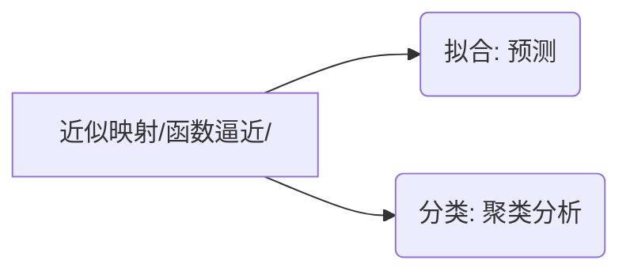

# 插值与拟合

在建模过程中，通常要处理由试验、测量得到的大量数据或一些过于复杂而不便于计算

问题可归结为 ”已知函数在某区间（域）内若干点处的值，求函数在该区间（域）内其它点处的值”，这种问题适宜用插值方法解决。

一定要过的数据点称为插值；尽可能过的数据点称为拟合

## 插值问题

一维插值问题可描述为：已知函数在 $x_0, x_1, \dots, x_n$ 处的值 $y_0, y_1, \dots, y_n$，求简单函数 $p(x)$，使 $p(x_i) = y_i$。

1. 拉格朗日插值法
   
   拉格朗日插值公式指是在节点上给出节点基函数，然后做基函数的线性组合，组合系数为节点函数值的一种插值多项式。
   
   
   
   
   
   拉格朗日
   
   $$
   f(x) = \sum_{i = 0}^k y_i \prod_{j \neq i} \frac{x-x_j}{x_i-x_j}
   $$

2. 高次插值的 Runge 现象
   
   在研究插值问题的初期，所有人都想当然地人为插值多项式的次数越高，插值精度越高
   
   Runge 通过对一个例子的研究发现，上述结论仅仅在插值多项式的次数不超过7时成立；插值多项式的次数超过7时，插值多项式会出现严重的振荡现象，称之为 Runge 现象
   
   
   
   避免 Runge 现象的常用方法是：将插值区间分成若干小区间，在小区间内用低次（二次，三次）插值，即分段低次插值，如样条函数插值。

### MATLAB 代码

一维插值的命令是 `interp1`

其基本格式为 `yi = interp1(x, y, x1, 'method')`

- x, y 为插值点

- xi, yi 为被插值点和插值结果

- 'method' 表示插值方法
  
  - 'nearest': 最邻近插值
  
  - 'linear': 线性插值
  
  - 'spline': 三次样条插值
  
  - 'cubic': 立方插值
  
  - 缺省为线性插值

```matlab
x = 0: 2: 24;
y = [12 9 9 10 18 24 28 27 25 20 18 15 13];
x1 = 13;
y1 = interp1(x, y, x1, 'spline')
xi = 0: 1\3600: 24;
yi = interp1(x, y, xi, 'spline');
plot(x, y, '*', xi, yi)
```

```matlab
function plane
x0 = [0 3 5 7 9 11 12 13 14 15];
y0 = [0 1.2 1.7 2.0 2.1 2.0 1.8 1.2 1.0 1.6];
x = 0: 0.1: 15;
y1 = lagrange(x0, y0, x);
y2 = interp1(x0, y0, x);
y3 = interp1(x0, y0, x, 'spline');
subplot(3, 1, 1);
plot(x0,y0, 'k+', x, y1, 'r');
grid;
title('lagrange');
subplot(3, 1, 2);
plot(x0, y0, 'k+', x, y2, 'r');
grid;
title('piecewise linear');
subplot(3, 1, 3);
plot(x0, y0, 'k+', x, y3, 'r');
grid;
title('spline');

% lagrange 基本过程
function y = lagrange(x0, y0, x)
n = length(x0); m = length(x);
for i = 1: m
    z = x(i);
    s = 0.0;
    for k = 1: n
        p = 1.0;
        for j = 1: n
            if j ~= k
                p = p*(z - x0(j))/(x0(k) - x0(j));
            end
        end
        s = p*y0(k) + s;
    end
    y(i) = s;
end
```

二维插值命令是 `interp2`

基本格式为 `zi = interp2(x, y, z, xi, yi, 'method')`

- x, y, z 为插值点

- z 可以理解为被插值函数在 (x, y) 处的值

- xi, yi 为被插值点

- zi 为输出的插值结果，可理解为插值函数在 (xi, yi) 处的值

- 'method'
  
  - 'nearest': 最邻近插值
  
  - 'linear': 双线性插值 【默认】
  
  - 'spline': 双三次样条插值
  
  - 'cubic': 双立方插值

```matlab
x = 1: 5;
y = 1: 3;
temps = [82 81 80 82 84;79 63 61 65 81;84 84 82 85 86];
figure(1);
mesh(x, y, temps);
xi = 1: 0.2: 5;
yi = 1: 0.2: 3;
zi = interp2(x, y, temps, xi, yi', 'cubic');
figure(2)
mesh(xi, yi, zi);
figure(3);
contour(xi, yi, zi, 20, 'r');
[i, j] = find(zi == min(min(zi)));
x = xi(j), y = yi(i), zmin = zi(i, j)
[i, j] = find(zi == max(max(zi)));
x = xi(j), y = yi(i), zmax = zi(i, j)
```

散乱点插值

前面讨论的插值问题的插值点 (x, y) 均为网格点；当 (x, y) 为散乱点时，可用 `griddata(x, y, z, xi, yi, 'method')` 命令进行二维插值

> 例
> 
> 在某海域测得一些点 (x, y) 处的水深 z 如下表，船的吃水深度为 5 英尺，在矩形区域 (75, 200)*(-50, 150) 内的哪些地方船要避免进入
> 
> 
> 
> ```matlab
> clear
> x = [129 149 103.5 88 185.5 195 105.5 157.5 107.5 77 81 162 162 117.5];
> y = [7.5 141.5 23 147 22.5 137.5 85.5 -6.5 -81 3 56.5 -66.5 84 -33.5];
> z = [-4 -8 -6 -8 -6 -8 -8 -9 -9 -8 -8 -9 -4 -9];
> [xi, yi] = meshgrid(75: 0.5: 200, -70: 0.5: 150);
> zi = griddata(x, y, z, xi, yi, 'cubic');
> figure(1);
> meshz(xi, yi, zi);
> xlabel('X'), ylabel('Y'), zlabel('Z');
> figure(2, contour(xi, yi, zi, [-5, -5], 'b');
> grid;
> hold on;
> plot(x, y, '+');
> xlabel('X'), ylabel('Y'); 
> ```

## 拟合问题

> 例1
> 
> 从1点到12点每隔1小时测量一次温度，测得的温度依次为：5，8，9，15，25，29，31，30，22，25，27，24
> 
> ① 试估计每隔1\10小时的温度值，并做出温度变化图形
> 
> ② 推测 t = 13.5 时的温度

① 典型的插值问题

② 不宜用插值方法，因为13.5已超出所给数据范围，用插值函数外推插值区间外的数据会产生较大的误差

解决此类问题的常用方法是，根据1到12点间的温度数据求出温度与时间之间的近似函数关系 f(t)，由 f(t) 推断 t = 13.5 时的温度

这种根据离散数据求数据间近似函数关系的问题称为曲线拟合文图

> 例2
> 
> 在某化学反应中，根据实验测得生成物浓度 y 与时间 x 的关系如下表，求浓度 y 与时间 x 的对应函数关系 y = f(x)，并据此求出反应速度曲线
> 
> 

典型的拟合问题，求出浓度 y 与时间 x 的函数关系 y = f(x) 后，再求倒数即得反应速度函数。

拟合问题与插值问题的区别在于

- 插值函数过已知点，而拟合函数不一定过已知点；

- 插值主要用于求函数值，而拟合的主要目的是求函数关系，从而进行预测等进一步的分析。

### 拟合计算

曲线拟合需解决如下两个问题

1. 线型的选择
   
   选择的是什么拟合函数

2. 线型中参数的计算
   
   拟合函数里的参数

线型的选择是拟合计算的关键和难点；通常主要根据专业知识和散点图确定线型

线性拟合中参数的计算可采用最小二乘法，而非线性拟合参数的计算则要应用 Gauss-Newton 迭代法

### MATLAB 代码

1. 多项式拟合
   
   命令格式为
   
   `[a, S] = polyfit(x, y, n)`
   
   - x, y: 被拟合数据的自变量和因变量
   
   - n: 拟合多项式的次数
   
   - a: 拟合多项式系数构成的向量
     
     - S: 分析拟合效果所需的指标（可省略）
   
   ```matlab
   x = 1: 12;
   y = [5, 8, 9, 15, 25, 29, 31, 30, 22, 25, 27, 24];
   a = polyfit(x, y, 9)
   xp = 1: 0.1: 12;
   yp = polyval(a, xp);    % a 拟合出来的对应的 xp 对应的 yp
   plot(x, y, '.k', xp, yp, 'r');
   ```

2. 非线性拟合
   
   命令格式为
   
   `[b, r] = polyfit(x, y, fun, b0, option)`
   
   - x, y: 被拟合数据的自变量和因变量
   
   - fun: 拟合函数
   
   - b0: 拟合参数的初始迭代值
   
   - option: 拟合选项
   
   - b: 拟合参数
   
   - r: 拟合残差
   
   ```matlab
   % 例2
   x = 1: 16;
   y = [4.00 6.40 8.00 8.80 9.22 9.50 9.70 9.86 10.00 10.20 10.32 10.42 10.50 10.55 10.58 10.60];
   y1 = @(b, t)b(1)*exp(-t/b(2)) + b(3)*exp(-t/b(4)) + b(5);
   b0 = [-1 1 -1 1 1];
   a = nlinfit(x, y, y1, b0)   % 与 polyfit 等效
   xp = 1: 0.1: 16;
   yp = y1(a, xp);
   plot(x, y, '.k', xp, yp, 'r');
   ```
   
   Out:
   
   
   
   - 为了更好、更便捷地进行拟合，MATLAB 提供了拟合工具箱
     
     - 工具箱的启动
       
       在命令窗口键入 cftool 即可启动拟合工具箱
     
     - 数据的录入
       
       在命令窗口录入自变量 x 和函数 y 的数据，然后在 Data 菜单中即可选中上述数据，并产生 Data sets
       
       此时工具箱会自动画出散点图
     
     - 拟合
       
       点击 Fitting > New fit，可用修改 Fit name，选择 Data sets（自动）和 Type of Fit
     
     
   
   `lsqcurvefit()`
   
   `[x,resnorm] = lsqcurvefit(fun, x0, xdata, ydata)`
   
   `[x,resnorm] = lsqcurvefit(fun, x0, xdata, ydata, lb, ub, options)`
   
   - fun: 符号函数句柄
   
   - x0: 最开始预估的值（预拟合的未知参数的估计值）；即方程系数的预估值
   
   - xdata: 已有的 xdata
   
   - ydata: 与 xdata 对应的 ydata
   
   
   
   ```matlab
   % 已知数据点 xdata = [3.6, 7.7, 9.3, 4.1, 8.6, 2.8, 1.3, 7.9, 10.0, 5.4];
   % ydata = [16, 150.5, 260.1, 22.5, 206.5, 9.9, 2.7, 165.5, 325.0, 54.5];
   xdata=[3.6, 7.7, 9.3, 4.1, 8.6, 2.8, 1.3, 7.9, 10.0, 5.4]; 
   ydata=[16, 150.5, 260.1, 22.5, 206.5, 9.9, 2.7, 165.5, 325.0, 54.5];
   c0=[0 0 0];
   f_h=@(c, x) c(1)*x.^2 + c(2)*x.*sin(x) + c(3)*x.^3;
   [c, resnorm, r]=lsqcurvefit(f_h, c0, xdata, ydata);
   plot(xdata, f_h(c, xdata), xdata, ydata, 'o');
   ```

3. `fittype()` and `fit()`
   
   fittype() 函数可以自定义拟合函数，可以满足线性拟合和非线性拟合；fittype 函数具有很灵活的配置，基本满足各种复杂场景
   
   `fittype(fun, 'independent', 'x', coefficients', {'k', 'r'})`
   
   - fun: 自定义函数
   
   - independent: 自变量
   
   - coefficient: 未知量
   
   - dependent: 
   
   `fit(x, y, fittype, 'startpoint', [0 0])`
   
   ```matlab
   x=[1.57079632700000 1.43965228700000 1.30438927000000 1.20635412600000 1.11818009200000 1.04588855400000 ...
   0.979758029000000 0.921411672000000 0.839101944000000 0.765449050000000 0.688846549000000 0.573462832000000 ...
   0.456141800000000 0.349921062000000 0.251816104000000 0.153777470000000 0.0522726110000000 0 ...
   -0.0522726110000000 -0.153777470000000 -0.251816104000000 -0.349921062000000 -0.456141800000000 ...
   -0.573462832000000 -0.688846549000000 -0.765449050000000 -0.839101944000000 -0.921411672000000 ...
   -0.979758029000000 -1.04588855400000 -1.11818009200000 -1.20635412600000 -1.30438927000000 ...
   -1.43965228700000 -1.57079632700000]';
   y=[0 0.0466150000000000 0.148860000000000 0.257980000000000 0.376420000000000 0.502290000000000 ...
   0.626270000000000 0.729550000000000 0.821830000000000 0.880210000000000 0.927810000000000 0.974550000000000 ...
   0.993000000000000 0.992290000000000 0.974820000000000 0.950290000000000 0.922520000000000 0.914770000000000 ...
   0.922520000000000 0.950290000000000 0.974820000000000 0.992290000000000 0.993000000000000 0.974550000000000 ...
   0.927810000000000 0.880210000000000 0.821830000000000 0.729550000000000 0.626270000000000 0.502290000000000 ...
   0.376420000000000 0.257980000000000 0.148860000000000 0.0466150000000000 0]';
   syms t
   
   f=fittype('(c0+c1*t+c2*t^2+c3*t^3+c4*t^4)*cos(t)', 'independent', 't', 'coefficients', {'c0','c1','c2','c3','c4'});
   cfun=fit(x, y, f) %显示拟合函数，数据必须为列向量形式
   xi=-pi/2: 0.1*pi: pi/2;
   yi=cfun(xi);
   plot(xi, yi, 'b-', x, y, 'g*');
   title('拟合函数图形');
   ```
   
   ```matlab
   % 线性拟合
   x=[0.2, 0.5, 0.8, 1.1, 1.2, 1.5, 1.8, 2];
   y=[2.35, 1.38, 0.81, 0.62, 0.78, 1.43, 2.25, 3.18];
   ex= {'x^2', 'sin(x)', '1'};
   ft=fittype(ex);
   fo=fit(x', y', ft);
   plot(x, fo(x), x, y, 'o');
   ```
   
   ```matlab
   % 非线性拟合
   x=[0.2, 0.5, 0.8, 1.1, 1.2, 1.5, 1.8, 2];
   y=[2.35, 1.38, 0.81, 0.62, 0.78, 1.43, 2.25, 3.18];
   ex= {'x^2', 'sin(x)', '1'};
   ft=fittype('a*x^2+b*sin(x)+c', 'independent', 'x');
   fo=fit(x', y', ft);
   plot(x, fo(x), x, y, 'o');
   ```

# 线性规划

## 线性规划问题

在人们的生产实践中，经常会遇到如何利用现有资源来安排生产，以取得最大经济效益的问题。此类问题构成了运筹学的一个重要分支---数学规划，而**线性规划 (Linear Programming 简记 LP)** 则是数学规划的一个重要分支。

> 
> 
> 上述问题的数学模型：设该厂生产 $x_1$ 台甲机床和 $x_2$ 台乙机床时总利润 $z$ 最大，则 $x_1, x_2$ 应满足
> 
> $$
> \max \quad z = 4x_1 + 3x_2 \quad (1.1)\\
\begin{cases}
2x_1 + x_2 \le 10 \\
x_1 + x_2 \le 8 \\
x_2 \le 7 \\
x_1,x_2 \ge 0
\end{cases} \quad (1.2)
> $$
> 
> 变量 $x_1, x_2$ 称之为**决策变量**，$(1.1)$ 式被称为问题的**目标函数**，$(1.2)$ 中的几个不等式是问题的约束条件，记为 $s.t.$ 即 subject to

目标函数及约束条件均为线性函数，故被称为线性规划问题。线性规划问题是在一组线性约束条件的限制下，求一线性目标函数最大或最小的问题。

在解决实际问题时，把问题归结成一个线性规划数学模型是很重要的一步，往往也是很困难的一步，模型建立得是否恰当，直接影响到求解。而选适当的决策变量，是我们建立有效模型的关键之一。

## 一般线性规划（数学）标准型

$$
\max \quad z = \sum_{j=1}^n c_j x_j \quad (1.3) \\
s.t. \begin{cases}
\sum_{j=1}^n a_{ij} x_j = b_i \quad i = 1, 2, \cdots , m \\
x_j \ge 0 \quad j = 1, 2, \cdots , n
\end{cases} \quad (1.4)
$$

**可行解** 满足约束条件 $(1.4)$ 的解 $x = [x_1,L,x_n]^T$ ，称为线性规划问题的可行解，而使目标函数 $(1.3)$ 达到最大值的可行解叫最优解

**可行域** 所有可行解构成的集合称为问题的可行域，记为 $R$

## MATLAB 标准形式

线性规划的目标函数可以是求最大值，也可以是求最小值，约束条件的不等号可以是小于号也可以是大于号。为了避免这种形式多样性带来的不便，MATLAB 中规定线性规划的标准形式为

$$
\min \quad c^Tx \\
s,t, \begin{cases}
Ax \le b \\
Aeq \cdot x = beq \\
lb \le x \le ub
\end{cases}
$$

其中 $c,x,b,beq,lb,ub$ 为列向量，$c$ 称为价值向量，$b$ 称为资源向量，$A,Aeq$ 为矩阵

**MATLAB 中求解线性规划的命令为**

```matlab
[x,fval] = linprog(c,A,b)
[x,fval] = linprog(c,A,b,Aeq,beq)
[x,fval] = linprog(c,A,b,Aeq,beq,lb,ub)
```

其中 **x** 返回的是决策变量的取值，**fval** 返回的是目标函数的最优值，**c** 为价值向量，**A，b** 对应的是线性不等式约束，**Aeq，beq** 对应的是线性等式约束，**lb** 和 **ub** 分别对应的是决策向量的下界向量和上界向量

> 例
> 
> 求解下列线性规划问题
> 
> $$
> \max \quad z = 2x_1 + 3x_2 -5x_3 \\
s.t. \quad x_1 + x_2 + x_3 = 7 \\
\qquad \quad 2x_1 - 5x_2 + x_3 \ge 10 \\
\qquad  x_1 + 3x_2 + x_3 \le 12 \\
\qquad x_1, x_2, x_3 \ge 0
> $$
> 
> ```matlab
> f = [-2; -3; 5];
> a = [-2, 5, -1; 1, 3, 1]; b = [-10; 12];
> aeq = [1, 1, 1];
> beq = 7;
> [x,y] = linprog(f, a, b, aeq, beq, zeros(3,1));
> x,y = -y
> ```

## 案例: 投资的收益和风险

### 问题提出

市场上有 $n$ 种资产 $s_i(i = 1,2,L,n)$ 可以选择，现用数额为 $M$ 的相当大的资金作一个时期的投资。这 $n$ 种资产在这一时期内购买 $s_i$ 的平均收益率为 $r_i$，风险损失率为 $q_i$，投资越分散，总的风险越少，总体风险可用投资的 $s_i$ 种最大的一个风险来度量。

购买 $s_i$ 时要付交易费，费率为 $p_i$，当购买额不超过给定值 $u_i$ 时，交易费按购买 $u_i$ 计算。另外，假定同期银行存款利率是 $r_0$，既无交易费又无风险$(r_0 = 5\% )$。

已知 $n = 4$ 时相关数据如表

| $s_i$ | $r_i(\%)$ | $q_i(\%)$ | $p_i(\%)$ | $u_i(元)$ |
|:-----:|:---------:|:---------:|:---------:|:--------:|
| $s_1$ | 28        | 2.5       | 1         | 103      |
| $s_2$ | 21        | 1.5       | 2         | 198      |
| $s_3$ | 23        | 5.5       | 4.5       | 52       |
| $s_4$ | 25        | 2.6       | 6.5       | 40       |

试给该公司设计一种投资组合方案，即用给定资金 $M$，有选择地购买若干种资产或存银行生息，使净收益尽可能大，使总体风险尽可能小。

### 符号规定和基本假设

- **符号规定**
  
  $s_i$ 表示第 $i$ 种投资项目，如股票，债券等，$i = 0,1,L,n$，其中 $s_0$ 指存入银行；
  
  $r_i,p_i,q_i$ 分别表示 $s_i$ 的平均收益率，交易费率，风险损失率，$i = 0,L,n$，其中 $p_0 = 0,q_0 = 0$；
  
  $u_i$ 表示 $s_i$ 的交易定额，$i = 1,L,n$；
  
  $x_i$ 表示投资项目 $s_i$ 的资金，$i = 0,1,L,n$；
  
  $a$ 表示投资风险度；
  
  $Q$ 表示总体收益；

- **基本假设**
  
  1. 投资数额 $M$ 相当大为了便于计算, 假设 $M = 1$;
  
  2. 投资越分散, 总的风险越小;
  
  3. 总体风险用投资项目 $s_i$ 种最大的一个风险来度量;
  
  4. $n+1$ 种资产 $s_i$ 之间是相互独立的;
  
  5. 在投资的这一时期内, $r_i,p_i,q_i$ 为定值, 不受意外因素影响;
  
  6. 净收益和总体风险只受 $r_i,p_i,q_i$ 影响,不受其他因素干扰.

### 模型的分析与建立

1. 总体风险用所投资的 $s_i$ 中最大的一个风险来衡量,即
   
   $$
   \max \quad \begin{Bmatrix}q_ix_i|i = 1,2,L,n\end{Bmatrix}
   $$

2. 购买 $s_i(i = 1,L,n)$ 所付交易费是一个分段函数,即
   
   $$
   交易费 = \begin{cases}
p_ix_i, \quad x_i > u_i \\
p_iu_i, \quad x_i \le u_i \\
\end{cases}
   $$
   
   而题目所给的定值 $u_i$ (单位: 元) 相对总投资 $M$ 很少, $p_iu_i$ 更小, 这样购买 $s_i$ 的净收益可以简化为 $(r_i-p_i)x_i$ .

3. 要使净收益尽可能大, 总体风险尽可能小, 这是一个多目标规划模型.

> **目标函数为**
> 
> $$
> \begin{cases}
\max \quad \sum_{i = 0}^n (r_i - p_i)x_i \\
\min \quad \max \begin{Bmatrix} q_ix_i \end{Bmatrix}
\end{cases}
> $$
> 
> **约束条件为**
> 
> $$
> \begin{cases}
\sum_{i = 0}^n (1 + p_i)x_i = M \\
x_i \ge 0, \quad i = 0,1, \cdots ,n
\end{cases}
> $$

**模型一: 固定风险水平, 优化收益**

在实际投资中, 投资者承受风险的程度不一样, 若给定风险一个界限 $a$ , 使最大的一个风险 $\frac{q_ix_i}{M} \le a$ , 可找到相应的投资方案, 这样把多目标规划变成一个目标的线性规划.

$$
\max \sum_{i = 0}^n (r_i - p_i)x_i \\
s.t. \begin{cases}
\frac{q_ix_i}{M} \le a \\
\sum_{i = 0}^n (1 + p_i)x_i = M, \quad x_i \ge 0, \quad i = 0,1, \cdots,n
\end{cases}
$$

**模式二: 固定盈利水平, 极小化风险**

$$
\min \begin{Bmatrix} \max \begin{Bmatrix} q_ix_i \end{Bmatrix} \end{Bmatrix} \\
s.t. \begin{cases}
\sum_{i = 0}^n (r_i - p_i)x_i \ge k \\
\sum_{i = 0}^n (1 + p_i)x_i = M, \quad x_i \ge 0, \quad i = 0,1,\cdots , n
\end{cases}
$$

**模式三:**

投资者在权衡资产风险和预期收益两方面时, 希望选择一个令自己满意的投资组合. 因此对风险、收益分别赋予权重 s(0

$$
\min \quad s \begin{Bmatrix} \max \begin{Bmatrix} q_ix_i \end{Bmatrix} \end{Bmatrix} - (1 - s) \sum_{i = 0}^n (r_i - p_i)x_i \\
s.t. \sum_{i = 0}^n (1 + p_i)x_i = M, \quad x_i \ge 0, \quad i = 0,1,2, \cdots , n
$$

### 模型一的求解

$$
\min \quad f = (-0.05,-0.27,-0.19,-0.185,-0.185)(x_0,x_1,x_2,x_3,x_4)^T \\
s.t. \begin{cases}
x_0 + 1.01x_1 + 1.02x_2 + 1.045x_3 + 1.065x_4 = 1 \\
0.025x_1 \le \alpha \\
0.015x_2 \le \alpha \\
0.055x_3 \le \alpha \\
0.026x_4 \le \alpha \\
x_i \ge 0 \quad (i = 0,1,\cdots , 4)
\end{cases}
$$

由于 $\alpha$ 是任意给定的风险度, 到底怎样没有一个准则, 不同的投资者有不同的风险度. 我们从 $\alpha = 0$ 开始, 以步长 $\Delta \alpha = 0.001$ 进行循环搜索, 程序如下

```matlab
clc,clear
a = 0; hold on
while a < 0.05
    c = [-0.05, -0.27, -0.19, -0.185, -0.185];
    A = [zeros(4,1), diag([0.025, 0.015, 0.055, 0.026])];
    b = a*ones(4,1);
    Aeq = [1, 1.01, 1.02, 1.045, 1.065];
    beq = 1; LB = zeros(5,1);
    [x,Q] = linprog(c, A, b, Aeq, beq, LB);
    Q = -Q; plot(a, Q, '*k');
    a = a + 0.001;
end
xlabel('a'),ylabel('Q')
```

由图看出

1. 风险大，收益也大

2. 当投资越分散时，投资者承担的风险越小，这与题意一致。冒险的投资者会出现集中投资的情况，保守的投资者则尽量分散投资

3. 在 $\alpha = 0.006$ 附近有一个转折点，在这一点左边，风险增加很少时，利润增长很快。在这一点右边，风险增加很大时，利润增长很缓慢，所以对于风险和收益没有特殊偏好的投资者来说，应该选择曲线的转折点作为最优投资组合，大约是 $\alpha = 0.6\%, Q = 20\%$，所对应投资方案为风险度 $\alpha = 0.006$，收益 $Q = 0.2019, x_0 = 0, x_1 = 0.24, x_2 = 0.4, x_3 = 0.1091, x_4 = 0.2212$

# 整数规划

## 整数规划问题

1. **整数规划模型 (IP)**
   
   数学规划中的变量（部分或全部）限制为整数时，称为整数规划。若在线性规划模型中，变量限制为整数，则称为整数线性规划。目前所流行的求解整数规划的方法，往往只适用于整数线性规划。目前还没有一种方法能有效地求解一切整数规划。

2. **整数规划分类**
   
   - 变量全限制为整数时，称纯（完全）整数规划
   
   - 变量部分限制为整数的，称混合整数规划

3. **整数规划特点**
   
   - 原线性规划有最优解，当自变量限制为整数后，其整数规划解出现下述情况
     
     - 原线性规划最优解全是整数，则整数规划最优解与线性规划最优解一致
     
     - 整数规划无可行解
     
     - 有可行解（当然就存在最优解），但最优解变差
   
   - 整数规划最优解不能按照实数最优解简单取整而获得

> 例
> 
> 合理下料问题
> 
> 设用某型号的圆钢下零件 $A_1, A_2, \dots, A_m$ 的毛坯。在一根圆钢上下料的方式有 $B_1, B_2, \dots, B_n$ 种，每种下料方式可以得到各种零件的毛坯数以及每种零件的需要量，如表所示。问怎样安排下料方式，使得即满足需要，所有的原材料又最少？
> 
> 解：设 $x_j$ 表示用 $B_j(j = 1, 2, \dots, n)$ 种方式下料的根数
> 
> 
> 
> $$
> \min \quad Z = \sum_{j=1}^n x_j \\
\quad \\
s.t. \quad
\sum_{j = 1}^n a_{ij}x_j \ge b_i \quad i = 1, 2, \dots, m \\
\qquad \qquad x_j \ge 0 \quad j = 1, 2, dots, n 且为整数
> $$

> 例
> 
> 建厂问题
> 
> 某公司计划在 $m$ 个地点建厂，可供选择的地点有 $A_1, A_2, \dots, A_m$，他们的生产能力分别是 $a_1, a_2, \dots, a_m$（假设生产同一产品）。$i$ 个工厂的建设费用为 $f_i(i = 1, 2, \dots, m)$，又有 $n$ 个地点 $B_1, B_2, \dots, B_n$ 需要销售这种产品，其销量分别为 $b_1, b_2, \dots, b_n$。从工厂运往销地的单位运费为 $C_{ij}$。试决定应在哪些地方建厂，即满足各地需要，又使总建设费用和总运输费用最省？
> 
> 
> 
> 

## 一般数学模型

$$
\max(\min) \quad z = \sum_{j = 1}^n c_j x_j \\
s.t. \quad \sum_{j = 1}^n a_{ij}x_j \le (=, \ge) b_i \quad i = 1, 2, \dots, m \\
\qquad \qquad x_j \ge 0, x_j 为整数 \quad j = 1, 2, \dots, n
$$

依照决策变量取整要求的不同，整数规划可分为

- 纯整数规划
  
  所有决策变量要求取非负整数（这时引进的松弛变量和剩余变量可以不要求取整数）

- 全整数规划
  
  除了所有决策变量要求取非负整数外，系数 $a_{ij}$ 和常数 $b_i$ 也要求取整数（这时引进的松弛变量和剩余变量也必须是整数）

- 混合整数规划
  
  只有一部分的决策变量要求取非负整数，另一部分可以取非负实数

- 0-1 整数规划
  
  所有决策变量只能取0或1两个整数

## 求解整数规划

例

$$
\max z = x_1 + x_2 \\
\begin{cases}
14x_1 +9x_2 \le 51 \\
-6x_1 + 3x_2 \le 1 \\
x_1, x_2 \ge 0 \quad 且为整数
\end{cases}
$$

首先不考虑整数约束，得到线性规划问题（一般称为松弛问题或伴随问题）

$$
\max z = x_1 + x_2 \\
\begin{cases}
14x_1 +9x_2 \le 51 \\
-6x_1 + 3x_2 \le 1 \\
x_1, x_2 \ge 0
\end{cases}
$$

利用图解法求出最优解 $x_1 = 3/2, x_2 = 10/3$ 且有 $Z = 29/6$


目前，常用的求解整数规划的方法有：分枝定界法和割平面法；对于特别的0-1规划问题采用隐枚举法和匈牙利法

### 分枝定界法

不考虑整数限制先求出相应松弛问题的最优解，

若松弛问题无可行解，则 ILP 无可行解；

若求得的松弛问题最优解符合整数要求，则是 ILP 的最优解；

若不满足整数条件，则任选一个不满足整数条件的变量 $x_i^0$ 来构造新的约束添加到松弛问题中形成两个子问题，即将决策变量的值向上以及向下取整：

$$
x_i \le [x_i^0], x_i \ge [x_i^0] + 1
$$

依次在缩小的可行域中求解新构造的线性规划的最优解，并重复上述过程，直到子问题无解或有整数最优解

> 例
> 
> $$
> \max z = 3x_1 + 2x_2 \\
\quad \\
\begin{cases}
2x_1 + 3x_2 \le 4 \\
2x_1 + x_2 \le 24 \\
x_1, x_2 \ge 0, 且为整数
\end{cases}
> $$
> 
> 首先求出松弛问题的解为 $x_1 = 3.25, x_2 = 2.5, z = 14.75$
> 
> - $x_1$ 往下取整
>   
>   $$
>   \max z = 3x_1 + 2x_2 \\
\quad \\
\begin{cases}
2x_1 + 3x_2 \le 4 \\
2x_1 + x_2 \le 24 \\
x_1 \le 3 \\
x_1, x_2 \ge 0, 且为整数
\end{cases}
>   $$
>   
>   解得 $x_1 = 3, x_2 = 2.67, z = 14.33$；$x_2$ 不满足条件
> 
> - $x_1$ 往下取整，$x_2$ 往下取整
>   
>   $$
>   \max z = 3x_1 + 2x_2 \\
\quad \\
\begin{cases}
2x_1 + 3x_2 \le 4 \\
2x_1 + x_2 \le 24 \\
x_1 \le 3, x_2 \le 2 \\
x_1, x_2 \ge 0, 且为整数
\end{cases}
>   $$
>   
>   解得 $x_1 = 3, x_2 = 2, z = 13$
> 
> - $x_1$ 往下取整，$x_2$ 往上取整
>   
>   $$
>   \max z = 3x_1 + 2x_2 \\
\quad \\
\begin{cases}
2x_1 + 3x_2 \le 4 \\
2x_1 + x_2 \le 24 \\
x_1 \le 3, x_2 \ge 3\\
x_1, x_2 \ge 0, 且为整数
\end{cases}
>   $$
>   
>   解得 $x_1 = 2.2, x_2 = 3, z = 13.5$
> 
> - $x_1$ 往上取整
>   
>   $$
>   \max z = 3x_1 + 2x_2 \\
\quad \\
\begin{cases}
2x_1 + 3x_2 \le 4 \\
2x_1 + x_2 \le 24 \\
x_1 \ge 4 \\
x_1, x_2 \ge 0, 且为整数
\end{cases}
>   $$
>   
>   解得 $x_1 = 4, x_2 = 1, z = 14$
> 
> 通过比较 $x_1$ 往上取整时有最优解

**MATLAB 代码**

`[x, fval, status] = intprog(f, A, B, I, Aeq, Beq, lb, ub, e)`

- f: 目标函数向量

- A, B: 不等式约束

- Aeq, Beq: 等式约束

- I: 整数约束

- lb, ub: 变量下界与上界

- e: 误差

> 例
> 
> $$
> \max \quad 20x_1 + 10x_2 \\
\quad \\
s.t. \quad
5x_1 + 4x_2 \le 24 \\
\qquad \quad 2x_1 + 5x_2 \le 13 \\
\quad \qquad \qquad x_1, x_2 \ge 0, 且为整数\\
> $$
> 
> ```matlab
> f = [-20 -10];
> A = [5 4; 2 5];
> b = [24 13];
> lb = [0 0];
> [x, fval, status] = intprog(f, A, b, [1, 2], [], [], lb)
> ```

```matlab
function [newx, newfval, status, newbound] = branchbound(f, A, B, I, x, fval, bound, Aeq, Beq, lb, ub, e)
% f, A, B, Aeq, Beq, lb, ub 与线性规划相同
% I 为整数限制变量的向量
% x 为初始解，fval 为初始值
```

### 割平面法

# 非线性规划

## 非线性规划问题

**非线性规划模型 (NP)**

如果目标函数或约束条件中包含非线性函数，就称这种规划问题为非线性规划问题

一般来说，解非线性规划要比解线性规划问题困难得多；而且，也不像线性规划有单纯形法这一通用方法，非线性规划目前还没有适于各种问题的一般算法，各个方法都有自己特定的适用范围

> 例
> 
> 投资决策问题
> 
> 某企业有 $n$ 个项目可供选择投资，并且至少要对其中一个项目投资。已知该企业拥有总资金 $A$ 元，投资于第 $i,i = 1, 2, \dots, n$ 个项目需花资金 $a_i$ 元，并预计可收益 $b_i$ 元。试选择最佳投资方案。
> 
> 解：设投资决策变量为
> 
> $$
> x_i =
\begin{cases}
1 \quad 决定会投资第 i 个项目 \\
0 \quad 决定不会投资第 i 个项目
\end{cases}
> $$
> 
> 则投资总额为 $\sum_{i = 1}^n a_ix_i$，投资总收益为 $\sum_{i = 1}^n b_ix_i$
> 
> 因为该公司至少要对一个项目投资，并且总的投资金额不能超过总资金 $A$，故有限制条件
> 
> $$
> 0 < \sum_{i = 1}^n a_ix_i \le A
> $$
> 
> 另外由于 $x_i$ 只能取0或1，所以还有
> 
> $$
> x_i(1-x_i) = 0, \quad i = 1, 2, \dots, n
> $$
> 
> 最佳投资方案应是投资额最小而总收益最大的方案，所以这个最佳投资决策问题归结为总资金以及决策变量（取0或1）的限制条件下，极大化总收益和总投资之比。因此，其数学模型为
> 
> $$
> \max = \frac{\sum_{i = 1}^n b_ix_i}{\sum_{i = 1}^n a_ix_i} \\
s.t. =
\begin{cases}
0 < \sum_{i = 1}^n a_ix_i \le A \\
x_i(1-x_i) = 0, \quad i = 1, 2, \dots, n
\end{cases}
> $$

## 数学模型

一般形式

$$
\min \quad f(x) \\
s.t.
\begin{cases}
h_j(x) \le 0 \quad j = 1, 2, \dots, q \\
g_i(x) = 0 \quad i = 1, 2, \dots, p
\end{cases}
$$

在一组等式或不等式的约束下，求一个函数的最大值（或最小值）问题，其中至少有一个非线性函数，这类问题称之为非线性规划问题

## MATLAB 标准形式

$$
\min \quad f(x) \\
s.t.
\begin{cases}
A \cdot x \le b \\
Aeq \cdot x = beq \\
c(x) \le 0 \\
ceq(x) = 0 \\
lb \le x \le ub
\end{cases}
$$

其中 $f(x)$ 是标量函数，$A, b, Aeq, beq, lb, ub$ 是相应维数的矩阵和向量，$c(x), ceq(x)$ 是非线性向量函数

**命令代码**为

`[x, fval] = fmincon('fun', x0, A, b, Aeq, beq, lb, ub, 'nonlcon', options)`

- x: 的返回值是决策变量 x 的取值

- fval: 目标函数的取值

- fun: 用 M 文件定义的函数

- x0: x 的初始值

- A, b, Aeq, beq: 定义了线性约束 $Ax \le b, Aeq \cdot x = beq$ ，如果没有线性约束，则 $A = [], b = [], Aeq = [], beq = []$

- lb, ub: 变量 x 的下界和上界，如果上界和下界没有约束，即 x 无下界也无上界，则 $lb = [], ub = []$，也可以写成 lb 的各分量都为 -inf，ub 的各分量都为 inf

- nonlcon: 用 M 文件定义的非线性向量函数 $c(x), ceq(x)$

- options: 定义了优化参数，可以使用 MATLAB 缺省的参数设置

> 例
> 
> $$
> \min \quad f(x) = x_1^2 + x_2^2 + x_3^2 +8 \\
\quad \\
s.t.
\begin{cases}
x_1^2 - x_2 + x_3^2 \ge 0 \\
x_1 + x_2^2 + x_3^2 \le 20 \\
-x_1 -x_2^2 + 2 = 0 \\
x_2 + 2x_3^2 = 3 \\
x_1, x_2, x_3 \ge 0
\end{cases}
> $$
> 
> ```matlab
> % 编写 M 函数 fun1.m 定义目标函数
> function f = fun1(x);
> f = sum(x .^ 2) + 8;
> 
> % 编写 M 函数 fun2.m 定义非线性约束条件
> function [g, h] = fun2(x);
> % 非线性不等式约束
> g = [-x(1)^2 + x(2) - x(3)^2
> x(1) + X(2)^2 + X(3)^3 - 20];
> % 非线性等式约束
> h = [-x(1) - x(2)^1 + 2
> x(2) + 2*x(3)^2 - 3];
> 
> % 编写主程序文件
> [x, y] = fmincon('fun1', rand(3, 1), [], [], [], [], zeros(3, 1), [], 'fun2')
> ```
> 
> Out:
> 
> $x_1 = 0.5522, x_2 = 1.2033, x_3 = 0.9478; y = 10.6511$

### 二次规划

若某非线性规划的目标函数为自变量的二次函数，约束条件又全是线性的，就称这种规划为二次规划

**标准形式**

$$
\min \quad \frac{1}{2} x^T Hx + f^T x \\
s.t.
\begin{cases}
Ax \le b \\
Aeq \cdot x = beq \\
lb \le x \le ub
\end{cases}
$$

- H: 实对称矩阵

- f, b, beq, lb, ub: 是列向量

- A, Aeq: 相应维数的矩阵

**命令代码**

`[x, fval] = quadprog(H, f, A, b, Aeq, beq, lb, ub, x0, options)`

- x: 决策向量 x 的值

- fval: 目标函数在 x 处的值

> 例
> 
> $$
> \min \quad f(x) = 2x_1^2 - 4x_1x_2 + 4x_2^2 - 6x_1 - 3x_2 \\
\quad \\
s.t.
\begin{cases}
x_1 + x_2 \le 3 \\
4x_1 + x_2 \le 9 \\
x_1, x_2 \ge 0
\end{cases}
> $$
> 
> ```matlab
> h = [4, -4; -4, 8];
> f = [-6; -3];
> a = [1, 1; 4, 1];
> b = [3; 9];
> [x, value] = quadprog(h, f, a, b, [], [], zeros(2, 1))
> ```
> 
> Out:
> 
> $x_1 = 1.9500, x_2 = 1.0500; \min f(x) = -11.0250$

## 案例: 供应与选址

某公司有6个建筑工地要开工，每个工地的位置（用平面坐标系 $a, b$ 表示，距离单位：千米）及水泥日用量 $d$（吨）由下表给出。目前有两个临时料场位于$A(5, 1), B(2, 7)$，日储量各有20吨。假设从料场到工地之间均有直线道路相连。

（1）试制定每天的供应计划，即从 $A, B$ 两料场分别向各工地运送多少吨水泥，使总的吨千米数最小；

（2）为了进一步减少吨千米数，打算舍弃两个临时料场，改建两个新的，日储量各为20吨，问应建在何处，节省的吨千米数有多大？

 

解：记工地的位置为 $(ai, bi)$，水泥日用量为 $di, i = 1, \dots, 6$；料场位置为 $(xj, yj)$，日储量为 $e_j, j = 1, 2$；从料场 $j$ 向工地 $i$ 的运送量为 $X_{ij}$

则

$$
\min \quad f = \sum_{j=1}^2 \sum_{i=1}^6 X_{ij} \sqrt{(x_j - a_i)^2 + (y_j - b_i)^2} \\
\quad \\
s.t. \quad
\begin{cases}
\sum_{j = 1}^2 X_{ij} = d_i, \quad i = 1, 2, \dots, 6 \\
\sum_{i = 1}^6 X_{ij} \le e_j, \quad j = 1, 2 \\
\end{cases}
$$

1. 当用临时料场时决策变量为：$X_{ij}$
   
   使用两个临时料场 $A(5, 1), B(2, 7)$，求从料场 $j$ 向工地 $i$ 的运送量为 $X_{ij}$，在各工地用量必须满足和各料场运送量不超过日储量的条件下，使总的吨千米数最小，这是线性规划问题，线性模型为
   
   $$
   \min \quad f = \sum_{j=1}^2 \sum_{i=1}^6 aa(i, j)X_{ij} \\
\quad \\
s.t. \quad
\begin{cases}
\sum_{j = 1}^2 X_{ij} = d_i, \quad i = 1, 2, \dots, 6 \\
\sum_{i = 1}^6 X_{ij} \le e_j, \quad j = 1, 2 \\
\end{cases}
   $$
   
   其中 $aa(i, j) = \sqrt{(x_j - a_i)^2 + (y_j - b_i)^2}, i = 1, 2, \dots, 6;j = 1, 2$ 为常数
   
   设 $X_{11} = X_1, X_{21} = X_2, X_{31} = X_3, X_{41} = X_4, X_{51} = X_5, X_{61} = X_6$，
   
   $X_{12} = X_7, X_{22} = X_8, X_{32} = X_9, X_{42} = X_{10}, X_{52} = X_{11}, X_{62} = X_{12}$
   
   ```matlab
   clear
   a = [1.25 8.75 0.5 5.75 3 7.25];
   b = [1.25 0.75 4.75 5 6.5 7.75];
   d = [3 5 4 7 6 11];
   x = [5 2];
   y = [1 7];
   e = [20 20];
   
   for i = 1: 6
       for j = 1: 2
           aa(i, j) = sqrt((x(j) - a(i))^2 + (y(j) - b(i))^2);
       end
   end
   CC = [aa(:, 1); aa(:, 2)]';
   A = [1 1 1 1 1 1 0 0 0 0 0 0; 0 0 0 0 0 0 1 1 1 1 1 1];
   B = [20; 20];
   Aeq = [1 0 0 0 0 0 1 0 0 0 0 0
   0 1 0 0 0 0 0 1 0 0 0 0
   0 0 1 0 0 0 0 0 1 0 0 0
   0 0 0 1 0 0 0 0 0 1 0 0
   0 0 0 0 1 0 0 0 0 0 1 0
   0 0 0 0 0 1 0 0 0 0 0 1];
   beq = [d(1); d(2); d(3); d(4); d(5); d(6)];
   VLB = [0 0 0 0 0 0 0 0 0 0 0 0]; VUB = [];
   x0 = [1 2 3 0 1 0 0 1 0 1 0 1];
   [xx, fval] = linprog(CC, A, B, Aeq, beq, VLB, VUB, x0)
   ```
   
   Out:
   
   x = [3.0000 5.0000 0.0000 7.0000 0.0000 1.0000 0.0000 0.0000 4.0000 0.0000 6.0000 10.0000]'
   fval = 136.2275
   
   

2. 当不用临时料场时决策变量为：$X_{ij}, x_j, y_j$
   
   改建两个新料场，要同时确定料场的位置 $(x_j, y_j)$ 和运送量 $X_{ij}$，在同样条件下使总吨千米数最小。这是非线性规划问题。非线性规划模型为
   
   $$
   \min \quad f = \sum_{j=1}^2 \sum_{i=1}^6 X_{ij} \sqrt{(x_j - a_i)^2 + (y_j - b_i)^2} \\
\quad \\
s.t. \quad
\begin{cases}
\sum_{j = 1}^2 X_{ij} = d_i, \quad i = 1, 2, \dots, 6 \\
\sum_{i = 1}^6 X_{ij} \le e_j, \quad j = 1, 2 \\
\end{cases}
   $$
   
   设 $X_{11} = X_1, X_{21} = X_2, X_{31} = X_3, X_{41} = X_4, X_{51} = X_5, X_{61} = X_6$
   
   $X_{12} = X_7, X_{22} = X_8, X_{32} = X_9, X_{42} = X_{10}, X_{52} = X_{11}, X_{62} = X_{12}$
   
   $x_1 = X_{13}, y_1 = X_{14}, x_2 = X_{15}, y_2 = X_{16}$
   
   ① 先编写 M 文件 liaoch.m 定义目标函数
   
   ② 取初值为线性规划的计算结果及临时料场的坐标: `x0 = [3 4 0 7 0 1 0 0 4 0 6 10 5 1 2 7]'`
   
   ③ 编写主程序 gying2.m
   
   ```matlab
   function f = liaoch(x)
   a = [1.25 8.75 0.5 5.75 3 7.25];
   b = [1.25 0.75 4.75 5 6.5 7.75];
   d = [3 5 4 7 6 11];
   e = [20 20];
   f1 = 0;
   for i = 1: 6
       s(i) = sqrt((x(13) - a(i))^2 + (x(14) - b(i))^2);
       f1 = s(i)*x(i) = f1;
   end
   f2 = 0;
   for i = 7: 12
       s(i) = sqrt((x(15) - a(i-6))^2 + (x(16) - b(i-6))^2);
       f2 = s(i)*x(i) + f2;
   end
   f = f1 + f2;
   
   % gying2.m
   clear
   % x0 = [3 5 0 7 0 1 0 0 4 0 6 10 5 1 2 7]';
   % x0 = [3.0000 5.0000 0.0707 7.0000 0 0.9293 0 0 3.9293 0 6.0000 10.0707 6.3875 4.3943 5.7511 7.1867]';
   % x0 = [3.0000 5.0000 0.3094 7.0000 0.0108 0.6798 0 0 3.6906 0 5.9892 10.3202 5.5369 4.9194 5.8291 7.2852]';
   x0 = [3 5 4 7 1 0 0 0 0 0 5 11 5.6348 4.8687 7.2479 7.7499]';
   A = [1 1 1 1 1 1 0 0 0 0 0 0 0 0 0 0 0 0 0 0 0 0 1 1 1 1 1 1 0 0 0 0];
   B = [20; 20];
   Aeq = [1 0 0 0 0 0 1 0 0 0 0 0 0 0 0 0
   0 1 0 0 0 0 0 1 0 0 0 0 0 0 0 0
   0 0 1 0 0 0 0 0 1 0 0 0 0 0 0 0
   0 0 0 1 0 0 0 0 0 1 0 0 0 0 0 0
   0 0 0 0 1 0 0 0 0 0 1 0 0 0 0 0
   0 0 0 0 0 1 0 0 0 0 0 1 0 0 0 0];
   beq = [3 5 4 7 6 11]';
   vlb = [zeros(12, 1); -inf; -inf; -inf; -inf];
   vub = [];
   [x, fval, exitflag] fmincon('liaoch', x0, A, B, Aeq, beq, vlb, vub)
   ```
   
   Out:
   
   x = [3.0000 5.0000 0.0707 7.0000 0 0.9293 0 0 3.9293 0 6.0000 10.0707 6.3875 4.3943 5.7511 7.1867]'
   fval = 105.4626
   exitflag = 1
   
   

# 微分方程

## 基本概念

微分方程指的是含有未知函数及其导数的方程


**常微分方程（ODE）** 指仅含有一个独立变量的微分方程；如果微分方程中的未知函数包含两个或两个以上的独立变量，则称为偏微分方程

微分方程的阶数取决于方程中出现的最高次导数阶数

特解：满足微分方程的某一个解

通解：满足微分方程的一组解

在给微分方程添加附加条件时，如果附件条件中 1）未知函数及其导数的独立变量取值相同，称为初值问题；2）未知函数及其导数的独立变量取值不同，成为边值问题

## 微分方程的求解

### 精确值解法——dsolve

- desolve 函数可以用来求解微分方程

- `S = dsolve(eqn)`: 用来求解由 eqn 确定的微分方程，里面用 diff 来表示导数，== 来表示等号

- `S = dsolve(eqn, cond)`: 可以为方程添加 cond 所指定的初值或者边界条件

- 可以在后面添加属性名词和值

- `[y1, ..., yn] = dsolve(_)`: 求解常微分方程组

- R 2019 b 以后的版本，不支持以字符向量或者字符串作为方程的输入
  
  e.g.    `dsolve('Dy = y')` 应以 `syms y(t); dsolve(diff(y, t) == y);` 来替代


`diff()`: 计算两个数值之间的差

```matlab
x = [1 2 5 2 1];
diff(x)
```

Out:


> 例
> 
> 点 (2, 7)，点 (1, 5) 之间的斜率
> 
> ```matlab
> x = [1 2]; y = [5 7];
> slope = diff(y) ./ diff(x)
> ```

> 例
> 
> f(x) = \sin(x)，找出 x_0 = \pi /2 的微分，且 h = 0.1
> 
> ```matlab
> x0 = pi/2; h = 0.1;
> x = [x0 x0 + h];
> y = [sin(x0) sin(x0+h)];
> m = diff(y) ./ diff(x)
> ```

**计算一个区间的微分（欧拉法）**


- 创建一个区间数组 [0, 2Π]

- 步长为 h

- 计算这些点的微分

```matlab
h = 0.5;
x = 0: h: 2*pi;
y = sin(x);
m = diff(y) ./ diff(x);
```

```matlab
clc, clear, close all
h = 0.01;
x = -2: h: 4;
y = sin(x);
m = diff(y) ./ diff(x);
plot(x, y, 'k-', x(1: end - 1), m, 'bo')
```

```matlab
g = colormap(lines); hold on;
for i = 1: 4
    x = 0: power(10, -i): pi;
    y = sin(x); m = diff(y) ./ diff(x);
    plot(x(1: end - 1), m 'Color', g(i, :);
end
hold off;
set(gca, 'XLim', [0, pi/2]); set(gca, 'YLim', [0, 1.2]);
set(gca, 'FontSize', 18);  set(gca, 'FontName', 'symbol');
set(gca, 'XTick', 0: pi/4: pi/2); set(gca, 'XTickLabel', {'0', 'pi/4', 'pi/2');
h = legend('h=0.1', 'h=0.01', 'h=0.001', h=0.0001');
set(h, 'FontName', 'Times New Roman'); box on;
```

Out:


**1）求解一阶常微分方程**    $`\frac{dy}{dt} = ay`$

```matlab
syms y(t) a
eqn = diff(y, t) == a*y;
S = dsolve(eqn)
```

Out:


**2）求解二阶常微分方程**    $\frac{d^2y}{du^2} = ay$

```matlab
syms y(t) a
eqn = diff(y, t, 2) == a*y;
s = dsolve(eqn)
```

Out:


**3）求解一阶常微分方程**    $\frac{dy}{dt} = ay$；**初值条件为**    $y(0) = 5$

```matlab
syms y(t) a
eqn = diff(y, t) == a*y;
cond = y(0) ==5;
s = dsolve(eqn, cond)
```

Out:


**4）求解二阶常微分方程**    $\frac{d^2y}{du^2} = a^2y$；**初值条件为**    $y(0) = b;y'(0) = 1$

```matlab
syms y(t) a
eqn = diff(y, t, 2) == a^2*y;
Dy = diff(y, t);
cond = [y(0) == b, Dy(0) == 1];
s = dsolve(eqn, cond)
```

Out:


**5）求解常微分方程组**

$$
\begin{cases}
\frac{dy}{dt} = z \\
\frac{dz}{dt} = -y
\end{cases}
$$

```matlab
syms y(t) z(t)
eqns = [diff(y, t) == z, diff(z, t) == -y];
S = dsolve(eqns)
[S1, S2] = dsolve(eqns)
```

Out:


> 有些微分方程无法给出显式解，那么可以用属性 'Implicit' 来计算它的隐式解

### 数值解法——欧拉法


- 考虑初值问题：$y' = f(x, y), y(x_0) = y_0$；如果不需要或者不能够求此问题的精确解，可以考虑在适当的区间内生成一个表，列出一组 $x$ 值和对应的 $y$ 的近似值；y zhz这样的解叫作该问题的数值解，所使用的方法被称为数值解法

- 欧拉法所使用的是一阶线性近似；即 $L(x) = y(x_0) + y'(x_0)(x - x_0)$

- 欧拉法通过一系列的线性近似，把一段段拼接起来，在一个较长区间内组成一段折线，来逼近曲线；这种局部线性化的思想，在处理很多非线性问题时都有着应用


步骤

1. 选定区间的左右端点 $x_0, x_n$，以及迭代步长 $h$ 或迭代次数 $n$，两者之间是相互关联的，即：$nh = |x_n - x_0|$

2. 对于 $i = 1, \dots, n, \ x_i = x_{i-1} + h$

3. $L(x_i) = L(x_{i-1}) + hf(x, y)$
   
   - $L(x_0) = y(x_0)$
   
   - $y'(x) = f(x, y)$

4. 从图上可以看出，线性近似准确程度收到步长的影响，更小的步长有助于提升欧拉法的准确程度

5. MATLAB
   
   ```matlab
   function [x, y] = euler(f, x0, y0, xf, h)
   n = fix(xf - x0)/h;
   y(1) = y0;
   x(1) = x0;
   for m = 1: n
       x(m + 1) = x(m) + h;
       y(m + 1 = y(m) + h*feval(f, x(m), y(m));
   end
   ```

> e.g.
> 
> 求解初值问题
> 
> $$
> \begin{cases}
y' = y - \frac{2x}{y} \\
y(0) = 1
\end{cases}
\quad (0 < x < 1)
> $$
> 
> 这个问题的精确解是 $y = \sqrt{1 + 2x}$
> 
> ```matlab
> [x1, y1] = euler('f', 0, 1, 1, 0.1);
> [x, y2] = euler('f', 0, 1, 1, 0.01);
> yr = (1 + 2*x) .^ 0.5
> ```
> 
> Out:
> 
> 

【**改进的欧拉法**】

1. 为了提升准确度，使用改进的欧拉法
   
   $$
   y_p = y_n + hf(x_n, y_n) \\
y_c = y_n + hf(x_{n+1}, y_p) \\
y_{n + 1} = \frac{1}{2}(y_p + y_c)
   $$

2. MATLAB
   
   ```matlab
   function [x, y] = adeuler(f, x0, y0, xf, h)
   n = fix(xf - x0)/h;
   y(1) = y0;
   x(1) = x0;
   for m = 1: n
       x(m +1 ) = x(m) + h;
       yp = y(m) + h*feval(f, x(m), y(m));
       yc = y(m) + h*feval(f, x(m + 1), y(m));
       y(m + 1) = 0.5*(yp + yc);
   end
   ```

### 数值解法——龙格库塔法

- 欧拉法和改进欧拉法的共同点都是通过用 $f(x, y)$ 在某些点ahss上的线性组合得出的数值解，通过增加计算次数，可以提升准确度

- 如果能在 $[x_i, x_{i+1}]$ 内计算多个点的斜率值，然后进行加权平均作为平均斜率，就可以进一步提升准确度，这就是龙格库塔法

- 一般的 $p$ 阶龙格库塔法
  
  $$
  \begin{cases}
y_{i + 1} = y_i + c_1K_1 + c_2K_2 + \dots + c_pK_p \\
K_1 = hf(x_i, y_i) \\
K_2 = hf(x_i + a_2h, y_i + b_{21}K_1) \\
\qquad \qquad \qquad \quad \vdots \\
K_p = hf(x_i + a_ph, y_i + b_{p1}K_1 + \dots + b_{p, p-1}K_{p-1})
\end{cases}
  $$

- $p$ 阶龙格库塔法中，待定的系数通过泰勒展开式来确定

- 经典的龙格库塔法是四阶的，误差是 $h^5$ 阶的
  
  $$

y_{i + 1} = y_i + c_1K_1 + c_2K_2 + c_3K_3 + c_4K_4 \\
\quad \\
\begin{cases}
K_1 = hf(x_i, y_i) \\
K_2 = hf(x_i + a_2h, y_i + b_{21}K_1) \\
K_3 = hf(x_i + a_3h, y_i + b_{31}K_1 + b_{32}K_2) \\
K_4 = hf(x_i + a_4h, y_i + b_{41}K_1 + b_{42}K_2 + b_{43}K_3) \\
\end{cases}
$$
- 通过泰勒展开式确定系数
  
$$
  \begin{cases}
y_{i + 1} = y_i + \frac{1}{6}(K_1 + 2K_2 + 2K_3 + K_4) \\
K_1 = hf(x_i, y_i) \\
K_2 = hf(x_i + \frac{h}{2}, y_i + \frac{1}{2}K_1) \\
K_3 = hf(x_i + \frac{h}{2}, y_i + \frac{1}{2}K_2) \\
K_4 = hf(x_i + h, y_i + K_3) \\
\end{cases}
$$


工程问题中的有些 ODE 中，变量之间变化速度相差很大，被称为刚性问题；上述函数调用都相似

`[t, Xt] = ode45(odefun, tspan, x0)`

- odefun: 函数句柄

- tspan: [t0 tfinal] 或者一系列散点 [t0, t1, ..., tf]

- x0: 初始值向量

- t: 返回列向量的时间点

- Xt: 返回对应 T 的求解列向量


```matlab
fun = inline('-2*y + 2*x^2 + 2*x', 'x', 'y');
[x, y] = ode23(fun, [0, 0.5], 1);
plot(x, y, 'o-')
```


```matlab
% 编写函数
function fy = vdp(t, x)
fy = [x(2); 7*(1 - x(1)^2)*x(2) - x(1)];

y0 = [1; 0];
[t, x] = ode45('vdp', [0, 40, y0);
y = x(:, 1);
dy = x(:, 2);
plot(t, y, 'k', t, dy, 'b')
```
$$
x_1' = x_1 - 0.1x_1x_2 + 0.01t \\
x_2' = -x_2 + 0.02x_1x_2 + 0.044 \\
x_1(0) = 30; x_2(0) = 20
$$
```matlab
% 创建函数
function xprim = xprim3(t, x)
xprim = [x(1) - 0.1*x(1)*x(2) + 0.01*t; ...
-x(2) + 0.02*x(1)*x(2) + 0.044];

% 调用
[t, x] = ode45('xprim3', [0, 20], [30;20]);
plot(t, x);
xlabel('time t0 = 0, tt = 20')
ylabel('x values x1(0) = 30, x2(0) = 20');
```


```matlab
function dx = f2(t, y)
% 初始化 dx 为两行一列的矩阵
dx = zeros(2, 1)
dx(1) = 0.04*(1-y(1)) - (1-y(2))*y(1) + 0.0001*(1 - y(2))^2;
dx(2) = -10000*y(1) + 3000*(1-y(2))*2;

[t, x] = ode45('f2', [0 100], [1 1]);
plot(t, x(:, 1), '+', t, x(:, 2), '*');
```


```matlab
function dx = odefun(t, x)
dx = zeros(2, 1);
dx(1) = x(2);
dx(2) = -t*x(1) + exp(t)*y(2) + 3*sin(2*t);

tspan = [3.9 4];
y0 = [8 2];
[t, x] = ode45('odefun', tspan, y0);

plot(t, x(:, 1), '-o'), t, x(:, 2), '-*')
legend('y', 'y''')
```

Out:


# 灰色系统理论

在建模中的应用

- CUMCM2003A    SARS 的传播问题

- CUMCM2005A    长江水质的评价和预测

- CUMCM2006A    出版社的资源配置

- CUMCM2006B    艾滋病疗法的评价及疗效的预测问题

- CUMCM2007A    中国人口增长预测

主要内容

1. 灰色预测的概念

2. 灰色生成数列

3. 灰色关联度分析

4. 灰色模型 GM

5. 灰色预测实例

1982年我国学者邓聚龙教授发表第一篇中文论文《灰色控制系统》标志这灰色系统这一学科诞生；

灰色系统的应用范畴大致分为以下几方面

- 灰色关联分析

- 灰色预测：人口预测；灾变预测...

- 灰色决策

- 灰色预测控制

**灰色预测的概念**

1. 白色系统
   
   指一个系统的内部特征是完全已知的，即系统的信息是完全充分的

2. 黑色系统
   
   指一个系统的内部信息对外界来说是一无所知的，只能通过它与外界的联系来加以观测研究

3. 灰色系统
   
   系统内的一部分信息是已知的，另一部分信息是未知的，系统内各因素间有不确定的关系

灰色预测法是一种对含有不确定因素的系统进行预测的方法；是对既含有已知信息又含有不确定信息的系统进行预测，就是对在一定范围内变化的、与时间有关的灰色过程进行预测。

灰色预测通过鉴别系统因素之间发展趋势的相异程度，即进行关联分析，并可对原始数据进行生成处理来寻找系统变动的规律，生成有较强规律性的数据序列，然后建立相应的微分方程模型，从而预测事物未来发展趋势的状况

灰色预测法用等时距观测到的反映预测对象特征的一系列数量值构造灰色预测模型，预测未来某一时刻的特征量，或达到某一特征量的时间

四种常见类型

1. 灰色时间序列预测
   
   即用观察到的反映预测对象特征的时间序列来构造灰色预测模型，预测未来某一时刻的特征量，或达到某一特征量的时间

2. 畸变预测
   
   即通过灰色模型预测异常值出现的时刻，预测异常值什么时候出现在特定时区内

3. 系统预测
   
   通过对系统行为特征指标建立一组相互关联的灰色预测模型，预测系统中众多变量间的相互协调关系的变化

4. 拓扑预测
   
   将原始数据做曲线，在曲线上按定值寻找该定值发生的所有时点，并以该定值为框架构成时点数列，然后建立模型预测该定值所发生的时点

# 灰色关联分析模型

大千世界里的客观事物往往现象复杂，因素繁多。**我们经常要对系统进行因素分析，这些因素中哪些对系统来讲是主要的，哪些是次要的，哪些需要发展，哪些需要抑制，哪些是潜在的，哪些是明显的**。一般来讲，这些都是我们极为关心的问题。事实上，**因素间关联性如何、关联程度如何量化等问题是系统分析的关键**。

例如人们关心的人口问题构成一个系统，影响人口发展变化的因素有社会方面的诸如计划生育、社会治安、社会生活方式等；有经济方面的诸如国民收入、社会福利、社会保险等；还有医疗方面的诸如医疗条件、医疗水平等

也就是说，人口是多种因素互相关联、互相制约的系统，对这些因素进行分析将有助于人们对人口的未来预测及人口控制工作

因素分析的基本方法过去主要是采用回归分析等办法，但回归分析的办法有很多欠缺，如要求大量数据、计算量大以及可能出现反常情况等。为克服以上弊病，采用**灰色关联度分析**的办法来做系统分析

灰色关联度一定是分析向量与向量之间以及矩阵与矩阵之间的关联度；既然计算关联度，一定是计算某一个待比较的数列与参照物（参考数列）之间的相关程度

**基本步骤**

选取参考数列
$$
X_0 = \{X_0(k)|k = 1, 2, \dots, n\} = (X_0(1), X_0(2), \dots, X_0(n))
$$
其中 $k$ 表示时刻

假设有 $m$ 个比较数列
$$
X_i = \{X_i(k)|k = 1, 2, \dots, n\} = (X_i(1), X_i(2), \dots, X_i(n)) , i = 1, 2, \dots, m
$$
则称
$$
\zeta_i(k) = \frac{\min_i \min_k |X_0(k) - X_i(k)| + \rho \max_i \max_k |X_0(k) - X_i(k) |}
{|X_0(k) - X_i(k)| + \rho \max_i \max_k |X_0(k) - X_i(k) |}
$$
为比较数列 $X_i$ 对参考数列 $X_0$ 在 $k$ 时刻的关联系数，其中 $\rho \in [0, + \infty)$ 为分辨系数

一般来讲，分辨系数 $\rho \in [0, 1]$， 由上式容易看出，$\rho$ 越大，分辨率越大；$\rho$ 越小，分辨率越小

上式定义的关联系数是描述比较数列与参考数列在某时刻关联程度的一种指标，由于各个时刻都有一个关联系数，因此信息显得过于分散，不便于比较，为此我们给出
$$
r_i = \frac{1}{n} \sum_{k=1}^n \zeta_i(k)
$$
为比较数列 $X_i$ 对参考数列 $X_0$ 的关联度

应该指出的是，关联系数中的 $|X_0(k) - X_i(k)|$ 不能区别因素关联是正关联还是负关联，可采取下面办法解决这个问题，记
$$
\sigma_i = \sum_{k=1}^n kX_i(k) - \sum_{k=1}^n X_i(k) \sum_{k=1}^n \frac{k}{n} \\
\quad \\
\sigma_n = \sum_{k=1}^n k^2 - (\sum_{k=1}^n k) \frac{2}{n}
$$
则当 $sign(\frac{\sigma_i}{\sigma_n}) = sign(\frac{\sigma_j}{\sigma_n})$，则 $X_i, X_j$ 为正关联

当 $sign(\frac{\sigma_i}{\sigma_n}) = - sign(\frac{\sigma_j}{\sigma_n})$，则 $X_i, X_j$ 为负关联

## 案例分析: 利用灰色关联分析对6位教室工作状况进行综合分析

1. 分析指标包括：专业素质、外语水平、教学工作量、科研成果、论文、著作与出勤

2. 对原始数据经处理后得到以下数值，见下表
   
   

3. 确定参考数列
   
$$
   \{x_0\} = \{9, 9, 9, 9, 9, 9, 9\}
$$
4. 计算 $|x_0(k) - x_j(k)|$，见下表
   
   
   
   参考数列对表中数据每一列进行相减得出

5. 求最值
   
$$
   \min_{i=1}^n \min_{k=1}^m |x_0(k) - k_i(k)| = \min(0, 1, 0, 1, 0, 0) = 0 \\
\max_{i=1}^n \max_{k=1}^m |x_0(k) - k_i(k)| = \max(7, 6, 5, 6, 6, 5) = 7
$$
6. 依据关联系数公式，取 $\rho = 0.5$ 得到
   
$$
   \zeta_i(k) = \frac{\min_i \min_k |X_0(k) - X_i(k)| + \rho \max_i \max_k |X_0(k) - X_i(k) |}
{|X_0(k) - X_i(k)| + \rho \max_i \max_k |X_0(k) - X_i(k) |} \\
\quad \\
\quad \\
\zeta_1(1) = \frac{0 + 0.5 \times 7}{1 + 0.5 \times 7} = 0.778,  \ \zeta_1(2) = \frac{0 + 0.5 \times 7}{0 + 0.5 \times 7} = 1.000 \\
\quad \\
\zeta_1(3) = \frac{0 + 0.5 \times 7}{1 + 0.5 \times 7} = 0.778, \ \zeta_1(4) = 0.636 \\
\quad \\
\zeta_1(5) = 0.467, \ \zeta_1(6) = 0.333, \ \zeta_1(7) = 1.000
$$
   
   同理得出其它各值，见下表
   
   

7. 分别计算每个人各指标关联系数的均值（关联序）
   
$$
   r_{01} = \frac{0.778 + 1.000 + 0.778 + 0.636 + 0.467 + 0.333 + 1.000}{7} = 0.703 \\
r_{02} = 0.614, \ r_{03} = 0.680, \ r_{04} = 0.599, \ r_{05} = 0.683, \ r_{06} = 0.658
$$
# 灰色预测模型

> **灰色生成数列**
> 
> 灰色系统理论认为，尽管客观表象复杂，但总是有整体功能的，因此必然蕴含某种内在规律。关键在于如何选择适当的方式去挖掘和利用它。灰色系统是通过对原始数据的整理来寻求其变化规律的，这是一种就数据寻求数据的现实规律的途径，即为灰色序列的生成。一切灰色序列都能通过某种生成弱化其随机性，显现其规律性。数据生成的常用方式有**累加生成，累减生成，加权累加生成**
> 
> - 累加生成
>   
>   把数列各项（时刻）数据依次累加的过程称为累加生成过程，由累加生成过程所得的数列称为累加生成数列
>   
>   设原始数列为 $x^{(0)} = (x^{(0)}(1), x^{(0)}(2), \dots, x^{(0)}(n))$
>   
>   令
>   
>   $$
>   x^{(1)}(k) = \sum_{i=1}^k x^{(0)}(i), k = 1, 2, \dots, n \\
\quad \\
x^{(1)} = (x^{(1)}(1), x^{(1)}(2), \dots, x^{(1)}(n))
>   $$
>   
>   称所得到的新数列为数列 $x^{(0)}$ 的1次累加生成数列
>   
>   类似地有
>   
>   $$
>   x^{(r)}(k) = \sum_{i=1}^k x^{(r-1)}(i), k = 1, 2, \dots, n, \ r \ge 1
>   $$
>   
>   称为 $x^{(0)}$ 的 r 次累加生成数列
>   
>   > 例
>   > 
>   > $$
>   > x^{(0)} = (x^{(0)}(k) | k = 1, 2, 3, 4, 5) \\
= x^{(0)}(1), x^{(0)}(2), x^{(0)}(3), x^{(0)}(4), x^{(0)}(5) \\
=(3,2, 3.3, 3.4, 3.6, 3.8); solve \ x^{(0)}(k)
>   > $$
>   > 
>   > 解
>   > 
>   > $$
>   > k = 1, x^{(1)}(1) = x^{(0)}(1) = 3.2 \\
\quad \\
k = 2, x^{(1)}(2) = \sum_{i=1}^2 x^{(0)}(i) = x^{(0)}(1) + x^{(0)}(2)  \\
= 3.2 + 3.3 = 6.5 \\
\quad \\
k = 3, x^{(1)}(3) = \sum_{i=1}^3 x^{(0)}(i) = x^{(1)}(2) + x^{(0)}(3)  \\
= 6.5 + 3.4 = 9.9 \\
\quad \\
k = 4, x^{(1)}(4) = \sum_{i=1}^4 x^{(0)}(i) = x^{(1)}(3) + x^{(0)}(4)  \\
= 9.9 + 3.6 = 13.5 \\
\quad \\
k = 5, x^{(1)}(5) = \sum_{i=1}^5 x^{(0)}(i) = x^{(1)}(4) + x^{(0)}(5)  \\
= 13.5 + 3.8 = 17.3 \\
>   > $$
>   > 
>   > 一般经济数列都是非负数列。累加生成能使任意非负数列、摆动的与非摆动的，转化为非减的、递增的
>   > 
>   > 
> 
> - 累减生成
>   
>   对于原始数据列依次做前后相邻的两个数据相减的运算过程称为累减生成过程 IAGO；如果原始数据列为 $x^{(1)} = (x^{(1)}(1), x^{(1)}(2), \dots, x^{(1)}(n))$
>   
>   令 $x^{(0)}(k) = x^{(1)}(k) - x^{(1)}(k-1), k = 2, 3, \dots, n$
>   
>   称所得到的数列 $x^{(0)}$ 为 $x^{(1)}$ 的1次累减生成数列
>   
>   > 注：从这里的记号也可以看到，从原始数列 $x^{(0)}$，得到新数列 $x^{(1)}$，再通过累减生成可以还原出原始数列；实际运用中在数列 $x^{(1)}$ 的基础上预测出 $\hat{x}^{(1)}$，通过累减生成得到预测数列 $\hat{x}^{(0)}$
>   
>   > 例
>   > 
>   > $$
>   > x^{(1)} = (x^{(1)}(1), x^{(1)}(2), x^{(1)}(3), x^{(1)}(4), x^{(1)}(5), x^{(1)}(6)) \\
= (5, 9, 14, 24, 35, 46)
>   > $$
>   > 
>   > 解
>   > 
>   > $$
>   > x^{(0)}(k) = x^{(1)}(k) - x^{(1)}(k-1) \\
若 k = 0, x^{(1)}(0) = 0 \\
k = 1, x^{(0)}(1) = x^{(1)}(1) - x^{(1)}(0) = x^{(1)}(1) = 5 \\
k = 2, x^{(0)}(2) = x^{(1)}(2) - x^{(1)}(1) = 4 \\
k = 3, x^{(0)}(3) = x^{(1)}(3) - x^{(1)}(2) = 5 \\
k = 4, x^{(0)}(4) = x^{(1)}(4) - x^{(1)}(3) = 10 \\
k = 5, x^{(0)}(5) = x^{(1)}(5) - x^{(1)}(4) = 11 \\
k = 6, x^{(0)}(6) = x^{(1)}(6) - x^{(1)}(5) = 11
>   > $$
>   > 
>   > 从而有，IGAO $(x^{(0)}) = (5, 4, 5, 10, 11, 11)$
>   > 
>   > 不难看出，累减生成具有求导性质，这是因为
>   > 
>   > 
>   > 
>   > 而 $\alpha^{(1)}(x(k)) = x(k) - x(k-1)$，相当于 $\nabla t = 1$
> 
> - 加权邻值生成
>   
>   设原始数列为 $x^{(0)} = (x^{(0)}(1), x^{(0)}(2), \dots, x^{(0)}(n))$
>   
>   称 $x^{(0)}(k-1), x^{(0)}(k)$ 为数列 $x^{(0)}$ 的任意一对邻值
>   
>   $x^{(0)}(k-1)$ 为后邻值， $x^{(0)}(k)$ 为前邻值，对于常数 $\alpha \in [0, 1]$
>   
>   令 $z^{(0)}(k) = \alpha x^{(0)}(k) + (1-\alpha) x^{(0)}(k-1), k = 2, 3, \dots, n$
>   
>   由此得到的数列 $z^{(0)}$ 称为数列 $x^{(0)}$ 在权 $\alpha$ 下的邻值生成树，权 $\alpha$ 也称为生成系数
>   
>   特别地，当生成系数 $\alpha = 0.5$ 时，则称
>   
>   $$
>   z^{(0)}(k) = 0.5x^{(0)}(k) + 0.5x^{(0)}(k-1), k = 2, 3, \dots, n
>   $$
>   
>   为均值生成数，也称等权邻值生成数

**灰色模型 GM**

灰色系统理论是基于关联空间、光滑离散函数等概念定义灰导数与灰微分方程，进而用离散数据列建立微分方程形式的动态模型，即灰色模型是利用离散随机数经过生成变为随机性被显著削弱而且较有规律的生成数，建立起的微分方程形式的模型，这样便于对其变化过程进行研究和描述

- 设 $x^{(0)} = (x^{(0)}(1), x^{(0)}(2), \dots, x^{(0)}(n))$ 为原始数列，其1次累加生成数列为 $x^{(1)} = (x^{(1)}(1), x^{(1)}(2), \dots, x^{(1)}(n))$，其中 $x^{(1)}(k) = \sum_{i=1}^k x^{(0)}(i), k = 1, 2, \dots, n$

- 定义 $x^{(1)}$ 的灰导数为
  
$$
  d(k) = x^{(0)}(k) = x^{(1)}(k) - x^{(1)}(k-1)
$$
  
  令 $z^{(1)}$ 为数列 $x^{(1)}$ 的邻值生成数列，即
  
$$
  z^{(1)}(k) = \alpha x^{(1)}(k) + (1-\alpha) x^{(1)} (k-1)
$$
  
  预算定义 GM(1, 1) 的灰微分方程模型为
  
$$
  d(k) + az^{(1)} (k) = b
$$
  
  即
  
$$
  x^{(0)}(k) +zax^{(1)}(k) = b
$$
  
  在上式中， $x^{(0)}(k)$ 称为灰导数，$a$ 称为发展系数，$z^{(1)}(k)$ 称为白化背景值，$b$ 称为灰作用量
  
  将时刻表 $k = 2, 3, \dots, n$ 代入上式有
  
$$
  \begin{cases}
x^{(0)}(2) + a z^{(1)}(2) = b \\
x^{(0)}(3) + a z^{(1)}(3) = b \\
\qquad \qquad \vdots \\
x^{(0)}(n) + a z^{(1)}(n) = b \\
\end{cases}
$$
  
  引入矩阵向量记号
  
$$
  u =
\begin{bmatrix}
a \\ b
\end{bmatrix} \ 
Y =
\begin{bmatrix}
x^{(0)}(2) \\ x^{(0)}(3) \\ \vdots \\ x^{(0)}(n)
\end{bmatrix} \
B =
\begin{bmatrix}
-z^{(1)}(2) & 1 \\
-z^{(1)}(3) & 1 \\
\vdots & \vdots \\
-z^{(1)}(n) & 1 \\
\end{bmatrix}
$$
  
  于是 GM(1, 1) 模型可表示为 $Y = Bu$
  
  现在问题归结为求 $a, b$ 在值。用一元线性回归，即最小二乘法求解估计值
  
  GM(1, 1) 的白化型
  
  对于 GM(1, 1) 的灰微分方程，如果将灰导数 $x^{(0)}(k)$ 的时刻 $k = 2, 3, \dots, n$ 视为连续变量 $t$，则 $x^{(1)}$ 视为时间 $t$ 函数 $x^{(1)}(t)$，于是 $x^{(0)}(k)$ du应于导数量级 $\frac{d x^{(1)}(t)}{d t}$，白化背景值 $z^{(1)}(k)$ 对应于导数 $x^{(1)}(t)$；于是 GM(1, 1) 的灰微分方程对应于的白微分方程为
  
$$
  \frac{d x^{(1)}(t)}{d t} + ax^{(1)}(t) = b
$$
**GM(1, 1) 灰色预测的步骤**

1. 数据的检验与处理
   
   为了保证 GM(1, 1) 建模方法的可行性，需要对已知数据做必要的检验处理
   
   设原始数据为 $x^{(0)} = (x^{(0)}(1), x^{(0)}(2), \dots, x^{(0)}(n))$，计算**数列的级比**
   
$$
   \lambda(k) = \frac{x^{(0)}(k-1)}{x^{(0)}(k)}, k = 2, 3, \dots, n
$$
   
   如果所有的级比都落在可容覆盖区间 $X = (e^{\frac{-2}{n+1}}, e^{\frac{2}{n+1}})$ 内，则数据列 $x^{(0)}$ 可以建立 GM(1, 1) 模型且可以进行灰色预测
   
   否则对数据做适当的变换处理，如平移变换：
   
$$
   y^{(0)}(k) = x^{(0)}(k) + c, k = 1, 2, \dots, n
$$
   
   取 $c$ 使得数据列的级比都落在可容覆盖内

2. 建立 GM(1, 1) 模型
   
   不妨设 $x^{(0)} = (x^{(0)}(1), x^{(0)}(2), \dots, x^{(0)}(n))$ 满足上面的要求，以它为数据列建立 GM(1, 1) 模型
   
$$
   x^{(0)}(k) + a z^{(1)}(k) = b
$$
   
   用回归分析求得 $a, b$ 的估计值，于是相应的白化模型为
   
$$
   \frac{d x^{(1)}(t)}{d t} + ax^{(1)}(t) = b
$$
   
   解为
   
$$
   x^{(1)}(t) = (x^{(0)}(1) - \frac{b}{a}) e^{-a(t-1)} + \frac{b}{a}
$$
   
   于是得到预测值
   
$$
   \hat{x}^{(1)}(k+1) = (x^{(0)}(1) - \frac{b}{a})e^{-ak} + \frac{b}{a}, k = 1, 2, \dots, n-1
$$
   
   从而相应地得到预测值
   
$$
   \hat{x}^{(0)}(k+1) = \hat{x}^{(1)}(k+1) - \hat{x}^{(1)}(k), k = 1, 2, \dots, n-1
$$
3. 检验预测值
   
   - 残差检验
     
     计算相对残差
     
$$
     \varepsilon(k) = \frac{x^{(0)}(k) - \hat{x}^{(0)}(k)}{x^{(0)}(k)}, k = 1, 2, \dots, n
     $$
     
     如果对所有的 $|\varepsilon (k)| < 0.1$，则认为达到较高的要求；否则，若对所有的 $|\varepsilon (k)| < 0.2$，则认为达到一般要求

   - 级比偏差值检验
     
     计算
     
     $$
     \rho (k) = 1 - \frac{1 - 0.5a}{1 + 0.5a} \lambda (k)
     $$
     
     如果对所有的 $|\rho (k)| < 0.1$，则认为达到较高的要求；否则，若对所有的 $|\rho (k)| < 0.2$，则认为达到一般要求

## 案例


预测1993年

1. 级比检验
   
   建立交通噪声平均声级数据时间序列如下
   
   $$
   x^{(0)} = (x^{(0)}(1), x^{(0)}(2), \dots, x^{(0)}(7)) \\
= (71.1, 72.4, 72.4, 72.1, 71.4, 72.0, 71.6)
   $$
   
   **求级比** $\lambda (k)$
   
   $$
   \lambda (k) = \frac{x^{(0)}(k-1)}{x^{(0)}(k)} \\
\quad \\
\lambda = (\lambda(2), \lambda(3), \dots, \lambda(7)) \\
= (0.982, 1, 1.0042, 1.0098, 0.9917, 1.0056)
   $$
   
   **级比判断**
   
   由于所有的 $\lambda (k) \in [0.982, 1.0098], k = 2, 3, \dots, 7$，故可以用 $x^{(0)}$ 作满意的 GM(1, 1) 建模

2. GM(1, 1) 建模
   
   **对原始数据 $x^{(0)}$ 作一次累加，即**
   
   $$
   x^{(1)} = (71.1, 143.5, 215.9, 288, 359.4, 431.4, 503)
   $$
   
   **构造数据矩阵 $B$ 及数据向量 $Y$**
   
   
   
   **计算 $\hat{u}$**
   
   $$
   \hat{u} = (\hat{a}, \hat{b})^T = (B^T \cdot B)^{-1} B^T Y = 
\begin{bmatrix}
0.0023 \\ 72.6573
\end{bmatrix}
   $$
   
   于是得到 $a = 0.0023, b = 72.6573$
   
   **建立模型**
   
   $$
   \frac{d x^{(1)}}{d t} + 0.0023x^{(1)}(t) = 72.6573
   $$
   
   求解得
   
   $$
   x^{(1)}(k+1) = (x^{(0)}(1) - \frac{b}{a})a^{-ak} + \frac{b}{a} = -30929e^{-0.0023k} + 31000
   $$
   
   **求生成数列值 $\hat{x}^{(1)}(k+1)$ 及模型还原值 $\hat{x}^{(0)}(k+1)$**
   
   $$
   \hat{x}^{(1)}(1) = \hat{x}^{(0)}(1) = x^{(0}(1) = 71.1
   $$
   
   令 $k = 1, 2, 3, 4, 5, 6$ 由上面的时间响应函数可算得 $\hat{x}^{(1)}$ 由 $\hat{x}^{(0)} = \hat{x}^{(1)}(k) - \hat{x}^{(1)}(k-1), k = 2, 3, 4, \dots, 7$
   
   得
   
   $$
   \hat{x}^{(0)} = (\hat{x}^{(0)}(1), \hat{x}^{(0)}(2), \dots, \hat{x}^{(0)}(7)) \\
= (71.1, 72.4, 72.2, 72.1, 71.9, 71.7, 71.6)
   $$

3. 模型检验
   
   模型的各种检验指标值的计算结果见表7
   
   
   
   经验证，该模型的精度较高，可进行预测和预报

## 案例: SARS 疫情对某些经济指标的影响

### 问题提出

2003年的 SARS 疫情对中国部分行业的经济发展产生了一定的影响，特别是对帮分疫情较严重的省市的相关行业所造成的影响是明显的，经济影响主要分为直接经济影响和间接影响；直接经济影响涉及到商品零售业、旅游业、综合服务等行业；很多方面难以进行定量地评估，现仅就 SARS 疫情较重的某市商品零售业、旅游业和综合服务业的影响进行定量的评估分析

究竟 SARS 疫情对商品零售业、旅游业和综合服务业的影响有多大，已知该市从1997年1月到2003年10月的商品零售额、接待旅游人数和综合服务收入的统计数据如下表1，表2，表3

表1 商品零售额（单位：亿元）


表2 接待海外旅游人数（单位：万人）


表3 综合服务业累计数据（单位：亿元）


试根据这些历史数据建立预测评估模型，评估2003年 SARS 疫情给该市的商品零售业、旅游业和综合服务业所造成的影响

### 模型的分析与假设

根据所掌握的历史统计数据可以看出，在正常情况下，全年的平均值较好地反映了相关指标的变化规律，这样可以把预测评估分成两部分：

- 利用灰色理论建立灰微分方程模型，由1997-2002年的平均值预测2003年平均值

- 通过历史数据计算每个月的指标值与全年总值的关系，从而可预测出正常情况下2003年每个月的指标值，再与实际值比较可以估算出 SARS 疫情实际造成的影响

给出下面两条假设

1. 假设该市的统计数据都是可靠准确的

2. 假设该市在 SARS 疫情流行期间和结束之后，数据的变化只与 SARS 疫情的影响有关，不考虑其他随机因素的影响

### 建立灰色预测模型 GM(1, 1)

由已知数据，对于1997-2002年某项指标记为矩阵 $A = (a_{ij})_{6 \times 12}$ 计算每年的年平均值，记为

$$
x^{(0)} = (x^{(0)}(1), x^{(0)}(2), \dots, x^{(0)}(6))
$$

并要求级比 $\sigma(i) = x^{(0)}(i-1)/x^{(0)}(i) \in (0.7515, 1.3307), \ i = 2, 3, \dots, 6$

对 $x^{(0)}$ 作一次累加，则

$$
x^{(1)}(1) = x^{(0)}(1), \ x^{(1)}(i) = \sum_{k=1}^i x^{(0)}(k), \ i = 2, 3, \dots, 6
$$

记 $x^{(1)} = (x^{(1)}(1), x^{(1)}(2), \dots, ,x^{(1)}(6))$

取 $x^{(1)}$ 的加权均值，则 $z^{(1)}(k) = \alpha x^{(1)}(k) + (1-\alpha)x^{(1)}(k-1), \ k = 2, 3, \dots, 6,\ \  \alpha$ 为确定参数，于是 GM(1, 1) 的白化微分方程模型为

$$
\frac{d x^{(1)}}{d t} + a x^{(1)} = b
$$

其中 $a$ 是发展灰度，$b$ 是内生控制灰度

由于 $x^{(1)}(k) - x^{(1)}(k-1) = x^{(0)}(k)$ 取 $x^{(0)}(k)$ 为灰导数，为 $z^{(1)}(k)$ 背景值，则建立灰微分方程为

$$
x^{(0)}(k) + a z^{(1)}(k) = b, \ k = 2, 3, \dots, 6 \\
or \ \
x^{(0)}(k) = - a z^{(1)}(k) + b, \ k = 2, 3, \dots, 6
$$

其矩阵形式为$Y^{(0)} = B \cdot (a, b)^T$

其中

$$
Y^{(0)} = (x^{(0)}(2), x^{(0)}(3), \dots, x^{(0)}(6))^T \\
B = 
\begin{bmatrix}
-z^{(1)}(2) & -z^{(1)}(3) & \dots & -z^{(1)}(6) \\
1 & 1 & \dots & 1
\end{bmatrix}^T
$$

用最小二乘法求得参数的估计值为

$$
(\hat{a}, \hat{b})^T = (B^T \cdot B)^{-1} \cdot B^T \cdot Y^{(0)}
$$

则灰微分方程模型的解为

$$
\hat{x}^{(1)}(t+1) = (x^{(0)}(1) - \frac{b}{a}) \cdot e^{-at} + \frac{b}{a}
$$

则

$$
\hat{x}^{(0)}(k+1) = \hat{x}^{(1)}(k+1) - \hat{x}^{(1)}(k) = (x^{(0)}(1) - \frac{b}{a})(e^{-ak} - e^{-a(k-1)})
$$

由模型解可以得出2003年的平均值为 $\bar{x}$，则预测2003年的总值为 $X = 12 \bar{x}$，根据历史数据，可以统计计算出2003年第 $i$ 个月的指标值占全年总值的比例为 $u_i$，即

$$
u_i = \frac{\sum_{j=1}^6 a_{ij}}{\sum_{i=1}^{12} \sum_{j=1}^6 a_{ij}}, \ i = 1, 2, \dots, 12
$$

则 $u = (u_1, u_2, \dots, u_{12})$，于是可得2003年每一个月的指标值为 $Y = X \cdot u$

### 模型的求解

1. 商品零售额
   
   由表，计算可得每年月平均值、一次累加值分别为
   
   $$
   x^{(0)} = （87.6167, 98.5000, 108.4750, \\ 118.4167, 132.8083, 145.4083) \\
x^{(1)} = (87.6167, 186.1167, 294.5917, \\
413.0083, 545.8167, 691.2250)
   $$
   
   显然 $x^{(0)}$ 的所有级比都在可行域内，经检验，在这里取参数 $\alpha = 0.4$ 比较合适，则有 $z^{(1)} = (127.0167, 229.5067, 341.9583, 446.1317, 603.9800)$
   
   由最小二乘法求得 $a = -0.0993, b = 85.5985$，可得2003年的月平均值为 $\bar{x} = 162.8826$ 亿元；年总值为 $X = 12 \cdot \bar{x} = 1954.6$ 亿元
   
   由比值公式得每月的比例为 $u = (0.0794, 0.0807, 0.0749, 0.0786, 0.0819, 0.0818, \\ 0.0845, 0.0838, 0.0872, 0.0886, 0.0886, 0.0920)$
   
   故2003年1-12月的预测值为
   
   $$
   Y = u \cdot X \\
= (155.2, 157.8, 146.4, 153.6, 160.1, 159.9, 165.2, 163.8, \\
170.5, 173.2, 169.3, 179.9) (亿元)
   $$
   
   将预测值与实际统计值进行比较如下
   
   
   
   **MATLAB**
   
   ```matlab
   clc, clear, close all
   han_1 = [83.0, 79.8, 78.1, 85.1, 86.6, 88.2, 90.3, 86.7, 93.3, 92.5, 90.9, 96.9
   101.7, 85.1, 87.8, 91.6, 93.4, 94.5, 97.4, 99.5, 104.2, 102.3, 101.0, 123.5,
   92.2, 114.0, 93.3, 101.0, 103.5, 105.2, 109.5, 109.2, 109.6, 111.2, 121.7, 131.3,
   105.0, 125.7, 106.6 116.0, 117.6, 118.0, 121.7, 118.7, 120.2, 127.8, 121.8, 121.9,
   139.3, 129.5, 122.5, 124.5, 135.7, 130.8, 138.7, 133.7, 136.8, 138.9, 129.6, 133.7,
   137.5, 135.3, 133.0, 133.4, 142.8, 141.6, 142.9, 147.3, 159.6, 162.1, 153.5, 155.9,
   163.2, 159.7, 158.4, 145.2, 124, 144.1, 157, 162.6, 171.8, 180.7, 173.5, 176.5];
   % 将最后一行变为空值，相当于 han_1 = han_1(1: 6, :);
   han_1(end, :) = [];
   % 把月份提取出来
   m = size(han_1, 2);
   % 返回 x 矩阵每行的平均值，其中的2代表返回行
   x_0 = mean(han_1, 2);
   % 一次累加
   x_1 = cumsum(x_0)
   alpha = 0.4;
   % 长度，数据的维度，n = 6
   n = length(x_0);
   % 求邻域生成数
   z_1 = alpha*x_1(2: n) + (1 - alpha)*x_1(1: n-1)
   Y = x_0(2: n); B = [-z_1, ones(n-1, 1)];
   % 等同于 inv(B)*Y
   ab = B\Y
   k = 6;
   % 预测
   hat_x_7 = (x_0(1) - ab(2)/ab(1))*(exp(-ab(1)*k) - exp(-ab(1)*(k-1)));
   z = m*hat_x_7
   u = sum(han_1)/sum(sum(han_1))
   v = z*u
   ```

2. 接待海外旅游人数
   
   

3. 综合服务业累计数据

### 模型的结果分析

- 根据该市的统计报告显示，2003年4，5，6三个月的实际商品零售额分别为145.2，124，144.1亿元；在这之前，根据统计部门的估计4，5，6三个月份 SARS 疫情对该市的商品零售业的影响最为严重，这三个月估计大约损失62亿元左右；从我们的模型预测结果来计算，4，5，6三个月的损失为60.3亿元，这个数据基本与专家的估算值相符，8月份基本恢复正常，这也说明了模型的正确性和可靠性

- 对于旅游业来说是受影响最严重的行业之一，最严重的4，5，6，7四个月就损失100多万人，按最新统计数据，平均每人消费1002美元计算，大约损失10亿美元，全年大约损失160万人，约合16亿美元，到年底基本恢复正常

- 对于综合服务业中的部分行业影响较大，如航空交通运输、宾馆餐饮等，但有些行业影响不大，如电信、通讯等，总平均来看，影响还不算太大，5，6，7，8四个月大约损失70亿元

- 从预测结果可以看出，虽然下半年没有发生疫情，但人们一直担心 SARS 会卷土重来，所以，对这些行业还是有一定的影响，即 SARS 影响的延续性的作用

- 该模型虽是就某经济指标的发展规律进行评估预测而建立的，但类似的也适用于其他方面的一些

- 数据规律的评估预测问题，即该模型具有广泛的应用性

# 回归分析

相关分析：是否相关

回归分析：需要求出具体的函数式

## 一元线性回归

### 数学模型


一般地，称由 $y = \beta_0 + \beta_1x + \varepsilon$ 确定的模型为一元线性回归模型，记为

$$
\begin{cases}
y = \beta_0 + \beta_1x + \varepsilon \\
E \varepsilon = 0, D \varepsilon = \sigma^2
\end{cases}
$$

固定的未知参数 $\beta_0, \beta_1$ 称为回归系数，自变量 $x$ 也称为回归变量

$Y = \beta_0 + \beta_1x$，称为 $y$ 对 $x$ 的回归直线方程

> 一元线性回归分析的主要任务是：
> 
> 1. 用实验值（样本值）对 $\beta_0, \beta_1, \sigma$ 作点估计；
> 
> 2. 对回归系数 $\beta_0, \beta_1$作假设检验；
> 
> 3. 在 $x = x_0$ 处对 $y$ 作预测，对 $y$ 作区间估计

### 模型参数估计

- **普通最小二乘法**
  
  给定一组样本观测值 $(X_i, Y_i), i = 1, 2, \dots, n$，加入模型参数估计量已经求得，并且是最合理的参数估计量，那么样本回归函数应该能够最好地拟合样本数据，即**样本回归线上的点与真实观测点的 “总体误差” 应该尽可能地小**
  
  普通最小二乘法给出的判断标准是二者之差的平方和最小 (均方误差)，即
  
  $$
  SSE = \sum_{i=1}^n (Y_i - \hat{Y}_i)^2 \\
\quad \\
\hat{Y_i} = \hat{\beta_0} + \hat{\beta _1} X_i \\
\quad \\
SSE = \sum_{i=1}^n (Y_i - \hat{\beta_0} - \hat{\beta _1} X_i )^2
  $$
  
  由于 $SSE$ 是 $\hat{\beta_0}, \hat{\beta _1}$ 的二次函数，并且非负，所以其极小值总是存在的；根据极值存在的条件，当 $SSE$ 对 $\hat{\beta_0}, \hat{\beta _1}$ 的一阶偏导数为0时，$SSE$ 达到最小（连续才能求导），即
  
  $$
  \begin{cases}
\frac{\partial SSE}{\partial \hat{\beta_0}} = 0 \\
\quad \\
\frac{\partial SSE}{\partial \hat{\beta_1}} = 0 \\
\end{cases} \to \\
\quad \\
\begin{cases}
\sum(Y_i - \hat{\beta_0} - \hat{\beta_1}X_i) = 0 \\
\quad \\
\sum(Y_i - \hat{\beta_0} - \hat{\beta_1}X_i)X_i = 0 \\
\end{cases} \to \\
\quad \\
\begin{cases}
\sum Y_i = n\hat{\beta_0} - \hat{\beta_1}X_i \\
\quad \\
\sum Y_iX_i = \hat{\beta_0} \sum X_i - \hat{\beta_1} \sum X_i^2 \\
\end{cases}
  $$
  
  解得
  
  $$
  \begin{cases}
\hat{\beta_0} = \bar{Y} - \hat{\beta_1} \bar{X} \\
\quad \\
\hat{\beta_1} = \frac{n\sum Y_iX_i - \sum Y_i \sum X_i}{n \sum X_i^2 - (\sum X-i)^2}
\end{cases}
  $$
  
  $\hat{\beta_0}, \hat{\beta _1}$ 的估计结果是从最小二乘原理得到的，故称为**最小二乘估计量**

- **普通最小二乘参数估计量的离差形式**
  
  记
  
  $$
  \begin{cases}
\bar{X} = \frac{1}{n} \sum X_i \\
\bar{Y} = \frac{1}{n} \sum Y_i \\
x_i = X_i - \bar{X} \\
y_i = Y_i - \bar{Y}
\end{cases}
  $$
  
  则参数估计量可以写成
  
  $$
  \begin{cases}
\hat{\beta_0} = \bar{Y} - \hat{\beta _1} \bar{X} \\
\hat{\beta _1} = \frac{\sum x_iy_i}{\sum x_i^2}
\end{cases}
  $$

- **随机误差项方差的估计量**
  
  记 $e_i = Y_i - \hat{Y_i}$ 为第 $i$ 个样本观测点的残差，即被解释变量的估计值与观测值之差，则随机误差项方差的估计量为
  
  $$
  \hat{\delta_e^2} = \frac{\sum e_i^2}{n-2}
  $$

### 检验、预测及控制

1. 回归方程的显著性检验
   
   对回归方程 $Y = \beta_0 + \beta_1x$ 的显著性检验，归结为对假设 $H_0: \beta_1 = 0; H_1: \beta_1 \neq 0$ 进行检验
   
   > 显著性水平
   > 
   > 估计总体参数落在某一个区间可能犯错的概率，一般取 $\alpha = 0.05$
   
   假设 $H_0: \beta_1 = 0$ 被拒绝，则回归显著，认为 $y$ 与 $x$ 存在线性关系，所求得的线性回归方程有意义；否则回归不显著，$y$ 与 $x$ 的关系不能用一元线性回归模型来描述，所得的回归方程也无意义
   
   - $F$ 检验法
     
     当 $H_0$ 成立时，$F = \frac{U}{SSE_e/(n-2)} \sim F(1, n-2)$，其中 
     
     $$
     U = \sum_{i-1}^n(\hat{y_i}-\bar{y})^2, （回归平方和）
     $$
     
     $SSE_e = \sum_{i=1}^n (y_i-\hat{y_i})^2$，故 $F > F_{1-\alpha}(1, n-2)$($F_{1-\alpha}$经过查表得到)，拒绝 $H_0$，否则就接受 $H_0$
     
     
   
   - $t$ 检验法【适合较小样本的检验 即样本 n 小于30】
     
     当 $H_0$ 成立时，$T = \frac{\sqrt{L_{xx}}\hat{\beta_1}}{\hat{\sigma_e}} \sim t(n-2)$，故 $|T| > t_{1-\frac{\alpha}{2}}(n-2)$，拒绝 $H_0$，否则就接受 $H_0$；其中 
     
     $$
     L_{xx} = \sum_{i=1}^n (x_i - \bar{x})^2 = \sum_{i=1}^nx_i^2 - n\bar{x}^2
     $$
     
     
   
   - $r$ 检验法【相关系数检验】
     
     记
     
     $$
     r = \frac{\sum_{i=1}^n (x_i - \bar{x})(y_i - \bar{y})}{\sqrt{\sum_{i=1}^n (x_i - \bar{x})^2(y_i - \bar{y})^2}}
     $$
     
     当 $|r| > r_{1-\alpha}$ 时，拒绝 $H_0$；否则就接受 $H_0$
     
     其中 
     
     $$
     r_{1-\alpha} = \sqrt{\frac{1}{1 + (n - 2)/F_{1-\alpha}(1, n-2)}}
     $$

2. 回归系数的置信区间
   
   > 置信区间
   > 
   > $\beta_0, \beta_1$ 能够取得的区间范围是多少
   
   $\beta_0, \beta_1$ 置信水平为 $1-\alpha$ 的置信区间分别为
   
   $$
   [\hat{\beta_0} - t_{1-\frac{\alpha}{2}}(n-2) \hat{\sigma_e} \sqrt{\frac{1}{n} + \frac{\bar{x}^2}{L_{xx}}},
\hat{\beta_0} + t_{1-\frac{\alpha}{2}}(n-2) \hat{\sigma_e} \sqrt{\frac{1}{n} + \frac{\bar{x}^2}{L_{xx}}}] \\
   $$
   
   $$
   [\hat{\beta_1} - t_{1-\frac{\alpha}{2}}(n-2) \hat{\sigma_e}  / \sqrt{L_{xx}},
\hat{\beta_1} + t_{1-\frac{\alpha}{2}}(n-2) \hat{\sigma_e} / \sqrt{L_{xx}}] \\
   $$
   
   $\delta^2$ 置信水平为 $1-\alpha$ d 置信区间为
   
   $$
   [\frac{SSE_e}{\chi_{1-\frac{\alpha}{2}}(n - 2)}, \frac{SSE_e}{\chi_{\frac{\alpha}{2}}(n - 2)}]
   $$

3. 预测与控制
   
   - 预测
     
     用 $y_0$ 的回归值 $\hat{y_0} = \hat{\beta_0} + \hat{\beta_1}x_0$ 作为 $y_0$ 的预测值
     
     $y_0$ 置信水平为 $1-\alpha$ 的预测区间为
     
     $$
     [\hat{y_0} - \delta(x_0), \hat{y_0} + \delta(x_0)]
     $$
     
     其中
     
     $$
     \delta(x_0) = \hat{\sigma_e}t_{1-\frac{\alpha}{2}}(n-2)
\sqrt{1 + \frac{1}{n} + \frac{(x_0 - \bar{x})^2}{L_{xx}}}
     $$
     
     特别，当 $n$ 很大且 $x_0$ 在 $\bar{x}$ 附近取值时，$y$ 的置信水平为 $1-\alpha$ 的预测区间近似为
     
     $$
     [\hat{y} - \hat{\delta_e}t_{1-\frac{\alpha}{2}}(n), \hat{y} + \hat{\delta_e}t_{1-\frac{\alpha}{2}}(n)]
     $$
   
   - 控制
     
     要求：$y = \beta_0 + \beta_1x + \varepsilon$ 的值以 $1 - \alpha$ 的概率落在制定区间 $(y', y'')$ 

### 可线性化的一元非线性回归（曲线回归）


**配曲线的一般方法是**

先对两个变量 $x$ 和 $y$ 作 $n$ 次试验观察得 $(x_i, y_i), i = 1, 2, \dots, n$ 画出散点图，根据散点图确定须配曲线的类型；然后由 $n$ 对试验数据确定每一类曲线的未知参数 $a$ 和 $b$；采用的方法是通过变量代换把非线性回归化成线性回归，即采用非线性回归线性化的方法

**解决问题的基本思路**

对于曲线回归建模的非线性目标函数 $y = f(x)$，通过某种数学变换

$$
\begin{cases}
v = v(y) \\
u = u(x)
\end{cases}
$$

使之 “线性化” 化为一元线性函数 $v = a + bu$ 的形式，继而利用线性最小二乘估计的方法估计出参数 $a, b$，用一元线性回归方程 $\hat{v} = \hat{a} + \hat{b}u$ 来描述 $v$ 与 $u$ 间的统计规律性，然后再用逆变换

$$
\begin{cases}
y = v^{-1}(v) \\
x = u^{-1}(u)
\end{cases}
$$

还原为目标函数形式的非线性回归方程

**常用非线性函数及其线性化方法**

1. 倒幂函数
   
   $$
   y = a + \frac{b}{x}
   $$
   
   函数图像
   
   
   
   线性化方法
   
   令 $v = y, u = \frac{1}{x}$，则 $v = a + bu$

2. 双曲线函数
   
   $$
   \frac{1}{y} = a + \frac{b}{x}
   $$
   
   函数图像
   
   
   
   线性化方法
   
   令 $v = \frac{1}{y}, u = \frac{1}{x}$，则 $v = a + bu$

3. 幂函数
   
   $$
   y = ax^b
   $$
   
   函数图像
   
   
   
   
   
   线性化方法
   
   令 $v = \ln y, u = \ln x$，则 $v = \ln a + bu$

4. 指数函数
   
   $$
   y = ae^{bx}
   $$
   
   函数图像
   
   
   
   线性化方法
   
   令 $v = \ln y, u = x$，则 $v = \ln a + bu$

5. 倒指数函数
   
   $$
   y = ae^{\frac{b}{x}}
   $$
   
   函数图像
   
   
   
   线性化方法
   
   令 $v = \ln y, u = \frac{1}{x}$，则 $v = \ln a + bu$

6. 对数函数
   
   $$
   y = a + b \ln x
   $$
   
   函数图像
   
   
   
   线性化方法
   
   令 $v = y, u = \ln x$，则 $v = a + bu$

7. S 型曲线
   
   $$
   y = \frac{1}{a + be^{-x}}
   $$
   
   函数图像
   
   
   
   线性化方法
   
   令 $v = \frac{1}{y}, u = e^{-x}$，则 $v = a + bu$

## 多元线性回归

### 数学模型

一般称

$$
\begin{cases}
Y = X \beta + \varepsilon \\
E(\varepsilon) = 0, COV(\varepsilon, \varepsilon) = \sigma^2I_n
\end{cases}
$$

为高斯-马尔可夫线性模型 (k 元线性回归模型)，并简记为 $(Y, X \beta, \sigma^2 I_n)$

$$
Y = 
\begin{bmatrix}
y_1 \\ y_2 \\ \vdots \\ y_n
\end{bmatrix},
X = 
\begin{bmatrix}
1 & x_{11} & x_{12} & \cdots & x_{1k} \\
1 & x_{21} & x_{22} & \cdots & x_{2k} \\
\vdots & \vdots & \vdots & \ddots & \vdots \\
1 & x_{n1} & x_{n2} & \cdots & x_{nk} \\
\end{bmatrix},
\beta = 
\begin{bmatrix}
\beta_1 \\ \beta_2 \\ \vdots \\ \beta_n
\end{bmatrix},
\varepsilon = 
\begin{bmatrix}
\varepsilon_1 \\ \varepsilon_2 \\ \vdots \\ \varepsilon_n
\end{bmatrix}
$$

$y = \beta_0 + \beta_1x_1 + \dots + \beta_kx_k$ 称为回归平面方程

线性模型 $(Y, X \beta, \sigma^2 I_n)$ 考虑的主要问题是

1. 用试验值（样本值）对未知参数 $\beta, \sigma^2$ 作点估计和假设检验，从而建立 $y$ 与 $x_1, x_2, \dots, x_k$ 之间的数量关系

2. 在 $x_1 = x_{01}, x_2 = x_{02}, \dots, x_k = x_{0k}$ 处对 $y$ 的值作预测与控制，即对 $y$ 作区间估计

### 模型参数估计

- **对 $\beta_i, \sigma^2$ 作估计**
  
  用最小二乘法求 $\beta_0, \dots, \beta_k$ 的估计量，作离差平方和
  
  $$
  Q = \sum_{i=1}^n (y_i - \beta_0 -\beta_1x_{i1} - \cdots - \beta_kx_{ik})^2
  $$
  
  选择 $\beta_0, \dots, \beta_k$ 使 $Q$ 达到最小
  
  解得估计量 $\hat{\beta} = (X^TX)^{-1}(X^TY)$
  
  得到的 $\hat{\beta_1}$ 代入回归平面方程得
  
  $$
  y = \hat{\beta_0} + \hat{\beta_0}x_1 + \dots + \hat{\beta_k}x_k
  $$
  
  称为经验回归平面方程，$\hat{\beta_i}$ 称为经验回归系数

- **多项式回归**
  
  设变量 $X, Y$ 的回归模型为
  
  $$
  Y = \beta_0 + \beta_1x + \beta_2x^2 + \dots + \beta_px^p + \varepsilon
  $$
  
  其中 $p$ 是已知的，$\beta_i(i = 1, 2, \dots, p)$ 是未知参数，$\varepsilon$ 服从正态分布 $N(0, \sigma^2)$
  
  $$
  Y = \beta_0 + \beta_1x + \beta_2x^2 + \dots + \beta_kx^k
  $$
  
  称为回归多项式，上面的回归模型称为多项式回归
  
  令 $x^i = x_i, i = 1, 2, \dots, k$ 多项式回归模型变为多元线性回归模型

### 多元线性回归中的检验与预测

1. 线性模型和回归系数的检验
   
   假设 $H_0:\beta_0 = \beta_1 = \dots = \beta_k = 0$
   
   - $F$ 检验法
     
     当 $H_0$ 成立时，$F = \frac{U/k}{Q_e/(n-k-1)} \sim F(k, n-k-1)$，其中
     
     $$
     U = \sum_{i-1}^n(\hat{y_i}-\bar{y})^2, （回归平方和） \\
\quad \\
Q_e = \sum_{i-1}^n (y_i-\hat{y})^2, （残差平方和）
     $$
     
     故 $F > F_{1-\alpha}(1, n-2)$ ($F_{1-\alpha}$经过查表得到)，拒绝 $H_0$，认为 $y$ 与 $x_1, \dots, x_k$ 之间显著地有线性关系；否则就接受 $H_0$，认为 $y$ 与 $x_1, \dots, x_k$ 之间线性关系不显著
   
   - $r$ 检验法
     
     定义
     
     $$
     R = \sqrt{\frac{U}{L_{yy}}} = \sqrt{\frac{U}{U + Q_e}}
     $$
     
     为 $y$ 与 $x_1, x_2,\dots, x_k$ 的多元相关系数或复相关系数
     
     由于
     
     $$
     F = \frac{n - k - 1}{k}
     $$
     
     $F$ 检验与 $r$ 检验是等效的

2. 预测
   
   - 点预测
     
     求出回归方程 $\hat{y} = \hat{\beta_0} + \hat{\beta_1}x_1 + \dots + \hat{\beta_k}x_k$，对于给定自变量的值 $x_1^*, \dots, x_k^*$，用 $\hat{y}^* = \hat{\beta_0} + \hat{\beta_1}x_1^* + \dots + \hat{\beta_k}x_k^*$ 来预测 $y^* = \beta_0 + \beta_1x_1^* + \dots + \beta_kx_k^* + \varepsilon$
     
     称 $\hat{y}^*$ 为 $y^*$ 的点预测
   
   - 区间预测
     
     $y$ 的 $1 - \alpha$ 的预测（置信）区间为 $(\hat{y}_1, \hat{y}_2)$，其中
     
     $$
     \begin{cases}
\hat{y}_1 = \hat{y} - \hat{\sigma}_e \sqrt{1 + \sum_{i=0}^k \sum_{j=0}^k c_{ij}x_ix_j} t_{1-\frac{\alpha}{2}}(n - k - 1) \\
\hat{y}_2 = \hat{y} + \hat{\sigma}_e \sqrt{1 + \sum_{i=0}^k \sum_{j=0}^k c_{ij}x_ix_j} t_{1-\frac{\alpha}{2}}(n - k - 1)
\end{cases} \\
\quad \\
\hat{\sigma}_e = \sqrt{\frac{Q_e}{n - k - 1}} \\
\quad \\
C = L^{-1} = (c_{ij}), L = X^TX
     $$

### 逐步回归分析

“最优” 的回归方程就是包含所有对 $Y$ 有影响的变量，而不包含对 $Y$ 影响不显著的变量回归方程

选择 “ 最优” 的回归方程有以下几种方法

1）从所有可能的因子（变量）组合的回归方程中选择最优者

2）从包含全部变量的回归方程中逐次剔除不显著因子

3）从一个变量开始，把变量逐个引入方程

4）“有进有出” 的逐步回归分析

逐步回归分析的思想

- 从一个自变量开始，视自变量 $Y$ 对作用的显著程度，从小到大地依次逐个引入回归方程

- 当引入的自变量由于后面变量的引入而变得不显著时，要将其剔除掉

- 引入一个自变量或从回归方程中剔除一个自变量，为逐步回归的一步

- 对于每一步都要进行 $Y$ 值检验，以确保每次引入新的显著性变量前回归方程中只包含对 $Y$ 作用显著的变量

- 这个过程反复进行，直至既无不显著的变量从回归方程中剔除，又无显著变量可引入回归方程时为止

### MATLAB

1. 多元线性回归
   
   $$
   y = \beta_0 + \beta_0x_1 + \dots + \beta_kx_k
   $$
   
   - 确定回归系数的点估计值
     
     `b = regress(Y, X)`
     
     - b: 回归系数
     
     对于一元线性回归，取 $k = 1$ 即可
   
   - 求回归系数的点估计和区间估计、并检验回归模型
     
     `[b, bint, r, rint, stats] = regress(Y, X, alpha)`
     
     - bint: 回归系数的区间估计
     
     - r: 残差
     
     - rint: 置信区间
     
     - stats: 用于检验回归模型的统计量，有三个数值：相关系数 $r^2, F$ 值，与 $F$ 对应的概率 $p$
     
     - alpha: 显著性水平（缺省时为0.05）
     
     相关系数 $r^2$ 越接近1，说明回归方程越显著；$F > F_{1-\alpha}(k, n-k-1)$ 时拒绝 $H_0$，$F$ 越大，说明回归方程越显著；与 $F$ 对应的概率 $p < \alpha$ 时拒绝 $H_0$，回归模型成立
   
   - 画出残差及其置信区间
     
     `rcoplot(r, rint)`
   
   > 例
   > 
   > 
   > 
   > 步骤1：输入数据
   > 
   > ```matlab
   > x = [143, 145, 146, 147, 149, 150, 153, 154, 155, 156, 157, 158, 159, 160, 162, 164]';
   > X = [ones(16, 1) x];
   > Y = [88, 85, 88, 91, 92, 93, 93, 95, 96, 98, 97, 96, 98, 99, 100, 102]';
   > ```
   > 
   > 步骤2：回归分析及检验
   > 
   > ```matlab
   > [b, bint, r, rint, stats] = regress(Y, X);
   > b, bint, stats
   > ```
   > 
   > Out:
   > 
   > 
   > 
   > 
   > 
   > 
   > 
   > 步骤3：残差分析，作残差图
   > 
   > `rcoplot(r, rint)`
   > 
   > 
   > 
   > 从残差图可以看出，除第二个数据外，其余数据的残差离零点均较近，且残差的置信区间均包含零点，这说明回归模型 $y = -16.073 + 0.7194x$ 能较好的符合原始数据，而第二个数据可视为异常点
   > 
   > 步骤4：预测及作图
   > 
   > ```matlab
   > z = b(1) + b(2)*    % *任何数据都可以
   > plot(x, Y, 'k+', x, z, 'r')
   > ```

2. 多项式回归
   
   - 一元多项式回归
     
     $$
     y = a_1x^m + a_2x^{m-1} + \cdots + a_mx + a_{m+1}
     $$
     
     - 回归
       
       1） 确定多项式系数的命令
       
               `[p, S] = polyfit(x, y, m)`
       
                       x: $x = (x_1, x_2, \dots, x_n)$
       
                       y: $y = (y_1, y_2, \dots, y_n)$
       
                       p: $p = (a_1, a_2, \dots, a_{m+1})$ 是多项式的系数
       
                       S: 一个矩阵，用来估计预测误差
       
       2） 一元多项式回归命令
       
               `ploytool(x, y, m)`
     
     - 预测和预测误差估计
       
       1） 求 `polyfit` 所得的回归多项式在 $x$ 处的预测值 $Y$
       
       ·   ·  `Y = polyval(p, x)`
       
       2）求 `polyfit` 所得的回归多项式在 $x$ 处的预测值 $Y$ 及预测值的显著性为 $1-\alpha$ 的置信区间 $Y \pm DELTA$；alpha 缺省时为 0.5
       
       ·   · `[Y, DELTA] = polyconf(p, x, S, alpha)`
     
     > 例
     > 
     > 
     > 
     > ```matlab
     > % method_1
     > % 直接作二次多项式回归
     > t = 1/30: 1/30: 14/30;
     > s = [11.86, 15.67, 20.60, 26.69, 33.71, 41.93, 51.13, 61.49, 72.90, 85.44, 99.08, 113.77, 129.54, 146.48];
     > [p, S] = polyfit(t, s, 2)
     > 
     > % method_2
     > % 化为多元线性回归
     > t = 1/30: 1/30: 14/30;
     > s = [11.86, 15.67, 20.60, 26.69, 33.71, 41.93, 51.13, 61.49, 72.90, 85.44, 99.08, 113.77, 129.54, 146.48];
     > T = [ones(14, 1) t' (t.^2)'];
     > [b, bint, r, rint, stats] = regress(s', T);
     > b, stats
     > 
     > % 预测及作图
     > Y = polyconf(p, t, S)
     > poly(t, s, 'k+', t, Y, 'r')
     > ```
   
   - 多元二项式回归
     
     `rstool(x, y, 'model', alpha)`
     
     - x: n×m 矩阵
     
     - y: n 维列向量
     
     - model: 四个模型，linear, purequadratic (纯二次), interaction (交叉), quadratic (完全二次)【缺省为线性】
     
     - alpha: 显著性水平
     
     > 例
     > 
     > 
     > 
     > ```matlab
     > % method_1
     > % 直接用多元二项式回归
     > x_1 = [1000, 600, 1200, 500, 300, 400, 1300, 1100, 1300, 300];
     > x_2 = [5, 7, 6, 6, 8, 7, 5, 4, 3, 9];
     > y = [100, 75, 80, 70, 50, 65, 90, 100, 110, 60];
     > x = [x_1', x_2'];
     > rstool(x, y, 'purequadratic')
     > 
     > % method_2
     > % 化为多元线性回归
     > X = [ones(10, 1), x_1', x_2', (x_1.^2)', (x_2.^2)'];
     > [b, bint, r, rint, stats] = regress(y, X);
     > b, stats
     > ```

3. 非线性回归
   
   - 回归
     
     1） 确定回归系数的命令
     
             `[beta, r, J] = nlinfit(x, y, 'model', beta0)`
     
                     x: n×m 矩阵，对一元非线性回归，为 n 维列向量
     
                     y: n 维列向量
     
                     model: 事先用 m 文件定义的非线性函数
     
                     beta0: 回归系数的初值
     
                     J: Jacobi 矩阵
     
     2） 非线性回归命令
     
             `nlintool(x, y, 'model', beta0, alpha)`
   
   - 预测和预测误差估计
     
     求 `nlinfit` 所得的回归函数在 $x$ 处的预测值 $Y$ 及预测值的显著性水平为 $1-\alpha$ 的置信区间 $Y \pm DELTA$
     
     `[Y, DELTA] = nlpredci('model', x, beta, r, J)`
   
   > 例
   > 
   > 
   > 
   > ```matlab
   > x = 2: 16;
   > y = [6.42, 8.20, 9.58, 9.5, 9.7, 10, 9.93, 9.99, 10.49, ...
   > 10.59, 10.60, 10.80, 10.60, 10.90, 10.76];
   > beta0 = [8, 2]';
   > [beta, r, J] = nlinfit(x', y', 'volum', beta0);
   > beta
   > [YY, delta] = nlpredci('volum', x', beta, r, J);
   > plot(x, y, 'k+', x, YY, 'r')
   > ```

4. 逐步回归
   
   `stepwise(x, y, inmodel, alpha)`
   
   - x: n×m 矩阵
   
   - y: n×1 阶矩阵
   
   - inmodel: 矩阵的列数的指标，给出初始模型中包括的子集（缺省时设定为全部自变量）
   
   运行 stepwise 命令时产生三个图形窗口：Stepwise Plot, Stepwise Table, Stepwise History
   
   - Stepwise Plot: 显示出各项的回归系数及其置信区间
   
   - Stepwise Table: 一个统计表，包括回归系数及其置信区间，以及模型的统计量剩余标准差 (RMSE)，相关系数 (R-square)，F 值，与 F 对应的概率 p
   
   > 例
   > 
   > 
   > 
   > 

# 假设检验

步骤

1. 建立原假设 $H_0$ (包括等号)，$H_0$ 的反命题为 $H_1$，也叫备择假设

2. 选择检验统计量

3. 根据显著水平（一般为0.05），确定拒绝域

4. 计算 $p$ 值或样本统计值，作出判断

## 卡方检验

$$
\chi^2 = \sum_{i = 1}^k \frac{(f_i - np_i)^2}{np_i}
$$

实例


想了解化妆与性别的关系

$$
\sum_{i = 1}^k \frac{(f_i - np_i)^2}{np_i} \\
= \frac{(95 - 55)^2}{55} + \frac{(15 - 55)^2}{55} + \frac{(85 - 45)^2}{45} + \frac{(5 - 45)^2}{45}
= 129.3
$$


## 方差检验【F 检验】

- **单因素**
  
  
  
  $$
  SST = \sum_{i = 1}^m \sum_{j = 1}^{n_i} (x_{ij} - \bar{x})^2 \\
\quad \\
SSM = \sum_{i = 1}^m \sum_{j = 1}^{n_i} (x_i - \bar{x})^2 \\
\quad \\
SSE = \sum_{i = 1}^m \sum_{j = 1}^{n_i} (x_{ij} - \bar{x}_i)^2 \\
  $$
  
  $SST$ : 总变差平方和；$SSM$ : 平均平方和或组间平方和；$SSE$ : 残差平方和
  
  检测统计量 $F$，作假设检验【$F$ 满足自由度 $(m - 1, n - m)$ 的 $F$ 分布】
  
  $$
  F = \frac{SSM / (m - 1)}{SSE / (n - m)}
  $$

# 层次分析法

## 基本模型概述 (AHP)

层次分析法 (AHP) 是美国运筹学家匹茨堡大学教授萨蒂 (T.L.Saaty) 于上世纪70年代初，为美国国防部研究 “根据各个工业部门对国家福利的贡献大小而进行电力分配” 课题时，应用网络系统理论和多目标综合评价方法，提出的一种层次权重决策分析方法

这种方法的特点是在对复杂的决策问题的本质、影响因素及其内在关系等进行深入分析的基础上，利用较少的定量信息使决策的思维过程数学化，从而为多目标、多准则或无结构特性的复杂决策问题提供简便的决策方法；是对难于完全定量的复杂系统作出决策的模型和方法

层次分析法是一种解决多目标的复杂问题的定性与定量相结合的决策分析方法

**该方法将定量分析与定性分析结合起来，用决策者的经验判断各衡量目标能否实现的标准之间的相对重要程度，并合理地给出每个决策方案的每个标准的权数，利用权数求出各方案的优劣次序，比较有效地应用于那些难以用定量方法解决的课题**

## 基本原理

该方法根据问题的性质和要达到的总目标，将问题分解为不同的组成因素，并按照因素间的相互关联影响以及隶属关系将因素按不同层次聚集组合，形成一个多层次的分析结构模型，从而最终使问题归结为低层（供决策的方案、措施等）相对于最高层（总目标）的相对重要权值的确定或相对优劣次序的排定

## 步骤和方法

运用层次分析法构造系统模型时，大体可以分为以下四个步骤

1. 建立层次结构模型
   
   将决策的目标、考虑的因素（决策准则）和决策对象按它们之间的相互关系分为最高层、中间层和最低层，绘出层次结构图
   
   - 最高层
     
     决策的目的、要解决的问题
   
   - 最低层
     
     决策时的备选方案
   
   - 中间层
     
     考虑的因素、决策的准则
   
   对于相邻的两层，称高层为目标层，低层为因素层
   
   > 例
   > 
   > 大学毕业生就业选择问题
   > 
   > 
   > 
   > 
   
   > 例
   > 
   > 选择旅游目的地
   > 
   > 
   
   层次分析法所要解决的问题是关于最低层对最高层的相对权重问题，按此相对权重可以对最低层中的各种方案、措施进行排序，从而在不同的方案中作出选择或形成选择方案的原则

2. 构造判断（成对比较）矩阵
   
   在确定各层次各因素之间的权重时，如果只是定性的结果，则常常不容易被别人接受，因而 Santy 等人提出：一致矩阵法，即
   
   - 不把所有因素放在一起比较，而是两两相互比较
   
   - 对此时采用相对尺度，以尽可能减少性质不同的诸因素相互比较的困难，以提高准确度
   
   判断矩阵是表示本层所有因素针对上一层某一个因素的相对重要性的比较；判断矩阵的元素 $a_{ij}$ 用 Santy 的1-9标度方法给出
   
   【心理学家认为成对比较的因素不宜超过9个，即每层不要超过9个因素】
   
   **判断矩阵元素 $a_{ij}$ 的标度方法**
   
   | 标度      | 含义                                                                 |
   | ------- | ------------------------------------------------------------------ |
   | 1       | 表示两个因素相比，具有同样重要性                                                   |
   | 3       | 表示两个因素相比，一个因素比另一个因素稍微重要                                            |
   | 5       | 表示两个因素相比，因素比另一个因素明显重要                                              |
   | 7       | 表示两个因素相比，一个因素比另一个因素强烈重要                                            |
   | 9       | 表示两个因素相比，一个因素比另一个因素极端重要                                            |
   | 2，4，6，8 | 上述两相邻判断的中值                                                         |
   | 倒数      | 因素 $i$ 与 $j$ 比较的判断 $a_{ij}$，则因素 $j$ 与 $i$ 比较的判断 $a_{ji} =1/a_{ij}$ |
   
   
   
   

3. 层次单排序及其一致性检验
   
   对应于判断矩阵最大特征根 $\lambda_{max}$ 特征向量，经归一化（使向量中各元素之和等于1）后记为 $W$
   
   $W$ 的元素为同一层次因素对于上一层次因素某因素相对重要性的地方排序权值，这一过程称为层次单排序
   
   能否确认层次单排序，需要进行一致性检验，所谓一致性检验是指对 $A$ 确定不一致的允许范围
   
   定理：$n$ 阶一致阵的唯一非零特征根为 $n$
   
   定理：$n$ 阶正互反阵 $A$ 的最大特征根 $\lambda \ge n$，当且仅当 $\lambda = n$ 时 $A$ 为一致阵
   
   由于 $\lambda$ 连续的依赖于 $a_{ij}$，则 $\lambda$ 比 $n$ 大的越多，$A$ 的不一致性越严重；用最大特征值对应的特征向量作为被比较因素对上层某因素影响程度的权向量，其不一致程度越大，引起的判断误差越大；因而可以用 $\lambda -n$ 数值的大小来衡量 $A$ 的不一致程度
   
   定义一致性指标
   
   $$
   CI = \frac{\lambda - n}{n - 1}
   $$
   
   - $CI = 0$
     
     有完全的一致性
   
   - $CI$ 接近于0
     
     有满意的一致性
   
   - $CI$ 越大
     
     不一致越严重
   
   为衡量 $CI$ 的大小，引入随机一致性指标 $RI$
   
   方法为随机构造500个成对比较矩阵 $A_1, A_2, A_3, \dots, A_{500}$，则可得一致性指标 $CI_1, CI_2, \dots, CI_{500}$
   
   $$
   RI = \frac{CI_1 + CI_2 + CI+{500}}{500} =
\frac{\frac{\lambda_1 + \lambda_2 + \lambda_3 + \dots + \lambda_{500}}{500} - n}{n - 1}
   $$
   
   
   
   定义一致性比率
   
   $$
   CR = \frac{CI}{RI}
   $$
   
   一般，当一致性比率 $CR < 0.1$ 时，认为 $A$ 的不一致程度在容许范围之内，有满意的一致性，通过一致性检验；可用其归一化特征向量作为权向量，否则要重新构造对比较矩阵 $A$，对 $a_{ij}$ 加以调整
   
   一致性检验：利用一致性指标和一致性比率 $> 0.1$
   
   及随机一致性指标的数值表，对 $A$ 进行检验的过程
   
   > 例
   > 
   > “选择旅游地” 中准则层对目标的权向量及一致性检验
   > 
   > $\lambda = e_{ij}^A$
   > 
   > 
   
   正互反阵最大特征根和特征向量的简化计算 
   
   

4. 层次总排序及其一致性检验
   
   计算某一层次所有因素对于最高层（总目标）相对重要性的权值，称为层次总次序
   
   这一过程是从最高层次到最低层次依次进行的
   
   
   
   
   
   
   
   
   
   

## 应用

三大典型应用

- 最佳方案的选取【选择运动员、选择地址】

- 评价类问题【评价水质状况、评价环境】

- 用于指标体系的优选【兼顾科学和效率】

## 案例: 选拔优秀参赛队员问题

### 问题的提出

设某学校数学建模教练组根据实际需要，拟从报名参赛的20名队员中选出15名优秀队员代表学校参赛；表1给出了20名队员的基本条件的量化情况

请根据这些条件对20名队员进行综合评价，从中选出15名综合素质较高的优秀队员


### 问题的分析与假设

这是一个半定性与半定量、多因素的综合选优排序问题；鉴于数学建模竞赛不仅要考察学生的学科知识、还要考查学生的写作能力、计算机应用能力、团结协助能力等多方面的因素，要从20名队员中选拔出优秀参赛队员，就要对表1中所列的六个因素进行比较分析，综合排序选优

模型的假设

1. 题目中所确定的考评条件是合理的，能够反映出参选队员的建模能力

2. 各参选队员的量化得分是按统一的量化标准得出的

3. 对参选队员的量化打分是公平的，所有参选队员对打分结果无异议

4. 选拔队员所考虑的六个因素在选拔优秀队员中所起的作用依次为学科知识竞赛成绩、思维敏捷度、知识面宽广度、写作能力、计算机应用能力、团结协助能力，并且相邻两个因素的影响程度之差基本相同

### 模型的建立与求解

- 建立层次结构图
  
  建立如下图所示的层次结构图    
  
  第一层为目标层：选拔优秀参赛队员
  
  第二层为准则层：选拔优秀队员时所考虑的6个因素，依次为学科知识竞赛成绩、思维敏捷度、知识面宽广度、写作能力、计算机应用能力、协助能力
  
  第三层为方案层：参选的20名队员
  
  

- 确定准则层对目标层的权重向量
  
  根据假设，构造准则层对目标层的两两比较矩阵
  
  
  
  这是一个6阶的正反矩阵，用和法计算 $A$ 的最大特征根为：$\lambda_{max} = 6.1232$，响应归一化特征向量为
  
  $$
  \omega^{(2)} = (0.3794, 0.2488, 0.1604, 0.1024, 0.0655, 0.0434)^T
  $$
  
  一致性指标 $CI^{(2)} = 0.0246$
  
  随机一致性指标 $RI^{(2)} = 1.24$
  
  一致性比率 $CR^{(2)} = 0.0198 < 0.1$
  
  通过一致性检验，$\omega^{(2)}$ 为准则层对目标层的权重向量
  
  根据表1和模型假设，构造方案层中20个队员准则层中各因素的两两比较矩阵
  
  $$
  B_k = (b_{ij}^{(k)})_{20 \times 20}
  $$
  
  其中
  
  $$
  b_{ij}^{(k)} = \frac{r_i^{(k)}}{r_j^{(k)}}, \quad i, j = 1, 2, \dots, 20; \ k = 1, 2, \dots, 6
  $$
  
  显然，所有的 $B_k$ 均为一致阵，于是 $B_K$ 的最大特征根为
  
  $$
  \lambda_{max}^{(k)} = 20, CI_k = 0, CR_k = 0
  $$
  
  $B_k$ 的任一列向量都是 $\lambda_{max}$ 的特征向量，将其归一化得到方案层对准则层的权重向量 $\omega_k^{(3)}$；于是，方案层对准则层的权重向量矩阵为
  
  $$
  W^{(3)} = [\omega_1^{(3)}, \omega_2^{(3)}, \dots, \omega_6^{(3)}]_{20 \times 6}
  $$
  
  一致性比率 $CR_k = 0, k = 1, 2, \dots, 6$ 通过一致性检验

- 确定方案层对目标层的组合权重向量
  
  方案层对目标层的组合权重向量为
  
  $$
  \omega^{(3)} = W^{(3)} \omega^{(2)} \\
= (0.0498, 0.0474, 0.0490, 0.0513, \\
0.0497, 0.0517, 0.0526, 0.0504, \\
0.0450, 0.0464, 0.0480, 0.0523, \\
0.0535, 0.0511, 0.0496, 0.0505, \\
0.0531, 0.0500, 0.0506, 0.0481)^T
  $$
  
  组合一致性指标 $CI^{(3)} = 0$
  
  组合一致性比率 $CR^{(3)} = CR^{(2)} + \frac{CI^{(3)}}{RI^{(3)}} = 0.0198 < 0.1$
  
  通过一致性检验，组合群众 $\omega^{(3)}$ 可作为决策依据
  
  将权重 $\omega^{(3)}$ 的20个分量分别作为20名队员的综合实力，从大到小依次为 $S_{13}, S_{17}, S_{7}, S_{12}, S_6, S_4, S_{14}, S_{19}, S_{16}, S_8, S_{18}, S_1, S_5, S_{15}, S_3, S_{20}, \\ S_{11}, S_2, S_{10}, S_9$ 
  
  根据排名结果，淘汰最后5名队员 $S_{20}, S_{11}, S_2, S_{10}, S_9$

### 模型的结果分析与推广

1. 由表1，20名队员六项条件互有强弱，利用层次分析法得到了一种合理的综合排序方案，结果选出了综合实力较强的15名队员
   
   第13名队员各项条件总体较强，排在了第一位
   
   第9号和第10号队员各项条件总体较弱，排在后两位

2. 该模型还可以应用到三好学生的评选问题、旅游景点的选择问题、综合实力的评价分析问题等

## 优缺点分析

- 优点
  
  - 系统性
  
  - 实用性
  
  - 简洁性

- 缺点
  
  局限性是粗略、主观；首先是它的比较、判断及结果都是粗糙的，不适于精度要求高的问题
  
  其次是从建立层次结构图到给出两两比较矩阵，人的主观因素作用很大，使决策结果较大程度依赖于人的主观意志，可能难以为众人所接受

# 模糊综合评价模型

## 模糊数学

现实世界中的许多现象和关系具有不确定性；这些不确定性的表现形式多种多样，如随机性、灰色性、模糊性和粗糙性等

模糊数学正是利用模糊集及其运算研究、处理模糊不确定现象和关系的数学分支学科

许多数学建模问题包括模糊现象和关系，这类问题往往可以用模糊数学方法处理

**模糊集**

现实中的许多现象及关系比较模糊；如高与矮，长于短，大与小，多与少，穷与富，好与差，年轻与年老等

这类现象不满足 “非此即彼” 的排中律，而具有 ”亦此亦彼“ 的模糊性

需要指出的是，模糊不确定不同于随机不确定；随机不确定是因果律破损造成的不确定，而模糊不确定是由于排中律破损造成的不确定

定义    设给定论域 $U$，所谓 $U$ 上的一个模糊集 $A$ 是指对于任意 $x \in U$，都能确定一个正数 $\mu_A(x) \in [0, 1]$ 用其表示 $x$ 属于 $A$ 的程度；映射

$$
x \in U \to \mu_A(x) \in [0, 1]
$$

称为 $A$ 的隶属函数，函数值 $\mu_A(x)$ 称为 $x$  对 $A$ 的隶属度

显然，每个元素都有隶属度的集合即为模糊集；确定模糊集的关键是构造隶属函数 

> 例【举例说明如何构造隶属度】
> 
> 从下列30条线段中选出长线段
> 
> 
> 
> ”长“ 是模糊概念，可用模糊集描述
> 
> 设 $x_i$ 表示第 $i， i = 1， 2,  \dots, 30$ 条线段，则论域 $U = \{x_1, x_2, \dots, x_{30}\}$
> 
> 若 $A$ 为 ”长线段“ 的集合，则线段 $x_i$ 作为集合 $A$ 的成员资格,就是 $x_i$ 对 $A$ d的隶属度
> 
> 下面建立 $A$ 的一种隶属函数
> 
> 因为线段越长，属于 $A$ 的程度越大，所以线段的长短可作为 $A$ 的隶属度
> 
> 从而，令 $A(x_1) = 1, A(x_{30}) = 0$，作直线
> 
> $$
> A(x_i) - 0 = \frac{1 - 0}{1 - 30} (i - 30)
> $$
> 
> 从而得到第 $i$  线段 $x_i$ 属于 ”长线段“ 集合 $A$ 的隶属函数
> 
> $$
> A(x_i) = \frac{1}{29} (30 - i), \quad i = 1, 2, \dots, 30
> $$

**模糊集的运算**

由于模糊集中没有元素和集合间的绝对隶属关系，所以模糊集的运算是通过隶属函数完成的

设模糊集 $A, B$ 的隶属函数为 $\mu_A(x), \mu_B(x)$，则 $A$ 与 $B$ 的常用运算有

- 包含
  
  $A \subset B \Longleftrightarrow \mu_A(x) \le \mu_B(x)$

- 相等
  
  $A = B \Longleftrightarrow \mu_A(x) = \mu_B(x)$

- 并
  
  $C = A \cup B \Longleftrightarrow \mu_C(x) = \mu_A(x) \vee \mu_B(x)$

- 补
  
  $A^C \Longleftrightarrow \mu_{A^C}(x) = 1 - \mu_A(x)$

- 内积
  
  $\vee_{x \in U} (A(x) \wedge B(x))$

- 外积
  
  $A \otimes B = \wedge_{x \in U} (A(x) \vee B(x))$

**隶属度函数的确定**

由模糊集的概念可知，模糊数学的基本思想是隶属度，所以应用模糊数学方法建立数学模型的关键是建立符合实际的隶属函数；然而，如何确定一个模糊集的隶属函数至今还是尚未完全解决的问题

确定隶属度的常用方法是模糊分布法

模糊分步法将隶属函数看成一种模糊分布，首先根据问题性质xu选取适当的模糊分布，然后再依据相关数据确定分布中的参数

常用模糊分布

1. 偏小型
   
   
   
   $$
   A(x) = 
\begin{cases}
1, \quad x < a \\
\frac{b - x}{b - a}, \quad a \le x \le b \\
0, \quad x > b
\end{cases}
   $$

2. 偏大型
   
   
   
   $$
   A(x) = 
\begin{cases}
0, \quad x < a \\
\frac{x - a}{b - a}, \quad a \le x \le b \\
1, \quad x > b
\end{cases}
   $$

3. 中间型
   
   
   
   $$
   A(x) = 
\begin{cases}
0, \quad x < a \\
\frac{x - a}{b - a}, \quad a \le x \le b \\
1, \quad b \le x \le c \\
\frac{d - x}{d - c}, \quad c \le x \le d \\
0, \quad x \ge d
\end{cases}
   $$

## 模糊综合评价

综合评价是数学建模竞赛中较为常见的问题，如长江水质的评价与预测（2005A），艾滋病疗法的评价及疗效的预测（2006B），2010上海世博会影响力的定量评估（2010B）

综合评价的方法众多，常用的有灰色评价法、层次分析法、模糊综合评价法/s数据包络分析法、人工神经网络评价法、理想解法等；有时，还可将两种评价方法集成为组合评价方法

模糊综合评价作为模糊数学的一种具体应用，最早由我国学者王培庄提出；基本思想是以模糊数学为基础，应用模糊关系合成原理，将一些边界不清、不一定量的因素定量化，从多个因素对被评价事物隶属等级状况进行综合评价

具体步骤为

首先确定被评价对象的因素集和评价集

然后再分别确定各因素的权重及它们的隶属度向量，获得模糊评价矩阵

最后将模糊评价矩阵与因素的权向量进行模糊运算并归一化，从而得到模糊评价综合结果

1. 确定评价指标和评价等级
   
   设 $U = \{u_1, u_2, \dots, u_m\}$ 为刻画被评价对象的 $m$ 种因素，即评价指标；$V = \{v_1, v_2, \dots, v_n\}$ 为刻画每一因素所处状态的 $n$ 种评语，即评价等级
   
   这里，$m$ 为评价因素的个数，通常由具体指标体系决定；$n$ 为评语的个数，一般划分为3-5个等级
   
   > 例
   > 
   > 某服装厂欲采用模糊综合评价法来了解顾客对某种服装的欢迎程度
   > 
   > 顾客是否喜欢某种服装，通常与这种服装的花色、样式、价格、耐用度和舒适度等因素有关，故que'di故确定评价服装的因素集为 $U = \{花色, 样式, 价格, 耐用度, 舒适度\}$ 
   > 
   > 综合评价的目的是弄清楚顾客对衣服各方面的欢迎程度，因此，评价集应为 $V = \{很欢迎, 欢迎, 一般, 不欢迎\}$

2. 构造模糊综合评价矩阵
   
   在确定了评价指标和评价等级后，接着就要对每个评价指标 $u_i, i = 1, 2, \dots, m)$ 逐一进行模糊评价
   
   具体评价方法是：对评价指标 $u_i$  给出其能被评为等级 $v_j$ 的隶属度 $r_{ij}$；$r_{ij}$ 可理解为指标 $u_i$ 对于等级 $v_j$ 的隶属度，通常要将 $r_{ij}$ 归一化以便于使用
   
   设指标 $u_i$ 的模糊评价为 $r_i = (r_{i1}, r_{i2}, \dots, r_{in})$，则对所有评价指标 $u_i, u = 1, 2, \dots, m$ 进行的模糊评价构成的矩阵
   
   $$
   R = (r_{ij})_{m \times n} =
\begin{bmatrix}
r_{11} & r_{12} & \cdots & r_{1n} \\
r_{21} & r_{22} & \cdots & r_{2n} \\
\vdots & \vdots & \ddots & \vdots \\
r_{m1} & r_{m2} & \cdots & r_{mn}
\end{bmatrix}
   $$
   
   每一行代表各因素集，称为各指标的模糊综合评价矩阵
   
   通常采用频率法确定隶属度 $r_{ij}$
   
   > 例
   > 
   > 在前例中，对该服装的花色，众多被调查者中有 $20\%$ 认为 ”很欢迎“，$50\%$ 认为 ”欢迎“，$30\%$ 认为 ”一般“，没有人认为 ”不欢迎“，则 $u_1$ 的评价向量为 $R_1 = (0.2, 0.5, 0.3, 0)$
   > 
   > 同理可得其他指标的评价向量为
   > 
   > $R_2 = (0.1, 0.3, 0.5, 0.1), R_3 = (0. 0.1, 0.6, 0.3), \\ R_4 = (0, 0.4, 0.5, 0.1), R_5 = (0.5, 0.3, 0.2, 0)$
   > 
   > 由此可得模糊综合评价矩阵为
   > 
   > $$
   > A =
\begin{bmatrix}
0.2 & 0.5 & 0.3 & 0 \\
0.1 & 0.3 & 0.5 & 0.1 \\
0 & 0.1 & 0.6 & 0.3 \\
0 & 0.4 & 0.5 & 0.1 \\
0.5 & 0.3 & 0.2 & 0 \\
\end{bmatrix}
   > $$

3. 评价指标权重的确定
   
   确定了模糊评价矩阵，尚不足以对事物做出p'jia评价；原因在于，各评价指标在评价目标中有不同的地位和作用，即各评价指标在综合评价中占有不同的权重
   
   通常引入一个模糊向量 $A = (a_q, a_2, \dots, a_n)$ 来表示各评价指标在目标中所占权重，称之为权重向量
   
   其中 $a_i$ 为 $u_i$ 的权重，$a_i \ge 0, \sum a_i = 1$
   
   确定权重通有主观和客观两类方法；主观法的代表是层次分析法；客观法是根据各指标间的联系，利用数学方法计算出各指标的权重，如质量分数法，**变异系数法**等
   
   变异系数法的设计原理是：若某项指标的数值差异较大，能明确区分开各被评价对象，说明该指标的分辨信息丰富，因而应给该指标以较大的权重；反之，若各个被评价对象在某项指标上的数值差异较小，那么这项指标区分各评价对象的能力较弱，因而应给该指标较小的权重
   
   因为方差可以描述取值的离散程度，即某指标的方差反映了该指标的分辨能力，所以可用方差定义指标的权重
   
   由于方差的大小是xi相对的，还需考虑指标取值的大小、量级，故指标的分辨能力可定义为
   
   $$
   v_i = \frac{S_i}{|\bar{x}_i|}
   $$
   
   > 例
   > 
   > 已知5个投资方案如下表，试确定4个评价指标的权重
   > 
   > 
   > 
   > 解
   > 
   > 根据变异系数法，可按照下列步骤确定各指标的权重
   > 
   > - 计算第 $i$ 项指标的均值与方差
   >   
   >   $$
   >   \bar{x}_i = \frac{1}{n} \sum_{j = 1}^n a_{ij} \\
\quad \\
S_i^2 = \frac{1}{n - 1} \sum_{j = 1}^n (a_{ij} - \bar{x}_i)^2
   >   $$
   > 
   > - 令 $v_i = \frac{S_i}{|\bar{x}_i|}$，则归一化的 $v_i$ 即为各指标的权重，即 $\omega_i = \frac{v_i}{\sum v_i}$
   >   
   >   经计算
   > 
   > $$
   > \bar{x}_1 = 7.37, \quad S_1 = 2.38 \\
\quad \\
v_1 = \frac{S_1}{\bar{x}_1} = \frac{2.38}{7.37} = 0.323
   > $$
   > 
   > 同理
   > 
   > $$
   > v_2 = 0.227, \quad v_3 = 0.228, \quad v_4 = 0.544
   > $$
   > 
   > 从而，4项评价指标的权重为
   > 
   > $$
   > \omega_1 = 0.244, \quad \omega_2 = 0.172 \\
\omega_3 = 0.173 \quad \omega_4 = 0.412
   > $$
   
   需要指出的是，用变异系数法求出的某指标的权重与该指标在评价体系中的重要性是两个概念
   
   变异系数法的作用只是提高指标的分辨能力，利于排序
   
   其实，使用变异系数法的前提恰恰是所有指标在评价体系中的重要性相当；也就是说，当指标在评价体系中的重要性相差较大时，使用变异系数法确定权重并不一定合适

4. 模糊合成与综合评价
   
   模糊综合评价矩阵 $R$ 中的不同行反映了被p被评价事物从不同的指标评价对各等级的隶属程度；用权向量 $A$ 将不同的行进行综合，就可得到被评价事物从总体上对各等级的隶属程度，即模糊综合评价结果
   
   上述综合，基本思想是：对评价矩阵 $R$ 和 权向量 $A$ 进行某种适当的模糊运算，将两者成为为一个模糊向量 $B = \{b_1, b_2, \dots, b_n\}$，即 $B = AR$，然后对 $B$ 按照一定法则进行综合分析后即可得出最终的模糊综合评价结果
   
   
   
   上述模糊合成算子的特点是
   
   
   
   $B$ 称为模糊综合评价向量，$b_j$ 满足 $0 < b_j < 1$，且需要归一化；$b_j$ 可理解为被评价对象对第 $j$ 等级的隶属度
   
   对 $B$ 分析处理后即可获得综合评价结果；分析处理 $B$ 的常用方法有：
   
   其实，也可以取 $M$ 为普通的矩阵乘法，此时合成即为加权平均；至于到底取何种算子取决于问题的性质和算子的特点
   
   通常，采用主因素突出型和加权平均型算法的结果大同小异；但在实际中还是要注意这算法的特点
   
   主因素突出型适用于模糊矩阵中数据相差很悬殊的情形，而加权平均型则常用于因素很多的情形，可以避免信息丢失
   
   $B$ 称为模糊综合评价向量，$b_j$ 满足 $0 < b_j < 1$，且需要归一化，$b_j$ 可理解为被评价对象对第 $j$ 等级的隶属度
   
   对 $B$ 分析处理后即可获得综合评价结果；分析处理 $B$ 的常用方法有
   
   - 最大隶属度法
   
   - 加权平均法
     
     给评价集 $V = \{v_1, v_2, \dots, v_n\}$ 中的各等级赋以适当的分值 $C = \{c_1, c_2, \dots, c_n\}$，用归一化的综合评价向量 $B = \{b_1, b_2, \dots, b_n\}$ 对 $C$ 的加权平均值
     
     $$
     \sum_{i = 1}^n c_ib_i
     $$
     
     作为模糊综合评价结果
   
   > 例
   > 
   > 设评价等级集为 $\{很好, 好, 一般, 差\}$，综合评价向量 $B = \{0.4, 0.3, 0.2, 0.1\}$，按最大隶属度法，评价等级为 ”很好“；若给评价集分别赋值 $\{4, 3, 2, 1\}$，则加权平均值为
   > 
   > $$
   > 4 \times 0.4 + 3 \times 0.3 + 2 \times 0.2 + 1 \times 0.1 = 3.0
   > $$
   > 
   > 即评价等级为 ”好“
   
   > 例
   > 
   > 在教学过程的综合评价中，取 $U = \{清楚易懂, 教材熟悉, 生动有趣, 板书整齐清晰\}, \\\ V = \{很好, 较好, 一般, 不好\}$
   > 
   > 设某班学生对教师的教学评价矩阵为
   > 
   > $$
   > R = 
\begin{bmatrix}
0.4 & 0.5 & 0.1 & 0 \\
0.6 & 0.3 & 0.1 & 0 \\
0.1 & 0.2 & 0.6 & 0.1 \\
0.1 & 0.2 & 0.5 & 0.2 \\
\end{bmatrix}
   > $$
   > 
   > 若考虑权重 $A = (0.5, 0.2, 0.2, 0.1)$，试求学生对这位教师的综合评价
   > 
   > 根据 $A, R$，利用四种合成算子，编程计算得
   > 
   > $$
   > B = 
\begin{bmatrix}
0.3333 & 0.4167 & 0.1667 & 0.0833 \\
0.3200 & 0.4000 & 0.2000 & 0.0800 \\
0.3399 & 0.4237 & 0.2033 & 0.0339 \\
0.3500 & 0.3700 & 0.2400 & 0.0400
\end{bmatrix}
   > $$
   > 
   > 结果表明，学生对该老师在 ”教材熟悉“ f方面最认可，”清楚易懂“ 次之，”板书整齐清晰“ 则得不到认可

5. 相对偏差模糊矩阵评价法
   
   相对偏差模糊矩阵评价法与灰色关联分析有点类似；首先虚拟一个理想方案 $u$，然后按照某种方法建立各方案与 $u$ 的偏差矩阵 $R$，再确定各评价指标的权重 $A$，最后用 $A$ 对 $R$ 加权平均得各方案与 $u$ 的综合距离 $F$，则根据 $F$ 即可对方案进行排序
   
   步骤如下
   
   - 虚拟理想方案
     
     $$
     u = (u_1, u_2, \dots, u_n)
     $$
     
     其中
     
     $$
     u_i =
\begin{cases}
\max_i \ \{a_{ij}\}, \quad a_{ij} 为效益型指标 \\
\min_j \ \{a_{ij}\}, \quad a_{ij} 为成本型指标
\end{cases}
     $$
   
   - 建立相对偏差模糊矩阵 $R$
     
     $$
     R =
\begin{bmatrix}
r_{11} & r_{12} & \cdots & r_{1n} \\
r_{21} & r_{22} & \cdots & r_{2n} \\
\vdots & \vdots & \ddots & \vdots \\
r_{m1} & r_{m2} & \cdots & r_{mn}
\end{bmatrix}
     $$
     
     其中
     
     $$
     r_{ij} = \frac{|a_{ij} - u_i|}{\max_j \ \{a_{ij}\} - \min_j \ \{a_{ij}\}}
     $$
   
   - 确定各评价指标权重 $\omega_i$
   
   - 对各方案的偏差加权平均
     
     $$
     F_j = \sum_{i = 1}^m \ \omega_i r_{ij}, \quad j = 1, 2, \dots, n
     $$
   
   - 根据 $F_j$ 值进行综合评价
     
     若 $F_t < F_s$，则第 $t$ 个方案排在第 $s$ 个方案之前
   
   > 
   > 
   > 解
   > 
   > 上述评价指标中，产量、肥力是效益型，而其余均为成本型
   > 
   > - 理想方案为
   >   
   >   $$
   >   u = (1000, 60, 4000, 1.30, 0.5, 1)
   >   $$
   > 
   > - 根据前述方法求出相对偏差模糊矩阵
   >   
   >   
   > 
   > - 由变异系数法求出指标权重
   > 
   > - 各方案的加权平均偏差为 $0.3525, 0.4558, 0.4505, 0.5206, 0.5864$
   >   
   >   故方案的优劣次序为 1，3，2，4，5
   > 
   > 

6. 相对优属度模糊矩阵评价法
   
   相对偏差法的评价依据是各方案与理想方案的偏差，而相对优属度评价法的基本思想是：首先用适当的方法将所有指标（效益型、成本型、固定型）转化为效益型（成本型），得到优属度矩阵 $R$，再确定各评价指标的权重 $A$，最后用 $A$ 对 $R$ 加权平均得到各方案的综合优属度 $F$，则根据 $F$ 即可对方案进行排序
   
   步骤如下
   
   - 建立模糊效益矩阵 $R = (r_{ij})$
     
     $$
     r_{ij} = 
\begin{cases}
\frac{a_{ij}}{\max_j  \ \{a_{ij}\}}, \quad a_{ij}为效益型 \\
\quad \\
\frac{\min_j \ \{a_{ij}\}}{a_{ij}}, \quad a_{ij}为成本型 \\
\quad \\
\frac{\min_j \ |a_{ij} - \alpha_j|}{|a_{ij} - \alpha_j|}, \quad a_{ij}为固定型
\end{cases}
     $$
     
     其中 $\alpha_j$ 是第 $j$ 个指标的适度值
   
   - 确定各评价指标权重 $\omega_i$
   
   - 对各方案的优属度加权平均
     
     $$
     F_j = \sum_{i = 1}^m \ \omega_i r_{ij}, \quad j = 1, 2, \dots, n
     $$
   
   - 根据 $F_j$ 值进行综合评价
     
     若 $F_t > F_s$，则第 $t$ 个方案排在第 $s$ 个方案之前
     
     >  前例
     > 
     > 对五个方案进行综合评价
     > 
     > 
     > 
     > 投资额，风险损失为成本型，期望净现值，风险盈利值为效益型
     > 
     > - 模糊效益矩阵
     >  
     >   
     > 
     > - 由变异系数法求出指标权重
     >  
     >   $(0.259, 0.235, 0.246, 0.259)$
     > 
     > - 各方案的加权平均优属度为
     >  
     >   $0.9320, 0.5919, 0.8765, 0.5808, 0.6307$
     >  
     >   故方案排序为 1, 3, 5, 2, 4

【各种评价方法比较】

1. 灰色关联分析法，相对偏差法和相对优属度对同一问题的评价，排序结果不尽相同

2. 当各指标在评价体系重要性相当时，用变异系数法确定指标权重，可提高上述方法排序的分辨率当各指标在评价体系重要性差异较大时，可考虑用层次分析法确定指标权重 

3. 在实际中，对于评价类问题，应同时应用上述几种方法进行综合评价，以提高评价的可靠性

# 综合评价解析

1. **综合评价的目的**
   
   综合评价一般表现为以下几类问题
   
   - 分类——对所研究对象的全部个题进行分类
   
   - 比较，排序（直接对全部评价单位排序，或在分类基础上对各小类按优劣排序）
   
   - 考察某一综合目标的整体实现程度（对某一事物作出整体评价）；如小康目标的实现程度，现代化的实现程度；当然必须有参考系

2. **构成综合评价问题的五个要素**
   
   - 被评价对象
   
   - 评价指标
   
   - 权重系数
   
   - 综合评价模型
   
   - 评价者

3. **综合评价一般步骤**
   
   - 确定综合评价的目的【分类？排序？实现程度？】
   
   - 建立评价指标体系
   
   - 对指标数据做预处理
     
     - 使所有的指标都从同一角度说明总体，就是指标一致化
       
       一般来说，在评价指标 $x_1, x_2, \dots, x_m(m > 1)$ 中可能包含有 “极大型” 指标，“极小型” 指标，“中间型” 指标和 “区间型” 指标
       
       - 极大型指标：总是期望指标的取值越大越好
       
       - 极小型指标：总是期望指标的取值越小越好
         
         一般转化为极大型指标
         
         令 $b_{ij} = M - a_{ij}, M > 0$ 或 $b_{ij} = \frac{1}{a_{ij}}, a_{ij} > 0, i = 1, 2, \dots, n$
         
         则 $b_{ij}$ 属于极大型指标值
       
       - 中间型指标：总是期望指标的取值既不要太大，也不要太小为好，ji即取适当的中间值为最好
         
         令
         
         $$
         b_{ik} =
\begin{cases}
\frac{2(a_{ik} - m)}{M - m} \quad m \le a_{ik} \le \frac{m + M}{2} \\
\quad \\
\frac{2(M - a_{ik})}{M - m} \quad \frac{m + M}{2} \le a_{ik} \le M
\end{cases}
\quad i = 1, 2, \dots, n
         $$
         
         其中 $m, M$ 分别为指标允许下界和上界
       
       - 区间型指标：总是期望指标的取值最好是落在某一个确定的区间内为最好
     
     - 指标数据无量纲化处理
     
     - 指标的类型
       
       定性：优，良，中，一般，差；很高，高，一般，低，很低
       
       定量：极大型（正向）；极小型（逆向）；居中型
     
     - 定性指标的量化（评分法）
       
       | 等级  | 很低  | 低   | 一般  | 高   | 很高  |
       | --- | --- | --- | --- | --- | --- |
       | 分值  | 1   | 3   | 5   | 7   | 9   |
   
   - 确定各个评价指标的权重
     
     
   
   - 求综合评价值将单项评价值综合而成

4. **常用综合评价方法**
   
   - 线性加权综合法
     
     用线性加权函数 $y = \sum_{j=1}^m w_jx_j$ 作为zo综合评价模型，对 $n$ 个系统进行综合评价
     
     【适用条件】各评价指标之间相互独立
     
     对不完全独立的情况，其结果将导致各指标间信息的重复，使评价结果bu不能客观地反映实际
     
     【主要特点】
     
     - 各评价指标间作用得到线性补偿
     
     - 权重系数对评价结果的影响明显
   
   - 非线性加权综合法
     
     用非线性函数 $y = \prod_{j=1}^m x_j^{w_j}$ 作为综合评价模型，对 $n$ 个系统进行综合评价，其中 $w_j$ 为权系数，且要求 $x_j \ge 1$
     
     【使用条件】各指标间有较强关联性
     
     【主要特点】
     
     - 对数据要求较高，指标数值不能为0，负数
     
     - 乘除法容易拉开评价档次，对较小数值的变动更敏感
   
   - 逼近理想点（TOPSIS）方法
     
     设定系统指标的一个理想点 $(x_1^*, x_2^*, \dots, x_m^*)$，将每一个被评价对象与理想点进行比较
     
     如果某一个被评价对象指标 $(x_{i1}, x_{i2}, \dots, x_{im})$ 在某种意义下与理想点最接近，则被评价对象为最好的

# 图论算法

## 问题引入与分析

98年全国大学生数学建模竞赛 B 题 “最佳灾情巡视路线“ 中的前两个问题

今年（1988年）夏天某县遭受水灾，为考察灾情、组织自救，县领导决定，带领有关部门负责人到全县各乡（镇）、村巡视，巡视路线指从县政府所在地出发，走遍各乡（镇）、村，又回到县政府所在地的路线。

1. 若分三组（路）巡视，试设计总路程最短且各组尽可能均衡的巡视路线

2. 假定巡视人员在各乡（镇）停留时间 $T = 2$ 小时，在各村停留时间 $t = 1$ 小时，汽车行驶速度 $V = 35$ 公里/小时，要在24小时neneininei内完成巡视，至少应分几组；给出这种分组下最佳的巡视路线

本题给出了某县的公路网络图，要求的是在不同的条件下，灾情巡视的最佳分组方案和路线


将每个乡（镇）或村看作一个图的顶点，各乡镇、村之间的公路看作此图对应顶点间的边，各条公路的长度（或行驶时间）看作对应边上的权，所给公路网就转化为加权网络图，问题就转化图论中一类称之为旅行售货员问题，即在给定的加权网络图中寻找从给定点 $O$ 出发，行遍所有顶点至少一次再回到点 $O$，使得总权（路程或时间）最小

## 图论的基本概念

- **图的概念**
  
  定义    一个图 $G$ 指一个二元组 $(V(G), E(G))$，其中
  
  - $V(G) = \{v_1, v_2, \dots, v_v\}$ 是非空有限集，称为顶点集，其中元素称为图 $G$ 的顶点
  
  - $E(G)$ 是顶点集 $V(G)$ 中的无序或有序的元素偶对 $(v_i, v_j)$ 组成的集合，即称为边集，其中元素称为边
  
  定义    图 $G$ 的阶是指图的顶点数 $|V(G)|$，用 $v$ 来表示；图的边数 $|E(G)|$ 用 $\epsilon$ 来表示
  
  用 $G = (V(G), E(G))$ 表示图，简记 $G = (V, E)$
  
  定义    若一个图的顶点集和边集都是有限集，则称其为有限图，只有一个顶点的图称为平凡图，其他的所有图都称为非平凡图
  
  定义    若图 $G$ 中的边均为有序偶对 $(v_i, v_j)$，称 $G$ 为有向图，称边 $e = (v_i, v_j)$ 为有向边或弧，称 $e = (v_i, v_j)$ 是从 $v_i$ 连接 $v_j$，称 $v_i$ 为 $e$ 的尾，称 $v_j$ 为 $e$ 的头
  
  常用术语
  
  
  
  1. 边和它的两端点称为互相关联
  
  2. 与同一条边关联的两个端点称为相邻的顶点，与同一个顶点关联的两条边称为相邻的边
  
  3. 端点chong'h重合为一点的边称为环，端点不相同的边称为连杆
  
  4. 若一对顶点之间有两条以上的边连结，则这些边称为重边，例如 $e_5, e_6$ 
  
  5. 既没有环也没有重边的图，称为简单图
  
  6. 任意两顶点都相邻的简单图，称为完全图，记为 $K_v$
     
     
  
  7. 若 $V(G) = X \cup Y, X \cap Y = \emptyset$，且 $X$ 中任意两顶点不相邻，$Y$ 中任意两顶点不相邻，则称为二部图或偶图；若 $X$ 中每一顶点皆与 $Y$ 中一切顶点相邻，称为完全二部图或完全偶图，记为 $K_{m, n}(m = |X|, n = |Y|)$
     
     
  
  8. 图 $K_{1, n}$ 叫作星
     
     

- **赋权图与子图**
  
  定义    若图 $G = (V(G), E(G))$ 的每一条边 $e$ 都赋以一个实数 $w(e)$，称 $w(e)$ 为边 $e$ 的权，$G$ 连同边上的权称为赋权图
  
  定义    设 $G = (V, E)$ 和 $G' = (V', E')$ 是两个图
  
  - 若 $V' \subseteq V, E' \subseteq E$，称 $G'$ 是 $G$ 的一个子图，记 $G' \subseteq G$
  
  - 若 $V' = V, E' \subseteq E$，则称 $G'$ 是 $G$ 的生成子图
  
  - 若 $V' \subseteq V$，且 $V' \neq \emptyset$，以 $V'$ 为顶点集，以两端点均在 $V'$ 中的边的全体为边集的图 $G$ 的子图，称为 $G$ 的由 $V'$ 导出的子图，记为 $G[V']$
  
  - 若 $E' \subseteq E$，且 $E' \neq \emptyset$，以 $E'$ 为边集，以 $V'$ 的端点集为顶点集的图 $G$ 的子图，称为 $G$ 的由 $E'$ 导出的边导出的子图，记为 $G[E']$

- **图的矩阵表示**
  
  <u>以下均假设图为简单图</u>
  
  【邻接矩阵】
  
  - 对无向图 $G$，其邻接矩阵 $A = (a_{ij})_{v \times v}$，其中
    
    $$
    a_{ij} =
\begin{cases}
1, \quad 若 v_i 与 v_j 相邻 \\
\quad \\
0, \quad 若 v_i 与 v_j 不相邻
\end{cases}
    $$
    
    > 
    > 
    > |       | $v_1$ | $v_2$ | $v_3$ | $v_4$ | $v_5$ |
    > | ----- | ----- | ----- | ----- | ----- | ----- |
    > | $v_1$ | 1或0   | 1     | 1     | 0     | 0     |
    > | $v_2$ | 1     | 1或0   | 1     | 0     | 0     |
    > | $v_3$ | 1     | 1     | 1或0   | 1     | 1     |
    > | $v_4$ | 0     | 0     | 1     | 1或0   | 0     |
    > | $v_5$ | 0     | 0     | 1     | 0     | 1或0   |
  
  - 对有向图 $G = (V, E)$，其邻接矩阵 $A = (a_{ij})_{v \times v}$，其中
    
    $$
    a_{ij} =
\begin{cases}
1, \quad 若 (v_i, v_j) \in E \\
\quad \\
0, \quad 若 (v_i, v_j) \notin E
\end{cases}
    $$
    
    > 
    > 
    > 
    > 
    > 从列读向行
  
  - 对有向赋权图 $G = (V, E)$，其邻接矩阵 $A = (a_{ij})_{v \times v}$，其中
    
    $$
    a_{ij} =
\begin{cases}
w_{ij}, \quad 若 (v_i, v_j) \in E, 且 w_{ij} 为其权 \\
\quad \\
0, \quad i = j \\
\quad \\
\infty, \quad 若 (v_i, v_j) \notin E
\end{cases}
    $$
    
    > 
    > 
    > 
  
  【关联矩阵】
  
  - 对无向图 $G = (V, E)$，其关联矩阵 $M = (m_{ij})_{v \times \epsilon}$，其中
    
    $$
    m_{ij} =
\begin{cases}
1, \quad 若 v_i 与 e_j 相关联 \\
\quad \\
0, \quad 若 v_i 与 e_j 不关联
\end{cases}
    $$
    
    > 
    > 
    > 
  
  - 对有向图 $G = (V, E)$，其邻接矩阵 $M = (m_{ij})_{v \times \epsilon}$，其中
    
    $$
    m_{ij} =
\begin{cases}
1, \quad 若 v_i 是 e_j 的尾 \\
\quad \\
-1, \quad 若 v_i 是 e_j 的头 \\
\quad \\
0, \quad 若 v_i 不是 e_j 的头与尾
\end{cases}
    $$
    
    > 
    > 
    > 

- **图的顶点度**
  
  定义
  
  - 在无向图 $G$ 中，yu与顶点 $v$ 关联的（环算两次），称为顶点 $v$ 的度或次数，记为 $d(v)$ 或 $d_G(v)$；称度为奇数的顶点为奇点，度为偶数的顶点为偶点
  
  - 在有向图中，从顶点 $v$ 引出的边的数目称为顶点 $v$ 的出度，记为 $d^+(v)$，从顶点 $v$ 引入的边的数目称为 $v$ 的入度，记为 $d^-(v)$，称 $d(v) = d^+(v) + d^-(v)$ 为顶点 $v$ 的度或次数
    
    > 
  
  定理    $\sum_{v \in V} \ d(v) = 2 \epsilon$

- **路和连通**
  
  定义
  
  - 无向图 $G$ 的一条途径（或通道或）是一个有限非空序列 $W = v_0e_1v_1e_2\dots e_kv_k$，它的项交替地为顶点和边，使得对 $1 \le i \le k, e$ 的端点是 $v_{i-1}$ 和 $v_i$，称 $W$ 是从 $v_0$ 到 $v_k$ 的一条途径，或一条 $(v_0, v_k)$ 途径；整数 $k$ 称为 $W$ 的长，顶点 $v_0$ 和 $v_k$ 分别称为起点和终点，而 $v_1, v_2, \dots, v_{k-1}$ 称为 $W$ 内部顶点
  
  - 若途径 $W$ 的边互不相同但顶点可重复，则称 $W$ 为迹或简单链
  
  - 若途径 $W$ 的顶点和边均互不相同，则称 $W$ 为路或路径，一条起点为 $v_0$，终点的路称为 $(v_0, v_k)$ 路，记为 $P(v_0, v_k)$
  
  - 途径 $W = v_0e_1v_1e_2\dots e_kv_k$ 中由相继项构成子序列 $v_ie_{i+1}v_{i+1} \dots e_jv_j$ 称为途径 $W$ 的节
  
  - 起点与终点重合的途径称为闭途径
  
  - 起点与终点重合的路称为圈（或回路），长为 $k$ 的圈称为 $k$ 阶圈，记为 $C_k$
  
  - 若在图 $G$ 中存在 $(u, v)$ 路，则称顶点 $u, v$ 在图 $G$ 中连通
  
  - 若在图 $G$ 中顶点 $u, v$ 是连通的，则顶点 $u, v$ 之间的距离 $d(u, v)$ 是指图 $G$ 中最短 $(u, v)$ 路的长；若没有路连接 $u$ 和 $v$，则定义为无穷大
  
  - 图 $G$ 中任意两点皆连通的图称为连通图
  
  - 对于有向图 $G$，若 $W = v_0e_1v_1e_2\dots e_kv_k$，且 $e_i$ 有头 $v_i$ 和尾 $v_{i-1}$，则称 $W$ 为有向途径
    
    > 
    > 
    > 途径或链：$ugyexeyfxcw$
    > 
    > 迹或简单链：$vbwcxdvaugy$
    > 
    > 路或路径：$uavdxcw$
    > 
    > 圈或回路：$uavbwcxfygu$

## 最短路问题及算法

最短路问题是图论应用的基本问题，很多实际问题，如线路的布设、运输安排、运输网络最小费用流问题，都可通过建立最短路问题模型来求解

【两种方法】

$Dijkstra, Floyd$ 算法

1. 赋权图中从给定点到其余顶点的最短路
   
   最短路是一条路，且最短路的任一节也是最短路
   
   > 求下面赋权图中顶点 $u_0$ 到其余顶点的最短路
   > 
   > 
   
   假设 $G$ 为赋权有向图或无向图，$G$ 边上的权均非负，若 $(u, v) \notin E(G)$，则规定 $w(u, v) = + \infty$

【$Dijkstra$ 算法基本思想】

求 $G$ 中从顶点 $u_0$ 到其余顶点的最短路

- 置 $l(u_0) = 0$，对 $v \neq u_0, l(v) = \infty, S_0 = \{u_0 \}$ 且 $i = 0$

- 对每个 $v \in \bar{S_i}$，用 $\min \{l(v), l(u_i) + w(u_i, v) \}$  代替 $l(v)$，计算 $\min_{v \in \bar{S_i}} \ \{ l(v) \}$，并把达到这个最小值的一个顶点记为 $u_{i+1}$，置 $S_{i+1} = S_i \cup \{u_{i+1}\}$

- 若 $i = v-1$，则停止；若 $i < v-1$，则用 $i+1$ 代替 $i$，并转2


## 最小生成树及算法

## 旅行售货员问题

定义    设 $G = (V, E)$ 是连通无向图，包含图 $G$ 的每个顶点的路称为 $G$ 的哈密尔顿路 (Hamilton 路或 H 路)

包含图 $G$ 的每个顶点的圈，称为 $G$ 的哈密尔顿圈 (Hamilton 圈或 H 圈)

含 Hamilton 圈的图称为哈密尔顿图 (Hamilton 图或 H 图) 

————

一个旅行售货员想去访问若干城镇，然后回到出发地，给定各城镇之间的距离后，应怎样计划他的旅行路线，使他能对每个城镇恰好经过一次而总距离最小？

它归结为这样的图论问题：在一个赋权完全图中，找出一个最小权的 H 圈，称这种圈为最优圈

> 例
> 
> 前文引入问题
> 
> 最佳旅行售货员问题是 $NP$ — 完全问题，采用一种近似算法求其一个近似最优解，来代替最优解
> 
> 【算法一】求加权图的最佳旅行售货员回路近似算法
> 
> 1. 用图论软件包求出 $G$ 中任意两个顶点间的最短路，构造出完全图 $G' = (V, E'), \forall (x, y) \in E', w(x, y) = \min \ d_G(x, y)$
> 
> 2. 输入图 $G'$ 的一个初始 H 圈
> 
> 3. 用对角线完全产生一个初始圈
> 
> 4. 随机搜索出 $G'$ 中若干个 H 圈，例如2000个
> 
> 5. 对2，3，4步所得的每个 H 圈，用二边逐次修正法进行优化，得到近似最优 H 圈
> 
> 6. 在第5步求出的所有 H 圈中，找出权最小的一个，此即要找的最优 H 圈的近似解
> 
> 问题一    若分为三组巡视，设计总路程最短且各组尽可能均衡的巡视路线
> 
> 解
> 
> 此问题是多个售货员的最佳旅行售货员问题，即在加权图 $G$ 中qiu求顶点集 $V$ 的划分 $V_1, V_2, \dots, V_n$ ，将 $G$ 分成 $n$ 个生成子图 $G[V_1], G[V_2], \dots, G[V_n]$，使得
> 
> 
> 
> 

定义    称 

$$
\alpha_0 = \frac{\max_{i, j} \ |w(C_i) - w(C_j)|}{\max_i \ w(C_i)}
$$

为该分组的实际均衡度，$\alpha$ 为最大容许均衡度

显然 $0 \le \alpha_0 \le 1$，$\alpha_0$ 越小，说明分组的均衡性越好，取定一个 $\alpha$ 后，$\alpha_0$ 与 $\alpha$ 满足条件 3) 的分组是一个均衡分组，条件 4) 表示总巡视路线最短

> 接上述问题
> 
> 此问题包含两方面：a) 对顶点分组；b) 在每组中求（单个售货员）最佳旅行售货员回路
> 
> 
> 
> 初始划分准则
> 
> 1. 尽量使同一干枝上及其分枝上的点分在同一组
> 
> 2. 应将相邻的干枝上的点分在同一组
> 
> 3. 尽量将长的干枝与dan短的干枝分在同一组
> 
> 
> 
> 对分组2中每组顶点的生成子图，用算法一求出近似最优解及相应的巡视路线
> 
> 在每个子图所构造的完全图中，取一个尽量包含上图中树上的边的 H 圈作为其第 2) 步输入的初始圈
> 
> 
> 
> 因为该分组的均衡度
> 
> $$
> \alpha_0 = \frac{w(C_1) - w(C_2)}{\max_{i = 1, 2, 3} \ w(C_i)} = \frac{241.9 - 125.5}{241.9} = 54.2 \%
> $$
> 
> 所以此分法的均衡性很差
> 
> 为改善均衡性，将第 $II$ 组中的顶点 $C, 2, 3, D, 4$ 分给第 $III$ 组（顶点2为这两组的公共点），重新分组后的近似最优解见表
> 
> 
> 
> 因为该分组的均衡度
> 
> $$
> \alpha_0 = \frac{w(C_1) - w(C_2)}{\max_{i = 1, 2, 3} \ w(C_i)} = \frac{216.4 - 191.1}{216.4} = 11.69 \%
> $$
> 
> 所以这种分法的均衡性比较好
> 
> 问题二    当巡视人员在各乡（镇）、村的停留时间一定，汽车的行驶速度一定，要在24小时内完成巡视，至少要分几组及最佳旅行的巡视路线

## 模型建立与求解

# 谱系聚类分析

## 什么是聚类

- 聚类 (Clustering) 是一个将数据集划分为若干组 (class) 或类 (cluster) d 过程，并使得t同一组内的数据对象具有较高的相似度；而不同组中的数据对象是不相似的

- 相似或不相似是基于数据描述属性的取值来确定的，通常利用各数据对象间的距离来进行表示

- 聚类分析尤其适合用来探讨样本间的相互关联关系从而对一个样本结构做一个初步的评价

> 例
> 
> 表中给出9个顾客的购买信息，包括购买的商品的数量及价格，根据此两个特征量，将顾客聚类成3类（购买大量的高价产品；购买少量的高价产品；购买少量的低价产品））
> 
> 

## 聚类分析的应用

1. 市场分析
   
   帮助市场分析人员从客户基本库中发现不同的客户群，并用购买模式刻画不同的客户群的特征

2. 万维网
   
   对 WEB 日志的数据进行聚类，以发现相同的用户访问模式

3. 图像处理

4. 模式识别

5. 孤立点检测等

## 聚类分析的分类

聚类分析有两种：一种是对样品的分类，称为 Q 型；另一种是对变量（指标）的分类，称为 R 型

R 型聚类的主要作用

1. 不但可以了解个别变量之间的亲疏程度，而且可以了解各个变量组合之间的亲疏程度

2. 根据变量的分类结构以及它们之间的关系，可以选择主要变量进行 Q 型聚类分析或回归分析（R2 为选择标准）

Q 型聚类的主要作用

1. 可以综合利用多个变量的信息对样本进行分析

2. 分类结果直观，聚类谱系图清楚地表现数值分类结果

3. 聚类分析所得到的结果比传统分类方法更细致、全面、合理

## 聚类分析方法

1. 样品间的相似度量 ——距离
   
   常用距离的定义
   
   设有 $n$ 个样品的 $p$ 元观测数据 $x_i = (x_{i1}, x_{i2}, \dots, x_{ip})^T, \ i = 1, 2, \dots, n$
   
   这时，每个样品可看成 $p$ 元空间的一个点，m每两个点之间的距离记为 $d(x_i, x_j)$ 满足条件：
   
   $d(x_i, x_j) \ge 0$ 且 $d(x_i, x_j) = 0$ 当且仅当 $x_i = x_j$
   
   $d(x_i, x_j) = d(x_j, x_i)$
   
   $d(x_i, x_j) \ge d(x_i, x_k) + d(x_k, x_j)$
   
   - 欧氏距离    `pdist(x)`
     
     $$
     d(x_i, x_j) = [\sum_{k=1}^p (x_{ik} - x_{jk})^2]^\frac{1}{2}
     $$
   
   - 绝对距离【一般不用】    `pdist(x, 'cityblock')`
     
     $$
     d(x_i, x_j) = \sum_{k = 1}^p |x_{ik} - x_{jk}|
     $$
   
   - 明氏距离    `pdist(x, 'minkowski', r)`
     
     $$
     d(x_i, x_j) = [\sum_{k=1}^p (x_{ik} - x_{jk})^m]^\frac{1}{m}
     $$
   
   - 切氏距离    `max(abs(xi - xj))`
     
     $$
     d(x_i, x_j) = \max_{1 \le k \le p} |x_{ik} - x_{jk}|
     $$
   
   - 方差加权距离【将原数据标准化以后的欧式距离】
     
     $$
     d(x_i, x_j) = [\sum_{k=1}^p (x_{ik} - x_{jk})^2 / s_k^2]^\frac{1}{2}
     $$
   
   - 马氏距离    `pdist(x, 'mahal')`
     
     $$
     d(x_i, x_j) = \sqrt{(x_i - x_j)^T \sum^{-1} (x_i - x_j)}
     $$
   
   - 兰氏距离
     
     $$
     d(x_i, x_j) = \frac{1}{p} \sum_{k = 1}^p \frac{|x_{ik} - x_{jk}|}{x_{ik} + x_{jk}}
     $$
   
   - 杰氏距离【Jffreys & Matusita】
     
     $$
     d(x_i, x_j) = [\sum_{k=1}^p (\sqrt{x_{ik}} - \sqrt{x_{jk}})^2]^\frac{1}{2}
     $$
   
   > 例
   > 
   > 
   > 
   > 解
   > 
   > 计算各省之间的欧式、绝对、明氏距离
   > 
   > ```matlab
   > a = [7.9, 39.77, 8.49, 12.94, 19.27, 11.05, 2.04, 13.29
   > 7.68, 50.37, 11.35, 13.3, 19.25, 14.59, 2.75, 14.87
   > 9.42, 27.93, 8.2, 8.14, 16.17, 9.42, 1.55, 9.76
   > 9.16, 27.98, 9.01, 9.32, 15.99, 9.1, 1.82, 11.35
   > 10.06, 28.64, 10.52, 10.05, 16.18, 8.39, 1.96, 10.81];
   > % 此时计算出各行之间的欧式距离
   > d1 = pdist(a); % pdist(a, 'minkowski', 3); 明氏距离
   > % 得到书中的距离矩阵，d1 必须是一个行向量，结果是实对称矩阵
   > D = squareform(d1)
   > % 得到书中的三角阵
   > S = tril(squareform(d1))
   > ```
   > 
   > Out:
   > 
   > 

2. 变量间的相似量——相似系数
   
   当对 $p$ 个指标变量进行聚类时，用相似系数来衡量变量之间的相似程度（关联度），若用 $C_{\alpha, \beta}$ 表示变量之间的相似系数，则应满足
   
   $|C_{\alpha \beta}| \le 1$ 且 $C_{\alpha \alpha} = 1$
   
   $C_{\alpha \beta} = \pm 1$ 当且仅当  $\alpha = k \beta, k \neq 0$
   
   $C_{\alpha \beta} = C_{\beta \alpha}$
   
   相似系数中最常用的是相关系数与夹角余弦
   
   - 夹角余弦
     
     两变量的夹角余弦定义为
     
     $$
     C_{ij}(1) = \cos \alpha_{ij} = \frac{\sum_{t = 1}^n x_{ti}x_{tj}}{\sqrt {\sum_{t = 1}^n x_{ti}^2}\sqrt {\sum_{t = 1}^n x_{tj}^2}}
     $$
   
   - 相关系数
     
     两变量的相关系数定义为
     
     $$
     C_{ij}(2) = \frac{\sum_{t = 1}^n (x_{ti} - \bar{x}_i) (x_{tj} - \bar{x}_j)}
{\sqrt {\sum_{t = 1}^n (x_{ti} - \bar{x}_i)^2}\sqrt {\sum_{t = 1}^n (x_{tj}- \bar{x}_j)^2}}
     $$
   
   > 例中各指标之间的相关系数与夹角余弦
   > 
   > ```matlab
   > a = [7.9, 39.77, 8.49, 12.94, 19.27, 11.05, 2.04, 13.29
   > 7.68, 50.37, 11.35, 13.3, 19.25, 14.59, 2.75, 14.87
   > 9.42, 27.93, 8.2, 8.14, 16.17, 9.42, 1.55, 9.76
   > 9.16, 27.98, 9.01, 9.32, 15.99, 9.1, 1.82, 11.35
   > 10.06, 28.64, 10.52, 10.05, 16.18, 8.39, 1.96, 10.81];
   > % 指标之间的相关系数
   > R = corrcoef(a);
   > % 将 a 的各列化为单位向量
   > a1 = normc(a);
   > % 计算 a 中各列之间的夹角余弦
   > J = a1'*a1
   > ```
   > 
   > Out:
   > 
   > 

3. 类间距离
   
   前面，我们介绍了两个向量之间的距离，下面我们介绍两个类别之间的距离
   
   设 $d_{ij}$ 表示两个样品 $x_i, x_j$ 之间的距离，$G_p, G_q$ 分别表示两个类别，各自含有 $n_p, n_q$ 个样品
   
   - 最短距离
     
     即用两类中样品之间的距离最短者作为两类间距离
     
     $$
     D_{pq} = \min_{i \in G_p, j \in G_q} \ d_{ij}
     $$
   
   - 最长距离
     
     即用两类中样品之间的距离最长者作为两类间距离
     
     $$
     D_{pq} = \max_{i \in G_p, j \in G_q} \ d_{ij}
     $$
   
   - 重心距离
     
     $$
     D_{Pq} = d(\bar{x}_p, \bar{x}_q) = \sqrt{(\bar{x}_p -  \bar{x}_q)^T(\bar{x}_p -  \bar{x}_q)}
     $$
     
     其中 $\bar{x}_p, \bar{x}_q$ 分别是 $G_p, G_q$ 的重心，这是用两类的重心之间的欧氏距离作为两类间的距离
   
   - 类平均距离
     
     即用两类中所有两两样品之间距离的平均值作为两类间距离
     
     $$
     D_{pq} = \frac{1}{n_pn_q} \sum_{i \in G_p} \sum_{j \in G_q} d_{ij}
     $$
   
   - 离差平方和距离【ward】
     
     $$
     D_{pq}^2 = \frac{n_pn_q}{n_p + n_q} (\bar{x}_p -  \bar{x}_q)^T(\bar{x}_p -  \bar{x}_q)
     $$

4. 谱系聚类法的步骤
   
   - 选择样本间距离的定义及类间距离的定义
   
   - 计算 $n$ 个样本两两之间的距离，得到距离矩阵 $D = (d_{ij})$
   
   - 构造各类，每类只含有一个样本
   
   - 合并符合类间距离定义要求的两类为一个新类
   
   - 计算新类与当前各类的距离；若类的个数为1，则转到步骤6，否则回到步骤4
   
   - 画出聚类图
   
   - 决定类的个数和类
   
   > 【mathematical language】
   > 
   > 1. $n$ 个样品开始作为 $n$ 个类，计算两两之间的距离或相似系数，得到实对称矩阵
   >    
   >    $$
   >    D_0 = 
\begin{bmatrix}
d_{11} & d_{12} & \cdots & d_{1n} \\
d_{21} & d_{22} & \cdots & d_{2n} \\
\vdots & \vdots & \ddots & \vdots \\
d_{n1} & d_{n2} & \cdots & d_{nn} \\
\end{bmatrix}
   >    $$
   > 
   > 2. 从 $D_0$ 的非主对角线上找最小（距离）或最大元素（相似系数），设该元素是 $D_{pq}$，则将 $G_p, G_q$ 合并成一个新类 $Gr = (G_p, G_q)$，在 $D_0$ 中去掉 $G_p, G_q$ 所在的两行、两列，并加上新类与其余各类之间的距离（或相似系数），得到 $n-1$ 阶矩阵 $D1$
   > 
   > 3. 从 $D1$ 出发重复步骤2的做法得到 $D2$，再由 $D2$ 出发重复上述步骤，知道所有样品聚为一个大类为止
   > 
   > 4. 在合并过程中要几下合并样品的编号及两类合并时的水平，并绘制
   > 
   > 5. 聚类谱系图

> e.g.
> 
> 
> 
> 将每一个省区视为一个样品，先计算5个省区之间的欧式距离，用 $D_0$ 表示距离矩阵
> 
> 
> 
> 找到最小值，因此将3, 4合并为一类，为类6，替代了3，4两类
> 
> 类6与剩余的1，2，5之间的距离分别为
> 
> ```matlab
> d(3, 4)_1 = min(d31, d41) = min(13.80, 13.12) = 13.12
> d(3, 4)_2 = min(d32, d42) = min(24.63, 24.06) = 24.06
> d(3, 4)_5 = min(d35, d45) = min(3.51, 2.21) = 2.21
> ```
> 
> 得到新矩阵
> 
> 
> 
> 继续找最小值，合并类6和类5，得到类7
> 
> 类7与剩余的1，2之间的距离分别为
> 
> ```matlab
> d(5, 6)_1 = min(d51, d61) = min(12.80, 13.12) = 12.80
> d(5, 6)_2 = min(d52, d62) = min(23.54, 24.06) = 23.54
> ```
> 
> 得到新矩阵
> 
> 
> 
> 继续找最小值，合并类1和类2，得到新类8
> 
> 此时，我们有两个不同的类，lei类7和类8
> 
> 它们的最近距离
> 
> ```matlab
> d(7, 8) = min(d71, d72) = min(12.80, 23.54) = 12.80
> ```
> 
> 得到矩阵
> 
> 
> 
> 最后合并为一个大类，这就是按照最短距离定义类间距的系统聚类方法；最长距离法类似

## MATLAB

1. 输入数据矩阵，注意行与列的实际意义

2. 计算各样品之间的距离
   
   【注意】
   
   距离计算命令输出的结果是一个行向量，如果要得到距离矩阵，可以用命令 `D = squareform(d)`
   
   若得到三角矩阵，可以用命令 `D = tril(squareform(d1))`

3. 选择不同的类间距离进行聚类
   
   最短距离  `z1 = linkage(d)`   【此处及以下的 d 都是2中算出的距离行向量】
   
   最长距离  `z2 = linkage(d, 'complete')`
   
   中间距离  `z3 = linkage(d, 'centroid')`
   
   重心距离  `z4 = linkage(d, 'average')`
   
   离差平方和  `z5 = linkage(d, 'ward')`
   
   【注意】
   
   此时输出的结果是一个 $n-1$ 行3列的矩阵，每一行表示在某水平上合并为一类的序号

4. 做出谱系聚类图
   
   `H = dendrogram(z, d)  % 注意若样本少于30，可以省去 d，否则必须填写`

5. 根据分类数目，输出聚类结果
   
   ```matlab
   % 注意 k 是分类数目，z 是3中的结果
   T = cluster(z, k)
   % 找出属于di第 k0 类的样品编号
   Find(T == k0)
   ```

> 接上例
> 
> ```matlab
> b = [7.9, 39.77, 8.49, 12.94, 19.27, 11.05, 2.04, 13.29
> 7.68, 50.37, 11.35, 13.3, 19.25, 14.59, 2.75, 14.87
> 9.42, 27.93, 8.2, 8.14, 16.17, 9.42, 1.55, 9.76
> 9.16, 27.98, 9.01, 9.32, 15.99, 9.1, 1.82, 11.35
> 10.06, 28.64, 10.52, 10.05, 16.18, 8.39, 1.96, 10.81];
> % b 中每行之间距离
> d_1 = pdist(b);
> % 五种类间距离聚类
> z_1 = linkage(d_1);
> z_2 = linkage(d_1, 'complete');
> z_3 = linkage(d_1, 'average');
> z_4 = linkage(d_1, 'centroid');
> z_5 = linkage(d_1, 'ward');
> % 作谱系聚类图
> H = dendrogram(z_1)
> % 输出分类结果
> T = cluster(z_1, 3)
> ```
> 
> Out:
> 
> 
> 
> 

# K-Means

对于给定的样本集，按照样本之间的距离大小，将样本集划分成 K 个簇；让簇内的点尽量紧密的连在一起，而让簇间的距离尽量的大；K-Means 算法是无监督的聚类算法

假设簇划分为 $(C_1, C_2, \dots, C_k)$，则我们的目标是最小化平方差 $E$

$$
E = \sum_{i = 1}^k \sum_{x \in C_i} ||x - \mu_i ||_2^2
$$

其中 $\mu_i$ 是簇 $C_i$ 的均值向量，有时也称为质心，表达式为

$$
u_i = \frac{1}{|C_i|} \sum_{x \in C_i} x
$$

K - Means 聚类算法采用将 $N*P$ 的矩阵 $X$ 划分为 K 个类，使得类内对象之间的距离最大，而类之间的距离最小

```matlab
Idx = kmeans(X, K)
[Idx, C] = kmeans(X, K)
[Idx, C, sumD] = kmeans(X, K
[Idx, C, sumD, D) = kmeans(X, K)
[...] = kmeans(..., 'Param1', Val1, 'Param2', Val2, ...)
```

- X: $N*P$ 的数据矩阵

- K: 将 $X$ 划分为几类，为整数

- Idx: $N*1$ 的向量，存储的是每个点的聚类标号

- C: $K*P$ 的矩阵，存储的是 K 个聚类质心位置

- sumD: $1*K$ 的和向量，存储的是类间所有点与该类质心点距离之和

- D: $N*K$ 的矩阵，存储的是每个点与所有质心的距离

# 主成分分析

## 主成分分析的基本原理

【基本概念】

主成分的概念由 Kar l Pearson 在1901年提出的；他是考察多个变量间相关性一种多元统计方法

研究如何通过少数几个主成分 (principal component) 来解释多个变量间的内部结构；即从原始变量中导出少数几个主分量，使它们尽可能多di地保留原始变量的信息，且彼此间互不相关

**主成分分析的目的**：数据的压缩；数据的解释

【基本思想】

> 以两个变量为例
> 
> 
> 
> - 对这两个相关变量所携带的信息（在统计上信息往往是指数据的变异）进行浓缩处理
> 
> - 假定只有两个变量 $x_1, x_2$，从散点图可见两个变量存在相关关系，这意味着两个变量提供的信息有重叠
> 
> - 如果把两个变量用一个变量来表示，同时这一个新的变量又尽可能包含原来的两个变量的信息，这就是降维的过程
> 
> 多维变量
> 
> - 多维变量的情形类似，只不过是一个高维椭球，无法直观地观察
> 
> - 每个变量都有一个坐标轴，所以有几个变量就有几主轴；首先把椭球的各个主轴都找出来，再用代表大多数数据信息的最长的几个轴作为新变量，这样，降维过程也就wan完成了
> 
> - 找出的这些新变量是原来变量的线性组合，叫作主成分

1. 设法将原来众多具有一定相关性的变量，重新组合成一组新的相互无关的综合变量来代替原来变量

2. 通常数学上的处理就是将原来 $p$ 个变量作线性组合作为新的综合变量

3. 如果将选取的第一个线性组合即第一个综合变量记为 $F1$，自然希望 $F1$ 尽可能多的反映原来变量的信息

4. 最经典的方法就是用方差来表达，即 $var(F1)$ 越大，表示 $F1$ 包含的信息越多；因此在所有的线性组合中所选取的 $F1$ 应该是方差最大的，故称之为第一主成分 (principal component I)

5. 如果第一主成分不足以代表原来 $p$ 个变量的信息，再考虑选取 $F2$ 即第二个线性组合；$F2$ 称为第二主成分

6. 为了有效地反映原来信息，$F1$ 已有的信息就不再出现在 $F2$ 中，即 $cov(F1, F2) = 0$；以此类推，可以获得 $p$ 个主成分；因此，这些主成分之间是互不相关的，而且方差依次递减

7. 各主成分的累方差贡献率 $> 80\%$ 或特征根 $> 1$

## 主成分分析的数学模型

【数学模型】

假定有 $n$ 个地理样本，每个每个样本共有 $p$ 个变量，构成一个 $n \times p$ 阶的地理数据阵

$$
X = 
\begin{bmatrix}
x_{11} & x_{12} & \cdots & x_{1p} \\
x_{21} & x_{22} & \cdots & x_{2p} \\
\vdots & \cdots & \ddots & \vdots \\
x_{n1} & x_{n2} & \cdots & x_{np} \\
\end{bmatrix}
=(X_1, X_2, \dots, X_p)
$$

当 $p$ 较大时，在 $p$ 维空间中考察问题比较麻烦；为了克服这一困难，就需要进行降维处理，即用较少的几个综合变量代替原来较多的变量，而且使这些较少的综合变量既能尽量多地反映原来较多变量所反映的信息

要从原来的所有变量得到新的综合变量，一种较为简单的方法是作线性变换，使新的综合变量为原变量的线性组合

$$
\begin{cases}
F_1 = a_{11}x_1 + a_{21}x_2 + \dots + a_{p1}x_p \\
F_2 = a_{12}x_1 + a_{22}x_2 + \dots + a_{p2}x_p \\
\qquad \qquad \qquad \quad \vdots \\
F_p = a_{1p}x_1 + a_{2p}x_2 + \dots + a_{pp}x_p \\
\end{cases}
\quad \\
\quad \\
F_i = a_{1i}x_1 + a_{2i}x_2 + \dots + a_{pi}x_p \quad i = 1, 2, 3, \dots, p
$$

【数学模型条件】

对于任意常数 $c$，有 $var(cF_i) = c^2 var(F_i)$

为了使方差 $var(F_i)$ 可以比较，要求线性组合的系数满足规范化条件 $a_{i1}^2 + a_{i2}^2 + \dots + a_{ip}^2 = 1$

要求原始变量之间存在一定的相关性

要求各个综合变量间互不相关，即协方差为0

为了消除变量量纲不同对方差的影响，通常对数据进行标准化处理，变量之间的协方差即为相关系数

如果多个变量相互独立或相关性很小，就不能进行主成分分析

Kaiser-Meyer-Olkin (KMO) 检验：检验变量之间的偏相关系数是否过小；检验值大于0.5能够进行主成分分析，小于0.3不适合进行主成分分析

Bartlett's 检验：该检验的原假设是相关矩阵为单位阵（不相关），如果不能拒绝原假设，则不适合进行主成分分析

【主成分的提取】

- 贡献率
  
  

- 累计贡献率
  
  

## 主成分分析的步骤

1. 对原来的 $p$ 个指标进行biao'zb标准化，以消除变量在水平和量纲上的影响

2. 根据标准化后的数据矩阵求出相关系数矩阵

3. 求出协方差矩阵的特征根和特征向量

4. 确定主成分，并对各主成分所包含的信息给予适当的解释

## 案例

根据我国31个省市自治区2006年的6项主要经济指标数据，进行主成分分析，找出主成分并进行适当的解释


SPSS 操作

- 对数据进行标准化
  
  分析 - 描述统计 - 描述 - 把所有数据放进去 - 将标准化值另存为变量勾选 - 确定

- 进行主成分分析
  
  分析 - 降维 - 因子 - 将已进行标准化的数据导入 - 描述 - 初始解 - KMO 和巴特利特球形度检验 - 继续 - 提取 - 相关性矩阵或协方差矩阵 - 旋转 - 无 - 继续 - 得分 - 保存为变量勾选 - 显示因子得分系数矩阵勾选 - 继续 - 确定

- 成分矩阵转化为主成分分析的矩阵
  
  成分矩阵 - 右击 - 编辑内容 - 在查看器中 - 选中主成分数据 - copy - 数据表中 $V1, V2$ - 转换 - 计算变量 - 填写目标变量 $W1,W2$ - 填写数字表达式如图【3.042为第一主成分总方差；$SQR$ 意思为 $sqrt$】
  
  
  
  

- 计算最终公式值的综合变量
  
  转换 - 计算变量 - 填写目标变量 $F1, F2$ - 填写数字表达式如图  - 确定
  
  

# 相关性分析

在统计学上，我们通常这样判断变量之间是否有关：如果一个变量的取值发生变化，另外一个变量的取值也相应发生变化，则这两个变量有关；如果一个变量的变化不引起另一个变量的变化则二者无关

**变量关系强度的含义**  指两个变量相关程度的高低；统计学中是以准实验的思想来分析变量相关的；通常以下的角度分析

- 两变量是否相互独立

- 两变量是否有共变趋势

- 一变量的变化多大程度上能由另一变量的变化来解释

【四种基本变量】

- 定类变量
  
  根据定性的原则区分总体各个案类别的变量
  
  > 性别，民族，婚姻状况

- 定序变量
  
  区别同一类别个案中等级次序的变量
  
  > 文化程度，工厂规模，年龄大小

- 定距变量 (没有零点的概念)
  
  区别同一类别个案中等级次序及其距离的变量
  
  > 摄氏温度，比率，智力水平

- 定比变量
  
  也是区别同一类别个案中等级次序及其距离的变量
  
  > 收入，价格，市场占有率

## 两变量的相关分析

1. **Pearson 相关系数**
   
   适用于定距，定比类型的变量；是运用最广的一种相关程度统计量；检验用 $t$ 统计量，$t$ 服从自由度 $(n-2)$ 的分布
   
   $$
   r = \frac{\sum_{i = 1}^n (x_i - \bar{x})(y_i - \bar{y})}{\sqrt{\sum_{i = 1}^n (x_i - \bar{x})^2 \sum_{i = 1}^n (y_i - \bar{y})^2}} \\
\quad \\
t = \frac{r}{\sqrt \frac{1 - r^2}{n - 2}}
   $$
   
   $|t| > t_{\alpha /2} \quad or \quad p < \alpha$ 表明 $r$ 统计显著
   
   $|t| \le t_{\alpha /2} \quad or \quad p \ge \alpha$ 表明 $r$ 统计不显著
   
   相关系数性质
   
   $|r|$ 越接近1，表明两变量相关程度越高，它们之间的关系越密切
   
   
   
   【适用条件】
   
   - 两变量均应由测量得到的连续变量
   
   - 两变量所来自的总体都应是正态分布，或接近正态的单峰对称分布
   
   - 变量必须是成对的数据
   
   - 两变量间为线性关系

2. **Spearman 等级相关系数**
   
   适用于度量定序变量与定序变量之间的相关
   
   $$
   r_s = 1 - \frac{6 \sum (x_i - y_i)^2}{n(n^2 - 1)}
   $$
   
   其中 $x_i, y_i$ 分别是两个变量按大小（或优劣）排位的等级，$n$ 是样本容量，当 $n > 20$ 时可利用 $t$ 统计量检验
   
   $$
   t = r_s \sqrt{\frac{n - 2}{1 - r_s^2}}
   $$
   
   $|t| > t_{\alpha /2} \quad or \quad p < \alpha$ 表明 $r$ 统计显著
   
   $|t| \le t_{\alpha /2} \quad or \quad p \ge \alpha$ 表明 $r$ 统计不显著

3. **Kendall tua-b 等级相关系数**
   
   也是用来度量定序变量间的线性相关关系；这里的度量原理是把所有的样本点配对，看每一对中的 $x, y$ 是否都增加来判断总体模式

双变量关系强度测量的主要指标


4. **卡方检验**
   
   
   
   SPSS 操作
   
   分析 - 描述统计 - 交叉表 - 变量加入行列 - 统计 - 卡方 - 继续 - 确定
   
   小于0.05，有相关关系

5. $Eta$ **检验**
   
   > 例
   > 
   > 探究某种药物用量程度是否与疼痛感有关

## 偏相关分析

【基本概念】

在多变量的情况下，变量之间的相关关系是很复杂的

e.g.  农作物产量与降水量之间的关系中实际还包含温度对产量的影响；商品的需求与价格关系，注意收入水平的影响等等

**偏相关分析** 是指在对其他变量的影响进行控制的条件下，分析多个变量中某两个变量之间的线性相关程度，计算偏相关系数

> **偏相关系数与简单相关系数区别**
> 
> 在计算简单相关系数时：只需要掌握两个变量的观测数据，并不考虑其他变量对这两个变量可能产生的影响
> 
> 
> 
> 在计算偏相关系数时：需要掌握多个变量的数据，一方面考虑多个变量相互之间可能产生的影响，一方面又采用一定的方法控制其他变量，专门考察两个特定变量的净相关关系
> 
> 

————

> 例
> 
> 
> 
> 在现实经济生活中，由于收入和价格常常都有不断提高的趋势，如果不考虑收入对需求的影响，仅仅利用需求和价格的时间序列数据去计算简单相关系数，就有可能得出价格越高需求越大的错误结论

【SPSS 操作步骤】

数据录入 - 分析 - 相关 - 偏相关 - 导入变量 - 选项 - 平均值和标准差，零阶相关性 - 确定

【偏相关系数及其检验】

假定有 $x_1, x_2, x_3$ 这3个变量，要求计算剔除变量 $x_3$ 的影响后变量 $x_1, x_2$ 之间的偏相关系数，记为 $r_{12, 3}$ 其中 $x_3$ 为可控变量

$$
r_{12, 3} = \frac{r_{12} - r_{13}r_{23}}{\sqrt{1 - r_{13}^2} \sqrt{1 - r_{23}^2}}
$$

偏相关系数 $r_{12, 3}$ 的显著性检验公式为

$$
t = \frac{r_{12, 3}}{\sqrt{\frac{1 - r_{12, 3}^2}{n - 3}}}
$$

# 元胞自动机模型

## 基本概念

**元胞自动机 (Cellular Automata, CA)**    是一种时空离散的局部动力学模型，是研究复杂系统的一种典型方法，特别适合用于空间复杂系统的时空动态模拟研究

元胞自动机不是由严格定义的物理方程或函数确定，而是用一系列模型构造的规则构成；凡是满足这些规则的模型都可以算作是元胞自动机模型；因此，元胞自动机是一类模型的总称，或者说是一个方法框架

在 CA 模型中，散步在规则格网 (Lattice Grid) 中的每一元胞 (Cell) 取有限的离散zhu状态，遵循同样的作用规则，依据确定的局部规则作同步更新；大量元胞通过简单的相互作用而构成动态系统的演化

CA 模型的特点：时间、空间、状态都离散，每个变量只取有限多个状态，且其状态改变的规则在时间和空间上都是局部的

## 构成

元胞，元胞空间，邻居及规则四部分组成

简单讲，元胞自动机可以视为由一个元胞空间和定义于该空间的变换函数所组成

- 元胞
  
  元胞自动机的最基本组成部分；它分布在离散的一维，二维或多维欧几里德空间的晶格点上

- 状态
  
  状态可以是 $\{0, 1\}$ 的二进制形式，或是 $\{s_0, s_1, \dots, s_j\}$ 整数形式的离散集；严格意义上，元胞只能有一个状态变量，但在实际应用中，往往将其进行扩展

- 元胞空间
  
  元胞所分布在的空间网点集合就是元胞空间
  
  - 几何划分
    
    任意维数的欧几里德空间规则划分；对于一维元胞自动机，元胞空间划分只有一种；而高维的元胞自动机，元胞空间的划分则可能有多种形式；对于常见的二维自动机，元胞空间通常可按三角形，四边形或六边形三种网格排序
    
    
    
    - Triangle
      
      拥有较少的邻居数目，这在某些时候很有用；确定是计算机的表达与显示不方便
    
    - Square
      
      直观简单，特别适合于计算机环境下进行表达显示
    
    - Hexagon
      
      能较好的模拟各向同性的现象，因此，模型能更加自然而真实；其缺点同正三角网格一样，在表达显示上较为困难和复杂
  
  - 边界条件
    
    理论上，元胞空间在在各个维向上是无线延展的；实际应用过程中，无法在计算机上实现这一理想条件
  
  - 构形
    
    在某个时刻，在元胞空间上所有元胞状态的空间分布组合；在数学上，它通常可以表示为一个多维的整数矩阵

邻居，元胞和元胞空间只表示了系统的静态成分，为了将动态引入系统，必须加入演化规则；这些规则是定义在局部空间范围内的，即一个元胞下一时刻的状态决定于本身的状态和它的邻居元胞的状态；因此，在指定规则之前，必须定义一定的邻居规则，明确哪些元胞属于该元胞的邻居

- 一维元胞自动机
  
  通常以半径 $r$ 来确定邻居，距离一个元胞 $r$ 内的所有元胞都属于该元胞的邻居

- 二维元胞自动机
  
  邻居定义较为复杂，但通常有以下几种【e.g.  Square】
  
  

## 规则

- 规则
  
  根据元胞当前状态及其邻居状况确定下一时刻该元胞状态的动力学函数，简单讲，就是状态转移函数；这个函数构造了一种简单的离散的时间和空间范围的局部物理成分；状态的变化可以由状态转移函数表示 $f:S_t^{t + 1} = f(S_i^t, \dots, S_N^t)S_N^t$ 为 $t$ 时刻的邻居状态组合

- 时间
  
  元胞自动机是一个动态系统，t它在时间维上的变化是离散的，即时间 $t$ 是一个整数值，而且连续且等间距；在上述转换函数中，一个元胞在 $t+1$ 时刻的状态只直接决定于  $t$ 时刻的该元胞及其邻居的状态

## 特性

把一个空间划分成网络，每一个点表示一个元胞，它们的状态赋值，在网格中用颜色的变化来表示，在事先设定的规则下，元胞的演化就用网格颜色的变化来描述，这样的模型就是元胞自动机

通过对元胞自动机这些网络中的格点的不同定义，以及初始条件的不同，可以模拟出不同的现象和过程

基本特征

- 离散性
  
  元胞自动机是高度离散的；它不仅仅空间离散时间离散，而且在函数值，即元胞的状态值也是离散的

- 动力学演化的同步性
  
  元胞自动机具有利用简单的，局部规则的和离散的方法，描述复杂的，全部的和连续系统的能力

- 相互作用的局部性
  
  元胞自动机的规则是局部的，而动力学行为规则是全局的，在模拟的过程中，具体的演化过程也是局部的，即仅同周围的元胞有关系

## 应用的思想

复杂系统又称为非线性系统；如城市的发展与演化，城市人流与交通流以及交通堵塞的形成，自然环境下的动物的空间分布，河网的形成，疾病的传播等

传统的自顶向下的分析方法是把系统分割成几个部分，对每一个部分逐个进行研究；而目前提出来的分析复杂动态系统的思想：自底向上的研究方法

【**基于个体的自底向上的研究方法**】

程序的行为完全由它的内部机制决定，通常将个体与程序相连，所模拟的复杂现象包括许多个体；在计算机里生成一个与真实世界对等的虚拟的人工世界，通常这个虚拟的世界包括许多个体，而这许多个题的行为呈现为复杂性；以此来探讨微观的个体行为和宏观复杂性之间的关系

## 初等元胞自动机

初等元胞自动机是状态集 $S$ 只有两个元素 $\{s_1, s_2\}$，即状态个数 $k = 2$，邻居半径 $r = 1$ 的一维元胞自动机；由于在 $S$ 中具体采用什么符号并不重要，它可取 $\{0, 1\}, \{-1, 1\}, \{静止, 运动\}$ 等等，重要的是 $S$ 所含的符号个数，通常我们将其记为 $\{0, 1\}$；此时，邻居集 $N$ 的个数 $2 \cdot r = 2$，局部映射 $f: S_3 \to S$ 可记为

$$
S_t^{t + 1} = f(S_{i-1}^t, S_i^t, S_{i+1}^t)
$$


【**S. Wolfram 的初等元胞自动机**】


由于只有0，1两种状态，所以函数 $f$ 共有 $2^8 = 256$ 种状态

## 二维元胞自动机


从数学模型的角度看，该模型将平面划分为方格棋盘，每个方格代表一个元胞

元胞状态：0 - 死亡，1 - 生存

邻域半径：1

领域类型：Moore 型【邻居8个】


【元胞自动机的演化行为的统计特征】


## 元胞自动机交通流模型

1. 第184号规则
   
   
   
   车辆行驶规h则为：黑色元胞表示被一辆车占据，白色表示无车，若前方格子有车，则停止；若前方为空，则前进一格
   
   
   
   1992年，德国学者 Nagel 和 Schreckenberg 在第184号规则的基础上提出了一维交通流 CA 模型，即 NS 模型或 NaSch 模型

2. NS 模型
   
   在第184号规则的基础上，1992年，德国学者 Nagel 和 Schreckenberg 提出了一维交通流 CA 模型，即 NS 模型或 NaSch 模型
   
   CA 模型最基本的组成包括四个部分：元胞 (cell)，元胞空间 (lattice)，邻域 (neighbor) 及更新规则 (rule)
   
   NS 模型是一个随机 CA 交通流模型，每辆车的状态都由它的速度和位置所表示，其状态按照以下演化规则并行更新
   
   - 加速过程  $v_n \to \min (v_n + 1, v_{\max})$
     
     司机总是期望以最大的速度行驶
   
   - 安全刹车过程  $v_n \to \min (v_n, d_n - 1)$
     
     为避免与前车碰撞
   
   - 随机慢化过程（以随机慢化概率 $p$）  $v_n \to \max (v_n - 1, 0)$
     
     由于不确定因素
     
     a）过度刹车
     
     b）道路条件变化
     
     c）心理因素
     
     d）延迟加速
   
   - 位置更新  $x_n \to x_n + v_n$
     
     车辆前进
   
   $d_n = x_{n+1} - x_n - L$；其中 $L$ 为车辆长度 7.5m
   
   

# BP 神经网络

## 人工神经网络概述

一个神经网络的典型结构


人工神经网络 (ANN) 是由具有适应性的简单单元组成的广泛并行互连的网络，它的组织能够模拟生物神经系统对真实世界物体所作出的交互反应

ANN 具有自学习，自组织，较好的容错性和优良的非线性逼近能力；在实际应用中，80%~90%的人工神经网络模型是采用误差反传算法或其变化形式的网络模型

## ANN 用处



## 神经网络模型和网络结构

1. 神经元模型
   
   大脑可视作为1000多亿神经元组成的神经网络
   
   
   
   
   
   <font color = cornflowerblue>作为神经网络的基本元素，神经元的模型如下</font>
   
   
   
   - $x_1-x_n$ 是从其他神经元传来的输入信号
   
   - $w_{ij}$ 表示从神经元 $j$ 到神经元 $i$ 的连接权值
   
   - $\theta$ 表示一个阈值 (threshold) ，或称偏置 (bias)
   
   【**人工神经元模型**】
   
   神经元的输出与输入的关系为
   
   净激活量：$net_i = \sum_{j = 1}^n w_{ij}x_j - \theta = \sum_{j = 0}^n w_{ij}x_j$
   
   激活函数：$y_i = f(net_i)$
   
   若用 $X$ 表示输入向量，用 $W$ 表示权重向量 $X = [x_0, x_1, \dots, x_n], W = [w_{i0}, w_{i1}, \dots, w_{in}]^T$
   
   则 $net_i = XW, y_i = f(XW)$

2. 激活函数
   
   激活函数是对净激活量与输出进行映射的函数；一些常用的激活函数，由于输入数据与期望值zhi之间可能并不是量级一样，所以需要激活
   
   - 线性函数
     
     $$
     f(x) = kx + c
     $$
   
   - 阈值函数
     
     $$
     f(x) =
\begin{cases}
T, \quad x > c \\
kx, \quad |x| \le c \\
-T, \quad x < -c
\end{cases}
     $$
   
   - S 形函数
     
     $$
     f(x) = \frac{1}{1 + e^{-\alpha x}}
     $$
   
   - 双极 S 形函数
     
     $$
     f(x) = \frac{2}{1 + e^{-\alpha x}} - 1
     $$
   
   > S 形和双极 S 形函数图像
   > 
   > 
   > 
   > S 形和双极 S 形函数的导函数均为连续函数

3. 网络结构
   
   根据网络中神经元的互联方式的不同，网络模型分为
   
   - 前馈神经网络
     
     只在训练过程会有反馈信号，而在分类过程中数据只能向前传送，直到到达输出层，层间没有向后的反馈信号
   
   - 反馈神经网络
     
     从输出到输入具有反馈连接的神经网络，其结构比前馈网络要复杂得多
   
   - 自组织网络
     
     通过自动寻找样本中的内在规律和本质属性，自组织、自适应地改变网络参数与结构
   
   

4. 工作状态
   
   神经网络的工作状态分为学习和工作两种状态
   
   - 学习
     
     利用学习算法来调整神经元间的连接权重，使得网络输出更符合实际
   
   - 工作
     
     神经元间的连接权值不变，可以作为分类器或者预测数据之用

5. 学习方式
   
   分为有导师学习与无导师学习
   
   - 有导师学习【监督学习】
     
     将一组训练集送入网络，根据网络的实际输出与期望输出间的差别来调整连接权
     
     e.g. BP 算法
     
     
   
   - 无导师学习【无监督学习】
     
     抽取样本集合中蕴含的统计特性，并以神经元之间的连接权的形式存于网络中
     
     e.g. Hebb学习率
     
     

## 建立和应用神经网络的步骤

1. <mark>网络结构的确定</mark>
   
   包含网络的拓扑结构和每个神经元相应函数的选取

2. <mark>权值和阈值的确定</mark>
   
   通过学习得到，为有指导的学习，也就是利用已知的一组正确的输入，输出数据，调整权和阈值使得网络输出与理想输出偏差尽量小

3. <mark>工作阶段</mark>
   
   用带有确定权重和阈值的神经网络解决实际问题的过程，也叫模拟 (simulate)

## BP 算法 (Back Propagation)

采用 BP 学习算法的前馈神经网络成为 BP 神经网络


【基本原理】

利用输出后的误差来估计输出层的直接前导层的误差，再用这个误差估计更前一层的误差，如此一层一层的反传下去，就获得了所有其他各层的误差估计

> 信号的正向传播&误差的反向传播


【数学模型】

假设输入层有 $n$ 个神经元，隐含层有 $p$ 个神经元，输出层有 $q$ 个神经元

$\to \ \ $符号定义

- 输入向量；$x = (x_1, x_2, \dots, x_n)$

- 隐含层输入向量；$hi = (hi_1, hi_2, \dots, hi_p)$

- 隐含层输出向量；$ho = ho_1, ho_2, \dots, ho_p)$

- 输出层输入向量；$yi = (yi_1, yi_2, \dots, yi_q)$

- 输出层输出向量；$yo = (yo_1, yo_2, \dots, yo_q)$

- 期望输出向量；$d_o = (d_1, d_2, \dots, d_q)$

- 误差函数；$e = \frac{1}{2} \sum_{o = 1}^q (d_o(k) - yo_o(k))^2$

$\to \ \ $首先

- 计算各层神经元的输入和输出
  
  $hi_h(k) = \sum_{i = 0}^n w_{hi}x_i(k) \quad h = 1, 2 \dots, p$
  
  $ho_h(k) = f(hi_h(k)) \quad h = 1, 2, \dots, p$
  
  $yi_o(k) = \sum_{h = 0}^p w_{oh}ho_h(k) \quad o = q, w, \dots, q$
  
  $yo_o(k) = f(yi_o(k)) \quad o = 1, 2, \dots, q$

$\to \ \ $第二步

- 利用网络期望输出和实际输出，计算误差函数对输出层的各神经元的偏导数
  
  $$
  \frac{\partial e}{\partial w_{oh}}
= \frac{\partial e}{\partial yi^o} \frac{\partial yi_o}{\partial w_{oh}} \\
\quad \\
= -(d_o(k) - yo_o(k))f'(yi_o(k)) - \delta_o(k)
  $$

$\to \ \ $第三步

- 利用隐含层到输出层的连接权值、输出层的 $\delta_o(k)$ 和隐含层的输出计算误差函数对隐含层各神经元的偏导数 $\delta_h(k)$

$\to \ \ $第四步

- 利用输出层个神经元的 $\delta_o(k)$ 和隐含层各神经元的输出来修正连接权值 $w_{oh}(k)$
  
  $\Delta w_{oh}(k) = -\mu \frac{\partial e}{\partial w_{oh}} = \mu \delta_o(k)ho_h(k)$
  
  $w_{oh}^{N+1} = w_{oh}^N + \mu \delta_o(k)ho_h(k)$
  
  $\mu$ 是设置的学习率

$\to \ \ $第五步

- 利用隐含层各神经元的 $\delta_h(k)$ 和输入层各神经元的输入修正连接权
  
  $\Delta w_{hi}(k) = -\mu \frac{\partial e}{\partial w_{hi}} = \delta_h(k)x_I(k)$
  
  $w_{hi}^{N+1} = w_{hi}^N + \mu \delta_h(k)x_i(k)$

$\to \ \ $第六步

- 计算全局误差
  
  $E = \frac{1}{2m} \sum_{k = 1}^m \sum_{o = 1}^q (d_o(k) - y_o(k))^2$

$\to \ \ $第七步

- 判断网络误差是否满足要求；当误差达到预设精度或学习次数大于设定的最大次数，则结束算法；否则，选取下一个学习样本及对应的期望输出，返回进入下一轮学习

## 神经网络的应用

1. <mark>图像处理</mark>
   
   对图像进行边缘检测，图像分割，图像压缩和图像恢复

2. <mark>信号处理</mark>
   
   能分别对通讯，语音，心电和脑电信号进行处理分类；可用于海底声纳信号的检测与分类，在反潜，扫雷等方面得到应用

3. <mark>模式识别</mark>
   
   已成功应用于手写字符，汽车拍照，指纹和声音识别，还可用于目标的自动识别和定位，机器人传感器的图像识别以及地震信号的鉴别等

4. <mark>机器人控制</mark>
   
   对机器人眼手系统进行协调控制，用于机械手的故障诊断及排除，智能自适应移动机器人的导航

5. <mark>卫生保健，医疗</mark>
   
   比如通过训练自主组合的多层感知器可以区分正常心跳和非正常心跳，基于 BP 网络的波形分类和特征提取在计算机临床诊断中的应用

6. <mark>焊接邻域</mark>
   
   国内外在参数选择，质量检验，质量预测和实时控制方面都有研究，部分成功已得到应用

7. <mark>经济</mark>
   
   能对商品价格，股票价格和企业的可信度等进行短期预测

8. 另外，在数据挖掘，电力系统，交通，军事，矿业，农业和气象等方面都有应用

## MATLAB

【无量纲化】

归一化处理函数

- premnmx
  
  `[pn, minp, maxp, tn, mint, maxt] = premnmx(p, t)`
  
  - pn: p 矩阵行归一化后的矩阵
  
  - minp, maxp: p 矩阵每一行的最小值，最大值
  
  - tn: t 矩阵按行归一化后的矩阵
  
  - mint, maxt: t 矩阵每一行的最小值，最大值
  
  作用：将矩阵 p, t 归一化到 [-1, 1]，主要用于归一化处理训练数据集

- tramnmx
  
  `[pn] = tramnmx(p, minp, maxp)`
  
  - minp, maxp: premnmx 函数计算的矩阵的最小，最大值
  
  - pn: 归一化后的矩阵
  
  作用：主要用于归一化处理待分类的输入数据

- postmnmx

【神经网络的训练和测试】

使用 MATLAB 建立前馈神经网络主要会使用到xiam下面3个函数

- newff: 前馈网络创建函数
  
  `net = newff(A, B, {C}, 'trainFun')`
  
  - A: 一个 $n \times 2$ 的矩阵，第 $i$ 行元素为输入信号 $xi$ 的最小值和最大值
  
  - B: 一个 $k$ 维行向量，其元素为网络中各层节点数
  
  - C: 一个 $k$ 维字符串行向量，每一分量为对应层神经元的激活函数
    
    purelin: 线性函数
    
    logsig: 对数 S 形转移函数
    
    tansig: 双曲正切 S 形函数
  
  - trainFun: 为学习规则采用的训练算法
    
    traingd: 梯度下降 BP 训练函数
    
    traingdx: 梯度下降自适应学习率训练函数
  
  - 网络配置参数
    
    - net.trainparam.goal: 神经网络训练的目标误差
    
    - net.trainparam.show: 显示中间结果的周期
    
    - net.trainparam.epochs: 最大迭代次数
    
    - net.trainParam.lr: 学习率

- train: 训练一个神经网络，网络训练学习函数
  
  `[net, tr, Y1, E] = train(net, X, Y)`
  
  - X: 网络实际输入
  
  - Y: 网络应有输出
  
  - tr: 训练跟踪信息
  
  - Y1: 网络实际输出
  
  - E: 误差矩阵 

- sim: 使用网络进行仿真
  
  `Y = sim(net, X)`
  
  - net: 网络
  
  - X: 输入给网络的 $K \times N$ 矩阵，其中 $K$  为网络输入个数，$N$ 为数据样本数
  
  - Y: 输出矩阵 $Q \times N$，其中 $Q$ 为网络输出个数

> e.g.
> 
> ```matlab
> % 首先定义正弦函数，采样率为20 Hz，频率为1 Hz
> k = 1;  % 设定正弦信号频率
> p = [0: 0.05: 40];
> t = cos(k*pi*p) + 3*sin(k*pi*p);
> % figure(1);
> % plot(p, t, '-');
> % xlabel('时间');
> % ylabel('输入信号');
> % title('正确信号');
> % 生成 BP 网络，用 newff 函数生成前向型 BP 网络，设定隐层中神经元数目为10
> % 分别选择隐层的传递函数为 tansig，输出层的传递函数为 purelin
> % 学习算法为 trainlm
> net = newff(minmax(p), [10, 10, 1], {'tansig', 'tansig', 'purelin'}, 'trainlm');
> % 对生成的网络进行仿真并作图显示
> % y1 = sim(net, p); plot(p, t, '-', p, y1, '--')
> % 训练；对网络进行训练，设定训练误差目标为 1e-5，最大迭代次数为300
> % 学习速率为0.05
> net.trainParam.lr = 0.05;
> net.trainParam.epochs = 10000;
> net.trainParam.goal = 1e-5;
> [net, tr] = train(net, p, t);
> % 再次对生成的网络进行仿真并作图显示
> y2 = sim(net, p);
> plot(p, t, '-', p, y2, '+')
> ```
> 
> Out:
> 
> 
> 
> e.g.
> 
> ```matlab
> % 采用动量梯度下降算法训练 BP 网络。 
> % 训练样本定义如下： 
> % 输入矢量为     
> %  p =[-1 -2 3  1  
> %      -1  1 5 -3] 
> % 目标矢量为   t = [-1 -1 1 1] 
> close all  
> clear  
> clc 
> % ---------------------------------------------------------------
> % NEWFF——生成一个新的前向神经网络,函数格式：
> % net = newff(PR,[S1 S2...SNl],{TF1 TF2...TFNl},BTF,BLF,PF) takes,
> % PR -- R x 2 matrix of min and max values for R input elements
> %  （对于R维输入，PR是一个R x 2 的矩阵，每一行是相应输入的边界值）
> % Si -- 第i层的维数
> % TFi -- 第i层的传递函数, default = 'tansig'
> % BTF -- 反向传播网络的训练函数, default = 'traingdx'
> % BLF -- 反向传播网络的权值/阈值学习函数, default = 'learngdm'
> % PF -- 性能函数, default = 'mse'
> % ---------------------------------------------------------------
> % TRAIN——对 BP 神经网络进行训练，函数格式：
> %  train(NET,P,T,Pi,Ai,VV,TV)，输入参数：
> % net -- 所建立的网络
> % P -- 网络的输入
> % T -- 网络的目标值, default = zeros
> % Pi -- 初始输入延迟, default = zeros
> % Ai -- 初始网络层延迟, default = zeros
> % VV -- 验证向量的结构, default = []
> % TV -- 测试向量的结构, default = []
> % 返回值：
> % net -- 训练之后的网络
> % TR -- 训练记录(训练次数及每次训练的误差)
> % Y -- 网络输出
> % E -- 网络误差
> % Pf -- 最终输入延迟
> % Af -- 最终网络层延迟
> % ---------------------------------------------------------------
> % SIM——对 BP 神经网络进行仿真，函数格式：
> % [Y,Pf,Af,E,perf] = sim(net,P,PiAi,T)
> % 参数与前同。
> % ---------------------------------------------------------------
> % 
> %  定义训练样本  
> % P 为输入矢量 
> echo on
> P=[-1,  -2,    3,    1;
>     -1,    1,    5,  -3]; 
> % T 为目标矢量  
> T=[-1, -1, 1, 1];  
> %  创建一个新的前向神经网络  
> net=newff(minmax(P),[3,1],{'tansig','purelin'},'traingdm') 
> % ---------------------------------------------------------------
> % 训练函数：traingdm，功能：以动量BP算法修正神经网络的权值和阈值。
> % 它的相关特性包括：
> % epochs：训练的次数，默认：100
> % goal：误差性能目标值，默认：0
> % lr：学习率，默认：0.01
> % max_fail：确认样本进行仿真时，最大的失败次数，默认：5
> % mc：动量因子，默认：0.9
> % min_grad：最小梯度值，默认：1e-10
> % show：显示的间隔次数，默认：25
> % time：训练的最长时间，默认：inf
> % ---------------------------------------------------------------
> %  当前输入层权值和阈值  
> inputWeights=net.IW{1,1}  
> inputbias=net.b{1}  
> %  当前网络层权值和阈值  
> layerWeights=net.LW{2,1}  
> layerbias=net.b{2}  
> %  设置网络的训练参数  
> net.trainParam.show = 50;  
> net.trainParam.lr = 0.05;  
> net.trainParam.mc = 0.9;  
> net.trainParam.epochs = 1000;  
> net.trainParam.goal = 1e-3;   
> %  调用 TRAINGDM 算法训练 BP 网络  
> [net,tr]=train(net,P,T);  
> %  对 BP 网络进行仿真  
> A = sim(net,P)  
> %  计算仿真误差  
> E = T - A  
> MSE=mse(E)  
> echo off
> figure;
> plot((1:4),T,'-*',(1:4),A,'-o')
> ```

# 遗传算法

## 基本原理

由美国的 John holland 于20世纪70年代提出，该算法是根据大自然中生物体进化规律而设计提出的；是模拟达尔文生物进化论的自然选择和遗传学机理的生物进化过程的计算模型

在遗传算法中，染色体对应的是数据或数组，通常是由一维的串结构数据来表示，串上各个位置对应基因的取值；基因组成的串就是染色体，或者称为基因型个体；一定数量的个体组成了群体；群体中个体的数目称为群体大小，而各个个体对环境的适应程度叫作适应度


- 选择操作
  
  从旧个体以一定概率选择优良个体组成新的种群，以繁殖得到下一代
  
  基于轮盘赌法，即基于适应度比例的选择策略，个体 $i$ 被选中的概率为
  
  $$
  p_i = \frac{f_i}{\sum_{j = 1}^N f_j}
  $$

- 交叉操作
  
  从种群中随机选择两个个体，通过两个染色体的交换组合，把父串的优秀特征遗传给子串，从而产生新的优秀个体
  
  采用实数交叉，第 $k$ 个染色体 $a_k$ 和第 $l$ 个染色体 $a_l$ 在 $j$ 位的交叉操作方法，$b$ 为 [0, 1]随机数
  
  $$
  \begin{cases}
a_{kj} = a_{kj}(1 - b) + a_{lj}(b) \\
a_{lj} = a_{lj}(1 - b) + a_{kj}(b)
\end{cases}
  $$

- 变异操作
  
  从种群中随机选择一个个体，选择个体中的一点进行变异以产生更优秀的个体
  
  第 $i$ 个个体的第 $j$ 个基因 $a_{ij}$ 进行变异操作的方法，$r$ 为 [0, 1] 随机数，$gen$ 为当前迭代次数，$gen \max$ 为最大迭代次数
  
  $$
  a_{ij} =
\begin{cases}
a_{ij} - (a_{ij} - a_{\min})*(1 - G(gen)), \quad r \le 0.5 \\
a_{ij} + (a_{\max} - a_{ij})*(1 - G(gen)), \quad r > 0.5
\end{cases}
\quad \\
\quad \\
G(gen) = r(1 - \frac{gen}{gen \max})^2
  $$

## MATLAB

```matlab
%% main
clc, clear, close all
maxgen = 100;
sizepop = 50;  % 每个种群的大小
pcross = 0.6;  % 设置交叉率
pmutation = 0.01;  % 设置变异率
lenchrom = [1, 1, 1];  % 实数编码
bound = [-5, 5; -5, 5; -5, 5]  % 变量范围

% 定义适应度和基因的结构体
individuals = struct('fitness', zeros(1, sizepop), 'chrom', []);
avgfitness = [];  % 平均适应度
bestfitness = [];  % 最好适应度
bestchrom = [];  % 最好基因

% 初始化种群
for i = 1: sizepop
    individuals.chrom(i, :) = Code(lenchrom, bound);  % Code 函数生成第 i 个个体的三个随机数
    x = individuals.chrom(i, :);
    % fit 函数计算适应度函数
    individuals.fitness(i, :) = fit(x);
end
% 最优值记录
[bestfitness, bestindex] = min(individuals.fitness);
bestchrom = individuals.chrom(bestindex, :);
avgfitness = sum(individuals.fitness) / sizepop;
% 记录优化过程中最优值变化情况
trace = [];

% 迭代
for i = 1: maxgen
    % Select 函数进行选择操作
    individuals = Select(induviduals, sizepop);
    % Cross 函数基因交叉操作
    individuals.chrom = Cross(pcross, lenchrom, individuals.chrom, sizepop, bound);
    % Mutation 函数基因变异操作
    individuals.chrom = Mutation(pmutation, lenchrom, individuals.chrom, sizepop, [i, maxgen], bound);
    % 计算目标函数值
    for j = 1: sizepop
        x = individuals.chrom(j, :);
        % fit 函数计算适应度函数
        individuals.fitness(j, :) = fit(x);
    end
    % 对当前迭代更新目标函数值和最好基因
    [newbestfitness, newbestindex] = min(individuals.fitness);
    if bestfitness > newbestfitness
        bestfitness = newbestfitness;
        bestchrom = individuals.chrom(newbestindex, :);
    end
    avgfitness = sum(individuals.fitness) / sizepop;
    % 记录
    trace = [trace; bestfitness];
end

% figure
plot((1: maxgen)', trace(:, 1), 'r-', (1: maxgen)', trace(:, 2), 'b--');
title(['函数值曲线' '终止代数=' num2str(maxgen)], 'fontsize', 12);
xlabel('进化代数', 'fontsize', 12);
ylabel('函数值', 'fontsize', 12);
legend('各代平均值‘', '各代最佳值', 'fontsize', 12);
ylim([-0.5, 5])
disp('函数值                   变量');
disp([bestfitness, x]);


%% test
function flag = test(lenchrom, bound, code)
flag = 1;
[n, ~] = size(code);
for i = 1: n
    if code(i) < bound(i, 1) || code(i) > bound(i, 2)
        flag = 0;
    end
end


%% Code
function ret = Code(lenchrom, bound)
flag = 0;
% 对于公式求解的结果需要进行检查，个体是否满足边界约束条件
while flag == 0
    pick = rand(1, length(lenchrom));  % 三个变量的值
    % 生成 [-5, 5] 随机数
    ret = bound(:, 1)' + (bound(:, 2) - bound(:, 1)) .* pick;
    flag = test(lenchrom, bound, ret);  % 可注释掉；自定义 test 函数
end


%% fit
function y = fit(x)
y = sum(x .^ 2);

%% Select
function ret = Select(individuals, sizepop)
% 之前的是目标函数的值 这里需要换成适应度函数值
individuals.fitness = 1 ./ individuals.fitness;
p = individuals.fitness ./ sum(individuals.fitness);
% 定义被选中个体的位置
index = [];
% 选 sizepop 个个体
for i = 1: sizepopp
    pick = rand;
    while pick == 0
        pick = rand;  % 随机数不能为0
    end
    % 选中个体
    for j = 1: sizepop
        pick = pick - p(j);
        if pick < 0  % 即被选中
            index = [index, j];
            break
        end
    end
end
individuals.chrom = individuals.chrom(index, :);
individuals.fitness = individuals.fitness(index, :);
ret = individuals;


%% Cross
function ret = Cross(pcross, lenchrom, individuals.chrom, sizepop, bound)
% 进行 sizepop 次交叉
for i = 1: sizepop
    pick = rand(1, 2);
    while prod(pick) == 0
        pick = rand(1, 2);
    end
    % 选取两个个体进行交叉的 index
    index = ceil(pick .* sizepop);  % 向上取整
    pick = rand;
    if pick > pcross  % 判断是否交叉，小于交叉率才进行交叉操作
        continue;
    end
    flag = 0;
    while flag == 0
        pick = rand;  % 随机选择一个位点进行交叉
        while pick == 0
           pick = rand; 
        end
        pos = ceil(pick .* sum(lenchrom));  % 位置，向上取整
        pick = rand;  % 进行交叉计算的随机数
        v1 = individuals.chrom(index(1), pos);
        v2 = individuals.chrom(index(2), pos);
        individuals.chrom(index(1), pos) = pick*v2 + (1 - pick)*v1;
        individuals.chrom(index(2), pos) = pick*v1 + (1 - pick)*v2;
        flag1 = test(lenchrom, bound, individuals.chrom(index(1), :));
        flag2 = test(lenchrom, bound, individuals.chrom(index(2), :));
        if flag1*flag2 == 0
            flag = 0;
        else
            flag = 1;  % 满足边界条件跳出循环，进入下一个循环
        end
    end
end
ret = individuals.chrom;


%% Mutation
function ret = Mutation(pmutation, lenchrom, individuals.chrom, sizepop, [i, maxgen], bound)
% 进行 sizepop 次变异
for i = 1: sizepop
    pick = rand;
    while pick == 0
        pick = rand;
    end
    index = ceil(pick*sizepop);
    pick = rand;
    if pick > pmutation  % 判断是否变异，小于变异率进行变异
        continue;
    end
    flag = 0;
    while flag == 0
        pick = rand;
        while pick == 0
            pick = rand;
        end
        pos = ceil(pick*sum(lenchrom));  % 进行变异个体的位点
        v = individuals.chrom(i, pos);  % 该位点的基因
        v1 = v - bound(pos, 1);
        v2 = bound(pos, 2) - v;
        pick = rand;
        if pick > 0.5
            delta = v2*(1 - (pick*(1 - i / maxgen)^2)));
            individuals.chrom(i, pos) = v + delta;
        else
            delta = v1*(1 - (pick*(1 - i / maxgen)^2)));
            individuals.chrom(i, pos) = v - delta;
        end
        flag = test(lenchrom, bound, individuals.chrom(i, :));
    end
end
ret = individuals.chrom;
```

# 粒子群算法

## 基本原理

模拟鸟群的捕食行为；一群鸟在随机搜索食物，在这个区域里只有一块食物；所有的鸟都不知道食物在哪里；但是他们知道当前的位置离食物还有多远；那么找到食物的最优策略是什么？最简单有效的就是搜寻离食物最近的鸟的周围区域


由 $n$ 只鸟组成的种群 $B = (B_1, B_2, B_3, \dots, B_n)$，其中第 $i$ 只鸟 $B_i$ 的位置可以表示为 $X_i = [x_{i1}, x_{i2}, \dots, x_{id}]$；其速度为 $V_i = [v_{i1}, v_{i2}, \dots, v_{id}]$，则第 $t + 1$ 次迭代中鸟类的位置与速度可更新为

$$
X_i^{t + 1} = X_i^t + V_i^{t + 1} \\
V_i^{t + 1} = \omega V_i^t + c_1r_1 (P_{ibest}^t - X_i^t) + c_2r_2 (G_{best}^t - X_i^t)
$$

第一项：上一时刻的惯性速度项；第二项：个体最优方向向量；第三项：全局最优方向方向


## MATLAB

```matlab
%% main
clc, clear, close all
% 公式参数设置
c1 = 1.49445;
c2 = 1.49445;
w = 1;
% 粒子群参数设置
maxgen = 200;  % 最大迭代次数
sizepop = 50;  % 种群大小
nVar = 2;
Vmax = 5;
Vmin = -5;  % 速度范围
popmax = 100;
popmin = -100;  % 搜索范围

% 初始化种群
for i = 1: sizepop
    pop(i, :)  = (popmax - popmin)*rands(1, nVar) + popmin;  % 在搜索范围内生成随机数
    V(i, :) = (Vmax - Vmin)*rands(1, nVar) + Vmin;  % 初始速度
    fitness(i) = fit(pop(i, :));  % 计算目标函数值，值越低，位置越好
end
% 个体最优 全局最优
[bestfitness, bestindex] = max(fitness);
gbest = pop(bestindex, :);
pbest = pop;
fitnesspbest = fitness;
fitnessgbest = bestfitness;

% 迭代
for i = 1: maxgen
    for j = 1: sizepop
        % 速度更新
        V(j, :) = w .* V(j, :) + c1*rand*(pbest(j, :) - pop(j, :)) + c2*rand*(gbest - pop(j, :));
        % 对速度进行限制
        V(j, find(V(j, :) > Vmax)) = Vmax;
        V(j, find(V(j, :) < Vmin)) = Vmin;
        % 位置更新
        pop(j, :) = pop(j, :) + V(j, :);
        % 对位置进行限制
        pop(j, find(pop(j, :) > popmax)) = popmax;
        pop(j, find(pop(j, :) < popmin) = popmin;
        % 函数值
        fitness(j) = fit(pop(j, :));
    end
    for j = 1: sizepop
        % 函数值更新
        if fitness(j) < fitnesspbest(j)
            pbest(j, :) = pop(j, :);
            fitnesspbest(j) = fitness(j);
        end
        if fitness(j) < fitnessgbest
            gbest = pop(j, :);
            fitnessgbest = fitness(j);
        end
    end
    yy(i) = fitnessgbest;
end

% figure
plot(yy)
title('最优个体适应度', 'gontsize', 12);
xlabel('进化代数', 'fontsie', 12);
ylabel('适应度', 'fontsize', 12);
disp('函数值                   变量');
disp([fitnessgbest, gbest]);


%% fit
function y = fit(x)
y = sum(x .^ 2);
```

# 遗传算法与粒子群算法改进策略

## 约束的处理

【目标函数】

$$
\min \ f(x)
$$

【决策变量】

$$
X = [x_1, x_2, \dots, x_n]
$$

【约束条件】

$$
\begin{cases}
a \le x_i \le b \\
g(X) \le c \\
h(X) = d
\end{cases}
$$

<mark>惩罚函数</mark>

用于解决约束条件下的最优化问题；通过惩罚函数可以将有约束的目标函数转化为无约束的目标函数

$$
f(X)' = f(X) + C
$$

```matlab
%% fit
function y = fit(x)
y = sum(x .^ 2);

% 惩罚函数
if (x(1) + x(2) > 2) && (x(1) - x(2) > 0.5)
    y = y;
else
    y = y + 1000;  % 不满足约束条件，需要淘汰掉这个值 
end
```

## 遗传算法的改进

遗传算法在选择，变异的过程中，可能会把最优解丢掉或把最优解变异了，因此下面对遗传算法的一些改进：遗传算法的精英库策略

```matlab
function newPopulation = elitism(population, Er)
M = length(population.Chromosomes);
Elite_no = round(M*Er);
[~, index] = sort(population.Chromosomes(:).fitness, 'descend');
for k = 1: Elite_no
    newPopulation.Chromosomes(k).Gene = population.Chromosomes(index(k)).Gene;
    newPopulation.Chromosomes(k).fitness = population.Chromosomes(index(k)).fitness;
end
```

## 粒子群算法的改进

为避免粒子陷入局部最优，应考虑加入变异操作

# 多目标优化

## 基本原理

在实际问题中大都具有多个目标且需要同时满足，即在同一问题模型中同时存在几个非线性目标，而这些目标函数需要同时进行优化处理，并且这些目标又往往是<mark>互相冲突（最大以及最小）</mark>的，称这类问题为多目标规划问题

【目标函数】

$$
\min \ (f_1(x), f_2(x))
$$

【决策变量】

$$
X = [x_1, x_2, \dots, x_n]
$$

【约束条件】

$$
\begin{cases}
a \le x_i \le b \\
g(X) \le c \\
h(X) = d
\end{cases}
$$

<font color  = red>支配</font>    在多目标优化问题中，如果个体 $p$ 至少有一个目标比个体 $q$ 好，而且个体 $p$ 的所有目标都不比个体 $q$ 差，那么称个体 $p$ 支配个体 $q$【如何判断一个个体比另一个个体好】


<font color = red>序值</font>    如果 $p$ 支配 $q$，那么 $p$ 的序值比 $q$ 低；如果 $p$ 和 $q$ 互不支配，那么 $p$ 和 $q$ 有相同的序值


<font color = red>拥挤距离</font>    用来计算某前端中的某个体与该前端中其他个体之间的距离，用以表征个体间的拥挤程度


## MATLAB

$$
Minimize =
\begin{cases}
f_1(x) = \sum_{i = 1}^2 [-10e^{-0.2 \sqrt{x_i^2 + x_{i + 1}^2}}] \\
f_2(x) = \sum_{i = 1}^2 [|x_i|^{0.8} + 5 \sin (x_i^3)]
\end{cases}
\quad \\
\quad \\
-5 \le x_i \le 5, \ 1 \le i \le 3
$$

```matlab
%% main
clc, clear, close all
MultiObj.fun = @(x) [-10 .* (exp(-0.2 .* sqrt(x(:, 1) .^ 2 + x(:, 2) .^ 2)) + exp(-0.2 .* sqrt(x(:, 2) .^ 2 + x(:, 3) .^ 2))), ...
sum(abs(x) .^ 0.8 + 5 .* sin(x .^ 3), 2)];
% 约束条件
MultiObj.nVar = 3;  % 变量个数
MultiObj.var_min = -5 .* ones(1, MultiObj.nVar);
MultiObj.var_max -5 .* ones(1, MultiObj.nVar);  % 变量范围
% 参数
params.Np = 200;  % 种群数量
params.Nr = 150;  % 在前沿上放多少个点
params.maxgen = 100;  % 最大迭代次数
params.W = 0.4;
params.C1 = 2;
params.C2 = 2;
params.ngrid = 20;  % 网格的个数，来算拥挤距离
params.maxvel = 5;  % 最大速度
params.u_mut = 0.5;  % 变异率

% 求解函数 MOPSO
REP = MOPSO(params, MultiObj);


%% MOPSO
function REP = MOPSO(params, MultiObj)
Np = params.Np;
Nr = params.Nr;
maxgen = params.maxgen;
W = params.W;
C1 = params.C1;
C2 = params.C2;
ngrid = params.ngrid;
maxvel = params.maxvel;
u_mut = params.u_mut;
fun = MultiObj.fun;
nVar = MultiObj.nVar;
var_min = MultiObj.var_min(:);
var_max = MultiObj.var_max(:);

% 初始化种群
POS = repmat((var_max - var_min)', Np, 1) .* rand(Np, nVar) + repmat(var_min);
VEL = zeros(Np, nVar);
POS_fit = fun(POS);  % 目前位置的目标函数值
% 个体最优
PBEST = POS;
PVEST_fit = POS_fit;
% checkDomination 函数 找多个优秀解，支配
DOMINATED = checkDomination(POS_fit);
% REP 支配别人的个体
REP.pos = POS(~DOMINATED, :);
REP.pos_fit = POS_fit(~DOMINATED, :);
% undateGrid 函数进行更新网格
REP = undateGrid(REP, ngrid);
maxvel = (var_max - var_min) .* maxvel ./ 100;
gen = 1;  % 第一代结束

display(['Generation #0 - Repository size: ' num2str(size(REP.pos, 1))]);

stopCondition = false;
while ~stopCondition
    h = selectLeader(REP);  % selectLeader 函数在最好个体中选择其中一个
    VEL = W .* VEL + C1*rand(Np, nVar) .* (PBEST - POS) ...
+ C2*rand(Np, nVar) .* (repmat(REP.pos(h, :), Np, 1) - POS);
    POS = POS + VEL;
    % mutation 函数进行变异
    POS = mutation(POS, gen, maxgen, Np, var_max, var_min, nVar, u_mut);
    % checkBoundaries 函数进行检查边界
    [POS, VEL] = checkBoundaries(POS, VEL, maxvel, var_max, var_min);
    POS_fit = fun(POS);  % 目标函数的计算

    % updateRepository 函数更新点的记忆库
    REP = updateRepository(REP, POS, POS_fit, ngrid);
    if size(REP.pos, 1) > Nr  % 当前代数的精英库比设置的精英库最大规模大
        % 用作画曲线的点不需要那么多时，删除不需要的个体
        REP = deleteFromRepository(REP, size(REP.pos, 1 - Nr, ngrid);
    end

    % 更新个体最优
    pos_best = dominates(POS_fit, PBEST_fit);  % 检测支配
    best_pos = ~dominates(PBEST_fit, POS_fit);
    best_pos(rand(Np, 1) >= 0.5) = 0;  % 若没有支配，则随机选择
    if sum(pos_best) > 1
        PBEST_fit(pos_best, :) = POS_fit(pos_best, :);
        PBEST(pos_best, :) = POS(pos_best, :);
    end
    if sum(best_pos) > 1
        PBEST_fit(best_pos, :) = POS_fit(best_pos, :;
        PBEST(best_pos, :) = POS(best_pos, :);
    end

    display(['Generation #0 - Repository size: ' num2str(size(REP.pos, 1))]);

    % 迭代次数加一
    gen = gen + 1;
    if gen > maxgen
        stopCondition = true;
    end
end
h_rep = plot(REP.pos_fit(:, 1, REP.pos_fit(:, 2), 'ok');


%% checkDomination
function dom_vector = checkDomination(fitness)
Np = size(fitness, 1);
dom_vector = zeros(Np, 1);  % 看个体是否支配
all_perm = nchoosek(1: Np, 2);  % nchoosek 函数，排列组合；1到200每选2个数进行排列组合
all_perm = [all_perm; [all_perm(:, 2), all_perm(:, 1)]];  % 对排列的数字进行倒过来处理

% dominates 函数判断支配关系
d = dominates(fitness(all_perm(:, 1), :), fitness(all_perm(:, 2), :));
dominated_particles = unique(all_perm(d == 1, 2));  % 去掉重复值
dom_vector( dominated_particles) = 1;  % 1代表支配


%% dominates
function d = dominates(x, y)
d = all(x <= y, 2) & any(x < y, 2);


%% undateGrid
function REP = undateGrid(REP, ngrid)  % 判断个体疏密 为下面选择全局最优或局部最优做准备
ndim = size(REP, pos_fit, 2);  % 判断规划有几个目标 2个则画2维图
REP.hypercube_limits = zeros(ngrid + 1, ndim);
for dim = 1: ndim
    % 划分网格线
    REP.hypercube_limits(:, dim) = linspace(min(REP.pos_fit(:, dim)), max(REP.pos_fit(:, dim)), ngrid + 1)';
end
npar = size(REP.pos_fit, 1);  % 判断多少个优秀个体
REP.grid_idx = zeros(npar, 1);
REP.grid_subidx = zeros(npar, ndim);
% 寻找优秀个体分布在哪个网格
for n = 1: 1: npar
    idnames = [];
    for d = 1: 1: ndim
        REP.grid_subidx(n, d) = find(REP.pos_fit(n, d) <= REP.hypercube_limits(:, d)', 1, 'first') - 1;
        if REP.grid_subidx(n, d) == 0
            REP.grid_subidx(n, d) = 1;
        end
        idnames = [idnames ',' num2str(REP.grid_subidx(n, d))];
    end
    REP.grid_idx(n) = eval(['sub2ind(ngrid .* ones(1, ndim)' idnames'):']);'
end
% 求解网格的质量
REP.quality = zeros(ngrid, 2);
ids = unique(REP.grid_idx);
for i = 1: length(ids)
    REP.quality(i, 1) = ids(i);
    REP.quality(i, 2) = 10 / sum(REP.grid_idx == ids(i));  % 倒数关系，用谁除都可以
    % 个体数量越多，质量越低，被选中的概率就越低
end


%% selectLeader
function selected = selectLeader(REP)
prob = cumsum(REP.quality(:, 2));
sel_hyp = REP.quality(find(rand(1, 1)*max(prob) <= prob, 1, 'first'), 1);
idx = 1: 1: length(REP.grid_idx);
selected = idx(REP.grid_idx == sel_hyp);
selected = selected(randi(length(selected)));


%% mutation
function POS = mutation(POS, gen, maxgen, Np, var_max, var_min, nVar, u_mut)
% 将种群分成三份
fract = Np / 3 - floor(Np / 3)j;  % 得出整除后的小数部分
% 第一部分不变异
if fract < 0.5
    sub_sizes = [ceil(Np /3), round(Np / 3), round(Np / 3)];
else
    sub_sizes = [round(Np / 3), round(Np / 3), floor(Np / 3)];
end
cum_sizes = cumsum(sub_sizes);

% 第二部分个体进行变异
nmut = round(u_mut*sub_sizes(2));
if nmut > 0
    idx = cum_sizes(1) + randperm(sub_sizes(2), nmut);
    POS(idx, :) = repmat((var_max - var_min)', nmut, 1) .* rand(nmut, nVar) + repmat(var_min', nmut, 1);
end

% 第三部分个体
per_mut = (1 - gen / maxgen)^(5*nVar);
nmut = round(per_mut*sub_sizes(3));  % 变异率随着种群迭代次数增加而减小
if nmut > 0
    idx = cum_sizes(2) + randperm(sub_sizes(3), nmut);
    POS(idx, :) = repmat((var_max - var_min)', nmut, 1) .* rand(nmut, nVar) + repmat(var_min', nmut, 1);
end


%% checkBoundaries
function [POS, VEL] = checkBoundaries(POS, VEL, maxvel, var_max, var_min)
Np = size(POS, 1);
MAXLIM = repmat(var_max(:)', Np, 1);
MINLIN = repmat(var_min(:)', Np, 1);
MAXVEL = repmat(maxvel(:)', Np, 1);
MINVEL = repmat(-maxvel(:)', Np, 1);

VEL(VEL > MAXVEL) = MAXVEL(VEL > MAXVEL);
VEL(VEL < MAXVEL) = MAXVEL(VEL < MAXVEL);
% 超出范围 往回飞
VEL(POS > MAXLIM) = (-1 .* VEL(POS > MAXLIM);
POS(POS > MAXLIM) = MAXLIM(POS > MAXLIM);
VEL(POS < MINLIM) = (-1) .* VEL(POS < MINLIM);
POS(POS < MINLIM) = MINLIM(POS < MINLIM);


%% updateRepository
function REP = updateRepository(REP, POS, POS_fit, ngrid)
% 更新记忆库就是更新支配
DOMINATED = checkDomination(POS_fit);  % 新的
REP.pos = [REP.pos: POS(~DOMINATED, :)];
REP.pos_fit = [REP.pos_fit: POS_fit(~DOMINATED, :)];
DOMINATED = checkDomination(REP.pos_fit);  % 原始的
REP.pos_fit = REP.pos_fit(~DOMINATED, :);
REP.pos = REP.pos(~DOMINATED, :);
REP updateGrid(REP, ngrid);  % 更新网格 为下一次更新 Leader 做准备


%% deleteFromRepository
function REP = deleteFromRepository(REP, n_extra, ngrid)
% 定义拥挤距离的初始矩阵
crowding = zeros(size(REP.pos, 1), 1);
for m = 1: 1: size(REP.pos_fit, 2)  % 针对各维度的距离
    [m_fit, idx] = sort(REP.pos_fit(:, m), 'ascend');
    m_up = [m_fit(2: end): Inf];
    m_down = [Inf: m_fit(1: end - 1)];
    distance = (m_up - m_down) ./ (max(m_fit) - min(m_fit));
    [~, idx] = sort(idx, 'ascend');
    ceowding = crowding + distance(idx);
end
crowding(isnan(crowding)) = Inf;

[~, del_idx] = sort(crowding, 'ascend');
% 距离越小，说明越密集
del_idx = del_idx(1: n_extra);
REP.pos(del_idx, :) = [];
REP.pos_fit(del_idx, :) = [];
REP = updateGrid(REP, ngrid);
```


# 作图

# 赛题解析思路

## 真正读懂和定位题目

- 读懂题目
  
  1. 抓关键词：专业名词，与模型有关的词语
  
  2. 输入 + 条件 + 输出
  
  3. 分析题目之间的关系

- 定位题目
  
  1. 按研究领域分类
     
     工程类，交通，环保，经济，运筹调度，设计
  
  2. 按数学模型分类
     
     - 运筹优化类问题
       
       规划模型，排队论，神经网络，启发式算法
     
     - 评价类问题
       
       层次分析法，聚类分析，主成分分析评价法
     
     - 预测类问题
       
       灰色预测，回归预测，神经网络，马尔科夫链
     
     - 机理分析类问题
       
       回归，拟合，微分方程等

> 例
> 
> 2019C
> 
> 【读懂题目】
> 
> (1)  <mark>分析研究</mark>与出租车司机<mark>决策</mark>相关因素的<mark>影响机理</mark>，综合考<mark>虑机场乘客数量的变化规律</mark>和<mark>出租车司机的收益</mark>，建立出租车司机<mark>选择决策模型</mark>，并给出<mark>司机的选择策略</mark>
> 
> 
> 
> (2)  <mark>收集</mark>国内某一机场及其所在城市出租车的<mark>相关数据</mark>，<mark>给出</mark>该机场出租车<mark>司机的选择方案</mark>，并<mark>分析模型的合理性</mark>和<mark>对相关因素的依赖性</mark>
> 
> 用题1的模型带入数据，用结果分析题1的灵敏度【依赖性：灵敏度】
> 
> (3)  在某些时候，经常会出现出租车排队载客和乘客排队乘车的情况。某机场“乘车区”现有两条<mark>并行车道</mark>，管理部门应<mark>如何设置“上车点”</mark>，并<mark>合理安排</mark>出租车和乘客，在<mark>保证</mark>车辆和乘客安全<mark>的条件下</mark>，使得<mark>总的乘车效率最高</mark>
> 
> 
> 
> (4)  机场的出租车载客收益与载客的行驶里程有关，乘客的目的地有远有近，出租车司机<mark>不能选择乘客和拒载</mark>，但允许出租车多次往返载客。管理部门拟对某些短途载客再次返回的出租车<mark>给予一定的“优先权”</mark>，使得这些出租车的<mark>收益尽量均衡</mark>，试给出一个<mark>可行的“优先”安排方案</mark>
> 
> 【题目定位】
> 
> 交通，运筹调度；1）机理分析类问题，3）运筹优化类问题，4）运筹优化，综合评价

## 三次思路法

- 一次思路
  
  拿到赛题后，根据知识储备和经验的基本思路；不要一开始就去读文献

- 二次思路
  
  - 查资料 + 数据
    
    专业文献，历年真题参考
  
  - 得到的基本可行的思路框架
  
  - 画流程图/思维导图

- 三次思路
  
  解题过程中对思路的改动/完善
  
  解决：找资料 + 开拓思路（主要）+ 考虑时间精力进行取舍

## 与队友思路分歧

- 分工：模型的最终决定权

- 考虑完成度和表现形式：与负责代码和制图的同学沟通

## 2019C


# 突破解题障碍

## 快速查找并让文献 “为你所用”

- 查找技巧
  
  - 查找模式
    
    
  
  - 查看文献的参考文献
  
  - 找综述文章
  
  - 网站&渠道
    
    

- 怎么用？
  
  - 重模型：关键词，思路
  
  - 化简模型

- 阅读与整理
  
  - 带着任务看文献
    
    思路（模型）数据（表格）论文的背景分析（引用，评价，展望）
  
  - 快速阅读文献
    
    1）摘要
    
    2）目录
    
    3）解决l什么问题，用了什么方法，得到了什么结果
  
  - 整理，总结文献
    
    文献管理软件 Mendeley, EndNote, NoteExpress 等

## 模型突破思路，制造闪光点

- 创新切入点
  
  - 对数据的处理
    
    异常，残缺，服从某种分布
  
  - 优化模型
    
    目标函数，决策变量的巧妙切入
  
  - 分级评价 - 多级指标
    
    实际存在的量；抽象量
  
  - 加权评判函数
    
    不同变量不同权重
  
  - 阈值 - 特殊情况
  
  - 特殊情况特殊分析 

## 很少人做到却非常重要：完善模型

- 数据处理
  
  异常，残缺，服从某种分布，归一化

- 模型的特殊情况

## 数据查找

数据的质量决定了模型的表现性

相关网站推荐：官方网站，[大数据导航](hao.199it.com)

# 论文写作

## 题目

1. 基于 XXX 模型/方法/理论的 XXX 问题研究

2. 直接对问题进行简化作为题目
   
   e.g.
   沙漠游戏中的玩家行为穿越沙漠游戏中的玩家行为决策问题
   汽车总装线配置的优化模型研究
   高温作业专用服装设计
   高压油管的压强控制

## 摘要

针对问题+建立模型+求解方法+主要结果+评价及主要推广

- 模型的数学归类

- 建模的思路

- 求解思路

- 建模特点（模型优点，算法特点，结果检验，灵敏度分析,模型检验）

- 主要结果

主要包括

1. <mark>背景和问题</mark>
   
   简要叙述研究对象、研究内容和研究目的

2. <mark>问题分析</mark>
   
   依据题目给出的数据或自行收集了哪些数据或信息

3. <mark>关键假设</mark>
   
   对所研究的问题，数据做了哪些机理分析或数据观察,据此作出了什么样的关键假设

4. <mark>模型结构</mark>
   
   采用了何种建模方法，建立了何种数学模型

5. <mark>求解算法</mark>
   
   对模型采用了什么样的方法，算法或软件求解

6. <mark>结果，检验和结论</mark>
   
   主要结果或结论是什么，或对假设，模型或结果做了何种验证或假设检验等

【关键词】

主要包括五部分内容

- 研究对象或研究内容

- 研究目的

- 主要模型

- 求解算法

- 验证方法 

## 问题重述

建立在对问题的理解，资料查阅等基础上的重述

背景描述+问题阐述

【背景描述】

- 背景描述过于繁琐，则以简化为主简化后的问题重述应不超过一页

- 背景描述过于简单，往往一句话带过，可适当进行扩充

- 背景描述适中，则以语言改写为主

【问题阐述】

- 数值分析类
  
  往往需要基于固有参数或在限定的条件下进行计算，此时需要将关键的参数或条件进行描述，对于其他背景内容可不写

- 开放性问题
  
  同样若问题描述较为简单可进行简要扩充，若问题描述较为繁琐则可适当简化

> e.g.
> 
> 
> 
> 
> 
> 
> 
> 
> 
> 
> 
> 

## 问题分析

通过对问题的分析，明确问题所给的信息

- 建模的目的是什么？需要解决的问题是什么？

- 解决问题的思路是什么？

- 需要做些什么工作？

- 可以用什么知识和方法？

- 问题有什么特点、限制条件？

- 工作的重点、难点、要点是什么？

- 从条件和数据可以得到什么信息？
  
  模型信息，数据处理方面信息，解题关键信息

- 数据的来源是否可靠？

- 所给条件和数据有什么意义和作用？

- 哪些条件是本质的？

- 哪些描述是有重要意义的？

- 是否需要适当补充一些条件和数据？

【放置形式】

1. 直接放置在问题重述后面

2. 放置在每一小问的模型建立与求解中

## 问题的基本假设

关于是否包含某些因素的假设；关于各因素影响相对大小的假设；关于模型适用范围的假设；关于对未来不确定因素的假设等

- 对题目中已知条件或参数作出保真性假设

- 仅考虑题目中涉及的主要条件，对其他情况不考虑或进行强制规定

- 对题目中涉及的主要条件进行平稳性规定

- 为使研究更简便，或从常识性角度作出的假设

- 对模型中相关参数作出规定【后面一般需要进行灵敏度分析】

## 符号说明

通用，简洁，易记

## 模型的建立

- 明确建模目的
  
  描述或解释现实世界的现象；预报事件是否会发生，或如何发展；优化管理，决策或控制等

- 给出合理假设
  
  关于是否包含某些因素的假设；关于各因素影响相对大小的假设；关于模型适用范围的假设；关于对未来不确定因素的假设等

- 模型的具体实现
  
  针对具体问题，利用各种可能适用的方法建立模型，力求简单，适用，准确，完善，清楚，自圆

【切忌出现模型原理的复制粘贴，过多的推导过程，不结合题目实际的建模等】


## 模型的求解

- 尽量利用自己熟悉知识和方法

- 用解析方法或数值方法，针对问题学习一些新知识和算法

- 熟练掌握计算机的操作和工具软件的使用

- 注意求解结果的整理与归纳

| 赛题类别 | 建模及求解过程                                                                                                                                                                                                                                                                                    |
| ---- | ------------------------------------------------------------------------------------------------------------------------------------------------------------------------------------------------------------------------------------------------------------------------------------------ |
| 评价类  | 1.  明确评价目的建立指标体系<br/>2. 对指标体系进行规范化处理<br/>3. 确定指标体系对应权重系数<br/>4. 选择或构造综合评价模型<br/>5. 计算综合评价值给出结果                                                                                                                                                                                             |
| 预测类  | 1. 对原始数据进行预处理操作<br/>2. 根据条件选择合适模型<br/>【中短期预测，长期预测，大/小样本】<br/>3. 对模型预测结果进行误差分析<br/>【绝对误差分析，相对误差分析等】<br/>4. 给出最终预测结果，回答问题<br/>【给出最终结果，完成结果分析】                                                                                                                                                |
| 优化类  | <font color = cornflowerblue>优化类问题通常求解目标一般指用 “最优” 的方式，使用或分配有限的资源，因此该类问题转化为数学问题}即数学模型要求确定问题的决策变量（目标变量），构造合理的目标函数和定自变量允许的取值范围，常用一组不等式表示</font><br/><font color = Red>该类题目一般为 “时间最短”，“成本最小”，“收益最高” 等</font><br/> |

## 模型解的分析和检验

- 误差分析
  
  - 建模假设产生的误差
  
  - 近似求解方法产生的误差
  
  - 计算机产生的舍入误差
  
  - 测量或实验数据产生的误差等

- 灵敏度分析
  
  - 某些参数的扰动对模型产生什么样的影响
  
  > <mark>e.g.</mark>
  > 
  > 一头牛重200斤，每天增重 5斤，饲料每天花费45元；牛的市场价是每斤65元，但目前行情不好，每天下降1元，求出这头牛的最佳销售时间
  > 
  > <font color = lightskyblue>这是一个很简单的单变量优化问题；求这头牛顿最佳销售时间，就是求卖出价格最高的时间，为了求出这个时间，我们假设：销售时间 $\color{lightskyblue}{t}$，牛的重量 $\color{lightskyblue}{w}$，牛的价格 $\color{lightskyblue}{p}$，饲料花费 $\color{lightskyblue}{C}$，卖出牛的收益 $\color{lightskyblue}{R}$，净收益 $\color{lightskyblue}{P}$</font>
  > 
  > <font color = lightskyblue>于是有，$\color{lightskyblue}{P = R - C}$，其中，$\color{lightskyblue}{R = p*w, C = 45t}$，即得到净收益模型如下</font>
  > 
  > $\color{lightskyblue}{P = (65 - t)(200 + 5t) - 45t} \quad (1)$
  > 
  > <font color = lightskyblue>容易得出当 $\color{lightskyblue}{t = 8}$ 时,$\color{lightskyblue}{P}$ 取最大值13320元</font>
  > 
  > <font color = lightskyblue>在现实生活中，我们会发现在上述模型的参数中，牛的重量，当前市场价格，每天饲料钱3个参数都是很容易测量的，即确定性较大，但牛的生长率和市场价格的下降率2个参数则不是那么好确定，例中虽然规定了市场价格下降率 $\color{lightskyblue}{r = 1}$ 元/天，但实际上，每天的 $\color{lightskyblue}{r}$ 都是不一样的</font>
  > 
  > <font color = lightskyblue>于是我们会有一个疑惑——是不是对于所有的市场价格下降率，这个模型都使用？</font>
  > 
  > <font color = lightskyblue>为了消除疑惑，我们分别随便选取原下降率周围的几个数 $\color{lightskyblue}{r = 0.8, 0.9, 1.0, 1.1, 1.2}$ ，根据公式 (1)，分别得出 $\color{lightskyblue}{t = 15, 11, 8, 5, 3}$，得下图</font>
  > 
  > 
  > 
  > <font color = red>灵敏度分析，就是将市场价格下降率作为未知参数，计算最佳卖出时间 $\color{red}{t}$ 和 $\color{red}{r}$ 的关系</font>
  > 
  > <font color = lightskyblue>这时候，将例子中的 “每天下降1元” 改成 “每天下降 $\color{lightskyblue}{r}$ 元”，净收益模型就变成</font>
  > 
  > 
  > 
  > <font color = lightskyblue>利用方程画图</font>
  > 
  > 
  
  然而，在实际使用中，我们更多地是将这种灵敏性关系表示成相对改变量或百分比改变的形式；例如 $r$ 的10%的下降，导致了 $t$ 的38%的增加；如果 $t$ 的改变量为 $\Delta t$，则 $t$ 的相对改变量为 $\Delta t / t$，百分比改变量为 $100 \Delta t / t$，如果 $r$ 改变了$\Delta r$，导致 $t$ 有 $\Delta t$ 的改变量，则相对改变量的比值为 $\Delta t / t$ 与 $\Delta r / r$ 的比值，令 $\Delta r \to 0$，优导数定义，有
  
  $$
  \frac{\Delta t / t}{\Delta r / r} \to \frac{dt}{dr} \cdot \frac{r}{t}
  $$
  
  称极限值 $\frac{dt}{dr} \cdot \frac{r}{t}$ 就是 $t$ 对 $r$ 的<font color = red>灵敏性</font>，记为 $S(t, r)$
  
  【常见需要灵敏度分析的模型】
  
  - 神经网络模型；隐层神经元数量的变化对结果影响
  
  - 遗传算法/粒子群算法；初始种群规模的大小
  
  - 优化模型；往往需要对决策变量的参数做灵敏度分析
  
  - 预测模型；针对类似于出生率，死亡率，气温等数据做灵敏度分析
  
  - 评价类模型；对评价指标中表达为变量的指标进行考虑
  
  【灵敏度分析的基本流程】
  
  两种思路
  
  - 直接改变参数值评估结果的变化（适合求最优值）
    
    - 首先寻找出待分析的模型参数，将其设置为变量 $s$
    
    - 将其带入到原始方程中，得到新的关系方程，并求导，得出变量 $x$ 与 $s$ 关系
    
    - 绘制关系图，若斜率较小则灵敏度低，稳定性强
    
    - 计算 $\frac{dt}{dr} \cdot \frac{r}{t}$，即可得到最终结果
  
  - 改变参数值，评估因变量随自变量的变化（适合分析数变动）
    
    - 首先寻找出待分析的模型参数，将其按照固定的间隔变动
    
    - 评估自变量与因变量的变化情况
    
    - 若变动幅度较小则表示灵敏度差稳定性高
  
  【注意事项】
  
  1. 不需要对所有模型针对的是常量但能产生变动的数据
  
  2. 最好进行绘图描述，更为直观
  
  3. 一般放在模型优缺点评价前面
  
  4. 无需占用页面过多，最多一页
  
  5. 要结合实际的验算，请勿语文建模 

- 模型结果分析
  
  - 分析求解结果是否满足实际问题的需求

## 模型的评价及改进

【常见的优点表述形式】

1. 模型或思路设计的简洁使用，效率高

2. 文本建立的模型具有很强的创新性

3. 模型的计算结果准确，精度高

4. 模型考虑的系统全面，有很强的实用性

5. 对模型进行各类检验，稳定性高

6. 模型本身具有的优点

【常见的缺点表述形式】

1. 受 XX 因素限制，未考虑 XX 情况，影响精度

2. 本文考虑的因素较为理想，降低了模型的普适性和推广能力

3. 由于系统考虑了 XXX 等因素，导致模型较为复杂，计算时间长，效率低

4. 模型本身具有的缺点

## 参考文献

- 书籍的表述方式
  
  [编号] 作者，书名[M]，出版地：出版社，出版年

- 期刊杂志论文的表述方式
  
  [编号] 作者，论文名[J]，杂志名，卷期号：起止页码，出版年

- 网络资源的表述方式
  
  [编号] 作者，资源标题，网址，访问时间（年月日）
