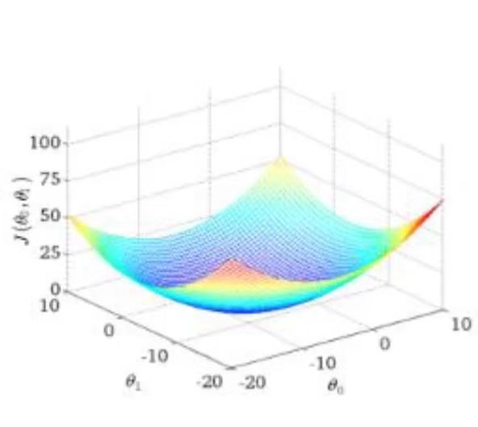
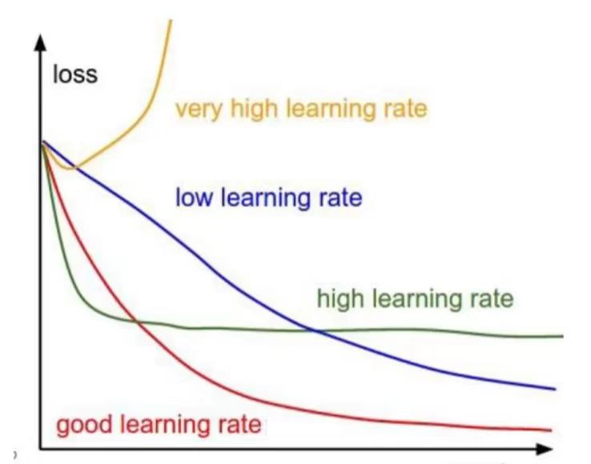

# 线性模型

1. **单变量**
   
   $$
   y = kx + b
   $$

2. **多变量**
   
   $$
   h_\theta(x) = \theta_0 + \theta_1x_1 + \theta_2x_2 \\
h_\theta(x) = \sum_{i=1}^{m} \theta_i x_i = \theta^T x
   $$

3. **误差**
   
   真实值与预测值之间存在差异
   
   用 $\epsilon$ 来表示该误差
   
   则对于每个样本
   
   $$
   y^{(i)} = \theta^T x^{(i)} + \epsilon^{(i)}
   $$
   
   
   
   - 误差 $\epsilon^{(i)}$ 是<u>**独立并且具有相同的分布**</u>，并且<u>**服从均值为0，方差为 $\sigma^2$ 的高斯分布**</u>；
     
     > **独立**：张三和李四一起来贷款，他俩没关系
     > 
     > **同分布**：他俩都来得是我们假定的这家银行
   
   - <u>***高斯分布***</u>【正态分布】
     
     数据在绝大多数情况下浮动不会太大，极小情况下浮动会比较大，符合正常情况；
     
     $$
     p(\epsilon^{(i)}) = \frac{1}{\sqrt{2\pi} \sigma} exp(-\frac{(\epsilon^{(i)})^2}{2 \sigma^2})
     $$
     
     将 $y^{(i)} = \theta^T x^{(i)} + \epsilon^{(i)}$ 与 $p$ 式子联立，则
     
     $$
     p(y^{(i)} | x^{(i)}; \theta) = \frac{1}{\sqrt{2\pi} \sigma} exp(-\frac{(y^{(i)} - \theta^T x^{(i)})^2}{2 \sigma^2})
     $$
   
   - <u>***似然函数***</u>
     
     $$
     L(\theta) = \prod_{i=1}^{m} p(y^{(i)} | x^{(i)}; \theta)
= \prod_{i=1}^{m} \frac{1}{\sqrt{2\pi} \sigma} exp(-\frac{(y^{(i)} - \theta^T x^{(i)})^2}{2 \sigma^2})
     $$
   
   - <u>***对数似然***</u>
     
     乘法难解，加法容易多了，对数里面乘法可以转换成加法
     
     $$
     \log L(\theta)
      = \log \prod_{i=1}^{m} \frac{1}{\sqrt{2\pi} \sigma} exp(-\frac{(y^{(i)} - \theta^T x^{(i)})^2}{2 \sigma^2}) \\
     $$
     
     - 对对数似然进行展开化简，得到
       
       $$
       \sum_{i=1}^{m} \log \frac{1}{\sqrt{2\pi} \sigma} exp(-\frac{(y^{(i)} - \theta^T x^{(i)})^2}{2 \sigma^2}) \\
        \quad \\
        \quad \quad = m \log \frac{1}{\sqrt{2\pi} \sigma} - \frac{1}{\sigma^2} \cdot \frac{1}{2} \sum_{i=1}^{m} (y^{(i)} - \theta^T x^{(i)})^2 \\
       $$
     
     - 为了让对数似然越大越好
       
       $m \log \frac{1}{\sqrt{2\pi} \sigma} - \frac{1}{\sigma^2}$ 均为已知数，求  最大值，则 $\frac{1}{2} \sum_{i=1}^{m} (y^{(i)} - \theta^T x^{(i)})^2$ 最小值
       
       损失函数越小越好👇
       
       $$
       L(\theta) = \frac{1}{2} \sum_{i=1}^{m} (y^{(i)} - \theta^T x^{(i)})^2
       $$
   
   - <u>***损失函数求解***</u>
     
     - 函数解释
       
       将 $M$ 个 $N$ 维样本组成矩阵 $X$
       
       1. $X$ 的每一行对应一个样本，共 $M$ 个样本
       
       2. $X$ 的每一列对应样本的一个维度，共 $N$ 维
       
       3. <mark>第一列还有额外的一维常数项，全为1</mark>
     
     - 目标函数
       
       $$
       L(\theta) = \frac{1}{2} \sum_{i=1}^{m} (h_\theta(x^{(i)}) - y^{(i)})^2 = \frac{1}{2} (X\theta - y)^T (X\theta - y)
       $$
     
     - 求偏导【梯度】
       
       $$
       \nabla_\theta L(\theta) = \nabla_\theta(\frac{1}{2} (X\theta - y)^T (X\theta - y)) \\
        \quad \\
        = \nabla_\theta(\frac{1}{2} (X^T \theta^T - y^T) (X\theta - y)) \\
        \quad \\
        \quad \quad \quad \quad \qquad = \nabla_\theta (\frac{1}{2} (X \theta X^T \theta^T - X^T \theta^T y - X \theta y^T + y y^T)) \\
        \quad \\
        \quad = \frac{1}{2} (2X^T X \theta - X^T y - (X y^T)^T) \\
        \quad \\
        = X^T X \theta - X^T y
       $$
     
     - 令梯度等于零，$X^T X$ 可逆时，求解出
       
       $$
       \theta = (X^T X)^{-1} X^T y
       $$

## 梯度下降

1. **<mark>目标函数</mark>**
   
   $$
   L(\theta) = \frac{1}{2m} \sum_{i=1}^{m} (h_\theta(x^{(i)}) - y^{(i)})^2
   $$
   
   $m$: 后面累加项的均值
   
   

2. <mark>**梯度下降过程**</mark>
   
   - 初始化 `\theta` 【随机初始化】
   
   - 沿着负梯度方向迭代，更新后的 `\theta` 使 `L(\theta)` 更小
     
     $$
     \theta = \theta - \alpha \cdot \frac{\partial L(\theta)}{\partial \theta}
     $$
     
     $\alpha$: 学习率

3. **<mark>不同梯度下降算法</mark>**
   
   - <u>**批量梯度下降**</u>
     
     $$
     \frac{1}{m} \sum_{i=1}^{m} (h_\theta(x^{(i)}) -  y^{(i)})x^{(i)}_j
     $$
     
     参数更新👇
     
     $$
     \theta_j: \theta_j - \alpha (\frac{1}{m}) \sum_{i=1}^{m} (h_\theta(x^{(i)}) -  y^{(i)})x^{(i)}_j
     $$
   
   - <u>**随机梯度下降**</u>
     
     $$
     \theta_j: \theta_j - \alpha (y^{(i)} -  h_\theta(x^{(i)}))x^{(i)}_j
     $$
   
   - <u>**小批量梯度下降**</u>
     
     $$
     \theta_j: \theta_j - \alpha \frac{1}{10} \sum_{k = i}^{i + 9} (h_\theta(x^{(k)}) -  y^{(k)})x^{(k)}_j
     $$

4. **<mark>学习率【步长】</mark>**
   
   
   
   - 对结果会产生巨大的影响，一般小一些；0.01，0.001等
