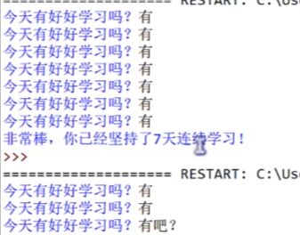
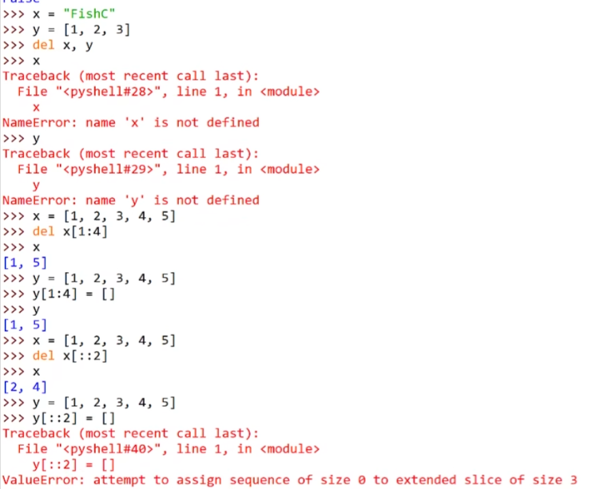
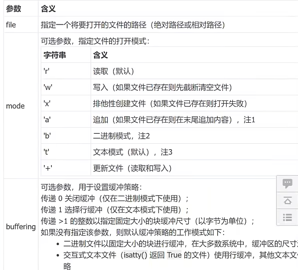
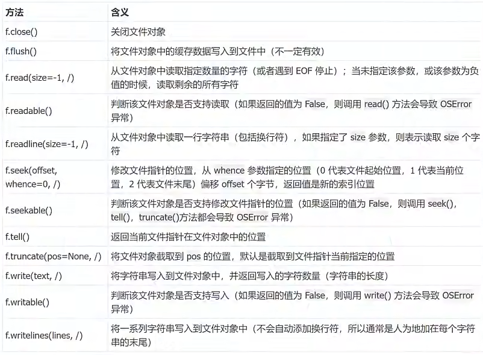
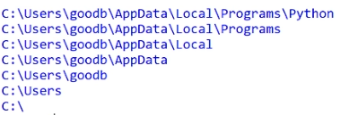
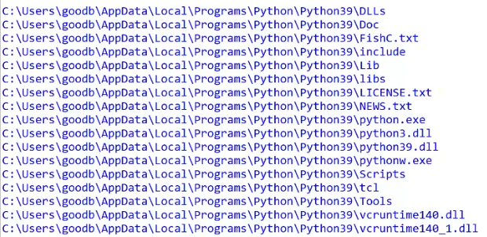
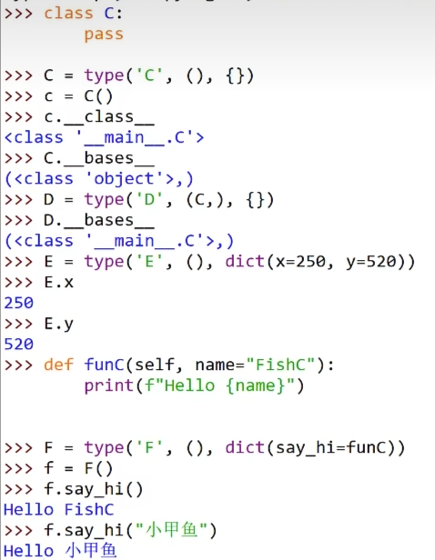

# BUG

## NameError

### ... not define

## SyntaxError

### invalid syntax

### Non-ASCII character

### leading zeros in decimal integer literals are not permitted


## IndentationError

### unexpected indent

## TypeError

## 'float' object is not iterable


```python
# Error code
ax.set_title('lr = ', lr)
# Modified code
ax.set_title('lr = {}'.format(lr))
```

# 一键修改变量名 快捷键

Ctrl Shift Alt J

or Shift F6

# 注释

用自己熟悉的语言，在程序中对某些代码进行标注说明，增强程序的可读性

```python
# 单行注释
'''
多行注释
....
'''
```

# 算数运算符

| 运算符 | 描述            |
| --- | ------------- |
| +   | 加             |
| -   | 减             |
| *   | 乘             |
| /   | 除             |
| //  | 取整除，返回除法的整数部分 |
| %   | 取余数           |
| **  | 幂             |

# 身份运算符

用于**比较两个对象的<mark>内存地址</mark>是否一致**

针对 `None` 比较，建议使用 `is` **判断**

| 身份运算符    | 描述                         | 实例                             |
| -------- | -------------------------- | ------------------------------ |
| `is`     | `is` 是判断两个标识符是不是引用同一个对象    | x is y，类似 `id(x) == id(y)`     |
| `is not` | `is not` 是判断两个标识符是不是引用不同对象 | x is not y，类似 `if(a) != id(b)` |

> **`is` 与 `==` 的区别**
> 
> - `is` 用于判断<u>**两个变量引用对象是否为同一个**</u>
> 
> - `==` 用于判断<u>**引用变量的值是否相等**</u>

# 变量

## 变量定义

```python
qq_number = '1243435'
qq_password = '8920485'
```

<font color = cornflowerblue>需求</font>

苹果价格是8.5元/斤，买了7.5斤苹果，计算付款金额

```python
price = 8.5
weight = 7.5
totalPrice = price * weight
print(totalPrice)
```

<font color = cornflowerblue>新需求</font>

买了苹果后返5元

```python
totalPrice -= 5
print(totalPrince)
```

## 变量类型

<font color = cornflowerblue>需求</font>

定义变量保存小明的个人信息

小明；18岁；男生；1.75；75 kg

```python
name = '小明'  # String
age = 18  # int
gender = True  # boolean
height = 1.75  # float
weight = 75.0  # float
```

- **<mark>数据型</mark>**
  
  - 整型  `int`
  
  - 浮点型  `float`
  
  - 布尔型  `bool`
    
    `True, False`
    
    非0即真
  
  - 复数型  `complex`
    
    主要用于科学计算，e.g. 平面场问题，波动问题、电感电容等问题

- **<mark>非数字型</mark>**
  
  - 字符串
  
  - 列表
  
  - 元组
  
  - 字典

`type()`: 查看数据类型

> 在 Python2.x 中，整数根据保存数据的长度分为 `int` 和 ` long`

## 不同类型变量间的计算

在 Python 中，两个数字型变量是可以直接进行算数运算的，若变量是 `bool` 型，在计算时 `True` 对应数字是1，`False` 对应数字是0

```python
i = 10
f = 10.5
b = True
r = i + f  # 20.5
r = i + b  # 11
r = f - b  # 9.5
r = i * f  # 105.0
```

<mark>字符串之间的拼接</mark>

在 Python 中，字符串之间可以使用 `+` 拼接生成新的字符串

```python
first_name = 'con'
last_name = 'nor'
name = first_name + last_name  # 'connor'
```

可以与整数使用

```python
mul = first_name * 3  # 'conconcon'
mul = last_name * 3  # 'nornornor'
d = '-' * 3  # '---'
```

除了上述操作，字符串与整数不能进行其他的计算

## 变量的输入

在 Python 中，获取用户在键盘上输入信息，需要使用 `input` 函数

`input()`

```python
变量名 = input('提示信息') 
```

`input` 输出都是 `str`

## 变量类型转换

| 函数         | 说明           |
| ---------- | ------------ |
| `int(x)`   | 将 x 转换为一个整数  |
| `float(x)` | 将 x 转换为一个浮点数 |

## 变量的格式化输出

若希望输出文字信息的同时，一起输出数据，就需要使用**格式化操作符**

`%` 被称为格式化操作符

| 格式化字符 | 说明                                     |
| ----- | -------------------------------------- |
| `%s`  | 字符串                                    |
| `%d`  | 有符号十进制整数，`%06d` 表示输出的整数显示位数，不足的地方使用0补全 |
| `%f`  | 浮点数，`%.2f` 表示小数点后显示两位                  |
| `%%`  | 输出 `%`                                 |

> e.g. 1
> 
> 定义字符串变量 name，输出我的名字叫小明，请多多关照!
> 
> ```python
> name = '小明'
> print('我的名字叫%s，请多多关照！' % name)
> ```
> 
> e.g. 2
> 
> 定义整数变量 student_no，输出我的学号是 000001
> 
> ```python
> student_no = 1
> print('我的学号是%06d' % student_no)
> ```
> 
> e.g. 3
> 
> 定义一个小数 scale，输出数据比例是 33.00%
> 
> ```python
> scale = 0.33
> print('数据比例是%.2f%%' % (scale * 100))
> ```

## 变量命名

**<mark>标识符</mark>**

就是程序员定义的变量名，函数名，见名知意

字母下划线数字组成

不能以数字开头，不能与关键字相同

**<mark>关键字</mark>**

Python 内部已经内置好的标识符

```python
# 查看 Python 中的关键字
import keyword
print(keyword.kwlist)
```

**<mark>命名规则</mark>**

标识符区分大小写

# 分支语句

条件成立，才能做某件事情

否则，做另外一件事情或者什么都不做

## 逻辑运算

1. 与
   
   `condition1 and condition2`
   
   - 两个条件同时满足，返回 `True`
   
   - 只要有一个条件不满足，返回 `False`

2. 或
   
   `condition1 or condition2`
   
   - 两个条件只要有一个满足，返回 `True`
   
   - 两个条件都不满足，返回 `False`

3. 非
   
   `not condition`
   
   | 条件  | 结果  |
   | --- | --- |
   | 成立  | 不成立 |
   | 不成立 | 成立  |

## if 嵌套

```python
'''
需求
定义布尔型变量 has_ticket 表示是否有车票
定义整型变量 knife_length 表示刀的长度，cm
首先检查是否有车票，如果有，才允许进行安检
安检时，需要检查刀的长度，判断是否超过 20 cm
如果超过 20 cm ，提示刀的长度，不允许上次
如果没有超过 20 cm，安检通过
如果没有车票，不允许进门
'''

has_ticket = True
knife_length = 30
if has_ticket:
    print('车票检查通过，准备开始安检')
    if knife_length <= 20:
        print('安检通过')
    else:
        print('您携带的刀长{}厘米，已超过20厘米，不允许上车'.format(knife_length))
else:
    print('您没有车票，不允许进入！')
```

## 综合案例: 石头剪刀布

需求

- 从控制台输入要出的拳 ---- 石头 (1) / 剪刀 (2) / 布 (3)

- 电脑随机出拳 ---- 先假定电脑只会出石头，完成整体代码功能

- 比较胜负

| 序号  | 规则      |
| --- | ------- |
| 1   | 石头 胜 剪刀 |
| 2   | 剪刀 胜 布  |
| 3   | 布 胜 石头  |

```python
import random
player = int(input('请输入您要出的拳 (石头 (1) / 剪刀 (2) / 布 (3))'))
computer = random.randint(1, 3)

if (player == 1 and computer == 2) or (player == 2 and computer 3) or (player == 3 and computer == 1):
    print('玩家胜利')
elif player == computer:
    print('玩家与电脑平局')
else:
    print('电脑获胜')
```

### 随机数

`import random`

| methods                | explanation                          |
| ---------------------- | ------------------------------------ |
| random()               | 返回 $0 \le n \le 1$ 之间的随机实数 $n$       |
| choice(seq)            | 从序列 seq 中返回随机的元素                     |
| getrandbits(n)         | 以长整型形式返回 $n$ 个随机位                    |
| shuffle(seq[, random]) | 原地指定 seq 序列                          |
| sample(seq, n)         | 从序列 seq 中选择 $n$ 个随机且独立的元素            |
| randint(10， 100)       | 随机生一个整数 int 类型，可以指定这个整数的范围，同样有上限和下限值 |

# 循环语句

## while

让执行的代码按照指定的次数重复执行

```python
while condition:
    ...
    ...
    cope condition
```

```python
i = 1
while i <= 5:
    print('Hello Python')
    i += 1
print('i =', i)
```

<font color = cornflowerblue>对 print 的扩展</font>

默认输出内容后进行换行操作，若不希望进行换行可在后面增加 `end = ''` 操作

```python
print('Hello Python', end = '')
print('Hello Python')
```

## 九九乘法表

```python
for i in range(1, 10):
    for j in range(1, i + 1):
        print('%d × %d = %d' %(j, i, i * j), end = '\t')
    print('')
```

## for

```python
for variate in dataset:
    code
else:
    # for end will run else
    # if break for, else will not run
```

# 函数

在定义函数的下方加入三个引号给函数增加文档说明，ctrl + Q 弹出文档说明

# 模块

模块就像是工具包，要想使用这个工具包中的工具，就需要导入 `import` 这个模块

每个以扩展名 `.py` 结尾的 Python 源代码文件都是一个模块

# 列表

**<mark>非数字型</mark>**

- 字符串

- 列表

- 元组

- 字典

所有非数字型变量都支持一下特点

1. 都是一个序列 sequence，也可以理解为容器

2. 取值 `[]`

3. 遍历 `for in`

4. 计算长度，最大 / 最小值，比较，删除

5. 链接 `+` 和重复 `*`

6. 切片


# 关键字 / 函数 / 方法

## 关键字

关键字是 Python 内置的、具有特殊意义的标识符

```python
import keyword
print(keyword.kwlist)
print(len(keyword.kwlist))
```

> 关键字后面不需要使用括号

## 函数

函数封装了独立功能，可以直接调用

> 函数需要死记硬背

## 方法

方法和函数类似，同样是封装了独立的功能

需要通过对象来调用，表示针对这个对象要做的操作

`object.method(param)`

# 元组

`Tuple` (元组) 与列表类似，不同之处在于元组的元素不能修改

用于存储一串信息，数据之间使用

> 元组钟只包含一个元素时，需要在元素后面添加逗号

**<mark>元组的应用场景</mark>**

- 函数的参数和返回值
  
  一个函数可以接受任意多个参数，或者一次返回多个数据

- 格式字符串
  
  格式化字符串后面的 `()` 本质上就算一个元组

- 让列表不可以被修改
  
  以保护数据安全

## 元组与列表的转换

1. 元组 `-->` 列表
   
   `list(tuple)`
   
   ```python
   num_tuple = (1, 2, 3, 4)
   num_list = list(num_tuple)
   ```

2. 列表 `-->` 元组
   
   `tuple(list)`
   
   ```python
   num_list = [1, 2, 3, 4]
   num_tuple = tuple(num_list)
   ```

# 字典

## 字典定义

字典 dictionary 是除列表意外 Python 中最灵活的数据类型

通常用于存储描述一个物体的相关信息

<mark>与列表的区别</mark>

- 列表是**有序**的对象集合

- 字典是**无序**的对象集合

字典用 `{}` 定义，使用<font color = cornflowerblue>键值对</font>存储数据，键值对之间使用 `,` 分隔

1. **键** `key` 是索引

2. **值** `value` 是数据

3. **键**和**值**之间使用 `:` 分隔

4. **键必须是唯一**的

5. **值**可以取任何数据类型，但**键**只能使用字符串、数字或元组

## 字典的常用操作

```python
information_dict = {'name': 'connor'}

# 取值
dict_value = information_dict['name']

# 增加 / 修改
information_dict['age'] = 21
information_dict['name'] = 'welty'

# 删除
information_dict.pop('name')
```

**<mark>一个函数，两个方法</mark>**

```python
# 统计键值对数量
count_dict = len(information_dit)

# 合并字典
temp_dict = {'height': 1.75}
information_dict.undate(temp.dict)

# 清空字典
information_dict.clear()
```

## 字典联合列表

```python
card_list = [
    {'name': 'connor',
     'qq': '179385832',
     'phone': '1103'},
    {'name': 'welty',
     'qq': '179332832',
     'phone': '3303'}
]

for card_info in card_list:
    print(card_info)
```

# 字符串

## 转义字符

| 转义字符 | 说明                   |
| ---- | -------------------- |
| \\\  | 反斜杠符号                |
| \'   | 单引号                  |
| \"   | 双引号                  |
| \n   | 换行                   |
| \t   | 制表符，协助在输出文本时垂直方向保持对齐 |
| \r   | 回车                   |

## 字符串常用操作


### 判断类型

| method               | introduction                                   |
| -------------------- | ---------------------------------------------- |
| `string.isspace()`   | 只包含空格或一些空转义字符，返回 `True`                        |
| `string.isalnum()`   | 至少有一个字符并且所有字符都是字母或数字，返回 `True`                 |
| `string.isalpha()`   | 至少有一个字符并且所有字符都是字母，返回 `True`                    |
| `string.isdecimal()` | 只包含数字且为全角数字，返回 `True`                          |
| `string.isdigit()`   | 只包含数字且为全角数字，(1)，\u00b2，返回 `True`               |
| `string.isnumeric()` | 只包含数字且为全角数字，汉字数字，返回 `True`                     |
| `string.istitle()`   | 标题化的 (每个单词首字母大写)，返回 `True`                     |
| `string.islower()`   | 包含至少一个区分大小写的字符，并且所有这些 (区分大小写) 字符都是小写，返回 `True` |
| `string.isupper()`   | 包含至少一个区分大小写的字符，并且所有这些字符都是大写，返回 `True`          |

### 查找和替换

| method                                                      | introduction                                                                      |
| ----------------------------------------------------------- | --------------------------------------------------------------------------------- |
| `string.startswith(str)`                                    | 检查字符串是否以 `str` 开头，是则返回 `True`                                                     |
| `string.endswith(str)`                                      | 检查字符串是否是以 `str` 结束，是则返回 `True`                                                    |
| `string.find(str, start = 0, end = len(string))`            | 检测 `str` 是否包含在 `string` 中，若 `start` 和 `end` 指定范围，则检查是否包含在指定范围内，若是返回开始的索引值，否则返回 -1 |
| `string.rfind(str, start = 0, end = len(string))`           | 类似 `find()` 函数，不过是从右边开始查找                                                         |
| `string.index(str, start = 0, end = len(string))`           | 类似 `find()` 方法，不过若 `str` 不在 `string` 会报错                                          |
| `string.rindex(str, start = 0, end = len(string))`          | 类似 `index()`，不过是从右边开始                                                             |
| `string.replace(old_str, new_str, num = string.count(old))` | 把 `string` 中的 `old_str` 替换成 `new_str`，若 `num` 指定，则替换不超过 `num` 次【不是原地修改】           |

### 大小写转换

| method                | introduction           |
| --------------------- | ---------------------- |
| `string.capitalize()` | 把字符串的第一个字符大写           |
| `string.title()`      | 把字符串的每个单词首字母大写         |
| `string.lower()`      | 转换 `string` 中所有大写字符为小写 |
| `string.upper()`      | 转换 `string` 中的小写字符为大写  |
| `string.swapcase()`   | 翻转 `string` 中的大小写      |

### 文本对齐

| method                 | introduction                         |
| ---------------------- | ------------------------------------ |
| `string.ljust(width)`  | 返回一个原字符串左对齐，并使用空格填充至长度 `width` 的新字符串 |
| `string.rjust(width)`  | 返回一个原字符串右对齐，并使用空格填充至长度 `width` 的新字符串 |
| `string.center(width)` | 返回一个原字符串居中，并使用空格填充至长度 `width` 的新字符串  |

### 删除空白字符

| method            | introduction          |
| ----------------- | --------------------- |
| `string.lstrip()` | 截掉 `string` 左边的空白字符   |
| `string.rstrip()` | 截掉 `string` 右边的空白字符   |
| `string.strip()`  | 截掉 `string` 左右两边的空白字符 |

### 字符串拆分 / 连接

| method                        | introduction                                                                                 |
| ----------------------------- | -------------------------------------------------------------------------------------------- |
| `string.partition(str)`       | 把字符串 `string` 分成一个3元素的元组 (`str` 前面，`str`，`str` 后面)                                           |
| `string.rpartition(str)`      | 类似 `partition()` 方法，不过是从右边开始查找                                                               |
| `string.split(str = '', num)` | 以 `str` 为分隔符拆分 `string`，如果 `num` 有指定值，则仅分隔 `num + 1` 个子字符串，`str` 默认包含 `\r, \t, \n` 和 `space` |
| `string.splitlines()`         | 按照行 `(\r, \n, \r\n)` 分隔，返回一个包含各行作为元素的列表                                                      |
| `string.join(seq)`            | 以 `string` 作为分隔符，将 `seq` 中所有元素合并为一个新的字符串                                                     |

## 字符串的切片

切片方法适用于字符串、列表、元组


`string[star: end: length]`

# 公共方法

<mark>公共方法是列表，元组，字典，字符串都能使用的方法</mark>

## Python 内置函数

| function            | introduction           | remarks           |
| ------------------- | ---------------------- | ----------------- |
| `len(item)`         | 计算容器中元素个数              |                   |
| `del(item)`         | 删除变量                   | `del` 有两种方式       |
| `max(item)`         | 返回容器中元素最大值             | 若是字典，只针对 `key` 比较 |
| `min(item)`         | 返回容器中元素最小值             | 若是字典，只针对 `key` 比较 |
| `cmp(item1, item2)` | 比较两个值，-1小于 / 0相等 / 1大于 | Python3.x 取消了此函数  |

> 注意
> 
> 字符串比较符合以下规则：`0 < A < a`

## 切片

使用索引值来限定范围

字符串，列表，元组可以通过索引值获取对应的数据

字典是无序的结合，不能进行切片

## 运算符

```python
a = [1, 2] * 5  # [1, 2, 1, 2, 1, 2, 1, 2, 1, 2]
b = (1, 2) * 5  # (1, 2, 1, 2, 1, 2, 1, 2, 1, 2)
c = {'a': 'z'} * 5  # TypeError
```

| operator       | python                  | result                     | introduction | digit type supported        |
| -------------- | ----------------------- | -------------------------- | ------------ | --------------------------- |
| `+`            | `[1, 2] + [3, 4]`       | `[1, 2, 3, 4]`             | 合并           | `string, list, tuple`       |
| `*`            | `['Hi'] *4`             | `['Hi', 'Hi', 'Hi', 'Hi']` | 重复           | `string, list, tuple`       |
| `in`           | `3 in (1, 2, 3)`        | `True`                     | 元素是否存在       | `string, list, tuple, dict` |
| `not in`       | `4 not in (1, 2, 3)`    | `True`                     | 元素是否不存在      | `string, list, tuple, dict` |
| `> >= == < <=` | `(1, 2, 3) < (2, 2, 3)` | `True`                     | 元素比较         | `string, list, tuple`       |

> **注意**
> 
> - `in` 在对字典操作时，判断的是字典的键
> 
> - `in` 和 `not in` 被称为成员运算符

# 综合案例: 名片管理系统

<mark>需求</mark>

1. 程序启动，显示名片管理系统欢迎界面，并显示功能菜单
   
   

2. 用户用数字选择不同的功能

3. 根据功能选择，执行不同的功能

4. 用户名片需要记录用户的姓名，电话，qq，邮件

5. 若查询到指定的名片，用户可以选择修改或删除操作

## 框架搭建

- 准备文件，确定文件名，保证能够在需要的为止编写代码
  
  - `cards_main.py` 保存主程序功能代码
    
    - 程序的入口
    
    - 每一次启动名片管理系统都通过 `main` 这个文件启动
  
  - `cards_tools.py` 保存所有名片功能函数
    
    - 将新增，查询，修改，删除等封装在不同的函数中

- 编写主运行循环，实现基本的用户输入和判断

```python
'''
    cards_main.py
'''
import cards.tools


while True:
    # 显示功能菜单
    cards.tools.show_mennu()

    action_str = input('请选择希望执行的操作: ')
    print('您选择的操作是【%s】' % action_str)

    # 1, 2, 3, 名片操作；0，退出系统
    if action_str in ['1', '2', '3']:
        if action_str == '1':
            pass
        elif action_str == '2':
            pass
        else:
            pass
        # pass
    elif action_str == '0':
        # 不希望立刻编写分支内部的代码使用 pass，表示一个占位符
        # 能够保证程序的代码结构正确
        # pass
        print('欢迎再次使用【名片管理系统】！')
        break
    else:
        print('您输入的不正确，请重新选择！')
```

```python
'''
cards_tools.py
'''


def show_menu():
    '''show menu'''


def new_card():
    '''add new_card'''

    print('-' * 50)


def show_all():
    '''show all_cards'''

    print('-' * 50)


def find_card():
    '''find cards'''

    print('-' * 50)
```

## 扩展: TODO 注释

在 `#` 后跟上 `TODO`，用于标记需要去做的巩固走

## 根据需求对框架进行完善

```python
'''
    cards_main.py
''' 
import cards.tools

while True:
    # 显示功能菜单

    action_str = input('请选择希望执行的操作: ')
    print('您选择的操作是【%s】' % action_str)

    # 1, 2, 3, 名片操作；0，退出系统
    if action_str in ['1', '2', '3']:
        if action_str == '1':
            cards_tools.new_card()
        elif action_str == '2':
            cards_tools.show_all()
        else:
            cards_tools.find_card()
        # pass
    elif action_str == '0':
        # 不希望立刻编写分支内部的代码使用 pass，表示一个占位符
        # 能够保证程序的代码结构正确
        # pass
        print('欢迎再次使用【名片管理系统】！')
        break
    else:
        print('您输入的不正确，请重新选择！')
```

```python
'''
cards_tools.py
'''
card_list = []


def show_menu():
    '''show menu'''

    print('*' * 50)
    print('欢迎使用【名片管理系统】V 1.0')
    print('')
    print('1. 新增名片')
    print('2. 显示全部')
    print('3. 查询名片')
    print('')
    print('0. 退出系统')
    print('*' * 50)


def new_card():
    '''add new_card'''

    print('-' * 50)

    name = input('请输入姓名:')
    phone = input('请输入电话:')
    position = input('请输入职位:')
    email = input('请输入邮箱:')

    card_dict = {
                    '姓名': name,
                    '电话': phone,
                    '职位': position,
                    '邮箱': email
                }
    card_list.append(card_dict)

    print('添加 %s 成功！' % name)


def show_all():
    '''show all_cards'''
    print('-' * 50)
    print('查看全部')

    if len(card_list) == 0:
        print('当前没有任何名片记录，请新增名片')
        return

    for title in list(card_dict.key()):
        print(title, end = '\t\t')

    print('')
    print('=' * 50)

    for card_dict in card_list:
        print(card_dict.get('姓名'), end = '\t')
        print(card_dict.get('电话'), end = '\t')
        print(card_dict.get('职位'), end = '\t')
        print(card_dict.get('邮箱'))


def find_card():
    '''find cards'''
    print('-' * 50)
    print('查询名片')

    search_name = input('请输入要查询的姓名:')
    for card_dict in card_list:
        if card_dict['姓名'] == search_name:
            print(card_dict.get('姓名'), end = '\t')
            print(card_dict.get('电话'), end = '\t')
            print(card_dict.get('职位'), end = '\t')
            print(card_dict.get('邮箱'))

            operate = input('请输入对名片的操作: 1. 修改 / 2. 删除 / 0. 返回上级菜单')
            while True:
                if operate == '1':
                    name_modify = input('请输入修改后的姓名:')
                    if len(name_modify) != 0:
                        card_dict['姓名'] = name_modify
                    phone_modify = input('请输入修改后的电话:')
                    if len(phone_modify) != 0:
                        card_dict['电话'] = phone_modify
                    position_modify = input('请输入修改后的职位:')
                    if len(position_modify) != 0:
                        card_dict['职位'] = position_modify
                    email_modify = input('请输入修改后的邮箱:')
                    if len(email_modify) != 0:
                        card_dict['邮箱'] = email_modify
                elif operate == '2':
                    inquiry = input('你确定要删除该名片吗？Y / y: 确定 N / n: 返回上一级目录')
                    if inquiry == 'Y' or inquiry == 'y':
                        pass
                    else:
                        show_menu()
                elif operate == '0':
                    show_menu()
                else:
                    print('您输入的操作无效，请重新输入！')
                    operate = input('请输入对名片的操作: 1. 修改 / 2. 删除 / 0. 返回上级菜单')
        else:
            print('您查询的名片无效！')
```

## py 文件转化为可执行文件

在文件开头添加 `#! python 路径`

# 数据类型可变与不可变

- **<font color = cornflowerblue>不可变类型</font>**
  
  内存中的数据不允许被修改
  
  - 数字类型  `int, bool, float, complex, long(2, x)`
  
  - 字符串  `str`
  
  - 元组  `tuple`

- **<font color = cornflowerblue>可变类型</font>**
  
  - 列表  `list`
  
  - 字典  `dict`
  
  使用方法改变，其内存不会变化，若重新赋值，则内存会该改变

# 局部变量 / 全局变量

**<font color = Red>全局变量</font>**    函数外部定义的变量（没有定义在某一个函数内，所有函数内部都可以使用这个变量

**<font color = Red>局部变量</font>**    函数内部定义的变量，只能在函数内部使用

## 局部变量

只能在函数内部使用

```python
def demo():
    num = 20  # 局部变量

print(num)  # NameError: name 'num' is not defined
```

## 全局变量

```python
num = 10  # 全局变量
def demo():
    print(num)  # 10

def demo_2():
    print(num)  # 10

def demo_3():
    global num  # 在函数内可以修改全局变量
```

# 函数

## 函数参数

若传递的参数是可变类型，在函数内部，使用方法修改了数据的内容，回影响到外部数据

列表变量调用 `+=` 本质上是在执行列表变量的 `extend` 方法

## 缺省参数

```python
def print_info(name, gender = True):
    gender_text = '男生'
    if not gender:
        gender_text = '女生'
    print('%s 是 %s' % (name, gender))

print_info('小明')
print_info('老王')
print_info('小美', False)
```

选择最常见的值作为默认值

保证带有默认值的缺省参数在参数列表末尾

## 多值参数

有时可能需要一个函数能够处理的参数个数是不确定的，这个时候，就可以使用多指参数

两种多指参数

- 参数名前增加一个 `*` 可以接收元组
  
  `*args`

- 参数名前增加两个 `*` 可以接收字典
  
  `**kwargs`

```python
def demo(num, *nums, **person):
    print(num)
    print(nums)
    print(person)
demo(1, 2, 3, 4, 5, name = '小明', age = 18)
```


```python
'''
将传递的所有数字累加并且返回累加结果
'''

def sum_numbers(*args):

    num = 0
    # 遍历 args 元组顺序求和
    for i in args:
        num += i

    return num

print(sum_numbers(1, 2, 3))
```

**<font color = cornflowerblue>元组和字典的拆包</font>**

在使用多值参数的函数时，若希望将一个元组变量，直接传递给 `args`，将一个字典变量，直接传递给 `kwargs`，这时候就可以使用拆包

拆包的方式

- 在元组变量前增加一个 `*`

- 在字典变量前增加两个 `**`

# 面向对象

面向对象编程  Object Oriented Programming  简称 OOP

开发复杂项目时，面向对象是更好的选择

相比较函数，**面向对象**是更大的封装，根据职责在一个对象中封装多个方法

## 类

是对一群具有<mark>相同特征</mark>或者<mark>行为</mark>的事务的一个统称，是抽象的不能直接使用的

- 特征被称为**属性**

- 行为被称为**方法**

## 对象

对象是<font color = Red>由类创建出来的一个具体存在</font>，可以直接使用

由哪一个类创建出来的对象，就拥有在哪一个类中定义

**<font color = cornflowerblue>先有类，再有对象</font>**

## 类的设计

在使用面向对象开发前，应该首先分析需求，确定程序中需要包含哪些类

明确之后，要设计一个类，通常需要满足以下三个要素

- 类名
  
  这类食物的名字，满足大驼峰命名法

- 属性
  
  这类食物具有什么样的特征

- 方法
  
  这类食物具有什么样的行为

### 类名的确定

<font color = cornflowerblue>**名字提炼法**</font>    分析整个业务流程，出现的名词，通常就是找到的类

### 属性和方法的确定

1. 对**对象的特征描述**，通常可以定义成属性

2. 对象具有的行为，通常可以定义成方法

> 需求中没有设计的属性或者方法在设计类时，不需要考虑

```python
''' e.g.
- 小明今年19岁，身高1.75，每天早上跑完步，会去吃东西
- 小美今年17岁，身高1.65，小美不跑步，小美喜欢吃东西
'''
```


```python
''' e.g.
- 一只黄颜色的狗狗叫大黄
- 看见生人汪汪叫
- 看见家人摇尾巴
'''
```


# 面向对象基础语法

## dir 内置函数

> `__方法名__` 格式的方法是 Python 提供的内置方法 / 属性

`dir` 传入标识符 / 数据，可以查看对象内的所有属性及方法

```python
def demo(num):
    print(num)
dir(demo)
```

## 定义简单类

1. **定义只包含方法的类**
   
   ```python
   class 类名:
       def 方法1(self, 参数列表):
           pass
       def 方法2(self, 参数列表):
           pass
   ```
   
   - 方法的定义格式与函数几乎一样
   
   - 区别在于第一个参数必须是 `self`

2. **创建对象**
   
   ```python
   对象变量 = 类名()
   ```

```python
'''
小猫爱吃鱼，小猫要喝水

- 定义一个猫类
- 定义两个方法 eat and drink
'''
class Cat:

    def eat(self):
        print('小猫爱吃鱼')
    def drink(self):
        print('小猫要喝水')

# 创建对象
tom = Cat()
tom.eat()
tom.drink()
```

<mark>引用概念</mark>

Python 中使用类创建对象之后，上一个 code `tom` 变量中仍然记录的是对象在内存中的地址

也就是 `tom` 变量引用了新建的猫对象

使用 `print` 输出对象变量，默认情况下，是能够输出这个变量引用的对象是由哪一个类创建的对象，以及在内存中的地址【十六进制表示】

- `%d` 10进制输出数字

- `%x` 16进制输出数字

<mark>创建多个对象</mark>

```python
# 接上一次 code
lazy_cat = Cat()
lazy_cat.eat()
lazy_cat.drink()
```

## 方法中的 self 参数

<mark>**给对象增加属性**</mark>

Python 中，给对象设置属性非常容易，只需要在类的外部代码中直接通过 `.` 设置即可

> 但是此方法不推荐使用

```python
tom.name = 'Tom'
lazy_cat.name = '大懒猫'
```

**<font color = Red>self</font>**

```python
'''
小猫爱吃鱼，小猫要喝水

- 定义一个猫类
- 定义两个方法 eat and drink
'''
class Cat:

    def eat(self):
    # 哪一个对象调用的方法，self 就是哪一个对象的引用
        print('%s 爱吃鱼' % self.name)
    def drink(self):
        print('小猫要喝水')

# 创建对象
tom = Cat()
tom.name = 'Tom'  # Tom 爱吃鱼
tom.eat()
tom.drink()
```

## 初始化方法

当使用 `类名()` 创建对象时，会自动执行以下操作

1. 为对象在内存中分配空间  ----  创建对象

2. 为对象的属性设置初始值  ----  初始化方法 `init`

`__init__` 方法是对象的内置方法

> `__init__` 方法是专门来定义**一个类具有哪些属性的方法**

```python
self.属性名 = 属性的初始值  # 定义属性
```

```python
class Cat:
    def __init__(self):
        print('这是一个初始化方法')
        self.name = 'Tom'
tom = Cat()
print(tom.name)
```

定义属性之后，再使用 `Cat` 类创建的对象，都会拥有该属性

- <font color = cornflowerblue>增加形参</font>
  
  ```python
  ​```python
  class Cat:
      def __init__(self, new_name):
          print('这是一个初始化方法')
          # self.name = 'Tom'
          self.name = new_name
  tom = Cat()
  print(tom.name)
  ```

## 内置方法和属性

| method    | type   | usagement              |
| --------- | ------ | ---------------------- |
| `__del__` | method | 对象被内存中销毁前，会被自动调用       |
| `__str__` | method | 返回对象的描述信息，print 函数输出使用 |

**`__del__`**

对象被内存中销毁前，会被自动调用

```python
class Cat:

    def __init__(self, new_name):
        self.name = new_name
        print('%s 来了' % self.name)

    def __del__(self):
        print('%s 去了' % self.name)


tom = Cat('Tom')
print(tom.name)
print('-' * 50)
```


---

**`__str__`**

在 Python 中，使用 `print` 输出对象变量，默认情况下，会输出这个变量引用的对象是由哪一个类创建的对象以及在内存中的地址

若不想打印上述内容，就可以利用 `__str__` 这个内置方法

> 注意
> 
> `__str__` 方法必须返回一个字符串

```python
class Cat:
    def __str__(self):
        return '我是小猫'
tom = Cat('Tom')
print(tom)  # 我是小猫
```

# 面向对象封装

1. 封装是面向对象编程的一大特点

2. 面向对象编程的第一步——将属性和方法封装到一个抽象的类中

3. 外界使用类创建对象，然后让对象调用方法

4. 对象方法的细节都被封装在类的内部

**<mark>小明爱跑步</mark>**

需求

- 小明体重75.0公斤，加上小美

- 小明每次跑步会减肥0.5公斤

- 小明每次吃东西体重增加1公斤

    

```python
class Person:
    def __init__(self, name, weight):


        self.name = name
        self.weight = weight


    def __str__(self):


        return '我的名字叫 %s 体重是 %.2f 公斤' % (self.name, self.weight)


    def run(self):


        print('%s 爱跑步，跑步锻炼身体' % self.name)
        self.weight -= 0.5


    def eat(self):


        print('%s 是吃货，吃完这顿再减肥' % self.name)


person = Person('小明', 75.0)
person.run()
person.eat()

person2 = Person('小美', 45.0)
person2.run()
person2.ear()

# 两个对象互不干扰

print(person)
```

> 在**对象的方法内部**，是可以**直接访问对象的属性的**

**<mark>摆放家具</mark>**

- 房子 House 有户型、总面积和家具名称列表
  
  - 新房子没有任何家具

- 家具 HouseItem 有名字和占地面积，其中
  
  - 席梦思 bed 占地4平米
  
  - 衣柜 chest 占地2平米
  
  - 餐桌 table 占地1.5平米

- 将以上三件家具添加到房子中

- 打印房子时，要求输出户型、总面积、剩余面积、家具名称列表


```python
'''
HouseItem 类
'''
class HouseItem:

    def __init__(self, name, area):


        self.name = name
        self.area = area


    def __str__(self):


        return '[%s] 占地 %.2f' % (self.name, self.area)


    def 


# 创建家具
bed = HouseItem('席梦思', 4)
chest = HouseItem('衣柜', 2)
table = HouseItem('餐桌', 1.5)
```

```python
'''
House 类
'''
class House:

    def __init__(self, house_type, area):


        self.house_type = house_type
        self.area = area
        self.free_area = area
        self.item_list = []


    def __str__(self):


        return ('户型：%s\n总面积：%.2f[剩余：%.2f]\n家具：%s'
                % (self.house_type, self.area, self.free_area, self.item_list))


    def add_item(self, item):


        if item.area > self.free_area:
            print('%s 面积过大，无法添加' % item.name)
            return
        self.item_list.append(item.name)

        self.free_area -= item.area


my_home = House('两室一厅', 60)

my_home.add_item(bed)
my_home.add_item(chest)
my_home.add_item(table)

print(my_home)
```

# 封装案例: 士兵突击

**<font color = red>一个对象的属性可以是另外一个类创建的对象</font>**

**<mark>需求</mark>**

- 士兵许三多有一把 AK47

- 士兵可以开火

- AK47 能够发射子弹

- AK47 装填子弹 -- 增加子弹数量


```python
'''
Gun 类
'''
class Gun:

    def __init__(self, model):

        # 型号
        self.model = model

        # 子弹数量
        self.bullet_count = 0

    def add_bullet(self, count):

        self.bullet_count += count

    def shoot(self):

        # 判断子弹数量
            if self.bullet_count <= 0
                print('[%s] 没有子弹了...' % self.model)
                return

        # 发射子弹
        self.bullet_count -= 1

        # 提示发射信息
        print('[%s] 突突突... [%d]' % (self.model, self.bullet_count))
```

```python
# 创建枪对象
ak47 = Gun('AK47')
ak47.add_bullet(50)
ak47.shoot()
```

```python
'''
Soldier
'''
class Soldier:

    def __init__(self, name):
        self.name = name

        # 在定义属性时，若不知道设置什么初始值，可以设置为 None
        self.gun = None


    def fire(self):

        # 判断是否有枪
            # if self.gun == None:
            if self.gun is None:
                print('[%s] 还没有枪...' % self.name)
                return

        # 高喊口号
        print('gogogo')

        # 装填子弹
        self.gun.add_bullet(50)

        # 发射子弹
        self.gun.shoot()
```

```python
xusanduo = Soldier('许三多')
xusanduo.gun = ak47
xusanduo.fire()
```

# 私有属性与私有方法

1. **<font color = cornflowerblue>应用场景</font>**
   
   - 实际开发中，对象的某些属性或方法可能只希望在对象的内部被使用，而不希望在外部被访问到
   
   - 私有属性就是对象**不希望公开的属性**
   
   - 私有方法就算对象**不希望公开的方法**

2. **<font color = cornflowerblue>定义方式</font>**
   
   属性名或方法名前增加**两个下划线**，定义的就是私有属性或方法
   
   > e.g.
   > 
   > 
   > 
   > ```python
   > class Women:
   > 
   >     def __init__(self, name):
   > 
   >         self.name = nme
   >         self.__age = 18  # 私有属性
   > 
   >     def __secret(self):  # 私有方法
   > 
   >         print('%s 的年龄是 %d' % (self.name, self.__age))  
   > 
   > name = Women('小芳')
   > print(name.__age)  # age 报错
   > 
   > name.__secret()  # 方法报错
   > ```

# 继承

继承就是实现**代码的重用**，相同的代码不需要重复编写

## 单继承


```python
''' 不使用继承
Animal 类
'''
class Animal:

    def eat(self):
        print('吃')

    def drintk(self):
        print('喝')

    def run(self):
        print('跑')

    def sleep(self):
        print('睡')

dog = Animal()
dog.eat()
dog.drink()
dog.run()
dog.sleep()
```

```python
''' 不使用继承
Dog 类
'''
class Dog:

    def eat(self):
        print('吃')

    def drintk(self):
        print('喝')

    def run(self):
        print('跑')

    def sleep(self):
        print('睡')

    def bark(self):
        print('汪汪')

dog = Dog()
dog.eat()
dog.drink()
dog.run()
dog.sleep()
dog.bark()
```

1. **<mark><font color = red>继承的概念</font></mark>**
   
   子类拥有父类的所有方法和属性
   
   - 子类继承自父类，可以直接享受父类中已经封装好的方法，不需要再次开发
   
   - 子类中应该根据职责，封装子类**特有的**属性和方法

2. **<mark><font color = red>语法</font></mark>**
   
   ```python
   class class_name(classFather_name):
       pass
   ```
   
   ```python
   ''' 使用继承
   Dog 类
   '''
   class Dog(Animal):
   
       def bark(self):
           print('汪汪')
   
   dog = Dog()
   dog.eat()
   dog.drink()
   dog.run()
   dog.sleep()
   dog.bark()
   ```

3. **<mark><font color = red>继承的传递性</font></mark>**
   
   ```python
   ''' 使用继承
   XiaoTianQuan 类
   '''
   class XiaoTianQuan(Dog):
   
       def fly(self):
           print('我会飞')
   
   xtq = XiaoTianQuan()
   xtq.fly()
   xtq.bark()
   xtq.eat()  # 父类的父类
   ```

4. **<mark><font color = red>方法的重写</font></mark>**
   
   当父类的方法实现<u>**不能满足子类需求时**</u>，可以对方法进行 **重写  override**
   
   <u>***重写有两种情况***</u>
   
   - <u>覆盖</u>父类的方法
     
     重新编写
     
     相当于在子类中定义了一个和父类同名的方法并且实现
     
     ```python
     ''' 使用继承
     XiaoTianQuan 类
     '''
     class XiaoTianQuan(Dog):
     
         def fly(self):
             print('我会飞')
     
         def bark(self):
             print('叫的跟神一样')
     
     xtq = XiaoTianQuan()
     ```
     
     > 重写之后，在运行时，只会调用子类中重写的方法，而不会调用父类封装的方法
   
   - 对父类方法进行<u>扩展</u>
     
     - 若子类的方法实现中**包含**父类的方法实现
       
       父类原本封装的方法实现是子类方法的一部分
     
     - 使用扩展方式
       
       1. 在子类中重写父类的方法
       
       2. 在需要的位置使用 `super().classFather_method` 来调用父类方法的执行
       
       3. 代码其他的位置针对子类的需求，编写子类特有的代码实现
     
     > ***super***
     > 
     > - 在 python 中是一个特殊的类
     > 
     > - `super()` 就是使用 `super` 类创建出来的对象
     > 
     > - 最常使用的创建就是在重写父类方法时，调用在父类中封装的方法实现
     
     ```python
     ''' 使用继承
     XiaoTianQuan 类
     '''
     class XiaoTianQuan(Dog):
     
         def fly(self):
             print('我会飞')
     
         def bark(self):
     
             # 针对子类特有需求
             print('叫的跟神一样')
     
             # 使用 super()，调用原本在父类中的封装方法
             super().bark()
     
             # 增加其他代码
             print('=' * 50)
     
     xtq = XiaoTianQuan()
     ```
     
     ```python
     ''' 使用继承
     XiaoTianQuan 类
     '''
     class XiaoTianQuan(Dog):
     
         def fly(self):
             print('我会飞')
     
         def bark(self):
     
             # 针对子类特有需求
             print('叫的跟神一样')
     
             # 使用 super()，调用原本在父类中的封装方法
             super().bark()
     
             # 增加其他代码
             print('=' * 50)
     
     xtq = XiaoTianQuan()
     ```

5. **<mark><font color = red>父类的私有属性和私有方法</font></mark>**
   
   - 子类对象不能在自己的方法内部，直接访问父类的私有属性或方法
   
   - 子类对象可以通过父类的公有方法间接访问到私有属性或私有方法
   
   > 1 > 
   > 
   > 私有属性、方法是对象的隐私，不对外公开，外界以及子类都不能直接访问
   > 
   > 2 >
   > 
   > 私有属性、方法通常用于做一些内部的事情
   
   
   
   ```python
   '''
   父类
   '''
   class A:
   
       def __init__(self):
   
           self.num1 = 100
           self.__num2 = 200
   
       def __test(self):
   
           print("私有方法 %d %d" % (self.num1, self.__num2))
   
       def test():
   
           print('父类的公有方法 %d' % self.__num2)
           self.__test()  # 无 error
   ```
   
   ```python
   '''
   子类
   '''
   class B(A):
   
       def demo(self):
   
           # 子类对象方法不能访问父类的私有属性
           # error
           print('访问父类的私有属性 %d' % self.__num2)
   
           # 子类对象方法不能调用父类的私有属性
           # error
           self.__test()
           # pass
   ```
   
   ```python
   # 创建子类对象
   b = B()
   
   # error 外界不能直接访问对象的私有属性或者调用私有方法
   print(b.__num2)
   
   b.demo()
   ```

## 多继承

1. **<font color = cornflowerblue>概念</font>**
   
   子类可以拥有**多个父类**，并且具有所有父类的属性和方法
   
   
   
   ```python
   '''
   语法
   '''
   class classSon_name(classFather_name1, classFather_name2...):
       pass
   ```
   
   ```python
   class A:
   
       def test(self):
           print('test 方法')
   ```
   
   class B:
   
       def demo(self):
           print('demo 方法')
   
   class C(A, B):
   
       pass

```
​```python
# 创建子类对象
c = C()
c.test()
c.demo()
```

2. **<font color = cornflowerblue>注意事项</font>**
   
   - 若父类之间存在同名的属性或者方法，应该避免使用多继承；尽量避免容易产生混淆的情况

# 多态

1. **<mark><font color = red>概念</font></mark>**
   
   **不同的**子类对象调用**相同的**父类方法，产生不同的执行结果
   
   - 多态可以增加代码的灵活度
   
   - 以继承和重写父类方法为前提
   
   - 是调用方法的技巧、不会影响到类的内部设计
   
   

2. **<mark><font color = red>案例</font></mark>**
   
   <u>**需求**</u>
   
   - 在 `Dog` 类中封装方法 `game`
     
     普通狗只是简单的玩耍
   
   - 定义 `XiaoTianDog` 继承自 `Dog`，并且重写 `game` 方法
     
     哮天犬需要在天上玩耍
   
   - 定义 `Person` 类，并且封装一个和狗玩的方法
     
     在方法内部，直接让狗对象调用 `game` 方法
   
   
   
   ```python
   class Dog(object):  # 以防止基类不是 object，因此主动定义 object
   
       def __init__(self, name):
   
           self.name = name
   
       def game(self):
   
           print('%s 蹦蹦跳跳地玩耍' % self.name)
   ```
   
   ```python
   class XiaoTianDog(Dog):
         def game(self):  # 重写方法
   
          print('%s 飞到天上去玩耍' % self.name)
   ```
   
   ```python
   class Person(object):
      def __init__(self, name):
   
          self.name = name
   
      def game_with_dog(self, dog):
   
          print('%s 和 %s 快乐地玩耍...' % (self.name, dog.name))
   
          # 让狗玩耍
          dog.game()
   ```
   
   ```python
   # 创建狗对象
   wangcai = Dog('旺财')
   
   # 创建小明对象
   xiaoming = Person('小明')
   
   # 小明调用狗玩的方法
   xiaoming.game_with_dog(wangcai)
   ```

---

# os 模块

```python
# 导入 os
import os
```

1. **<font color = cornflowerblue>获取路径下所有文件名</font>**
   
   ```python
   # 获取 ./A题：竞赛作品的自动评判数据/DataA 中所有文件名
   list_name = os.listdir('./A题：竞赛作品的自动评判数据/DataA')
   ```

2. **<font color = cornflowerblue>创建文件夹</font>**
   
   ```python
   '''
   当前目录创建 summary 文件夹
   '''
   os.mkdir(r'./A题：竞赛作品的自动评判数据/DataA/summary')
   ```

3. **<font color = cornflowerblue>删除文件</font>**
   
   - `os.remove(path)`
     
     此方法无法删除目录
   
   - `os.rmdir()`
     
     此方法用于删除目录
   
   - `os.unlink()`
     
     `remove` 的别名，是它的 Unix 名称
- `shutil.rmtree()`
  
  删除指定目录，所有子目录，和所有文件，以递归方式删除

- `pathlib.Path.unlink()`
  
  `pathlib` 模块在 Python3.4 及更高版本中可用，该模块提供了一个面向对象的界面，用于**处理不同操作系统**的文件系统路径
  
  > 要使用 `pathlib` 模块删除，需要创建一个指向该文件的 Path 对象，然后对该对象调用 `unlink()` 方法
  
  ```python
  #Example of file deletion by pathlib
  
  import pathlib
  
  rem_file = pathlib.Path("pythonpool/testfile.txt")
  
  rem_file.unlink()
  ```
4. **<font color = cornflowerblue>判断文件是否存在</font>**
   
   `os.path.isfile(file_name)`    返回类型：boolean

5. **<font color = cornflowerblue>复制移动文件夹 / 文件</font>**
   
   需使用 `shutil` 模块
   
   ```python
   shutil.copyfile("old","new")  # 复制文件，都只能是文件
   
   shutil.copytree("old","new")  # 复制文件夹，都只能是目录，且new必须不存在
   
   shutil.copy("old","new")      # 复制文件/文件夹，复制 old 为 new（new是文件， 
                                   若不存在，即新建），复制 old 为至 new 文件夹 
                                   （文件夹已存在）
   
   shutil.move("old","new")  　   # 移动文件/文件夹至 new 文件夹中
   ```

# 对文件进行解压缩

## rar 压缩文件

```python
import rarfile
'''
解压单个 rar 文件
'''
path_rar = "./A题：竞赛作品的自动评判数据/DataA.rar"  # rar 所在路径
path_folder = "./A题：竞赛作品的自动评判数据/DataA"  # 解压目标路径
temp = rarfile.RarFile(path_rar)    # 待解压文件
temp.extractall(path_folder)     # 解压到指定文件路径
```

```python
'''
多个 rar 文件进行解压
'''

def decompression_rar(rar_path, folder_path):


    for i in list_name:  # list_name 为 os 模块获取的文件名
        if i[-3: ] == 'rar':
            '''
            解压 rar, 使用 rarfile 中的 RarFile 与 extractall 函数进行操作
            '''
            path_rar = rar_path + '/%s' % i
            path_folder = folder_path + '/%s' % i[: -4]
            rar_file = rarfile.RarFile(path_rar)
            rar_file.extractall(path_folder)
            print('%s 解压完毕' % i)

if __name__ == '__main__':
    path_rar = r'D:/AnacondaProject/2022TaiDi_DataAnasist_A/A题：竞赛作品的自动评判数据/DataA'
    path_folder = r'D:/AnacondaProject/2022TaiDi_DataAnasist_A/A题：竞赛作品的自动评判数据/DataA'

    decompression_rar(path_rar, path_folder)
```

## zip 压缩文件

```python
import zipfile

'''
多个 zip 文件进行解压
'''


def decompression_zip(zip_path, folder_path):


    for i in list_name:  # list_name 为 os 模块获取的文件名
        if i[-3: ] == 'zip':
            path_zip = zip_path + '/%s' % i
            path_folder = folder_path + '/%s' % i[: -4]
            zip_file = zipfile.ZipFile(path_zip)
            zip_extract = zip_file.extractall(path_folder)
            print('%s 解压完毕' % i)

if __name__ == '__main__':
    path_zip = r'D:/AnacondaProject/2022TaiDi_DataAnasist_A/A题：竞赛作品的自动评判数据/DataA'
    path_folder = r'D:/AnacondaProject/2022TaiDi_DataAnasist_A/A题：竞赛作品的自动评判数据/DataA'

    decompression_zip(path_zip, path_folder)
```

## 7z 压缩文件

```python
import py7zr

'''
多个 7z 文件进行解压
'''


def decompression_7z(path7z, folder_path):


    for i in list_name:  # list_name 为 os 模块获取的文件名
        if i[-2: ] == '7z':
            path_7z = path7z + '/%s' % i
            file_7z = py7zr.SevenZipFile(path_7z, mode = 'r')
            file_7z.extractall(path = path_7z [: -3])
            print('%s 解压完毕' % i)

if __name__ == '__main__':
    path_7z = r'D:/AnacondaProject/2022TaiDi_DataAnasist_A/A题：竞赛作品的自动评判数据/DataA'
    path_folder = r'D:/AnacondaProject/2022TaiDi_DataAnasist_A/A题：竞赛作品的自动评判数据/DataA'

    decompression_zip(path_7z, path_folder)
```

```
​```python
import rarfile
import os
import zipfile
from pathlib import Path
import py7zr
```

# 对 pdf 文件进行提取图片

```python
def pdf2img(path, img_path):
    '''
    # 从pdf中提取图片
    :param path: pdf的路径
    :param img_path: 图片保存的路径
    :return:
    '''
    t0 = time.perf_counter()
    # 使用正则表达式来查找图片
    checkXO = r"/Type(?= */XObject)" 
    checkIM = r"/Subtype(?= */Image)"  


    # 打开pdf
    doc = fitz.open(path)
    # 图片计数
    imgcount = 0
    lenXREF = doc.xref_length()

    # 打印PDF的信息
    print("文件名:{}, 页数: {}, 对象: {}".format(path, len(doc), lenXREF - 1))


    # 遍历每一个对象
    img_name = np.array([])
    img_pixmap = np.array([])

    for i in range(1, lenXREF):
        # 定义对象字符串
        text = doc.xref_object(i)
        isXObject = re.search(checkXO, text)
        # 使用正则表达式查看是否是图片
        isImage = re.search(checkIM, text)
        # 如果不是对象也不是图片，则continue
        if not isXObject or not isImage:
            continue
        imgcount += 1


        # 根据索引生成图像
        pix = fitz.Pixmap(doc, i)
        # 分辨率
        imagePixmap = pix.size  # 宽高像素
        imagePixmap = '%d*%d' % (pix.width, pix.height)
        img_pixmap = np.append(img_pixmap, np.array([imagePixmap]))
         # print(imagePixmap)


        # 根据pdf的路径生成图片的名称
        new_name = path[-16: -12] + "_{}.png".format(imgcount)
        img_name = np.append(img_name, np.array([new_name]))
         # new_name = new_name.replace(':', '')


         # 如果pix.n<5,可以直接存为PNG
         # if pix.n < 5:
        pix.save(os.path.join(img_path, new_name))
         # 否则先转换CMYK
         # else:
             # pix0 = fitz.Pixmap(fitz.csRGB, pix)
             # pix0.writePNG(os.path.join(pic_path, new_name))
             # pix0 = None
        # 释放资源
        pix = None
        t1 = time.perf_counter()
        print("运行时间:{}s".format(t1 - t0))
        print("提取了{}张图片".format(imgcount))
    return img_name, img_pixmap
```

```python
'''
批量对 pdf 操作
'''
# pdf路径
df_img = pd.DataFrame(columns = ['图片编号', '图片分辨率', '图片文件大小'])
for name in file_list:
    path = r'.\A题：竞赛作品的自动评判数据\DataA\%s\task2_3.pdf' % name
    img_path = r'.\A题：竞赛作品的自动评判数据\DataA\%s\image' % name
    img_name, img_pixmap = pdf2img(path, img_path)

    img_size = np.array([])
    for name in img_name:
        # 内存大小
        imageSize = os.path.getsize(img_path + '\\' + name)  # 换取字节
        imageSize /= 1024  # 除以1024是代表Kb
        img_size = np.append(img_size, np.array([imageSize]))

    # img_num = np.append(img_num, np.array(img_name))
    for length in range(len(img_name)):

        app_data = {'图片编号': img_name[length], '图片分辨率': img_pixmap[length], '图片文件大小': img_size[length]}
        df_img = df_img.append(app_data, ignore_index = True)
```

---

# 鱼C-小甲鱼

# 数据类型

1. **<font color = cornflowerblue>浮点型数据</font>**
   
   ```python
   0.3 == 0.1 + 0.2  # False
   0.3 < 0.1 + 0.2  # True
   
   # 改正以上情况
   import decimal
   # 使用 Decimal 实例化一个对象
   a = decimal.Decimal('0.1')
   b = decimal.Decimal('0.2')
   print(a + b)  # 0.3
   c = decimal.Decimal('0.3')
   a + b == c  # True
   ```

2. **<font color = cornflowerblue>地板除</font>**
   
   ```python
   3 // 2  # 1
   -3 // 2  # -2
   
   # 结果取目标结果小的最大整数
   ```

# 循环结构

1. **<mark><font color = red>循环体中的 else 结构</font></mark>**
   
   **当循环条件不再为真时，else 语句才会被执行**
   
   **break 语句之后的 else 语句不会被执行**
   
   ```python
   i = 1
   while i < 5:
       print("循环内，1的值是", i)
       if i == 2:
           break
       i += 1
   else:
       print("循环外，1的值是", i)
   # break 语句之后的 else 不会被执行
   ```
   
   ***该方式可以非常容易检测到循环的推出状况***
   
   ```python
   day = 1
   while day <= 7:
       answer = input("今天有好好学习吗？")
   
       if answer != "有":
           break
       day += 1
   
   else:
       print("非常棒，你已经坚持了7天连续学习！")
   ```
   
   

# 列表

1. **<font color = cornflowerblue>增</font>**
   
   - `append()` 方法
     
     **只能添加一个内容**
     
     ```python
     heros = ["钢铁侠", "绿巨人"]
     heros.append("黑寡妇")
     # ["钢铁侠", "绿巨人", "黑寡妇"]
     ```
   
   - `extend()` 方法
     
     **可添加一个迭代对象，且参数必须是可迭代对象，新内容追加到源列表最后一个元素的后面**
     
     ```python
     heros.extend(["鹰眼", "灭霸", "雷神"])
     # ["钢铁侠", "绿巨人", "黑寡妇", "鹰眼", "灭霸", "雷神"]
     ```
   
   - `insert()` 方法
     
     **第一个参数指定待插入的位置；第二个参数指定待插入的元素**
     
     ```python
     s = [1, 3, 4, 5]
     s.insert(1, 2)
     # s = [1, 2, 3, 4, 5]
     ```

2. **<font color = cornflowerblue>删</font>**
   
   - `remove()` 方法
     
     **将指定元素删除；且若列表中存在多个匹配元素，那么它只会删除第一个**
     
     **若指定的元素不存在，那么程序报错**
     
     ```python
     heros.remove("灭霸")
     # heros = ["钢铁侠", "绿巨人", "黑寡妇", "鹰眼", "雷神"]
     ```
   
   - `pop()` 方法
     
     **删除指定位置上的元素，参数为元素的下标索引**
     
     ```python
     heros.pop(2)
     # heros = ["钢铁侠", "绿巨人", "鹰眼", "雷神"]
     ```
   
   - `clear()` 方法
     
     **清空列表所有元素**
     
     ```python
     heros.clear()
     # heros = []
     ```

3. **<font color = cornflowerblue>改</font>**
   
   - ***利用下标索引赋值修改***
     
     ```python
     heros = ["蜘蛛侠", "绿巨人", "黑寡妇", "鹰眼", "灭霸", "雷神"]
     heros[4] = "钢铁侠"
     # ["蜘蛛侠", "绿巨人", "黑寡妇", "鹰眼", "钢铁侠", "雷神"]
     
     # 连续替换
     heros[3: ] = ["武松", "林冲", "李逵"]
     # ["蜘蛛侠", "绿巨人", "黑寡妇", "武松", "林冲", "李逵"]
     ```
   
   - ***排序***
     
     ```python
     nums = [3, 1, 9, 6, 8, 3, 5, 3]
     nums.sort()  # [1, 3, 3, 3, 5, 6, 8, 9]
     nums.reverse()  # [9, 8, 7, 6, 5, 3, 3, 3, 1]
     nums.sort(reverse = True)  # [9, 8, 7, 6, 5, 3, 3, 3, 1]
     ```

4. **<font color = cornflowerblue>查</font>**
   
   - ***查询列表元素的个数***
     
     ```python
     nums = [9, 8, 7, 6, 5, 3, 3, 3, 1]
     nums.count(3)  # 3
     ```
   
   - ***查找某元素索引值***
     
     ```python
     heros.index("绿巨人")  # 4
     # 可与修改共同使用
     nums.index(3, 1, 7)  # 1: 7为查找范围
     ```
   
   - ***浅拷贝***
     
     ```python
     nums = [3, 1, 9, 6, 8, 3, 5, 3]
     nums_copy1 = nums.copy()  # [3, 1, 9, 6, 8, 3, 5, 3]
     nums_copy2 = nums[: ]
     ```
     
     分别修改 nums_copy1 与 nums_copy2 的值不相互影响
   
   - ***深拷贝***
     
     对于嵌套列表使用浅拷贝会出现问题
     
     ```python
     x = [[1, 2, 3], [4, 5, 6], [7, 8, 9]]
     y = x.copy()
     x[1][1] = 0  # 会发现 x, y 的值都被修改了
     
     import copy
     y = copy.copy(x)
     x[1][1] = 0  # 以上也是浅拷贝
     ```
     
     ```python
     # 这种情况需要使用深拷贝
     y = copy.deepcopy(x)
     x[1][1] = 0  # 发现 y 并未发生改变
     ```

5. **<font color = cornflowerblue>运算</font>**
   
   ```python
   s = [1, 2, 3]
   t = [4, 5, 6]
   sum_ = s + t  # [1, 2, 3, 4, 5, 6]
   times = s * t  # [1, 2, 3, 1, 2, 3, 1, 2, 3]
   ```

6. **<font color = cornflowerblue>嵌套列表</font>**
   
   ```python
   matrix = [[1, 2, 3], [4, 5, 6], [7, 8, 9]]
   ```
   
   【访问嵌套列表】
   
   ```python
   for i in matrix:
       for each in i:
           print(each, end = ' ')
       print()
   ```

7. **<font color = cornflowerblue>列表推导式</font>**
   
   ```python
   # 更新列表中的值
   oho = [1, 2, 3, 4, 5]
   for i in range(len(oho)):
       oho[i] = oho[i] * 2
   
   # 使用列表推导式
   oho = [i * 2 for i in oho]
   ```

8. **<font color = cornflowerblue>列表推导式结合分支语句</font>**
   
   ```python
   even = [i for i in range(10) if i % 2 == 0]
   # even = [0, 2, 4, 6, 8]
   # 该推导式执行的顺序是 for -- if -- i
   ```

# 元组

小括号括起来，也可以不用小括号

也可以使用下标 索引进行查询

**元组不可变，不可修改**

```python
phyme = (1, 2, 3, 4, 5, "上山打老虎")
phyme = 1, 2, 3, 4, 5, "上山打老虎"
```

1. **<mark><font color = red>查</font></mark>**
   
   - `count()` 方法
     
     ```python
     nums = [3, 1, 9, 6, 8, 3, 5, 3]
     nums.count(3)  # 3
     ```
   
   - `index()` 方法
     
     ```python
     nums,index(3)  # 0
     ```

2. **<mark><font color = red>与列表一样也可迭代 可嵌套 可推导式 可运算</font></mark>**

3. **<mark><font color = red>打包与解包</font></mark>**
   
   - ***打包***
     
     ```python
     t = (123, "sdfh", 3.14)
     # 这个称之为打包
     ```
   
   - ***解包***
     
     ```python
     # 将序列中各值赋值给变量
     t = (123, "sdfh", 3.14)
     x, y, z = t  # 即 x = 123, y = "sdfh", z = 3.14
     ```
     
     **解包也适用于任何的序列类型，如列表 字符串**
     
     ```python
     t = [123, "sdfh", 3.14]
     x, y, z = t  # 即 x = 123, y = "sdfh", z = 3.14
     
     s = "asdf"
     a, b, c, d = s  # a = a, b = s, c = d, d = f
     ```

# 序列

1. **<font color = cornflowerblue>序列</font>**
   
   字符串 元组 列表统称为序列；字符串 元组 为不可变序列，列表为可变序列

2. **<font color = cornflowerblue>共同特征 + *</font>**
   
   +: 拼接；*: 重复

3. **<font color = cornflowerblue>del</font>**
   
   

4. **<font color = cornflowerblue>zip 函数</font>**
   
   ```python
   x = [1, 2, 3]
   y = [4, 5, 6]
   zipped = zip(x, y)  # [(1, 4), (2, 5), (3, 6)]
   
   y = "dsfg"
   zipped = zip(x, y)  # [(1, 'd'), (2, 's'), (3, 'f')]
   ```
   
   ```python
   # 使用 zip_longest 函数在序列长度不一致时也不会丢掉元素
   from itertools import *
   zipped = zip_longest(x, y)
   # [(1, 'd'), (2, 's'), (3, 'f'), (None, 'g')]
   ```

5. **<font color = cornflowerblue>map 函数</font>**
   
   根据提供的函数对指定的可迭代对象的每个元素进行运算，并将返回运算结果的迭代器
   
   ```python
   ord_ = map(ord, "FishC")  # ord函数是我们传入一个字符，它求出字符对应的 unicode 编码
   # [70, 105, 115, 104, 67]
   mapped = map(pow, [2, 3, 10], [5, 2, 3])  # [32, 9, 1000]
   ```

6. **<font color = cornflowerblue>filter 函数</font>**
   
   根据提供的函数对指定的可迭代对象的每个元素进行运算，并将运算结果为真的元素，以迭代器的形式返回
   
   ```python
   list(filter(str, islower, "XinLove"))  # ['i', 'n', 'o', 'v', 'e']
   ```

7. **<font color = cornflowerblue>迭代器 可迭代对象</font>**
   
   可迭代对象可以重复使用，迭代器是一次性的
   
   ```python
   mapped = map(ord, "FishC")
   for each in mapped:
       print(each)
   
   list(mapped)  # 发现为 []
   ```

# 集合

# 函数

## 闭包

```python
def funA():
    x = 880
    def funB():
        print(x)
    funB()  # 在 funA() 内部调用 funB()

'''
也可以在 funA() 中将 funB() 作为返回值返回
'''
def funA():
    x = 880
    def funB():
        print(x)
    return funB  # 将函数作为返回值或者参数不需要小括号
funA()  # 此时调用函数可以得到 funB() 的一个引用
funA()()  # 这个方法也可以调用 funB()

'''
此时想不通过 funA() 来调用 funB()
'''
funny = funA()
funny()  # 880
```

```python
def power(exp):
    def exp_of(base):
        return base ** exp
    return exp_of

square = power(2)  # 可以批量处理平方
cube = power(3)  # 可以批量处理立方
square(2)  # 4
square(5)  # 25
cube(2)  # 8
cube(5)  # 125


def outer():
    x = 0
    y = 0
    def inner(x1, y1):
        nonlocal x, y
        x += x1
        y += y1
        print(f"现在，x = {x}, y = {y}")
    return inner

move = outer()
move(1, 2)  # 现在，x = 1, y = 2
move(-2, 2)  # 现在，x = -1, y = 4
```

## 函数装饰器

```python
'''
在未使用装饰器之前的代码
'''
import time
def time_master(func):
    def call_func():
        print("开始运行程序...")
        start = time.time()
        func()
        stop = time.time()
        print("结束程序运行...")
        print(f"共耗费{(stop-start):.2f}秒")
    return call_func

def myfunc():
    time.sleep(2)
    print("I love FishC.")


myfunc = time_master(myfunc)
myfunc()


'''
使用装饰器的代码
'''
import time
def time_master(func):
    def call_func():
        print("开始运行程序...")
        start = time.time()
        func()
        stop = time.time()
        print("结束程序运行...")
        print(f"共耗费{(stop-start):.2f}秒")
    return call_func

@time_master
def myfunc():
    time.sleep(2)
    print("I love FishC.")

myfunc()
# 意思是调用 myfunc 的时候并不是直接去调用 myfunc
# 而是把 myfunc 这个函数当作参数加到 time_master 这个装饰器里面
```

## lambda 表达式

`lambda arg1, arg2, arg3, ... : expression`

```python
def squareX(x):
    return x * x

# 使用 lambda 表达式
squareY = lambda y: y * y

# 可以放进列表中，但是一般不这样做，会被骂
y = [lambda x: x * x, 2, 3]
# 调用
y[0](y[1])  # 4
y[0](y[2])  # 9

# 与 map 联合
mapped = map(lambda x: ord(x) + 10, "FishC")  # 将每个字符转换成 unicode 编码后
print(list(mapped))  # [80, 115, 125, 114, 77]


# 与 filter 联合
print(list(filter(lambda x: x % 2, range(10)))  # [1, 3, 5, 7, 9]
```

## 生成器

闭包或者全局变量可使函数在退出之后还能保留状态，但是过多的全局变量会污染命名空间，闭包定义又相对复杂，那么生成器就既简单又安全

生成器就是在函数中用 `yield` 语句代替 `return`

```python
def counter():
    i = 0
    while i <= 5:
        yield i
        i += 1

counter()  # 调用之后会出现一个生成器对象

for i in counter():
    print(i)  # 0 1 2 3 4 5


# 使用生成器实现斐波那契数列
def fib():
    back1, back2 = 0, 1
    while True:
        yield back1
        back1, back2 = back2, back1 + back2

f = fib()

next(f)  # 可用 next 函数一直生成数列
```

# 永久储存

## 文件

```python
# open(file, mode)

f = open("FishC.txt", "w")

# 字符串写f入文件对象中
f.write('I love Python')
f.writelines(['I love Python', 'I love XIN'])
f.close()  # 必须关闭文件对象才能成功写入文件中

# 继续写入 用更新文件方式打开 使用 r+ 打开 既能够写入也可以读取
f.readable()  # 测试是否能够读取
f.writable()  # 测试是否能够写入

for each in f:
    print(each)
'''
输出结果
I love PythonI love Python
I love XIN
'''

# 在不关闭文件的前提下将数据保存至硬盘
f.write('I love my XIN')
f.flush()

# 注意以下操作不可取 会将文件内容清空
f = open('FishC.txt', 'w')
f.close()
```





## 路径

使用 `pathlib` 模块进行操作

```python
from pathlib import Path

# cwd() 获取当前目录的路径
p = Path.cwd()

# 往路径后面添加路径 直接在斜杠后面进行添加
q = p / 'FishC.txt'

# is_dir() 判断一个路径是否为文件夹
p.isdir()  # True
q.is_dir()  # False

# is_file() 判断一个路径是否为文件
p.is_file()  # False
q.is_file()  # True

# exists() 检测一个路径是否存在
p.exists()  # True
q.exists()  # True
Path('c:/404').exists()  # False

# name 获取路径的最后一个部分
p.name  # 'Python39'
q.name  # 'FishC.txt'

# stem 获取文件名
q.stem  # 'FishC'

# suffix 获取文件后缀
q.suffix  # '.txt'

# parent 获取父级目录
p.parent  # 得到目前目录上面的所有目录
q.parent

# parents 获取逻辑祖先路径构成的序列
ps = p.parents
for each in ps:
    print(each)  # 输出结果如下图  还支持
```



```python
# parts 将路径的各个组件(文件名)拆分成元组
p.parts

# stat() 查询文件或文件夹的信息
p.stat().st_size  # 指定的是该文件或文件夹的一个尺寸 单位是字节

# resolve() 将相对路径转换为绝对路径
Path('./doc').resolve()

# iterdir() 获取当前路径下所有子文件和子文件夹
p.iterdir()  # 结果为生成一个生成器
for each in p.iterdir():
    print(each)  # 结果如下图
```



```python
# 将当前路径的所有文件整理成一个列表
[x for x in p.iterdir() if x.is_file()]

# mkdir() 创建文件夹
n = p / 'FishC'
n.mkdir()  # 若文件夹已存在 则会报错 若路径中有多个不存在的父级目录 也会报错

# Path 内部还打包了 open() 方法
n = n / 'FishC.txt'
n.open('w')  # 除了路径不用传参 其余一样
n.close()

# rename() 修改文件或文件夹名字
n.rename('NewFishC.txt')  # 修改完名字文件会移动到 python 文件夹下

# replace() 替换指定的文件或文件夹 也附带移动功能
m = Path('NewFishC.txt')
# n 为新创建的其他路径的文件
m.replace(n)  # 将 m 文件转移到 n 路径中同时文件名修改成 n 中的文件名

# rmdir() unlink() 删除文件夹 删除文件
# rmdir 需要将文件夹里面的文件删除才能使用
n.unlink()
n.parent.rmdir()

# glob() 功能强大的查找功能
p = Path('./')
p.glob('*.txt')  # 查找当前文件夹下所有 txt 文件
```

## with

with 语句 也就是上下文管理器

```python
# 传统的文件操作
f = open('FishC.txt', 'w')
f.write('I love python')
f.close()

# 使用 with 语句 最后不需要关闭文件操作
with open('FishC.txt', 'w') as f:
    f.write('I love Python')
```

## pickle

Python 对象序列化的第一人

pickle 模块解决的是永久储存 Python 对象的问题 它允许你将字符串 列表 字典这些 Python 对象给保存为文件的形式

# 异常  exception

## 处理异常

捕获并处理异常

```python
try:
    检测范围
except [expression [as identifier]]:
    异常处理代码
```

```python
try:
    1 / 0
except:
    print("出错了")  # 输出 出错了
```

```python
try:
    1 / 0
except ZeroDivisionError:  # 具体的异常
    print("出错了")
```

```python
try:
    1 / 0
except ZeroDivisionError as e:  # 具体的异常  as 后面接标识符；可以把异常的原因提取出来
    print(e)
```

```python
try:
    1 / 0
except (ZeroDivisionError, ValueError, TypeError):  # 将可能的错误用元组包裹起来
    pass
```

```python
# 多个错误
try:
    1 / 0
    520 + "FishC"
except ZeroDivisionError:
    print("除数不能为0")
except ValueError:
    print("值不正确")
except TypeError:
    print("类型不正确")  # 输出 除数不能为0
```

## 与 else 搭配

`try except else`

当没有检测到任何异常时执行 else 语句内容

```python
try:
    1 / 0
except:
    print("逮到了")
else:
    print("没逮到")  # 逮到了
```

```python
try:
    1 / 1
except:
    print("逮到了")
else:
    print("没逮到")  # 没逮到同时输出结果
```

## 与 finally 搭配

`try except finally`

含义是无论异常是否发生都必须会执行的内容

```python
try:
    1 / 0
except:
    print("逮到了")
else:
    print("没逮到")
finally:
    print("逮没逮到都会吱一声")  # 逮到了 逮没逮到都会吱一声
```

该方法通常执行收尾工作，比如关闭文件

```python
try:
    f = open("FishC.txt", "w")
    f.write("I love FishC")
except:
    print("出错了")
finally:
    f.close()
```

## 无 except 形式

```python
try:
    while True:
        pass
finally:
    print("晚安")  # 强制结束后输出 晚安
```

## 异常嵌套

```python
try:
    1 / 0
    try:
        520 + "FishC"
    except:
        print("内部异常")
except:
    print("外部异常")
finally:
    print("收尾工作")
'''
result
外部异常
收尾工作
'''
```

```python
try:
    try:
        520 + "FishC"
    except:
        print("内部异常")
    1 / 0
except:
    print("外部异常")
finally:
    print("收尾工作")
'''
result
内部异常
外部异常
收尾工作
'''
```

## raise 语句

自爆；注意不能让 raise 生成一个不存在的异常

```python
raise ValueError("值不正确")
# 直接抛出一个 "值不正确" 的 ValueError 异常
```

## assert 语句

只能触发 AssertError 异常；常常用于调试

```python
s = 'FishC'
assert s == 'FishC'  # 条件成立什么都不输出
assert s != 'FishC'  # 条件不成立 触发 AsserError 异常
```

## 利用异常实现 goto

goto 可以实现在多层嵌套循环里面一把跳出循环

```python
try:
    whilt True:
        whilt True:
            for i in range(10):
                if i > 3:
                    raise
                print(1)
            print('被跳过')
        print('被跳过')
    print('被跳过')
except:
    print('就到这来了')
'''
result
0
1
2
3
就到这来了
'''
```

# 类和对象

**“对象 = 属性 + 方法”**

- 一个对象的静态特征称之为**属性**，为类 class 里面的变量

- 一个对象所能做的事情称之为**方法**，为类 class 里面的函数

## 封装

在创建对象之前，通过类将相关的属性和方法给打包到一起，然后通过类来生成相应的对象

## 继承

```python
class A:
    x = 520
    def hello(self):
        print('你好，我是 A')

class B(A):  # 继承
    pass

b = B()
b.x  # 520
b.hello  # 你好，我是 A
```

```python
class A:
    x = 520
    def hello(self):
        print('你好，我是 A')

class B(A):  # 继承
    # 出现与子类相同的属性名与方法名
    x = 880
    def hello(self):
        print('你好，我是 B')


b = B()
b.x  # 880
b.hello()  # 你好，我是 B
```

```python
'''
判断一个对象是否属于某个类
'''
isinstance(b, B)  # True
isinstance(b, A)  # True

'''
检测一个类是否为某个类的子类
'''
issubclass(A, B)  # Force
issubclass(B, A)  # True
```

```python
'''
多重继承
'''
class A:
    x = 520
    def hello(self):
        print('你好，我是 A')

class B:
    x = 880
    y = 250
    def hello(self):
        print('你好，我是 B')


class C(A, B):
    pass

c = C()
c.x  # 520
c.hello()   # 你好，我是 A
c.y  # 250  当在 A 类找不到时 去 B 类中找
```

## 组合

```python
class Turtle:
    def say(self):
        print('不积跬步无以至千里')

class Cat:
    def say(self):
        print('喵喵喵')

class Dog:
    def say(self):
        print('我是一只修勾')

class Garden:  # 需要将以上放入花园中
    t = Turtle()
    c = Cat()
    d = Dog()

    def say(self):
        self.t.say()
        self.c.say()
        self.d.say()


g = Garden()
g.say()
'''
result
不积跬步无以至千里
喵喵喵
我是一只修勾
'''
```

## 构造函数

个性化定制对象  `__init__()`

```python
class C:
    def __init__(self, x, y):
        self.x = x
        self.y = y

    def add(self):
        return self.x + self.y

    def mul(self):
        return self.x * self.y
```

## 重写

对于父类的某个属性不满足，可以重写一个同名方法或属性

```python
class D(C):
    def __init__(self, x, y, z):
        C.__init__(self, x, y)
        self.z = z

    def add(self):
        return C.add(self) + self.z

    def mul(self):
        return C.mul(self) *self.z
```

**这种直接通过类名访问类里边的方法叫作调用未绑定的父类方法，但是有时候可能会造成钻石继承的问题**

```python
'''
钻石继承
'''
class A:

    def __init__(self):
        print('我是 A')


class B1(A):

    def __init__(self):
        A.__init__(self):
        print('我是 B1')


class B2(A):

    def __init__(self):
        A.__init__(self)
        print('我是 B2')


class C(B1, B2):

    def __init__(self):
        B1.__init__(self)
        B2.__init__(self)
        print('我是 C')

c = C()
'''
result
我是 A
我是 B1
我是 A
我是 B2
我是 C
'''
```

不想让类 A 调用两次，需要使用 `super()` 函数

`super()`**函数可以在父类中搜索指定的方法，并自动绑定好 self 参数**

```python
'''
使用 super 函数
'''
class A:

    def __init__(self):
        print('我是 A')


class B1(A):

    def __init__(self):
        super().__init__()
        print('我是 B1')


class B2(A):

    def __init__(self):
        super().__init__()
        print('我是 B2')


class C(B1, B2):

    def __init__(self):
        super().__init__()
        print('我是 C')

c = C()
'''
result
我是 A
我是 B2
我是 B1
我是 C
'''
```

## 多态

```python
'''
+ * 可以有多种形态
'''
3 + 5  # 8
'Py' + 'thon'  # 'Python'  * 同理
```

```python
'''
重写可以有多态
'''
class Shape:

    def __init__(self, name):
        self.name = name

    def area(self):
        pass


class Square(Shape):

    def __init__(self, length):
        super().__init__('正方形')
        self.length = length

    def area(self):
        return self.length *sulf.length


class Circle(Shape):

    def __init__(self, radius):
        super().__init__('圆形')
        self.radius = radius

    def area(self):
        return 3.14 * self.radius.self.radius


class Triangle(Shape):

    def __init__(self, base, height):
        super().__init__('三角形')
        self.base = base
        self.height = height

    def area(self):
        return self.base *self.height / 2
```

```python
s = Square(5)
c = Circle(6)
t = Triangle(3, 4)

s.name  # 正方形
c.name  # 圆形
t.name  # 三角形
```

```python
'''
自定义函数如何实现多态接口
'''
class Cat:

    def __init__(self, name, age):
        self.name = name
        self.age = age

    def intro(self):
        print(f'我是一只沙雕猫咪，我叫 {self.name}，今年 {self.age} 岁')

    def say(self):
        print('mua')


class Dog:

    def __init__(self, name, age):
        self.name = name
        self.age = age

    def intro(self):
        print(f'我是一只修勾，我叫 {self.name}，今年 {self.age} 岁')

    def say(self):
        print('哦嚯')


class Pig:

    def __init__(self, name, age):
        self.name = name
        self.age = age

    def intro(self):
        print(f'我是一只小猪，我叫 {self.name}，今年 {self.age} 岁')

    def say(self):
        print('oink')
```

```python
# 实例化对象
c = Cat('web', 4)
d = Dog('步步', 7)
p = Pig('大肠', 5)

# 定义一个函数
def animal(x):
    x.intro()
    x.say()

'''
给函数传递不同的实例对象以达到多态效果
'''
animal(c)
animal(d)
animal(p)
```

## “私有变量”

**通过某种手段，使得对象中的属性或方法无法被外部所访问的机制**

但是 python 给予程序员最大的自由度，但是程序员必须为自己编写的代码负责任

也就是说，在 python 中，那种仅限从一个对象内部才能够访问的 “私有变量” 并不存在

但是 python 引入了一种叫作 **name mangling 的机制**，就是名字改编、名称改写或者名称修饰

```python
class C:

    def __init__(self, x):
        self.__x = x  # 私有变量

    def set_x(self, x):
        self.__x = x

    def get_x(self):
        print(self.__x)


c = C(251)
c.__x  # 无法直接访问

# 只能通过 set_x, get_x 访问
c.get_x()  # 251
c.set_x(520)
c.get_x()  # 520

c.__dict__  # {'_C__x': 520}
c._C__x  # 520 可以访问
```

> 方法同理

```python
'''
是否可以动态添加私有变量
'''
c.__y = 333
c.__dict__  # {'_C__x': 520, '__y': 333}  发现后期添加的并不会被名字改编，名字改编发生在类实例化对象
```

- _单个下横线开头的变量
  
  仅供内部使用的变量

- 单个下横线结尾的变量_

> 字典效率高的原因是用空间来换时间，使用字典比较费内存，其他都是优点
> 
> 但是若我们只需要固定几个属性，不使用动态添加，那么利用字典来存放属性就是纯纯的浪费
> 
> **针对这种情况 Pyhton 专门设计了一个叫作 `__slots__` 的类属性，避免利用字典来存放造成空间上的浪费**
> 
> ```python
> class C:
>     __slots__ = ['x', 'y']  # 列表内元素是这个对象可以使用的属性名
> 
>     def __init__(self, x):
>         self.x = x
> 
> c = C(333)
> c.x  # 333
> c.y = 3333
> c.y  # 3333
> c.z = 33333  # 出错
> ```
> 
> ```python
> class D:
>     __slots__ = ['x', 'y']
>     def __init__(self, x, y, z):
>         self.x = x
>         self.y = y
>         self.z = z
> 
> d = D(2, 3, 4)  # 直接报错
> ```
> 
> **继承自父类的 slots 属性是不会在子类中生效的**

## 特殊方法

1. `__init__(self)` 方法

   **初始化方法**；通过对此方法进行重写，我们可以实现不一样的功能

2. `__new__(cls[, ...])` 方法

   对象是由该方法来创建，在第一个方法之前调用的

   但是重写该方法是极少的情况，除非是在元类中去定制类或者在继承不可变数据类型的时候，若我们从中作梗的话就可以通过重写该方法进行拦截

   ```python
   class CapStr(str):
       
       def __new__(cls, string):
           string = string.upper()
           return super().__new__(cls, string)
   ```

3. `__del__(self)` 方法

   ```python
   class C:
       
       def __init__(self):
           print('我来了')
           
       def __del__(self):
           print('我走了')
           
           
   c = C()  # 输出 '我来了'
   del c  # 输出 '我走了'
   
   c = C()  # 输出 '我来了'
   d = c
   del c  # 没反应
   del d  # 输出 '我走了'
   ```

## 类方法

专门用于绑定类的方法；使用 `@classmethod` 装饰器实现

```python
class C:
    
    def funA(self):
        print(self)
        
    @classmethod
    def funB(cls):
        print(cls)
        
c = C()
c.funA()  # 输出引用，为 main 方法
c.funB()  # 输出引用，为 class
```

```python
class C:
    
    count = 0
    def __init__(self):
        C.count += 1
        
    @classmethod
    def get_count(cls):
        print(f'该类一共实例化了 {cls.count} 个对象')
        
        
c1 = C()
c2 = C()
c3 = C()
c3.get_count()  # 该类一共实例化了 3 个对象

c3.count = 1
c3.count  # 1
c3.get_count()  # 该类一共实例化了 3 个对象; 未被修改
```

## 静态方法

就是放在类里面的函数，不需要与对象进行绑定

```python
class C:
    @staticmethod
    def funC():
        print('I love Python')
        
c = C()
c.funC()  # 可以访问
------------------------------------------
class C:
    
    count = 0
    def __init__(self):
        C.count += 1
        
    @staticmethod
    def get_count():
        print(f'该类一共实例化了 {C.count} 个对象')
        
        
c1 = C()
c2 = C()
c3 = C()
c3.get_count()  # 该类一共实例化了 3 个对象
```

## `type()` 函数

```python
type('FishC') is str  # True
type(250)('520')  # 520; type(250) 为 int, 将 '520' 转换成 int
type('FishC')(3.14)  # 同理
type([])('FishC')  # ['F', 'i', 's', 'h', 'C']
type(())([1, 1, 2, 3, 5])  # (1, 1, 2, 3, 5)
type({}).fromkeys('Python')  # {'P': None, 'y': None, 't': None, 'h': None, 'o': None, 'n': None}

class C:
    def __init__(self, x):
        self.x = x
        
c = C(520)
d = type(c)(333)  # 则 d 也是 class C 的 object; type(C) 得到的是 class C，type(C)(333) 就相当于 C(333)，实例化了一个对象给到 d
```

```python
type(C)  # <class 'type'>
type(type)  # <class 'type'>
'''可知 class 是由 type 生成的对象'''
```

