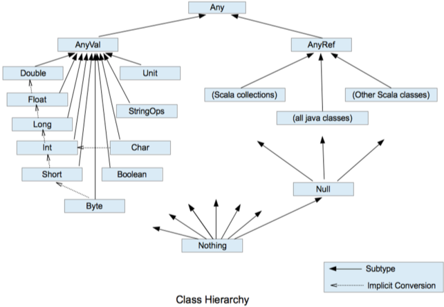
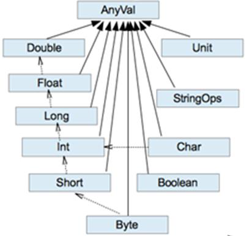

# 发展历史

马丁 奥德斯基  Martin Odersky  于2001年开始设计 Scala

# 一些 Scala 的小案例

```scala
package com.connor.chapter01

/*
  Object: 关键字，声明一个单例对象（伴生对象）
 */

object HelloWorld {

  /*
    main 方法：从外部可以直接调用执行的方法
    def methodName(paramsName: paramsType): returnType = {method}
   */
  def main(args: Array[String]): Unit = {

    println("Hello World!")

    // 可以从 java 中调用类库
    System.out.println("Hello Scala from Java")

  }

}
```

```java
// java 中的 Student 实现功能

public class Student {

    private String name;
    private Integer age;

    private static String school = "HSTC";

    public Student (String name, Integer age) {
        this.name = name;
        this.age = age;
    }

    public void printInfo () {
        System.out.println(this.name + " " + this.age + " " + Student.school);
    }

    public static void main (String[] args) {
        Student connor = new Student("connor", 26);
        Student xin = new Student("xin", 26);
        connor.printInfo();
        xin.printInfo();

    }

}
```

```scala
// scala 中 Student 实现功能

package com.connor.chapter01

class Student (name: String, age: Int) {

  def printInfo(): Unit = {
    println(this.name + " " + this.age + " " + Student.school)  // this 也可以不写
  }

}

// 引入伴生对象 相伴相生 名字必须一样
// 把全局只有一份的属性 放进全局只有一份的伴生对象中
object Student {
  val school: String = "HSTC"  // 共有的

  def main(args: Array[String]): Unit = {
    val connor = new Student("connor", 26)
    val xin = new Student("xin", 26)

    connor.printInfo()
    xin.printInfo()
  }
}
```

# 注释

```
单行注释  //
多行注释  /* */
文档注释
/**
 *
 */
```

# 变量和数据类型

## 变量和常量

**常量** 在程序执行的过程中，其值不会被改变的变量

```
var 变量名 [: 变量类型] = value
var i: Int = 10

val 常量名 [: 常量类型] = value
val j: Int = 20


注意
1 声明变量时，类型可以省略，编译器自动推导，即类型推导
2 类型确定后，就不能修改，说明 Scala 是强数据类型语言
3 变量声明时，必须要有初始值
4 在声明 / 定义一个变量时，可以使用 var 或 val 来修饰，var 修饰的变	 量可改变，val 修饰的变量不可变
```

<u>能用常量的地方不用变量</u>

```scala
package com.connor.chapter02

/*
2023/03/27
variable example
*/


object Variable {
  def main(args: Array[String]): Unit = {

    // 声明一个变量的通用语法
    var a: Int = 33
    var b = 333

    //    b = "xx"  // 不允许！数据类型不能改变

    // 常量声明
    val c = 3

    println(a, b, c)

  }
}
```

```
output
(33,333,3)
```


## 标识符的命名规范

基本与 java 一致，细节有一点变化

1. 以字母或下划线开头，后接数字、字母、下划线
2. 以操作符开头且只包含操作符 (+ - * / # ! 等)
3. 用反引号 `...` 包括的任意字符串，即使是 Scala 关键字也可以

## 字符串

```
基本语法
字符串通过 + 连接
printf用法: 字符串 通过 % 传值
字符串模板（插值字符串）: 通过 $ 获取变量值
```

```scala
package com.connor.chapter02

/*
2023/3/27    StringTest.scala
*/


object StringTest {
  def main(args: Array[String]): Unit = {

    // 通过 + / * 连接
    val name: String = "connor"
    val age: Int = 21
    println(age + "岁的" + name + "在 HSTC 学习")
    println(name * 3)  // 将一个字符串复制多次

    // printf  通过 % 传值  <格式化输出>
    printf("%d 岁的 %s 在 HSTC 学习\n", age, name)

    // 字符串模板 / 插值字符串  通过 $ 获取变量值
    println(s"${age} 岁的 ${name} 在 HSTC 学习")

    val num = 2.1415926   // 默认是 Double
    val numf = 2.1415926f  // 添加 f 转换成 Float

    // 想要输出想要的小数位数
    println(f"The num is ${num}%2.2f.")  // 前面的2表示整个数的长度为2
    println(raw"The num is ${num}%2.2f.")  // 除了 $ 按照格式将变量填进去 其他都原样输出

    // 三引号表示字符串 保持多行字符串的原格式输出
      val sql = s"""
        |SELECT *
        |FROM student
        |WHERE name = ${name}
        |AND
        |age > ${age}
        |""".stripMargin
    println(sql)

  }
}
```

```
output
21岁的connor在 HSTC 学习
connorconnorconnor
21 岁的 connor 在 HSTC 学习
21 岁的 connor 在 HSTC 学习
The num is 2.14.
The num is 2.1415926%2.2f.

SELECT *
FROM student
WHERE name = connor
AND
age > 21
```

## 键盘输入 / 输出

用户用键盘输入数据

```
基本语法
StdIn.readLine()
StdIn.readShort()
StdIn.readDouble()
```

```scala
package com.connor.chapter02

import scala.io.StdIn

/**
 * @author w-xin
 * @date 2023/3/27 10:30
 * @version 1.0
 * @description UserInputTest.scala    User input value
 */

object UserInputTest {
  def main(args: Array[String]): Unit = {

    // 输入数据
    println("Input your name please:")
    val name: String = StdIn.readLine()
    println("Input your age please:")
    val age: Int = StdIn.readInt()

    // 输出用户输入的数据
    println(s"${name} 已经 ${age} 岁啦")
    
  }
}
```

## 读写文件

```scala
package com.connor.chapter02

import java.io.{File, PrintWriter}
import scala.io.Source

/**
 * @author w-xin
 * @date 2023/3/27 10:36
 * @version 1.0
 * @description 
 * FileIOTest.scala
 * the operation of file
 */

object FileIOTest {
  def main(args: Array[String]): Unit = {

    // 从文件读取数据
    Source.fromFile("scala_one\\src\\main\\resources\\FileIOTest.txt").foreach(print)

    // 将数据写入文件  scala 没有专门写入文件的工具
    // 直接调用 java 类
    val writer = new PrintWriter(new File("scala_one\\src\\main\\resources\\FileInput.txt"))
    writer.write("UM & XIN FOREVER!")
    writer.close()

  }
}
```

## 数据类型

Java 基本类型
`char, bytem short, int, long, float, double, boolean`

```
1 Scala 中一切数据都是对象，都是Any的子类。

2 Scala 中数据类型分为两大类：数值类型（AnyVal）、引用类型（AnyRef），不管是值类型还是引用类型都是对象。

3 Scala 数据类型仍然遵守，低精度的值类型向高精度值类型，自动转换（隐式转换）

4 Scala 中的 StringOps 是对 Java 中的 String 增强

5 Unit：对应Java 中的 void，用于方法返回值的位置，表示方法没有返回值。Unit 是一个数据类型，只有一个对象就是()。Void 不是数据类型，只是一个关键字

6 Null 是一个类型，只有一个对象就是null。它是
所有引用类型（AnyRef）的子类。

7 Nothing，是所有数据类型的子类，主要用在一个函数没有明确返回值时使
用，因为这样我们可以把抛出的返回值，返回给任何的变量或者函数。
```



**整数数据类型  Byte Short Int Long**

| 类型      | 描述                                                         |
| --------- | ------------------------------------------------------------ |
| Byte [1]  | 8 位有符号补码整数。数值区间为 -128 到 127                   |
| Short [2] | 16 位有符号补码整数。数值区间为 -32768 到 32767              |
| Int [4]   | 32 位有符号补码整数。数值区间为 -2147483648 到 2147483647    |
| Long [8]  | 64 位有符号补码整数。数值区间为 -9223372036854775808 到 9223372036854775807 = 2 的 (64-1) 次方 - 1 |

```scala
package com.connor.chapter02

/**
 * @author w-xin
 * @date 2023/3/27 11:22
 * @version 1.0
 * @description
 * IntTypeTest.scala
 * int type & transform
 */

object IntTypeTest {
  def main(args: Array[String]): Unit = {

    val a = 12  // 默认为 Int
    val b: Long = 123323425435634L  // 长整数定义

    val c: Byte = 10
    val d: Byte = (10 + 20)  // 可以输出
    println(d)

    // 要想强制转换 Byte
    val e: Byte = (10 + 20).toByte
    println(e)

  }
}
```

**浮点类型**

```scala
    val num = 2.1415926   // 默认是 Double
    val numf = 2.1415926f  // 添加 f 转换成 Float
```

**字符类型**

Char

```scala
package com.connor.chapter02

/**
 * @author w-xin
 * @date 2023/3/29 10:00
 * @version 1.0
 * @description
 */

object CharTest {
  def main(args: Array[String]): Unit = {

    val c1: Char = 'a'
    println("c1: " + c1)

    val c2: Char = '9'
    println("c2: " + c2)

    val c3: Char = '\t'
    val c4: Char = '\n'
    println("abc" + c3 + "def")
    println("abc" + c4 + "def")

    // 转义字符
    val c5 = '\\'
//    val c6 = '\"'
    println("abc" + c5 + "def")
    println("abc" + c6 + "def")

    // 字符变量底层保存 ASCII 码
    val i1: Int = c1
    println("i1: " + i1)

    val i2: Int = c2
    println("i2: " + i2)

    // 转换成 Char
    val c7: Char = (i1 + 1).toChar
    println("c7: " + c7)

    val c8: Char = (i2 + 1).toChar
    println("c8: " + c8)

  }
}
```

**Boolean 类型**

```scala
package com.connor.chapter02

/**
 * @author w-xin
 * @date 2023/3/29 10:17
 * @version 1.0
 * @description
 */

object BoolTest {
  def main(args: Array[String]): Unit = {

    val isTrue: Boolean = true
    println(isTrue)

  }
}
```

**Unit 类型  Null 类型  Nothing 类型**【💡】

| 类型    | 描述                                                         |
| ------- | :----------------------------------------------------------- |
| Unit    | 表示无值，和其他语言中 void 等同；用作不返回任何结果的方法的结果类型；Unit 只有一个实例值，写成 () |
| Null    | null, Null 类型只有一个实例值 null                           |
| Nothing | Nothing 类型在 Scala 的类层级最低端；它是任何其他类型的子类型。 当一个函数，我们确定没有正常的返回值，可以用 Nothing 来指定返回类型，这样有一个好处，就是我们可以把返回的值（异常）赋给其它的函数或者变量（兼容性） |

```scala
package com.connor.chapter02

import com.connor.chapter01.Student

/**
 * @author w-xin
 * @date 2023/3/29 10:21
 * @version 1.0
 * @description
 */

object EmptyTest {
  def main(args: Array[String]): Unit = {

    // 空值 Unit
    def m1(): Unit = {
      println("m1 被调用执行")
    }

    // a 就是返回 空 ()
    val a = m1()
    println(a)


    // 空引用 Null
//    val n: Int = null  // error

    var student = new Student("connor", 18)
    student = null  // 没问题
    println(student)


    // Nothing  比较特殊
//    def m2(n: Int): Nothing = {
//      throw new NullPointerException
//    }

//    val b = m2(0)
    ////    println(b)  // 直接抛空指针异常

    def m3(n: Int): Int = {  // Nothing 是所有类型的子类
      // 结合场景使用 Nothing
      if (n == 0)
        throw new NullPointerException
      else
        return n
    }

    val c = m3(3)
    println("c: " + c)


  }
}
```

## 数据类型转换

**Java 自动类型转换  (隐式转换)**

```java
package org.example;

/**
 * @author w-xin
 * @version 1.0
 * @date 2023/3/29 10:50
 * @description
 * java 中的数据类型转换
 */

public class TypeTransformTest {
    public static void main(String[] args) {

        byte b = 10;
        test(b);  // 自动类型转换
        
        // 强制类型转换
        char c = 'a';
        short c2 = (short)c;
        test(c2)


    }
//    注释掉 byte 方法
//    public static void test (byte b) {
//        System.out.println("bbbb");
//    }

//    public static void test (short b) {
//        System.out.println("ssss");
//    }

    public static void test (char b) {
        System.out.println("cccc");
    }

    public static void test (int b) {
        System.out.println("iiii");
    }

}
```

**Scala 自动类型转换**



- 自动提升原则
  有多种类型的数据混合运算时，系统首先自动将所有数据转换成精度大的那种数据类型 ，然后再进行计算。
- 把精度大的数值类型赋值给精度小的数值类型时，就会报错 ，反之就会进行自动类型转换。
- (byte short) 和 char 之间不会相互自动转换。
- byte short char 他们三者可以计算， 在计算时首先转换为 int 类型 。

```scala
package com.connor.chapter02

/**
 * @author w-xin
 * @date 2023/3/30 20:26
 * @version 1.0
 * @description
 *
 */

object DataTypeTransform {
  def main(args: Array[String]): Unit = {

    //  -自动提升原则
    //  有多种类型的数据混合运算时 系统首先自动将所有数据转换成精度大的那种数据类型 然后再进行计算
    val a: Byte = 10
    val b: Long = 2333  // 低精度赋值给高精度可以自动类型转换
    // 以下是不可行的 不能够定义 result 为 Int
    // 混合运算必须是以最高的精度 Long 为准
//    val result: Int = a + b
    val result: Long = a + b
    // 必须要为 Int 时 就要进行强制类型转换
    val resultIn: Int = a + b.toInt


    //  -把精度大的数值类型赋值给精度小的数值类型时 就会报错 反之就会进行自动类型转换
    val a2: Byte = 10
    val b2: Int = a2  // 此赋值没问题
//    val c2: Byte = b2  // 报错 需要强转


    //  -(byte short) 和 char 之间不会相互自动转换
    val a3: Byte = 10
//    val b3: Char = a3  // 行不通
    val b3: Char = 'b'
//    val c3: Byte = b3  // 本身不报错 编译运行报错 需要强转
//    println(c3)

    //  -byte short char 他们三者可以计算 在计算时首先转换为 int 类型

  }
}
```

**Scala 强制类型转换**

**注意！在使用强制类型转换时，有可能造成精度降低或溢出**

- 将数据由高精度转换为低精度 ，就需要使用到强制转换
- 强转符号只针对于最近的操作数有效，往往会使用小括号提升优先级

```scala
package com.connor.chapter02

/**
 * @author w-xin
 * @date 2023/3/30 20:26
 * @version 1.0
 * @description
 *
 */

object DataTypeTransform {
  def main(args: Array[String]): Unit = {

    // 强制类型转换
    // -将数据由高精度转换为低精度 就需要使用到强制转换
//    val n1: Int = 2.5.toInt
//    println(n1)  // 2  不会四舍五入
    val n1: Int = -2.9.toInt
//    println(n1)  // -2  仅仅取整


    // -强转符号只针对于最近的操作数有效 往往会使用小括号提升优先级
//    val n2: Int = 2.6 + 3.7.toInt  // 此时的 .toInt 只针对3.7进行转换  2.6依旧是 Double 类型
    val n2: Int = (2.6 + 3.7).toInt  // 添加小括号
//    println(n2)


    // 数值类型和 String 类型的转换
    // 数值转 String
    val n: Int = 333
    val s: String = n + ""  // 加上空引号即可  .toString 也可

    // String 转数值
    val m: Int = "12".toInt
    val f: Float = "12.3".toFloat
//    val f2: Int = "12.3".toInt  // 编译不出错 运行出错
//    println(f)
//    println(f2)

  }
}
```

**面试题**

```scala
package com.connor.chapter02

/**
 * @author w-xin
 * @date 2023/4/3 10:45
 * @version 1.0
 * @description
 * 一个 scala 的面试题
 */


/*
 128: Int 类型，在计算机底层占据4个字节，32位
 原码  0000 0000 0000 0000 0000 0000 1000 0000
 补码  0000 0000 0000 0000 0000 0000 1000 0000

 截取最后一个字节  转换 Byte
 1000 0000    1 表示负数
 表示最大负数  -128
 */


object interviewTest {
  def main(args: Array[String]): Unit = {

    val n: Int = 130
    // 对 n 进行强转为 Byte
    val b: Byte = n.toByte  // Byte 最大为127
    println(b)  // result: -126

  }
}
```

# 运算符

Scala 运算符使用和 Java 运算符的使用基本相同，只有个别细节上不同

## 算术运算符

```scala
package com.connor.chapter03

/**
 * @author w-xin
 * @date 2023/4/3 11:01
 * @version 1.0
 * @description
 */

object ComputeOperatorTest {
  def main(args: Array[String]): Unit = {

    // 除法
    val divide: Int = 10 / 3  // 整数除法默认得到的结果是整型
    println(divide)  // 3

    // 尝试把 divide 类型设为 Double
    val divide02: Double = 10 / 3  // 运算顺序  10 / 3 -- Double
    println(divide02)  // 3.0

    // 有小数结果的除法
    val divide03: Double = 10.0 / 3  // 两个数值有其一是 Double 类型
    println(divide03)  // 3.3333333333333335


    // 取余
     val mod: Int = 10 % 3
    println(mod)  // 1

  }
}
```

## 关系运算符 / 比较运算符

**Java 中的关系运算符**

```java
package org.example;

/**
 * @author w-xin
 * @version 1.0
 * @date 2023/4/3 11:12
 * @description
 * 关系 / 比较运算符
 */

public class RelationOperatorTest {
    public static void main(String[] args) {

        String s01 = "hello";
        String s02 = new String("hello");

        Boolean isEqual = s01 == s02;
        System.out.println(isEqual);  // false  此方法是判断引用地址是否相同

        // 判断变量内具体的内容
        System.out.println(s01.equals(s02));  // true

    }
}
```

**Scala 中的关系运算符**

```scala
package com.connor.chapter03

/**
 * @author w-xin
 * @date 2023/4/3 11:18
 * @version 1.0
 * @description
 */

object RelationOpratorTest {
  def main(args: Array[String]): Unit = {

    val s1: String = "hello"
    val s2: String = new String("hello")

    // 进行比较
    println(s1 == s2)  // true
    println(s1.equals(s2))  // 相当于 s1 == s2

    // 对引用地址进行比较
    println(s1.eq(s2)) // false

  }
}
```

## 逻辑运算符

用于连接多个条件（一般来讲就是关系表达式）最终结果也是一个 Boolean 值

A: true
B: false

| 运算符 | 描述   | 实例            |
| ------ | ------ | --------------- |
| &&     | 逻辑与 | (A && B) false  |
| \|\|   | 逻辑或 | (A \|\| B) true |
| !      | 逻辑非 | !(A && B) true  |

```scala
package com.connor.chapter03

/**
 * @author w-xin
 * @date 2023/4/4 8:05
 * @version 1.0
 * @description
 */

object LogisticOperatorTest {
  def main(args: Array[String]): Unit = {

    def m(n: Int): Int = {  // 查看运算符后面是否执行
      println("m 被调用")

      return n
    }
    val n = 1
//    println((4 > 5) && m(n) > 0)  // false  后面被短路
    println((4 < 5) && m(n) > 0)  // m 被调用  true


    // 判断一个字符串是否为空
    def isNotEmpty(str: String): Boolean = {
      return str != null && ! ("".equals(str.trim))
    }

    println(isNotEmpty(null))  // false

  }
}
```

## 赋值运算符

**Java 中**

```java
package org.example;

/**
 * @author w-xin
 * @version 1.0
 * @date 2023/4/4 8:20
 * @description
 */

public class EvaluationOperatorTest {
    public static void main(String[] args) {

        byte b = 10;
        b = 20;  // 更改
//        b = b + 1;  // 不可行  b 是 byte 类型  1 是 int 类型  往高精度转换必须得强转
        b += 1;  // += 就没有限制  默认强转


        // 自增自减
        int x = 13;
        int y = x ++;  // x 先赋值给 y  x 再自增
        System.out.println("x = " + x + ", y = " + y);  // x = 14, y = 13

        int a = 13;
        int c = ++ a;
        System.out.println("a = " + a + ", c = " + c);  // a = 14, c = 14

        x = 33;
        x = x ++;
        System.out.println(x);  // 33


    }
}
```

**Scala 中**

```scala
package com.connor.chapter03

/**
 * @author w-xin
 * @date 2023/4/4 8:32
 * @version 1.0
 * @description
 * Scala 中没有自增自减运算
 */

object EvaluationOperatorTest {
  def main(args: Array[String]): Unit = {

//    var a: Byte = 10
//    a += 1  // 本身不报错 运行报错
//    println(a)

    var i: Int = 33
    i += 1
    println(i)  // 34

  }
}
```

## 位运算符

## 运算符的本质

运算符的底层都是对象的方法调用

```scala
val n1: Int = 12
val n2: Int = 33

println(n1.+(n2))  // n1 + n2
println(n1 + (n2))  // n1 + n2
```

# 流程控制

## 单分支控制

```scala
package com.connor.chapter04

import scala.io.StdIn

/**
 * @author w-xin
 * @date 2023/4/4 9:09
 * @version 1.0
 * @description
 */

object SingleIfElseTest {
  def main(args: Array[String]): Unit = {

    println("请输入您的年龄")
    // 键盘输入
    val age: Int = StdIn.readInt()

    if (age >= 18) {
      println("成年")
    }
    
  }
}
```

## 双分支控制

```scala
package com.connor.chapter04

import scala.io.StdIn

/**
 * @author w-xin
 * @date 2023/4/4 9:12
 * @version 1.0
 * @description
 */

object DoubleIfElseTest {
  def main(args: Array[String]): Unit = {

    println("请输入您的年龄")
    // 键盘输入
    val age: Int = StdIn.readInt()

    if (age >= 18) {
      println("成年")
    } else {
      println("未成年")
    }

  }
}
```

## 多分支控制

```scala
package com.connor.chapter04

import scala.io.StdIn

/**
 * @author w-xin
 * @date 2023/4/4 9:15
 * @version 1.0
 * @description
 */

object MultiIfElseTest {
  def main(args: Array[String]): Unit = {

    println("请输入您的年龄")
    // 键盘输入
    val age: Int = StdIn.readInt()

    if (age <= 6) {
      println("童年")
    } else if (age < 18) {
      println("青少年")
    } else if (age < 35) {
      println("青年")
    } else if (age < 60) {
      println("中年")
    } else {
      println("老年")
    }

  }
}
```

## 分支控制的返回值

```scala
package com.connor.chapter04

import scala.io.StdIn

/**
 * @author w-xin
 * @date 2023/4/4 9:15
 * @version 1.0
 * @description
 */

object MultiIfElseTest {
  def main(args: Array[String]): Unit = {

    println("请输入您的年龄")
    // 键盘输入
    val age: Int = StdIn.readInt()

    val result: Unit = if (age <= 6) {
      println("童年")
    } else if (age < 18) {
      println("青少年")
    } else if (age < 35) {
      println("青年")
    } else if (age < 60) {
      println("中年")
    } else {
      println("老年")
    }

    println("result: " + result)
    
  }
}


"""
请输入您的年龄
26
青年
result: ()
"""
```

```scala
package com.connor.chapter04

import scala.io.StdIn

/**
 * @author w-xin
 * @date 2023/4/4 9:15
 * @version 1.0
 * @description
 */

object MultiIfElseTest {
  def main(args: Array[String]): Unit = {

    println("请输入您的年龄")
    // 键盘输入
    val age: Int = StdIn.readInt()

    val result: String = if (age <= 6) {
      println("童年")
      "童年"
    } else if (age < 18) {
      println("青少年")
      "青少年"
    } else if (age < 35) {
      println("青年")
      "青年"
    } else if (age < 60) {
      println("中年")
      "中年"
    } else {
      println("老年")
      "老年"
    }

    println("result: " + result)
    
  }
}


"""
请输入您的年龄
26
青年
result: 青年
"""
```

## 嵌套分支

